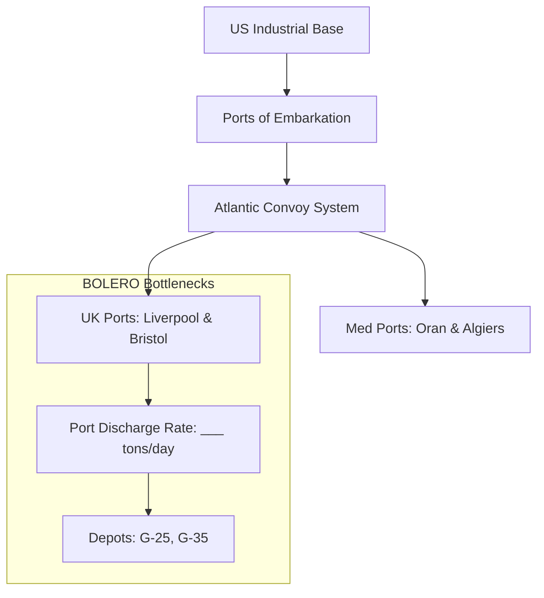

# Chapter 1: Logistics and Strategy, Spring 1943

## 1. Context & Core Themes
In the spring of 1943, following the Casablanca Conference (ANFA), Allied strategic planners faced the monumentally complex task of translating global strategic decisions into concrete logistical realities. The main tension lay between the BOLERO build-up in the United Kingdom for a cross-channel invasion, the continuation of operations in the Mediterranean (planning for HUSKY), and the shipping demands of the Pacific and Lend-Lease commitments.

---

## 2. Interactive Study Fill-ins (Details to Fill In)
*To complete your study of this chapter, research and fill in the missing metrics below:*

- **Casablanca Conference Target Dates:**
  - The agreed target date for the cross-channel invasion (envisioned for 1944) was originally codenamed: `[___________]`
  - The target BOLERO troop shipment rate in early 1943 was planned at `[___________]` troops/month, though actual shipments fell to `[___________]` in March due to shipping shortages.
- **Merchant Shipping Pool:**
  - In Spring 1943, the global pool of Allied merchant shipping stood at approximately `[___________]` deadweight tons (dwt).
  - The estimated net cargo capacity loss due to the German U-boat campaign in the Atlantic during March 1943 was `[___________]` tons.

---

## 3. Logistical Architecture (Mermaid.js Diagram)
Complete or extend this diagram depicting the logistical workflows, command hierarchies, or pipelines of this chapter.



---

## 4. Quantitative Modeling: Logistics and Strategy, Spring 1943
Logistical throughput is constrained by the turnaround time ($T$) of cargo vessels. We model the turnaround time in days for a single convoy cycle as a function of distance, speed, port delays, and convoy assembly time.

### Mathematical Formulation
$T = \frac{2D}{24 \cdot V} + L_{port} + U_{port} + D_{convoy}$

### Scala 3.8.3 Implementation
Below is the compile-safe Scala 3.8.3 model representing these parameters:

```scala
package Logistics.Spring1943

import scala.annotation.targetName

opaque type NauticalMiles = Double
object NauticalMiles:
  def apply(value: Double): NauticalMiles = value
  extension (nm: NauticalMiles) def toDouble: Double = nm

opaque type Knots = Double
object Knots:
  def apply(value: Double): Knots = value
  extension (k: Knots) def toDouble: Double = k

opaque type Days = Double
object Days:
  def apply(value: Double): Days = value
  extension (d: Days)
    def toDouble: Double = d
    @targetName("addDays")
    def +(other: Days): Days = Days(d + other.toDouble)

case class PortParameters(
  loadingTime: Days,
  unloadingTime: Days,
  convoyDelay: Days
)

object ConvoyModel:
  def calculateTurnaround(
    distance: NauticalMiles,
    speed: Knots,
    ports: PortParameters
  ): Days =
    val transitDays = Days((2.0 * distance.toDouble) / (24.0 * speed.toDouble))
    transitDays + ports.loadingTime + ports.unloadingTime + ports.convoyDelay
```

---

## 5. Strategic Discussion Questions
1. Why did the high troop-to-service ratio in Spring 1943 limit the offensive capability of the Allied armies in the Mediterranean?
2. Detail how the "ship-against-division" calculation influenced General George C. Marshall’s strategy regarding the timing of Operation OVERLORD.
