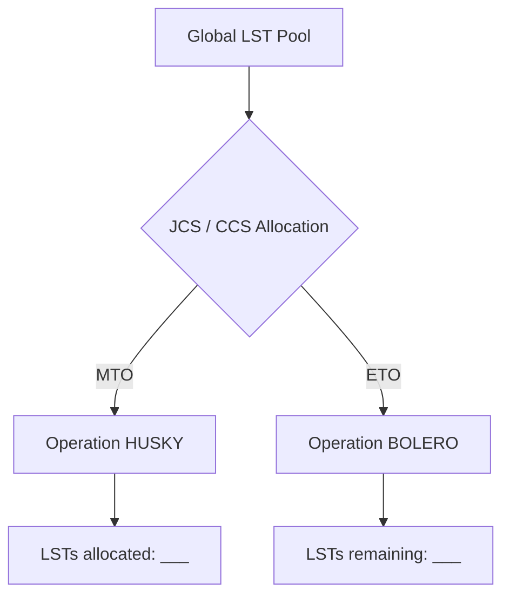

01-Logistics-and-Strategy-Spring-1943.md# Chapter 2: Husky and Bolero

## 1. Context & Core Themes
This chapter focuses on the severe strategic conflict between two massive operations in mid-1943: Operation HUSKY (the amphibious invasion of Sicily) and Operation BOLERO (the long-term logistical build-up in the UK). The core logistical bottleneck was the allocation of Landing Craft (specifically LSTs, LCIs, and LCTs) and combat-loaded troop transports.

---

## 2. Interactive Study Fill-ins (Details to Fill In)
*To complete your study of this chapter, research and fill in the missing metrics below:*

- **Landing Craft Allocations:**
  - The total number of LSTs (Landing Ship, Tank) required for the initial assault phase of Operation HUSKY was `[___________]`.
  - The Joint Chiefs of Staff (JCS) agreed to withdraw `[___________]` LSTs from the BOLERO pool to support HUSKY.
- **The BOLERO Slowdown:**
  - In May 1943, the troop strength in the United Kingdom was supposed to reach `[___________]` but actually stood at `[___________]` due to Mediterranean diversions.

---

## 3. Logistical Architecture (Mermaid.js Diagram)
Complete or extend this diagram depicting the logistical workflows, command hierarchies, or pipelines of this chapter.



---

## 4. Quantitative Modeling: Husky and Bolero
The resource conflict between HUSKY and BOLERO can be modeled as a resource allocation problem under a hard ceiling where allocations must satisfy minimum operational thresholds for both theaters.

### Mathematical Formulation
$X_{H} + X_{B} \le C_{total}, \quad X_{H} \ge X_{H}^{min}, \quad X_{B} \ge X_{B}^{min}$

### Scala 3.8.3 Implementation
Below is the compile-safe Scala 3.8.3 model representing these parameters:

```scala
package Logistics.HuskyBolero

import scala.collection.immutable.List

case class CraftPool(totalLST: Int)

case class Allocation(huskyLST: Int, boleroLST: Int):
  def isValid(pool: CraftPool): Boolean =
    huskyLST + boleroLST <= pool.totalLST

object ResourceAllocator:
  def findFeasibleAllocations(
    pool: CraftPool,
    minHusky: Int,
    minBolero: Int
  ): List[Allocation] =
    for
      h <- (minHusky to pool.totalLST).toList
      b = pool.totalLST - h
      if b >= minBolero
    yield Allocation(h, b)
```

---

## 5. Strategic Discussion Questions
1. How did the British and American viewpoints differ at the Washington Conference regarding the trade-offs between HUSKY and BOLERO?
2. What role did the "Anvil" (later "Dragoon") debate play in the landing craft allocation disputes of early 1943?
