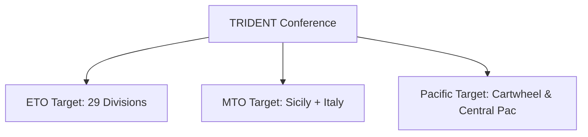

# Chapter 3: The TRIDENT Conference

## 1. Context & Core Themes
The TRIDENT Conference (Washington, May 1943) established the global strategy for the remainder of 1943 and early 1944. It forced a critical evaluation of resource distribution between the European Theater of Operations (ETO), the Mediterranean Theater of Operations (MTO), and the Pacific theaters, balancing political pressures and material realities.

---

## 2. Interactive Study Fill-ins (Details to Fill In)
*To complete your study of this chapter, research and fill in the missing metrics below:*

- **Strategic Resource Divisions:**
  - TRIDENT set the target date for the cross-channel invasion (OVERLORD) as `[___________]`.
  - The conference authorized an increase in Pacific air strength by adding `[___________]` air squadrons.
  - Planners calculated that supporting the Pacific operations required a shipping allocation of `[___________]` tons per month.

---

## 3. Logistical Architecture (Mermaid.js Diagram)
Complete or extend this diagram depicting the logistical workflows, command hierarchies, or pipelines of this chapter.



---

## 4. Quantitative Modeling: The TRIDENT Conference
Multi-theater resource allocation balances priorities by assigning strategic weights to theaters and computing the optimal supply distribution factor based on utility and distance costs.

### Mathematical Formulation
$S_i = \frac{W_i \cdot C_{total}}{\sum_{j} W_j} \cdot (1 - \theta_i)$

### Scala 3.8.3 Implementation
Below is the compile-safe Scala 3.8.3 model representing these parameters:

```scala
package Logistics.Trident

import scala.collection.immutable.Map

case class Theater(name: String, weight: Double, distancePenalty: Double)

object TridentPrioritization:
  def allocateSupplies(
    theaters: List[Theater],
    totalSupplies: Double
  ): Map[String, Double] =
    val totalWeight = theaters.map(t => t.weight * (1.0 - t.distancePenalty)).sum
    theaters.map { t =>
      val adjustedWeight = t.weight * (1.0 - t.distancePenalty)
      t.name -> (adjustedWeight / totalWeight) * totalSupplies
    }.toMap
```

---

## 5. Strategic Discussion Questions
1. How did TRIDENT resolve the fundamental disagreement between Roosevelt and Churchill on the expansion of Mediterranean operations?
2. To what extent did Pacific shipping requirements limit the ETO troop build-up scheduled at TRIDENT?
