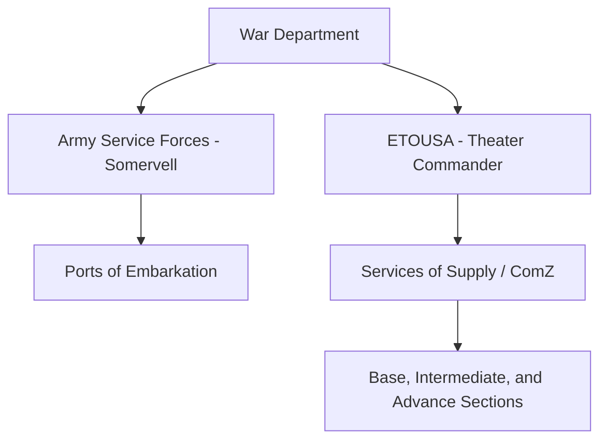

# Chapter 4: Logistical Organization

## 1. Context & Core Themes
This chapter details the restructuring of the Army Service Forces (ASF) under Lt. Gen. Brehon B. Somervell and the creation of Theater of Operations structures (ETOUSA, SOS in Europe). It highlights the massive organizational friction of managing wholesale logistics across globally dispersed commands.

---

## 2. Interactive Study Fill-ins (Details to Fill In)
*To complete your study of this chapter, research and fill in the missing metrics below:*

- **Organizational Milestones:**
  - The Services of Supply (SOS) in the European Theater was redesignated the Communications Zone (ComZ) on `[___________]`.
  - Under Somervell's reorganization, the Technical Services of the Army were consolidated into `[___________]` major corps (including Quartermaster, Ordnance, and Engineers).

---

## 3. Logistical Architecture (Mermaid.js Diagram)
Complete or extend this diagram depicting the logistical workflows, command hierarchies, or pipelines of this chapter.



---

## 4. Quantitative Modeling: Logistical Organization
We model the organizational communication latency ($L$) as a function of hierarchical depth ($D$) and span of control ($S$) where nodes route logistical requests downstream.

### Mathematical Formulation
$L = D \cdot \log_e(S) + T_{processing}$

### Scala 3.8.3 Implementation
Below is the compile-safe Scala 3.8.3 model representing these parameters:

```scala
package Logistics.Organization

import scala.math.log

case class Hierarchy(depth: Int, spanOfControl: Int)

object OrganizationModel:
  def calculateCommunicationLatency(
    h: Hierarchy,
    processingDelay: Double
  ): Double =
    h.depth * log(h.spanOfControl.toDouble) + processingDelay
```

---

## 5. Strategic Discussion Questions
1. Discuss the command conflicts between General Dwight D. Eisenhower (as Theater Commander) and General Somervell (as ASF Commander) regarding control over logistics in North Africa and England.
2. How did the division of the theater into Base, Intermediate, and Advance Sections prevent double-handling of materials?
