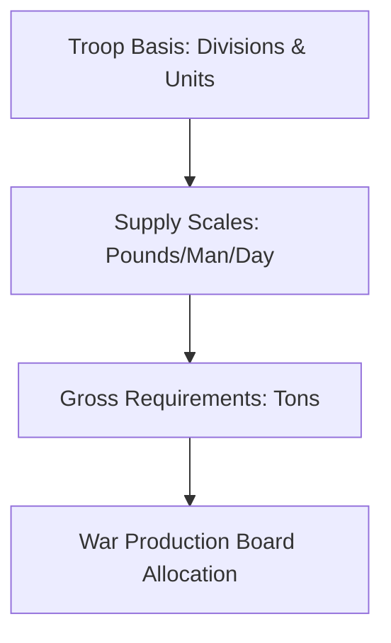

# Chapter 5: Army Requirements, 1943-44

## 1. Context & Core Themes
Determining the material requirements for an army of millions of men required predicting future combat conditions, equipment replacement factors, and maintenance pipelines. This chapter covers the compilation of the "Victory Program" and the formulation of the Troop Basis and Supply Scales.

---

## 2. Interactive Study Fill-ins (Details to Fill In)
*To complete your study of this chapter, research and fill in the missing metrics below:*

- **Requirement Planning:**
  - The standard daily maintenance requirement for a US soldier in the field in 1943 was calculated at `[___________]` pounds of supply per day.
  - The "Troop Basis" for 1943 authorized a maximum mobilization strength of `[___________]` officers and men.
  - The replacement factor (loss rate) for medium tanks in combat was estimated in requirements planning to be `[___________]`% per month.

---

## 3. Logistical Architecture (Mermaid.js Diagram)
Complete or extend this diagram depicting the logistical workflows, command hierarchies, or pipelines of this chapter.



---

## 4. Quantitative Modeling: Army Requirements, 1943-44
Requirement forecasting models future monthly tonnage requirements ($R_{month}$) using the troop strength ($P$), the daily supply factor ($F_{day}$), and an equipment loss/replacement buffer ($B$).

### Mathematical Formulation
$R_{month} = \\left( P \\cdot F_{day} \\cdot 30 \\right) \\cdot (1 + B)$

### Scala 3.8.3 Implementation
Below is the compile-safe Scala 3.8.3 model representing these parameters:

```scala
package Logistics.Requirements

opaque type Troops = Int
object Troops:
  def apply(value: Int): Troops = value
  extension (t: Troops) def toInt: Int = t

opaque type PoundsPerDay = Double
object PoundsPerDay:
  def apply(value: Double): PoundsPerDay = value
  extension (p: PoundsPerDay) def toDouble: Double = p

object RequirementForecaster:
  def forecastMonthlyTons(
    troops: Troops,
    factor: PoundsPerDay,
    buffer: Double
  ): Double =
    val lbsPerMonth = troops.toInt * factor.toDouble * 30.0
    val tonsPerMonth = lbsPerMonth / 2000.0
    tonsPerMonth * (1.0 + buffer)
```

---

## 5. Strategic Discussion Questions
1. Explain how the discrepancy between "production capability" (WPB) and "military requirements" (ASF) was resolved in the mid-war period.
2. What are the dangers of overestimating replacement factors, and how did it lead to the "overstocking" crisis of late 1943?
