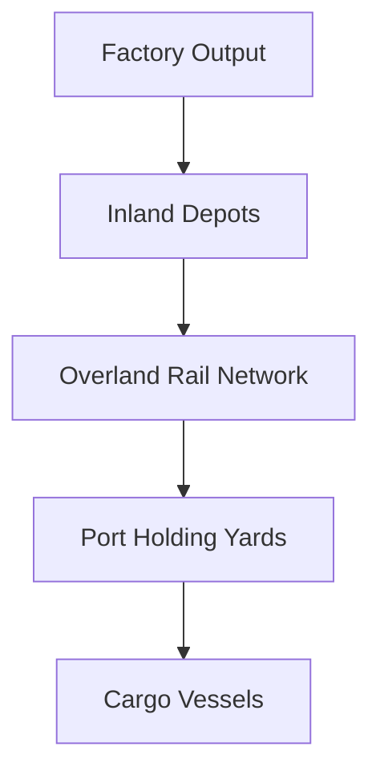

# Chapter 6: The Mechanics of Wholesale Distribution

## 1. Context & Core Themes
This chapter explores the physical mechanics of logistics: moving supplies from US factories to depots, port clearances, and cargo loading. It introduces the vital concepts of balanced cargo loading (combining heavy and volumetric cargo) to maximize the utilization of ship capacity.

---

## 2. Interactive Study Fill-ins (Details to Fill In)
*To complete your study of this chapter, research and fill in the missing metrics below:*

- **Distribution Capabilities:**
  - The "overland rail movement" from interior depots to Atlantic ports reached a peak of `[___________]` carloads per day in late 1943.
  - Balanced loading required maintaining a ship's density of approximately `[___________]` cubic feet per measurement ton.

---

## 3. Logistical Architecture (Mermaid.js Diagram)
Complete or extend this diagram depicting the logistical workflows, command hierarchies, or pipelines of this chapter.



---

## 4. Quantitative Modeling: The Mechanics of Wholesale Distribution
To prevent a vessel from "filling its volume" before "reaching its weight limit" (or vice versa), cargo must be balanced. The optimal ratio of heavy cargo ($M_{heavy}$) to light/volumetric cargo ($M_{light}$) is derived based on vessel weight limit ($W_{max}$) and volumetric capacity ($V_{max}$).

### Mathematical Formulation
$S_f \\cdot M_{heavy} + S_l \\cdot M_{light} \\le V_{max} \\quad \\text{and} \\quad M_{heavy} + M_{light} \\le W_{max}$

### Scala 3.8.3 Implementation
Below is the compile-safe Scala 3.8.3 model representing these parameters:

```scala
package Logistics.Distribution

case class VesselConstraints(weightCapacityTons: Double, volumeCapacityCuFt: Double)
case class CargoProperties(heavyStowageFactor: Double, lightStowageFactor: Double)

object DistributionOptimizer:
  def calculateMaxCargo(
    v: VesselConstraints,
    c: CargoProperties
  ): (Double, Double) =
    // Solving the linear system:
    // H * Sf + L * Sl = V
    // H + L = W
    // H = (V - W * Sl) / (Sf - Sl)
    val heavy = (v.volumeCapacityCuFt - v.weightCapacityTons * c.lightStowageFactor) / 
                (c.heavyStowageFactor - c.lightStowageFactor)
    val light = v.weightCapacityTons - heavy
    (heavy, light)
```

---

## 5. Strategic Discussion Questions
1. What was the purpose of the "Holding and Reconsignment Points" (H&RPs) in the US railroad transport system, and how did they prevent port congestion?
2. Detail the difference between "Measurement Tons" (40 cubic feet) and "Long Tons" (2240 lbs), and why this distinction was vital for ship planning.
