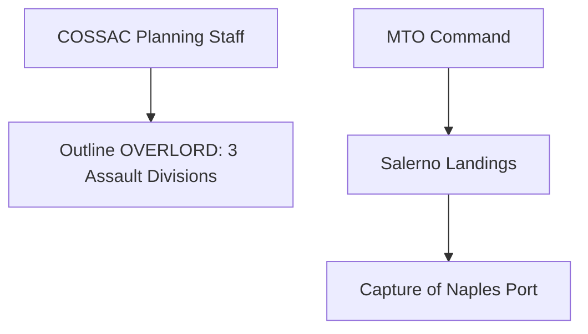

# Chapter 7: Outline OVERLORD and the Invasion of Italy

## 1. Context & Core Themes
While COSSAC (Chief of Staff to the Supreme Allied Commander) drafted the outline plan for Operation OVERLORD in London, the Allied forces in the Mediterranean launched invasions of the Italian mainland (Salerno/Operation AVALANCHE). This double commitment tested the limits of port clearance and shipping capacities.

---

## 2. Interactive Study Fill-ins (Details to Fill In)
*To complete your study of this chapter, research and fill in the missing metrics below:*

- **Assault Parameters:**
  - The COSSAC outline plan for OVERLORD, presented in mid-1943, envisioned an initial assault force of `[___________]` divisions.
  - The Salerno landings (AVALANCHE) on D-Day (`[___________]`) suffered from a major shortage of amphibious shipping, with only `[___________]` combat-loaded ships available.

---

## 3. Logistical Architecture (Mermaid.js Diagram)
Complete or extend this diagram depicting the logistical workflows, command hierarchies, or pipelines of this chapter.



---

## 4. Quantitative Modeling: Outline OVERLORD and the Invasion of Italy
Port throughput ($P_{throughput}$) is constrained by berth occupancy rates, discharge rates per hook-hour, and truck evacuation capacity.

### Mathematical Formulation
$P_{throughput} = B \\cdot R_{discharge} \\cdot 24 \\cdot E_{efficiency}$

### Scala 3.8.3 Implementation
Below is the compile-safe Scala 3.8.3 model representing these parameters:

```scala
package Logistics.OverlordItaly

case class PortSpecs(berths: Int, dischargeRateTonsPerHour: Double, efficiency: Double)

object PortThroughputModel:
  def dailyCapacity(specs: PortSpecs): Double =
    specs.berths * specs.dischargeRateTonsPerHour * 24.0 * specs.efficiency
```

---

## 5. Strategic Discussion Questions
1. Why did the COSSAC staff believe that the three-division assault limit for OVERLORD was logistically mandatory, and who later insisted on expanding it?
2. Analyze how the destruction of the Port of Naples by retreating German forces impacted the logistical support of the Fifth Army in Italy.
