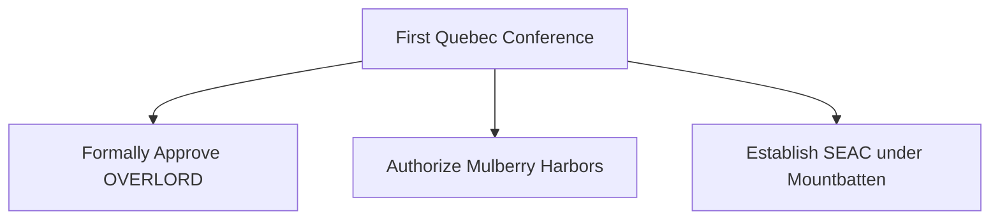

# Chapter 8: First Quebec Conference (QUADRANT)

## 1. Context & Core Themes
At the QUADRANT Conference (August 1943), the Combined Chiefs of Staff formally approved the COSSAC plan for OVERLORD and established a concrete pipeline of resources. It also marked the creation of the Southeast Asia Command (SEAC) to reorganize the chaotic CBI theater.

---

## 2. Interactive Study Fill-ins (Details to Fill In)
*To complete your study of this chapter, research and fill in the missing metrics below:*

- **QUADRANT Decisions:**
  - The target date for OVERLORD was finalized as `[___________]` (month/year).
  - The Allied leaders agreed to prioritize the construction of `[___________]` artificial harbors (Mulberry harbors) to bypass French ports in the early stages of the invasion.

---

## 3. Logistical Architecture (Mermaid.js Diagram)
Complete or extend this diagram depicting the logistical workflows, command hierarchies, or pipelines of this chapter.



---

## 4. Quantitative Modeling: First Quebec Conference (QUADRANT)
Logistical pipeline lead time ($L_{total}$) accounts for manufacturing, transit, depot processing, and final delivery, creating a temporal delay before resource changes take effect in theater.

### Mathematical Formulation
$L_{total} = T_{mfg} + T_{transit} + T_{processing}$

### Scala 3.8.3 Implementation
Below is the compile-safe Scala 3.8.3 model representing these parameters:

```scala
package Logistics.Quadrant

opaque type Days = Int
object Days:
  def apply(value: Int): Days = value
  extension (d: Days) def toInt: Int = d

case class PipelineStages(mfg: Days, transit: Days, processing: Days)

object PipelineLeadTime:
  def totalLeadTime(stages: PipelineStages): Days =
    Days(stages.mfg.toInt + stages.transit.toInt + stages.processing.toInt)
```

---

## 5. Strategic Discussion Questions
1. How did the creation of SEAC aim to resolve the command conflicts between the British, the Americans (Stilwell), and the Chinese (Chiang Kai-shek)?
2. What logistical challenges prompted the decision to build artificial "Mulberry" harbors, and what resources were allocated to their construction?
