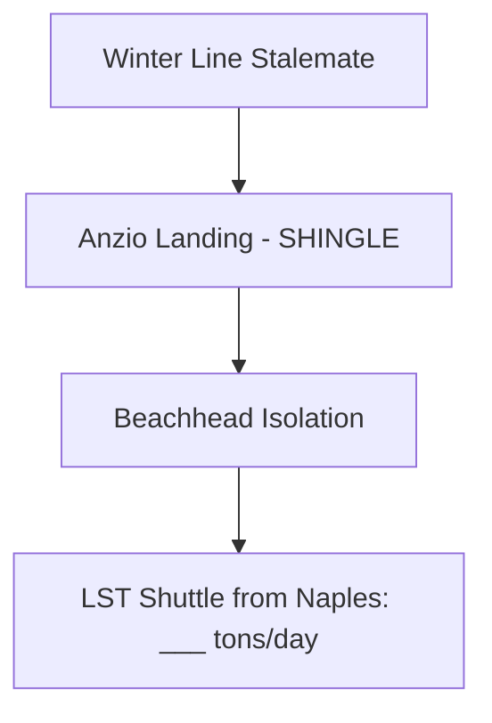

# Chapter 9: Bog-Down in the Mediterranean

## 1. Context & Core Themes
The Italian campaign slowed to a crawl during the winter of 1943-44. Planners encountered extreme weather, mountainous terrain, and destroyed infrastructure, which severely degraded supply movements. The bold end-run amphibious landing at Anzio (Operation SHINGLE) was launched to break the deadlock but quickly became logistically isolated.

---

## 2. Interactive Study Fill-ins (Details to Fill In)
*To complete your study of this chapter, research and fill in the missing metrics below:*

- **Campaign Challenges:**
  - The Anzio landings (Operation SHINGLE) were launched on `[___________]`.
  - Instead of breaking out, the Allied force was pinned down in a beachhead measuring only `[___________]` miles wide.
  - Sustaining the Anzio pocket required a daily supply delivery of `[___________]` tons, which had to be brought in via LSTs and trucks under artillery fire.

---

## 3. Logistical Architecture (Mermaid.js Diagram)
Complete or extend this diagram depicting the logistical workflows, command hierarchies, or pipelines of this chapter.



---

## 4. Quantitative Modeling: Bog-Down in the Mediterranean
Road capacity in mountainous terrain under combat and weather conditions is limited. Truck throughput capacity ($C_{road}$) is modeled as a function of operational trucks ($N$), speed ($V$), and road degradation factor ($F_{degrad}$).

### Mathematical Formulation
$C_{road} = N \cdot \frac{V \cdot Payload}{Distance} \cdot F_{degrad}$

### Scala 3.8.3 Implementation
Below is the compile-safe Scala 3.8.3 model representing these parameters:

```scala
package Logistics.BogDown

case class TruckConvoy(truckCount: Int, averagePayloadTons: Double, distanceMiles: Double)

object RoadThroughputModel:
  def calculateDailyTonnage(
    convoy: TruckConvoy,
    speedMph: Double,
    degradationFactor: Double
  ): Double =
    val tripsPerDay = (speedMph * 12.0) / convoy.distanceMiles // 12-hour driving day
    val potentialTons = convoy.truckCount * convoy.averagePayloadTons * tripsPerDay
    potentialTons * degradationFactor
```

---

## 5. Strategic Discussion Questions
1. Why did Operation SHINGLE fail to achieve its strategic objectives, and how did its logistical requirements drain resources from the preparations for OVERLORD?
2. Describe the "Naples-Anzio LST Shuttle" and how it represented an innovative use of amphibious shipping in a sustained support role.
