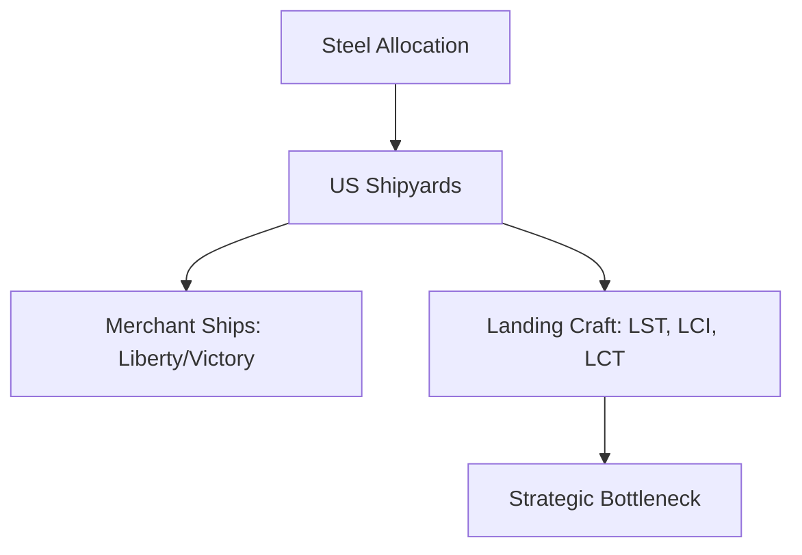

# Chapter 10: Ships, Landing Craft, and Strategy

## 1. Context & Core Themes
This chapter serves as a deep dive into the supreme constraint of the European war: shipping and landing craft. It examines the competition for steel, shipyard capacities, and the impact of landing craft production on the global strategic timeline.

---

## 2. Interactive Study Fill-ins (Details to Fill In)
*To complete your study of this chapter, research and fill in the missing metrics below:*

- **Shipping Pool Dynamics:**
  - The production of Liberty ships peaked in 1943, with US shipyards completing `[___________]` vessels in that year alone.
  - The global deficit in LST production in late 1943 stood at `[___________]` craft below the requirements of ETO planners.

---

## 3. Logistical Architecture (Mermaid.js Diagram)
Complete or extend this diagram depicting the logistical workflows, command hierarchies, or pipelines of this chapter.



---

## 4. Quantitative Modeling: Ships, Landing Craft, and Strategy
Fleet sizing must account for both production rate ($P_t$) and combat/operational attrition rate ($A_t$) to calculate net fleet size over time.

### Mathematical Formulation
$F_{t+1} = F_t + P_t - A_t \\cdot F_t$

### Scala 3.8.3 Implementation
Below is the compile-safe Scala 3.8.3 model representing these parameters:

```scala
package Logistics.ShipsLandingCraft

case class FleetState(ships: Int)

object FleetAttritionModel:
  def projectFleetSize(
    initialState: FleetState,
    monthlyProduction: Int,
    attritionRate: Double,
    months: Int
  ): FleetState =
    val finalShips = (1 to months).foldLeft(initialState.ships.toDouble) { (current, _) =>
      current + monthlyProduction - (attritionRate * current)
    }
    FleetState(finalShips.toInt)
```

---

## 5. Strategic Discussion Questions
1. Explain why the LST was considered the "unanimous bottleneck" of World War II logistics.
2. How did the division of steel between the Navy's combatant ship program and the Maritime Commission's merchant program affect overall strategy?
