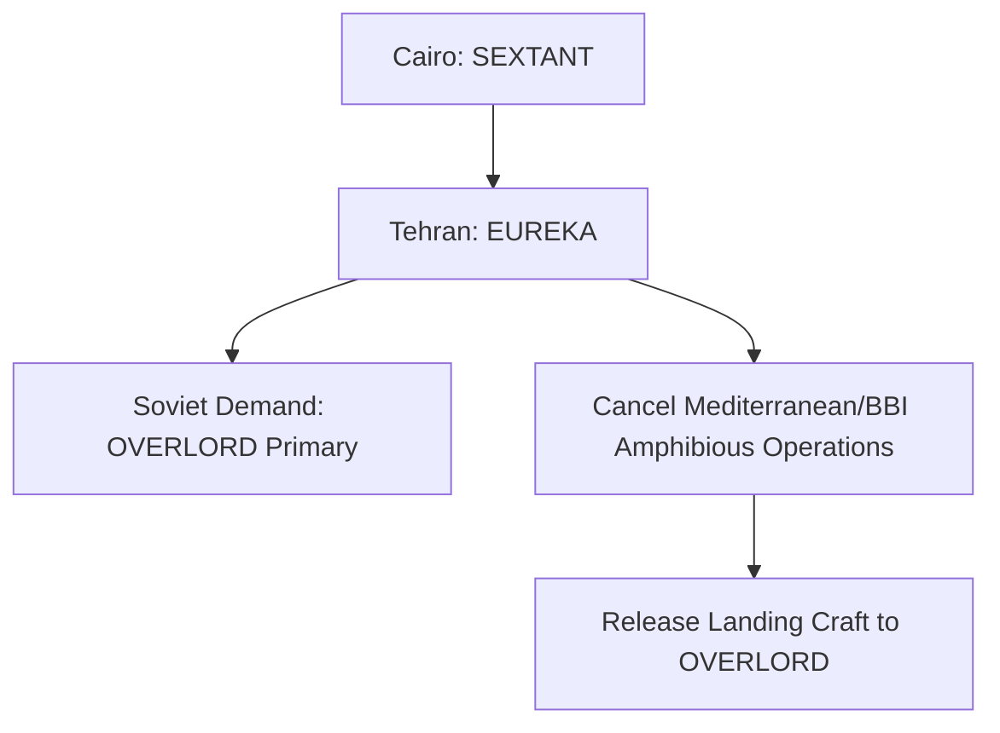

# Chapter 11: The Cairo-Tehran Conferences (SEXTANT/EUREKA)

## 1. Context & Core Themes
The SEXTANT (Cairo) and EUREKA (Tehran) conferences in late 1943 brought Roosevelt, Churchill, and Stalin together. Stalin’s firm demand for a primary cross-channel operation (OVERLORD) in mid-1944 forced the cancellation of planned Mediterranean amphibious operations (such as Operation BUCCANEER in the Bay of Bengal).

---

## 2. Interactive Study Fill-ins (Details to Fill In)
*To complete your study of this chapter, research and fill in the missing metrics below:*

- **Conference Outcomes:**
  - At Tehran, Stalin committed to launching a simultaneous Soviet offensive (Operation `[___________]`) to prevent Germany from shifting divisions westward.
  - The cancellation of Operation BUCCANEER released `[___________]` landing craft back to the European pool.

---

## 3. Logistical Architecture (Mermaid.js Diagram)
Complete or extend this diagram depicting the logistical workflows, command hierarchies, or pipelines of this chapter.



---

## 4. Quantitative Modeling: The Cairo-Tehran Conferences (SEXTANT/EUREKA)
We model the coalition resource division as a multi-objective utility matrix where strategic alignment maximizes global Allied offensive value.

### Mathematical Formulation
$U_{allied} = \sum_{i} A_i \cdot V_i$

### Scala 3.8.3 Implementation
Below is the compile-safe Scala 3.8.3 model representing these parameters:

```scala
package Logistics.CairoTehran

case class TheaterObjective(name: String, alignmentScore: Double, resourceRequired: Double)

object CoalitionResourceSplit:
  def evaluateAllocations(
    objectives: List[TheaterObjective],
    availableResources: Double
  ): List[TheaterObjective] =
    objectives.filter(_.resourceRequired <= availableResources)
```

---

## 5. Strategic Discussion Questions
1. Why did Stalin’s presence at Tehran fundamentally alter the balance of power between the US and British strategic concepts?
2. Explain the logistical and strategic implications of canceling Operation BUCCANEER.
