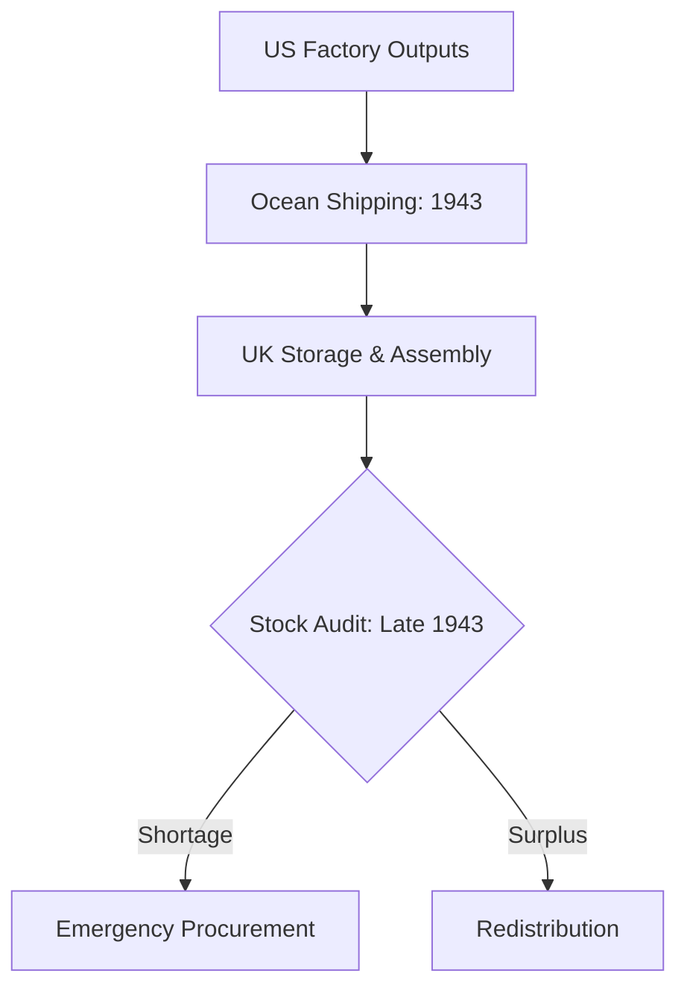

# Chapter 12: Inventory and Aftermath

## 1. Context & Core Themes
This chapter reviews the logistical balance sheet at the end of 1943. Planners assessed shipping losses, depot stocks in England, and port preparations to confirm whether the massive pipeline from the United States could support the scheduled 1944 offensives.

---

## 2. Interactive Study Fill-ins (Details to Fill In)
*To complete your study of this chapter, research and fill in the missing metrics below:*

- **End of 1943 Balance Sheet:**
  - By December 1943, the total US Army cargo shipped to the United Kingdom for BOLERO reached `[___________]` long tons.
  - Despite major shipping efforts, there was a stock deficit in critical Category II equipment (e.g., trucks and trailers) of `[___________]`%.

---

## 3. Logistical Architecture (Mermaid.js Diagram)
Complete or extend this diagram depicting the logistical workflows, command hierarchies, or pipelines of this chapter.



---

## 4. Quantitative Modeling: Inventory and Aftermath
Stock balance is evaluated by comparing actual stock levels ($S_{actual}$) against authorized levels ($S_{auth}$). Excesses and deficits are computed to identify system-wide imbalances.

### Mathematical Formulation
$Imbalance_i = \\frac{S_{actual} - S_{auth}}{S_{auth}}$

### Scala 3.8.3 Implementation
Below is the compile-safe Scala 3.8.3 model representing these parameters:

```scala
package Logistics.InventoryAftermath

case class StockItem(name: String, actual: Double, authorized: Double)

object InventoryBalanceModel:
  def computeImbalances(items: List[StockItem]): List[(String, Double)] =
    items.map { item =>
      val ratio = (item.actual - item.authorized) / item.authorized
      item.name -> ratio
    }
```

---

## 5. Strategic Discussion Questions
1. What were the main causes of the "imbalance" in UK depots at the end of 1943?
2. How did the reduction in Atlantic shipping losses in late 1943 affect the logistical outlook for OVERLORD?
