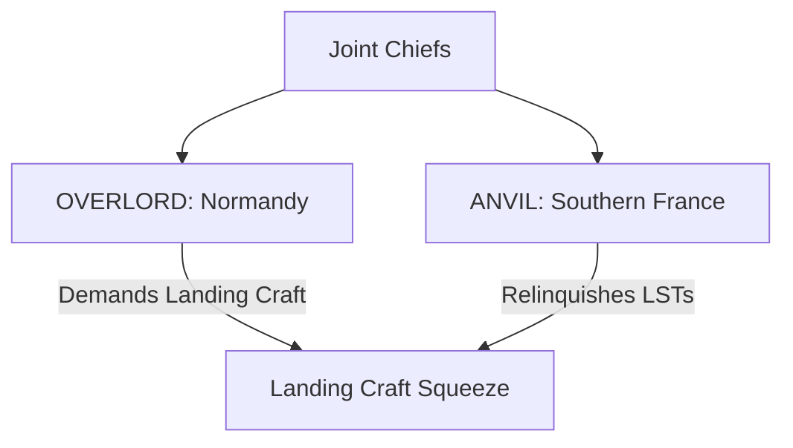

# Chapter 13: OVERLORD and ANVIL

## 1. Context & Core Themes
The conflict between the cross-channel invasion (OVERLORD) and the landing in Southern France (ANVIL) dominated Allied planning in early 1944. Planners debated whether ANVIL was a necessary diversion to secure French ports (Marseille) or a dangerous division of scarce landing craft.

---

## 2. Interactive Study Fill-ins (Details to Fill In)
*To complete your study of this chapter, research and fill in the missing metrics below:*

- **Invasion Planning:**
  - The expanded OVERLORD plan (formulated by Montgomery and Eisenhower) required increasing the assault force from 3 to `[___________]` divisions.
  - To secure enough landing craft for this expanded assault, ANVIL had to be postponed from its original simultaneous date to `[___________]`.

---

## 3. Logistical Architecture (Mermaid.js Diagram)
Complete or extend this diagram depicting the logistical workflows, command hierarchies, or pipelines of this chapter.



---

## 4. Quantitative Modeling: OVERLORD and ANVIL
We model the operational dependency tree using the Critical Path Method (CPM). The early start ($ES$) and late start ($LS$) times for critical operations (like ANVIL) are computed based on resource constraints.

### Mathematical Formulation
$ES_j = \\max_{i \\in Pred(j)} \\{ EF_i \\}$

### Scala 3.8.3 Implementation
Below is the compile-safe Scala 3.8.3 model representing these parameters:

```scala
package Logistics.OverlordAnvil

case class Task(name: String, durationDays: Int, predecessors: List[String])

object ProjectScheduler:
  def calculateSimpleSchedule(tasks: List[Task]): Map[String, Int] =
    // Assumes simple topological ordering for early-start calculation
    tasks.foldLeft(Map[String, Int]()) { (acc, task) =>
      val es = task.predecessors.map(p => acc.getOrElse(p, 0) + tasks.find(_.name == p).map(_.durationDays).getOrElse(0)).maxOption.getOrElse(0)
      acc + (task.name -> es)
    }
```

---

## 5. Strategic Discussion Questions
1. Why did General Eisenhower view the ANVIL operation as logistically essential for the long-term support of the Allied drive into Germany?
2. Analyze the strategic debate between the British (who favored exploiting the Italian campaign or the Balkans) and the Americans (who stood firm on ANVIL).
