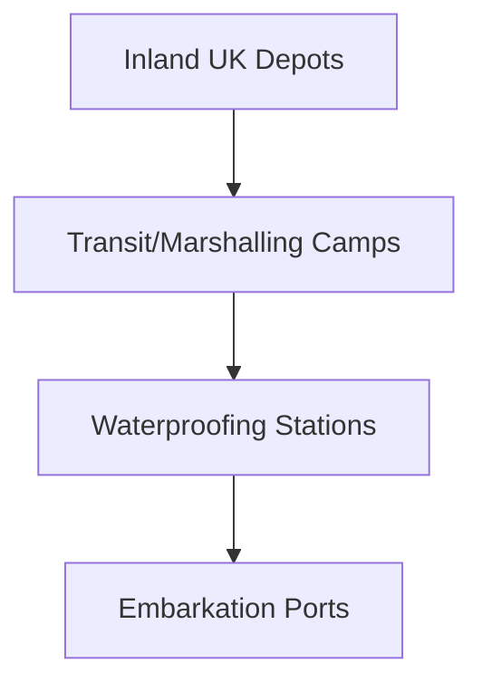

# Chapter 14: The OVERLORD-ANVIL Build-Up

## 1. Context & Core Themes
In the months preceding D-Day, the United Kingdom became a packed logistical platform. This chapter describes the final, massive movement of troops and supplies to Southern England ports, the waterproofing of thousands of vehicles, and the organization of the pre-planned "push" supply system.

---

## 2. Interactive Study Fill-ins (Details to Fill In)
*To complete your study of this chapter, research and fill in the missing metrics below:*

- **The Final Build-Up:**
  - By June 1944, the number of US troops in the UK reached approximately `[___________]` million.
  - Over `[___________]` separate types of vehicles had to be waterproofed for the amphibious landings.
  - The initial "push" supply system was scheduled to sustain the landing forces for the first `[___________]` days before transitioning to a "pull" requisition system.

---

## 3. Logistical Architecture (Mermaid.js Diagram)
Complete or extend this diagram depicting the logistical workflows, command hierarchies, or pipelines of this chapter.



---

## 4. Quantitative Modeling: The OVERLORD-ANVIL Build-Up
Vehicle waterproofing required specialized kits, labor, and space. We model the throughput of waterproofing lines using a multi-station queue capacity.

### Mathematical Formulation
$T_{waterproof} = N_{lines} \\cdot R_{rate} \\cdot H_{hours}$

### Scala 3.8.3 Implementation
Below is the compile-safe Scala 3.8.3 model representing these parameters:

```scala
package Logistics.BuildUp

case class WaterproofingStation(lines: Int, ratePerLinePerHour: Double)

object StoragePacking:
  def maxWaterproofCapacity(station: WaterproofingStation, dailyHours: Double): Int =
    (station.lines * station.ratePerLinePerHour * dailyHours).toInt
```

---

## 5. Strategic Discussion Questions
1. What is the difference between a "push" supply system and a "pull" supply system, and why was the former mandatory for the initial D-Day landings?
2. How did the "Marshalling Areas" in Southern England function to maintain tactical organization while handling massive logistical throughput?
