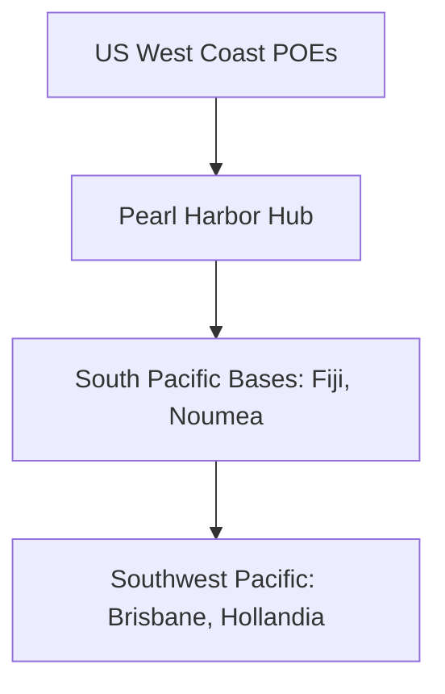

# Chapter 16: Pacific Strategy and Its Material Bases

## 1. Context & Core Themes
Logistics in the Pacific War was fundamentally different from the European Theater. Distances were vast, landbases were scarce, and joint Army-Navy cooperation was mandatory. This chapter analyzes the physical geography and shipping networks that formed the basis of Pacific strategy.

---

## 2. Interactive Study Fill-ins (Details to Fill In)
*To complete your study of this chapter, research and fill in the missing metrics below:*

- **Pacific Logistical Dimensions:**
  - The shipping lane from San Francisco to Brisbane, Australia covered approximately `[___________]` nautical miles.
  - Sustaining a single soldier in the Pacific required shipping `[___________]` times the volume of supplies required for a soldier in Europe due to the lack of local infrastructure.

---

## 3. Logistical Architecture (Mermaid.js Diagram)
Complete or extend this diagram depicting the logistical workflows, command hierarchies, or pipelines of this chapter.



---

## 4. Quantitative Modeling: Pacific Strategy and Its Material Bases
The efficiency of supply delivery in the Pacific decayed exponentially with distance. We model the effective supply throughput ($S_{eff}$) delivered to an island base as a function of distance ($D$) and operational transport loss/turnaround delays.

### Mathematical Formulation
$S_{eff} = S_0 \\cdot e^{-\\lambda \\cdot D}$

### Scala 3.8.3 Implementation
Below is the compile-safe Scala 3.8.3 model representing these parameters:

```scala
package Logistics.PacificStrategy

import scala.math.exp

object PacificSupplyLossModel:
  def effectiveThroughput(
    initialTonnage: Double,
    distanceMiles: Double,
    decayRate: Double
  ): Double =
    initialTonnage * exp(-decayRate * distanceMiles)
```

---

## 5. Strategic Discussion Questions
1. Explain the logistical concept of "island hopping" and how it minimized the shipping tonnage required to advance the strategic front.
2. How did the geographic vastness of the Pacific impact the "turnaround time" of merchant shipping compared to the North Atlantic route?
