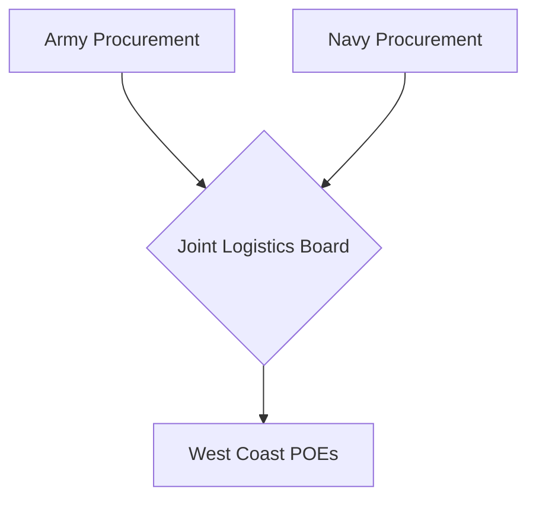

# Chapter 17: Joint Logistics in Pacific Operations: The Continental System

## 1. Context & Core Themes
Managing the dual demands of the Army and Navy in the Pacific required setting up unified logistical boards. This chapter explores the "Continental System" developed on the US West Coast to coordinate procurement, storage, and port facilities for both services.

---

## 2. Interactive Study Fill-ins (Details to Fill In)
*To complete your study of this chapter, research and fill in the missing metrics below:*

- **Joint Systems:**
  - The Joint Army-Navy Logistics Board (JANET) was established in `[___________]`.
  - The West Coast Ports of Embarkation (especially San Francisco) cleared over `[___________]` measurement tons of cargo per month for the Pacific in late 1944.

---

## 3. Logistical Architecture (Mermaid.js Diagram)
Complete or extend this diagram depicting the logistical workflows, command hierarchies, or pipelines of this chapter.



---

## 4. Quantitative Modeling: Joint Logistics in Pacific Operations: The Continental System
We model the port clearance queue as a shared resource system using a single-server queueing model (M/M/1) where arrival rate ($\lambda$) and service rate ($\mu$) determine the average port delay ($W$).

### Mathematical Formulation
$W = \frac{1}{\mu - \lambda}$

### Scala 3.8.3 Implementation
Below is the compile-safe Scala 3.8.3 model representing these parameters:

```scala
package Logistics.ContinentalSystem

case class PortQueue(arrivalRatePerDay: Double, serviceRatePerDay: Double)

object QueueingModel:
  def averageDelayDays(queue: PortQueue): Double =
    if queue.serviceRatePerDay > queue.arrivalRatePerDay then
      1.0 / (queue.serviceRatePerDay - queue.arrivalRatePerDay)
    else
      Double.PositiveInfinity
```

---

## 5. Strategic Discussion Questions
1. What were the main sources of friction between the Army Service Forces and the Navy's Bureau of Supplies and Accounts during the establishment of the West Coast joint ports?
2. How did the "Continental System" prevent the duplication of storage depots in California?
