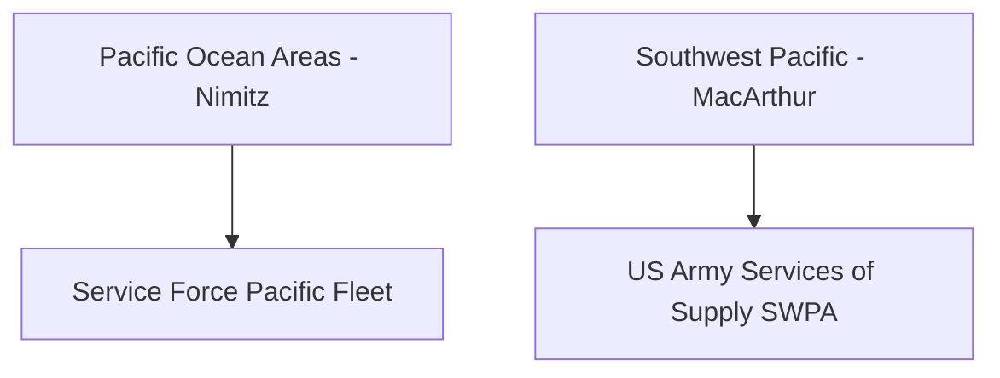

# Chapter 18: Joint Logistics in the Pacific Theaters

## 1. Context & Core Themes
This chapter moves into the actual theater of operations, analyzing how General Douglas MacArthur’s Southwest Pacific Area (SWPA) and Admiral Chester Nimitz’s Pacific Ocean Areas (POA) managed supply lines. It covers the creation of the Service Force, Pacific Fleet (ServPac) and regional base networks.

---

## 2. Interactive Study Fill-ins (Details to Fill In)
*To complete your study of this chapter, research and fill in the missing metrics below:*

- **Theater Logistics:**
  - General MacArthur's SWPA logistics was centered around the Services of Supply, SWPA, commanded by Major General `[___________]`.
  - ServPac introduced "mobile service bases" utilizing concrete barges and auxiliary ships, which at their peak in late 1944 numbered over `[___________]` vessels.

---

## 3. Logistical Architecture (Mermaid.js Diagram)
Complete or extend this diagram depicting the logistical workflows, command hierarchies, or pipelines of this chapter.



---

## 4. Quantitative Modeling: Joint Logistics in the Pacific Theaters
Decentralized logistics networks route supplies from regional hubs to advance bases. We model the distribution cost ($C_{dist}$) as a sum of transit distances weighted by supply volume.

### Mathematical Formulation
$C_{dist} = \\sum_{i} V_i \\cdot D_i$

### Scala 3.8.3 Implementation
Below is the compile-safe Scala 3.8.3 model representing these parameters:

```scala
package Logistics.PacificTheaters

case class SupplyRoute(volumeTons: Double, distanceMiles: Double)

object DecentralizedLogisticsNetwork:
  def totalDistributionCost(routes: List[SupplyRoute]): Double =
    routes.map(r => r.volumeTons * r.distanceMiles).sum
```

---

## 5. Strategic Discussion Questions
1. Contrast the Navy's "mobile base" concept (ServPac) with the Army's "fixed land base" concept in the Pacific. What were the logistical advantages of each?
2. How did the division of the Pacific into SWPA and POA lead to competing demands for shipping, and how was this conflict managed?
