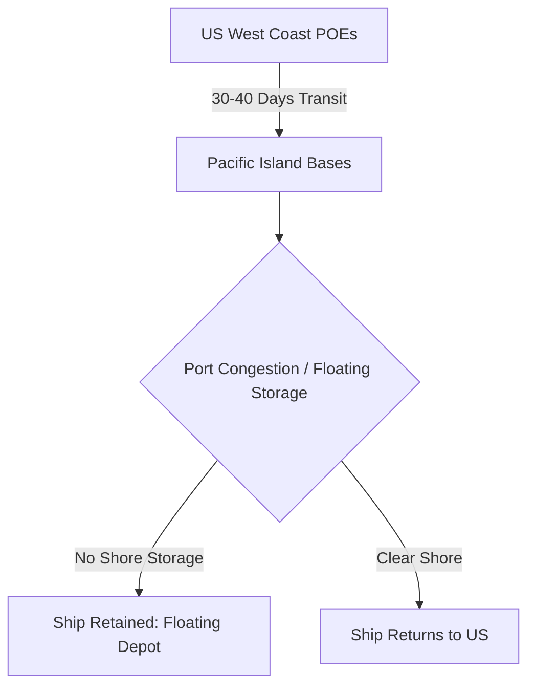

# Chapter 19: Shipping in the Pacific War

## 1. Context & Core Themes
Shipping was the lifeblood of the Pacific campaigns. Because voyages were incredibly long, ships spent a high percentage of their time in transit or waiting to discharge cargo at primitive island anchorages, leading to the "retention" of precious hulls in theater.

---

## 2. Interactive Study Fill-ins (Details to Fill In)
*To complete your study of this chapter, research and fill in the missing metrics below:*

- **Pacific Shipping Metrics:**
  - The average round-trip turnaround time for a cargo ship from the US West Coast to the Southwest Pacific in 1944 was `[___________]` days.
  - In mid-1944, an average of `[___________]` merchant vessels were "retained" in Pacific theaters as floating warehouses because of a lack of shore depots.

---

## 3. Logistical Architecture (Mermaid.js Diagram)
Complete or extend this diagram depicting the logistical workflows, command hierarchies, or pipelines of this chapter.



---

## 4. Quantitative Modeling: Shipping in the Pacific War
To sustain a constant daily delivery ($D_{target}$) at an island base given a ship's turnaround time ($T_{cycle}$) and average cargo capacity ($C$), we calculate the total fleet size ($N$) required.

### Mathematical Formulation
$N = \frac{D_{target} \cdot T_{cycle}}{C}$

### Scala 3.8.3 Implementation
Below is the compile-safe Scala 3.8.3 model representing these parameters:

```scala
package Logistics.PacificShipping

case class FleetTarget(dailyTonsTarget: Double, shipCapacityTons: Double)

object FleetSustenanceModel:
  def requiredHulls(target: FleetTarget, turnaroundDays: Double): Int =
    val dailyShipsNeeded = target.dailyTonsTarget / target.shipCapacityTons
    Math.ceil(dailyShipsNeeded * turnaroundDays).toInt
```

---

## 5. Strategic Discussion Questions
1. Explain the phenomenon of "floating storage" in the Pacific. Why did theater commanders refuse to release cargo ships, and how did this impact global Allied strategy?
2. What measures did the War Shipping Administration (WSA) take to reduce turnaround times in Pacific ports?
