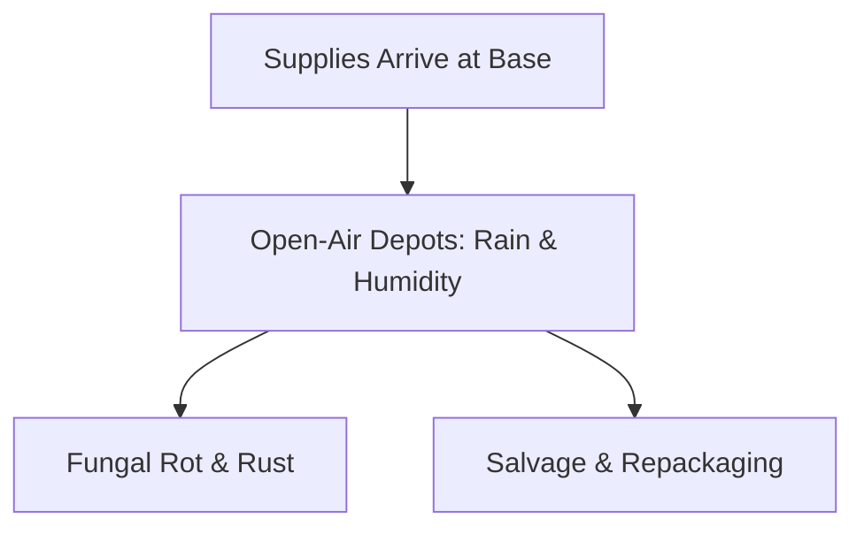

# Chapter 20: Supplying the Army in Pacific Theaters

## 1. Context & Core Themes
This chapter details the specific tactical supply problems encountered by the Army in tropical climates: food spoilage, mold, mildew, rust, and the physical breakdown of packaging. It highlights the development of specialized "jungle rations" and waterproofing techniques.

---

## 2. Interactive Study Fill-ins (Details to Fill In)
*To complete your study of this chapter, research and fill in the missing metrics below:*

- **Tropical Logistics:**
  - The humidity and heat of the New Guinea jungle caused an estimated loss of `[___________]`% of all stored flour and dry rations within 3 months.
  - The development of "Type C" and "Type K" rations provided combat troops with portable nutrition, but prolonged consumption led to average weight losses of `[___________]` lbs per man.

---

## 3. Logistical Architecture (Mermaid.js Diagram)
Complete or extend this diagram depicting the logistical workflows, command hierarchies, or pipelines of this chapter.



---

## 4. Quantitative Modeling: Supplying the Army in Pacific Theaters
We model the spoilage and degradation of supply stocks in tropical environments using an exponential decay model where the shelf-life ($S$) is a function of humidity and temperature degradation factor ($\alpha$).

### Mathematical Formulation
$S_t = S_0 \\cdot e^{-\\alpha \\cdot t}$

### Scala 3.8.3 Implementation
Below is the compile-safe Scala 3.8.3 model representing these parameters:

```scala
package Logistics.SupplyingPacific

import scala.math.exp

case class SupplyStock(initialTons: Double, decayRate: Double)

object SpoilageDepreciationModel:
  def remainingStock(stock: SupplyStock, months: Double): Double =
    stock.initialTons * exp(-stock.decayRate * months)
```

---

## 5. Strategic Discussion Questions
1. How did the lack of refrigerated storage (reefer ships and warehouses) limit the diet and morale of troops in the Southwest Pacific?
2. What innovations in packaging (such as laminated foils and dipping waxes) were developed to protect ammunition and medical supplies from moisture?
