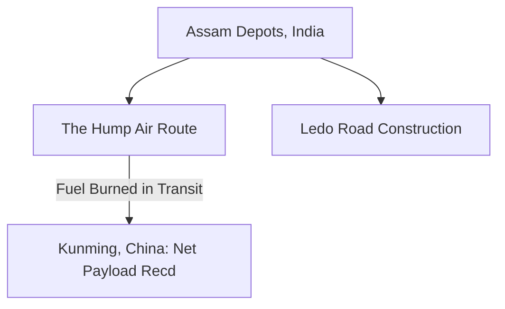

# Chapter 21: China, Burma, and India

## 1. Context & Core Themes
The China-Burma-India (CBI) theater was a logistical nightmare. Following the Japanese closure of the Burma Road, the only link to China was "The Hump" airlift over the Himalayas. This chapter examines the extreme trade-offs between flying cargo to China versus building the overland Ledo Road.

---

## 2. Interactive Study Fill-ins (Details to Fill In)
*To complete your study of this chapter, research and fill in the missing metrics below:*

- **CBI Logistical Constraints:**
  - "The Hump" airlift was managed by the Army Air Forces ATC, reaching a peak delivery of `[___________]` tons per month in late 1944.
  - For every 100 tons of fuel flown over the Hump to fuel Chennault's Fourteenth Air Force, the transport aircraft themselves consumed `[___________]` tons of fuel during the round trip.

---

## 3. Logistical Architecture (Mermaid.js Diagram)
Complete or extend this diagram depicting the logistical workflows, command hierarchies, or pipelines of this chapter.



---

## 4. Quantitative Modeling: China, Burma, and India
Airlift efficiency in the CBI can be modeled as a fuel-to-cargo ratio. Let $F_{burn}$ be the fuel burned by the transport plane, $C_{max}$ be the maximum payload capacity, and $D$ be the route distance. The net cargo delivered ($C_{net}$) is the payload capacity minus the transit fuel required for the round trip.

### Mathematical Formulation
$C_{net} = C_{max} - F_{burn}(D)$

### Scala 3.8.3 Implementation
Below is the compile-safe Scala 3.8.3 model representing these parameters:

```scala
package Logistics.CBI

case class AircraftSpecs(maxPayloadLbs: Double, fuelBurnLbsPerHour: Double)

object AirliftEfficiencyModel:
  def netCargoDelivered(
    specs: AircraftSpecs,
    flightDurationHours: Double,
    roundTrip: Boolean
  ): Double =
    val multiplier = if roundTrip then 2.0 else 1.0
    val transitFuel = specs.fuelBurnLbsPerHour * flightDurationHours * multiplier
    specs.maxPayloadLbs - transitFuel
```

---

## 5. Strategic Discussion Questions
1. Explain the "Hump Paradox": Why was the airlift considered an inefficient use of resources, and why did General Marshall continue to support it?
2. Describe Stilwell's strategic vision for the Ledo Road and how it conflicted with Chennault's air-centric strategy for China.
