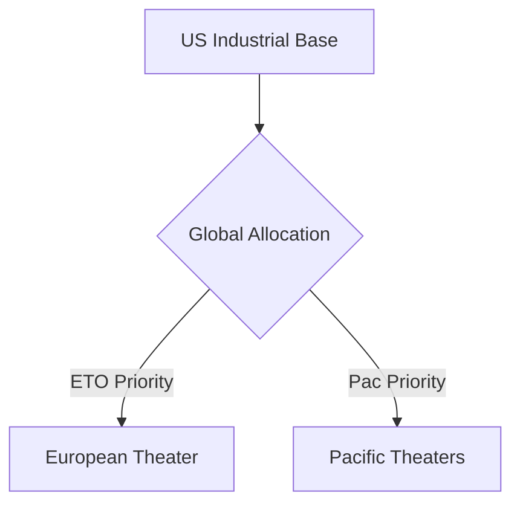

# Chapter 22: Stresses and Strains of a Two-Front War

## 1. Context & Core Themes
By mid-1944, the US was waging full-scale offensives in both Europe and the Pacific. This chapter examines the global competition for resources (such as artillery ammunition, heavy trucks, and engineering equipment) that strained the US industrial base to its absolute limits.

---

## 2. Interactive Study Fill-ins (Details to Fill In)
*To complete your study of this chapter, research and fill in the missing metrics below:*

- **Global Ammunition & Vehicle Crisis:**
  - The monthly demand for 105mm artillery ammunition in Europe in late 1944 reached `[___________]` rounds, far exceeding the planned production of `[___________]` rounds.
  - The global shortage of heavy tactical trucks (4-to-10 ton class) in late 1944 was estimated at `[___________]` units.

---

## 3. Logistical Architecture (Mermaid.js Diagram)
Complete or extend this diagram depicting the logistical workflows, command hierarchies, or pipelines of this chapter.



---

## 4. Quantitative Modeling: Stresses and Strains of a Two-Front War
We model global resource allocation as a multi-objective linear programming problem where we maximize overall combat readiness across two fronts under production constraints.

### Mathematical Formulation
$\\text{Maximize } U = a \\cdot X_{ETO} + b \\cdot X_{PAC} \\quad \\text{subject to } X_{ETO} + X_{PAC} \\le P_{total}$

### Scala 3.8.3 Implementation
Below is the compile-safe Scala 3.8.3 model representing these parameters:

```scala
package Logistics.TwoFrontWar

case class ProductionLimits(totalOutput: Double)

object DualFrontOptimizer:
  def optimalSplit(
    limits: ProductionLimits,
    etoWeight: Double,
    pacWeight: Double
  ): (Double, Double) =
    val sum = etoWeight + pacWeight
    val etoAlloc = (etoWeight / sum) * limits.totalOutput
    val pacAlloc = (pacWeight / sum) * limits.totalOutput
    (etoAlloc, pacAlloc)
```

---

## 5. Strategic Discussion Questions
1. Why did the Allied planners underestimate the requirement for artillery ammunition in Europe, and what measures were taken in late 1944 to increase production?
2. How did the JCS handle the competing demands for heavy engineering equipment (such as bulldozers) between the Pacific base developers and the European reconstruction teams?
