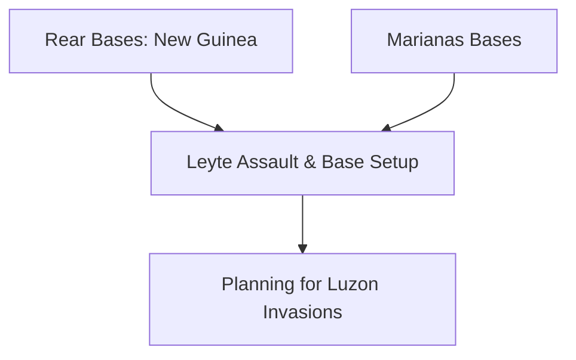

# Chapter 23: The Pacific in Transition

## 1. Context & Core Themes
In late 1944, the Pacific campaigns accelerated with the invasion of the Philippines (Leyte and Luzon). This chapter covers the massive logistical shift as bases were moved forward from New Guinea and the Marianas to support the re-entry into the Philippines.

---

## 2. Interactive Study Fill-ins (Details to Fill In)
*To complete your study of this chapter, research and fill in the missing metrics below:*

- **Philippine Campaign Logistics:**
  - The invasion of Leyte (Operation KING II) was launched on `[___________]`.
  - The assault convoy carried over `[___________]` troops and `[___________]` tons of cargo.
  - The transition of bases forward required shipping `[___________]` measurement tons of base construction materials to Leyte alone.

---

## 3. Logistical Architecture (Mermaid.js Diagram)
Complete or extend this diagram depicting the logistical workflows, command hierarchies, or pipelines of this chapter.



---

## 4. Quantitative Modeling: The Pacific in Transition
Shifting logistical centers of gravity involves relocations. We model the base relocation transit cost ($C_{reloc}$) as a function of cargo volume ($V$), distance ($D$), and setup time delay ($S$).

### Mathematical Formulation
$C_{reloc} = V \\cdot (D \\cdot T_{transit} + S)$

### Scala 3.8.3 Implementation
Below is the compile-safe Scala 3.8.3 model representing these parameters:

```scala
package Logistics.PacificTransition

case class BaseSpecs(cargoVolumeTons: Double, setupDays: Double)

object BaseRelocationModel:
  def relocationCost(
    specs: BaseSpecs,
    distanceMiles: Double,
    transitTimePerMileDay: Double
  ): Double =
    specs.cargoVolumeTons * (distanceMiles * transitTimePerMileDay + specs.setupDays)
```

---

## 5. Strategic Discussion Questions
1. Describe the logistical challenges of setting up major supply bases on Leyte during the monsoon season.
2. How did the capture of the Marianas (Saipan, Tinian, Guam) alter the logistical support of the strategic B-29 bombing campaign against Japan?
