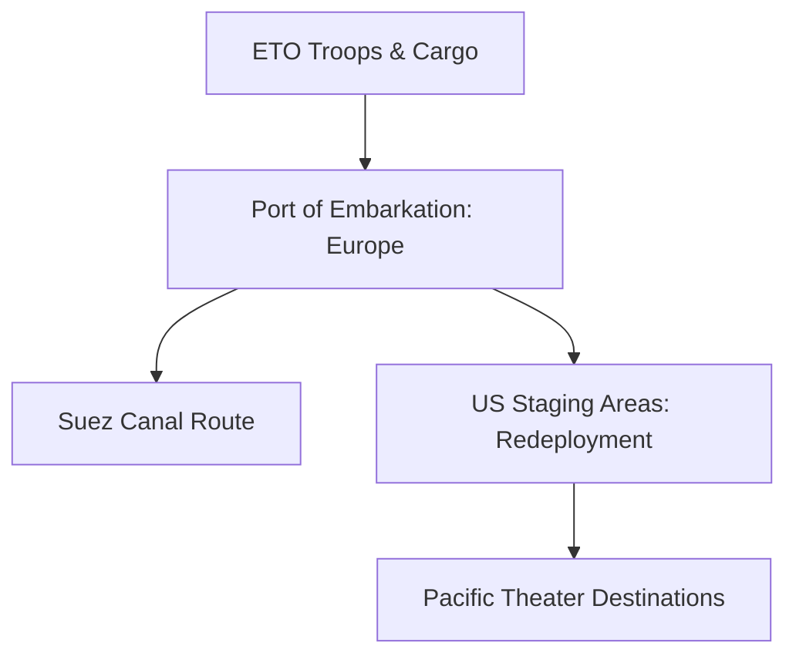

# Chapter 24: Logistics of a One-Front War

## 1. Context & Core Themes
As the defeat of Germany became imminent in early 1945, planners shifted their focus to a "One-Front War" model. This required planning for "Redirection" (diverting ETO-bound supply ships directly to the Pacific) and the massive redeployment of millions of troops from Europe to the Pacific (Operation Redeployment).

---

## 2. Interactive Study Fill-ins (Details to Fill In)
*To complete your study of this chapter, research and fill in the missing metrics below:*

- **Redeployment Plans:**
  - The planned redeployment scheme (after V-E Day) envisioned moving `[___________]` million soldiers from Europe to the Pacific within 12 months.
  - Shipping planners calculated that they would need to redirect over `[___________]` cargo ships already in transit or loading.

---

## 3. Logistical Architecture (Mermaid.js Diagram)
Complete or extend this diagram depicting the logistical workflows, command hierarchies, or pipelines of this chapter.



---

## 4. Quantitative Modeling: Logistics of a One-Front War
Redirection of cargo in transit can be modeled as vector redirection. We calculate the extra distance ($D_{extra}$) added when rerouting a cargo ship from ETO paths to Pacific ports via the Panama Canal.

### Mathematical Formulation
$D_{extra} = D_{US-to-Pacific} - D_{US-to-Europe}$

### Scala 3.8.3 Implementation
Below is the compile-safe Scala 3.8.3 model representing these parameters:

```scala
package Logistics.OneFrontWar

case class RouteDistances(usToEurope: Double, usToPacific: Double)

object RouteRedirectionModel:
  def extraDistanceMiles(routes: RouteDistances): Double =
    routes.usToPacific - routes.usToEurope
```

---

## 5. Strategic Discussion Questions
1. Why did the "Redirection" of cargo ships in mid-1945 prove to be one of the most complex scheduling tasks ever attempted by the War Shipping Administration?
2. What were the psychological and physical impacts on ETO veteran troops scheduled for immediate redeployment to the Pacific?
