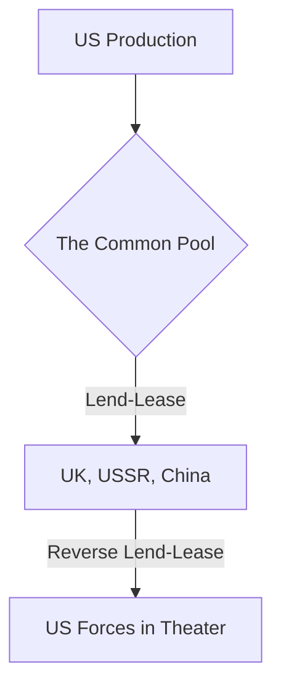

# Chapter 25: Lend-Lease and the Common Pool

## 1. Context & Core Themes
Lend-Lease was not a one-way street but a "Common Pool" of resources. This chapter explores the financial and physical mechanics of Lend-Lease, focusing on the pooling of merchant shipping (the "shipping pool") and "Reverse Lend-Lease" (reciprocal aid provided by the British and other allies to US forces).

---

## 2. Interactive Study Fill-ins (Details to Fill In)
*To complete your study of this chapter, research and fill in the missing metrics below:*

- **Lend-Lease Financials:**
  - By the end of 1944, total US Lend-Lease aid exceeded `[___________]` billion dollars.
  - Reverse Lend-Lease provided by the United Kingdom to the US Army (including barracks, airfields, and local food) was valued at `[___________]` billion dollars.

---

## 3. Logistical Architecture (Mermaid.js Diagram)
Complete or extend this diagram depicting the logistical workflows, command hierarchies, or pipelines of this chapter.



---

## 4. Quantitative Modeling: Lend-Lease and the Common Pool
Bilateral resource-exchange can be modeled as a trade matrix. Let $L_{ij}$ be the value of resources transferred from nation $i$ to nation $j$. The net transfer balance ($B_i$) for any country is computed to verify contribution values.

### Mathematical Formulation
$B_i = \\sum_{j} L_{ij} - \\sum_{j} L_{ji}$

### Scala 3.8.3 Implementation
Below is the compile-safe Scala 3.8.3 model representing these parameters:

```scala
package Logistics.LendLease

case class TradeFlow(source: String, destination: String, valueBillions: Double)

object ReverseLendLeaseMatrix:
  def netBalance(country: String, flows: List[TradeFlow]): Double =
    val outFlow = flows.filter(_.source == country).map(_.valueBillions).sum
    val inFlow = flows.filter(_.destination == country).map(_.valueBillions).sum
    outFlow - inFlow
```

---

## 5. Strategic Discussion Questions
1. How did the concept of the "Common Pool" challenge traditional ideas of national sovereignty and military procurement?
2. Detail the strategic value of "Reverse Lend-Lease" in minimizing the shipping tonnage the US had to send to England and Australia.
