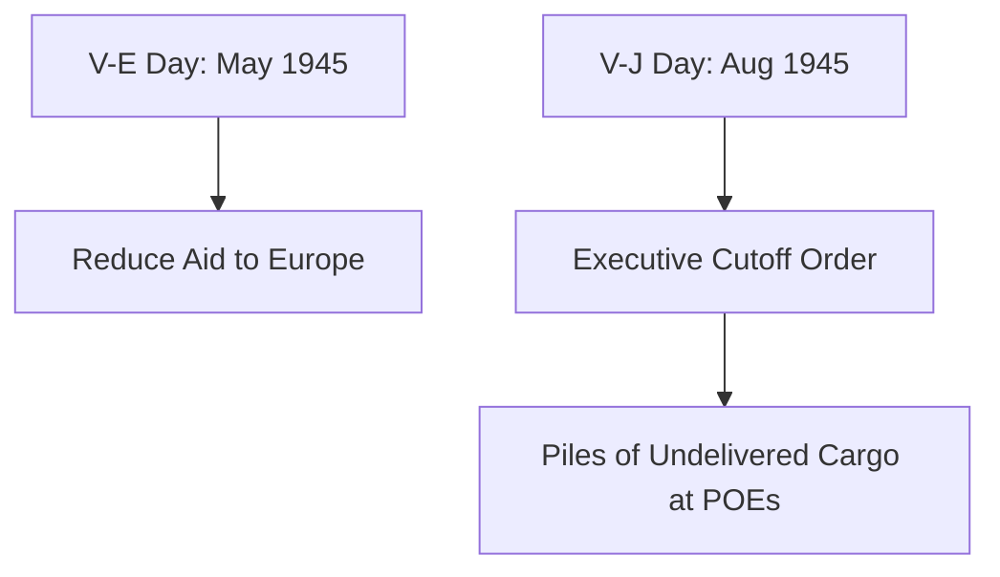

# Chapter 26: The End of the Common Pool

## 1. Context & Core Themes
This chapter covers the political and logistical wind-down of Lend-Lease in 1945. Following the surrender of Germany, the US rapidly reduced Lend-Lease deliveries to European allies, leading to severe diplomatic tension as nations struggled with reconstruction.

---

## 2. Interactive Study Fill-ins (Details to Fill In)
*To complete your study of this chapter, research and fill in the missing metrics below:*

- **Lend-Lease Termination:**
  - President Truman signed the executive order terminating Lend-Lease on `[___________]`.
  - The sudden cutoff left over `[___________]` tons of cargo sitting on US docks, originally destined for Great Britain.

---

## 3. Logistical Architecture (Mermaid.js Diagram)
Complete or extend this diagram depicting the logistical workflows, command hierarchies, or pipelines of this chapter.



---

## 4. Quantitative Modeling: The End of the Common Pool
The pool drawdown can be modeled as an exponential decay function where supply deliveries ($D$) drop rapidly following strategic milestone dates ($t$).

### Mathematical Formulation
$D_t = D_{peak} \cdot e^{-k \cdot (t - t_{VE})}$

### Scala 3.8.3 Implementation
Below is the compile-safe Scala 3.8.3 model representing these parameters:

```scala
package Logistics.EndCommonPool

import scala.math.exp

case class DrawdownParameters(peakDelivery: Double, decayRate: Double)

object DrawdownCurve:
  def deliveryAtTime(params: DrawdownParameters, monthsPostVE: Double): Double =
    if monthsPostVE >= 0 then
      params.peakDelivery * exp(-params.decayRate * monthsPostVE)
    else
      params.peakDelivery
```

---

## 5. Strategic Discussion Questions
1. Why did the sudden termination of Lend-Lease surprise the British government, and what were the immediate economic consequences for the UK?
2. How was the transition of shipping from the global pool back to private national fleets managed in late 1945?
