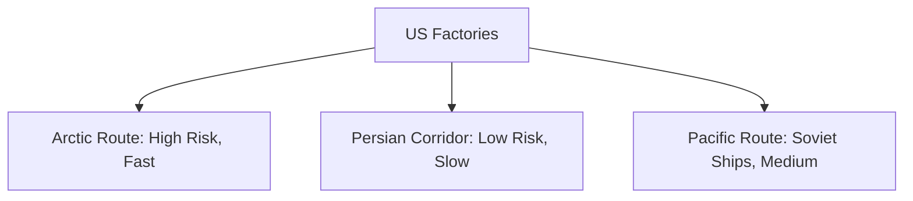

# Chapter 27: Aid to the USSR in the Later War Years

## 1. Context & Core Themes
Sustaining the Soviet war effort required massive deliveries of raw materials, vehicles, and industrial machinery. This chapter analyzes the three main routes: the Arctic Convoys (Murmansk/Archangel), the Persian Corridor, and the Soviet-flagged Pacific Route (West Coast to Vladivostok).

---

## 2. Interactive Study Fill-ins (Details to Fill In)
*To complete your study of this chapter, research and fill in the missing metrics below:*

- **Soviet Aid Metrics:**
  - The Persian Corridor, developed by the US Army's Persian Gulf Command, cleared a peak of `[___________]` tons of cargo per month in 1944.
  - By the end of the war, the US had shipped over `[___________]` tactical trucks and jeep vehicles to the Soviet Union, providing the mobility for the Red Army’s drive to Berlin.

---

## 3. Logistical Architecture (Mermaid.js Diagram)
Complete or extend this diagram depicting the logistical workflows, command hierarchies, or pipelines of this chapter.



---

## 4. Quantitative Modeling: Aid to the USSR in the Later War Years
Selecting the optimal transport route under threat requires risk-weighting. We model the expected cargo delivered ($C_{delivered}$) as a function of transit loss rates ($L_r$) and transit duration ($T$).

### Mathematical Formulation
$C_{delivered} = C_{initial} \\cdot (1 - L_r)$

### Scala 3.8.3 Implementation
Below is the compile-safe Scala 3.8.3 model representing these parameters:

```scala
package Logistics.SovietAid

case class RouteSpecs(name: String, lossRate: Double, transitDays: Double)

object SovietRouteRiskModel:
  def expectedDelivery(initialTons: Double, specs: RouteSpecs): Double =
    initialTons * (1.0 - specs.lossRate)
```

---

## 5. Strategic Discussion Questions
1. Compare the strategic advantages and physical constraints of the Persian Corridor against the Arctic Route.
2. How did the US-supplied locomotives and rolling stock revolutionize Soviet military rail transport during 1944-45?
