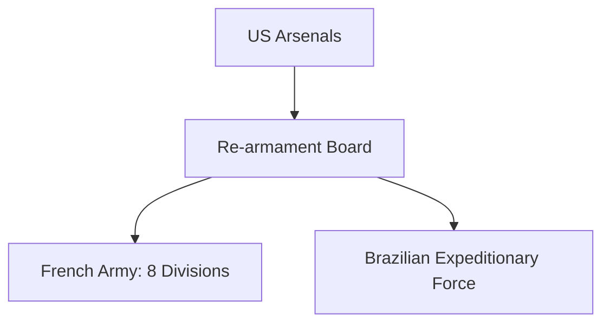

# Chapter 28: Military Supply to Liberated and Latin American Nations

## 1. Context & Core Themes
This chapter explores the logistics of re-arming Allied nations: equipping French divisions in North Africa, supporting Italian co-belligerent forces, and providing military assistance to Latin American countries. It examines the challenge of standardization when introducing US equipment to foreign forces.

---

## 2. Interactive Study Fill-ins (Details to Fill In)
*To complete your study of this chapter, research and fill in the missing metrics below:*

- **Re-armament Programs:**
  - The US re-armed `[___________]` French divisions, providing them with standard US uniforms, weapons, and vehicles.
  - Latin American nations received a total of `[___________]` million dollars in Lend-Lease aid, with Brazil receiving the largest share.

---

## 3. Logistical Architecture (Mermaid.js Diagram)
Complete or extend this diagram depicting the logistical workflows, command hierarchies, or pipelines of this chapter.



---

## 4. Quantitative Modeling: Military Supply to Liberated and Latin American Nations
Standardization checks the compatibility of weapon calibers and replacement parts. We model a compatibility matching system to verify if a foreign division can be sustained using standard US logistics pipelines.

### Mathematical Formulation
$C = \\begin{cases} 1 & \\text{if } Caliber_{force} = Caliber_{pipeline} \\\\ 0 & \\text{otherwise} \\end{cases}$

### Scala 3.8.3 Implementation
Below is the compile-safe Scala 3.8.3 model representing these parameters:

```scala
package Logistics.LiberatedNations

case class WeaponSystem(name: String, caliberMm: Double, countryOfOrigin: String)

object StandardizationMatcher:
  def isCompatible(system: WeaponSystem, pipelineCaliberMm: Double): Boolean =
    system.caliberMm == pipelineCaliberMm
```

---

## 5. Strategic Discussion Questions
1. What logistical issues arose from the French army's desire to maintain their traditional organizational structure while using American-made equipment?
2. Analyze the strategic reasons behind providing military aid to Latin American nations during World War II.
