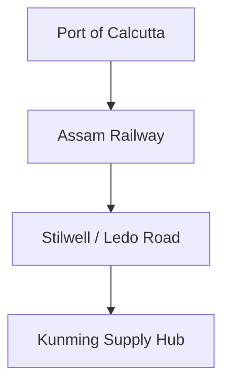

# Chapter 29: Lend-Lease to China, 1943-45

## 1. Context & Core Themes
Following the opening of the Ledo Road (renamed the Stilwell Road) and the expansion of the pipeline, Lend-Lease to China increased. This chapter examines the physical movement of supplies from Calcutta ports, through Assam, and across the border to Chinese armies.

---

## 2. Interactive Study Fill-ins (Details to Fill In)
*To complete your study of this chapter, research and fill in the missing metrics below:*

- **China Lend-Lease:**
  - The first truck convoy over the opened Stilwell Road arrived in Kunming, China, on `[___________]`.
  - The total tonnage of Lend-Lease supplies delivered to China via overland and air routes in 1944 was `[___________]` tons, which increased to `[___________]` tons in 1945.

---

## 3. Logistical Architecture (Mermaid.js Diagram)
Complete or extend this diagram depicting the logistical workflows, command hierarchies, or pipelines of this chapter.



---

## 4. Quantitative Modeling: Lend-Lease to China, 1943-45
Road convoy capacity is constrained by the number of operational trucks, fuel depots along the route, and road maintenance capabilities. We model the daily tonnage capacity ($T_{road}$) of a single-lane wilderness highway.

### Mathematical Formulation
$T_{road} = \frac{N_{trucks} \cdot Capacity_{truck}}{Interval_{days} + T_{transit}}$

### Scala 3.8.3 Implementation
Below is the compile-safe Scala 3.8.3 model representing these parameters:

```scala
package Logistics.ChinaLendLease

case class ConvoyParameters(trucks: Int, avgPayloadTons: Double, transitDays: Double)

object RoadConvoyCapacity:
  def dailyCapacity(params: ConvoyParameters, dispatchIntervalDays: Double): Double =
    val totalTime = params.transitDays + dispatchIntervalDays
    (params.trucks * params.avgPayloadTons) / totalTime
```

---

## 5. Strategic Discussion Questions
1. Why did the opening of the Stilwell Road occur so late in the war, and did its strategic value justify the massive engineering effort?
2. How did the Chinese currency inflation affect the local procurement of supplies by US Army units in China?
