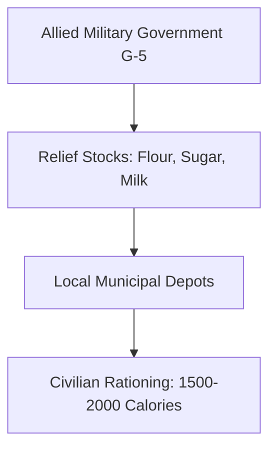

# Chapter 30: The Army and Civilian Supply: I

## 1. Context & Core Themes
As Allied armies liberated territory in Europe, they immediately encountered starving populations, collapsed public utilities, and the threat of disease. This chapter examines the Army’s "Civil Affairs" branch (G-5) and the logistics of distributing emergency food, coal, and medicine to liberated populations.

---

## 2. Interactive Study Fill-ins (Details to Fill In)
*To complete your study of this chapter, research and fill in the missing metrics below:*

- **Civilian Relief in Europe:**
  - The emergency civilian feeding program in Naples, Italy, required importing `[___________]` tons of wheat per month to prevent starvation.
  - The basic relief ration target established by the Allied military government for liberated European civilians was `[___________]` calories per person per day.

---

## 3. Logistical Architecture (Mermaid.js Diagram)
Complete or extend this diagram depicting the logistical workflows, command hierarchies, or pipelines of this chapter.



---

## 4. Quantitative Modeling: The Army and Civilian Supply: I
Calculating caloric relief requirements models the total tonnage of food imports needed ($T_{food}$) based on population size ($P$) and daily caloric target ($C$).

### Mathematical Formulation
$T_{food} = \\frac{P \\cdot C \\cdot 30}{K_{calories/ton}}$

### Scala 3.8.3 Implementation
Below is the compile-safe Scala 3.8.3 model representing these parameters:

```scala
package Logistics.CivilianSupplyI

opaque type Population = Int
object Population:
  def apply(value: Int): Population = value
  extension (p: Population) def toInt: Int = p

object CaloricReliefModel:
  def calculateTonnageRequired(
    pop: Population,
    caloricTarget: Double,
    caloriesPerTon: Double
  ): Double =
    val dailyCaloricTotal = pop.toInt * caloricTarget
    val monthlyCaloricTotal = dailyCaloricTotal * 30.0
    monthlyCaloricTotal / caloriesPerTon
```

---

## 5. Strategic Discussion Questions
1. Why did the War Department accept responsibility for feeding civilian populations in combat zones? What was the "prevent disease and unrest" doctrine?
2. Detail the logistical difficulties of distributing coal to the French population during the freezing winter of 1944-45."
