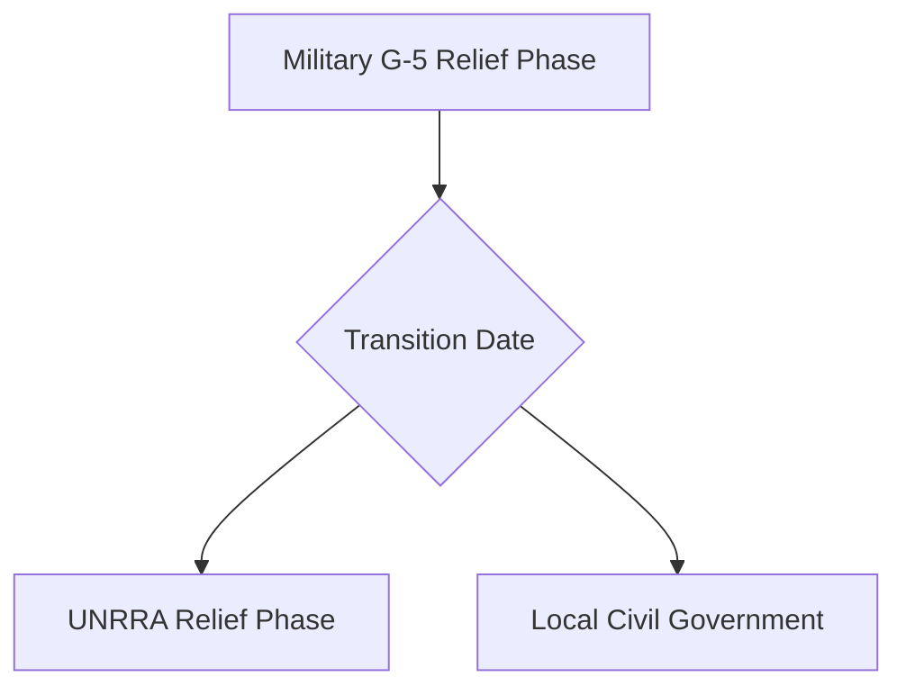

# Chapter 31: The Army and Civilian Supply: II

## 1. Context & Core Themes
This chapter expands on civilian supply, analyzing the complex logistics of relief in Asian and Pacific regions (including liberated Manila and Korea) and the transition of responsibility from the military to civilian organizations like the United Nations Relief and Rehabilitation Administration (UNRRA).

---

## 2. Interactive Study Fill-ins (Details to Fill In)
*To complete your study of this chapter, research and fill in the missing metrics below:*

- **Global Relief Operations:**
  - The transition of relief responsibility from the US Army to UNRRA in Europe took place on `[___________]`.
  - In Manila, after its liberation in early 1945, the US Army distributed over `[___________]` tons of food to the destitute population within the first month.

---

## 3. Logistical Architecture (Mermaid.js Diagram)
Complete or extend this diagram depicting the logistical workflows, command hierarchies, or pipelines of this chapter.



---

## 4. Quantitative Modeling: The Army and Civilian Supply: II
Relief distribution queues model civilian wait times at supply stations. We model the average queue size ($L_q$) using basic queueing theory parameters.

### Mathematical Formulation
$L_q = \frac{\lambda^2}{\mu \cdot (\mu - \lambda)}$

### Scala 3.8.3 Implementation
Below is the compile-safe Scala 3.8.3 model representing these parameters:

```scala
package Logistics.CivilianSupplyII

case class DistributionStation(arrivalRatePerMin: Double, serviceRatePerMin: Double)

object ReliefDistributionQueue:
  def averageQueueLength(station: DistributionStation): Double =
    val l = station.arrivalRatePerMin
    val m = station.serviceRatePerMin
    if m > l then
      (l * l) / (m * (m - l))
    else
      Double.PositiveInfinity
```

---

## 5. Strategic Discussion Questions
1. What organizational differences made the transition from military G-5 supply to UNRRA control difficult?
2. Compare the logistical challenges of civilian relief in a highly urbanized European setting with a devastated Pacific archipelago like the Philippines.
