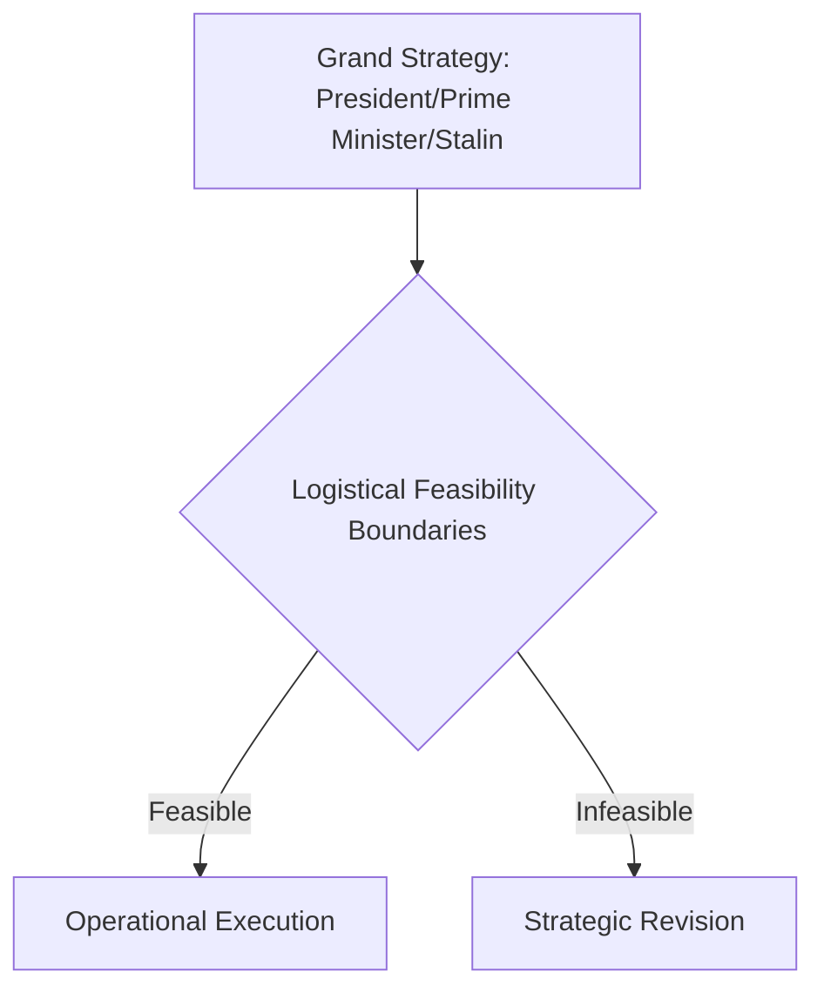

# Chapter 32: Logistics and Strategy in World War II

## 1. Context & Core Themes
The concluding chapter synthesizes the grand lessons of World War II logistics. It reviews how logistics ceased to be a secondary service of support and became the primary determinant of grand strategy, dictating when, where, and with what force the Allied nations could strike.

---

## 2. Interactive Study Fill-ins (Details to Fill In)
*To complete your study of this chapter, research and fill in the missing metrics below:*

- **The Grand Synthesis:**
  - Over the course of the war, the US Army shipped a total of `[___________]` million long tons of cargo overseas.
  - The total cost of the US Army's logistical operations was estimated to represent `[___________]`% of the nation's total war expenditure.
  - The peak overseas troop strength of the US Army reached `[___________]` million men in 1945.

---

## 3. Logistical Architecture (Mermaid.js Diagram)
Complete or extend this diagram depicting the logistical workflows, command hierarchies, or pipelines of this chapter.



---

## 4. Quantitative Modeling: Logistics and Strategy in World War II
Logistical power can be modeled as the correlation between total theater tonnage delivered ($T_{theater}$) and the overall combat power ($P_{combat}$) of the divisions in contact.

### Mathematical Formulation
$P_{combat} = \\alpha \\cdot T_{theater} \\cdot N_{divisions}$

### Scala 3.8.3 Implementation
Below is the compile-safe Scala 3.8.3 model representing these parameters:

```scala
package Logistics.Conclusion

case class TheaterState(tonnageDelivered: Double, divisionsInContact: Int)

object LogisticsCorrelationModel:
  def calculateCombatPowerIndex(
    state: TheaterState,
    efficiencyCoefficient: Double
  ): Double =
    efficiencyCoefficient * state.tonnageDelivered * state.divisionsInContact.toDouble
```

---

## 5. Strategic Discussion Questions
1. In what ways did World War II redefine the relationship between a nation’s industrial capacity and its battlefield tactics?
2. Assess the statement: "Logistics is the science of military planning; strategy is merely the art of the possible." How does the Green Book support this view?
