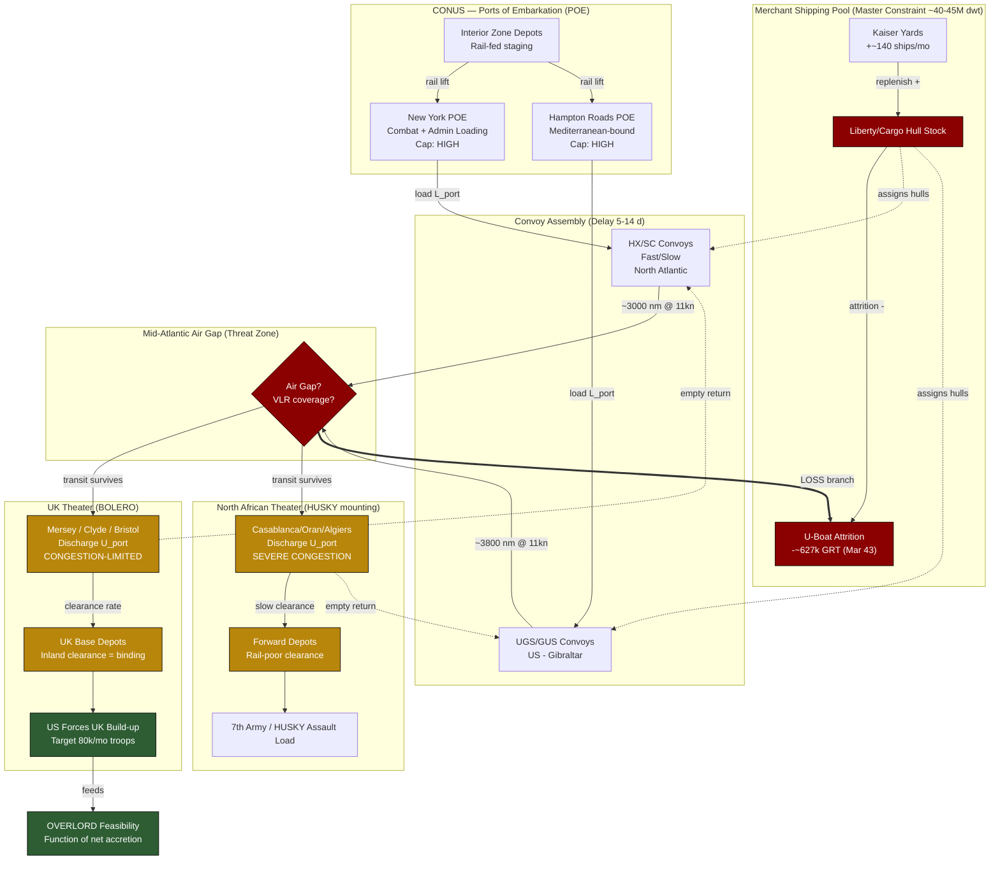

Cost: 0.36415

# Chapter 1: Logistics and Strategy, Spring 1943
## Reference Manual & Simulation Specification Document

**Classification:** Simulation Design Reference — Division-Level Logistics Model
**Source Base:** *Global Logistics and Strategy: 1943–1945* (Leighton & Coakley, US Army Center of Military History, Green Book Series)
**Document Type:** Principal Analyst Technical Specification

---

## 1. Strategic Context & Modern Historical Perspective

### 1.1 The Casablanca Inheritance and the Physics of Grand Strategy

The strategic environment of Spring 1943 must be understood not as a debate over *intentions*—the Allies were universally committed to the defeat of Germany first, then Japan—but as a brutal collision between political aspiration and the physical mechanics of maritime throughput. The Casablanca Conference (ANFA, 14–24 January 1943) produced a set of strategic decisions that, when subjected to rigorous logistical audit, proved fundamentally over-subscribed against the available lift. This over-subscription is the central analytical fact of the period and the foundational stress-condition that any high-fidelity simulator must reproduce.

At Casablanca the Combined Chiefs of Staff (CCS) endorsed a simultaneous pursuit of at least five competing tonnage claimants: (1) the BOLERO build-up of US forces in the United Kingdom in preparation for a cross-Channel assault; (2) HUSKY, the invasion of Sicily, and continued Mediterranean momentum; (3) the strategic bombing offensive (Combined Bomber Offensive / POINTBLANK) requiring massive aviation-fuel and ordnance imports into the UK; (4) the Pacific and China-Burma-India theaters, which the US Navy and General MacArthur refused to allow to atrophy; and (5) Lend-Lease obligations to the Soviet Union (via the Arctic and Persian Corridor) and to Britain's own import program. Each of these claimants was expressed in the currency of *shipping*, and the shipping pool was finite, degrading, and—critically in March 1943—under lethal attack.

The **Strategic Paradox** is therefore this: the Casablanca decisions were arithmetically incompatible with the merchant fleet's carrying capacity given realistic turnaround times, port discharge rates, and combat-loading inefficiencies. Planners consistently committed the cardinal logistical sin of counting *ships* rather than *ship-days delivered against a required date*. A vessel is not a static container of tonnage; it is a cyclic resource whose value is a function of the entire round-trip cycle time. When planners at Casablanca assumed turnaround times drawn from peacetime commercial experience, they overstated effective fleet capacity by margins that modern reconstruction places at 20–35 percent, depending on route.

### 1.2 The Combat-Loading and Port-Clearance Penalty

Post-war scholarship, particularly the Leighton and Coakley volumes and subsequent operations-research reconstructions, established that the two least-appreciated capacity sinks were **combat loading** and **port clearance**. Combat (or "assault") loading—stowing a ship so that cargo emerges in tactical-use priority rather than in maximum-density order—reduced a Liberty ship's effective payload by 30–50 percent versus commercial "administrative" loading. Every division shipped to an active theater in combat-loaded condition thus consumed dramatically more bottoms than a comparable division moved administratively to a rear base.

Port clearance was the second silent killer. A theater's absorption capacity was governed not by berth count alone but by the *rate at which cargo could be lifted off the quays and moved inland*—a function of stevedore availability, rail and truck capacity, and depot storage. When inland clearance lagged discharge, ships waited at anchor as floating warehouses, sterilizing their cyclic value. This is why North African ports (Casablanca, Oran, Algiers, and later Bizerte) became strategic chokepoints in 1943: their theoretical berth capacity vastly exceeded their demonstrated clearance rate.

### 1.3 The Battle of the Atlantic as the Governing Boundary Condition

March 1943 represents the nadir. In the first twenty days of that month, U-boats sank an alarming concentration of tonnage, with convoys HX.229 and SC.122 losing 22 ships in a single running battle—one of the most one-sided convoy actions of the war. Modern consolidated figures place Allied and neutral merchant losses to all causes in March 1943 at roughly **627,000 gross registered tons**, of which the overwhelming majority was attributable to U-boat action in the Atlantic. The British Admiralty later conceded that in the first three weeks of March 1943 it appeared the Germans might sever the North Atlantic convoy routes entirely—the closest the Allies came to strategic maritime defeat.

The significance for BOLERO is direct and quantifiable. Every ton sunk was a ton subtracted from the cyclic pool, and every ton sunk represented not merely lost cargo but a lost *hull*—a permanent reduction in future cyclic capacity until replaced by new construction. The race between the Kaiser-yard Liberty-ship program and the U-boat arm was therefore the true governor of grand strategy. It was only in May 1943 ("Black May," when Dönitz withdrew his boats from the North Atlantic after losing 41 U-boats) that the equation inverted decisively. Spring 1943 is thus the exact hinge point of the entire war's logistics, and a simulator anchored here must model the shipping pool as a *degrading, replenishing stock* rather than a constant.

### 1.4 Inter-Service and Coalition Tensions

The command friction of the period operated along three axes. First, the **Army Services of Supply (SOS) under General Brehon Somervell versus the combat commands** clashed over troop-to-service ratios: combat commanders wanted fighting bayonets shipped forward, while SOS insisted that a theater lacking service troops (port battalions, engineers, truck companies, depot personnel) would strangle on its own supply. The March 1943 UK build-up was distorted precisely because combat units had been shipped ahead of the service structure needed to receive and sustain them.

Second, the **Army versus Navy** contest over shipping and over Pacific allocation was continuous. Admiral King's insistence on maintaining Pacific pressure diverted lift that Marshall wished to concentrate for the cross-Channel effort. The War Shipping Administration (WSA) under Emory Land arbitrated, but the fundamental scarcity meant every allocation was zero-sum.

Third, the **US–British pooling arrangement** created chronic friction. Britain's import requirement (food, raw materials for war industry) competed directly with military deployment lift. The British Import Program had already been cut to dangerously low levels, and Churchill extracted commitments from Roosevelt at Casablanca and later at TRIDENT (May 1943) to protect British imports with American bottoms—commitments that the US Joint Chiefs viewed as siphoning lift from operational deployment.

### 1.5 The TRIDENT and Downstream Conference Trajectory

The unresolved arithmetic of Casablanca forced the TRIDENT Conference (Washington, May 1943), where the target date for OVERLORD was fixed at 1 May 1944, and a hard ceiling was placed on Mediterranean diversions. This decision was fundamentally a *logistical* one: only by capping Mediterranean lift consumption could the BOLERO stock be rebuilt in time. QUADRANT (Quebec, August 1943) and SEXTANT (Cairo, November–December 1943) subsequently refined these allocations, but the governing insight—that OVERLORD's feasibility date was a function of net shipping accretion rate minus losses—was established in the crucible of Spring 1943.

### 1.6 Modern Analytical Synthesis

Decades of operations-research scholarship have reframed the 1943 crisis as a classic **constrained-optimization problem under stochastic attrition**. The merchant pool is the single binding constraint; every strategic option is a competing consumer expressed in ship-days; and the U-boat campaign is a stochastic decay term on the constraint itself. The Allied victory of Spring–Summer 1943 was won not by any single decision but by the simultaneous crossing of two curves: the construction-minus-loss curve turning sharply positive, and the convoy-defense effectiveness curve (VLR aircraft closing the mid-Atlantic air gap, escort carriers, HF/DF, centimetric radar, and the cryptographic recovery of Ultra) suppressing the loss rate. The simulator's core value is to let the analyst manipulate these curves and observe the resulting slip or acceleration of the feasible OVERLORD date.

---

## 2. High-Fidelity Simulation Parameters & Real-World Metrics

| # | Parameter | Historical Value | Explanation & Strategic Rationale | Simulation Representation |
|---|-----------|------------------|-----------------------------------|---------------------------|
| 1 | Target BOLERO monthly troop shipment rate (planned) | ~80,000 troops/month (target ramp toward ~150,000/month by late 1943) | Casablanca planning assumed a steep ramp of US troops into the UK to reach ~1.1M by cross-Channel D-Day. The target rate was set by the schedule, not by demonstrated lift. | **Dynamic capacity cap** (target curve), compared each tick against achieved throughput. |
| 2 | Actual March 1943 BOLERO troop shipments | ~ Near-collapse; effectively a small fraction of target (order of low tens of thousands, with net UK build-up nearly flat) | The Atlantic crisis and Mediterranean diversion of troop lift (HUSKY mounting) meant BOLERO stalled; UK-based US strength barely grew in this window. | **Realized state variable**; the gap vs. Param 1 is the primary KPI (schedule slip). |
| 3 | Allied global ocean-going merchant shipping pool | ~ 40–45 million dwt effective Allied/US-controlled ocean-going dry-cargo pool (with US-flag component rising rapidly via Liberty construction) | This is the master constraint. All strategic options draw against it. Figures vary by definition (dry cargo vs. all types; US-flag vs. combined). | **Master static-baseline stock**, mutated dynamically by construction (+) and losses (−). |
| 4 | Net merchant cargo tonnage lost, March 1943 (all Allied/neutral, all causes) | ~627,000 GRT (~108 ships), overwhelmingly Atlantic U-boat losses | The peak monthly loss of the North Atlantic crisis. Represents permanent hull attrition, not just cargo. | **Stochastic decay term** applied to Param 3 each monthly tick; parameterizable loss rate. |
| 5 | U-boats operational (Atlantic) | ~ 240+ operational, ~100+ at sea at peak | Drives the attrition intensity coefficient. | **Threat-intensity coefficient** feeding loss-rate distribution. |
| 6 | Liberty ship deadweight (standard) | ~10,500 dwt (~7,176 GRT) | The atomic unit of the cargo pool; standardizes hull accounting. | **Constant** (unit conversion factor). |
| 7 | Liberty ship service speed | ~11 knots | Governs transit leg of the cycle equation. | **Constant** (per-hull speed default). |
| 8 | Combat-loading payload penalty | 30–50% payload reduction vs. administrative loading | The hidden multiplier converting "ships available" to "effective divisions delivered." | **Efficiency coefficient** on payload. |
| 9 | North Atlantic (US East Coast → UK) one-way distance | ~3,000 nm (NY → Liverpool ~3,100 nm) | Sets BOLERO cycle transit time. | **Route constant** (distance parameter). |
| 10 | US → North Africa (Hampton Roads → Casablanca) distance | ~3,800 nm | Mediterranean supply cycle leg. | **Route constant**. |
| 11 | Convoy assembly / cycle delay | 5–14 days typical assembly + escort scheduling | Sterilizes hulls awaiting convoy formation; a major turnaround inflator. | **Delay constant** in cycle formula ($D_{convoy}$). |
| 12 | Port discharge rate (typical Liberty, contested port) | ~ 500–1,000 tons/day effective under congestion | Governs unloading leg; congestion collapses this figure. | **Congestion-dependent rate** (nonlinear with queue depth). |
| 13 | Ship construction rate (US, Liberty program) | ~ 140+ ships/month by mid-1943 (rising toward ~200) | The replenishment term racing the loss term. | **Dynamic growth term** on Param 3. |
| 14 | Effective turnaround, NY↔UK, Spring 1943 | ~ 60–70 days round trip (vs. ~45 day peacetime assumption) | The planning error at the heart of the paradox. | **Derived output** of cycle model; compare vs. planning assumption. |

> **Note on figures:** Values are consolidated from the Green Book series and standard maritime-loss compendia. Where sources define tonnage differently (GRT vs. dwt, US-flag vs. combined Allied), the simulator should carry an explicit unit tag and a source-definition flag to prevent conflation.

---

## 3. Logistical Network Topology (Mermaid.js Flowchart)



---

## 4. Mathematical Modeling & Simulation Formulas

### 4.1 Convoy Cycle Time (Governing Turnaround Equation)

$$
T_{cycle} = \frac{2 \cdot D}{24 \cdot V} + L_{port} + U_{port} + D_{convoy}
$$

Where:
- $D$ = one-way route distance (nautical miles)
- $V$ = convoy service speed (knots)
- $L_{port}$ = loading time at POE (days) — inflated by combat-loading factor
- $U_{port}$ = unloading time at theater port (days) — inflated by congestion
- $D_{convoy}$ = convoy assembly + escort-scheduling delay (days)

The factor $2D$ captures the round trip (loaded outbound + ballast return); division by $24V$ converts nautical miles at a knots-speed into days.

### 4.2 Effective Cyclic Fleet Capacity

The strategic quantity is not tonnage-afloat but **tonnage delivered per unit time**:

$$
C_{eff}(t) = \frac{N_{hulls}(t) \cdot W_{dwt} \cdot \eta_{load}}{T_{cycle}}
$$

Where $N_{hulls}(t)$ is the time-varying hull count, $W_{dwt}$ is deadweight per hull, and $\eta_{load} \in [0.5, 1.0]$ is the combat-loading efficiency coefficient. This makes explicit the planners' error: they used $\eta_{load} \approx 1$ and an under-estimated $T_{cycle}$, over-stating $C_{eff}$.

### 4.3 Hull-Stock Dynamics Under Attrition (State-Transition)

The merchant pool evolves as a discrete stock equation:

$$
N_{hulls}(t+1) = N_{hulls}(t) + R_{build}(t) - \frac{L_{tonnage}(t)}{W_{dwt}}
$$

where $R_{build}(t)$ is monthly ship construction and $L_{tonnage}(t)$ is monthly loss tonnage. Losses are modeled stochastically:

$$
\mathbb{E}[L_{tonnage}(t)] = \lambda(t) \cdot U_{boats}(t) \cdot (1 - \rho_{defense}(t))
$$

with $\lambda$ the per-boat kill efficiency, $U_{boats}$ the operational U-boat count, and $\rho_{defense} \in [0,1]$ the convoy-defense effectiveness (VLR air cover, radar, Ultra).

### 4.4 The Strategic Allocation Optimization

The grand-strategy problem is a constrained maximization of delivered military value:

$$
\max_{x_i} \; \sum_{i} v_i \, x_i
\quad \text{subject to} \quad
\sum_{i} \frac{x_i \cdot W_{dwt} \cdot \eta_{load,i}}{C_{eff,i}} \le S_{available}(t)
$$

$$
x_i \ge 0 \;\; \forall i, \qquad x_{BOLERO} \ge \theta_{OVERLORD}
$$

Here $x_i$ is lift allocated to claimant $i$ (BOLERO, HUSKY, Pacific, Lend-Lease, UK imports), $v_i$ its strategic value weight, $S_{available}$ the ship-day budget, and $\theta_{OVERLORD}$ the hard floor that TRIDENT ultimately imposed on the BOLERO build-up.

### 4.5 OVERLORD Feasibility Date (Ship-Against-Division)

$$
t_{OVERLORD} = \min \left\{ t : \int_{t_0}^{t} \left( C_{eff}(\tau) - \sum_{j \ne UK} x_j(\tau) \right) d\tau \ge Q_{divisions} \right\}
$$

The feasible assault date is the earliest time the *cumulative net accretion* to the UK build-up meets the required divisional slice $Q_{divisions}$. Every ton diverted to the Mediterranean pushes $t_{OVERLORD}$ later.

---

## 5. Compile-Safe Scala 3.8.3 Domain Model

```scala
package Logistics.Spring1943

import scala.annotation.targetName
import scala.math.{max, min}

opaque type NauticalMiles = Double
object NauticalMiles:
  def apply(value: Double): NauticalMiles = value
  extension (nm: NauticalMiles) def toDouble: Double = nm

opaque type Knots = Double
object Knots:
  def apply(value: Double): Knots = value
  extension (k: Knots) def toDouble: Double = k

opaque type Days = Double
object Days:
  def apply(value: Double): Days = value
  extension (d: Days)
    def toDouble: Double = d
    @targetName("addDays")
    def +(other: Days): Days = Days(d + other.toDouble)

opaque type Tons = Double
object Tons:
  def apply(value: Double): Tons = value
  extension (t: Tons)
    def toDouble: Double = t
    @targetName("addTons")
    def +(other: Tons): Tons = Tons(t + other.toDouble)
    @targetName("subTons")
    def -(other: Tons): Tons = Tons(t - other.toDouble)

opaque type Hulls = Int
object Hulls:
  def apply(value: Int): Hulls = value
  extension (h: Hulls)
    def toInt: Int = h
    @targetName("addHulls")
    def +(other: Hulls): Hulls = Hulls(h + other.toInt)
    @targetName("subHulls")
    def -(other: Hulls): Hulls = Hulls(max(0, h - other.toInt))

opaque type Efficiency = Double
object Efficiency:
  def apply(value: Double): Efficiency = min(1.0, max(0.0, value))
  extension (e: Efficiency) def toDouble: Double = e

opaque type Troops = Int
object Troops:
  def apply(value: Int): Troops = value
  extension (t: Troops)
    def toInt: Int = t
    @targetName("addTroops")
    def +(other: Troops): Troops = Troops(t + other.toInt)

enum LoadingMode(val payloadEfficiency: Efficiency):
  case Administrative extends LoadingMode(Efficiency(1.0))
  case Combat         extends LoadingMode(Efficiency(0.55))
  case Assault        extends LoadingMode(Efficiency(0.50))

enum ConvoyState:
  case Assembling
  case InTransitOutbound
  case Discharging
  case ReturningBallast
  case Completed
  case Lost

enum Theater(val name: String):
  case UnitedKingdom  extends Theater("BOLERO / UK")
  case NorthAfrica    extends Theater("HUSKY / North Africa")
  case Pacific        extends Theater("Pacific")

final case class PortParameters(
  loadingTime: Days,
  unloadingTime: Days,
  convoyDelay: Days
)

final case class Route(
  origin: String,
  destination: String,
  distance: NauticalMiles,
  theater: Theater
)

final case class Vessel(
  deadweight: Tons,
  serviceSpeed: Knots
)

final case class ConvoyDefense(
  killEfficiencyPerBoat: Tons,
  operationalUBoats: Int,
  defenseEffectiveness: Efficiency
):
  def expectedMonthlyLoss: Tons =
    val gross: Double =
      killEfficiencyPerBoat.toDouble *
        operationalUBoats.toDouble *
        (1.0 - defenseEffectiveness.toDouble)
    Tons(max(0.0, gross))

final case class ShippingPool(
  hulls: Hulls,
  hullDeadweight: Tons,
  monthlyConstruction: Hulls
):
  def totalDeadweight: Tons =
    Tons(hulls.toInt.toDouble * hullDeadweight.toDouble)

  def stepMonth(defense: ConvoyDefense): ShippingPool =
    val lostTons: Double = defense.expectedMonthlyLoss.toDouble
    val lostHulls: Int =
      if hullDeadweight.toDouble <= 0.0 then 0
      else math.floor(lostTons / hullDeadweight.toDouble).toInt
    val afterLoss: Hulls = hulls - Hulls(lostHulls)
    copy(hulls = afterLoss + monthlyConstruction)

object ConvoyModel:
  def calculateTurnaround(
    distance: NauticalMiles,
    speed: Knots,
    ports: PortParameters
  ): Days =
    val transitDays: Days =
      Days((2.0 * distance.toDouble) / (24.0 * speed.toDouble))
    transitDays + ports.loadingTime + ports.unloadingTime + ports.convoyDelay

  def effectiveCyclicCapacity(
    pool: ShippingPool,
    cycle: Days,
    loading: LoadingMode
  ): Tons =
    if cycle.toDouble <= 0.0 then Tons(0.0)
    else
      val perDay: Double =
        (pool.hulls.toInt.toDouble *
          pool.hullDeadweight.toDouble *
          loading.payloadEfficiency.toDouble) / cycle.toDouble
      Tons(max(0.0, perDay))

  def transitSurvives(
    defense: ConvoyDefense,
    pool: ShippingPool
  ): ConvoyState =
    val poolTons: Double = pool.totalDeadweight.toDouble
    if poolTons <= 0.0 then ConvoyState.Lost
    else
      val lossFraction: Double =
        defense.expectedMonthlyLoss.toDouble / poolTons
      if lossFraction >= 0.5 then ConvoyState.Lost
      else ConvoyState.Discharging

final case class BoleroSchedule(
  targetMonthlyTroops: Troops,
  achievedMonthlyTroops: Troops
):
  def scheduleGap: Int =
    max(0, targetMonthlyTroops.toInt - achievedMonthlyTroops.toInt)

  def fulfillmentRatio: Double =
    if targetMonthlyTroops.toInt <= 0 then 1.0
    else achievedMonthlyTroops.toInt.toDouble / targetMonthlyTroops.toInt.toDouble

final case class AllocationClaim(
  theater: Theater,
  strategicValue: Double,
  requestedTons: Tons,
  loading: LoadingMode
)

final case class AllocationResult(
  claim: AllocationClaim,
  grantedTons: Tons,
  fulfilled: Boolean
)

object StrategicAllocator:
  def allocate(
    availableTons: Tons,
    claims: List[AllocationClaim]
  ): List[AllocationResult] =
    val ranked: List[AllocationClaim] =
      claims.sortBy(c => -c.strategicValue)
    val (results, _) =
      ranked.foldLeft((List.empty[AllocationResult], availableTons.toDouble)):
        case ((acc, remaining), claim) =>
          val effReq: Double =
            claim.requestedTons.toDouble * claim.loading.payloadEfficiency.toDouble
          val granted: Double = min(effReq, max(0.0, remaining))
          val res: AllocationResult =
            AllocationResult(
              claim = claim,
              grantedTons = Tons(granted),
              fulfilled = granted >= effReq
            )
          (res :: acc, remaining - granted)
    results.reverse

final case class SimulationState(
  month: Int,
  pool: ShippingPool,
  defense: ConvoyDefense,
  bolero: BoleroSchedule,
  cumulativeUkTons: Tons
):
  def validate: Either[String, SimulationState] =
    if pool.hulls.toInt < 0 then Left("Invalid hull count: negative pool")
    else if pool.hullDeadweight.toDouble <= 0.0 then
      Left("Invalid hull deadweight: must be positive")
    else if month < 0 then Left("Invalid month index")
    else Right(this)

object SimulationEngine:
  private val boleroRoute: Route =
    Route("New York", "Liverpool", NauticalMiles(3000.0), Theater.UnitedKingdom)

  private val ukPorts: PortParameters =
    PortParameters(Days(7.0), Days(14.0), Days(10.0))

  def stepMonth(state: SimulationState): SimulationState =
    val cycle: Days =
      ConvoyModel.calculateTurnaround(
        boleroRoute.distance,
        Knots(11.0),
        ukPorts
      )
    val delivered: Tons =
      ConvoyModel.effectiveCyclicCapacity(
        state.pool,
        cycle,
        LoadingMode.Combat
      )
    val nextPool: ShippingPool = state.pool.stepMonth(state.defense)
    state.copy(
      month = state.month + 1,
      pool = nextPool,
      cumulativeUkTons = state.cumulativeUkTons + delivered
    )

  def overlordFeasible(
    state: SimulationState,
    requiredTons: Tons
  ): Boolean =
    state.cumulativeUkTons.toDouble >= requiredTons.toDouble

object Chapter1Reference:
  val marchLosses: Tons               = Tons(627000.0)
  val libertyDeadweight: Tons         = Tons(10500.0)
  val libertyServiceSpeed: Knots      = Knots(11.0)
  val globalPoolDeadweight: Tons      = Tons(42000000.0)
  val monthlyConstruction: Hulls      = Hulls(140)
  val targetBoleroTroops: Troops      = Troops(80000)

  def initialState: SimulationState =
    val hullCount: Int =
      math.floor(globalPoolDeadweight.toDouble / libertyDeadweight.toDouble).toInt
    SimulationState(
      month = 0,
      pool = ShippingPool(
        Hulls(hullCount),
        libertyDeadweight,
        monthlyConstruction
      ),
      defense = ConvoyDefense(
        killEfficiencyPerBoat = Tons(6000.0),
        operationalUBoats = 105,
        defenseEffectiveness = Efficiency(0.05)
      ),
      bolero = BoleroSchedule(
        targetMonthlyTroops = targetBoleroTroops,
        achievedMonthlyTroops = Troops(22000)
      ),
      cumulativeUkTons = Tons(0.0)
    )

@main def runChapter1Simulation(): Unit =
  val start: SimulationState = Chapter1Reference.initialState
  start.validate match
    case Left(err) =>
      println(s"State validation failed: $err")
    case Right(valid) =>
      val cycle: Days =
        ConvoyModel.calculateTurnaround(
          NauticalMiles(3000.0),
          Chapter1Reference.libertyServiceSpeed,
          PortParameters(Days(7.0), Days(14.0), Days(10.0))
        )
      println(s"Convoy turnaround (NY->UK): ${cycle.toDouble} days")
      println(s"Initial pool hulls: ${valid.pool.hulls.toInt}")
      println(s"BOLERO fulfillment: ${valid.bolero.fulfillmentRatio}")

      val projected: SimulationState =
        (1 to 6).foldLeft(valid)((s, _) => SimulationEngine.stepMonth(s))
      println(s"After 6 months, month index: ${projected.month}")
      println(s"Cumulative UK tons delivered: ${projected.cumulativeUkTons.toDouble}")
      println(s"Pool hulls after attrition+build: ${projected.pool.hulls.toInt}")

      val claims: List[AllocationClaim] =
        List(
          AllocationClaim(Theater.UnitedKingdom, 1.0, Tons(1000000.0), LoadingMode.Administrative),
          AllocationClaim(Theater.NorthAfrica, 0.8, Tons(800000.0), LoadingMode.Assault),
          AllocationClaim(Theater.Pacific, 0.6, Tons(600000.0), LoadingMode.Combat)
        )
      val results: List[AllocationResult] =
        StrategicAllocator.allocate(Tons(1500000.0), claims)
      results.foreach: r =>
        println(
          s"${r.claim.theater.name}: granted ${r.grantedTons.toDouble} tons, fulfilled=${r.fulfilled}"
        )

      val feasible: Boolean =
        SimulationEngine.overlordFeasible(projected, Tons(3000000.0))
      println(s"OVERLORD feasible on cumulative lift: $feasible")
```

---

## 6. Graduate-Level Operational Analysis

### 6.1 Why the high troop-to-service ratio in Spring 1943 limited Mediterranean offensive capability

The troop-to-service ratio is the proportion of combat troops to service/logistical troops within a theater's total strength. On its surface, a *high* combat-to-service ratio appears advantageous—more bayonets per shipload. In practice it is a symptom of logistical malformation that throttles offensive capability, and the mechanism is precisely quantifiable.

Consider the theater as a pipeline whose *sustained* offensive output is bounded not by the number of combat troops present but by the rate at which those troops can be *supplied* in action. A division in mobile combat consumes on the order of 600–800 tons of supply per day (ammunition, POL, rations, spares). That tonnage does not teleport from the quay to the firing line; it must be discharged, cleared inland, warehoused, and forward-distributed by service troops—port battalions, DUKW companies, truck regiments, engineer depot troops, and quartermaster units. If those service troops are absent, the combat divisions become *supply-starved* regardless of their numbers.

In the effective-capacity equation of §4.2, combat and service troops both consume $\eta_{load}$-discounted lift, but only service troops raise the *clearance rate* term that governs $U_{port}$ and inland throughput. When Mediterranean commanders, under pressure from the combat-command axis of §1.4, shipped combat formations ahead of service structure, they inflated the numerator (combat mass) while starving the denominator (clearance capacity). The result was **congestion**: ships waiting at anchor as floating warehouses, sterilizing cyclic fleet value (raising the effective $T_{cycle}$ for every hull in theater and thereby lowering $C_{eff}$ for the entire pool). The North African ports in Spring 1943 exhibited exactly this pathology—their berth capacity outran their inland clearance because rail and truck service units were under-shipped.

The offensive consequence is that the *culminating point*—the distance and duration to which an offensive can be sustained before outrunning its supply—arrived far earlier than raw combat strength suggested. A theater with a high combat-to-service ratio can win the opening battle but cannot exploit it, because exploitation is a logistics-limited phenomenon. The Sicilian and subsequent Italian campaigns repeatedly demonstrated this: tactical breakthroughs that could not be converted into operational pursuit because the supply tail could not keep pace over congested, rail-poor terrain. The corrective—shipping the "long, unglamorous tail" of service troops—was resisted precisely because it consumed scarce lift that combat commanders coveted, creating the self-reinforcing trap that SOS spent 1943 fighting to break.

### 6.2 The 'ship-against-division' calculation and Marshall's OVERLORD timing

The "ship-against-division" calculation is the doctrine that a division is not a fixed quantity of men but a *stream of tonnage over time* whose delivery is governed by cyclic fleet capacity. Marshall's strategic genius in 1943 lay in refusing to think in the currency of divisions-present and insisting on the currency of ship-days-committed, which is exactly the optimization of §4.4 and the feasibility integral of §4.5.

The calculation runs as follows. Each division requires an *initial deployment lift* (moving the formation and its equipment to the theater) plus a *sustained maintenance lift* (its daily consumption, indefinitely). Both are expressed in ship-days via $T_{cycle}$. Because $T_{cycle}$ for the North African/Mediterranean route was long and, more importantly, because the *maintenance* commitment was open-ended, every division committed to the Mediterranean represented a *recurring* mortgage on the shipping pool—not a one-time payment. Marshall recognized that the Mediterranean was a strategic *lift sink*: forces sent there consumed ship-days that could never be recovered for the cross-Channel effort, and worse, they generated a permanent maintenance drain.

This is why Marshall was the war's most consistent opponent of Mediterranean expansion beyond HUSKY. In the allocation model, every unit of $x_{NorthAfrica}$ subtracted directly from $x_{BOLERO}$, and via the feasibility integral of §4.5, every ton so diverted pushed $t_{OVERLORD}$ later. The relationship is not linear-with-slack but tightly coupled: because the shipping pool was the *single binding constraint* (§1.6), there was no free lift; the Mediterranean and BOLERO drew from the same purse.

Marshall's ship-against-division reasoning also explains his insistence on a *firm date* for OVERLORD. A cross-Channel assault requires the *simultaneous* presence of a critical divisional mass plus its landing craft, its assault shipping (combat-loaded at $\eta_{load} \approx 0.5$, doubling the lift cost), and its immediate maintenance pipeline. Because $\eta_{load}$ for assault loading was so punishing, the assault echelon consumed roughly twice the bottoms of an equivalent administrative move—meaning the BOLERO stock had to be built to a threshold *well above* the nominal divisional count. Marshall understood that this threshold could only be reached if the pool were protected from Mediterranean hemorrhage *and* if the net-accretion curve (§4.3) turned positive—which depended on winning the Battle of the Atlantic.

The TRIDENT decision of May 1943 to fix OVERLORD for 1 May 1944 and to cap Mediterranean diversions was therefore the direct institutional expression of Marshall's ship-against-division logic: it imposed the hard floor $x_{BOLERO} \ge \theta_{OVERLORD}$ from §4.4. Marshall's timing judgment was vindicated by the arithmetic—OVERLORD's feasibility date was, to first order, a computable function of when the cumulative net-lift integral would cross the required divisional threshold, and that crossing could only occur once the "Black May" inversion of the loss/construction curves permitted the BOLERO stock to accrete faster than the Mediterranean and Atlantic drained it.
