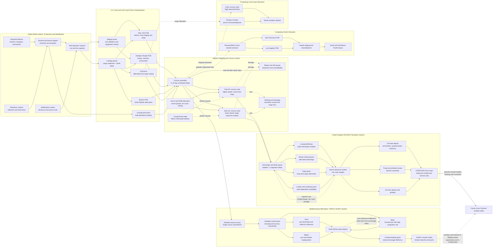

Cost: 0.47870375

### 1. Strategic Context & Modern Historical Perspective

The logistical situation confronting the Western Allies in spring 1943 was not simply a problem of producing enough matériel. By that point, the United States and British Commonwealth possessed—or were rapidly acquiring—an overwhelming aggregate advantage in industrial output. The more difficult problem was converting continental production into usable combat power at distant fronts. That conversion required an interconnected system of merchant shipping, troop transports, tankers, escorts, ports, depots, railways, trucks, landing craft, service troops, and administrative organizations. Failure or delay at any one stage could immobilize resources elsewhere in the pipeline.

This distinction is central to Chapter 1 of *Global Logistics and Strategy: 1943–1945*. Strategy was constrained not by nominal production alone, but by the throughput of the entire deployment system. A division existing in the United States was not equivalent to a division operational in Britain, North Africa, or the Pacific. Its strategic value depended on whether troop space, cargo shipping, escort protection, port capacity, equipment, maintenance units, and theater infrastructure could all be provided at the correct time and location.

#### The strategic paradox

The central paradox was that Allied leaders increasingly planned on the assumption of global material superiority while operating through a shipping system that remained acutely scarce, vulnerable, and slow to respond. Strategic conferences could assign divisions and air groups to future operations more readily than logisticians could create the transportation capacity needed to place and sustain those forces.

At Casablanca in January 1943, the Allies faced three competing demands:

1. Resume and expand the BOLERO concentration of American forces in the United Kingdom for an eventual cross-Channel offensive.
2. Exploit the anticipated conclusion of the Tunisian campaign through an attack on Sicily—Operation HUSKY—and potentially further operations in the Mediterranean.
3. Maintain the Pacific offensives, the China-Burma-India line of communications, Alaska, hemispheric defense, and Lend-Lease deliveries to Britain and the Soviet Union.

These demands were not independent. A ship assigned to carry a division to Britain could not simultaneously sustain operations in North Africa. A fast troop transport allocated to the Pacific reduced the rate at which American personnel could be concentrated in the United Kingdom. A cargo vessel retained in a Mediterranean shuttle service was unavailable for an Atlantic voyage. Landing ships committed to HUSKY or subsequent Mediterranean operations could not be prepared for OVERLORD.

Conference decisions therefore operated against a common, globally coupled resource pool. Casablanca, TRIDENT in May 1943, QUADRANT in August, and SEXTANT late in the year did not merely select among theater strategies. They repeatedly reallocated shipping, landing craft, service units, and port-development resources. The nominal force totals written into conference papers were feasible only if assumptions concerning ship construction, losses, turnaround, port discharge, and theater retention proved correct.

They often did not.

A vessel's effective carrying capacity was not its deadweight capacity multiplied by the number of nominal voyages in a year. The governing quantity was delivered tons per ship-day. A voyage consumed time while the ship:

- awaited a berth at the loading port;
- loaded and documented cargo;
- moved to a convoy assembly point;
- waited for convoy formation and escorts;
- crossed at convoy rather than independent speed;
- waited outside the destination port;
- discharged cargo;
- underwent repairs, bunkering, ballasting, or reconfiguration; and
- returned, often with little strategically useful backhaul cargo.

Combat loading made the problem more severe. A ship administratively loaded for maximum cubic or weight utilization was unsuitable for an amphibious assault if urgently required ammunition, vehicles, engineer stores, and rations were inaccessible beneath lower-priority cargo. Combat loading sacrificed part of a vessel's theoretical capacity to improve accessibility and tactical sequencing. Thus the same hull had different effective capacities depending on mission type.

Port clearance was equally important. Discharge did not complete the transportation process. Cargo left on quays occupied working space and eventually blocked further unloading. Effective port capacity was consequently:

$$
\min(\text{berth discharge capacity},\ \text{transit-shed capacity},\ \text{inland clearance capacity}).
$$

Rail wagons, trucks, labor gangs, cranes, warehouses, documentation systems, and road congestion could therefore constrain a port whose berths were technically capable of handling much more cargo.

#### The Battle of the Atlantic and the shipping constraint

The March 1943 Atlantic crisis illustrated the vulnerability of the system. U-boat wolf packs inflicted severe losses on North Atlantic convoys, especially HX 229 and SC 122. These losses mattered beyond the immediate destruction of hulls and cargo. They increased convoy delays, forced route diversions, raised escort requirements, disrupted schedules, and reduced planners' confidence in future arrivals.

Historical shipping statistics require careful treatment. The frequently cited March 1943 figure of approximately 627,000 gross registered tons refers to merchant vessel tonnage sunk by U-boats in the Atlantic, not directly to cargo weight. Gross registered tonnage measured enclosed ship volume, whereas deadweight tonnage measured carrying capacity and cargo tons measured actual lading. They are not interchangeable.

Modern scholarship nonetheless supports the chapter's central conclusion: controlled ocean-going merchant shipping was the ultimate common denominator of Allied coalition strategy. Industrial output, manpower, and strategic intent could not be converted into synchronized global offensives faster than shipping and terminal networks permitted.

The crisis began to ease after March. Improved escort groups, support carriers, centimetric radar, high-frequency direction finding, intelligence exploitation, long-range aircraft, and aggressive anti-submarine doctrine transformed the Atlantic balance during May 1943. American ship construction was also approaching rates that would exceed losses. Yet this improvement did not make shipping abundant. Newly constructed vessels still required crews, escorts, port space, and efficient employment. Moreover, expansion of offensive operations generated new demands at nearly the same pace as new capacity appeared.

#### Inter-service and coalition tensions

The allocation process produced persistent institutional friction. The Army Service Forces—renamed from the Services of Supply in March 1943—tended to evaluate plans in terms of balanced deployment, sustainment, and total pipeline capacity. Operational commanders naturally emphasized immediate combat opportunity. A theater commander might regard the absence of one assault division as the decisive limitation on an operation; logisticians might regard the absence of port battalions, truck companies, signal units, replacement depots, and maintenance organizations as the greater long-term danger.

This difference produced the recurring problem of unbalanced forces. Combat formations possessed high political visibility and appeared to create immediate capability. Service units consumed the same troop accommodations but did not appear in headline divisional totals. Shipping combat troops without their support structure could therefore increase nominal theater strength while reducing sustainable operational effectiveness.

Army-Navy relations introduced another allocation boundary. The Navy controlled escorts and much of convoy routing; the War Shipping Administration allocated most civilian-controlled American merchant shipping; the Army operated transports and ports and generated theater requirements. Amphibious operations required naval landing craft and assault shipping whose design, production, transfer, and strategic assignment could not be improvised by the Army alone.

British-American pooling arrangements added coalition complexity. Pooling increased global efficiency by allowing ships to be assigned according to common need, but it also obscured the national incidence of costs. British authorities had to maintain imports essential to the survival of the United Kingdom while supporting imperial and Mediterranean commitments. American planners, particularly General George C. Marshall, feared that continued Mediterranean operations would absorb shipping and landing craft needed to build the decisive concentration in Britain. British planners regarded Mediterranean operations as a means of exploiting existing deployments, weakening Axis positions, reopening sea routes, and avoiding a premature cross-Channel assault.

Neither side's position can be reduced to obstruction or strategic irrationality. The British had experienced the consequences of undertaking major operations before means were available and were skeptical of an inadequately prepared 1943 invasion of France. The Americans correctly perceived that a succession of ostensibly limited Mediterranean operations could become self-perpetuating. Once ports, airfields, hospitals, depots, and lines of communication had been created, substantial shipping and service forces were required merely to maintain them.

#### BOLERO, HUSKY, and global opportunity cost

BOLERO was therefore more than a troop movement schedule. It was a cumulative stock-building program intended to create a balanced American force in Britain. Its inputs included troops, organizational equipment, replacement matériel, ammunition reserves, vehicles, petroleum products, construction materials, and the service organizations required to receive and distribute them.

Operation TORCH had disrupted the earlier BOLERO build-up by drawing forces and shipping from Britain into North Africa. HUSKY continued the diversion. From a local Mediterranean perspective, using forces already present was economical: shorter voyages from North Africa to Sicily and existing regional bases favored exploitation. From a global perspective, however, every additional Mediterranean commitment could delay the reconstruction of the British base for OVERLORD.

The same logic applied in the Pacific. Pacific distances were longer, backhaul opportunities poorer, and theater infrastructure less developed. A division in the Southwest or Central Pacific could impose a larger continuing shipping demand than a comparable formation in Britain. Petroleum tankers, reefers, construction equipment, engineer units, and base-development cargo competed with Atlantic programs even when troop strengths appeared modest.

Lend-Lease further complicated the picture. Soviet aid transported by Arctic convoys, the Persian Corridor, or the Pacific route served a strategic purpose independent of direct American deployment. Reducing such shipments might release shipping in an accounting sense while imposing larger military costs if Soviet combat power declined. Shipping optimization therefore could not be based only on American theater tonnage.

#### Modern interpretation

Postwar records and operational research reinforce four conclusions.

First, shipping was a dynamic stock rather than a fixed capacity. Construction, sinkings, repairs, convoy speed, port delays, and route assignment continuously altered effective availability.

Second, tonnage alone is an inadequate measure. Troop berths, refrigerated space, tanker capacity, heavy-lift gear, landing craft, and combat-loaded assault shipping were only partially substitutable. A surplus of Liberty-ship dry-cargo capacity did not solve a shortage of fast troop transports or LSTs.

Third, pipeline inventory mattered. Cargo already at sea, awaiting discharge, or immobilized in theater depots could not be instantly redirected after a strategic decision. Conference decisions therefore operated with long lags.

Fourth, the decisive shift of 1943 was not the disappearance of constraints but the Allies' increasing ability to manage them. Better anti-submarine warfare, standardized ship production, improved port organizations, centralized allocation, and more realistic planning converted shipping superiority into operational tempo. OVERLORD became feasible when the Allies had accumulated not merely divisions, but an integrated transportation and sustainment system capable of delivering and supporting them.

---

### 2. High-Fidelity Simulation Parameters & Real-World Metrics

#### Source and measurement warning

Contemporary reports use several incompatible units:

- **GRT:** gross registered tons, a volumetric measure of ship size.
- **DWT:** deadweight tons, the carrying weight of cargo, fuel, stores, crew, and water.
- **Measurement tons:** normally 40 cubic feet of cargo volume.
- **Long tons:** 2,240 pounds of actual weight.
- **Troops:** personnel embarked or arrived, depending on the report.

A simulator must not convert GRT directly into cargo tons without a vessel-class conversion coefficient.

| Parameter | Recommended database value | Unit and confidence | Historical interpretation | Simulation representation |
|---|---:|---|---|---|
| BOLERO desired movement rate used as the spring planning benchmark | 150,000 | troops/month; rounded planning figure | The restored build-up was commonly expressed as a desired flow on the order of 150,000 men monthly. It represented the scale necessary to create a cross-Channel force within the desired strategic timetable, not a guaranteed March sailing allocation. | `TargetFlow`; time-indexed policy target rather than physical capacity. |
| March 1943 BOLERO movement | approximately 20,000 | troops/month; rounded historical flow | The movement to Britain had fallen to roughly 20,000 men during the post-TORCH trough. Contemporary tables vary according to embarkations, arrivals, and inclusion of air personnel. A database should preserve the underlying series rather than invent false single-person precision. | `ObservedFlow`; initialize March throughput at 20,000 with a source-precision flag of ±2,000. |
| BOLERO target attainment | 0.1333 | dimensionless | Approximately $20,000/150,000$, indicating that only about 13.3 percent of the desired monthly personnel flow was being achieved. | Dynamic KPI, not an independent capacity. |
| Allied-controlled global ocean-going merchant pool, spring 1943 | approximately 45,000,000 | DWT; strategic-order estimate | Includes the broad Allied-controlled ocean-going pool, but exact totals vary by date, minimum vessel size, inclusion of tankers, coastal shipping, neutral-controlled ships, and vessels under repair. It is not all assignable to U.S. Army dry cargo. | Global stock cap partitioned by vessel class, national control, repair status, and existing assignment. |
| March 1943 Atlantic merchant tonnage sunk by U-boats | 627,377 | GRT of vessels; high confidence for the standard Atlantic series | Standard U-boat loss series attribute about 627,377 GRT to Atlantic sinkings in March. This is destroyed ship volume, not cargo weight or DWT. | Dynamic attrition event reducing hull inventory by vessel records; use GRT only as an aggregate audit statistic. |
| Approximate ships sunk in the same Atlantic U-boat series | 108 | merchant vessels | The effect depended on ship classes and cargoes, not only ship count. Loss of a tanker, reefer, or fast liner could have disproportionate effects. | Stochastic vessel-removal events stratified by class. |
| Representative North Atlantic one-way route | 3,000 | nautical miles | New York–Liverpool routing distance varied with origin, destination, evasive routing, weather, and convoy track. | Route-specific distance; never a universal constant. |
| Representative convoy speed | 8–10 | knots | Slow and fast convoys used different speed standards. Speed was constrained by the slowest ship and by weather, zigzagging, and convoy discipline. | Route/vessel-group speed cap with weather and threat modifiers. |
| One-way transit at 9 knots over 3,000 nm | 13.89 | days | Pure steaming time: $3,000/(24\times9)$. It excludes assembly, loading, discharge, and waiting. | Derived value. |
| Representative round-trip steaming time | 27.78 | days | Pure movement component only. | Derived cycle-time component. |
| Representative loading delay | 4–8 | days | Depended on berth access, cargo readiness, labor, documentation, and loading method. | Port queue and service-time distribution. |
| Representative unloading delay | 5–12 | days | British ports generally possessed strong infrastructure, but congestion, air-raid precautions, labor, rail clearance, and cargo type caused variation. Mediterranean ports could be far more restrictive. | Destination-port queue and service-time distribution. |
| Convoy assembly and sailing delay | 3–10 | days | Ships did not necessarily sail when loading ended; they waited for convoy dates, escorts, and routing orders. | Scheduled batch-departure process. |
| Illustrative Atlantic round-trip cycle | 45–58 | days | Sum of 27.78 steaming days and representative terminal/assembly delays. | Dynamic vessel unavailability duration. |
| Administrative dry-cargo utilization | 0.80–0.95 | fraction of usable DWT or cube | Cargo density, trim, incompatibility, and unused spaces prevent perfect utilization. | Vessel-load efficiency coefficient. |
| Combat-loading utilization | 0.55–0.75 | fraction of administrative capacity | Assault accessibility and tactical sequencing reduce nominal capacity. Exact values are ship- and plan-specific. | Mission-dependent capacity multiplier. |
| Port effective throughput | minimum of discharge and clearance | tons/day | A port cannot sustain discharge above the rate at which cargo can leave the quay and transit sheds. | Node capacity: `min(berth, handling, inland clearance, storage headroom)`. |
| Theater reserve requirement | 30–90 | days of supply, scenario-dependent | Reserve objectives differed by commodity and theater. Ammunition and petroleum policy could diverge sharply from subsistence policy. | Commodity-specific target stock, not a universal constant. |
| Vessel operational availability | 0.75–0.90 | fraction, illustrative | Accounts for maintenance, repair, weather, loading, and administrative interruptions beyond scheduled voyages. | Dynamic availability coefficient calibrated by vessel class. |

The three requested headline figures should therefore be stored as follows:

```text
bolero_target_troops_per_month = 150000
bolero_actual_march_1943_troops = 20000
allied_ocean_merchant_pool_spring_1943_dwt = 45000000
atlantic_u_boat_sinkings_march_1943_grt = 627377
```

The final field must not be named `cargo_tons_lost`: doing so would encode a historical category error. If cargo loss is required, it should be calculated vessel by vessel from manifests, estimated load factors, and survival/salvage status.

---

### 3. Logistical Network Topology (Detailed Mermaid.js Flowchart)



For simulation purposes, every transport edge should possess:

- distance in nautical miles;
- eligible vessel classes;
- convoy or independent-sailing speed;
- departure interval;
- escort requirement;
- seasonal and threat multipliers;
- loss and damage probabilities;
- backhaul availability; and
- origin and destination queue disciplines.

Every port node should possess berth count, tons per berth-day, cargo-class restrictions, storage headroom, and inland-clearance capacity. Congestion must propagate upstream: once storage fills, discharge slows; once discharge slows, ships remain in port; once ships remain in port, global available hull-days decline.

---

### 4. Mathematical Modeling & Simulation Formulas

#### 4.1 Convoy cycle time

For route $r$, let:

- $D_r$ = one-way distance in nautical miles;
- $V_r$ = effective convoy speed in knots;
- $L_r$ = loading and origin-port waiting time in days;
- $U_r$ = destination waiting and unloading time in days;
- $A_r$ = convoy assembly and sailing delay in days;
- $R_r$ = repair, weather, diversion, and other delay in days.

The requested basic model is:

$$
T_{cycle,r}
=
\frac{2D_r}{24V_r}
+
L_r
+
U_r
+
A_r.
$$

A more complete operational model is:

$$
T_{cycle,r}
=
\frac{D_r}{24V_{out,r}}
+
\frac{D_r}{24V_{return,r}}
+
L_r
+
U_r
+
A_r
+
R_r.
$$

The factor of 24 converts nautical miles per hour into nautical miles per day. The factor of two in the simplified expression represents outbound and return travel. The formula assumes that distance and speed are identical in both directions and that port delays already cover all terminal activities.

For $D=3{,}000$ nautical miles and $V=9$ knots:

$$
T_{\text{steam}}
=
\frac{2(3{,}000)}{24(9)}
=
27.78\text{ days}.
$$

If loading requires 6 days, unloading 8 days, and convoy assembly 5 days:

$$
T_{cycle}
=
27.78+6+8+5
=
46.78\text{ days}.
$$

#### 4.2 Delivered capacity per vessel

Let:

- $C_s$ = nominal deadweight capacity of vessel $s$;
- $\eta^{stow}_{s,k}$ = stowage efficiency for cargo class $k$;
- $\eta^{combat}_{s,m}$ = mission-loading coefficient;
- $\eta^{avail}_s$ = operational availability;
- $p^{survive}_{r,t}$ = probability of surviving route $r$ during period $t$.

Effective cargo delivered per voyage is:

$$
Q_{s,r,k,t}
=
C_s
\eta^{stow}_{s,k}
\eta^{combat}_{s,m}
p^{survive}_{r,t}.
$$

Expected daily delivery capacity is:

$$
\bar q_{s,r,k,t}
=
\frac{
C_s
\eta^{stow}_{s,k}
\eta^{combat}_{s,m}
\eta^{avail}_s
p^{survive}_{r,t}
}{
T_{cycle,r}
}.
$$

If $N_{s,r,t}$ vessels of class $s$ are assigned to route $r$, period throughput over $\Delta t$ days is approximately:

$$
F_{r,k,t}
=
\Delta t
\sum_s
N_{s,r,t}
\bar q_{s,r,k,t}.
$$

#### 4.3 Port throughput and congestion

For port $p$, let:

- $B_p$ = number of operational berths;
- $h_{p,k}$ = handling capacity per berth-day for cargo $k$;
- $G_{p,t}$ = inland-clearance capacity;
- $W_{p,t}$ = available warehouse or open-storage headroom;
- $\Delta t$ = period length.

Then:

$$
H_{p,k,t}
=
B_p h_{p,k}.
$$

Total feasible port flow is:

$$
F_{p,t}
\le
\min
\left(
\sum_k H_{p,k,t},
G_{p,t},
\frac{W_{p,t}}{\Delta t}+G_{p,t}
\right).
$$

A simple nonlinear congestion delay can be represented through utilization $\rho_p$:

$$
\rho_{p,t}
=
\frac{\lambda_{p,t}}{\mu_{p,t}},
$$

where $\lambda$ is arriving demand and $\mu$ is practical service capacity. For $\rho<1$, an approximation for queue delay is:

$$
D^{queue}_{p,t}
=
D^0_p
+
\alpha_p
\frac{\rho_{p,t}}{1-\rho_{p,t}}.
$$

As utilization approaches one, delay rises sharply. This reproduces the historically important behavior in which a port operating near nominal capacity becomes unstable under small arrival surges or clearance interruptions.

#### 4.4 Time-expanded multicommodity shipping model

Let:

- $R$ = routes;
- $S$ = vessel classes;
- $K$ = cargo classes;
- $P$ = ports;
- $\Theta$ = theaters;
- $T$ = planning periods;
- $x_{s,r,t}$ = number of vessels of class $s$ dispatched on route $r$ in period $t$;
- $y_{r,k,t}$ = cargo of class $k$ dispatched on route $r$;
- $I_{p,k,t}$ = inventory at port $p$;
- $Z_{\theta,k,t}$ = theater stock;
- $d_{\theta,k,t}$ = theater demand;
- $\tau_r$ = route transit lag in periods;
- $a_{s,r}$ = 1 if vessel class $s$ can serve route $r$;
- $c_{s,r,k}$ = effective cargo capacity;
- $N_{s,t}$ = available vessels;
- $P_{p,k,t}$ = exogenous production or arrivals;
- $g_{p,t}$ = port throughput.

A strategic objective may maximize weighted demand satisfaction while penalizing losses, delay, and unbalanced deployments:

$$
\max
\sum_{\theta,k,t}
w_{\theta,k,t} q_{\theta,k,t}
-
\sum_{s,r,t}
\left(
c^{loss}_{s,r,t}
+
c^{delay}_{s,r,t}
\right)x_{s,r,t}
-
\sum_{\theta,t}
c^{imbalance}_{\theta,t} b_{\theta,t}.
$$

Subject to vessel availability:

$$
\sum_r x_{s,r,t}
\le
N_{s,t}
\qquad
\forall s,t.
$$

Because dispatched ships remain unavailable until their cycle is complete:

$$
N_{s,t}
=
N^{total}_{s,t}
-
\sum_r
\sum_{\tau=t-\lceil T_{cycle,r}\rceil+1}^{t}
x_{s,r,\tau}
-
N^{repair}_{s,t}.
$$

Cargo capacity is constrained by assigned shipping:

$$
\sum_k y_{r,k,t}
\le
\sum_s c_{s,r,k}x_{s,r,t}
\qquad
\forall r,t.
$$

Port inventory evolves as:

$$
I_{p,k,t+1}
=
I_{p,k,t}
+
P_{p,k,t}
+
\sum_{r:\,dest(r)=p}
y_{r,k,t-\tau_r}
-
\sum_{r:\,orig(r)=p}
y_{r,k,t}
-
\ell_{p,k,t}.
$$

Port throughput is constrained:

$$
\sum_{r:\,orig(r)=p}\sum_k y_{r,k,t}
\le
g^{load}_{p,t},
$$

$$
\sum_{r:\,dest(r)=p}\sum_k y_{r,k,t-\tau_r}
\le
g^{discharge}_{p,t},
$$

$$
\sum_{r:\,dest(r)=p}\sum_k y_{r,k,t-\tau_r}
\le
g^{clearance}_{p,t}.
$$

Demand satisfaction is:

$$
0 \le q_{\theta,k,t}\le d_{\theta,k,t},
$$

and theater stocks evolve as:

$$
Z_{\theta,k,t+1}
=
Z_{\theta,k,t}
+
A_{\theta,k,t}
-
q_{\theta,k,t}.
$$

A balanced-force constraint can represent the requirement for service troops:

$$
S_{\theta,t}
\ge
\beta_\theta C_{\theta,t},
$$

where $C_{\theta,t}$ is combat strength, $S_{\theta,t}$ is service-support strength, and $\beta_\theta$ is the minimum support ratio. A force that violates this constraint may still exist administratively, but its effective combat power should be reduced:

$$
E_{\theta,t}
=
C_{\theta,t}
\min
\left(
1,
\frac{S_{\theta,t}}{\beta_\theta C_{\theta,t}}
\right).
$$

This formulation makes the spring 1943 strategic problem explicit: maximizing nominal divisions overseas is not equivalent to maximizing effective combat power.

---

### 5. Compile-Safe Scala 3.8.3 Domain Model

```scala
package Logistics.Spring1943

import scala.annotation.targetName
import scala.math.min

opaque type NauticalMiles = Double
object NauticalMiles:
  def apply(value: Double): NauticalMiles =
    require(value >= 0.0 && value.isFinite, "Nautical miles must be finite and non-negative")
    value

  extension (nm: NauticalMiles)
    def toDouble: Double = nm

opaque type Knots = Double
object Knots:
  def apply(value: Double): Knots =
    require(value > 0.0 && value.isFinite, "Knots must be finite and positive")
    value

  extension (k: Knots)
    def toDouble: Double = k

opaque type Days = Double
object Days:
  def apply(value: Double): Days =
    require(value >= 0.0 && value.isFinite, "Days must be finite and non-negative")
    value

  val Zero: Days = Days(0.0)

  extension (d: Days)
    def toDouble: Double = d

    @targetName("addDays")
    def +(other: Days): Days = Days(d + other.toDouble)

    @targetName("subtractDays")
    def -(other: Days): Days = Days(d - other.toDouble)

    def min(other: Days): Days = Days(math.min(d, other.toDouble))
    def isZero: Boolean = d == 0.0

opaque type Tons = Double
object Tons:
  def apply(value: Double): Tons =
    require(value >= 0.0 && value.isFinite, "Tons must be finite and non-negative")
    value

  val Zero: Tons = Tons(0.0)

  extension (tons: Tons)
    def toDouble: Double = tons

    @targetName("addTons")
    def +(other: Tons): Tons = Tons(tons + other.toDouble)

    @targetName("subtractTons")
    def -(other: Tons): Tons = Tons(tons - other.toDouble)

    @targetName("scaleTons")
    def *(factor: Double): Tons = Tons(tons * factor)

    def min(other: Tons): Tons = Tons(math.min(tons, other.toDouble))

opaque type GrossRegisteredTons = Double
object GrossRegisteredTons:
  def apply(value: Double): GrossRegisteredTons =
    require(value >= 0.0 && value.isFinite, "GRT must be finite and non-negative")
    value

  extension (tons: GrossRegisteredTons)
    def toDouble: Double = tons

opaque type Persons = Int
object Persons:
  def apply(value: Int): Persons =
    require(value >= 0, "Persons must be non-negative")
    value

  extension (persons: Persons)
    def toInt: Int = persons

opaque type Probability = Double
object Probability:
  def apply(value: Double): Probability =
    require(value >= 0.0 && value <= 1.0 && value.isFinite, "Probability must be in [0, 1]")
    value

  val Certain: Probability = Probability(1.0)
  val Impossible: Probability = Probability(0.0)

  extension (probability: Probability)
    def toDouble: Double = probability

opaque type Efficiency = Double
object Efficiency:
  def apply(value: Double): Efficiency =
    require(value > 0.0 && value <= 1.0 && value.isFinite, "Efficiency must be in (0, 1]")
    value

  val Full: Efficiency = Efficiency(1.0)

  extension (efficiency: Efficiency)
    def toDouble: Double = efficiency

opaque type NodeId = String
object NodeId:
  def apply(value: String): NodeId =
    require(value.trim.nonEmpty, "Node identifier must be non-empty")
    value

  extension (id: NodeId)
    def value: String = id

opaque type RouteId = String
object RouteId:
  def apply(value: String): RouteId =
    require(value.trim.nonEmpty, "Route identifier must be non-empty")
    value

  extension (id: RouteId)
    def value: String = id

opaque type VesselId = String
object VesselId:
  def apply(value: String): VesselId =
    require(value.trim.nonEmpty, "Vessel identifier must be non-empty")
    value

  extension (id: VesselId)
    def value: String = id

opaque type ShipmentId = String
object ShipmentId:
  def apply(value: String): ShipmentId =
    require(value.trim.nonEmpty, "Shipment identifier must be non-empty")
    value

  extension (id: ShipmentId)
    def value: String = id

enum CargoClass:
  case DryCargo
  case Ammunition
  case BulkPetroleum
  case Vehicles
  case RefrigeratedCargo
  case Personnel
  case LandingCraft

enum VesselClass:
  case LibertyDryCargo
  case VictoryDryCargo
  case Tanker
  case FastTroopTransport
  case RefrigeratedShip
  case LandingShipTank

enum RouteStatus:
  case Open
  case Restricted
  case Closed

enum VesselStatus:
  case Available
  case Loading
  case AwaitingConvoy
  case AtSea
  case Unloading
  case UnderRepair
  case Sunk

enum ShipmentPhase:
  case QueuedForLoading
  case Loading
  case AwaitingConvoy
  case Outbound
  case AwaitingDischarge
  case Unloading
  case Delivered
  case Lost
  case Cancelled

enum StrategicProgram:
  case Bolero
  case Mediterranean
  case Pacific
  case LendLease
  case OverlordPreparation

final case class PortParameters(
  loadingTime: Days,
  unloadingTime: Days,
  convoyDelay: Days
)

final case class PortCapacity(
  berthCount: Int,
  berthHandlingPerDay: Tons,
  inlandClearancePerDay: Tons,
  storageCapacity: Tons
):
  require(berthCount > 0, "A port must have at least one berth")

  def nominalHandlingPerDay: Tons =
    Tons(berthCount.toDouble * berthHandlingPerDay.toDouble)

  def effectiveThroughputPerDay: Tons =
    nominalHandlingPerDay.min(inlandClearancePerDay)

sealed trait LogisticsNode:
  def id: NodeId
  def name: String

final case class ProductionNode(
  id: NodeId,
  name: String,
  dailyOutput: Map[CargoClass, Tons]
) extends LogisticsNode

final case class PortNode(
  id: NodeId,
  name: String,
  capacity: PortCapacity,
  parameters: PortParameters
) extends LogisticsNode

final case class DepotNode(
  id: NodeId,
  name: String,
  storageCapacity: Tons
) extends LogisticsNode

final case class CombatNode(
  id: NodeId,
  name: String,
  program: StrategicProgram,
  dailyDemand: Map[CargoClass, Tons]
) extends LogisticsNode

final case class Route(
  id: RouteId,
  origin: NodeId,
  destination: NodeId,
  distance: NauticalMiles,
  convoySpeed: Knots,
  status: RouteStatus,
  periodCapacity: Tons,
  assemblyInterval: Days,
  survivalProbability: Probability,
  permittedClasses: Set[VesselClass]
):
  require(origin != destination, "Route origin and destination must differ")
  require(permittedClasses.nonEmpty, "Route must permit at least one vessel class")

final case class Vessel(
  id: VesselId,
  vesselClass: VesselClass,
  deadweightCapacity: Tons,
  stowageEfficiency: Efficiency,
  operationalAvailability: Efficiency,
  status: VesselStatus
):
  def administrativeCapacity: Tons =
    Tons(deadweightCapacity.toDouble * stowageEfficiency.toDouble)

  def availableCapacity: Tons =
    Tons(administrativeCapacity.toDouble * operationalAvailability.toDouble)

final case class CargoLoad(
  cargoClass: CargoClass,
  quantity: Tons,
  combatLoadingEfficiency: Efficiency
):
  def occupiedCapacity: Tons =
    Tons(quantity.toDouble / combatLoadingEfficiency.toDouble)

final case class Shipment(
  id: ShipmentId,
  vesselId: VesselId,
  routeId: RouteId,
  load: CargoLoad,
  phase: ShipmentPhase,
  remainingPhaseTime: Days,
  expectedDeliveredTons: Tons
)

final case class PortInventory(
  nodeId: NodeId,
  stocks: Map[CargoClass, Tons]
):
  def quantityOf(cargoClass: CargoClass): Tons =
    stocks.getOrElse(cargoClass, Tons.Zero)

  def remove(cargoClass: CargoClass, quantity: Tons): Either[String, PortInventory] =
    val available = quantityOf(cargoClass)
    if quantity.toDouble > available.toDouble then
      Left(s"Insufficient inventory for $cargoClass")
    else
      val updated = available - quantity
      Right(copy(stocks = stocks.updated(cargoClass, updated)))

  def add(cargoClass: CargoClass, quantity: Tons): PortInventory =
    val updated = quantityOf(cargoClass) + quantity
    copy(stocks = stocks.updated(cargoClass, updated))

final case class HistoricalConstants(
  boleroTargetPerMonth: Persons,
  boleroMarchActual: Persons,
  alliedMerchantPool: Tons,
  marchAtlanticUBoatLosses: GrossRegisteredTons
):
  def boleroAttainment: Double =
    if boleroTargetPerMonth.toInt == 0 then 0.0
    else boleroMarchActual.toInt.toDouble / boleroTargetPerMonth.toInt.toDouble

object HistoricalConstants:
  val Spring1943: HistoricalConstants =
    HistoricalConstants(
      boleroTargetPerMonth = Persons(150000),
      boleroMarchActual = Persons(20000),
      alliedMerchantPool = Tons(45000000.0),
      marchAtlanticUBoatLosses = GrossRegisteredTons(627377.0)
    )

object ConvoyModel:
  def calculateTurnaround(
    distance: NauticalMiles,
    speed: Knots,
    ports: PortParameters
  ): Days =
    val transitDays: Days =
      Days((2.0 * distance.toDouble) / (24.0 * speed.toDouble))

    transitDays +
      ports.loadingTime +
      ports.unloadingTime +
      ports.convoyDelay

  def calculateRouteTurnaround(
    route: Route,
    origin: PortParameters,
    destination: PortParameters
  ): Days =
    val transitDays: Days =
      Days((2.0 * route.distance.toDouble) / (24.0 * route.convoySpeed.toDouble))

    transitDays +
      origin.loadingTime +
      destination.unloadingTime +
      route.assemblyInterval

  def effectiveVoyageCapacity(
    vessel: Vessel,
    combatLoadingEfficiency: Efficiency,
    survivalProbability: Probability
  ): Tons =
    Tons(
      vessel.availableCapacity.toDouble *
        combatLoadingEfficiency.toDouble *
        survivalProbability.toDouble
    )

  def expectedDailyThroughput(
    vessel: Vessel,
    turnaround: Days,
    combatLoadingEfficiency: Efficiency,
    survivalProbability: Probability
  ): Tons =
    require(turnaround.toDouble > 0.0, "Turnaround must be positive")
    val voyageCapacity: Tons =
      effectiveVoyageCapacity(
        vessel,
        combatLoadingEfficiency,
        survivalProbability
      )
    Tons(voyageCapacity.toDouble / turnaround.toDouble)

final case class Network(
  nodes: Map[NodeId, LogisticsNode],
  routes: Map[RouteId, Route],
  vessels: Map[VesselId, Vessel]
):
  def validate: Either[List[String], Network] =
    val routeErrors: List[String] =
      routes.values.toList.flatMap { route =>
        val originError: List[String] =
          if nodes.contains(route.origin) then Nil
          else List(s"Unknown origin for route ${route.id.value}")

        val destinationError: List[String] =
          if nodes.contains(route.destination) then Nil
          else List(s"Unknown destination for route ${route.id.value}")

        originError ++ destinationError
      }

    if routeErrors.isEmpty then Right(this)
    else Left(routeErrors)

final case class SimulationState(
  currentDay: Days,
  network: Network,
  inventories: Map[NodeId, PortInventory],
  shipments: Map[ShipmentId, Shipment],
  routeUsage: Map[RouteId, Tons],
  delivered: Map[StrategicProgram, Map[CargoClass, Tons]]
):
  def inventoryAt(nodeId: NodeId): PortInventory =
    inventories.getOrElse(nodeId, PortInventory(nodeId, Map.empty))

  def routeUsed(routeId: RouteId): Tons =
    routeUsage.getOrElse(routeId, Tons.Zero)

sealed trait SimulationCommand

final case class DispatchShipment(
  shipmentId: ShipmentId,
  vesselId: VesselId,
  routeId: RouteId,
  load: CargoLoad
) extends SimulationCommand

final case class AdvanceTime(
  elapsed: Days
) extends SimulationCommand

final case class ChangeRouteStatus(
  routeId: RouteId,
  status: RouteStatus
) extends SimulationCommand

final case class RecordVesselLoss(
  vesselId: VesselId,
  shipmentId: ShipmentId
) extends SimulationCommand

object SimulationEngine:
  def step(
    state: SimulationState,
    command: SimulationCommand
  ): Either[String, SimulationState] =
    command match
      case dispatch: DispatchShipment =>
        dispatchShipment(state, dispatch)

      case advance: AdvanceTime =>
        Right(advanceTime(state, advance.elapsed))

      case change: ChangeRouteStatus =>
        changeRouteStatus(state, change)

      case loss: RecordVesselLoss =>
        recordVesselLoss(state, loss)

  private def dispatchShipment(
    state: SimulationState,
    command: DispatchShipment
  ): Either[String, SimulationState] =
    for
      vessel <- state.network.vessels
        .get(command.vesselId)
        .toRight("Unknown vessel")
      route <- state.network.routes
        .get(command.routeId)
        .toRight("Unknown route")
      _ <-
        if state.shipments.contains(command.shipmentId) then
          Left("Shipment identifier already exists")
        else Right(())
      _ <-
        if vessel.status == VesselStatus.Available then Right(())
        else Left("Vessel is not available")
      _ <-
        if route.status != RouteStatus.Closed then Right(())
        else Left("Route is closed")
      _ <-
        if route.permittedClasses.contains(vessel.vesselClass) then Right(())
        else Left("Vessel class is not permitted on route")
      _ <-
        if command.load.occupiedCapacity.toDouble <= vessel.availableCapacity.toDouble then
          Right(())
        else Left("Cargo exceeds vessel capacity")
      used = state.routeUsed(route.id)
      projectedUsage = used + command.load.quantity
      _ <-
        if projectedUsage.toDouble <= route.periodCapacity.toDouble then Right(())
        else Left("Route period capacity exceeded")
      originInventory = state.inventoryAt(route.origin)
      reducedInventory <- originInventory.remove(
        command.load.cargoClass,
        command.load.quantity
      )
    yield
      val expectedDelivered: Tons =
        Tons(
          command.load.quantity.toDouble *
            route.survivalProbability.toDouble
        )

      val shipment: Shipment =
        Shipment(
          id = command.shipmentId,
          vesselId = vessel.id,
          routeId = route.id,
          load = command.load,
          phase = ShipmentPhase.Loading,
          remainingPhaseTime = route.assemblyInterval,
          expectedDeliveredTons = expectedDelivered
        )

      val updatedVessel: Vessel =
        vessel.copy(status = VesselStatus.Loading)

      state.copy(
        network = state.network.copy(
          vessels = state.network.vessels.updated(vessel.id, updatedVessel)
        ),
        inventories = state.inventories.updated(route.origin, reducedInventory),
        shipments = state.shipments.updated(shipment.id, shipment),
        routeUsage = state.routeUsage.updated(route.id, projectedUsage)
      )

  private def advanceTime(
    state: SimulationState,
    elapsed: Days
  ): SimulationState =
    val updatedShipments: Map[ShipmentId, Shipment] =
      state.shipments.map { case (id, shipment) =>
        id -> advanceShipment(state.network, shipment, elapsed)
      }

    val updatedVessels: Map[VesselId, Vessel] =
      state.network.vessels.map { case (id, vessel) =>
        val associated: Option[Shipment] =
          updatedShipments.values.find(_.vesselId == id)

        val status: VesselStatus =
          associated match
            case Some(shipment) => vesselStatusFor(shipment.phase)
            case None           => vessel.status

        id -> vessel.copy(status = status)
      }

    state.copy(
      currentDay = state.currentDay + elapsed,
      network = state.network.copy(vessels = updatedVessels),
      shipments = updatedShipments,
      routeUsage = Map.empty
    )

  private def advanceShipment(
    network: Network,
    shipment: Shipment,
    elapsed: Days
  ): Shipment =
    if shipment.phase == ShipmentPhase.Delivered ||
       shipment.phase == ShipmentPhase.Lost ||
       shipment.phase == ShipmentPhase.Cancelled
    then shipment
    else if elapsed.toDouble < shipment.remainingPhaseTime.toDouble then
      shipment.copy(
        remainingPhaseTime =
          Days(shipment.remainingPhaseTime.toDouble - elapsed.toDouble)
      )
    else
      val route: Route =
        network.routes.getOrElse(
          shipment.routeId,
          throw new IllegalStateException("Shipment references unknown route")
        )

      shipment.phase match
        case ShipmentPhase.QueuedForLoading =>
          shipment.copy(
            phase = ShipmentPhase.Loading,
            remainingPhaseTime = route.assemblyInterval
          )

        case ShipmentPhase.Loading =>
          shipment.copy(
            phase = ShipmentPhase.AwaitingConvoy,
            remainingPhaseTime = route.assemblyInterval
          )

        case ShipmentPhase.AwaitingConvoy =>
          val oneWayTransit: Days =
            Days(route.distance.toDouble / (24.0 * route.convoySpeed.toDouble))
          shipment.copy(
            phase = ShipmentPhase.Outbound,
            remainingPhaseTime = oneWayTransit
          )

        case ShipmentPhase.Outbound =>
          shipment.copy(
            phase = ShipmentPhase.AwaitingDischarge,
            remainingPhaseTime = Days(1.0)
          )

        case ShipmentPhase.AwaitingDischarge =>
          shipment.copy(
            phase = ShipmentPhase.Unloading,
            remainingPhaseTime = Days(1.0)
          )

        case ShipmentPhase.Unloading =>
          shipment.copy(
            phase = ShipmentPhase.Delivered,
            remainingPhaseTime = Days.Zero
          )

        case ShipmentPhase.Delivered =>
          shipment

        case ShipmentPhase.Lost =>
          shipment

        case ShipmentPhase.Cancelled =>
          shipment

  private def vesselStatusFor(phase: ShipmentPhase): VesselStatus =
    phase match
      case ShipmentPhase.QueuedForLoading  => VesselStatus.Loading
      case ShipmentPhase.Loading           => VesselStatus.Loading
      case ShipmentPhase.AwaitingConvoy    => VesselStatus.AwaitingConvoy
      case ShipmentPhase.Outbound          => VesselStatus.AtSea
      case ShipmentPhase.AwaitingDischarge => VesselStatus.Unloading
      case ShipmentPhase.Unloading         => VesselStatus.Unloading
      case ShipmentPhase.Delivered         => VesselStatus.Available
      case ShipmentPhase.Lost              => VesselStatus.Sunk
      case ShipmentPhase.Cancelled         => VesselStatus.Available

  private def changeRouteStatus(
    state: SimulationState,
    command: ChangeRouteStatus
  ): Either[String, SimulationState] =
    state.network.routes.get(command.routeId) match
      case None =>
        Left("Unknown route")

      case Some(route) =>
        val updatedRoute: Route = route.copy(status = command.status)
        Right(
          state.copy(
            network = state.network.copy(
              routes = state.network.routes.updated(route.id, updatedRoute)
            )
          )
        )

  private def recordVesselLoss(
    state: SimulationState,
    command: RecordVesselLoss
  ): Either[String, SimulationState] =
    for
      vessel <- state.network.vessels
        .get(command.vesselId)
        .toRight("Unknown vessel")
      shipment <- state.shipments
        .get(command.shipmentId)
        .toRight("Unknown shipment")
      _ <-
        if shipment.vesselId == vessel.id then Right(())
        else Left("Shipment is not assigned to vessel")
    yield
      val lostVessel: Vessel =
        vessel.copy(status = VesselStatus.Sunk)

      val lostShipment: Shipment =
        shipment.copy(
          phase = ShipmentPhase.Lost,
          remainingPhaseTime = Days.Zero,
          expectedDeliveredTons = Tons.Zero
        )

      state.copy(
        network = state.network.copy(
          vessels = state.network.vessels.updated(vessel.id, lostVessel)
        ),
        shipments = state.shipments.updated(shipment.id, lostShipment)
      )

object ThroughputModel:
  def portUtilization(
    arrivingTonsPerDay: Tons,
    port: PortCapacity
  ): Double =
    val capacity: Double = port.effectiveThroughputPerDay.toDouble
    if capacity == 0.0 then Double.PositiveInfinity
    else arrivingTonsPerDay.toDouble / capacity

  def congestionDelay(
    baseDelay: Days,
    arrivingTonsPerDay: Tons,
    port: PortCapacity,
    sensitivity: Double
  ): Days =
    require(sensitivity >= 0.0 && sensitivity.isFinite, "Sensitivity must be non-negative")
    val utilization: Double = portUtilization(arrivingTonsPerDay, port)

    if utilization <= 0.0 then baseDelay
    else if utilization >= 1.0 then
      Days(baseDelay.toDouble + sensitivity * 1000.0)
    else
      Days(
        baseDelay.toDouble +
          sensitivity * utilization / (1.0 - utilization)
      )

  def balancedCombatEffectiveness(
    combatPersonnel: Persons,
    servicePersonnel: Persons,
    requiredServicePerCombatant: Double
  ): Persons =
    require(
      requiredServicePerCombatant >= 0.0 &&
        requiredServicePerCombatant.isFinite,
      "Required service ratio must be finite and non-negative"
    )

    val combat: Int = combatPersonnel.toInt
    val service: Int = servicePersonnel.toInt

    if combat == 0 || requiredServicePerCombatant == 0.0 then
      combatPersonnel
    else
      val requiredService: Double =
        combat.toDouble * requiredServicePerCombatant

      val supportFraction: Double =
        min(1.0, service.toDouble / requiredService)

      Persons(math.floor(combat.toDouble * supportFraction).toInt)
```

---

### 6. Graduate-Level Operational Analysis

#### Why did the high troop-to-service ratio limit Allied offensive capability in the Mediterranean?

The phrase must be interpreted carefully. The operational problem was not that the theater possessed too many service troops. It was that the deployed force often had too many combat or combat-designated personnel relative to the service structure required to employ them. In modern terms, the combat-to-support ratio was too high, or the service-to-combat ratio was too low.

A division was only the visible apex of a much larger logistical system. Sustained offensive employment required:

- port and harbor units;
- railway operating and maintenance battalions;
- truck companies;
- quartermaster depots;
- ordnance maintenance and recovery units;
- engineer construction units;
- petroleum-distribution organizations;
- medical hospitals and evacuation units;
- signal and communications organizations;
- replacement depots;
- military police and movement-control units; and
- administrative headquarters.

The North African theater magnified these requirements. Ports were limited and geographically separated from the front. Inland rail systems had restricted capacity and incompatible or damaged infrastructure. Roads were often poor, distances were substantial, and the eastward advance increased the length of the line of communications. Vehicles experienced high wear, creating additional demand for tires, spare parts, recovery equipment, workshops, and trained mechanics.

Suppose a combat force of $C$ personnel requires a service ratio $\beta$. The minimum service establishment is:

$$
S_{\min}=\beta C.
$$

If actual service strength is $S<S_{\min}$, a useful first-order model of effective combat strength is:

$$
E
=
C
\min
\left(
1,
\frac{S}{\beta C}
\right).
$$

The equation expresses an important nonlinear result. Adding another combat division does not necessarily add a division's worth of effective offensive power. If the supporting system is already saturated, the new formation competes with existing formations for transport, maintenance, ammunition handling, and medical support. The marginal contribution of the division can be close to zero and may even reduce total operational tempo by intensifying congestion.

This imbalance had several operational consequences.

First, supplies could accumulate at ports without reaching forward formations. In accounting terms, the theater possessed the tonnage; operationally, it did not possess the tonnage at the point of consumption. Port stockpiles could therefore coexist with frontline shortages.

Second, vehicle readiness declined. A truck unavailable for lack of maintenance was not merely one lost vehicle. It represented recurring daily tonnage that could no longer move. Transportation deficits compounded over time.

Third, ammunition expenditure had to be regulated according to delivery capacity rather than tactical desirability. Offensive operations consume ammunition and petroleum at discontinuously higher rates than static defense. A line of communications capable of supporting routine daily consumption could fail during a concentrated offensive.

Fourth, insufficient service troops reduced the theater's ability to open new ports, repair railways, establish airfields, and move depots forward. Operational advances therefore increased the distance between stocks and users faster than the logistical system could reconfigure itself.

Fifth, the imbalance restricted amphibious flexibility. HUSKY required not only assault formations and landing craft, but beach groups, naval shore parties, engineer units, dumps, traffic-control organizations, and follow-up shipping. A combat-heavy theater might possess divisions but lack the specialized organizations required to land and sustain them.

The strategic temptation was nevertheless understandable. Combat divisions were measurable and politically persuasive. Shipping spaces allocated to service troops appeared to reduce immediate combat strength. In reality, omitting support formations transferred the cost into lower readiness, slower discharge, immobilized inventory, and reduced operational tempo.

For a division-level simulator, support should not be modeled as a flat modifier applied only after deployment. It should constrain separate processes:

$$
F_{\text{port}}
=
\min(F_{\text{berth}},F_{\text{labor}},F_{\text{clearance}}),
$$

$$
F_{\text{forward}}
=
\min(F_{\text{rail}},F_{\text{truck}},F_{\text{fuel}},F_{\text{maintenance}}),
$$

and

$$
O_{\text{combat}}
=
\min(
O_{\text{personnel}},
O_{\text{ammunition}},
O_{\text{petroleum}},
O_{\text{maintenance}},
O_{\text{medical}}
).
$$

A support shortage should therefore manifest as queue growth, reduced vehicle availability, slower repair, lower sortie rates, and delayed replenishment—not simply as an arbitrary reduction in combat strength.

#### How did the “ship-against-division” calculation influence Marshall's OVERLORD strategy?

The “ship-against-division” calculation was an opportunity-cost comparison. It asked how much decisive cross-Channel combat power could be created by assigning a marginal unit of shipping to BOLERO instead of using that shipping to sustain or expand a secondary theater.

The simplest version is:

$$
N_{\text{divisions delivered}}
=
\frac{
H\Delta t
}{
T_{\text{cycle}}Q_{\text{division}}
},
$$

where:

- $H$ is the assignable carrying capacity of the relevant shipping pool;
- $\Delta t$ is the available build-up period;
- $T_{\text{cycle}}$ is average voyage-cycle duration;
- $Q_{\text{division}}$ is the lift required for a balanced division slice, including attached support and initial equipment.

For personnel, cargo, and vehicles, separate constraints are necessary:

$$
N
\le
\min
\left(
\frac{H^{troop}\Delta t}{T^{troop}Q^{troop}_{div}},
\frac{H^{cargo}\Delta t}{T^{cargo}Q^{cargo}_{div}},
\frac{H^{vehicle}\Delta t}{T^{vehicle}Q^{vehicle}_{div}}
\right).
$$

The minimum matters because troop spaces and cargo capacity were not perfectly interchangeable. A division whose personnel arrived without vehicles, communications equipment, ammunition reserves, or service support was not operationally ready.

Marshall's strategic argument was that the decisive war against Germany required concentration in the United Kingdom followed by a cross-Channel assault. Mediterranean operations consumed not merely the divisions committed to them but the recurring shipping needed to maintain those divisions. The relevant calculation was therefore not only the one-time lift for a new operation. It included continuing sustainment:

$$
Q_{\text{total commitment}}
=
Q_{\text{deployment}}
+
\sum_{t=1}^{T}
q_{\text{sustainment},t}.
$$

A division sent to Britain entered a relatively mature base system and, once deployed, could be positioned for OVERLORD. A division maintained in the Mediterranean required a longer and more complex sea line, regional port support, replacements, and continuing cargo deliveries. If operations advanced to new areas, additional base and port-development cargo was required.

The “ship-against-division” method thus translated theater commitments into foregone BOLERO accumulation. For every proposed Mediterranean extension, planners could estimate:

1. the assault shipping and landing craft tied down;
2. merchant shipping required for deployment;
3. recurring maintenance tonnage;
4. service units and construction resources retained in theater;
5. cycle time on the Mediterranean route;
6. the equivalent number of divisions or division slices that could otherwise reach Britain; and
7. the number of months by which the cross-Channel force might be delayed.

The calculation strongly influenced Marshall's resistance to open-ended Mediterranean exploitation. His concern was less that Sicily lacked military value than that HUSKY could become the first link in a chain—Italy, Sardinia, the Balkans, or the eastern Mediterranean—each justified as a limited continuation of the previous operation. Cumulatively, such operations might prevent the concentration needed for a decisive invasion of France.

Landing craft sharpened the issue. LSTs, LCIs, and specialized assault vessels could not be replaced simply by assigning additional dry-cargo merchant ships. They were bottleneck resources. Their retention in the Mediterranean directly affected the assault lift available for OVERLORD. Because craft required repair, conversion, crew preparation, transfer voyages, and training integration, a late political decision to return them did not create immediate operational availability.

The British counterargument was that a 1943 cross-Channel assault lacked adequate means and that idle forces in the Mediterranean represented wasted opportunity. From their perspective, exploiting Sicily and Italy could remove Italy from the war, divert German formations, secure Mediterranean communications, and employ forces already deployed. These benefits were real. The dispute concerned the marginal strategic return of further Mediterranean commitments compared with accelerated concentration in Britain.

In retrospect, the compromise that emerged was materially conditioned. HUSKY proceeded, Italy was invaded, and the Mediterranean campaign continued, but the coalition eventually established OVERLORD as the principal 1944 operation and assigned it overriding priority in key resources. The Atlantic shipping situation improved, American construction increased the merchant pool, and a massive BOLERO build-up resumed. Yet the final date and scale of OVERLORD remained dependent on the accumulation of shipping, landing craft, port capacity, depots, air infrastructure, and balanced forces.

The deeper analytical lesson is that “ship against division” was not a rhetorical analogy. It was an early form of shadow-price reasoning. Shipping possessed a strategic marginal value equal to the best alternative combat power it could create. Marshall's strategy rested on the proposition that, after the immediate Mediterranean opportunity had been exploited, the shadow value of shipping assigned to Britain exceeded its value in additional peripheral operations.
