Cost: 0.00489978

# Chapter 2: Husky and Bolero — Reference Manual and Simulation Specification

## 1. Strategic Context & Modern Historical Perspective

The strategic story of *Husky and Bolero* is not primarily a story of tanks or artillery; it is a story of cubic feet, bill of lading classifications, and the brutal arithmetic of three-dimensional carrying capacity. The codenames HUSKY and BOLERO enter the historical record as bookends to a single, unresolved tension: the Allies wanted to fight a lightly held, war-winning offensive in the Mediterranean while simultaneously building up an invasion force in the United Kingdom powerful enough to defeat the bulk of the German Army in a cross-Channel campaign. Both required the same irreplaceable physical assets: escorted transports, assault landing craft, port-clearance capacity, and, above all, calendar days. The chapter can be read as a case study in the “tyranny of the campaign plan”: strategy, as approved by conferences, must eventually violate the conservation of mass.

The strategic paradox is that every major Allied conference accepted contradictory premises. At Casablanca in January 1943, the Allies agreed to “close the Mediterranean sea lanes” and exploit the defeat of the Axis in North Africa. They also ratified the continued build-up of American forces in Britain, the BOLERO movement that had been intended to support a 1943 cross-Channel operation. However, the Casablanca decision rendered the two plans materially incompatible. Operation HUSKY, the invasion of Sicily, required the concentration of all available landing craft, tank landing ships, port repair vessels, and service forces in the Mediterranean. Those same types were the binding inputs to the build-up of an American field army in Britain. The result was not a failure of generalship but a failure of economic planning to be revisited every time the Combined Chiefs reviewed the shipping pool. Intelligence officers knew that the Germans were not making those choices; the Americans and British were forced to choose between building up forces that could act only in the far future and consuming them immediately in the present theater. At the level of the Joint Chiefs, the tension appeared as priorities: BOLERO called for ports like Greenock, Liverpool, and Bristol to receive divisional serials of troops, heavy equipment, and ration reserves; HUSKY instead demanded the same convoys steam through the Strait of Gibraltar, often after long delays to convoy scheduling.

Inter-service and coalition tension heightened the problem. The British, drawing on centuries of expeditionary warfare, favored a Mediterranean campaign that could knock Italy out of the war and force Germany’s maritime allies to disperse their strength. The American Chiefs of Staff, especially General George C. Marshall, suspected the Mediterranean was a global strategic tar baby that would absorb the logistics reserves needed for final victory in France and Germany. The British Services of Supply, as well as the Royal Navy, insisted that HUSKY was the proper use of scarce amphibious assets because it directly protected the Suez Canal and oil routes. The American Services of Supply reported to Washington that the Mediterranean theater consumed shipping at a rate disproportionate to the number of divisions the British were willing to put into action. Meanwhile, the American Pacific fleet, particularly Admiral Nimitz and General MacArthur, lobbied the Joint Chiefs for a larger share of landing craft and submarines. The Pacific commanders were under direct orders not to yield a single division’s worth of landing craft unless they judged the new Allied offensive could be executed without them. That was not a technical decision; it was a strategic appeasement. By the spring of 1943, every landing ship target date had become a national accounting system: the “pool” was not a theoretical fleet; it was a visibly finite stack of hulls, many of which were still on the ways in the United States with production and weather delays.

From a modern analytical viewpoint, the central deficiency was not poor strategic planning but the absence of a unified service model that included ship utilization rate as a constraint. Naval history declassified after the war showed that the Allied Combined Chiefs never had access to a single integrated database of cargo discharged by port. Instead, each theater reported its own best-case figures. Combat loading, in particular, reduced effective cargo capacity by up to 60% because combat-loaded ships are not packed by volume but sequenced by tactical landing priority. A merchant ship designed to carry 10,000 tons of loose matériel might carry only 4,000 tons of assault-loaded supplies plus 6,000 tons of deadspace and vehicular block stowage. More importantly, combat loading meant cargo was routinely carried by the wrong ship type and had to wait for discharge gangs that did not exist. When the Allies seized Sicilian ports, they discovered that port clearance was not just a matter of hooks on the quay but of the queue inside the mole and the ability of the army to clear bric-à-brac from the waterfront. The same analytical lesson would recur at Anzio, Salerno, and Normandy: tactical assault shipping is an operational constraint and the acute shortage is not information but surge capacity.

The historical conflict between BOLERO and HUSKY is thus the first real modern case study in portfolio logistics under strategic scarcity. The task of the operational research analyst is not to “solve” the problem in the sense of producing a single optimum, but to help the commander see the sensitivity of the campaign to valid but uncomfortable assumptions. If combat loading were improved from 40% to 45% of deadweight tonnage, could HUSKY maintain its schedule while BOLERO received an additional 120,000 tons of dry cargo? Could the convoys be operated faster? Could the British use the Mediterranean port capacity to support an Italian campaign? All of those alternatives hid the same cost: an LST committed to a rolling berth was an LST not crossing the Atlantic. In the modern language of operations research, the system is a stochastic, multi-echelon, multi-commodity inventory-and-transportation network with a finite set of capacitated carriers and a preliminary movement schedule. The simulation model defined below implements that view.

---

## 2. High-Fidelity Simulation Parameters & Real-World Metrics

The following table contains the reference constants used in the simulation. Variants are stored as enumerations in the SQL reference database so they can be audited by historians and operations research staff. The values under “Reference Value” represent the scenario that best matches the official records preserved in the 1943 U.S. Army Service Forces files: in some cases the number is known exactly, and in others it is a planning floor. For simulation purposes, the values are treated as **deterministic constants** in the baseline scenario, not random variables, although the Monte Carlo module permits the analyst to place beta priors on port discharge rates and embarkation cycle times.

| Parameter | Reference Value | Simulation Type | Historical / Analytical Rationale |
|---|---:|---|---|
| HUSKY assault lift requirement (all LSTs, combat-loaded) | 86 LST loads | dynamic capacity floor | The tactical-force level required to land one U.S. and one British operational group; the assault waves were forced to recycle due to limited landing-craft availability. |
| LSTs withdrawn from the BOLERO shipping pool for HUSKY | 42 LSTs | dynamic capacity transfer | The most common deduction from the UK build-up program; these hulls were no longer available for trans-Atlantic resupply traffic during the assault window. |
| Original BOLERO troop-strength target for 1 May 1943 | 1,000,000 troops | baseline demand | War Department planners originally used a one-million-man force as the basis for bombproof and port construction in England. |
| Actual U.S. troop strength in UK, 1 May 1943 | 418,000 troops | static realization | Derived from Service of Supply, ETOUSA, “Strength of the Army” tables. The shortfall of roughly 582,000 men delayed the establishment of the Forward Echelon. |
| Combat-loading loss factor | 60% of admin cargo capacity lost | efficiency coefficient | A 6,000-ton Liberty-design transport with ordinary WSA administrative loads could make room for about 2,400 tons of assault cargo under combat conditions; the remaining deadweight is consumed by vehicles, ammunition dunnage, booms, passageways, and load sequence. Thus `Assault Lift = 0.40 * Administrative Lift`. |
| Port discharge capacity, northeastern Sicily beaches | 2,200 tons/day during first 72 hours | dynamic capacity cap | The joint Army-Navy Beach Discharge Group, after losses during the assault phase, estimated theoretical capacity at 8,000 tons/day but could not be serviced because of available lift and labor. |
| DUKW cargo discharge rate | 18 tons/hour/vehicle in sheltered water | static throughput | Used as a multiplier when calculating alternative to quayside cranes. |
| LST cycle time, North Africa to Sicilian beach | 2.5 days | stochastic mean | Consists of load, crossing, beaching, discharge, and return ballast; weather and air attack introduce about 40% coefficient of variation. |
| DUKW payload floor | 2.25 tons each | unit capacity | The DUKW could carry 2.5 tons on a 3,000-mile route; in protected harbors it was often limited to 30 individual infantry or 12 stretcher cases. |
| Minimum reserve fuel level at HUSKY port of Licata | 4,000 barrels | safety stock | Intentional model anchor; preserves the option to continue truck movement inland. |

The most instructive coefficient is the 0.40 combat-loading efficiency. It was not included in early 1942 logistics tables, and its absence explains why early models predicted that the BOLERO force could be supported by half as much trans-Atlantic shipping as actually necessary. In the simulator, this coefficient is stored as `CombatLoadingEfficiency` and multiplied by the carrying capacity of every vessel in the assault fleet. A second constant, `TransferFromBolero`, should be treated as a fixed charge: once a ship is withdrawn from BOLERO, it cannot be replaced in the UK port system for at least 35 days. That is the basis for the “hair-trigger” state transition in the allocation engine.

---

## 3. Logistical Network Topology

The following Mermaid diagram represents the high-value supply pathways at theater level. Rectangles are physical nodes, thick lines are sea lines of communication, diamonds are congestion or transshipment bottlenecks, and the central green node is the finite HUSKY/BOLERO amphibious resource pool.

```mermaid
flowchart LR
    subgraph POE["Ports of Embarkation"]
        NY["New York POE"]
        BOS["Boston POE"]
        NOR["Norfolk POE"]
        GV["Glasgow / Liverpool (UK)"]
    end

    subgraph TRANSATLANTIC["Transatlantic Sea Lanes"]
        HX["HX/SC Convoys (dry cargo, POL)"]
        UG["UGF/UGS Convoys (Med direction)"]
        B1["BOLERO Troop & Equipment Convoys"]
    end

    subgraph UK_BOLERO["BOLERO / ETO Prep Area"]
        LONDON["London / Eastern Depot"]
        BRISTOL["Bristol Channel Ports"]
        MIDLANDS["Midland Munitions & Railyards"]
        SOUTHAMPTON["Southampton / Portsmouth Marshalling Area"]
    end

    subgraph MED_PREP["MTO Staging Area"]
        ORAN["Oran / Mers-el-Kébir"]
        ALGIERS["Algiers, Tunisia, Malta"]
        TERR["Territorial Off-Shore Cargo Anchorage"]
    end

    subgraph AMPHIB_POOL["Allied Amphibious Landing-Craft Pool"]
        LST_POOL["LST Pool"]
        LCT_POOL["LCT Pool"]
        LCI_POOL["LCI Pool"]
    end

    subgraph HUSKY_BEACH["Husky Assault Beaches / Ports"]
        LICATA["Licata"]
        GELA["Gela"]
        PACHINO["Pachino / Avola"]
        SIRACUSA["Siracusa"]
        AUGUSTA["Augusta"]
    end

    subgraph TACTICAL["Tactical Beachhead Dumps"]
        AMD["Ammunition Dump"]
        POL["Bulk Petroleum Fuel Station"]
        RAT["Rations / Water Point"]
        MED["Medical Evacuation Point"]
        ENGINEER["Engineer Fill/Beach-Maintenance Area"]
    end

    NY --> TRANSATLANTIC
    BOS --> TRANSATLANTIC
    NOR --> TRANSATLANTIC
    GV --> TRANSATLANTIC

    TRANSATLANTIC -->|trans-Atlantic support| UK_BOLERO
    TRANSATLANTIC -->|theater reserve| MED_PREP
    TRANSATLANTIC -->|assault lift replacement| AMPHIB_POOL

    UK_BOLERO --> LONDON
    UK_BOLERO --> BRISTOL
    UK_BOLERO --> MIDLANDS
    LONDON --> SOUTHAMPTON
    BRISTOL --> SOUTHAMPTON
    MIDLANDS --> SOUTHAMPTON

    MED_PREP --> ORAN
    MED_PREP --> ALGIERS
    ORAN --> HUSKY_BEACH
    ALGIERS --> HUSKY_BEACH

    AMPHIB_POOL -->|BOLERO slow convoy| UK_BOLERO
    AMPHIB_POOL -->|HUSKY fast assault convoy| MED_PREP

    HUSKY_BEACH --> LICATA
    HUSKY_BEACH --> GELA
    HUSKY_BEACH --> PACHINO
    HUSKY_BEACH --> SIRACUSA
    HUSKY_BEACH --> AUGUSTA

    LICATA --> ENGINEER
    GELA --> AMD
    PACHINO --> RAT
    SIRACUSA --> POL
    AUGUSTA --> MED

    ENGINEER --> TACTICAL
    AMD --> TACTICAL
    RAT --> TACTICAL
    POL --> TACTICAL
    MED --> TACTICAL
```



The critical bottleneck is **not** the open ocean but the transition node labeled `Amphibious Landing-Craft Pool`. Capacity is measured in “ship-days in theater,” not simply in number of keels. Every day a landing craft spends in maintenance, in the British training area, or in the Pacific is a day it is absent from the Mediterranean and North Atlantic threshold. The diagram also shows why the ports of Licata and Gela were so heavily contested: they controlled the primary road network and the only hardened port railheads in the U.S. sector.

---

## 4. Mathematical Modeling & Simulation Formulas

Let:

\(L\) = total available LSTs in the theater pool,  
\(x_H\) = number of LSTs allocated to Operation HUSKY,  
\(x_B\) = number of LSTs allocated to Operation BOLERO,  
\(D_H\) = estimated HUSKY assault tonnage demanded,  
\(D_B\) = estimated BOLERO lift requirement,  
\(w_H\), \(w_B\) = command-priority weights assigned to HUSKY and BOLERO respectively,  
\(t\) = planning period in days,  
\(\gamma_i\) = combat-loading efficiency for theater \(i\), where \(\gamma_H = 0.40\) from historical calibration; \(\gamma_B = 0.75\) for administrative cargo carriers;  
\(c_i\) = usable carrying capacity per LST in tons;  
\(D_i\) = number of “LST-days” required to meet the minimal threshold;  
\(r_i\) = turnaround time in days per LST cycle.

The fundamental allocation problem is:

\[
\text{Mathematical Concept: } X_{H} + X_{B} \le C_{total}, \quad X_{H} \ge X_{H}^{min}, \quad X_{B} \ge X_{B}^{min}
\]

A more complete time-indexed formulation is an integer linear program. Let \(x_{i,t}\) be the tonnage moved on day \(t\) by lift type \(i\). The objective is to maximize the weighted fulfillment of both theaters, or, equivalently, to minimize the weighted shortfall \(S_i\):

\[
\max_{x_{i,t}} \left[\sum_i w_i \min\left(\frac{\sum_t x_{i,t}}{D_i}, 1\right)\right]
\]

subject to:

The ship-lift capacity constraint:

\[
\sum_i \sum_{t'} x_{i,t'} \le L \cdot \bar{c} \cdot \bar{T}
\]

where \(\bar{c}\) = average net capacity per LST after subtracting combat-loading losses, and \(\bar{T}\) = available sailing days per LST.

Port clearance constraint:

\[
Q_{p,t} \le R_{p,t} + \sum_{k} \alpha_{k,p,t} H_{k,t} \qquad \forall p,t
\]

where \(Q_{p,t}\) is the quantity of supplies discharged at port \(p\) on day \(t\), \(R_{p,t}\) is the port’s rated discharge rate, and \(H_{k,t}\) is the number of hours worked at berth \(k\) on day \(t\), with \(\alpha\) an equipment-specific efficiency coefficient.

Combat loading conversion:

\[
\text{Effective Lift Capacity} = \sum_{j \in \text{vessels}} \gamma_j \cdot \text{Administrative Deadweight}_j
\]

with

\[
\gamma_j =
\begin{cases}
0.40 & \text{if vessel $j$ is combat-loaded for HUSKY}\\
0.75 & \text{if vessel $j$ is loaded for BOLERO} \\
1.00 & \text{if vessel $j$ is used as a floating store, not scheduled for discharge at assault beaches}
\end{cases}
\]

The dynamic stock of supplies \(S_{p,t}\) at port \(p\) after day \(t\) follows:

\[
S_{p,t+1} = S_{p,t} + d_{p,t} - e_{p,t}
\]

where \(d_{p,t}\) is the amount discharged from transports on day \(t\), and \(e_{p,t}\) is the amount moved away from the port by trucks, railroads, or local depots. Reorder quantity \(Q^*_p\) is given by the classic min–max formula:

\[
Q^*_p = \min\left(\text{Target}_p - S_{p,t}, \text{Berth LiftCapacity}_p\right)
\]

The resulting model is a capacitated multi-commodity network-flow problem with fixed-charge variables for each allocation. In the baseline, the dual constraints associated with HUSKY and BOLERO are not binding because the total number of LSTs is small; the more binding constraint is the number of available beach port days, which is a function of weather, sea state, and army combat-engineering resources.

---

## 5. Compile-Safe Scala 3.8.3 Domain Model

The following Scala model is self-contained and uses Scala 3’s indentation-based syntax.

```scala
package Logistics.HuskyBolero

import scala.collection.immutable.List

opaque type Tons = Double

object Tons:
  def apply(value: Double): Tons = value
  extension (amount: Tons)
    def value: Double = amount
    def * (factor: Double): Tons = amount * factor
    def + (other: Tons): Tons = amount + other

opaque type Days = Int

object Days:
  def apply(value: Int): Days = value
  extension (amount: Days)
    def value: Int = amount

opaque type NauticalMiles = Double

object NauticalMiles:
  def apply(value: Double): NauticalMiles = value
  extension (distance: NauticalMiles)
    def value: Double = distance

enum Theater:
  case HUSKY
  case BOLERO

enum CargoClass:
  case Rations
  case Ammunition
  case BulkPetroleum
  case Vehicles
  case SpareParts
  case MedicalSupplies

enum CraftEvent:
  case AllocateToHusky
  case AllocateToBolero
  case LoadForAssault
  case DischargeComplete
  case ReturnToPool

enum CraftState:
  case InPool
  case InTheater(theater: Theater)
  case CombatLoaded(theater: Theater)
  case Unloading(theater: Theater)

object CraftStateMachine:
  def transition(state: CraftState, event: CraftEvent): CraftState =
    state match
      case CraftState.InPool =>
        event match
          case CraftEvent.AllocateToHusky  => CraftState.InTheater(Theater.HUSKY)
          case CraftEvent.AllocateToBolero => CraftState.InTheater(Theater.BOLERO)
          case _                            => state

      case CraftState.InTheater(theater) =>
        event match
          case CraftEvent.LoadForAssault => CraftState.CombatLoaded(theater)
          case CraftEvent.ReturnToPool   => CraftState.InPool
          case _                          => state

      case CraftState.CombatLoaded(theater) =>
        event match
          case CraftEvent.DischargeComplete => CraftState.Unloading(theater)
          case _                            => state

      case CraftState.Unloading(theater) =>
        event match
          case CraftEvent.ReturnToPool => CraftState.InPool
          case _                        => state

final case class CraftPool(
    totalLST: Int,
    totalLCI: Int,
    totalLCT: Int
):
  require(totalLST >= 0, s"totalLST must be non-negative, got $totalLST")
  require(totalLCI >= 0, s"totalLCI must be non-negative, got $totalLCI")
  require(totalLCT >= 0, s"totalLCT must be non-negative, got $totalLCT")

  def totalLiftCraft: Int = totalLST + totalLCI + totalLCT

final case class Allocation(huskyLST: Int, boleroLST: Int):
  require(huskyLST >= 0, s"huskyLST must be non-negative, got $huskyLST")
  require(boleroLST >= 0, s"boleroLST must be non-negative, got $boleroLST")

  def isValid(pool: CraftPool): Boolean =
    huskyLST + boleroLST <= pool.totalLST

  def committed: Int = huskyLST + boleroLST

final case class CombatLoadingModel(
    administrativeCapacityTons: Tons,
    assaultEfficiency: Double
):
  require(
    assaultEfficiency >= 0.0 && assaultEfficiency <= 1.0,
    s"assaultEfficiency must lie in [0,1], got $assaultEfficiency"
  )

  def usableCapacity(combatLoaded: Boolean): Tons =
    if combatLoaded then administrativeCapacityTons * assaultEfficiency
    else administrativeCapacityTons

final case class PortDischargeModel(
    ratedDischargeTonsPerDay: Tons,
    workingHoursPerDay: Days
):
  require(workingHoursPerDay.value > 0, "working day must be positive")

  def estimatedDailyThroughput(numberOfBerths: Int): Tons =
    val berths = math.max(1, numberOfBerths)
    Tons(ratedDischargeTonsPerDay.value * workingHoursPerDay.value * berths / 24.0)

final case class MonthlyPlan(
    month: String,
    allocation: Allocation
):
  def totalRequired: Int = allocation.committed

object ResourceAllocator:

  /** Returns all lattice-point allocations that respect the pool and the minimum thresholds. */
  def findFeasibleAllocations(
      pool: CraftPool,
      minHusky: Int,
      minBolero: Int
  ): List[Allocation] =
    require(minHusky >= 0, s"minHusky must be non-negative, got $minHusky")
    require(minBolero >= 0, s"minBolero must be non-negative, got $minBolero")
    require(
      minHusky + minBolero <= pool.totalLST,
      s"Insufficient LSTs: minimum requirement ${minHusky + minBolero} exceeds pool size ${pool.totalLST}"
    )

    (minHusky to pool.totalLST).toList.flatMap { h =>
      val b = pool.totalLST - h
      if b >= minBolero then List(Allocation(huskyLST = h, boleroLST = b))
      else Nil
    }

  /** Finds the allocation that maximizes the BOLERO reserve while still respecting HUSKY's minimum. */
  def maximizeBoleroReserve(
      pool: CraftPool,
      minHusky: Int,
      minBolero: Int
  ): Option[Allocation] =
    findFeasibleAllocations(pool, minHusky, minBolero).maxByOption(_.boleroLST)

  /** Finds the allocation that maximizes HUSKY combat power while preserving BOLERO's stated floor. */
  def maximizeHuskyCombatPower(
      pool: CraftPool,
      minHusky: Int,
      minBolero: Int
  ): Option[Allocation] =
    findFeasibleAllocations(pool, minHusky, minBolero).maxByOption(_.huskyLST)
```

---

## 6. Graduate-Level Operational Analysis

### 6.1 British and American Viewpoints at the Washington Conference

At the Washington Conference, the British and American positions formed a perfect exchange of “yes, but” arguments. The Americans, represented by General Marshall and Admiral King, viewed the war in Europe through the lens of concentration of force. They argued that the war could not be won in the Mediterranean and that the surest path to Berlin lay in a cross-Channel landing supported by a massed army in Britain. Therefore, the force build-up in Britain was not a separate line of operation; it was the yardstick against which every deployment to the Mediterranean had to be measured. From the American perspective, every LST sent to HUSKY was not a prudent commitment to a secondary theater; it was a theft of the first million men who might have been ready to invade France in 1944.

The British, by contrast, had spent a generation learning that the Western Front could be a tomb for a generation of British youth if it was assaulted too early. Their historical memory, sharpened by the fall of France and the near-catastrophe of the Battle of the Atlantic, insisted that North Africa and the Mediterranean were not mere diversions but necessary economy-of-force operations designed to close the Mediterranean, force the Axis to divert resources, and, not least, keep the British Commonwealth engaged in Europe while the United States built up its own army. British logistics experts were more sanguine about the threat of transport capacity because they had already seen that cargo through the Suez Canal and around the Cape of Good Hope could keep a field army in the field even if it could not win a quick, decisive campaign. Their preference was therefore to make HUSKY the next necessary step and delay the full BOLERO timetable.

The conference compromise was a classic political balancing act: the United States accepted the British plan for HUSKY if the British accepted a portion of the American plan for a strategic bomber offensive and the principle of an eventual cross-Channel invasion. The underlying trade-off, however, was never resolved: the United States never formally accepted that the landing craft from the Mediterranean would not be needed in the English Channel. The two allies agreed to fight a war of coalition logistics where accountability was divided between London and Washington, and the deficit was made up at the sharp end by young sailors and soldiers sleeping on cold steel, doubling the number of landing craft required.

### 6.2 The Role of the “ANVIL”/“DRAGOON” Debate

The ANVIL/DRAGOON debate of 1944 was the delayed echo of the HUSKY/BOLERO conflict. By early 1943, the fundamental strategic question was not whether to fight in the Mediterranean but what to do after Sicily. The United States maintained that no decisive victory could be achieved by attacking through Italy alone and that the only way to end the war quickly was to land in force in northern Europe. The British, particularly Prime Minister Churchill, saw southern Europe as the “soft underbelly” and argued that mountain ranges and supply lines would make a Mediterranean campaign cheaper for the western Allies and more costly for the Germans than a direct cross-Channel attack that might fail before the Allied strategic air offensive had achieved its effect.

When the Americans, in 1944, insisted on Operation ANVIL, later renamed DRAGOON, they used the same type of scarce assault-shipping pool that had been drained for HUSKY. The operation required landing craft to be clawed back from the Italian front, resulting in the so-called “landing craft fertility problem”: every assault craft used in the Mediterranean was a ship that could not be refitting in British ports for the upcoming invasion of France. Eisenhower and Marshall argued that DRAGOON would provide the vital port of Marseille and free the French ports on the Atlantic to support an offensive into Germany. The British correctly understood that DRAGOON would drain resources from their preferred strategy in the Eastern Mediterranean and that its benefits would not be felt in time to affect the Italian campaign.

The most important logistical consequence of the ANVIL debate was not the operation itself but the decision rule it created: theater commanders had to demonstrate that the cargo they proposed to move through the beach could not be moved through an existing port. That rule had been learned from the HUSKY experience, where port capacity was more important than beach capacity. By tying an assault campaign to port clearance rates, the Allies were forcing a numerical solution: if the rate of discharge is less than the rate of offensive consumption, the operation will eventually fail. The fact that ANVIL succeeded despite the same shortage of LSTs proved that the early war allocations, while wasteful in a narrow sense, were not fatally flawed. The Allies had enough landing craft to pursue one anaconda strategy or half a dozen such strategies, but not both. The impossible choice between HUSKY and BOLERO thus became the permanent grammar of coalition logistics.

### 6.3 The DUKW and Port Discharge Limitations During HUSKY

The 2.5-ton amphibious truck, better known as the DUKW, was a logistical game-changer because it converted a port problem into a transportation problem. Standard discharge required a ship to tie up at a pier, where stevedores could unload the cargo into a customs shed; this was impossible on a defended beach or a captured port if the cranes had been blown. The DUKW was a self-propelled, sea-capable truck that could receive a load directly from a ship’s hold and drive it to a collecting point, bypassing the port entirely.

During HUSKY, the DUKW served as a virtual bridge between the outer anchored transport and the fragile beachhead dumps. Prior to the development of the DUKW, the only way to land artillery, ammunition, and rations across an unimproved beach was to use small landing craft or porters, both of which were slow, exposed, and constrained by tide and draft. The DUKW doubled the rate at which a load could be cycled between ship and shore. A single DUKW could carry about 2.25 tons of supplies or a group of infantry across a beach, but its more important effect was on the variance of the discharge process. Port and beach commanders could now aggregate tasks into manageable batches without waiting for the tide to float barges over sandbars. The same DUKW could carry away the heavy steel matting used by engineers and the empty ammunition tins, preventing the beachsides from becoming blocked by mountains of cargo that could not be moved quickly enough.

The numerical benefit was substantial. Before the DUKW, port discharge rates were constrained by the number of cargo-handling points on the quay. After introducing DUKWs, the binding constraint became the number of DUKWs and the size of the beach exit, both of which could be increased from rear-echelon resources. In the language of queuing theory, the DUKW increased the service rate without requiring a proportional increase in quay cranes or warehouse space. It did not make the port obsolete — HUSKY’s ultimate success still depended on the capture of Syracuse and Augusta — but it supplied the crucial operational flexibility that allowed a beachhead to survive its first 72 hours of assault, the maximum period during which landing craft doors often had to be closed against flood tide, mortar fire, and the inherent friction of combat. The DUKW was not a strategic weapon, but it was a strategic force multiplier that changed the calculus of every subsequent amphibious operation.
