Cost: 0.474375

## 1. Strategic Context & Modern Historical Perspective

Chapter 2, “HUSKY and BOLERO,” describes a resource-allocation conflict that lay at the center of Allied strategy in 1943. The issue was not simply whether the Allies should invade Sicily or accumulate forces in the United Kingdom. It was whether a global coalition, operating with a finite merchant fleet and an even scarcer inventory of specialized amphibious shipping, could support a major Mediterranean assault without postponing the concentration required for a cross-Channel invasion. The chapter therefore represents an early example of what modern operations research would characterize as a constrained, multi-period portfolio-allocation problem with uncertain demand, indivisible assets, long repositioning lead times, and politically imposed minimum-service constraints.

### The strategic paradox

The central strategic paradox was that the Allies possessed enormous aggregate productive power but could not immediately convert that power into operationally useful combat power at the desired place and time. American factories could produce tanks, trucks, aircraft, landing craft, ammunition, and merchant ships in unprecedented quantities. Yet the relevant constraint in early 1943 was not total national production. It was the availability of correctly configured ships and craft within particular theaters, together with crews, escorts, loading facilities, maintenance capacity, and sufficient time to reposition them.

At Casablanca in January 1943, Allied leaders approved Operation HUSKY, the invasion of Sicily, while continuing to profess the long-term objective of a major cross-Channel operation. These commitments competed for several nonfungible resources:

- Ocean-going troop and cargo shipping.
- Assault transports capable of combat loading.
- Landing Ship, Tank vessels, or LSTs.
- Landing Craft, Infantry, or LCIs.
- Landing Craft, Tank, or LCTs.
- Naval escorts, repair facilities, and trained boat crews.
- Port berths and staging facilities.
- Units prepared and equipped for amphibious warfare.
- Cargo handling labor and amphibious vehicles.

An ordinary merchant ship assigned to an administrative movement could be loaded densely and discharged through a functioning port. A combat-loaded vessel had to carry men, vehicles, ammunition, landing craft, and tactical stores in the sequence in which they would be required ashore. This imposed broken stowage, duplication of critical supplies, accessibility requirements, and restrictions on placing incompatible cargoes together. Consequently, nominal deadweight tonnage was a poor indicator of amphibious lift. In especially demanding configurations, effective useful capacity could fall to approximately 40 percent of the vessel’s administrative cargo capacity—a reduction of up to 60 percent. A simulator that treats a 10,000-ton merchant ship and a nominally similar assault transport as equivalent will therefore overstate operational lift and understate the number of hulls needed for an assault.

LSTs were particularly important because they combined ocean-going mobility with direct beach discharge of tanks, trucks, artillery, and engineering equipment. They could not be replaced on a one-for-one basis by ordinary freighters. A merchant vessel might carry more cargo across the Atlantic, but without an intact port it could not place that cargo directly on a hostile shore. The LST was consequently both a transportation asset and a terminal-substitution mechanism: it reduced dependence on captured quays, cranes, and harbor channels.

The approved HUSKY requirement was approximately 100 LSTs. Of these, 68 represented diversions from the American-controlled stream otherwise associated with BOLERO and the cross-Channel buildup. “Withdrawn from BOLERO” should not be interpreted to mean that every one of these vessels had already arrived and was operating from a British port. Rather, they were removed from the production, assignment, or movement stream on which the planned buildup in Britain depended. This distinction matters in simulation. Theater allocations should be represented not merely as movements from one geographic node to another, but also as changes in future delivery schedules and opportunity costs.

### BOLERO’s erosion

The original BOLERO planning concept envisaged approximately one million American troops in the United Kingdom by the spring of 1943. The buildup was repeatedly disrupted by Operation TORCH, Mediterranean reinforcement, global shipping shortages, and the reassignment of formations and equipment. In May 1943, only approximately 160,000 U.S. troops were in the United Kingdom, against the original planning target of roughly 1,000,000.

This gap was not simply an accounting shortfall. Troop strength in the United Kingdom represented accumulated shipping work. Every division required personnel lift, vehicles, artillery, engineer equipment, initial ammunition, organizational equipment, replacement stocks, and continuing maintenance tonnage. A delayed division also meant delayed depot construction, training, theater orientation, and integration with air and naval plans. Thus the BOLERO deficit had a temporal multiplier: cargo not delivered in one month could not always be recovered by adding the same quantity in a later month because ports, railways, depots, and troop camps had finite reception rates.

The distinction between “shipped,” “landed,” “cleared,” and “operationally ready” is essential. A division could be physically present in Britain while lacking vehicles or unit equipment. Cargo could be discharged at Liverpool yet remain immobilized because of rail congestion, inadequate documentation, or a mismatch between port capacity and depot reception. Modern systems analysis therefore treats theater buildup as a pipeline with several stocks and queues rather than as a single cumulative tonnage figure.

### Inter-service and coalition tensions

The allocation dispute reflected different institutional perspectives. The U.S. Army Services of Supply emphasized the need for stable movement schedules, advance notice, port capacity, depot construction, and balanced flows of personnel and equipment. Combat commanders naturally focused on immediate operational requirements and often sought priority treatment for units, ammunition, vehicles, and specialized craft. From the logistical perspective, frequent strategic changes generated expensive turbulence: ships were reloaded, convoys rescheduled, equipment separated from units, and cargo already moving toward one theater had to be redirected.

Army–Navy friction also arose because landing craft were naval vessels but were central to Army operations. The Army defined many assault requirements, while the Navy controlled vessel commissioning, crews, maintenance, routing, and tactical employment. A paper allocation was meaningless unless the vessel had a trained crew, completed trials, received armament and communications equipment, and could reach the theater before the operation’s loading deadline.

Coalition arrangements added another layer. The British favored pooling shipping and landing craft under combined control because their global position required flexible use of scarce assets. They also viewed Mediterranean operations as a way to exploit existing Allied strength, weaken Italy, secure sea routes, and maintain strategic pressure. American planners were generally more concerned that successive Mediterranean commitments would absorb the landing craft, shipping, and divisions required for a decisive cross-Channel attack.

Pooling improved aggregate efficiency when both partners accepted the same priorities. It became contentious when pooled assets were used to support a strategy one partner regarded as diversionary. National accounting consequently remained politically important even where operational control was combined.

### Casablanca, TRIDENT, QUADRANT, and SEXTANT

Casablanca approved HUSKY while leaving unresolved what would follow it. At the TRIDENT Conference in Washington in May 1943, American and British planners confronted the need to reconcile the Sicily operation with the rebuilding of BOLERO. The Americans pressed for a firm cross-Channel commitment and protection of the resources needed to execute it. British planners were less willing to leave the Mediterranean strategically idle after Sicily, especially if Italy appeared vulnerable.

TRIDENT established the basis for a cross-Channel operation in May 1944, eventually OVERLORD, but this did not eliminate the resource conflict. Landing craft sent to the Mediterranean had to complete HUSKY, support follow-on operations, undergo maintenance, and then make long repositioning voyages before they could support operations from Britain. Their availability was therefore governed by a calendar, not by a static ownership table.

QUADRANT at Quebec in August 1943 occurred after the Sicily landings. It addressed the consequences of HUSKY, the invasion of Italy, OVERLORD preparations, and the concept of an operation in southern France. SEXTANT at Cairo in November–December 1943 further exposed the competition among OVERLORD, Mediterranean operations, the emerging ANVIL concept, and Pacific requirements. These later conferences belong to the causal chain initiated by the allocation decisions described in the chapter, but they should not be treated as pre-HUSKY planning events.

### Pacific competition

The Pacific was not a residual claimant. Admiral Chester Nimitz’s Central Pacific drive and General Douglas MacArthur’s Southwest Pacific operations both required amphibious vessels. Their operational concepts differed, but both depended on landing craft because suitable ports were scarce and frequently defended. Pacific commanders argued that craft allocated to scheduled operations could not be withdrawn without breaking campaign sequences and prolonging Japanese resistance.

From a global allocation perspective, the landing-craft pool was segmented by geography. An LST in the South Pacific was not immediately interchangeable with one in Britain or North Africa. Reallocation involved thousands of nautical miles, maintenance stops, crew fatigue, weather risk, and several weeks or months of lost operational time. The effective global pool was therefore smaller than the nominal inventory.

### HUSKY’s terminal problem

HUSKY demonstrated that the assault did not end when troops crossed the beach. The Sicily lodgment required sustained delivery of ammunition, fuel, vehicles, rations, engineer stores, and replacements. Ports were limited, damaged, congested, or geographically inconvenient. Beach discharge thus remained necessary after the initial assault.

The 2.5-ton amphibious truck, the DUKW, mitigated this problem by moving cargo directly from ships or offshore transfer points across water, surf, beach, and road. It reduced intermediate handling and allowed beaches to function as temporary terminals. DUKWs did not eliminate bottlenecks: they still depended on sea conditions, beach exits, maintenance, drivers, fuel, traffic control, and inland dumps. Nevertheless, they increased the number of feasible discharge paths and reduced dependence on intact port infrastructure.

### Modern assessment

Modern scholarship tends to reject both the claim that HUSKY simply “wasted” resources needed for BOLERO and the opposite claim that industrial abundance made the allocation conflict unimportant. HUSKY contributed to the collapse of Mussolini’s regime, secured Sicily, reopened Mediterranean routes more fully, and imposed severe costs on Axis forces. But those gains required real opportunity costs. Landing craft, assault shipping, escorts, and formations committed to the Mediterranean could not simultaneously support the buildup in Britain.

The appropriate analytical interpretation is therefore not a binary judgment but a time-dependent marginal comparison. The relevant question is whether the expected political and military value of HUSKY exceeded the value of accelerating BOLERO by the amount possible with the same scarce resources. That comparison must include uncertainty: the probability of Italian political collapse, German reinforcement, port capture, weather disruption, craft losses, and future landing-craft production.

The chapter’s enduring lesson is that strategy must be expressed in physical units and time-phased network capacity. Conference decisions do not create lift. A strategic plan becomes executable only when ships, landing craft, crews, ports, depots, roads, and handling units are aligned across the same calendar.

---

## 2. High-Fidelity Simulation Parameters & Real-World Metrics

### Historical constants and recommended simulator representations

| Parameter | Historical value | Interpretation and qualification | Simulator representation |
|---|---:|---|---|
| HUSKY LST assault requirement | **100 LSTs** | Approximate approved operational requirement for the Sicily assault and immediate support. LSTs delivered tanks, vehicles, artillery, and stores directly to beaches. Exact operational counts can vary by source depending on whether attached, reserve, late-arriving, or follow-up vessels are counted. | `staticScenarioRequirement = 100`; enforce as an assault-readiness threshold, with optional reserve and loss allowances. |
| LSTs diverted from the BOLERO-oriented allocation stream | **68 LSTs** | These were charged against the American allocation or delivery stream otherwise supporting the cross-Channel buildup. “Withdrawn” is an opportunity-cost category and does not necessarily mean all 68 had already been physically based in Britain. | A time-phased reassignment event reducing future ETO arrivals. Apply repositioning delay and maintenance requirements rather than an instantaneous transfer. |
| LSTs available from other sources for the 100-vessel requirement | **Approximately 32 LSTs** | Arithmetic complement to the 68-vessel diversion. This is useful as a scenario-balancing value, not as proof that exactly 32 identical, fully serviceable ships were present at one location. | Initial Mediterranean or non-BOLERO inventory. Track serviceability separately. |
| U.S. troop strength in the United Kingdom, May 1943 | **Approximately 160,000 personnel** | Contemporary strategic histories commonly use this rounded figure. Monthly strength reports can differ according to reporting date and inclusion rules. | Initial ETO personnel stock for a May 1943 scenario; attach a source-resolution flag such as `RoundedHistoricalEstimate`. |
| Original BOLERO target | **Approximately 1,000,000 personnel by spring 1943** | Planning target associated with the original concept for an early cross-Channel concentration. It was overtaken by TORCH and subsequent Mediterranean commitments. | Strategic target stock. Do not treat it as port throughput; compute the difference between target and theater-ready personnel. |
| May BOLERO personnel fulfillment ratio | **0.16** | $160{,}000/1{,}000{,}000 = 0.16$. The nominal deficit was approximately 840,000 personnel. | Dynamic KPI: `actualPersonnel / targetPersonnel`. |
| Combat-loaded effective capacity | **As low as 40% of administrative capacity** | Represents a severe combat-loading case in which accessibility, tactical sequence, landing craft, troop accommodation, and broken stowage reduce useful cargo lift. | Multiplicative efficiency coefficient $\eta_{CL}=0.40$ for worst-case planning. |
| Combat-loading capacity reduction | **Up to 60%** | Complement of the 0.40 effective-capacity coefficient. It is a limiting planning assumption, not a universal constant for every ship or loading plan. | Scenario coefficient $\rho_{CL}=0.60$; permit calibrated values by vessel and mission. |
| Administrative loading coefficient | **1.00 baseline** | Dense port-to-port loading through functioning terminals. | Baseline capacity multiplier. |
| DUKW rated payload | **2.5 short tons** | Nominal payload of the amphibious truck. Practical payload varied with surf, gradient, sea state, mechanical condition, and cargo density. | Vehicle nominal capacity; apply environmental and serviceability multipliers. |
| Approximate LST nominal cargo capacity | **1,600–1,900 long tons**, configuration-dependent | LST capacity varied by class, load geometry, draft, and beaching requirements. Vehicle deck area was often more constraining than weight. | Use both weight and lane-area constraints. Never model solely by tonnage. |
| Approximate LST tank capacity | **About 20 medium tanks**, load-dependent | Common planning approximation. Actual loads depended on vehicle dimensions, deck loading, fuel, troops, and supporting cargo. | Integer vehicle-slot capacity with class-specific compatibility rules. |
| Approximate LCI troop capacity | **About 180–200 troops** | LCIs moved infantry directly to beaches but lacked the heavy vehicle capability of an LST. | Personnel capacity, with weather and beach-approach modifiers. |
| LCT function | Tactical vehicle lighter | LCTs were shorter-ranged than LSTs and often required towing or carriage for strategic relocation. | Distinguish strategic movement availability from tactical landing capacity. |
| Assault serviceability allowance | **Recommended 85–90%**, model assumption | Not a single chapter constant. Craft could be unavailable because of repair, crew, trials, or loading delays. | Dynamic serviceability ratio, not part of nominal inventory. |
| Amphibious reserve allowance | **Recommended 5–10%**, model assumption | Protects the assault plan against casualties, mechanical failure, and late arrival. | Explicit reserve constraint; do not count reserve craft as routine first-wave capacity. |
| ETO buildup fulfillment deficit | **Approximately 840,000 personnel** | Difference between the rounded May 1943 strength and original BOLERO target. | Backlog stock requiring lift, reception, equipment, and training capacity. |

### Data-quality rule

The simulator should distinguish four kinds of data:

1. **Documented planning requirement:** for example, 100 HUSKY LSTs.
2. **Documented allocation or diversion:** for example, 68 LSTs charged against the BOLERO stream.
3. **Rounded historical stock:** for example, approximately 160,000 U.S. personnel in Britain.
4. **Analytical coefficient:** for example, a 0.40 worst-case combat-loading efficiency.

These categories must not be assigned identical confidence or treated as exact observations of physical inventory.

---

## 3. Logistical Network Topology

```mermaid
flowchart LR
    subgraph CONUS["Continental United States: Production and Mobilization"]
        PROD["Industrial production<br/>LST, LCI, LCT, vehicles, ammunition"]
        DEPOT_E["Eastern depots<br/>unit equipment and sustainment stocks"]
        DEPOT_W["Western depots<br/>Pacific allocations"]
        HAMPTON["Hampton Roads POE<br/>troops and combat-loaded shipping"]
        NYPOE["New York POE<br/>BOLERO personnel and cargo"]
        BOSTON["Boston POE<br/>North Atlantic secondary route"]
        GULF["Gulf ports<br/>Mediterranean cargo"]
        SF["San Francisco POE<br/>Central and South Pacific"]
        LA["Los Angeles and San Diego<br/>Pacific amphibious craft"]
        TRAIN["Amphibious training and commissioning<br/>crew and readiness constraint"]

        PROD --> TRAIN
        DEPOT_E --> HAMPTON
        DEPOT_E --> NYPOE
        DEPOT_E --> BOSTON
        DEPOT_E --> GULF
        DEPOT_W --> SF
        DEPOT_W --> LA
        TRAIN --> HAMPTON
        TRAIN --> GULF
        TRAIN --> SF
        TRAIN --> LA
    end

    ALLOC{"Combined allocation decision<br/>Finite serviceable landing-craft pool"}

    TRAIN --> ALLOC

    subgraph ATLANTIC["Atlantic Shipping Network"]
        HX["North Atlantic convoy route<br/>escort and weather constraint"]
        MEDCONV["Atlantic–Mediterranean convoy route<br/>Gibraltar scheduling constraint"]
        PACROUTE["Pacific route<br/>long repositioning lead time"]
        LOSSES["Loss, damage, and repair state<br/>submarine, weather, machinery"]
    end

    ALLOC -->|"BOLERO share XB<br/>minimum strategic threshold"| HX
    ALLOC -->|"HUSKY share XH<br/>100-LST assault requirement"| MEDCONV
    ALLOC -->|"Nimitz and MacArthur commitments XP"| PACROUTE

    NYPOE -->|"Personnel, vehicles, dry cargo"| HX
    BOSTON -->|"Secondary BOLERO flow"| HX
    HAMPTON -->|"Troops and combat-loaded cargo<br/>effective capacity ηCL ≤ 0.40 in severe case"| MEDCONV
    GULF -->|"Dry cargo, ammunition, POL"| MEDCONV
    SF --> PACROUTE
    LA --> PACROUTE

    HX --> LOSSES
    MEDCONV --> LOSSES
    PACROUTE --> LOSSES

    subgraph UK["United Kingdom: BOLERO Reception System"]
        LIVERPOOL["Liverpool and Mersey ports<br/>berth and discharge capacity"]
        BRISTOL["Bristol Channel ports<br/>weather and berth constraints"]
        CLYDE["Clyde ports<br/>northern alternative"]
        UKRAIL["British rail clearance network<br/>wagon and scheduling constraint"]
        DEPOT_UK["General, ammunition, and vehicle depots"]
        CAMPS["Troop camps and training areas"]
        MARSHAL["Southern England marshaling areas"]
        ROUNDUP["Cross-Channel readiness node<br/>later OVERLORD force pool"]

        LIVERPOOL --> UKRAIL
        BRISTOL --> UKRAIL
        CLYDE --> UKRAIL
        UKRAIL --> DEPOT_UK
        UKRAIL --> CAMPS
        DEPOT_UK --> MARSHAL
        CAMPS --> MARSHAL
        MARSHAL --> ROUNDUP
    end

    LOSSES -->|"North Atlantic survivors"| LIVERPOOL
    LOSSES -->|"Overflow or diversion"| BRISTOL
    LOSSES -->|"Weather alternative"| CLYDE

    UKQUEUE["UK port queue<br/>delay if discharge exceeds berth capacity"]
    LIVERPOOL --> UKQUEUE
    BRISTOL --> UKQUEUE
    CLYDE --> UKQUEUE
    UKQUEUE --> UKRAIL

    subgraph MTO["Mediterranean Theater: HUSKY Staging"]
        GIB["Gibraltar passage<br/>convoy timing and escort control"]
        ORAN["Oran staging and supply base"]
        ALGIERS["Algiers theater headquarters and depot"]
        BIZERTA["Bizerte and Tunis loading complex"]
        TRIPOLI["Tripoli secondary support route"]
        MALTA["Malta air and naval support node"]
        EGYPT["Alexandria and Egyptian bases"]
        COMBATLOAD["Combat-loading areas<br/>sequence-of-use stowage<br/>capacity penalty"]
        REPAIR["Landing-craft repair and maintenance"]
        ASSAULTPOOL["Serviceable HUSKY assault pool<br/>LST, LCI, LCT"]
        RESERVE["Operational reserve<br/>loss and breakdown replacement"]

        GIB --> ORAN
        GIB --> ALGIERS
        ORAN --> BIZERTA
        ALGIERS --> BIZERTA
        TRIPOLI --> BIZERTA
        EGYPT --> MALTA
        BIZERTA --> COMBATLOAD
        ORAN --> COMBATLOAD
        EGYPT --> COMBATLOAD
        COMBATLOAD --> REPAIR
        REPAIR --> ASSAULTPOOL
        ASSAULTPOOL --> RESERVE
    end

    LOSSES -->|"Mediterranean arrivals"| GIB

    subgraph SICILY["Operation HUSKY: Assault and Sustainment"]
        WEST["Western Task Force beaches<br/>Gela–Licata–Scoglitti sector"]
        EAST["Eastern Task Force beaches<br/>Pachino–Syracuse sector"]
        BEACH["Beach maintenance areas<br/>surf and beach-exit limits"]
        DUKW["DUKW transfer system<br/>2.5-ton nominal payload"]
        PORTS["Captured Sicilian ports<br/>damage, mines, berth congestion"]
        DUMPS["Army beach and inland dumps<br/>ammunition, fuel, rations"]
        ROAD["Sicilian road network<br/>bridge, gradient, and traffic constraints"]
        CORPS["Corps and division support areas"]
        FRONT["Combat divisions<br/>consumption and casualty demand"]

        WEST --> BEACH
        EAST --> BEACH
        BEACH --> DUKW
        DUKW --> DUMPS
        PORTS --> DUMPS
        DUMPS --> ROAD
        ROAD --> CORPS
        CORPS --> FRONT
    end

    ASSAULTPOOL -->|"Western naval task force"| WEST
    ASSAULTPOOL -->|"Eastern naval task force"| EAST
    MALTA -->|"Air cover and naval support"| EAST
    BIZERTA -->|"Follow-up cargo"| PORTS
    COMBATLOAD -->|"Sequenced assault stores"| BEACH

    PORTQUEUE["Port-clearance queue<br/>arrival tonnage greater than discharge or road clearance"]
    PORTS --> PORTQUEUE
    PORTQUEUE --> DUMPS

    BEACHQUEUE["Beach congestion queue<br/>landing rate greater than DUKW and exit capacity"]
    BEACH --> BEACHQUEUE
    BEACHQUEUE --> DUKW

    subgraph PACIFIC["Competing Pacific Commitments"]
        NIMITZ["Nimitz: Central Pacific schedule"]
        MAC["MacArthur: Southwest Pacific schedule"]
        PACBASE["Forward island and New Guinea bases"]
        PACASSAULT["Pacific amphibious assault nodes"]

        PACBASE --> NIMITZ
        PACBASE --> MAC
        NIMITZ --> PACASSAULT
        MAC --> PACASSAULT
    end

    LOSSES -->|"Pacific arrivals"| PACBASE

    REDEPLOY["Inter-theater redeployment<br/>sailing time + repair + crew rest"]
    SICILYEND["HUSKY completion state"]
    SICILYEND --> REDEPLOY
    REDEPLOY -->|"Return to Britain if released"| UK
    REDEPLOY -->|"Retain for Italy or ANVIL"| MTO

    POLICY{"Strategic feasibility check"}
    ROUNDUP --> POLICY
    FRONT --> POLICY
    PACASSAULT --> POLICY
    POLICY -->|"HUSKY below threshold"| ALLOC
    POLICY -->|"BOLERO buildup below threshold"| ALLOC
    POLICY -->|"Pacific schedule below threshold"| ALLOC
```



The principal queueing rule at any port or beach node $i$ is:

$$
Q_{i,t+1}
=
\max\left(
0,\,
Q_{i,t}+A_{i,t}-\min(D_{i,t},R_{i,t},I_{i,t})
\right)
$$

where $A_{i,t}$ is arriving tonnage, $D_{i,t}$ is discharge capacity, $R_{i,t}$ is onward road or rail clearance capacity, and $I_{i,t}$ is inland depot reception capacity.

---

## 4. Mathematical Modeling & Simulation Formulas

### 4.1 Sets and indices

Let:

- $k \in K$ denote craft classes: LST, LCI, and LCT.
- $r \in R$ denote theaters: HUSKY/MTO, BOLERO/ETO, and Pacific.
- $t \in T$ denote planning periods.
- $c \in C$ denote cargo classes: personnel, vehicles, dry cargo, ammunition, and petroleum.
- $i,j \in N$ denote network nodes.

### 4.2 Core landing-craft allocation

For the simplified two-program problem:

- $X_H$: serviceable LSTs allocated to HUSKY.
- $X_B$: serviceable LSTs allocated to BOLERO.
- $C_{\text{total}}$: total serviceable allocable LST pool.
- $X_H^{\min}$: minimum HUSKY assault requirement.
- $X_B^{\min}$: minimum BOLERO preservation requirement.

The basic feasibility model is:

$$
X_H + X_B \leq C_{\text{total}}
$$

$$
X_H \geq X_H^{\min}
$$

$$
X_B \geq X_B^{\min}
$$

$$
X_H,X_B \in \mathbb{Z}_{\geq 0}
$$

For the historical HUSKY scenario:

$$
X_H^{\min}=100
$$

If 68 LSTs are diverted from the BOLERO-oriented stream, the associated opportunity-cost variable can be initialized as:

$$
D_{B \rightarrow H}=68
$$

This does not imply that $C_{\text{total}}=168$. The 68-vessel figure concerns the provenance or opportunity cost of the HUSKY allocation, not necessarily an independent pool in addition to the 100-vessel requirement.

### 4.3 Reserve and serviceability

Nominal inventory is not equal to operational availability. Let:

- $C_k^{nom}$ be nominal inventory.
- $s_{k,t}\in[0,1]$ be serviceability.
- $R_{k,t}$ be reserve craft.
- $M_{k,t}$ be craft undergoing maintenance.
- $L_{k,t}$ be craft lost or damaged beyond current-period use.

Then:

$$
C_{k,t}^{serviceable}
=
\left\lfloor
s_{k,t}C_k^{nom}
\right\rfloor
-
M_{k,t}
-
L_{k,t}
$$

and:

$$
\sum_{r\in R}X_{r,k,t}+R_{k,t}
\leq
C_{k,t}^{serviceable}
$$

A HUSKY readiness constraint including reserve is:

$$
X_{H,LST,t}
\geq
X_{H,LST}^{assault}
+
X_{H,LST}^{reserve}
$$

### 4.4 Multi-theater formulation

Because the Pacific was a binding claimant, a more realistic constraint is:

$$
X_{H,k,t}+X_{B,k,t}+X_{P,k,t}+R_{k,t}
\leq
C_{k,t}^{serviceable}
$$

The theater minimums are:

$$
X_{H,k,t}\geq X_{H,k,t}^{\min}
$$

$$
X_{B,k,t}\geq X_{B,k,t}^{\min}
$$

$$
X_{P,k,t}\geq X_{P,k,t}^{\min}
$$

If the sum of minimums exceeds serviceable capacity,

$$
X_{H,k,t}^{\min}
+
X_{B,k,t}^{\min}
+
X_{P,k,t}^{\min}
+
R_{k,t}^{\min}
>
C_{k,t}^{serviceable},
$$

the strategic program is physically infeasible. The model must then report an infeasibility certificate rather than silently reducing a politically protected requirement.

### 4.5 Combat-loading capacity

Let:

- $Q_v^{admin}$ be administrative cargo capacity of vessel $v$.
- $\eta_v^{load}$ be the loading-efficiency coefficient.
- $Q_v^{effective}$ be useful mission cargo.

Then:

$$
Q_v^{effective}
=
\eta_v^{load}Q_v^{admin}
$$

For severe combat loading:

$$
\eta_v^{load}=0.40
$$

and therefore:

$$
Q_v^{effective}=0.40Q_v^{admin}
$$

The associated reduction is:

$$
\rho_v^{load}=1-\eta_v^{load}=0.60
$$

A vessel with a 10,000-ton administrative capacity would therefore provide only:

$$
Q_v^{effective}
=
0.40(10{,}000)
=
4{,}000\text{ tons}
$$

under the severe combat-loading assumption.

In a higher-fidelity model, efficiency is cargo- and vessel-dependent:

$$
Q_{v,c,t}^{effective}
=
Q_{v,c}^{nominal}
\eta_{v,c,t}^{stowage}
\eta_{v,t}^{serviceability}
\eta_{v,t}^{weather}
$$

### 4.6 Port and beach throughput

Let:

- $A_{i,t}$ be arrivals at node $i$.
- $D_{i,t}$ be ship or lighter discharge capacity.
- $R_{i,t}$ be road or rail clearance capacity.
- $S_{i,t}$ be depot reception capacity.
- $Q_{i,t}$ be queued cargo.

Effective node throughput is:

$$
Y_{i,t}
=
\min
\left(
Q_{i,t}+A_{i,t},
D_{i,t},
R_{i,t},
S_{i,t}
\right)
$$

The queue transition is:

$$
Q_{i,t+1}=Q_{i,t}+A_{i,t}-Y_{i,t}
$$

Congestion delay can be approximated through Little’s Law:

$$
W_{i,t}
\approx
\frac{Q_{i,t}}{\max(\epsilon,Y_{i,t})}
$$

where $\epsilon>0$ prevents division by zero.

### 4.7 DUKW throughput

Let:

- $N_D$ be available DUKWs.
- $p_D=2.5$ short tons per trip.
- $\tau_D$ be trips per DUKW per day.
- $s_D$ be serviceability.
- $\eta_{sea}$ be sea-state efficiency.
- $\eta_{exit}$ be beach-exit efficiency.

Then:

$$
Y_D
=
N_D
p_D
\tau_D
s_D
\eta_{sea}
\eta_{exit}
$$

If 500 DUKWs are serviceable, each performs three cycles per day, and combined environmental efficiency is 0.70:

$$
Y_D
=
500(2.5)(3)(0.70)
=
2{,}625\text{ short tons per day}
$$

This throughput remains capped by ship-side transfer and inland reception:

$$
Y_D^{effective}
=
\min
\left(
Y_D,
Y_{ship},
Y_{dump},
Y_{road}
\right)
$$

### 4.8 BOLERO buildup

Let:

- $P_t$ be U.S. personnel present in the United Kingdom.
- $P^*=1{,}000{,}000$ be the original BOLERO target.
- $p_{ship,t}$ be personnel landed.
- $p_{out,t}$ be personnel diverted, evacuated, or transferred.
- $p_{ready,t}$ be personnel fully equipped and theater-ready.

The stock transition is:

$$
P_{t+1}=P_t+p_{ship,t}-p_{out,t}
$$

The nominal fulfillment ratio is:

$$
F_t=\frac{P_t}{P^*}
$$

For May 1943:

$$
F_{\text{May 1943}}
=
\frac{160{,}000}{1{,}000{,}000}
=
0.16
$$

The personnel backlog is:

$$
B_P=P^*-P_t=840{,}000
$$

Personnel presence should not be equated with readiness:

$$
P_{ready,t}
=
\min
\left(
P_t,
\frac{E_t}{e},
\frac{V_t}{v},
\frac{A_t}{a},
C_t^{camp}
\right)
$$

where $E_t$, $V_t$, and $A_t$ are available equipment, vehicles, and ammunition; $e$, $v$, and $a$ are per-person requirements; and $C_t^{camp}$ is reception and training capacity.

### 4.9 Objective function

A weighted objective can penalize tactical shortfalls, strategic buildup delay, congestion, and redeployment cost:

$$
\min Z
=
\sum_t
\left[
w_H S_{H,t}
+
w_B S_{B,t}
+
w_P S_{P,t}
+
w_Q\sum_i Q_{i,t}
+
w_R\sum_{r,k}C_{r,k,t}^{redeploy}
+
w_L L_t
\right]
$$

where:

- $S_{H,t}$ is HUSKY assault shortfall.
- $S_{B,t}$ is BOLERO buildup shortfall.
- $S_{P,t}$ is Pacific program shortfall.
- $Q_{i,t}$ is cargo congestion.
- $C^{redeploy}$ is repositioning cost.
- $L_t$ is expected operational loss.

Shortfalls are linearized as:

$$
S_{H,t}\geq X_{H,t}^{\min}-X_{H,t},\qquad S_{H,t}\geq0
$$

with corresponding equations for BOLERO and the Pacific.

For hard political commitments, theater minimums should remain hard constraints. For exploratory counterfactuals, they may be converted into penalized shortfall variables.

---

## 5. Compile-Safe Scala 3.8.3 Domain Model

```scala
package Logistics.HuskyBolero

import scala.collection.immutable.List
import scala.collection.immutable.Map

opaque type Tons = BigDecimal

object Tons:
  val Zero: Tons = BigDecimal(0)

  def from(value: BigDecimal): Either[DomainError, Tons] =
    if value >= 0 then Right(value)
    else Left(DomainError.NegativeMeasure("tons", value))

  def unsafe(value: BigDecimal): Tons =
    require(value >= 0, "tons must be non-negative")
    value

  extension (value: Tons)
    def amount: BigDecimal = value
    def +(other: Tons): Tons = value + other
    def -(other: Tons): Tons = Tons.unsafe(value - other)
    def *(factor: Ratio): Tons = value * factor.value
    def min(other: Tons): Tons = if value <= other then value else other

opaque type Days = BigDecimal

object Days:
  val Zero: Days = BigDecimal(0)

  def from(value: BigDecimal): Either[DomainError, Days] =
    if value >= 0 then Right(value)
    else Left(DomainError.NegativeMeasure("days", value))

  def unsafe(value: BigDecimal): Days =
    require(value >= 0, "days must be non-negative")
    value

  extension (value: Days)
    def amount: BigDecimal = value
    def +(other: Days): Days = value + other

opaque type NauticalMiles = BigDecimal

object NauticalMiles:
  val Zero: NauticalMiles = BigDecimal(0)

  def from(value: BigDecimal): Either[DomainError, NauticalMiles] =
    if value >= 0 then Right(value)
    else Left(DomainError.NegativeMeasure("nautical miles", value))

  def unsafe(value: BigDecimal): NauticalMiles =
    require(value >= 0, "nautical miles must be non-negative")
    value

  extension (value: NauticalMiles)
    def amount: BigDecimal = value

opaque type Personnel = Int

object Personnel:
  val Zero: Personnel = 0

  def from(value: Int): Either[DomainError, Personnel] =
    if value >= 0 then Right(value)
    else Left(DomainError.NegativeInteger("personnel", value))

  def unsafe(value: Int): Personnel =
    require(value >= 0, "personnel must be non-negative")
    value

  extension (value: Personnel)
    def count: Int = value

opaque type Ratio = BigDecimal

object Ratio:
  val Zero: Ratio = BigDecimal(0)
  val One: Ratio = BigDecimal(1)

  def from(value: BigDecimal): Either[DomainError, Ratio] =
    if value >= 0 && value <= 1 then Right(value)
    else Left(DomainError.RatioOutOfRange(value))

  def unsafe(value: BigDecimal): Ratio =
    require(value >= 0 && value <= 1, "ratio must be between zero and one")
    value

  extension (value: Ratio)
    def value: BigDecimal = value
    def complement: Ratio = BigDecimal(1) - value

enum CraftType:
  case LST
  case LCI
  case LCT

enum Theater:
  case HuskyMediterranean
  case BoleroUnitedKingdom
  case Pacific
  case StrategicReserve

enum LoadingMode:
  case Administrative
  case CombatLoaded

enum OperationPhase:
  case Planning
  case Allocating
  case Staging
  case CombatLoading
  case AssaultReady
  case Assaulting
  case Sustaining
  case Redeploying
  case Completed
  case Failed

enum AllocationStatus:
  case Feasible
  case InsufficientPool
  case HuskyBelowMinimum
  case BoleroBelowMinimum
  case ReserveBelowMinimum

enum DataConfidence:
  case DocumentedRequirement
  case DocumentedAllocation
  case RoundedHistoricalEstimate
  case AnalyticalAssumption

sealed trait DomainError:
  def message: String

object DomainError:
  final case class NegativeMeasure(
    field: String,
    value: BigDecimal
  ) extends DomainError:
    val message: String = s"$field must be non-negative, but was $value"

  final case class NegativeInteger(
    field: String,
    value: Int
  ) extends DomainError:
    val message: String = s"$field must be non-negative, but was $value"

  final case class RatioOutOfRange(value: BigDecimal) extends DomainError:
    val message: String = s"ratio must be between zero and one, but was $value"

  final case class InvalidAllocation(reason: String) extends DomainError:
    val message: String = reason

  final case class InvalidTransition(
    from: OperationPhase,
    command: String
  ) extends DomainError:
    val message: String =
      s"command $command is not valid during phase $from"

  final case class ThroughputExceeded(
    arrivals: Tons,
    processed: Tons
  ) extends DomainError:
    val message: String =
      s"processed tonnage ${processed.amount} exceeds arrivals ${arrivals.amount}"

final case class CraftPool(totalLST: Int):
  require(totalLST >= 0, "totalLST must be non-negative")

final case class Allocation(huskyLST: Int, boleroLST: Int):
  def isValid(pool: CraftPool): Boolean =
    huskyLST >= 0 &&
    boleroLST >= 0 &&
    huskyLST + boleroLST <= pool.totalLST

object ResourceAllocator:
  def findFeasibleAllocations(
    pool: CraftPool,
    minHusky: Int,
    minBolero: Int
  ): List[Allocation] =
    if minHusky < 0 || minBolero < 0 then List.empty
    else
      for
        husky <- (minHusky to pool.totalLST).toList
        bolero = pool.totalLST - husky
        if bolero >= minBolero
      yield Allocation(husky, bolero)

  def bestBalancedAllocation(
    pool: CraftPool,
    minHusky: Int,
    minBolero: Int,
    preferredHusky: Int
  ): Option[Allocation] =
    val feasible: List[Allocation] =
      findFeasibleAllocations(pool, minHusky, minBolero)

    feasible.sortBy(allocation =>
      math.abs(allocation.huskyLST - preferredHusky)
    ).headOption

final case class CraftInventory(
  nominal: Map[CraftType, Int],
  serviceability: Map[CraftType, Ratio],
  maintenance: Map[CraftType, Int],
  losses: Map[CraftType, Int]
):
  require(nominal.values.forall(_ >= 0), "nominal inventory must be non-negative")
  require(maintenance.values.forall(_ >= 0), "maintenance must be non-negative")
  require(losses.values.forall(_ >= 0), "losses must be non-negative")

  def nominalCount(craftType: CraftType): Int =
    nominal.getOrElse(craftType, 0)

  def serviceableCount(craftType: CraftType): Int =
    val base: Int = nominalCount(craftType)
    val ratio: Ratio = serviceability.getOrElse(craftType, Ratio.One)
    val unavailable: Int =
      maintenance.getOrElse(craftType, 0) + losses.getOrElse(craftType, 0)
    val serviceableBase: Int =
      (BigDecimal(base) * ratio.value).setScale(0, BigDecimal.RoundingMode.FLOOR).toInt
    math.max(0, serviceableBase - unavailable)

  def totalServiceable: Int =
    CraftType.values.toList.map(serviceableCount).sum

final case class TheaterAllocation(
  theater: Theater,
  craft: Map[CraftType, Int]
):
  require(craft.values.forall(_ >= 0), "allocated craft must be non-negative")

  def count(craftType: CraftType): Int =
    craft.getOrElse(craftType, 0)

final case class AllocationPolicy(
  minimumHuskyLST: Int,
  minimumBoleroLST: Int,
  minimumReserveLST: Int
):
  require(minimumHuskyLST >= 0, "minimumHuskyLST must be non-negative")
  require(minimumBoleroLST >= 0, "minimumBoleroLST must be non-negative")
  require(minimumReserveLST >= 0, "minimumReserveLST must be non-negative")

  def requiredTotalLST: Int =
    minimumHuskyLST + minimumBoleroLST + minimumReserveLST

final case class StrategicAllocation(
  huskyLST: Int,
  boleroLST: Int,
  pacificLST: Int,
  reserveLST: Int
):
  require(huskyLST >= 0, "huskyLST must be non-negative")
  require(boleroLST >= 0, "boleroLST must be non-negative")
  require(pacificLST >= 0, "pacificLST must be non-negative")
  require(reserveLST >= 0, "reserveLST must be non-negative")

  def totalAllocated: Int =
    huskyLST + boleroLST + pacificLST + reserveLST

  def status(
    serviceablePool: Int,
    policy: AllocationPolicy
  ): AllocationStatus =
    if totalAllocated > serviceablePool then
      AllocationStatus.InsufficientPool
    else if huskyLST < policy.minimumHuskyLST then
      AllocationStatus.HuskyBelowMinimum
    else if boleroLST < policy.minimumBoleroLST then
      AllocationStatus.BoleroBelowMinimum
    else if reserveLST < policy.minimumReserveLST then
      AllocationStatus.ReserveBelowMinimum
    else
      AllocationStatus.Feasible

final case class VesselCapacity(
  administrativeCapacity: Tons,
  combatLoadingEfficiency: Ratio
):
  def effectiveCapacity(mode: LoadingMode): Tons =
    mode match
      case LoadingMode.Administrative =>
        administrativeCapacity
      case LoadingMode.CombatLoaded =>
        administrativeCapacity * combatLoadingEfficiency

  def capacityReduction: Ratio =
    combatLoadingEfficiency.complement

final case class NodeCapacity(
  dischargePerDay: Tons,
  onwardClearancePerDay: Tons,
  depotReceptionPerDay: Tons
):
  def effectiveDailyCapacity: Tons =
    dischargePerDay
      .min(onwardClearancePerDay)
      .min(depotReceptionPerDay)

final case class QueueState(
  waiting: Tons,
  cumulativeProcessed: Tons
):
  def process(
    arrivals: Tons,
    capacity: NodeCapacity
  ): QueueState =
    val available: Tons = waiting + arrivals
    val processed: Tons = available.min(capacity.effectiveDailyCapacity)
    val remaining: Tons =
      Tons.unsafe(available.amount - processed.amount)

    QueueState(
      waiting = remaining,
      cumulativeProcessed = cumulativeProcessed + processed
    )

final case class DukwFleet(
  totalVehicles: Int,
  payloadPerTrip: Tons,
  tripsPerDay: BigDecimal,
  serviceability: Ratio,
  environmentalEfficiency: Ratio
):
  require(totalVehicles >= 0, "totalVehicles must be non-negative")
  require(tripsPerDay >= 0, "tripsPerDay must be non-negative")

  def effectiveVehicles: Int =
    (BigDecimal(totalVehicles) * serviceability.value)
      .setScale(0, BigDecimal.RoundingMode.FLOOR)
      .toInt

  def dailyThroughput: Tons =
    Tons.unsafe(
      BigDecimal(effectiveVehicles) *
        payloadPerTrip.amount *
        tripsPerDay *
        environmentalEfficiency.value
    )

final case class BoleroState(
  personnelPresent: Personnel,
  targetPersonnel: Personnel,
  theaterReadyPersonnel: Personnel
):
  require(
    theaterReadyPersonnel.count <= personnelPresent.count,
    "theater-ready personnel cannot exceed personnel present"
  )

  def fulfillmentRatio: BigDecimal =
    if targetPersonnel.count == 0 then BigDecimal(1)
    else
      BigDecimal(personnelPresent.count) /
        BigDecimal(targetPersonnel.count)

  def personnelBacklog: Personnel =
    Personnel.unsafe(
      math.max(0, targetPersonnel.count - personnelPresent.count)
    )

  def addArrivals(arrivals: Personnel): BoleroState =
    copy(
      personnelPresent =
        Personnel.unsafe(personnelPresent.count + arrivals.count)
    )

sealed trait SimulationCommand

object SimulationCommand:
  final case class AllocateCraft(
    allocation: StrategicAllocation
  ) extends SimulationCommand

  case object BeginStaging extends SimulationCommand
  case object BeginCombatLoading extends SimulationCommand
  case object DeclareAssaultReady extends SimulationCommand
  case object LaunchAssault extends SimulationCommand

  final case class ProcessCargo(
    arrivals: Tons
  ) extends SimulationCommand

  case object BeginRedeployment extends SimulationCommand
  case object CompleteOperation extends SimulationCommand

final case class SimulationConfig(
  allocationPolicy: AllocationPolicy,
  combatLoadingEfficiency: Ratio,
  huskyRequiredLST: Int,
  boleroDivertedLST: Int
):
  require(huskyRequiredLST >= 0, "huskyRequiredLST must be non-negative")
  require(boleroDivertedLST >= 0, "boleroDivertedLST must be non-negative")

final case class SimulationState(
  phase: OperationPhase,
  inventory: CraftInventory,
  allocation: Option[StrategicAllocation],
  portQueue: QueueState,
  nodeCapacity: NodeCapacity,
  bolero: BoleroState,
  elapsedDays: Days
):
  def serviceableLST: Int =
    inventory.serviceableCount(CraftType.LST)

  def applyCommand(
    command: SimulationCommand,
    config: SimulationConfig
  ): Either[DomainError, SimulationState] =
    command match
      case SimulationCommand.AllocateCraft(newAllocation) =>
        if phase != OperationPhase.Planning &&
            phase != OperationPhase.Allocating
        then
          Left(
            DomainError.InvalidTransition(
              phase,
              "AllocateCraft"
            )
          )
        else
          newAllocation.status(
            serviceableLST,
            config.allocationPolicy
          ) match
            case AllocationStatus.Feasible =>
              Right(
                copy(
                  phase = OperationPhase.Allocating,
                  allocation = Some(newAllocation)
                )
              )
            case other =>
              Left(
                DomainError.InvalidAllocation(
                  s"allocation status was $other"
                )
              )

      case SimulationCommand.BeginStaging =>
        if phase == OperationPhase.Allocating && allocation.nonEmpty then
          Right(copy(phase = OperationPhase.Staging))
        else
          Left(
            DomainError.InvalidTransition(
              phase,
              "BeginStaging"
            )
          )

      case SimulationCommand.BeginCombatLoading =>
        if phase == OperationPhase.Staging then
          Right(copy(phase = OperationPhase.CombatLoading))
        else
          Left(
            DomainError.InvalidTransition(
              phase,
              "BeginCombatLoading"
            )
          )

      case SimulationCommand.DeclareAssaultReady =>
        val huskyCraftReady: Boolean =
          allocation.exists(
            _.huskyLST >= config.huskyRequiredLST
          )

        if phase == OperationPhase.CombatLoading && huskyCraftReady then
          Right(copy(phase = OperationPhase.AssaultReady))
        else
          Left(
            DomainError.InvalidTransition(
              phase,
              "DeclareAssaultReady"
            )
          )

      case SimulationCommand.LaunchAssault =>
        if phase == OperationPhase.AssaultReady then
          Right(copy(phase = OperationPhase.Assaulting))
        else
          Left(
            DomainError.InvalidTransition(
              phase,
              "LaunchAssault"
            )
          )

      case SimulationCommand.ProcessCargo(arrivals) =>
        if phase == OperationPhase.Assaulting ||
            phase == OperationPhase.Sustaining
        then
          val updatedQueue: QueueState =
            portQueue.process(arrivals, nodeCapacity)

          Right(
            copy(
              phase = OperationPhase.Sustaining,
              portQueue = updatedQueue,
              elapsedDays = elapsedDays + Days.unsafe(BigDecimal(1))
            )
          )
        else
          Left(
            DomainError.InvalidTransition(
              phase,
              "ProcessCargo"
            )
          )

      case SimulationCommand.BeginRedeployment =>
        if phase == OperationPhase.Sustaining then
          Right(copy(phase = OperationPhase.Redeploying))
        else
          Left(
            DomainError.InvalidTransition(
              phase,
              "BeginRedeployment"
            )
          )

      case SimulationCommand.CompleteOperation =>
        if phase == OperationPhase.Redeploying then
          Right(copy(phase = OperationPhase.Completed))
        else
          Left(
            DomainError.InvalidTransition(
              phase,
              "CompleteOperation"
            )
          )

object HistoricalScenario:
  val HuskyRequiredLST: Int = 100
  val BoleroDivertedLST: Int = 68
  val UnitedKingdomPersonnelMay1943: Personnel =
    Personnel.unsafe(160000)
  val OriginalBoleroPersonnelTarget: Personnel =
    Personnel.unsafe(1000000)
  val SevereCombatLoadingEfficiency: Ratio =
    Ratio.unsafe(BigDecimal("0.40"))
  val SevereCombatLoadingReduction: Ratio =
    Ratio.unsafe(BigDecimal("0.60"))
  val DukwNominalPayload: Tons =
    Tons.unsafe(BigDecimal("2.5"))

  val DefaultPolicy: AllocationPolicy =
    AllocationPolicy(
      minimumHuskyLST = HuskyRequiredLST,
      minimumBoleroLST = 0,
      minimumReserveLST = 0
    )

  val DefaultConfig: SimulationConfig =
    SimulationConfig(
      allocationPolicy = DefaultPolicy,
      combatLoadingEfficiency = SevereCombatLoadingEfficiency,
      huskyRequiredLST = HuskyRequiredLST,
      boleroDivertedLST = BoleroDivertedLST
    )

  val InitialBoleroState: BoleroState =
    BoleroState(
      personnelPresent = UnitedKingdomPersonnelMay1943,
      targetPersonnel = OriginalBoleroPersonnelTarget,
      theaterReadyPersonnel = Personnel.unsafe(140000)
    )
```

---

## 6. Graduate-Level Operational Analysis

### How did the British and American viewpoints differ at the Washington Conference regarding the trade-offs between HUSKY and BOLERO?

At TRIDENT in Washington in May 1943, the British and American delegations did not disagree that Germany was the principal enemy or that a cross-Channel invasion would eventually be necessary. Their disagreement concerned timing, conditions, and the expected marginal return from Mediterranean operations.

The American position was shaped by a concentration principle. Senior U.S. planners feared that Mediterranean operations would become an open-ended sequence: North Africa would justify Sicily, Sicily would justify mainland Italy, Italy would justify operations in the Balkans or southern France, and each operation would consume the shipping and landing craft required to build decisive force in Britain. From this perspective, HUSKY was tolerable only if it did not become the first step in indefinite strategic dispersion.

The Americans also emphasized the cumulative nature of BOLERO. A cross-Channel operation required more than divisions. It required a mature theater base, airfields, depots, hospitals, communications, engineer construction, rolling stock, repair organizations, and a large reserve of landing craft. These resources had long lead times. Repeatedly delaying their shipment could not be repaired instantly by a later conference decision.

The British saw a different risk. To them, suspending major Mediterranean operations after Sicily could surrender operational momentum and allow Germany to stabilize Italy. Britain’s imperial communications, naval position in the Mediterranean, experience of continental warfare, and sensitivity to manpower losses encouraged a strategy of exploiting peripheral opportunities before launching a direct assault on northwest Europe. If Sicily caused Italian political collapse, failing to exploit that collapse would impose its own opportunity cost.

The disagreement can be represented as different objective-function weights. American planners assigned a high penalty to BOLERO delay:

$$
w_B^{US} \gg w_B^{UK}
$$

British planners assigned a relatively higher value to immediate Mediterranean exploitation:

$$
w_H^{UK} \text{ and } w_{MTO}^{UK}
>
w_H^{US} \text{ and } w_{MTO}^{US}
$$

They also differed in their estimates of operational probability. British planners generally assigned greater expected value to inducing Italy’s collapse and forcing German dispersal. Americans placed greater emphasis on the risk that Mediterranean commitments would consume resources without producing decisive results.

Neither view was purely political or purely military. Each depended on assumptions concerning landing-craft production, German reaction, port capture, casualty rates, shipping losses, and the date at which sufficient force could be assembled in Britain. TRIDENT’s compromise—continuing Mediterranean pressure while establishing a firm cross-Channel target for 1944—did not eliminate the competition. It converted the dispute into a scheduling problem governed by release dates for divisions, assault shipping, and landing craft.

### What role did the “Anvil,” later “Dragoon,” debate play in landing-craft allocation disputes?

Calling ANVIL an “early 1943” operation risks anachronism. The general concept of attacking southern France existed in planning discussions, but ANVIL became a formal companion operation to OVERLORD later in 1943, particularly in the QUADRANT and SEXTANT deliberations. The landing-craft dispute nevertheless originated in the same resource problem visible during HUSKY planning.

A southern France assault offered several strategic advantages:

- It could open Marseille and Toulon.
- It could establish an additional axis into France.
- It could draw German forces away from northern France.
- It could employ Allied forces already in the Mediterranean.
- Marseille’s port complex could sustain a large force after restoration.

The difficulty was amphibious lift. ANVIL competed with OVERLORD for LSTs, LCIs, LCTs, assault transports, escorts, and trained crews. It also competed with continued Italian operations and the Pacific. Because craft had to be loaded and staged before D-day, nominal release after one operation was insufficient. They had to be released early enough to sail, repair, refit, train, and integrate into the next assault organization.

The relevant availability equation is:

$$
t_{\text{available}}
=
t_{\text{release}}
+
t_{\text{repair}}
+
t_{\text{reposition}}
+
t_{\text{training}}
+
t_{\text{loading}}
$$

A craft released after the completion of a Mediterranean operation might still miss the critical loading window for a cross-Channel or southern France assault.

The British became skeptical of ANVIL when it threatened to weaken operations in Italy or compete with OVERLORD for scarce landing craft. American leaders, especially General George C. Marshall, valued ANVIL both for its direct military utility and as a means of preventing the Mediterranean force from drifting toward the Balkans. The operation thus became a strategic commitment device: it channeled Mediterranean resources toward France and the defeat of Germany rather than toward more peripheral campaigns.

ANVIL was postponed and later executed as DRAGOON in August 1944. By that point, greater landing-craft availability and the strategic need for additional French port capacity made it feasible. Marseille subsequently became one of the most important Allied logistical gateways. This outcome supports the American argument that southern France offered substantial logistical value, although it does not prove that an earlier ANVIL would have been feasible without unacceptable effects on OVERLORD or Italy.

In simulation terms, ANVIL should be modeled as a future demand reservation. If planners allocate all currently available Mediterranean craft to HUSKY follow-up and Italy without reserving future release dates, the system may appear feasible in the current period while rendering ANVIL infeasible later. This is a classic rolling-horizon planning failure.

### How did the DUKW mitigate port discharge limitations during HUSKY?

The DUKW changed the topology of the discharge network. Without amphibious trucks, cargo generally passed through several handling stages:

$$
\text{Ship}
\rightarrow
\text{lighter}
\rightarrow
\text{beach}
\rightarrow
\text{truck}
\rightarrow
\text{dump}
$$

Each transfer required labor, handling equipment, time, and coordination. Each also created a queue and the possibility of cargo damage or misdirection. If the beach became congested, lighters could not unload; if trucks were unavailable, cargo accumulated above the high-water line; if surf conditions worsened, the entire chain could stop.

The DUKW permitted a shorter path:

$$
\text{Ship or offshore transfer point}
\rightarrow
\text{DUKW}
\rightarrow
\text{inland dump}
$$

Because the same vehicle could move through water, cross the surf zone, traverse the beach, and continue on roads, the DUKW eliminated or reduced an intermediate transfer. Its principal effect was not merely adding 2.5 tons of vehicle capacity. It increased network connectivity and reduced handling synchronization requirements.

Suppose conventional lighterage has the following capacities:

- Ship-to-lighter transfer: 4,000 tons per day.
- Lighter-to-beach discharge: 3,000 tons per day.
- Beach handling: 2,000 tons per day.
- Truck clearance: 2,500 tons per day.

Then conventional throughput is:

$$
Y_{\text{conventional}}
=
\min(4000,3000,2000,2500)
=
2{,}000\text{ tons per day}
$$

If DUKWs provide a parallel 1,500-ton-per-day path that bypasses part of the beach-handling bottleneck, total throughput can approach:

$$
Y_{\text{combined}}
=
Y_{\text{conventional}}
+
Y_{\text{DUKW}}
$$

subject to ship-side and inland constraints. If inland dumps can accept only 3,000 tons daily, however, the actual throughput remains:

$$
Y_{\text{effective}}
=
\min(3500,3000)
=
3{,}000\text{ tons per day}
$$

Thus DUKWs did not abolish terminal constraints. They shifted the bottleneck. Once beach handling improved, road exits, traffic control, maintenance, fuel supply, and dump reception could become limiting.

Their effectiveness also depended on serviceability and cycle time. A nominal 2.5-ton vehicle did not deliver 2.5 tons per day; it delivered:

$$
2.5
\times
\text{daily cycles}
\times
\text{serviceability}
\times
\text{environmental efficiency}
$$

Poor surf, steep beaches, overloaded suspensions, saltwater corrosion, inadequate maintenance, or long inland hauls reduced output. Conversely, short hauls, good traffic control, and rapid ship-side loading produced multiple daily cycles.

The DUKW’s most important contribution during HUSKY was therefore architectural. It converted beaches from simple landing points into flexible temporary terminals, allowed discharge to continue before major ports were fully available, and provided resilience when port capture or repair lagged behind operational plans. In modern network terminology, it added parallel edges, reduced transshipment requirements, and lowered dependence on a small number of high-capacity but vulnerable port nodes.
