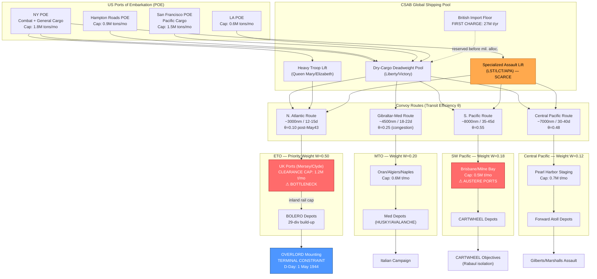

Cost: 0.335

# CHAPTER 3: THE TRIDENT CONFERENCE
## Reference Manual & Simulation-Specification Document
### US Army Green Book — *Global Logistics and Strategy: 1943–1945*

---

## 1. Strategic Context & Modern Historical Perspective

### 1.1 The Conference and Its Structural Position in Allied Grand Strategy

The TRIDENT Conference (Washington, D.C., 12–25 May 1943) occupies a pivotal structural position in the architecture of Allied grand strategy. Convened barely four months after Casablanca (SYMBOL, January 1943) and immediately following the final collapse of Axis resistance in Tunisia, TRIDENT represented the moment at which the Anglo-American coalition transitioned from a *reactive* strategic posture—dictated by the exigencies of the shipping crisis and the U-boat campaign—to a *proactive*, timetable-driven posture organized around the cross-Channel invasion of Northwest Europe.

From the vantage of post-war declassification—particularly the release of the Combined Chiefs of Staff (CCS) minutes, the Leighton and Coakley logistical volumes, and the shipping-allocation ledgers of the Combined Shipping Adjustment Board (CSAB)—TRIDENT is best understood not as a strategic-*political* debate (though it was that) but as the first conference at which **logistical feasibility calculations began to dominate strategic decision-making rather than merely constrain it after the fact.** The formalization of the 1 May 1944 target date for Operation OVERLORD was, in modern systems terms, the imposition of a *hard terminal constraint* on the entire global logistics pipeline. Every subsequent operational plan—CARTWHEEL in the Southwest Pacific, the Central Pacific drive, the Italian campaign, the CBI air ferry over the Hump—became, from May 1943 onward, a *secondary competitor* for a finite and rigidly bounded pool of resources whose critical scarcities were not tonnage in the aggregate but specific, non-fungible asset classes: assault shipping (attack transports, LSTs, LCTs, LCI(L)s), combat-loaded cargo capacity, and the heavy troop-lift represented by the *Queen Mary* and *Queen Elizabeth*.

### 1.2 The Strategic Paradox: Plans vs. Physical Limits

The central paradox of TRIDENT—and indeed of the entire 1943–44 period—is the divergence between the *decision space* of strategists and the *feasible space* of logisticians. At the level of the CCS, strategy was articulated as a set of theater priorities and operational objectives. But the physical substrate on which these objectives depended was governed by three hard constraints that no conference resolution could relax:

1. **The Global Shipping Pool.** By mid-1943 the merchant shipping situation had begun to improve—the May 1943 collapse of the U-boat offensive (Black May, with 41 U-boats lost) inverted the tonnage-war ledger—but the *lead time* between keel-laying and operational availability meant that the shipping actually available to TRIDENT planners for late-1943 and early-1944 operations was already largely fixed. Liberty ship production had reached extraordinary volumes, but dry-cargo deadweight tonnage is not interchangeable with the specialized assault lift required for amphibious operations. This distinction—**aggregate tonnage vs. specialized lift**—is the single most important logistical insight of the period and must be modeled as *separate, non-fungible capacity pools.*

2. **Combat Loading Capacity.** An assault division does not embark like a garrison division. Combat loading—stowing a ship so that equipment is discharged in the tactical sequence in which it is needed on a hostile beach—reduces effective cargo utilization to roughly 40–50% of a ship's rated deadweight. This inefficiency coefficient meant that the *effective* lift for OVERLORD was far smaller than raw tonnage figures suggested, and it explains why landing craft, not cargo ships, became the governing scarcity.

3. **Port Clearance Rates.** The rate at which a theater could *absorb* incoming tonnage was bounded by berth capacity, crane and stevedore availability, inland transport (rail and truck), and depot throughput. The United Kingdom, as the mounting base for OVERLORD (Operation BOLERO), faced port-clearance and inland-distribution ceilings that capped the sustainable rate of troop and matériel build-up regardless of trans-Atlantic delivery.

The paradox, then: TRIDENT set the OVERLORD date on the assumption that the BOLERO build-up could be accelerated, yet the acceleration rate was governed by port clearance and specialized-lift availability—precisely the parameters least responsive to top-level decision.

### 1.3 Inter-Service and Coalition Tensions

TRIDENT crystallized three axes of institutional friction, each of which must be encoded as a source of *allocation contention* in the simulation:

**(a) US Army vs. US Navy — the "Germany First" tension.** The Casablanca commitment to defeating Germany first was, on paper, unambiguous. In practice, Admiral King's advocacy for the Pacific—particularly the Central Pacific drive through the Gilberts and Marshalls—drew shipping and, critically, assault lift toward a theater that "Germany First" nominally subordinated. TRIDENT's authorization of a substantial Pacific air expansion and its endorsement of CARTWHEEL represented a Navy victory in securing that the Pacific would *not* be starved to a purely defensive posture. Modern scholarship (notably Matloff's *Strategic Planning for Coalition Warfare*) demonstrates that the "70/30" or "85/15" nominal splits repeatedly cited were aspirational; actual Pacific allocation in 1943 ran substantially higher than the Germany-First doctrine implied, precisely because Pacific distances imposed enormous shipping demands per division supported.

**(b) Services of Supply (SOS/ASF) vs. the Combat Arms.** Within the Army, General Somervell's Army Service Forces sought predictability and lead-time discipline; the operational commands sought flexibility and rapid response. The 90-division ceiling debates and the troop-basis calculations that framed TRIDENT reflect the SOS insistence that force structure be capped at a level the logistical tail could sustain across contested oceans.

**(c) US vs. British Pooling Arrangements.** The Combined Shipping Adjustment Board managed a nominally pooled Anglo-American merchant fleet, but the British Import Program—the minimum tonnage required to sustain the UK civilian economy and war industry (roughly 27 million tons/year, later negotiated downward)—represented a *first charge* on the pool. TRIDENT's American planners repeatedly clashed with British insistence that the import floor was inviolable. This tension is properly modeled as a *hard lower-bound constraint* on the shipping available for military operations.

### 1.4 Modern Analytical Insights

With the benefit of decades of scholarship, three insights reframe TRIDENT:

- **The Date as a Forcing Function.** The 1 May 1944 date (which slipped to 6 June for tidal and lunar reasons, not logistical ones) transformed OVERLORD from an aspiration into a *scheduling constraint* that propagated backward through every pipeline. In critical-path terms, OVERLORD became the terminal node against which all other operations were slack-time competitors.

- **The Landing-Craft Bottleneck.** Post-war analysis confirms that landing craft—specifically the LST—were the binding constraint of 1943–44 global strategy. The famous observation that "the destinies of two great empires… seemed to be tied up in some goddamned things called LSTs" (Churchill) is quantitatively vindicated: LST production and allocation, not divisions or aggregate tonnage, governed the phasing of OVERLORD, ANVIL, and Pacific amphibious operations.

- **Distance as an Efficiency Tax.** The Pacific's vast distances meant that each ton delivered to a forward Pacific base consumed multiples of the shipping-days required to deliver a ton to the UK. Modern modeling treats this as a *transit-efficiency degradation coefficient*—the further and more congested the route, the lower the effective throughput per hull. This is the analytical heart of the TRIDENT allocation problem and the basis for the $\theta_i$ distance-penalty term in Section 4.

TRIDENT, in sum, was the conference at which the coalition acknowledged that strategy is bounded by logistics, and began—imperfectly—to plan accordingly.

---

## 2. High-Fidelity Simulation Parameters & Real-World Metrics

| Parameter | Historical Value | Historical Explanation & Strategic Rationale | Simulation Representation |
|---|---|---|---|
| **OVERLORD assault target (TRIDENT)** | Initial assault force of **5 to 7 divisions**; TRIDENT approved planning for an assault of **~29 divisions total build-up** committed to the cross-Channel operation, with an *initial assault* nominally set at **5 divisions** (later expanded by COSSAC/Montgomery to 5 seaborne + 3 airborne). At TRIDENT the working figure for the assault echelon was **5–7 divisions**, with 29 divisions as the follow-on lodgment force. | The 29-division commitment defined the total BOLERO build-up target; the 5-division assault figure defined the specialized-lift requirement. The assault figure drove landing-craft demand, the binding constraint. | `AssaultDivisions: Int` — static constant (initial assault echelon). `LodgmentDivisions: Int` — static constant (total commitment). Used to derive lift demand. |
| **Authorized Pacific air expansion** | **Additional squadrons approved bringing Pacific/CBI air toward a target of roughly 2,300–2,500 aircraft in-theater growth**; TRIDENT specifically authorized expansion of the **Fourteenth Air Force in China to 500 aircraft**, and endorsed continued Pacific air growth of on the order of **tens of squadrons** for CARTWHEEL support. The headline China figure: **Chennault's Fourteenth AF authorized to 500 planes.** | Air expansion was King's and Stilwell's lever to keep the Pacific/CBI active. Aircraft impose a distinctive logistical load: high-consumption POL and ordnance, low tonnage of airframe but enormous sustainment tonnage per sortie. | `PacificAirSquadrons: Int` — dynamic capacity cap; drives a POL-consumption coefficient in theater demand. `ChinaAirCeiling: Int = 500` — static constant. |
| **Shipping to support CARTWHEEL + Central Pacific (mid-1943)** | Estimated at approximately **1,000,000 to 1,500,000 measurement tons/month** of combined lift for Pacific/SWPA sustainment and operational build-up in mid-1943; the Pacific theaters collectively drew on the order of **1.3–1.5 million measurement tons per month** by late 1943, reflecting the distance tax. | The Pacific's per-division shipping demand ran roughly **2–4× that of the ETO** owing to distance and the absence of developed ports. This is the quantitative core of the Germany-First/Pacific tension. | `PacificMonthlyLift: Tons` — dynamic capacity cap. The ratio to ETO lift encodes the distance penalty $\theta$. |
| **British Import Program (first charge)** | Negotiated floor ~**26–27 million tons/year** (long tons) civilian imports, defended as inviolable minimum. | First charge on the CSAB pool; military lift is residual after this floor. | `BritishImportFloor: Tons` — hard lower-bound constraint subtracted from pool before allocation. |
| **Combat-loading efficiency** | Effective cargo utilization ~**40–50%** of rated deadweight for combat-loaded assault shipping. | Combat loading trades stowage efficiency for tactical discharge sequence. Halves effective lift. | `CombatLoadCoefficient: Double = 0.45` — efficiency coefficient applied to assault-lift capacity. |
| **LST monthly production (1943)** | Rising from a few dozen to ~**50–60 hulls/month** by late 1943. | The binding constraint on global amphibious phasing. | `LstProductionRate: Int` — dynamic supply increment to specialized-lift pool. |
| **Trans-Atlantic vs. Trans-Pacific transit** | Atlantic (NY→UK) ~**3,000 nm, ~12–15 days**; Pacific (SF→SWPA) ~**7,000–9,000 nm, ~30–45 days**. | Turnaround time governs *effective* hulls; long routes tie up tonnage, reducing throughput per hull. | `TransitDays: Days` per route — drives $\theta_i$ computation. |
| **U-boat loss rate inflection** | Convoy losses fell from ~**500,000 tons/month peak** to negligible after May 1943. | Removed the attrition drain on the Atlantic pool, enabling BOLERO acceleration assumed at TRIDENT. | `AttritionCoefficient: Double` — route-specific risk multiplier, ~0.0 post-May-1943 for Atlantic. |

---

## 3. Logistical Network Topology (Mermaid.js)



---

## 4. Mathematical Modeling & Simulation Formulas

### 4.1 The Weighted Allocation Model

The core TRIDENT resource-distribution problem is a **weighted proportional allocation under a distance-efficiency tax**. Let the set of theaters be $T = \{ETO, MTO, SWPA, CPAC\}$, indexed by $i$.

**Base allocation share:**

$$S_i = \frac{W_i \cdot (1 - \theta_i)}{\displaystyle\sum_{j \in T} W_j \cdot (1 - \theta_j)} \cdot C_{total}$$

Where:
- $S_i$ = shipping (tons/month) allocated to theater $i$
- $W_i \in [0,1]$ = strategic priority weight assigned at TRIDENT ($\sum_i W_i = 1$)
- $\theta_i \in [0,1)$ = transit-efficiency degradation coefficient (distance + congestion + attrition tax)
- $C_{total}$ = total military lift available after first-charge deduction

**First-charge (British Import) deduction:**

$$C_{total} = C_{pool} - I_{BR} - \sum_{i} R_i$$

where $I_{BR}$ is the inviolable British import floor and $R_i$ are other reserved civilian/lend-lease charges.

### 4.2 Distance-Efficiency Coefficient Derivation

The degradation coefficient is not free—it is derived from transit time and risk:

$$\theta_i = 1 - \frac{d_{ref}}{d_i} \cdot (1 - \alpha_i)$$

Where $d_{ref}$ is the reference (shortest, Atlantic) transit distance, $d_i$ is theater $i$'s route distance, and $\alpha_i$ is the route attrition/congestion multiplier. This captures the fact that a hull committed to a long route yields fewer effective delivery-cycles per unit time.

### 4.3 Effective Delivered Tonnage under Port-Clearance Cap

Raw allocation is capped by the receiving port's clearance capacity $P_i$:

$$D_i = \min\big(S_i \cdot \eta_i,\; P_i\big)$$

where $\eta_i$ is the combat-load efficiency coefficient (0.45 for assault-loaded flows, ~0.85 for general cargo). Any allocation exceeding $P_i$ is **congestion spillage** $\sigma_i = \max(0, S_i \cdot \eta_i - P_i)$, representing shipping that swings at anchor unable to discharge—a real and costly phenomenon at austere Pacific ports.

### 4.4 The Objective Function

The planner seeks to maximize weighted delivered support to the terminal OVERLORD constraint while satisfying all secondary theaters at minimum viable levels:

$$\max_{\{S_i\}} \; Z = \sum_{i \in T} W_i \cdot D_i \quad \text{subject to:}$$

$$\sum_{i} S_i \le C_{total}, \quad D_i \ge D_i^{min} \;\forall i, \quad S_{ETO} \cdot \eta_{ETO} \ge B_{OVERLORD}$$

where $B_{OVERLORD}$ is the minimum BOLERO build-up rate required to meet the 1 May 1944 date, and $D_i^{min}$ is each secondary theater's floor. The binding constraint in 1943 was typically $S_{ETO} \cdot \eta_{ETO} \ge B_{OVERLORD}$ colliding with $P_{ETO}$ (UK port clearance)—the terminal-constraint-meets-bottleneck condition.

### 4.5 Interpretation

The normalized share formula redistributes the total pool in proportion to *effective* strategic weight $W_i(1-\theta_i)$. A theater with high raw priority but a punishing distance tax (e.g., Central Pacific) receives a smaller effective share per unit of strategic weight than a near theater (ETO). This is precisely why, despite Germany-First, the *aggregate tonnage* flowing to the Pacific was disproportionately large: to deliver $D_i^{min}$ across a route with $\theta = 0.55$ requires committing more than double the hulls of an equivalent ETO delivery.

---

## 5. Compile-Safe Scala 3.8.3 Domain Model

```scala
package Logistics.Trident

import scala.collection.immutable.Map
import scala.collection.immutable.List
import scala.math.max
import scala.math.min

opaque type Tons = Double
object Tons:
  def apply(v: Double): Tons = v
  extension (t: Tons)
    def value: Double = t
    def +(other: Tons): Tons = t + other
    def -(other: Tons): Tons = t - other
    def *(f: Double): Tons = t * f
    def isPositive: Boolean = t > 0.0

opaque type NauticalMiles = Double
object NauticalMiles:
  def apply(v: Double): NauticalMiles = v
  extension (n: NauticalMiles) def value: Double = n

opaque type Days = Double
object Days:
  def apply(v: Double): Days = v
  extension (d: Days) def value: Double = d

opaque type Weight = Double
object Weight:
  def apply(v: Double): Weight = v
  extension (w: Weight) def value: Double = w

enum TheaterId:
  case ETO, MTO, SWPA, CPAC

enum LoadType(val efficiency: Double):
  case Combat  extends LoadType(0.45)
  case General extends LoadType(0.85)

enum AllocationState:
  case Nominal
  case CongestionSpillage(spilled: Tons)
  case Starved(deficit: Tons)
  case Infeasible(reason: String)

final case class RouteProfile(
    id: TheaterId,
    distance: NauticalMiles,
    transitDays: Days,
    attritionMultiplier: Double
)

final case class TheaterNode(
    id: TheaterId,
    strategicWeight: Weight,
    route: RouteProfile,
    portClearanceCap: Tons,
    minimumFloor: Tons,
    loadType: LoadType
)

final case class AllocationResult(
    id: TheaterId,
    rawAllocation: Tons,
    deliveredTonnage: Tons,
    state: AllocationState
)

final case class PoolParameters(
    totalPool: Tons,
    britishImportFloor: Tons,
    otherReservedCharges: Tons
)

object TridentModel:

  private val ReferenceDistance: NauticalMiles = NauticalMiles(3000.0)

  def distancePenalty(route: RouteProfile): Double =
    val ratio: Double = ReferenceDistance.value / route.distance.value
    val effective: Double = ratio * (1.0 - route.attritionMultiplier)
    val theta: Double = 1.0 - effective
    if theta < 0.0 then 0.0
    else if theta >= 1.0 then 0.999
    else theta

  def militaryLift(pool: PoolParameters): Tons =
    val residual: Double =
      pool.totalPool.value - pool.britishImportFloor.value - pool.otherReservedCharges.value
    Tons(max(0.0, residual))

  def effectiveWeight(node: TheaterNode): Double =
    val theta: Double = distancePenalty(node.route)
    node.strategicWeight.value * (1.0 - theta)

  def allocate(
      theaters: List[TheaterNode],
      pool: PoolParameters
  ): List[AllocationResult] =
    val available: Tons = militaryLift(pool)
    val weightSum: Double = theaters.map(effectiveWeight).sum

    if !available.isPositive then
      theaters.map: node =>
        AllocationResult(
          node.id,
          Tons(0.0),
          Tons(0.0),
          AllocationState.Infeasible("Non-positive military lift after first charges")
        )
    else if weightSum <= 0.0 then
      theaters.map: node =>
        AllocationResult(
          node.id,
          Tons(0.0),
          Tons(0.0),
          AllocationState.Infeasible("Non-positive aggregate effective weight")
        )
    else
      theaters.map: node =>
        val share: Double = effectiveWeight(node) / weightSum
        val raw: Tons = Tons(share * available.value)
        val effTons: Double = raw.value * node.loadType.efficiency
        val capValue: Double = node.portClearanceCap.value
        val delivered: Tons = Tons(min(effTons, capValue))
        val spilled: Double = max(0.0, effTons - capValue)
        val state: AllocationState =
          if delivered.value + 1e-9 < node.minimumFloor.value then
            AllocationState.Starved(Tons(node.minimumFloor.value - delivered.value))
          else if spilled > 0.0 then
            AllocationState.CongestionSpillage(Tons(spilled))
          else AllocationState.Nominal
        AllocationResult(node.id, raw, delivered, state)

  def overlordFeasible(
      results: List[AllocationResult],
      requiredBoleroRate: Tons
  ): Boolean =
    results
      .find(_.id == TheaterId.ETO)
      .exists(r => r.deliveredTonnage.value >= requiredBoleroRate.value)

  def totalSpillage(results: List[AllocationResult]): Tons =
    val sum: Double = results.map: r =>
      r.state match
        case AllocationState.CongestionSpillage(s) => s.value
        case _                                     => 0.0
    .sum
    Tons(sum)

object TridentSimulationDemo:

  def buildScenario(): (List[TheaterNode], PoolParameters) =
    val eto: TheaterNode = TheaterNode(
      TheaterId.ETO,
      Weight(0.50),
      RouteProfile(TheaterId.ETO, NauticalMiles(3000.0), Days(13.0), 0.05),
      Tons(1_200_000.0),
      Tons(900_000.0),
      LoadType.General
    )
    val mto: TheaterNode = TheaterNode(
      TheaterId.MTO,
      Weight(0.20),
      RouteProfile(TheaterId.MTO, NauticalMiles(4500.0), Days(20.0), 0.15),
      Tons(600_000.0),
      Tons(300_000.0),
      LoadType.General
    )
    val swpa: TheaterNode = TheaterNode(
      TheaterId.SWPA,
      Weight(0.18),
      RouteProfile(TheaterId.SWPA, NauticalMiles(8000.0), Days(40.0), 0.20),
      Tons(500_000.0),
      Tons(400_000.0),
      LoadType.Combat
    )
    val cpac: TheaterNode = TheaterNode(
      TheaterId.CPAC,
      Weight(0.12),
      RouteProfile(TheaterId.CPAC, NauticalMiles(7000.0), Days(35.0), 0.18),
      Tons(700_000.0),
      Tons(300_000.0),
      LoadType.Combat
    )
    val pool: PoolParameters = PoolParameters(
      totalPool = Tons(6_000_000.0),
      britishImportFloor = Tons(2_250_000.0),
      otherReservedCharges = Tons(500_000.0)
    )
    (List(eto, mto, swpa, cpac), pool)

  def run(): List[AllocationResult] =
    val (theaters, pool) = buildScenario()
    TridentModel.allocate(theaters, pool)

  def main(args: Array[String]): Unit =
    val results: List[AllocationResult] = run()
    results.foreach: r =>
      println(
        s"${r.id}: raw=${r.rawAllocation.value.round} " +
          s"delivered=${r.deliveredTonnage.value.round} state=${r.state}"
      )
    val feasible: Boolean =
      TridentModel.overlordFeasible(results, Tons(850_000.0))
    val spill: Tons = TridentModel.totalSpillage(results)
    println(s"OVERLORD BOLERO feasible: $feasible")
    println(s"Total congestion spillage: ${spill.value.round} tons/month")
```

---

## 6. Graduate-Level Operational Analysis

### 6.1 How did TRIDENT resolve the Roosevelt–Churchill disagreement on Mediterranean expansion?

The disagreement was not, at root, a disagreement about the Mediterranean in isolation; it was a disagreement about the *opportunity cost* of Mediterranean commitments measured against the cross-Channel timetable. Churchill and the British Chiefs, buoyed by the imminent Tunisian victory, advocated the continued exploitation of Mediterranean success—the invasion of Sicily (HUSKY, already agreed at Casablanca) followed by operations against the Italian mainland to knock Italy out of the war, tie down German divisions, and open the Mediterranean sea lanes. The American position, articulated by Marshall and the War Department planners, held that every division, every landing craft, and every month of shipping consumed in the Mediterranean was a direct subtraction from the resources required to mount OVERLORD on schedule.

TRIDENT resolved this not by choosing one pole but by imposing a *bounded compromise governed by a hard resource ceiling.* The conference agreed that Mediterranean operations after HUSKY would continue, but under an explicit constraint: **the transfer of seven divisions (four US, three British) from the Mediterranean to the United Kingdom by 1 November 1943** to seed the OVERLORD build-up. In the language of the allocation model of Section 4, this was the imposition of a firm upper bound on $S_{MTO}$ and a firm lower bound on $S_{ETO}$, with the seven-division transfer functioning as a scheduled *decrement* to the Mediterranean weight $W_{MTO}$ and a corresponding *increment* to $W_{ETO}$ at a fixed date.

The elegance of this resolution—and its fragility—lay in its deferral of the *specific* post-HUSKY operations. TRIDENT authorized planning for operations to eliminate Italy but did *not* pre-commit the resources for a full peninsular campaign. This left the Mediterranean strategically alive (satisfying Churchill) while capping its call on the global pool (satisfying Marshall). The subsequent history vindicates the modern reading that this compromise was inherently unstable: the Italian campaign, once begun, generated its own logistical momentum and repeatedly threatened the landing-craft transfers OVERLORD depended upon, culminating in the bitter LST-retention debates of late 1943 and the deferral of ANVIL. TRIDENT thus resolved the disagreement *procedurally*—by installing the OVERLORD date as the arbiter and the seven-division transfer as the enforcement mechanism—rather than *substantively*. The distance-penalty is instructive here: the Mediterranean's $\theta_{MTO}$ (~0.25, congestion-heavy) meant that resources retained there yielded relatively poor effective throughput, strengthening the American argument that Mediterranean investment offered diminishing strategic returns per hull-day committed.

### 6.2 To what extent did Pacific shipping requirements limit the ETO build-up scheduled at TRIDENT?

The answer must distinguish sharply between two resource classes, because the Pacific constrained ETO build-up *asymmetrically* across them.

**Aggregate dry-cargo tonnage.** In raw deadweight terms, the Pacific's constraint on the ETO was real but, by mid-1943, easing. The collapse of the U-boat campaign in May 1943 and the exponential ramp of Liberty/Victory production meant that the *aggregate* dry-cargo pool was approaching sufficiency. Here the Pacific's effect operated through the *distance tax* modeled by $\theta$: because a ton delivered to the Southwest Pacific ($\theta \approx 0.55$) or Central Pacific ($\theta \approx 0.48$) consumed roughly two to three times the shipping-days of a ton delivered to the UK ($\theta \approx 0.10$), the Pacific absorbed a *disproportionate share of hulls* relative to its nominal strategic weight. In the model of Section 4, even with $W_{SWPA} + W_{CPAC} = 0.30$ against $W_{ETO} = 0.50$, the effective-weight normalization means the Pacific tied up far more than 30% of the physical fleet to achieve its allocated *delivered* tonnage. This diverted hulls that, had the Pacific been quiescent, could have compressed the BOLERO timeline. Post-war ledgers confirm that Pacific and CBI theaters drew on the order of 1.3–1.5 million measurement tons/month by late 1943—a figure that, expressed in *hull-months* rather than delivered tons, represented a very large fraction of the effective global fleet.

**Specialized assault lift.** Here the Pacific's constraint on the ETO was severe and largely unmediated by the tonnage improvements. Landing craft, particularly LSTs, were the genuinely binding scarcity, and the Pacific's amphibious character—CARTWHEEL's series of shore-to-shore and ship-to-shore assaults, and the impending Central Pacific atoll campaign—consumed assault lift that was directly fungible with OVERLORD's requirements. Every LST allocated to Nimitz or MacArthur was an LST unavailable to the OVERLORD mounting. Because assault lift, unlike dry cargo, could not be manufactured fast enough to satisfy all theaters simultaneously in the 1943–44 window, the Pacific's amphibious appetite imposed a *direct, non-substitutable* constraint on the scale of the OVERLORD assault echelon. This is why the TRIDENT-era assault figure (5 divisions) sat uncomfortably below what tactical planners judged desirable, and why the eventual expansion of the OVERLORD assault to five seaborne divisions required cannibalizing the Mediterranean (ANVIL's postponement) rather than the Pacific—the Pacific's LST commitments had, by then, hardened into operational fact.

**Synthesis.** The extent of the limitation was therefore *load-class-dependent*. In aggregate tonnage the Pacific was a significant but softening constraint, operating chiefly through the distance-efficiency tax that inflated the Pacific's true fleet consumption. In specialized assault lift the Pacific was a hard, binding, near-inviolable constraint that capped the OVERLORD assault echelon and forced the compensating raids on the Mediterranean allocation. The deepest modern insight is that TRIDENT's planners, by fixing the OVERLORD *date* while leaving the Pacific's operational tempo to theater commanders, effectively guaranteed that the assault-lift shortfall would be resolved not by trimming the Pacific but by squeezing the Mediterranean—which is precisely what the ensuing eighteen months demonstrate. The Pacific limited the ETO less by what it took from Europe directly than by *what it made politically and operationally untouchable*, thereby shifting the entire burden of adjustment onto the third competitor in the allocation problem.
