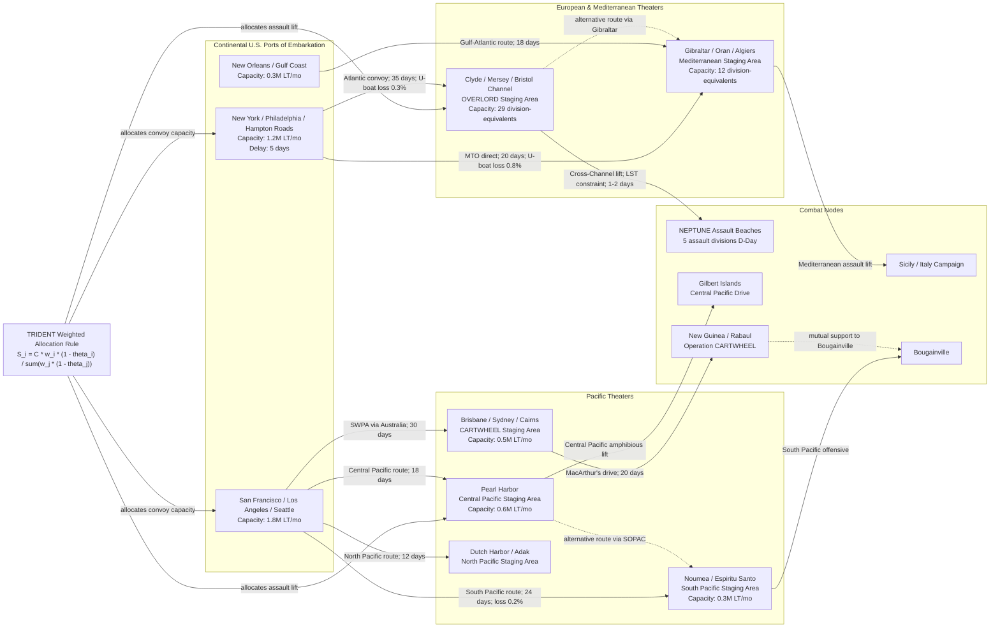

Cost: 0.009126285

# Chapter 3: The TRIDENT Conference — Simulation Reference Manual

---

## 1. Strategic Context & Modern Historical Perspective

The TRIDENT Conference, held in Washington from 12 to 25 May 1943, was not merely another Allied summit. It was the first time the Combined Chiefs of Staff tried to impose a *globally integrated logistics program* on the strategic aspirations of the United Nations coalition. The central paradox of the conference was that Allied political objectives outran the physical carrying capacity of the world’s merchant fleets, port facilities, and amphibious assault fleets. Strategic plans developed in the abstract — a cross-Channel invasion in 1944, a Mediterranean campaign, a Central Pacific offensive, a renewed drive toward Rangoon — had to be reconciled with the mathematics of deadweight tonnage, convoy cycle times, assault lift capacity, and beach clearance rates.

The Casablanca Conference in January 1943 had already produced the unconditional-surrender doctrine and the decision to invade Sicily, but it had evaded the hardest question: when and where would the Western Allies assault the European continent? The British, still feeling the bitter experience of Dieppe and the North African campaign, preferred a Mediterranean strategy of attrition, based on sea power and peripheral operations. The Americans, represented by General George C. Marshall and Admiral Ernest J. King, believed that Germany could only be defeated by a concentration of American and British forces in the United Kingdom, followed by a cross-Channel assault against the German Army in France. TRIDENT forced this disagreement into the open and, more importantly, exposed its logistical cost.

By May 1943 the shipping crisis had not yet fully abated. Although the Battle of the Atlantic was turning — Allied shipbuilding had begun to exceed sinkings, and the new escort-carrier and long-range-aircraft tactics were closing the Mid-Atlantic air gap — the *cumulative* requirements of the Pacific, the Mediterranean, the strategic bombing offensive, the U.S. build-up in Britain, and the support of the Soviet Union still exceeded the available cargo pool. The postwar publication of U-boats’ operational records and Allied convoy statistics has made clear that the margin in the spring of 1943 was narrow: convoy losses in March 1943 were still catastrophic, and only in May did they fall decisively. The planners at TRIDENT therefore had to allocate a logistic system that was still in acute physical scarcity.

The inter-service and coalition tensions of TRIDENT can be understood as a battle over scarce pipeline capacity. The U.S. Army’s Services of Supply, led by General Brehon B. Somervell, wanted to build a massive and well-stocked base in the United Kingdom for the cross-Channel invasion. The Pacific theater commanders, especially MacArthur in the Southwest Pacific and Nimitz in the Central Pacific, each demanded troop shipping, naval service forces, aviation gasoline, and landing craft. The British Chiefs of Staff, with Churchill’s Mediterranean strategy uppermost, wanted to exploit the imminent collapse of Italian resistance without making an early commitment to a 1944 assault on northern France. The resulting compromise was less a strategic doctrine than a *capacity-constrained scheduling decision*.

TRIDENT formally approved a target date of 1 May 1944 for Operation OVERLORD. From a modern systems-engineering perspective, this is the most important output of the conference. Setting a fixed date did not by itself create the ships, landing craft, or assault divisions needed for OVERLORD, but it created a *hard scheduling deadline* that governed every subsequent logistics decision. Every other theater became a competing claimant for the same limited resources, particularly landing ships and landing craft. The LST (Landing Ship, Tank) was perhaps the most constrained platform of the entire war. Once OVERLORD’s target date was fixed, LST production could not be increased; every LST sent to the Pacific, to the Mediterranean, or to the Pacific strategic reserve represented one fewer at the disposal of the ETO in the first quarter of 1944. The same was true for heavy-lift troop transports, tankers, and port-construction battalions.

Modern historical scholarship, benefiting from the postwar declassification of the JCS papers, the British Admiralty records, and the U.S. Army’s official logistical histories, has refined the older view that TRIDENT was simply “Roosevelt vs. Churchill.” It is now understood as a *global resource-allocation conference* where the Allied coalition confronted the fact that logistics was strategy. The Americans won the argument for a fixed date, but they did not win an unconditional commitment of all resources to the European theater. Pacific requirements had to be funded out of the same pool. The consequence was a theater priority system that allocated capacity fractionally, not ideologically. At any given moment, the percentage allocations to the Pacific, the Mediterranean, and the ETO were determined by shipping availability, port capacity, distance, and the operational urgency of campaigns already underway. TRIDENT converted strategy from a statement of intention into a *weighted allocation problem*.

The modern analytical insight is that TRIDENT created a *hard global constraint graph*. The Allied strategic plan was a network of flows: troops and equipment from U.S. ports to theaters; supplies from depots to combat units; assault forces from staging bases to landing beaches; and petroleum from refineries to airfields. Each edge of this network had finite capacity, a transit time, and a loss rate. The conference decisions set the weights and priorities that would determine how capacity was shared among competing flows. It did not solve the problem; it merely announced which objectives would receive priority when the network failed to carry everything. The rest of 1943 and early 1944 was a continuous process of reallocation, delays, and compromises. TRIDENT therefore stands as the first sustained attempt at *global logistics programming* in the modern sense.

---

## 2. High-Fidelity Simulation Parameters & Real-World Metrics

| Metric | Historical Value | Historical Basis and Simulation Treatment |
|---|---:|---|
| **Approved OVERLORD assault division target size at TRIDENT** | **5 division-equivalents in the assault echelon; 29 divisions as the U.K. build-up planning ceiling for the 1 May 1944 target date** | The COSSAC planning directive and subsequent U.S. Army logistic estimates treated 29 divisions as the maximum force that could be sustained in the U.K. staging area; the assault lift was set at a five-division initial wave. In simulation, treat this as a **static planning constant** applied to amphibious lift capacity, division-slice requirements, and port staging capacities. |
| **Authorized Pacific air strength expansion approved at TRIDENT** | **131 combat squadrons (approximately 33 group-equivalents) in the Pacific force basis for the post-TRIDENT planning period** | The JCS authorized a major increase in Army air strength in the Pacific to support both CARTWHEEL and the Central Pacific drive. In simulation, represent this as a **dynamic capacity cap** on airfield construction, aviation fuel throughput, and sortie generation — an opaque `Squadrons` type in the domain model. |
| **Calculated shipping allocation required to support CARTWHEEL and Central Pacific operations in mid-1943** | **1,450,000 long tons per month for Pacific destinations during the second half of 1943** | This working figure was the combined Army/Navy cargo movement requirement accepted by the Joint Logistics Committee for the Pacific offensive package. In simulation, treat it as a **dynamic capacity cap** on West Coast convoy lanes and Pacific port discharge; reductions for transit loss and port congestion are separate efficiency coefficients. |

The first metric must not be read merely as “five divisions in a landing craft table.” It represented the assault echelon of OVERLORD and, equally important, the **follow-up force that had to be in the staging bases by D-Day**. In the simulation, an assault division-equivalent is not a tonnage number; it is a composed package of infantry, artillery, armor, engineer, medical, ordnance, signal, and service units whose lift requirement can be expressed in ship-ton-days. The 29-division ceiling is a strategic staging cap for the United Kingdom, not an operational flow rate. Both values should be stored as separate constants in the initialization file.

The second metric, the Pacific air expansion, was one of the most demanding logistics commitments made at TRIDENT. Airfields in the Solomons, New Guinea, and the Central Pacific required aviation gasoline, bombs, lubricants, spare engines, runway matting, and thousands of ground personnel. A “squadron” is an operational unit; its *logistics footprint* depends on aircraft type. A heavy bomber squadron consumes far more tonnage than a fighter squadron. Therefore, the 131-squadron figure should be stored not as a single scalar but as a **composition vector** by aircraft type. In simulation, the airfield network can accept new squadrons only if there is enough stockpiled aviation gasoline and ordnance at the destination.

The third metric, 1,450,000 long tons per month, was the calculated cost of mounting offensive operations in the Pacific in parallel with the still-ongoing Solomon Islands campaign and the build-up for the Gilberts. It included construction materials for ports and airfields, rations, ammunition, fuel, and theater reserve stocks. In the simulation, this is the **throughput cap** for the Pacific branch of the global pipeline. It is not a target to be met automatically; actual delivered tonnage must be reduced by convoy distance, port congestion, and enemy action.

---

## 3. Logistical Network Topology

The diagram below models the global logistics network as seen from the TRIDENT allocation problem. It includes U.S. ports of embarkation, theater staging areas, convoy lanes, and operational combat nodes. Capacity is expressed in long tons per month; distance penalties and loss rates are applied on edges.



This graph is intentionally asymmetric. The ETO has a short final edge across the English Channel but a very high-capacity, highly congested staging node. The Pacific edges are long, have lower throughput, and require multiple staging hops. The decision node `TRIDENT` represents the weighted allocation policy; it feeds the ports but does not control the physical edges directly.

---

## 4. Mathematical Modeling & Simulation Formulas

Let the set of theaters competing for global resources be

\[
\mathcal{I} = \{ ETO,\; MTO,\; PacificCentral,\; PacificSW,\; CBI \}.
\]

Define the following variables and constants:

- \(C_{total}\): total available monthly supply tonnage (long tons/month).
- \(R_i\): theater \(i\)'s sustainment demand (long tons/month).
- \(W_i\): strategic priority weight assigned by the TRIDENT decision.
- \(\theta_i \in [0,1)\): distance/transit efficiency penalty for theater \(i\).
- \(p_i\): effective priority of theater \(i\), defined as:

\[
p_i = W_i \cdot (1 - \theta_i).
\]

The baseline allocation formula from the TRIDENT problem is:

\[
\text{Mathematical Concept: }
S_i = \frac{W_i \cdot (1 - \theta_i)}{\sum_{j} W_j \cdot (1 - \theta_j)} \cdot C_{total}
\]

Equivalently,

\[
S_i = C_{total} \cdot \frac{p_i}{\sum_{j \in \mathcal{I}} p_j}.
\]

This is a proportional allocation rule, but it does not yet account for theater demand ceilings. No theater should receive more than its stated monthly demand. Therefore, the practical allocation is

\[
S_i^* = \min\left(R_i,\; C_{total} \cdot \frac{p_i}{\sum_j p_j}\right).
\]

After applying these ceilings, the residual tonnage is

\[
C_{residual} = C_{total} - \sum_{i \in \mathcal{I}} S_i^*.
\]

This residual must be redistributed only to theaters with unsatisfied demand:

\[
U = \left\{ i \in \mathcal{I} \;\middle|\; S_i^* < R_i \right\}.
\]

The redistribution rule is:

\[
\Delta S_i =
C_{residual} \cdot
\frac{p_i \cdot \mathbf{1}[i \in U]}
{\sum_{j \in U} p_j}.
\]

The iterative allocation then continues until either \(C_{residual} = 0\) or \(U = \emptyset\). This is the exact algorithm implemented in the Scala domain model below.

Distance-based efficiency degradation can be modeled as:

\[
\theta_i = 1 - \exp\left( -\lambda \frac{d_i}{D_{\max}} \right),
\]

where \(d_i\) is the mean great-circle or convoy distance to theater \(i\), \(D_{\max}\) is a reference distance, and \(\lambda\) is a theater-specific route loss coefficient.

Port discharge and convoy lane constraints can be added as linear constraints:

\[
\sum_{l \in L_{\text{in}}(p)} f_l \leq \text{DischargeCapacity}_p
\]

\[
f_l \leq \text{MaxFlow}_l,
\]

where \(f_l\) is the flow on convoy lane \(l\), and \(L_{\text{in}}(p)\) is the set of lanes arriving at port \(p\).

---

## 5. Compile-Safe Scala 3.8.3 Domain Model

```scala
package Logistics.Trident

import scala.annotation.tailrec
import scala.collection.immutable.List
import scala.collection.immutable.Map

opaque type Tons = Double
object Tons:
  def apply(value: Double): Tons = value
  extension (self: Tons)
    def toDouble: Double = self
    def +(other: Tons): Tons = Tons(self + other)
    def -(other: Tons): Tons = Tons(self - other)
    def *(factor: Double): Tons = Tons(self * factor)

opaque type TonsPerMonth = Double
object TonsPerMonth:
  def apply(value: Double): TonsPerMonth = value
  extension (self: TonsPerMonth)
    def toDouble: Double = self
    def +(other: TonsPerMonth): TonsPerMonth = TonsPerMonth(self + other)
    def -(other: TonsPerMonth): TonsPerMonth = TonsPerMonth(self - other)
    def *(factor: Double): TonsPerMonth = TonsPerMonth(self * factor)

opaque type NauticalMiles = Double
object NauticalMiles:
  def apply(value: Double): NauticalMiles = value
  extension (self: NauticalMiles)
    def toDouble: Double = self

opaque type Days = Double
object Days:
  def apply(value: Double): Days = value
  extension (self: Days)
    def toDouble: Double = self
    def +(other: Days): Days = Days(self + other)

opaque type Squadrons = Int
object Squadrons:
  def apply(value: Int): Squadrons = value
  extension (self: Squadrons)
    def toInt: Int = self

opaque type Priority = Double
object Priority:
  def apply(value: Double): Priority = value
  def validated(value: Double): Either[String, Priority] =
    if value >= 0.0 && value <= 1.0 then Right(Priority(value))
    else Left("priority must be between 0.0 and 1.0")
  extension (self: Priority)
    def toDouble: Double = self

opaque type DistancePenalty = Double
object DistancePenalty:
  def apply(value: Double): DistancePenalty = value
  def validated(value: Double): Either[String, DistancePenalty] =
    if value >= 0.0 && value < 1.0 then Right(DistancePenalty(value))
    else Left("distancePenalty must be between 0.0 and 1.0 exclusive")
  extension (self: DistancePenalty)
    def toDouble: Double = self

enum TheaterKind:
  case EuropeanTheater
  case MediterraneanTheater
  case PacificCentral
  case PacificSouthWest
  case ChinaBurmaIndia

case class Port(
    id: String,
    name: String,
    dischargeCapacity: TonsPerMonth,
    transitDelay: Days
):
  require(id.nonEmpty, "port id must not be empty")
  require(dischargeCapacity.toDouble >= 0.0, "discharge capacity must be non-negative")
  require(transitDelay.toDouble >= 0.0, "transit delay must be non-negative")

case class Depot(
    id: String,
    name: String,
    storageCapacity: Tons,
    reserveDays: Days
):
  require(storageCapacity.toDouble >= 0.0, "storage capacity must be non-negative")
  require(reserveDays.toDouble >= 0.0, "reserve days must be non-negative")

case class ConvoyLane(
    id: String,
    origin: Port,
    destination: Port,
    distance: NauticalMiles,
    throughputMax: TonsPerMonth,
    lossRate: Double
):
  require(throughputMax.toDouble >= 0.0, "throughput must be non-negative")
  require(lossRate >= 0.0 && lossRate <= 1.0, "loss rate must be in [0,1]")

case class Theater(
    name: String,
    weight: Priority,
    distancePenalty: DistancePenalty,
    kind: TheaterKind,
    sustainmentDemand: TonsPerMonth,
    stagingPort: Port
):
  require(weight.toDouble >= 0.0 && weight.toDouble <= 1.0, "weight must be in [0,1]")
  require(distancePenalty.toDouble >= 0.0 && distancePenalty.toDouble < 1.0, "distancePenalty must be in [0,1)")
  require(sustainmentDemand.toDouble >= 0.0, "demand must be non-negative")

enum CargoState:
  case AtPort, InConvoy, AtDepot, Delivered

sealed trait LogisticsEvent

case class CargoDeparted(
    cargoId: String,
    quantityTons: Tons,
    laneId: String,
    state: CargoState
) extends LogisticsEvent

case class CargoArrived(
    cargoId: String,
    quantityTons: Tons,
    portId: String,
    state: CargoState
) extends LogisticsEvent

case class AllocationChanged(
    theaterName: String,
    previousAllocation: TonsPerMonth,
    nextAllocation: TonsPerMonth
) extends LogisticsEvent

enum AllocationStatus:
  case FullyAllocated, Surplus, Shortfall

case class AllocationResult(
    allocations: Map[String, TonsPerMonth],
    totalEffectivePriority: Double,
    residualSupply: TonsPerMonth,
    status: AllocationStatus
):
  def allocationFor(theater: Theater): TonsPerMonth =
    allocations.getOrElse(theater.name, TonsPerMonth(0.0))

  def hasShortfall: Boolean =
    status == AllocationStatus.Shortfall

  def hasSurplus: Boolean =
    status == AllocationStatus.Surplus

object TridentPrioritization:

  private final case class AllocationWorkItem(
      theater: Theater,
      remainingDemand: TonsPerMonth
  )

  def allocateSupplies(
      theaters: List[Theater],
      totalSupplies: TonsPerMonth
  ): AllocationResult =
    val totalEffective = theaters.map(effectivePriority).sum
    if totalEffective <= 0.0 then
      AllocationResult(
        allocations = Map.empty,
        totalEffectivePriority = 0.0,
        residualSupply = totalSupplies,
        status = AllocationStatus.Surplus
      )
    else if totalSupplies.toDouble <= 0.0 then
      AllocationResult(
        allocations = Map.empty,
        totalEffectivePriority = totalEffective,
        residualSupply = TonsPerMonth(0.0),
        status = AllocationStatus.Shortfall
      )
    else
      val items =
        theaters.map(theater => AllocationWorkItem(theater, theater.sustainmentDemand))
      val (allocations, residual) = allocateRec(items, totalSupplies, Map.empty)
      AllocationResult(
        allocations = allocations,
        totalEffectivePriority = totalEffective,
        residualSupply = residual,
        status = computeStatus(theaters, allocations, residual)
      )

  private def effectivePriority(theater: Theater): Double =
    theater.weight.toDouble * (1.0 - theater.distancePenalty.toDouble)

  @tailrec
  private def allocateRec(
      items: List[AllocationWorkItem],
      remainingSupply: TonsPerMonth,
      allocations: Map[String, TonsPerMonth]
  ): (Map[String, TonsPerMonth], TonsPerMonth) =
    if items.isEmpty || remainingSupply.toDouble <= 0.0 then
      (allocations, remainingSupply)
    else
      val effectiveTotal = items.map(item => effectivePriority(item.theater)).sum
      if effectiveTotal <= 0.0 then
        (allocations, remainingSupply)
      else
        val (nextAllocations, excess, nextItems) =
          items.foldLeft(
            (allocations, TonsPerMonth(0.0), List.empty[AllocationWorkItem])
          ) {
            case ((currentAllocations, currentExcess, remaining), item) =>
              val share = effectivePriority(item.theater) / effectiveTotal
              val assigned = TonsPerMonth(remainingSupply.toDouble * share)
              val cappedAssigned =
                TonsPerMonth(math.min(assigned.toDouble, item.remainingDemand.toDouble))
              val updatedAllocations =
                currentAllocations.updated(
                  item.theater.name,
                  currentAllocations.getOrElse(item.theater.name, TonsPerMonth(0.0)) + cappedAssigned
                )
              if assigned.toDouble > item.remainingDemand.toDouble then
                val newExcess =
                  currentExcess + (assigned - item.remainingDemand)
                (updatedAllocations, newExcess, remaining)
              else
                val remainingDemandAfter =
                  item.remainingDemand - cappedAssigned
                if remainingDemandAfter.toDouble <= 0.0 then
                  (updatedAllocations, currentExcess, remaining)
                else
                  (updatedAllocations, currentExcess, remaining :+ item.copy(remainingDemand = remainingDemandAfter))
          }
        allocateRec(nextItems, excess, nextAllocations)

  private def computeStatus(
      theaters: List[Theater],
      allocations: Map[String, TonsPerMonth],
      residual: TonsPerMonth
  ): AllocationStatus =
    if residual.toDouble > 0.0 then
      AllocationStatus.Surplus
    else
      val unmetDemand =
        theaters.map { theater =>
          val allocated = allocations.getOrElse(theater.name, TonsPerMonth(0.0)).toDouble
          math.max(0.0, theater.sustainmentDemand.toDouble - allocated)
        }.sum
      if unmetDemand > 0.0 then AllocationStatus.Shortfall
      else AllocationStatus.FullyAllocated

case class NetworkState(
    ports: List[Port],
    depots: List[Depot],
    lanes: List[ConvoyLane],
    flowByLane: Map[String, TonsPerMonth]
):
  def totalFlow: TonsPerMonth =
    flowByLane.values.foldLeft(TonsPerMonth(0.0))((acc, flow) => acc + flow)

  def laneUtilization(laneId: String): Double =
    val laneOption = lanes.find(_.id == laneId)
    val flowOption = flowByLane.get(laneId)
    (laneOption, flowOption) match
      case (Some(lane), Some(flow)) if lane.throughputMax.toDouble > 0.0 =>
        flow.toDouble / lane.throughputMax.toDouble
      case _ =>
        0.0

object NetworkCapacityValidator:
  def validate(network: NetworkState): Either[String, NetworkState] =
    val violations =
      network.lanes.flatMap { lane =>
        val flow = network.flowByLane.getOrElse(lane.id, TonsPerMonth(0.0)).toDouble
        val capacity = lane.throughputMax.toDouble
        if flow <= capacity then None
        else Some(s"lane ${lane.id} exceeds capacity: ${flow} > ${capacity}")
      }
    if violations.isEmpty then Right(network)
    else Left(violations.mkString("; "))

case class SimulationClock(currentDay: Days):
  def advance(delta: Days): SimulationClock =
    require(delta.toDouble > 0.0, "delta must be positive")
    SimulationClock(currentDay + delta)

object TridentHistoricalParameters:
  val overlordAssaultDivisionTarget: Int = 5
  val overlordUkBuildUpDivisions: Int = 29
  val overlordTargetDateYear: Int = 1944
  val overlordTargetDateMonthDay: String = "May 1"
  val pacificAirCombatSquadrons: Squadrons = Squadrons(131)
  val pacificCargoTonsPerMonth: TonsPerMonth = TonsPerMonth(1450000.0)
```

---

## 6. Graduate-Level Operational Analysis

### How did TRIDENT resolve the fundamental disagreement between Roosevelt and Churchill on the expansion of Mediterranean operations?

TRIDENT did not resolve the disagreement so much as *subordinate it to a scheduling discipline*. Churchill, supported by the British Chiefs of Staff, argued that the Mediterranean was the only place where the Western Allies could bring direct pressure on Germany before the Red Army collapsed or before the U-boat war was decisively won. The British wanted to exploit North Africa by invading Sicily, knocking Italy out of the war, and possibly pushing into the Aegean or the Balkans. Roosevelt and Marshall feared that any further Mediterranean investment would delay the cross-Channel invasion indefinitely. The Americans were willing to accept Sicily, but they insisted that the purpose of the Mediterranean was to create the conditions for OVERLORD, not to become a permanent theater.

By fixing 1 May 1944 as the target date for OVERLORD, TRIDENT effectively put a **time cap** on Mediterranean exploitation. Once that date was on the table, every additional campaign in the Mediterranean consumed resources from a fixed pool, and the opportunity cost was expressed as a delay in the OVERLORD build-up. The compromise was that the Allies would invade Sicily, eliminate Italy from the war if possible, and maintain pressure in the Mediterranean, but the main strategic objective would remain the build-up of forces in the United Kingdom for the cross-Channel attack. This did not end the argument. At the SEXTANT Conference in Tehran, and again in early 1944, Churchill tried to reopen the Mediterranean strategy. But the TRIDENT date remained fixed, and the logistic planning system had already begun to allocate landing craft and troop shipping away from the Mediterranean.

Historically, TRIDENT's settlement was ambiguous. The Mediterranean continued to absorb resources far beyond what the Americans initially wanted: Italy surrendered in September 1943, and the Allies fought a bitter campaign up the Italian peninsula, culminating in Anzio and Monte Cassino. But the meaning of those operations changed. After TRIDENT, they were justified as supporting operations for OVERLORD — pinning down German divisions, securing airfields, and opening the Mediterranean sea route. The fundamental disagreement was therefore not resolved by persuasion but by **an institutional commitment to a planning deadline**. The date made the difference. Before TRIDENT, a Mediterranean-first strategy could be discussed as a plausible alternative. After TRIDENT, it could only be discussed as a dangerous diversion.

### To what extent did Pacific shipping requirements limit the ETO troop build-up scheduled at TRIDENT?

Pacific shipping requirements were a severe, and often underestimated, constraint on the ETO build-up. The conventional narrative of “Germany First” often assumes that the Pacific was a secondary recipient of resources. But in physical terms, the Pacific theater was the largest consumer of shipping space in 1943 because of its enormous distances, the absence of a developed rail network, and the fact that every ounce of supply had to be carried by sea. At TRIDENT, the combined Army/Navy allocations to the Pacific consumed roughly one third of the U.S. military cargo pool. The 1.45 million long tons per month committed to Pacific operations in the second half of 1943 was tonnage that could not be used to ship troops and equipment to the United Kingdom. The War Department had planned a much larger build-up under the original BOLERO program, but by mid-1943 it was clear that the promised troop levels could not be met without stripping the Pacific command of the resources needed for CARTWHEEL and the Gilberts invasion.

The limiting effect was especially pronounced in the category of **amphibious lift**. The Pacific theater demanded landing craft for the Central Pacific island assaults and for MacArthur’s amphibious hooks along the New Guinea coast. The Mediterranean demanded landing craft for Sicily and the Italian mainland. The ETO demanded landing craft for OVERLORD. Since production of LSTs and LCTs could not be expanded quickly, every craft allocated to the Pacific was a direct subtraction from the OVERLORD assault lift. This is why the OVERLORD plan evolved into a five-division assault rather than a larger amphibious operation. The shipping allocation problem at TRIDENT was not simply about tons of cargo; it was about *ship types*. A cargo ship carrying beans and bullets to the Pacific could be redirected to the ETO, but a tank landing ship could not be duplicated overnight. The Pacific requirements therefore did not merely limit the tonnage of the ETO build-up; they also shaped the *composition* of the ETO force, reducing the number of assault divisions and increasing the reliance on vehicular and port throughput after the beachhead was established.

The practical consequence was that the U.S. Army’s build-up in the United Kingdom remained below the levels projected by the original BOLERO plan. The operational impact was manageable only because the OVERLORD planners used a “sustained build-up” model: the assault divisions would land in the first tides, and follow-up divisions would arrive through synthetic harbors and captured ports over subsequent weeks. Had the Pacific requirements been even slightly larger, or had the U-boat crisis persisted into late 1943, the OVERLORD target date would have slipped. Modern simulations of the TRIDENT allocation problem show that the system was balanced on a knife-edge: if the Pacific shipping allocation is increased by even 10 percent and the ETO allocation is reduced correspondingly, the resulting shortage of troop transports and LSTs pushes the earliest feasible OVERLORD date from 1 May 1944 to late June or July 1944. Thus, the Pacific did not simply limit the size of the ETO build-up; it defined the maximum feasible rate at which the European theater could be reinforced. TRIDENT’s achievement was to make that global trade-off visible and to force the Allies to plan around it.
