Cost: 0.482045

### 1. Strategic Context & Modern Historical Perspective

The TRIDENT Conference, held in Washington from 12 to 25 May 1943, was the point at which Anglo-American strategy began to move from a collection of partially compatible regional offensives toward a time-phased global program. The conference did not eliminate strategic disagreement. Rather, it converted disagreement into a set of dated commitments, conditional operations, and resource ceilings that could be administered by the Combined Chiefs of Staff. Its most consequential decision was the adoption of 1 May 1944 as the target date for a cross-Channel invasion of northwestern Europe. The operation was not yet OVERLORD in its final form, but TRIDENT established the governing logistical premise from which the COSSAC plan, the subsequent QUADRANT decisions, and the enlarged OVERLORD plan developed.

From a modern operations-research perspective, TRIDENT imposed a global deadline on a logistics system whose principal resources were neither infinitely divisible nor rapidly expandable. Merchant shipping could be reassigned among theaters, although only with delays and losses in effective capacity. Assault shipping and landing craft were much less fungible. A landing ship or assault transport committed to the Mediterranean or Pacific could not simultaneously support a cross-Channel assault, and its transfer involved unloading, voyage time, overhaul, crew preparation, theater-specific modifications, and often participation in intermediate operations. The conference therefore dealt not merely with how many divisions the Allies wished to employ, but with the temporal availability of ships, landing craft, port capacity, trained formations, escorts, aircraft, and specialized equipment.

#### The strategic paradox

The central paradox was that Allied strategic plans were framed in terms of campaigns and divisions, while the enabling system operated in terms of ship-days, convoy cycles, port tons, landing-craft hulls, escorts, rail paths, and cubic displacement. A directive could assign twenty-nine divisions to a projected cross-Channel operation, but it could not make those divisions operationally available unless the United States could move their personnel, organizational equipment, replacement stocks, vehicles, ammunition, and maintenance establishments into Britain before the deadline. Nor was arrival in Britain equivalent to readiness. Units had to clear ports, enter camps, draw theater equipment, train, rehearse, and move into marshaling areas without paralyzing the British rail and road systems.

The binding constraint changed over time. At one moment it might be transatlantic troop lift; at another, dry-cargo shipping; later, British port clearance, depot construction, or landing craft. This is why simple comparisons of aggregate merchant tonnage are misleading. The strategically relevant value was effective delivered capacity:

- after subtracting ships under repair;
- after accounting for convoy assembly and diversion;
- after adjusting for voyage distance and turnaround time;
- after deducting losses and weather delays;
- after recognizing that a measurement ton of vehicles consumed much more stowage volume than a weight ton of dense ammunition;
- and after allowing for the imbalance between troop accommodations and cargo space.

The Battle of the Atlantic was turning decisively in the Allies’ favor during the spring of 1943, but victory over the U-boats did not instantly remove the shipping constraint. Newly constructed vessels still required crews, loading berths, escorts, maintenance, and terminal capacity. Moreover, declining sinkings enlarged the future shipping pool rather than creating unlimited current capacity. Allocation decisions at TRIDENT therefore remained decisions about scarcity.

Combat loading created an additional penalty. A commercially loaded ship could maximize cubic utilization by placing cargo according to port and commodity. An assault-loaded vessel had to stow equipment in the order in which combat units would need it ashore. Vehicles, ammunition, engineer stores, communications equipment, medical supplies, and rations had to be accessible in tactical sequence. The resulting loss of volumetric efficiency was the price of operational responsiveness. A simulator should distinguish ordinary convoy loading, unit loading, and combat loading rather than treating all cargo capacity as interchangeable.

Port discharge was equally important. The receipt of cargo in a theater was not the same as its delivery to a field army. British ports supporting BOLERO depended on rail clearance, inland depots, vehicle parks, labor, and detailed movement scheduling. In the Mediterranean, port availability depended on operations and enemy action. In the Pacific, distances between bases were enormous, ports were often rudimentary, and final delivery frequently required transshipment into smaller vessels. A ton discharged at Nouméa, Brisbane, or Pearl Harbor could consume additional shipping and handling capacity before reaching New Guinea, the Solomons, or a Central Pacific objective.

#### Roosevelt, Churchill, and the Mediterranean issue

TRIDENT’s principal political-strategic dispute concerned the future of Mediterranean operations after HUSKY, the invasion of Sicily. Churchill and the British Chiefs favored exploiting Axis weakness in the Mediterranean. Their preferences reflected several overlapping objectives: eliminating Italy from the war, opening Mediterranean shipping routes, tying down German formations, protecting imperial communications, supporting Turkey, and creating opportunities in the Balkans or eastern Mediterranean. British planners also doubted that a premature cross-Channel attack could succeed against German forces in France.

The American Chiefs, especially General George C. Marshall, feared that Mediterranean exploitation could become an open-ended campaign that consumed the divisions, landing craft, bombers, and shipping required for the decisive attack on Germany through France. American opposition was not based on an assumption that all Mediterranean operations were useless. HUSKY had already been accepted. The concern was marginal commitment: once troops were ashore and opportunities appeared, local commanders and political leaders would demand reinforcement. A supposedly limited operation could acquire its own strategic momentum.

Roosevelt did not simply impose a purely American military program on Churchill. He valued coalition unity and remained receptive to politically useful Mediterranean action. The resolution was therefore conditional. Operations after HUSKY were to aim at eliminating Italy from the war and engaging the maximum number of German forces, but they were not to invalidate the buildup for the cross-Channel operation. The Mediterranean was permitted exploitation within a resource framework; it was not granted priority over the 1944 return to France.

The compromise’s weakness was that strategic conditions could redefine what “limited” exploitation meant. Italy’s surrender, German occupation of the peninsula, and the Salerno and later Italian campaigns created requirements not fully visible in May. TRIDENT thus resolved the disagreement institutionally, through a priority hierarchy and target date, but not permanently. The same issue returned at QUADRANT, SEXTANT, and later conferences in disputes over landing craft, ANVIL, Rome, the Aegean, and the allocation of formations.

#### Coalition and inter-service friction

TRIDENT also exposed differences inside the American system. The Joint Chiefs and theater commanders framed requirements in operational terms, while the Army Service Forces and other logistical agencies had to determine whether those requirements could be shipped, received, and sustained. Theater requisitions commonly reflected desired force levels rather than constrained transportation programs. Logistical authorities, by contrast, had to reconcile each theater’s demands with ship availability, production schedules, port throughput, and competing commitments.

This was not a simple conflict between “fighters” and “logisticians.” Theater commanders faced genuine uncertainty and had rational reasons to demand reserves. Communications were slow, forecast errors were large, and Pacific combat frequently occurred at the end of fragile, single-route pipelines. Nevertheless, overstatement in every theater produced an infeasible aggregate program. The Services of Supply therefore performed a global arbitration function even when operational commanders interpreted reductions as bureaucratic obstruction.

Army-Navy friction was especially consequential in the Pacific. The Navy controlled much of the oceanic movement architecture, amphibious expertise, and Central Pacific operational concept. The Army had major forces under General Douglas MacArthur in the Southwest Pacific and was responsible for much of the cargo, troop, and base establishment moving to that region. Admiral Ernest J. King pressed for operations along the Central Pacific axis, while MacArthur advocated continued advance through New Guinea toward the Philippines. These axes were strategically complementary in the long run but competed in the short run for transports, escorts, cargo ships, combat aircraft, service units, and landing craft.

British-American shipping arrangements generated another layer of friction. Shipping was substantially pooled and allocated through combined machinery, but national ownership, military control, imperial routes, import requirements, and differing accounting conventions complicated apparent totals. A vessel allocated to a British import program could indirectly sustain British forces and civilians while releasing some other resource, but it was not necessarily available for an American troop movement. “Shipping” must therefore be represented as categorized capacity subject to political and operational constraints, not as one homogeneous global stock.

#### The Pacific as a secondary but irreducible competitor

TRIDENT established the cross-Channel operation as the central concentration, but it did not suspend the Pacific war. CARTWHEEL required support for converging advances in the South and Southwest Pacific. At the same time, the Combined Chiefs approved preparations for Central Pacific operations. China-Burma-India retained political importance, and aid to the Soviet Union continued. The result was not a pure sequential strategy in which every resource first went to Europe. It was a priority system with protected minimum allocations to secondary theaters.

Distance made Pacific allocations disproportionately expensive. A ship assigned to a transatlantic route could complete more voyages in a year than one committed to the Southwest Pacific. Pacific cargo often underwent multiple handlings: United States port to major theater base, theater base to advanced base, and advanced base to combat area. Each transfer imposed delay, breakage, inventory uncertainty, and additional vessel demand. Tropical deterioration, limited storage, inadequate roads, and primitive ports reduced effective delivery further.

Consequently, one nominal ton allocated to the Pacific represented more ship-days than one nominal ton allocated to Britain. This does not mean that Pacific operations were strategically irrational. It means that allocation models must price distance and terminal inefficiency explicitly. The correct denominator is not cargo allocated at the port of embarkation but combat-effective supply delivered at the destination on time.

#### Modern historical interpretation

Postwar access to German records confirms that Allied Mediterranean operations did tie down important German formations and helped precipitate Italy’s exit. It also confirms that German defensive skill and terrain made continued advance up the Italian peninsula expensive. Modern scholarship therefore tends to reject both extreme interpretations: that Mediterranean operations were merely wasteful diversions, or that they offered an easy substitute for OVERLORD. They produced real strategic effects but could not by themselves create the decisive concentration sought by the American Chiefs.

Modern logistical analysis similarly modifies the traditional narrative that the United States simply overwhelmed scarcity through mass production. American production was extraordinary, but global strategy remained constrained by sequencing, specialized assets, and terminal capacity. The Allies won not because scarcity disappeared, but because they increasingly synchronized production, shipping, theater buildup, and operations better than the Axis could disrupt them.

TRIDENT’s lasting importance lies in its conversion of OVERLORD from an aspiration into a dated system requirement. The 1 May 1944 target became the backward-scheduling anchor for troop deployment, cargo movement, landing-craft concentration, air preparation, depot construction, and British infrastructure. Every Pacific or Mediterranean allocation thereafter carried an opportunity cost measured against that deadline. In simulation terms, TRIDENT created a global, multi-commodity, multi-period network problem with hard theater minima, political constraints, asset non-fungibility, uncertain losses, and a dominant terminal milestone.

---

### 2. High-Fidelity Simulation Parameters & Real-World Metrics

The figures below should be treated as planning values rather than retrospective measures of what was ultimately present on D-day. Wartime sources also used “tons” inconsistently. Pacific shipping programs were commonly expressed in **measurement tons**, a volumetric shipping unit of 40 cubic feet, rather than long tons of cargo weight or vessel deadweight tonnage.

| Parameter | TRIDENT-era value | Unit and interpretation | Historical explanation | Recommended simulation representation |
|---|---:|---|---|---|
| Cross-Channel target date | 1 May 1944 | Calendar date | TRIDENT directed preparation of a cross-Channel operation with this target date. The actual invasion occurred on 6 June 1944 after enlargement of the plan and a short postponement. | Immutable strategic milestone in the TRIDENT scenario; permit later conference or operational events to amend it. |
| Initial cross-Channel force basis | **29 divisions** | Divisions available for the operation | The conference’s planning basis contemplated twenty-nine divisions for the cross-Channel undertaking. This was the force basis around which COSSAC initially planned. It must not be confused with the three-division initial assault frontage in the original COSSAC concept or the five-division assault adopted after the plan was enlarged. | Integer force-generation target. Each division should have separate readiness, lift, equipment, and sustainment states; do not convert it directly into a single tonnage constant. |
| Original COSSAC assault frontage | 3 assault divisions, with 2 immediate follow-up divisions | Division-equivalents | The initial OVERLORD concept developed after TRIDENT was constrained by available landing craft and contemplated a narrower assault than the final plan. The later five-division assault reflected expansion approved after Eisenhower and Montgomery reviewed the operation. | Scenario-dependent amphibious lift demand, not the TRIDENT strategic force target. |
| Pacific air-strength expansion | **30 additional squadrons** | Army air squadrons above the previously approved Pacific program | TRIDENT authorized an enlarged Pacific air establishment to support the South/Southwest Pacific offensives and increased activity elsewhere in the Pacific. Squadron counts should not be treated as identical aircraft quantities because authorized aircraft varied by squadron type. | Discrete force package. Store squadron type, aircraft authorization, serviceability, deployment date, ground echelon, and shipping demand separately. |
| CARTWHEEL monthly cargo program | **700,000 measurement tons per month** | Ocean-shipping cargo allocation | The planning estimate covered the South and Southwest Pacific pipeline required for CARTWHEEL, including operational forces and the extensive base organization needed to move through New Guinea and the Solomons. | Dynamic monthly theater floor or planned allocation. Convert to required ship-days using route-specific turnaround time and stowage efficiency. |
| Central Pacific monthly cargo program | **300,000 measurement tons per month** | Ocean-shipping cargo allocation | This represented the additional movement program for the developing Central Pacific offensive, whose requirements included garrisons, aviation bases, amphibious equipment, construction units, and forward stocks. | Dynamic monthly theater floor. Apply high amphibious-loading and transshipment penalties during assault phases. |
| Combined CARTWHEEL and Central Pacific allocation | **1,000,000 measurement tons per month** | Sum of the two planning programs | The combined program illustrates the scale of the Pacific claim against the global shipping pool even after Germany-first priorities had been reaffirmed. | Aggregate Pacific planning cap/floor pair: 700,000 for CARTWHEEL and 300,000 for Central Pacific before optimization. |
| Measurement-ton conversion | 40 | Cubic feet per measurement ton | A measurement ton is a volume unit. Dense commodities may cube out differently from vehicles, aircraft, packaged petroleum products, or engineer machinery. | Static conversion constant. Cargo objects should retain both weight and cube. Vessel loading is constrained by whichever limit binds first. |
| Nominal cargo loss from combat loading | Scenario-calibrated; typically 10–25% below commercial volumetric utilization | Fraction of nominal cargo capacity | Assault loading sacrifices stowage density to ensure tactical accessibility and unloading sequence. No single percentage applies to every ship or operation. | Dynamic efficiency coefficient keyed by vessel class, cargo mix, and loading doctrine. Do not hard-code one universal historical constant. |
| Atlantic effective-distance penalty | Lower than Pacific routes | Dimensionless efficiency penalty | Shorter voyages, developed ports, and fewer transshipments yielded more annual lift per hull, despite convoy and submarine hazards. | Derived from round-trip days, not manually assigned unless using an abstract model. |
| Southwest Pacific transshipment count | Commonly 1–2 intermediate handlings beyond the main base | Handling stages | Cargo frequently passed through Brisbane or another major base and then through forward bases before reaching combat formations. | Route attribute producing delay, handling losses, labor demand, and inventory uncertainty. |
| Theater reserve requirement | Variable, usually expressed in days of supply | Days of supply | Remote theaters requested large reserves because of voyage uncertainty, enemy action, weather, and limited local alternatives. | Dynamic policy variable with minimum and target levels. Excess reserve accumulation should reduce the theater’s marginal allocation weight. |
| Landing-craft fungibility | Low in the short run | Transfer coefficient | Landing craft could be transferred among theaters, but not without voyage, overhaul, adaptation, and training delays. Some smaller craft could not economically self-deploy. | Separate asset pool with location and readiness state; prohibit instantaneous reassignment. |
| Troopship/cargo-ship substitutability | Limited | Conversion coefficient | Troop accommodations, ventilation, sanitary facilities, and safety requirements prevented ordinary freighters from replacing troopships without conversion. | Distinct vessel classes with explicit conversion time, cost, and shipyard-capacity consumption. |
| Port throughput | Route- and month-specific | Measurement tons/day or long tons/day | Berths, cranes, lighters, labor, storage, and inland clearance jointly determined throughput. | Dynamic node capacity. Effective capacity is the minimum of discharge, storage intake, and inland-clearance capacity. |
| Planning horizon | May 1943–May 1944 | Twelve-month rolling horizon | TRIDENT’s decisions required backward scheduling from the invasion target. | Multi-period optimization horizon with monthly strategic allocation and daily or weekly operational execution. |

**Data caution:** The 29-division figure is the strategic force basis, not the number landing in the first tide. Likewise, the Pacific million-ton program is a cargo movement allowance in measurement tons, not one million long tons of payload and not one million deadweight tons of shipping. A database should include a `UnitBasis` field to prevent accidental comparison.

---

### 3. Logistical Network Topology (Detailed Mermaid.js Flowchart)

```mermaid
flowchart LR
    subgraph CONUS["Continental United States: Production and Assembly"]
        IND["Industrial districts<br/>Vehicles, ammunition, engineer stores"]
        POL["Petroleum system<br/>Bulk POL and packaged fuels"]
        REPL["Replacement and unit training centers"]
        DEP_E["Eastern general depots<br/>New York, Pennsylvania, Virginia"]
        DEP_W["Western general depots<br/>California and Pacific Northwest"]
        IND --> DEP_E
        IND --> DEP_W
        POL --> DEP_E
        POL --> DEP_W
        REPL --> DEP_E
        REPL --> DEP_W
    end

    subgraph POE["Ports of Embarkation and Load Planning"]
        NYPOE["New York POE<br/>Atlantic troop and cargo concentration"]
        HRE["Hampton Roads<br/>Atlantic and Mediterranean loading"]
        NOLA["Gulf ports<br/>Alternative Atlantic and Mediterranean route"]
        SFPOE["San Francisco POE<br/>Central and South Pacific"]
        SEAPOE["Seattle POE<br/>North Pacific and supplementary lift"]
        LAPOE["Los Angeles and San Diego<br/>Pacific naval and cargo support"]
        MARSHAL["Marshaling areas<br/>Unit checks, documentation, staging"]
        DEP_E --> NYPOE
        DEP_E --> HRE
        DEP_E --> NOLA
        DEP_W --> SFPOE
        DEP_W --> SEAPOE
        DEP_W --> LAPOE
        MARSHAL --> NYPOE
        MARSHAL --> HRE
        MARSHAL --> SFPOE
    end

    subgraph GLOBAL["Global Allocation and Scarce Mobile Assets"]
        CCS["Combined Chiefs of Staff<br/>Strategic priority weights"]
        WSA["War Shipping Administration<br/>Merchant hull allocation"]
        NAVY["US Navy and Allied naval authorities<br/>Convoys, escorts, amphibious shipping"]
        TROOP["Heavy troopship pool<br/>Berth-limited"]
        CARGO["Dry-cargo pool<br/>Weight and cube constrained"]
        TANKER["Tanker pool<br/>Bulk petroleum constrained"]
        LST["Landing ships and craft<br/>Low short-run fungibility"]
        CCS --> WSA
        CCS --> NAVY
        WSA --> TROOP
        WSA --> CARGO
        WSA --> TANKER
        NAVY --> LST
    end

    NYPOE -. "cargo assignment" .-> CARGO
    HRE -. "troop and assault assignment" .-> TROOP
    SFPOE -. "Pacific cargo assignment" .-> CARGO
    LAPOE -. "amphibious assignment" .-> LST

    subgraph ATL["Atlantic Pipeline: BOLERO and OVERLORD"]
        ATL_CONV["Atlantic convoy lanes<br/>Escort scheduling and U-boat risk"]
        UK_WEST["Western UK ports<br/>Liverpool, Bristol Channel, Clyde"]
        UK_SOUTH["Southern and eastern ports<br/>Congestion-sensitive"]
        UK_DEP["UK base depots<br/>Ammunition, general supply, vehicles"]
        UK_RAIL["British rail and road clearance<br/>Finite paths and rolling stock"]
        CAMP["US troop camps and training areas"]
        MARSH_UK["Southern England marshaling areas<br/>Strict movement windows"]
        EMBARK["Assault embarkation ports<br/>Combat-loading capacity"]
        CHANNEL["English Channel assault routes<br/>Weather and naval risk"]
        NORM["Normandy beachheads and artificial harbors"]
        CONT_DEP["Continental depots and army maintenance areas"]
        ETO_ARMY["ETO field armies<br/>Division-level consumption nodes"]

        NYPOE -->|"Shorter cycle; convoy delay"| ATL_CONV
        HRE -->|"Troops, vehicles, unit equipment"| ATL_CONV
        ATL_CONV -->|"Port berth cap"| UK_WEST
        ATL_CONV -->|"Alternative route; higher local congestion"| UK_SOUTH
        UK_WEST --> UK_DEP
        UK_SOUTH --> UK_DEP
        UK_DEP -->|"Inland-clearance cap"| UK_RAIL
        UK_RAIL --> CAMP
        CAMP --> MARSH_UK
        UK_DEP --> MARSH_UK
        MARSH_UK --> EMBARK
        EMBARK -->|"Combat-loading efficiency penalty"| CHANNEL
        CHANNEL --> NORM
        NORM -->|"Beach discharge and road exit cap"| CONT_DEP
        CONT_DEP --> ETO_ARMY
    end

    subgraph MED["Mediterranean Pipeline: HUSKY and Conditional Exploitation"]
        GIB["Gibraltar convoy gateway"]
        NAF["North African ports<br/>Casablanca, Oran, Algiers, Bizerte"]
        NAF_DEP["North African depots and staging bases"]
        SIC["Sicilian ports and beaches"]
        ITA["Italian mainland ports<br/>Naples and later facilities"]
        MTO_DEP["Mediterranean army depots"]
        MTO_ARMY["MTO combat formations"]
        MTO_ALT["Cape route alternative<br/>Very high ship-day cost"]

        NYPOE -->|"Atlantic-Mediterranean convoy"| GIB
        HRE --> GIB
        GIB --> NAF
        NAF -->|"Port-clearance cap"| NAF_DEP
        NAF_DEP -->|"Assault loaded"| SIC
        SIC --> ITA
        ITA --> MTO_DEP
        MTO_DEP --> MTO_ARMY
        NOLA --> MTO_ALT
        MTO_ALT --> NAF
    end

    subgraph PAC["Pacific Pipeline: CARTWHEEL and Central Pacific"]
        PAC_ROUTE["Pacific ocean route<br/>Long turnaround and sparse repair bases"]
        HAW["Hawaiian base<br/>Pearl Harbor and Oahu depots"]
        SOPAC["South Pacific bases<br/>Nouméa, Espiritu Santo, Guadalcanal"]
        SWPA_MAIN["Southwest Pacific main bases<br/>Brisbane and eastern Australia"]
        SWPA_FWD["Forward New Guinea bases<br/>Milne Bay, Oro Bay, Lae region"]
        CEN_STG["Central Pacific staging<br/>Hawaii and forward anchorages"]
        ATOLL["Central Pacific assault objectives<br/>Reef, beach, and lighterage limits"]
        TRANS["Small-ship and landing-craft transshipment pool"]
        CART["CARTWHEEL combat nodes<br/>South and Southwest Pacific divisions"]
        CEN_COMBAT["Central Pacific combat nodes<br/>Army and Marine formations"]

        SFPOE -->|"Long cycle; 700,000 MT/month CARTWHEEL program"| PAC_ROUTE
        LAPOE -->|"Amphibious and naval cargo"| PAC_ROUTE
        SEAPOE -->|"Supplementary routing"| PAC_ROUTE
        PAC_ROUTE --> HAW
        PAC_ROUTE -->|"Direct routing when hulls permit"| SOPAC
        PAC_ROUTE -->|"Long direct voyage"| SWPA_MAIN
        HAW --> CEN_STG
        CEN_STG -->|"300,000 MT/month program; combat loading"| ATOLL
        SOPAC -->|"Port and storage congestion"| TRANS
        SWPA_MAIN -->|"Australian rail and coastal shipping limits"| TRANS
        TRANS --> SWPA_FWD
        SOPAC --> CART
        SWPA_FWD --> CART
        ATOLL --> CEN_COMBAT
    end

    subgraph CONTROL["Simulation Control and Feedback"]
        PRIORITY["Weighted allocation engine<br/>ETO primary; protected Pacific and MTO minima"]
        DISTANCE["Distance and turnaround degradation<br/>Ship-days per delivered ton"]
        CONGEST["Congestion model<br/>Queue when arrivals exceed clearance"]
        LOSS["Loss and disruption model<br/>Enemy action, weather, breakdown"]
        READINESS["Combat-readiness model<br/>Personnel, equipment, training, stocks"]
        REPORT["Theater stock and readiness reports"]
        PRIORITY --> DISTANCE
        DISTANCE --> CONGEST
        CONGEST --> LOSS
        LOSS --> READINESS
        READINESS --> REPORT
        REPORT --> PRIORITY
    end

    CCS --> PRIORITY
    PRIORITY -. "allocation signal" .-> ATL_CONV
    PRIORITY -. "allocation signal" .-> GIB
    PRIORITY -. "allocation signal" .-> PAC_ROUTE
    UK_WEST -. "throughput feedback" .-> CONGEST
    NAF -. "throughput feedback" .-> CONGEST
    SWPA_MAIN -. "throughput feedback" .-> CONGEST
    ATOLL -. "throughput feedback" .-> CONGEST
```



For simulation purposes, every directed edge should carry at least the following attributes:

1. route distance in nautical miles;
2. expected sailing days;
3. convoy assembly delay;
4. loading and discharge delay;
5. cargo-type compatibility;
6. available hull classes;
7. loss and disruption probability;
8. monthly movement ceiling;
9. transshipment count;
10. priority preemption rules.

A port node’s effective throughput should be calculated as the minimum of berth discharge, cargo-handling labor, storage intake, and inland clearance. This prevents a simulator from treating ships unloaded into an immobilized port area as successful strategic delivery.

---

### 4. Mathematical Modeling & Simulation Formulas

#### 4.1 Core weighted allocation rule

Let:

- $i \in I$ index theaters;
- $W_i \geq 0$ be theater $i$’s strategic weight;
- $\theta_i \in [0,1]$ be its aggregate distance and inefficiency penalty;
- $C_{\text{total}}$ be total allocable cargo capacity;
- $S_i$ be the nominal allocation to theater $i$.

The simplified TRIDENT allocation rule is:

$$
S_i =
\frac{W_i(1-\theta_i)}
{\sum_{j \in I}W_j(1-\theta_j)}
C_{\text{total}}
$$

The numerator is theater $i$’s effective priority. The denominator normalizes all effective priorities so that allocations sum to the available resource:

$$
\sum_{i \in I}S_i = C_{\text{total}}
$$

The rule is useful for a high-level strategic model but should not be interpreted as a literal historical Combined Chiefs formula. It is an abstraction of priority reduced by delivery inefficiency.

If $W_{\text{ETO}}$ increases after establishment of the OVERLORD deadline, ETO receives a larger allocation. If $\theta_{\text{SWPA}}$ is large because of voyage distance, transshipment, and primitive ports, the same nominal priority yields less efficient use of the common shipping pool.

#### 4.2 Decomposing the distance penalty

A single penalty coefficient can conceal important mechanisms. A more defensible formulation is:

$$
1-\theta_i =
\eta_i^{\text{load}}
\eta_i^{\text{transit}}
\eta_i^{\text{port}}
\eta_i^{\text{inland}}
\eta_i^{\text{survival}}
$$

where each $\eta \in [0,1]$ represents an efficiency factor. Thus:

$$
\theta_i =
1-
\left(
\eta_i^{\text{load}}
\eta_i^{\text{transit}}
\eta_i^{\text{port}}
\eta_i^{\text{inland}}
\eta_i^{\text{survival}}
\right)
$$

This multiplicative formulation is preferable to simply adding penalties, because cargo must successfully pass through every stage.

#### 4.3 Ship-day constrained allocation model

Let:

- $r \in R$ index routes;
- $k \in K$ index cargo categories;
- $t \in T$ index months;
- $x_{irkt}$ be cargo dispatched to theater $i$ over route $r$ using vessel class $k$ in month $t$;
- $\tau_{irk}$ be ship-days required per measurement ton;
- $H_{kt}$ be available ship-days for vessel class $k$ in month $t$;
- $P_{irt}$ be route capacity;
- $B_{it}$ be theater port-clearance capacity;
- $D_{ikt}$ be theater demand;
- $m_{ikt}$ be a protected minimum allocation;
- $u_{ikt}$ be unmet demand.

A linear allocation model is:

$$
\max
\sum_{t \in T}
\sum_{i \in I}
\sum_{k \in K}
W_{it}V_{ik}x_{irkt}
-
\sum_{t \in T}
\sum_{i \in I}
\sum_{k \in K}
\lambda_{ik}u_{ikt}
$$

subject to vessel availability:

$$
\sum_{i \in I}
\sum_{r \in R}
\tau_{irk}x_{irkt}
\leq H_{kt}
\qquad
\forall k,t
$$

route capacity:

$$
\sum_{i \in I}
\sum_{k \in K}
x_{irkt}
\leq P_{rt}
\qquad
\forall r,t
$$

theater port capacity:

$$
\sum_{r \in R}
\sum_{k \in K}
x_{irkt}
\leq B_{it}
\qquad
\forall i,t
$$

demand accounting:

$$
\sum_{r \in R}x_{irkt}+u_{ikt}=D_{ikt}
\qquad
\forall i,k,t
$$

protected minimum programs:

$$
\sum_{r \in R}x_{irkt}\geq m_{ikt}
\qquad
\forall i,k,t
$$

and non-negativity:

$$
x_{irkt}\geq0,
\qquad
u_{ikt}\geq0
$$

$V_{ik}$ represents the military value of cargo type $k$ to theater $i$. For example, landing craft and assault-loaded ammunition would have unusually high marginal value immediately before an amphibious operation.

#### 4.4 Round-trip and effective lift

For route $r$, let:

- $d_r$ be one-way distance;
- $v_r$ be average convoy speed;
- $q_r$ be convoy assembly delay;
- $l_r$ and $e_r$ be loading and unloading days;
- $h_r$ be expected repair, weather, and diversion delay.

Round-trip time is:

$$
T_r =
\frac{2d_r}{24v_r}
+q_r+l_r+e_r+h_r
$$

If vessel class $k$ has nominal cargo capacity $Q_k$ and route utilization efficiency $\eta_{rk}$, annual effective lift is:

$$
L_{rk}^{\text{annual}}
=
Q_k\eta_{rk}
\frac{365}{T_r}
$$

This equation captures the fundamental disadvantage of Pacific deployment. Even with identical ships and loading factors, a larger $T_r$ produces fewer annual cargo deliveries per hull.

#### 4.5 Port congestion

Let $A_{it}$ be attempted arrivals at theater port system $i$, and let $B_{it}$ be clearance capacity. A simple deterministic queue update is:

$$
Q_{i,t+1}
=
\max
\left[
0,\,
Q_{it}+A_{it}-B_{it}
\right]
$$

The actual cargo cleared is:

$$
Y_{it}
=
\min
\left[
Q_{it}+A_{it},\,
B_{it}
\right]
$$

A nonlinear congestion penalty can be introduced when utilization approaches one:

$$
\delta_{it}^{\text{port}}
=
\delta_i^0
\left(
1+
\alpha_i
\frac{\rho_{it}}{1-\rho_{it}}
\right),
\qquad
\rho_{it}=\frac{A_{it}}{B_{it}},
\quad 0\leq\rho_{it}<1
$$

The simulator should not use this expression when $\rho_{it}\geq1$ without an explicit queue, because delay then grows through accumulated backlog rather than remaining a finite static penalty.

#### 4.6 Inventory and combat readiness

Let:

- $I_{ikt}$ be inventory of commodity $k$ in theater $i$;
- $Y_{ikt}$ be cargo cleared into theater stocks;
- $c_{ikt}$ be combat consumption;
- $\ell_{ikt}$ be handling, spoilage, and combat loss.

Then:

$$
I_{ik,t+1}
=
I_{ikt}+Y_{ikt}-c_{ikt}-\ell_{ikt}
$$

If a division requires $a_{dk}$ units of each critical commodity, its logistics-readiness index can be represented by a Leontief minimum:

$$
R_{dt}
=
\min_{k \in K_d}
\left(
\frac{I_{dkt}}{a_{dk}}
\right)
$$

capped at one:

$$
R_{dt}^{*}
=
\min(1,R_{dt})
$$

The minimum reflects the fact that excess rations cannot replace absent artillery ammunition, vehicles, or communications equipment.

#### 4.7 Landing-craft deadline constraint

Let $L_{it}$ be operational landing craft in theater $i$, $z_{ijt}$ the number transferred from $i$ to $j$, and $\Delta_{ij}$ the transfer delay. Then:

$$
L_{i,t+1}
=
L_{it}
+
\sum_{j}z_{ji,t-\Delta_{ji}}
-
\sum_j z_{ijt}
-
a_{it}
+
r_{it}
$$

where $a_{it}$ is attrition and $r_{it}$ is new production or return from repair.

The OVERLORD readiness constraint is:

$$
L_{\text{ETO},\,t_D}
\geq
L_{\text{OVERLORD}}^{\min}
$$

where $t_D$ is the assault deadline. This constraint explains why continuing Mediterranean operations could conflict with OVERLORD even when enough general cargo shipping existed: specialized amphibious assets had to be physically present, serviceable, and crewed in the United Kingdom.

---

### 5. Compile-Safe Scala 3.8.3 Domain Model

```scala
package Logistics.Trident

import scala.collection.immutable.List
import scala.collection.immutable.Map
import scala.collection.immutable.Vector

object Units:
  opaque type Tons = Double
  opaque type MeasurementTons = Double
  opaque type NauticalMiles = Double
  opaque type Days = Double
  opaque type ShipDays = Double
  opaque type CapacityFraction = Double
  opaque type StrategicWeight = Double

  object Tons:
    def from(value: Double): Either[ValidationError, Tons] =
      NonNegativeQuantity.validate("tons", value).map(identity)

    def unsafe(value: Double): Tons =
      from(value).fold(error => throw IllegalArgumentException(error.message), identity)

  object MeasurementTons:
    def from(value: Double): Either[ValidationError, MeasurementTons] =
      NonNegativeQuantity.validate("measurement tons", value).map(identity)

    def unsafe(value: Double): MeasurementTons =
      from(value).fold(error => throw IllegalArgumentException(error.message), identity)

  object NauticalMiles:
    def from(value: Double): Either[ValidationError, NauticalMiles] =
      NonNegativeQuantity.validate("nautical miles", value).map(identity)

    def unsafe(value: Double): NauticalMiles =
      from(value).fold(error => throw IllegalArgumentException(error.message), identity)

  object Days:
    def from(value: Double): Either[ValidationError, Days] =
      NonNegativeQuantity.validate("days", value).map(identity)

    def unsafe(value: Double): Days =
      from(value).fold(error => throw IllegalArgumentException(error.message), identity)

  object ShipDays:
    def from(value: Double): Either[ValidationError, ShipDays] =
      NonNegativeQuantity.validate("ship-days", value).map(identity)

    def unsafe(value: Double): ShipDays =
      from(value).fold(error => throw IllegalArgumentException(error.message), identity)

  object CapacityFraction:
    def from(value: Double): Either[ValidationError, CapacityFraction] =
      if value.isNaN || value.isInfinity then
        Left(InvalidNumber("capacity fraction", value))
      else if value < 0.0 || value > 1.0 then
        Left(OutOfRange("capacity fraction", value, 0.0, 1.0))
      else Right(value)

    def unsafe(value: Double): CapacityFraction =
      from(value).fold(error => throw IllegalArgumentException(error.message), identity)

  object StrategicWeight:
    def from(value: Double): Either[ValidationError, StrategicWeight] =
      NonNegativeQuantity.validate("strategic weight", value).map(identity)

    def unsafe(value: Double): StrategicWeight =
      from(value).fold(error => throw IllegalArgumentException(error.message), identity)

  extension (value: Tons)
    def toDouble: Double = value
    def +(other: Tons): Tons = value + other
    def -(other: Tons): Tons = value - other
    def *(factor: Double): Tons = value * factor

  extension (value: MeasurementTons)
    def toDouble: Double = value
    def +(other: MeasurementTons): MeasurementTons = value + other
    def -(other: MeasurementTons): MeasurementTons = value - other
    def *(factor: Double): MeasurementTons = value * factor
    def /(divisor: Double): MeasurementTons = value / divisor

  extension (value: NauticalMiles)
    def toDouble: Double = value

  extension (value: Days)
    def toDouble: Double = value

  extension (value: ShipDays)
    def toDouble: Double = value

  extension (value: CapacityFraction)
    def toDouble: Double = value
    def complement: Double = 1.0 - value

  extension (value: StrategicWeight)
    def toDouble: Double = value

sealed trait ValidationError derives CanEqual:
  def message: String

final case class InvalidNumber(
  field: String,
  value: Double
) extends ValidationError:
  val message: String = s"$field must be finite but was $value"

final case class NegativeQuantity(
  field: String,
  value: Double
) extends ValidationError:
  val message: String = s"$field must be non-negative but was $value"

final case class OutOfRange(
  field: String,
  value: Double,
  minimum: Double,
  maximum: Double
) extends ValidationError:
  val message: String =
    s"$field must be between $minimum and $maximum but was $value"

final case class InvalidName(
  field: String
) extends ValidationError:
  val message: String = s"$field must not be blank"

final case class DuplicateTheaterName(
  name: String
) extends ValidationError:
  val message: String = s"duplicate theater name: $name"

final case class UnknownTheater(
  name: String
) extends ValidationError:
  val message: String = s"unknown theater: $name"

final case class InvalidTransition(
  from: CampaignState,
  to: CampaignState
) extends ValidationError:
  val message: String = s"transition from $from to $to is not permitted"

private object NonNegativeQuantity:
  def validate(
    field: String,
    value: Double
  ): Either[ValidationError, Double] =
    if value.isNaN || value.isInfinity then Left(InvalidNumber(field, value))
    else if value < 0.0 then Left(NegativeQuantity(field, value))
    else Right(value)

enum TheaterKind derives CanEqual:
  case European
  case Mediterranean
  case Cartwheel
  case CentralPacific
  case ChinaBurmaIndia
  case Other

enum CargoKind derives CanEqual:
  case DryCargo
  case Ammunition
  case BulkPetroleum
  case PackagedPetroleum
  case Vehicles
  case Personnel
  case Aircraft
  case EngineerEquipment

enum VesselClass derives CanEqual:
  case DryCargoShip
  case Troopship
  case Tanker
  case AssaultTransport
  case LandingShip
  case CoastalTransport

enum LoadingMode derives CanEqual:
  case Commercial
  case UnitLoaded
  case CombatLoaded

enum CampaignState derives CanEqual:
  case StrategicPlanning
  case ForceAssembly
  case PortStaging
  case OceanTransit
  case TheaterReception
  case OperationalReadiness
  case AssaultCommitted
  case SustainedOperations
  case Suspended

enum PriorityPolicy derives CanEqual:
  case Weighted
  case ProtectedMinimums
  case OverlordDeadline
  case EmergencyTheater

final case class Theater private (
  name: String,
  kind: TheaterKind,
  weight: Units.StrategicWeight,
  distancePenalty: Units.CapacityFraction,
  monthlyMinimum: Units.MeasurementTons,
  monthlyPortCapacity: Units.MeasurementTons
):
  def effectiveWeight: Double =
    weight.toDouble * distancePenalty.complement

object Theater:
  def create(
    name: String,
    kind: TheaterKind,
    weight: Double,
    distancePenalty: Double,
    monthlyMinimum: Double,
    monthlyPortCapacity: Double
  ): Either[ValidationError, Theater] =
    if name.trim.isEmpty then Left(InvalidName("theater name"))
    else
      for
        validatedWeight <- Units.StrategicWeight.from(weight)
        validatedPenalty <- Units.CapacityFraction.from(distancePenalty)
        validatedMinimum <- Units.MeasurementTons.from(monthlyMinimum)
        validatedCapacity <- Units.MeasurementTons.from(monthlyPortCapacity)
        theater <-
          if validatedMinimum.toDouble <= validatedCapacity.toDouble then
            Right(
              Theater(
                name.trim,
                kind,
                validatedWeight,
                validatedPenalty,
                validatedMinimum,
                validatedCapacity
              )
            )
          else
            Left(
              OutOfRange(
                "monthly minimum",
                validatedMinimum.toDouble,
                0.0,
                validatedCapacity.toDouble
              )
            )
      yield theater

final case class Route private (
  name: String,
  origin: String,
  destination: String,
  distance: Units.NauticalMiles,
  roundTripDays: Units.Days,
  loadingEfficiency: Units.CapacityFraction,
  survivalEfficiency: Units.CapacityFraction,
  monthlyCapacity: Units.MeasurementTons
):
  def combinedEfficiency: Double =
    loadingEfficiency.toDouble * survivalEfficiency.toDouble

  def effectiveMonthlyCapacity: Units.MeasurementTons =
    monthlyCapacity * combinedEfficiency

object Route:
  def create(
    name: String,
    origin: String,
    destination: String,
    distance: Double,
    roundTripDays: Double,
    loadingEfficiency: Double,
    survivalEfficiency: Double,
    monthlyCapacity: Double
  ): Either[ValidationError, Route] =
    if name.trim.isEmpty then Left(InvalidName("route name"))
    else if origin.trim.isEmpty then Left(InvalidName("route origin"))
    else if destination.trim.isEmpty then Left(InvalidName("route destination"))
    else
      for
        validatedDistance <- Units.NauticalMiles.from(distance)
        validatedDays <- Units.Days.from(roundTripDays)
        validatedLoading <- Units.CapacityFraction.from(loadingEfficiency)
        validatedSurvival <- Units.CapacityFraction.from(survivalEfficiency)
        validatedCapacity <- Units.MeasurementTons.from(monthlyCapacity)
      yield Route(
        name.trim,
        origin.trim,
        destination.trim,
        validatedDistance,
        validatedDays,
        validatedLoading,
        validatedSurvival,
        validatedCapacity
      )

final case class CargoDemand(
  theaterName: String,
  cargoKind: CargoKind,
  requested: Units.MeasurementTons,
  protectedMinimum: Units.MeasurementTons,
  militaryValue: Double
):
  def unmetAfter(allocation: Units.MeasurementTons): Units.MeasurementTons =
    Units.MeasurementTons.unsafe(
      math.max(0.0, requested.toDouble - allocation.toDouble)
    )

final case class Allocation(
  theaterName: String,
  amount: Units.MeasurementTons,
  effectiveWeight: Double,
  constrainedByPort: Boolean,
  constrainedByMinimum: Boolean
)

final case class AllocationPlan(
  allocations: Vector[Allocation],
  unallocated: Units.MeasurementTons,
  policy: PriorityPolicy
):
  def totalAllocated: Units.MeasurementTons =
    allocations.foldLeft(Units.MeasurementTons.unsafe(0.0)):
      (total, allocation) => total + allocation.amount

  def byTheater: Map[String, Units.MeasurementTons] =
    Map.from(
      allocations.map(allocation => allocation.theaterName -> allocation.amount)
    )

final case class TheaterInventory(
  theaterName: String,
  cargoKind: CargoKind,
  onHand: Units.MeasurementTons,
  dailyConsumption: Units.MeasurementTons
):
  def daysOfSupply: Double =
    if dailyConsumption.toDouble <= 0.0 then Double.PositiveInfinity
    else onHand.toDouble / dailyConsumption.toDouble

  def advance(
    delivered: Units.MeasurementTons,
    elapsedDays: Units.Days,
    lossFraction: Units.CapacityFraction
  ): TheaterInventory =
    val grossAvailable: Double = onHand.toDouble + delivered.toDouble
    val handlingLoss: Double = delivered.toDouble * lossFraction.toDouble
    val consumed: Double = dailyConsumption.toDouble * elapsedDays.toDouble
    val nextOnHand: Double =
      math.max(0.0, grossAvailable - handlingLoss - consumed)
    copy(onHand = Units.MeasurementTons.unsafe(nextOnHand))

final case class PortState(
  name: String,
  queuedCargo: Units.MeasurementTons,
  monthlyClearanceCapacity: Units.MeasurementTons
):
  def processArrivals(
    arrivals: Units.MeasurementTons
  ): PortProcessingResult =
    val available: Double = queuedCargo.toDouble + arrivals.toDouble
    val clearedValue: Double =
      math.min(available, monthlyClearanceCapacity.toDouble)
    val remainingValue: Double = available - clearedValue
    PortProcessingResult(
      Units.MeasurementTons.unsafe(clearedValue),
      copy(queuedCargo = Units.MeasurementTons.unsafe(remainingValue))
    )

final case class PortProcessingResult(
  cleared: Units.MeasurementTons,
  nextState: PortState
)

final case class CampaignSnapshot(
  month: Int,
  state: CampaignState,
  theaterStocks: Map[String, Units.MeasurementTons],
  availableShipDays: Units.ShipDays,
  availableLandingShips: Int
)

object CampaignTransitions:
  private val allowed: Map[CampaignState, Set[CampaignState]] =
    Map(
      CampaignState.StrategicPlanning ->
        Set(CampaignState.ForceAssembly, CampaignState.Suspended),
      CampaignState.ForceAssembly ->
        Set(CampaignState.PortStaging, CampaignState.Suspended),
      CampaignState.PortStaging ->
        Set(CampaignState.OceanTransit, CampaignState.Suspended),
      CampaignState.OceanTransit ->
        Set(CampaignState.TheaterReception, CampaignState.Suspended),
      CampaignState.TheaterReception ->
        Set(CampaignState.OperationalReadiness, CampaignState.Suspended),
      CampaignState.OperationalReadiness ->
        Set(CampaignState.AssaultCommitted, CampaignState.Suspended),
      CampaignState.AssaultCommitted ->
        Set(CampaignState.SustainedOperations, CampaignState.Suspended),
      CampaignState.SustainedOperations ->
        Set(CampaignState.Suspended),
      CampaignState.Suspended ->
        Set(CampaignState.StrategicPlanning, CampaignState.ForceAssembly)
    )

  def transition(
    snapshot: CampaignSnapshot,
    nextState: CampaignState
  ): Either[ValidationError, CampaignSnapshot] =
    if allowed.getOrElse(snapshot.state, Set.empty).contains(nextState) then
      Right(snapshot.copy(state = nextState))
    else Left(InvalidTransition(snapshot.state, nextState))

object TridentPrioritization:
  def allocateSupplies(
    theaters: List[Theater],
    totalSupplies: Double
  ): Map[String, Double] =
    if totalSupplies <= 0.0 || totalSupplies.isNaN || totalSupplies.isInfinity then
      Map.empty
    else
      val uniqueTheaters: List[Theater] =
        theaters.groupBy(_.name).values.map(_.head).toList
      val totalWeight: Double =
        uniqueTheaters.map(_.effectiveWeight).sum
      if totalWeight <= 0.0 then Map.empty
      else
        uniqueTheaters.map:
          theater =>
            val share: Double = theater.effectiveWeight / totalWeight
            theater.name -> share * totalSupplies
        .toMap

  def allocateWithConstraints(
    theaters: Vector[Theater],
    totalSupplies: Units.MeasurementTons,
    policy: PriorityPolicy
  ): Either[ValidationError, AllocationPlan] =
    validateUniqueNames(theaters).map:
      _ =>
        val total: Double = totalSupplies.toDouble
        val minimumAllocations: Map[String, Double] =
          allocateProtectedMinimums(theaters, total)
        val minimumUsed: Double = minimumAllocations.values.sum
        val remaining: Double = math.max(0.0, total - minimumUsed)
        val residualCapacities: Map[String, Double] =
          Map.from(
            theaters.map:
              theater =>
                val minimum: Double =
                  minimumAllocations.getOrElse(theater.name, 0.0)
                theater.name ->
                  math.max(0.0, theater.monthlyPortCapacity.toDouble - minimum)
          )
        val weightedResiduals: Map[String, Double] =
          distributeResidual(theaters, residualCapacities, remaining)
        val allocations: Vector[Allocation] =
          theaters.map:
            theater =>
              val minimum: Double =
                minimumAllocations.getOrElse(theater.name, 0.0)
              val residual: Double =
                weightedResiduals.getOrElse(theater.name, 0.0)
              val amount: Double = minimum + residual
              val portCap: Double = theater.monthlyPortCapacity.toDouble
              Allocation(
                theater.name,
                Units.MeasurementTons.unsafe(amount),
                theater.effectiveWeight,
                amount >= portCap && portCap > 0.0,
                minimum > 0.0
              )
        val allocatedTotal: Double =
          allocations.map(_.amount.toDouble).sum
        AllocationPlan(
          allocations,
          Units.MeasurementTons.unsafe(
            math.max(0.0, total - allocatedTotal)
          ),
          policy
        )

  private def validateUniqueNames(
    theaters: Vector[Theater]
  ): Either[ValidationError, Unit] =
    val duplicate: Option[String] =
      theaters
        .groupBy(_.name)
        .collectFirst:
          case (name, grouped) if grouped.size > 1 => name
    duplicate match
      case Some(name) => Left(DuplicateTheaterName(name))
      case None => Right(())

  private def allocateProtectedMinimums(
    theaters: Vector[Theater],
    available: Double
  ): Map[String, Double] =
    val requestedMinimum: Double =
      theaters.map(_.monthlyMinimum.toDouble).sum
    if requestedMinimum <= 0.0 || available <= 0.0 then
      Map.from(theaters.map(theater => theater.name -> 0.0))
    else
      val scale: Double = math.min(1.0, available / requestedMinimum)
      Map.from(
        theaters.map:
          theater =>
            theater.name -> theater.monthlyMinimum.toDouble * scale
      )

  private def distributeResidual(
    theaters: Vector[Theater],
    residualCapacities: Map[String, Double],
    available: Double
  ): Map[String, Double] =
    def loop(
      remainingTheaters: Vector[Theater],
      capacities: Map[String, Double],
      remainingSupply: Double,
      accumulated: Map[String, Double]
    ): Map[String, Double] =
      if remainingSupply <= 0.0000001 || remainingTheaters.isEmpty then accumulated
      else
        val totalWeight: Double =
          remainingTheaters.map(_.effectiveWeight).sum
        if totalWeight <= 0.0 then accumulated
        else
          val proposals: Vector[(Theater, Double)] =
            remainingTheaters.map:
              theater =>
                val proposal: Double =
                  remainingSupply * theater.effectiveWeight / totalWeight
                theater -> proposal
          val capped: Vector[(Theater, Double)] =
            proposals.map:
              case (theater, proposal) =>
                val capacity: Double =
                  capacities.getOrElse(theater.name, 0.0)
                theater -> math.min(proposal, capacity)
          val distributed: Double = capped.map(_._2).sum
          val nextAccumulated: Map[String, Double] =
            capped.foldLeft(accumulated):
              case (result, (theater, amount)) =>
                result.updated(
                  theater.name,
                  result.getOrElse(theater.name, 0.0) + amount
                )
          val nextCapacities: Map[String, Double] =
            capped.foldLeft(capacities):
              case (result, (theater, amount)) =>
                result.updated(
                  theater.name,
                  math.max(0.0, result.getOrElse(theater.name, 0.0) - amount)
                )
          val nextTheaters: Vector[Theater] =
            remainingTheaters.filter:
              theater =>
                nextCapacities.getOrElse(theater.name, 0.0) > 0.0000001
          if distributed <= 0.0000001 then nextAccumulated
          else
            loop(
              nextTheaters,
              nextCapacities,
              remainingSupply - distributed,
              nextAccumulated
            )

    val initial: Map[String, Double] =
      Map.from(theaters.map(theater => theater.name -> 0.0))
    loop(theaters, residualCapacities, available, initial)

object TridentHistoricalParameters:
  val OverlordTargetYear: Int = 1944
  val OverlordTargetMonth: Int = 5
  val OverlordTargetDay: Int = 1
  val OverlordDivisionTarget: Int = 29
  val PacificAdditionalSquadrons: Int = 30
  val CartwheelMonthlyCargo: Units.MeasurementTons =
    Units.MeasurementTons.unsafe(700000.0)
  val CentralPacificMonthlyCargo: Units.MeasurementTons =
    Units.MeasurementTons.unsafe(300000.0)
  val CombinedPacificMonthlyCargo: Units.MeasurementTons =
    CartwheelMonthlyCargo + CentralPacificMonthlyCargo
  val CubicFeetPerMeasurementTon: Double = 40.0
```

The allocation routine first distributes protected theater minima. It then assigns residual capacity according to adjusted strategic weights while respecting each theater’s port ceiling. If a high-priority theater reaches its port limit, unused capacity is redistributed among theaters that can still receive cargo. This prevents the common modeling error of allocating cargo to a theater that lacks the physical ability to clear it.

---

### 6. Graduate-Level Operational Analysis

#### How did TRIDENT resolve the fundamental disagreement between Roosevelt and Churchill on the expansion of Mediterranean operations?

TRIDENT resolved the disagreement by subordinating Mediterranean exploitation to a dated cross-Channel commitment without prohibiting Mediterranean action outright. This was a coalition compromise rather than an unqualified American victory.

Churchill’s position rested on both strategic opportunity and risk avoidance. The Mediterranean offered an active theater in which Allied forces were already deployed, Axis positions appeared vulnerable, and Italy might be forced out of the war. Continued operations could reopen Mediterranean communications, threaten Germany’s southern position, and compel the Germans to disperse forces. Britain also remained skeptical of mounting a cross-Channel invasion before sufficient forces, landing craft, and air superiority had been assembled.

Marshall and the American Chiefs viewed this reasoning as potentially open-ended. Their concern can be represented as an intertemporal resource-allocation problem. Suppose $x_M(t)$ is the flow of amphibious and shipping resources committed to the Mediterranean and $x_E(t)$ the corresponding flow to the ETO. With a fixed global pool $C(t)$:

$$
x_M(t)+x_E(t)+x_P(t)\leq C(t)
$$

An additional Mediterranean commitment did not merely consume resources during the operation. It delayed their transfer and regeneration:

$$
x_E(t+\Delta)
=
x_E(t)
-
x_M(t)\phi_M
$$

where $\phi_M$ represents attrition, overhaul, repositioning, and continuing sustainment obligations. The American objection was therefore not simply to the initial cost of an operation, but to its “tail.”

The conference’s solution had three parts.

First, it authorized HUSKY and allowed subsequent Mediterranean operations aimed at eliminating Italy and engaging German forces. This preserved coalition unity and recognized that operational opportunities should not be discarded mechanically.

Second, it established 1 May 1944 as the cross-Channel target date. This created a deadline against which the cost of every later Mediterranean proposal could be measured.

Third, it required the concentration of a twenty-nine-division force basis for the cross-Channel undertaking. The Mediterranean no longer competed against a vague future aspiration; it competed against a scheduled force-generation program.

The compromise did not settle the issue permanently because operational developments changed the feasible set. Italy surrendered in September 1943, but Germany rapidly occupied much of the peninsula. The Allies then faced a choice between abandoning opportunities, maintaining a limited bridgehead, or reinforcing the campaign. Salerno and the subsequent advance generated additional requirements. Churchill also continued to advocate operations in the eastern Mediterranean and Balkans. Thus, TRIDENT supplied a decision rule—Mediterranean operations must not defeat the cross-Channel concentration—but subsequent conferences had to interpret and enforce that rule.

Modern historical analysis suggests that the Mediterranean campaign imposed both costs and benefits. It tied down German divisions, forced Germany to replace Italian occupation forces, provided air bases, and removed Italy as an Axis belligerent. Conversely, the terrain of Italy restricted Allied mobility, German defenses imposed high costs, and landing craft retained there were unavailable elsewhere. The proper counterfactual is not “Italy or Normandy” in absolute terms. It is how much Mediterranean effort could be sustained without reducing the probability or scale of OVERLORD below an acceptable threshold.

TRIDENT’s answer was a constrained portfolio: exploit Sicily’s consequences, but preserve the dated concentration against Germany’s main power. That was strategically more sophisticated than either complete abandonment of the Mediterranean or unlimited pursuit of opportunities there.

#### To what extent did Pacific shipping requirements limit the ETO troop build-up scheduled at TRIDENT?

Pacific requirements materially constrained the ETO buildup, but they were not the sole or always the dominant limitation. Their impact must be separated into general merchant shipping, heavy troop lift, amphibious assets, and terminal capacity.

The combined CARTWHEEL and Central Pacific planning program approached one million measurement tons per month. Because Pacific routes had long turnaround times, the ship-day cost was much greater than the nominal cargo figure alone suggests. If an Atlantic cargo ship completed a round trip in $T_A$ days and a Southwest Pacific ship required $T_P$ days, with $T_P \gg T_A$, the relative annual productivity of the same hull was:

$$
\frac{L_P}{L_A}
=
\frac{\eta_P}{\eta_A}
\frac{T_A}{T_P}
$$

Even if loading efficiencies were equal, a Pacific assignment could reduce annual delivered tonnage per vessel by half or more, depending on routing. Transshipment and primitive ports further reduced effective delivery. The Pacific million-ton program therefore represented a substantial share of the global ocean-transport budget.

Nevertheless, ETO troop buildup depended heavily on passenger lift rather than dry-cargo tonnage alone. Fast liners such as the *Queen Mary* and *Queen Elizabeth* had enormous troop-carrying value on the North Atlantic route. Their speed reduced exposure and yielded rapid cycles. Ordinary Pacific cargo requirements could not always use or directly displace such capacity. A simulator that aggregates all shipping into “tons” will therefore exaggerate direct substitution.

ETO buildup also encountered receiving constraints in Britain. The limiting process was:

$$
F_{\text{ETO}}
=
\min
\left(
C_{\text{troop lift}},
C_{\text{cargo lift}},
C_{\text{UK ports}},
C_{\text{rail clearance}},
C_{\text{camps}},
C_{\text{equipment}},
C_{\text{training}}
\right)
$$

Sending additional troops faster than Britain could receive, equip, and stage them would merely move congestion downstream. In some periods the shortage of service units, landing craft, or organizational equipment mattered more than an additional freighter.

The Pacific nevertheless constrained ETO in four important ways.

1. **It consumed cargo hulls for long periods.** Ships allocated to the Southwest Pacific could not quickly return to Atlantic service.

2. **It required service and base units.** Port, engineer, aviation, medical, ordnance, and transportation units sent to Pacific bases were unavailable for BOLERO or required replacement through additional mobilization.

3. **It competed for amphibious shipping.** Central Pacific and CARTWHEEL operations required landing ships and assault craft. These were among the least fungible and most schedule-sensitive assets.

4. **It imposed protected political and operational minima.** The Pacific could not be reduced to zero even under Germany-first strategy. Japanese advances had to be reversed, Allied positions maintained, Australia and Pacific communications protected, and American public and naval expectations accommodated.

TRIDENT therefore did not maximize ETO buildup in a purely mathematical sense. It maximized it subject to coalition, political, and global-war constraints. If the Pacific had been stripped, more shipping and some formations could have reached Britain earlier. Yet the gain would have been smaller than a simple subtraction of Pacific tonnage implies, because route cycles, vessel classes, theater infrastructure, and operational specialization prevented one-for-one transfer.

The conference’s real achievement was to prevent Pacific expansion from becoming unconstrained. It authorized a defined increase in air strength and calculable cargo programs while preserving OVERLORD as the principal deadline. The Pacific received enough capacity to continue major offensives, but not an unrestricted first claim on the national deployment system.

Historically, the ETO buildup ultimately succeeded on a larger scale than the initial TRIDENT conception, while Pacific offensives also accelerated. This outcome was possible because Allied ship production increased, Atlantic losses fell, port and depot systems expanded, and schedules were repeatedly revised. It should not be interpreted as evidence that the 1943 allocation problem was illusory. Rather, later capacity growth and improved logistics management relaxed constraints that were real and binding when TRIDENT convened.
