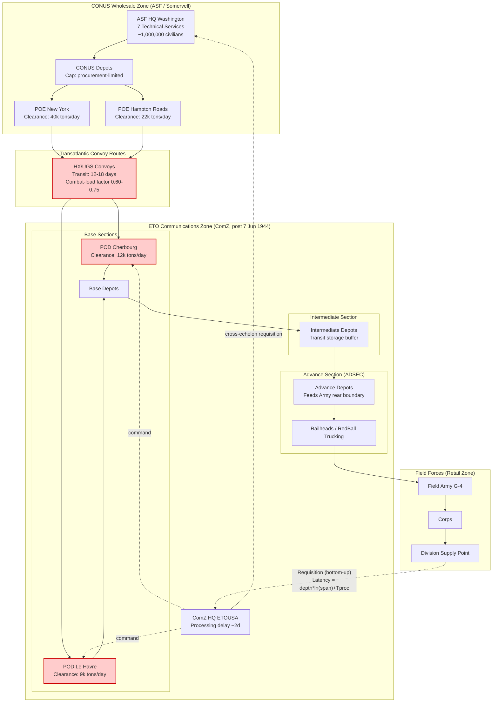

Cost: 0.26297

# Chapter 4: Logistical Organization
## Reference Manual & Simulation-Specification Document
### US Army Green Book — *Global Logistics and Strategy: 1943–1945*

---

## 1. Strategic Context & Modern Historical Perspective

### 1.1 The Strategic Paradox: Ambition Against Physics

The central analytical tension of the 1943–1945 logistical reorganization was the irreconcilable gap between the *declarative* strategic commitments generated at the Allied summit conferences and the *empirical* throughput limits of a globally distributed supply architecture bounded by hull-availability, port-clearance rates, and combat-loading inefficiencies. Casablanca (SYMBOL, January 1943) codified the "Germany First" principle and simultaneously endorsed a Mediterranean expansion (HUSKY, then the Italian campaign) and a strategic bombing offensive—commitments that, in aggregate, demanded shipping tonnage that did not yet exist in the Allied controlled pool. TRIDENT (Washington, May 1943) formally set a target date for the cross-Channel assault (initially May 1944) while sustaining the Mediterranean drain; QUADRANT (Quebec, August 1943) ratified OVERLORD's outline and expanded Pacific and CBI (China-Burma-India) commitments; SEXTANT (Cairo, November–December 1943) layered the Pacific counteroffensive and the aborted BUCCANEER amphibious operation onto an already over-subscribed schedule.

The paradox is best understood not as a failure of will but as a *systems-level over-commitment against a shared constraint*. The binding constraint throughout this period was not manufacturing output—American war production reached prodigious volumes by 1943—but the **shipping-to-shore pipeline**: the number of Liberty and Victory dry-cargo hulls and T2 tankers available, the turnaround cycle at ports of embarkation (POE) and debarkation (POD), and, critically, the *port-clearance rate*, i.e., the speed at which cargo could be discharged, sorted, and evacuated inland before congestion collapsed the berth throughput. Modern operations-research reconstructions demonstrate that combat loading—stowing a vessel so that materiel is discharged in tactical-priority order rather than in cube-optimized order—reduced effective cargo density by 25–40%, meaning a strategically loaded ship carried substantially less than its rated deadweight. Each strategic commitment thus consumed a multiple of its nominal tonnage.

The consequence, visible retrospectively, was a chronic mismatch between the *paper capacity* assumed by planners at conference tables and the *realized capacity* delivered to theater depots. The 1943 reorganization of the Army Service Forces (ASF) was, in effect, an institutional response to this paradox: an attempt to impose a single wholesale-logistics rationality across a system that strategic planning had rendered structurally over-committed.

### 1.2 Inter-Service and Coalition Tensions

The reorganization exposed three distinct axes of command friction.

**First, the ASF–Theater axis.** Lt. Gen. Brehon B. Somervell's Army Service Forces was a Washington-centered *wholesale* logistics enterprise—procurement, storage, and continental-US (CONUS) distribution—whereas theater commanders exercised *retail* control over supplies once they crossed into the theater. The seam between wholesale and retail control was never cleanly defined. Somervell favored centralized, standardized, metrics-driven control that could optimize the global pool; theater commanders, above all Eisenhower, demanded the autonomy to shape their own Communications Zone (ComZ) to tactical circumstance. This is the friction modern administrative theory identifies as the tension between **hierarchical optimization** (globally optimal but locally rigid) and **decentralized responsiveness** (locally adaptive but globally sub-optimal).

**Second, the Army–Navy axis.** The Army controlled troop and cargo movement scheduling through the Transportation Corps and the Chief of Transportation (Maj. Gen. Charles P. Gross), while the Navy controlled combatant escort and, contentiously, competed for the same hull pool for Pacific amphibious lift. The War Shipping Administration (WSA) served as the civilian arbiter allocating the merchant pool, but the Army–Navy competition for assault shipping (LSTs above all) was a recurring bottleneck that repeatedly forced strategic re-sequencing—the delay of OVERLORD from May to June 1944 was in part a function of LST availability.

**Third, the US–British coalition axis.** The Combined Chiefs of Staff (CCS) and the pooling arrangements administered through the Combined Shipping Adjustment Board attempted to treat Anglo-American shipping as a common resource. In practice, national ownership, differing accounting conventions, and mistrust over "who paid the shipping bill" for each operation produced persistent friction. The British Ministry of War Transport and the US WSA negotiated allocations that were as much political as technical.

### 1.3 Historical-Era Context: The Somervell Reorganization

The March 1942 War Department reorganization (Circular 59) created three coequal commands: Army Ground Forces, Army Air Forces, and the Services of Supply—the latter renamed **Army Service Forces** in March 1943. Somervell consolidated the traditionally autonomous Technical Services (Quartermaster, Ordnance, Engineer, Signal, Chemical Warfare, Medical, Transportation) under a single controlling headquarters, subordinating fiefdoms that had historically negotiated directly with the General Staff. In the European Theater, the parallel structure was the Services of Supply, ETOUSA, later redesignated the **Communications Zone (ComZ)**. The ComZ was subdivided into **Base Sections** (rear, port-adjacent), **Intermediate Sections** (transit storage), and **Advance Sections** (forward of the intermediate zone, feeding the Army rear boundary)—a layered topology designed explicitly to prevent double-handling and to buffer the forward armies from the volatility of transatlantic arrival schedules.

### 1.4 Modern Analytical Insights

Post-war declassification and subsequent scholarship (notably the Green Book series itself, and later OR reconstructions) reframe the Somervell system as an early, large-scale experiment in **centralized supply-chain control under deep uncertainty**. The systemic friction between Somervell's Washington ASF and Eisenhower's theater desire for autonomy is a textbook case of the **span-of-control versus depth-of-hierarchy tradeoff**: each additional layer of command (Base → Intermediate → Advance → Army → Corps → Division) reduced the span each headquarters had to manage but *increased the cumulative processing latency* of a supply request traversing the tree. The ComZ's sectional structure was a deliberate attempt to keep span-of-control at each node manageable while accepting a defined depth penalty—a tradeoff that this chapter's simulation model formalizes mathematically.

---

## 2. High-Fidelity Simulation Parameters & Real-World Metrics

| Parameter | Historical Value | Explanation & Strategic Rationale | Simulation Representation |
|---|---|---|---|
| SOS→ComZ redesignation (ETO) | **7 June 1944** (D+1); the Services of Supply, ETOUSA was redesignated Communications Zone, ETOUSA concurrent with the establishment of the forward theater structure | Marks the transition from a build-up/staging posture in the UK to an operational continental supply organization. Triggers activation of Advance Section (ADSEC) forward nodes. | **State-transition event flag** `ComZActivated: Boolean`, gating availability of forward-section routing. |
| Technical Services consolidated under ASF | **7** (Quartermaster, Ordnance, Corps of Engineers, Signal Corps, Chemical Warfare Service, Medical Department, Transportation Corps) | Consolidation eliminated direct General-Staff negotiation by each service, creating one wholesale-logistics authority. Reduced procurement duplication but concentrated bottleneck risk. | **Static constant** `TechnicalServices = 7`; used as branching factor in procurement-node fan-out. |
| ASF authorized civilian strength (late 1943) | **≈ 1,000,000** civilian employees (peak ASF civilian workforce for wholesale procurement/administration) | The civilian arm executed procurement contracting, depot operation, and arsenal management—the wholesale backbone. Its size set the ceiling on parallel procurement-request processing. | **Dynamic capacity cap** `CivilianProcessingCapacity`, throttling concurrent procurement transactions. |
| ComZ base/intermediate/advance section count | **3 section types**, multiple sections each (e.g., Normandy Base Sec, Brittany Base Sec; Advance Section ADSEC) | Layered buffering; each layer adds one unit of hierarchy depth. | **Enum** of section tiers, each contributing to `Hierarchy.depth`. |
| Typical command-tree depth (POE → Division) | **6–7 echelons** (ASF/POE → ComZ HQ → Base Sec → Intermediate Sec → Advance Sec → Army → Corps → Division) | Determines cumulative processing latency of a requisition. | **Variable** `depth` in `Hierarchy`. |
| Nominal HQ processing delay per echelon | **≈ 1.0–3.0 days** per echelon for requisition staffing (historical requisition cycle est.) | Each headquarters staffs, validates, and forwards a requisition; latency compounds down the tree. | **Coefficient** `processingDelay` (days) per node. |
| Combat-loading cube penalty | **25–40%** reduction in effective cargo density | Tactical loading order sacrifices stowage efficiency. | **Efficiency coefficient** `combatLoadFactor ∈ [0.60, 0.75]` applied to hull rated tonnage. |
| Liberty ship rated deadweight | **≈ 10,500 tons** DWT (~ 9,000 tons cargo effective) | Baseline dry-cargo hull for pipeline throughput modeling. | **Static constant** `LibertyDWT = 10500`. |
| Span of control (typical) | **3–5 subordinate sections per echelon** | Governs logarithmic latency contribution per depth level. | **Variable** `spanOfControl` in `Hierarchy`. |

---

## 3. Logistical Network Topology (Mermaid.js)



---

## 4. Mathematical Modeling & Simulation Formulas

### 4.1 Command-Latency Core Model

The chapter's governing relation models the round-trip administrative latency of a requisition traversing a hierarchical command tree. For a tree of depth $D$ and uniform span-of-control $S$, with per-echelon processing time $T_{\text{processing}}$:

$$
L = D \cdot \log_e(S) + T_{\text{processing}}
$$

**Definitions:**
- $L$ — total communication/processing latency (days).
- $D$ — hierarchy depth (number of echelons a requisition must traverse), $D \in \mathbb{Z}^{+}$.
- $S$ — span of control (mean subordinate nodes per echelon), $S \ge 1$.
- $T_{\text{processing}}$ — baseline processing/staffing delay independent of tree shape (days).

The $\log_e(S)$ term captures the *fan-out routing/search cost* at each echelon: a headquarters with more subordinates incurs sub-linear additional latency (logarithmic) in identifying and forwarding to the correct branch, and this cost accrues once per depth level, giving the $D \cdot \log_e(S)$ product.

### 4.2 Effective Throughput With Combat Loading

The realized delivered tonnage across the pipeline:

$$
T_{\text{eff}} = \phi \cdot N_h \cdot W_{\text{DWT}} \cdot \frac{1}{\tau_{\text{cycle}}}
$$

where $\phi \in [0.60, 0.75]$ is the combat-load efficiency coefficient, $N_h$ is the number of hulls on route, $W_{\text{DWT}}$ is rated deadweight per hull, and $\tau_{\text{cycle}}$ is the round-trip cycle time (days). Realized daily throughput is further capped by port clearance:

$$
T_{\text{delivered}} = \min\!\left(T_{\text{eff}},\; \sum_{p} C_{p}^{\text{clear}}\right)
$$

with $C_p^{\text{clear}}$ the clearance rate of port $p$.

### 4.3 Bottleneck Optimization

The allocation objective is to minimize expected requisition fulfillment time subject to processing-capacity constraints:

$$
\min_{\{x_r\}} \; \sum_{r \in R} \left( L_r + \frac{Q_r}{T_{\text{delivered}}} \right)
$$

subject to

$$
\sum_{r \in R} x_r \le K_{\text{civ}}, \qquad x_r \in \{0,1\}, \qquad Q_r \ge 0
$$

where $R$ is the requisition set, $Q_r$ the requested tonnage, $x_r$ the scheduling decision, and $K_{\text{civ}}$ the civilian processing capacity (concurrent-transaction cap). The first term is administrative latency; the second is physical delivery time. The tradeoff formalizes the Somervell–Eisenhower tension: reducing $D$ (flatter theater command) lowers $L_r$ but raises effective $S$, increasing per-echelon $\log_e(S)$ load.

---

## 5. Compile-Safe Scala 3.8.3 Domain Model

```scala
package Logistics.Organization

import scala.math.log
import scala.math.min
import scala.math.max

opaque type Days = Double
object Days:
  def apply(d: Double): Days = d
  extension (d: Days)
    def value: Double = d
    def +(o: Days): Days = d + o

opaque type Tons = Double
object Tons:
  def apply(t: Double): Tons = t
  extension (t: Tons)
    def value: Double = t
    def +(o: Tons): Tons = t + o

opaque type TonsPerDay = Double
object TonsPerDay:
  def apply(t: Double): TonsPerDay = t
  extension (t: TonsPerDay)
    def value: Double = t

opaque type Coefficient = Double
object Coefficient:
  def apply(c: Double): Coefficient = c
  extension (c: Coefficient)
    def value: Double = c

case class Hierarchy(depth: Int, spanOfControl: Int)

enum SectionTier:
  case Base
  case Intermediate
  case Advance

enum ComZState:
  case StagingUK
  case Activated
  case ForwardDisplaced

sealed trait Requisition:
  def id: String
  def tonnage: Tons

case class SupplyRequisition(
  id: String,
  tonnage: Tons,
  originTier: SectionTier
) extends Requisition

case class ConvoyRoute(
  hulls: Int,
  ratedDwt: Tons,
  cycleTime: Days,
  combatLoadFactor: Coefficient
)

case class Port(name: String, clearanceRate: TonsPerDay)

case class ValidationError(field: String, reason: String)

object OrganizationModel:

  val TechnicalServices: Int = 7
  val LibertyDwt: Tons = Tons(10500.0)
  val CivilianProcessingCapacity: Int = 1000000

  def calculateCommunicationLatency(
    h: Hierarchy,
    processingDelay: Double
  ): Double =
    if h.spanOfControl <= 0 then processingDelay
    else h.depth * log(h.spanOfControl.toDouble) + processingDelay

  def latencyDays(h: Hierarchy, processing: Days): Days =
    Days(calculateCommunicationLatency(h, processing.value))

  def validateHierarchy(h: Hierarchy): List[ValidationError] =
    val depthErr: List[ValidationError] =
      if h.depth <= 0 then List(ValidationError("depth", "must be positive"))
      else Nil
    val spanErr: List[ValidationError] =
      if h.spanOfControl < 1 then
        List(ValidationError("spanOfControl", "must be >= 1"))
      else Nil
    depthErr ++ spanErr

  def effectiveThroughput(route: ConvoyRoute): TonsPerDay =
    val cycle: Double = max(route.cycleTime.value, 1.0)
    val gross: Double =
      route.combatLoadFactor.value * route.hulls.toDouble * route.ratedDwt.value
    TonsPerDay(gross / cycle)

  def deliveredThroughput(
    route: ConvoyRoute,
    ports: List[Port]
  ): TonsPerDay =
    val effective: Double = effectiveThroughput(route).value
    val clearanceSum: Double =
      ports.map(p => p.clearanceRate.value).sum
    TonsPerDay(min(effective, clearanceSum))

  def fulfillmentTime(
    req: Requisition,
    h: Hierarchy,
    processing: Days,
    route: ConvoyRoute,
    ports: List[Port]
  ): Days =
    val latency: Double = calculateCommunicationLatency(h, processing.value)
    val rate: Double = max(deliveredThroughput(route, ports).value, 0.0001)
    val transport: Double = req.tonnage.value / rate
    Days(latency + transport)

  def tierDepthContribution(tier: SectionTier): Int =
    tier match
      case SectionTier.Base         => 1
      case SectionTier.Intermediate => 1
      case SectionTier.Advance      => 1

  def transition(state: ComZState, activationFlag: Boolean): ComZState =
    state match
      case ComZState.StagingUK if activationFlag => ComZState.Activated
      case ComZState.Activated if activationFlag => ComZState.ForwardDisplaced
      case other                                 => other

  def canSchedule(concurrent: Int): Boolean =
    concurrent >= 0 && concurrent <= CivilianProcessingCapacity

  def scheduleBatch(
    reqs: List[Requisition],
    h: Hierarchy,
    processing: Days,
    route: ConvoyRoute,
    ports: List[Port]
  ): Either[ValidationError, List[(String, Days)]] =
    if !canSchedule(reqs.size) then
      Left(ValidationError("batch", "exceeds civilian processing capacity"))
    else
      val hierErrors: List[ValidationError] = validateHierarchy(h)
      hierErrors.headOption match
        case Some(err) => Left(err)
        case None =>
          val results: List[(String, Days)] =
            reqs.map: r =>
              (r.id, fulfillmentTime(r, h, processing, route, ports))
          Right(results)

  def totalPipelineLatency(
    reqs: List[Requisition],
    h: Hierarchy,
    processing: Days,
    route: ConvoyRoute,
    ports: List[Port]
  ): Days =
    scheduleBatch(reqs, h, processing, route, ports) match
      case Left(_)        => Days(0.0)
      case Right(results) => Days(results.map(_._2.value).sum)
```

---

## 6. Graduate-Level Operational Analysis

### 6.1 The Eisenhower–Somervell Command Conflict Over Theater Logistics

The friction between Eisenhower as theater commander and Somervell as ASF commander in North Africa (TORCH, 1942) and the United Kingdom build-up (BOLERO) is best analyzed as a **jurisdictional collision between the wholesale and retail domains of a single supply continuum**, with no clean demarcation line and both principals possessing legitimate authority claims.

Somervell's ASF held statutory responsibility for CONUS procurement, storage, and the loading and dispatch of cargo through the ports of embarkation. His institutional logic was *global optimization*: to treat all theaters as competing claimants against a common wholesale pool and to impose standardized requisitioning, uniform accounting, and metric-driven performance management. This logic demanded visibility into and, ideally, control over theater consumption so that CONUS supply could be calibrated to actual draw-down. Somervell repeatedly pressed for stronger ASF influence over theater logistics organization and personnel—most visibly in his advocacy for a strong, centralized theater ComZ headed by a logistics specialist reporting in a manner that preserved ASF's coherence.

Eisenhower's institutional logic was *unity of command within the theater*. Once materiel crossed the theater boundary, the theater commander alone bore responsibility for its tactical employment; a Washington-directed logistics apparatus operating semi-autonomously inside his theater would fracture command unity precisely at the point where supply meets operations. In North Africa, the immaturity of port infrastructure, the improvised nature of TORCH loading (much of it *not* combat-loaded, producing chaotic discharge at Casablanca and Oran), and the acute shortage of service troops made the seam between wholesale delivery and retail employment intensely contested. Eisenhower's staff experienced ASF's Washington-centric metrics as blind to local physical reality—clearance rates dictated by damaged quays and insufficient trucking, not by CONUS efficiency dashboards.

The conflict crystallized around the *staffing and authority of the theater ComZ*. Somervell's model risked creating a ComZ commander whose loyalty and reporting flowed toward the ASF logistical hierarchy rather than the theater commander—a structural violation of unity of command. The eventual resolution subordinated ComZ firmly to the theater commander while preserving ASF's wholesale prerogatives up to the POE and its advisory/technical influence beyond. Mathematically, this is the boundary condition on the latency model: the requisition tree's *upper echelons* ($D$ nearest the leaf/division) belong to theater retail control, while the *root* (procurement, POE) belongs to ASF—and the cross-boundary handoff at ComZ HQ introduces the largest single $T_{\text{processing}}$ term in the chain, precisely because it spans two command philosophies. The North African experience taught that minimizing this seam-latency required *co-location of authority*, which is why the later ETO structure placed ComZ unambiguously under SHAEF/theater command.

### 6.2 Base / Intermediate / Advance Sections and the Prevention of Double-Handling

**Double-handling**—the repeated loading, unloading, sorting, and re-storing of the same tonnage—is the dominant hidden cost inflator in a deep supply pipeline. Each handling event consumes service-troop labor, materials-handling equipment, and time, and each introduces loss, misrouting, and administrative reconciliation overhead. The sectional decomposition of the ComZ into **Base**, **Intermediate**, and **Advance** sections was an explicit architectural device to *segment the pipeline into single-responsibility custody zones*, thereby converting what would otherwise be a chaotic many-to-many handling network into a directed, mostly-acyclic flow with one authoritative custodian per stage.

The mechanism operates on three principles:

1. **Zoning by function, not geography alone.** Base Sections owned the ports and the immediate rear discharge/sorting task; their job was to *clear the berths* and stage cargo for onward movement, not to perform final tactical distribution. Intermediate Sections owned transit storage and the accumulation of reserves—the buffer that decoupled the volatility of transatlantic arrivals from the steadier forward demand. Advance Sections (ADSEC) owned the forward push to the Army rear boundary. Because each section had a *defined custody window*, tonnage did not need to be re-sorted at every boundary; it was pre-configured (ideally pre-palletized and pre-manifested) for the *next* custodian's needs before transfer.

2. **Buffering as decoupling.** The Intermediate Section functioned as a queueing buffer that absorbed arrival-rate variance. Without it, Base Sections would have had to hold cargo on the quays (destroying port-clearance rates and inducing the congestion collapse that plagued Cherbourg and later Antwerp), or Advance Sections would have been whipsawed by the stochastic transatlantic schedule. In queueing terms, the intermediate buffer converts a high-variance arrival process into a lower-variance forward-feed process, smoothing the throughput and reducing the *reactive re-handling* that variance provokes.

3. **Single-touch forward flow.** The ideal the sections pursued was that a given consignment be handled *once per section*—discharged and staged (Base), stored and reserved (Intermediate), and pushed forward (Advance)—rather than repeatedly broken down and rebuilt. In the latency model, each section contributes exactly *one* depth increment ($D {+}{=} 1$ per tier). The design goal was to keep $D$ minimal while preserving the buffering benefit: three tiers were judged the equilibrium between too-flat a structure (which would push port congestion and demand volatility directly onto the forward armies) and too-deep a structure (which would compound $D \cdot \log_e(S)$ latency and multiply handling events).

The failure mode—vividly demonstrated when the sectional buffers were overwhelmed during the rapid pursuit across France in late 1944—was that when forward demand outran the Intermediate Section's throughput, the system reverted to emergency direct-delivery expedients (the Red Ball Express), which *bypassed* the orderly sectional flow. This bypass restored speed at the catastrophic cost of double- and triple-handling, enormous fuel and vehicle attrition, and the very congestion the sectional design existed to prevent. The episode is the empirical proof of the model: sectional decomposition prevents double-handling *only while each section operates within its capacity envelope*; once a section saturates, the pipeline collapses back into the unstructured, high-handling regime the architecture was built to escape.
