Cost: 0.50245375

## 1. Strategic Context & Modern Historical Perspective

Chapter 4 of *Global Logistics and Strategy: 1943–1945* concerns more than an administrative reshuffling of the United States Army. It describes an attempt to construct a global logistical command system capable of translating coalition strategy into procurement programs, shipping priorities, theater inventories, and ultimately the daily delivery of ammunition, fuel, food, vehicles, engineer stores, and replacement equipment to combat formations. The central historical problem was that strategic commitments could be created more rapidly than the logistical system could generate, transport, receive, and distribute the material required to execute them.

### The strategic paradox: plans were global, capacity was finite

The Allied conferences at Casablanca in January 1943, TRIDENT in May, QUADRANT in August, and SEXTANT in November–December progressively defined a strategy that included the Mediterranean, the strategic air offensive, aid to the Soviet Union, operations in the Pacific and China–Burma–India, and the eventual cross-Channel invasion of northwest Europe. Each decision created a claim against the same limited pool of ships, landing craft, port capacity, trained service troops, locomotives, trucks, petroleum infrastructure, and production.

This was the strategic paradox of 1943–44: the United States possessed an extraordinary industrial base, but production alone did not place usable combat power overseas. Material had to pass through a sequence of constrained transformations:

1. procurement and acceptance;
2. inland movement to a port of embarkation;
3. port storage and processing;
4. loading into an appropriate vessel;
5. convoy assembly and ocean movement;
6. discharge at a receiving port or over a beach;
7. port clearance;
8. depot sorting and reconsignment;
9. movement through a communications zone;
10. issue to an army, corps, division, or air formation.

The capacity of the whole system was not the sum of these capacities but was governed, at any particular time, by its narrowest effective bottleneck. A port capable of discharging 15,000 long tons per day did not produce 15,000 tons of useful theater throughput if rail clearance was limited to 9,000 tons, if labor could classify only 8,000 tons, or if forward depots could accept only 7,000 tons. Material accumulated at the constrained node, occupied scarce storage space, delayed ships, and often generated additional handling.

High-level strategic planning frequently treated shipping as an aggregate tonnage account. Operational logistics required a more granular model. A refrigerated ship, tanker, Liberty ship, troop transport, vehicle carrier, and combat-loaded assault vessel were not interchangeable. Nor could ordinary commercial loading substitute for combat loading. Commercial loading maximized vessel utilization by placing cargo according to weight, volume, and destination. Combat loading deliberately sacrificed some utilization so that equipment could be discharged in the order required by tactical plans. Assault shipping therefore imposed both a capacity penalty and a scheduling penalty.

Landing craft were especially restrictive. At TRIDENT and QUADRANT, the allocation of landing ships and craft directly constrained the timing and scale of operations in both Europe and the Pacific. A strategic decision to retain landing craft in the Mediterranean could postpone their availability for the cross-Channel operation. Conversely, concentrating them for OVERLORD reduced operational freedom elsewhere. These were not merely disputes over institutional preference; they were resource-allocation conflicts involving assets with long construction lead times and limited substitutability.

Shipping calculations were also vulnerable to optimistic assumptions concerning turnaround. A ship was not “available” merely because it had completed an ocean passage. Its effective cycle included loading, convoy waiting, sailing, discharge, repair, ballast or return cargo, and repositioning. Port congestion or slow clearance lengthened the cycle and thereby reduced the effective size of the shipping pool. From a modern operations-research perspective, a ten-percent reduction in turnaround time could sometimes generate more usable lift than an equivalent nominal addition of ships.

### Somervell’s centralized Army Service Forces

The War Department reorganization of 9 March 1942 created the Services of Supply under Maj. Gen., later Lt. Gen., Brehon B. Somervell. On 12 March 1943 it was redesignated the Army Service Forces. The ASF centralized the Army’s principal procurement, distribution, construction, transportation, communications, medical, maintenance, and administrative functions in the continental United States.

Somervell’s organizational philosophy reflected the scale and urgency of industrial mobilization. Fragmented bureau autonomy was poorly suited to allocating steel, machine tools, plant capacity, labor, and transportation among competing supply programs. ASF headquarters sought standardized requirements, centralized production control, common reporting, and the elimination of redundant procurement. Its technical services retained specialized expertise, but their activities were subordinated to an integrated service command.

This system achieved enormous results. It coordinated billions of dollars in procurement, built and operated depots and ports, managed the zone-of-interior distribution system, supported overseas troop movements, and converted strategic deployment schedules into demands on industrial production. Yet the same centralization that improved continental procurement generated friction when Washington attempted to influence the internal logistical organization of an overseas theater.

The basic administrative-theory problem was one of centralization versus environmental responsiveness. Centralized organizations can exploit scale, standardize procedures, aggregate demand, and control scarce strategic resources. Decentralized organizations can respond more rapidly to local information, tactical conditions, damaged infrastructure, changing consumption rates, and enemy action. The ASF possessed superior visibility over continental stocks, procurement lead times, and global shipping. Theater commanders possessed superior knowledge of operational priorities and local distribution conditions. Neither level could optimize the system alone.

### Theater command and the autonomy problem

Theater commanders, including General Dwight D. Eisenhower, insisted that logistical organizations within their theaters had to remain subordinate to the theater commander. Operational command without control over supply priorities would have been largely nominal. Eisenhower needed authority to decide whether scarce transport supported an air offensive, port reconstruction, an army advance, a deception plan, or the accumulation of reserves for a future operation.

Somervell, however, had legitimate reasons to resist uncoordinated theater autonomy. Each theater naturally rated its own requirements as urgent. If all theater demands were accepted without global arbitration, shipping and procurement programs would become unstable. Theater overstatement of requirements could generate excess stocks in one region while depriving another. Moreover, ASF remained accountable for the continental wholesale system and needed standardized requisitioning and reporting to forecast production.

The North African and European experiences demonstrated this tension. In North Africa, fragmented command arrangements, uncertain operational plans, long lines of communication, inadequate port clearance, and incomplete knowledge of local stocks encouraged emergency requisitions and organizational improvisation. Theater personnel often blamed Washington for delay or inflexibility, while ASF officers blamed theaters for inaccurate requirements, poor inventory visibility, and inefficient distribution.

In the European Theater of Operations, United States Army, the Services of Supply under Lt. Gen. John C. H. Lee developed into an exceptionally large organization. It had to receive and stage the forces required for OVERLORD while simultaneously sustaining the air campaign and supporting troops already in Britain. The theater SOS was formally redesignated the Communications Zone, ETOUSA, on 7 June 1944, the day after the Normandy landings. The new title reflected the transition from a primarily static buildup organization in Britain to a continental line-of-communications command extending from beaches and ports through base and intermediate installations to the advancing field armies.

The organizational relationship among Eisenhower, Lee, Somervell, and the combat commanders was frequently contentious. Combat commanders considered service organizations excessively large and administratively cumbersome. Service commanders argued that combat formations underestimated the manpower and infrastructure necessary to maintain continuous operations. Somervell sometimes treated the theater service system as an extension of the global structure he supervised; Eisenhower rejected arrangements that could dilute theater unity of command.

### Army–Navy and coalition tensions

Inter-service coordination added another layer of friction. The Army depended upon the Navy for convoy protection, much amphibious lift, and large portions of port and beach operations. The Navy’s calculation of risk, escort requirements, vessel employment, and assault-loading practice did not always correspond to Army deployment priorities. A vessel might be physically capable of carrying Army cargo but unavailable because it was assigned to another ocean area, undergoing conversion, retained for naval purposes, or unsuitable for the required discharge conditions.

The British–American relationship was equally complex. Combined planning and shipping pooling increased total Allied efficiency, but pooling did not abolish national accountability. British planners had to sustain imperial communications, imports essential to the British economy, Mediterranean commitments, and forces in Asia. American planners increasingly supplied the larger share of new matériel and troop lift and therefore demanded influence over allocation. Arguments that appeared to concern strategy often rested upon different assumptions about shipping availability, turnaround, cargo density, reserve levels, and the rehabilitation rate of ports.

The British also had longer experience with wartime scarcity and sometimes favored tighter material scales and incremental operations. American planning tended to reflect confidence in mass production and overwhelming concentration. Neither approach was intrinsically irrational. They represented different resource positions, strategic traditions, and institutional experiences.

### Base, intermediate, and advance sections

The Communications Zone divided territorial responsibility among base, intermediate, and advance sections. A base section controlled reception infrastructure such as ports, depots, assembly facilities, hospitals, and transportation terminals. An intermediate section operated storage, repair, transfer, and line-haul functions farther forward. An advance section supported the armies and operated the forward portion of the distribution network.

In theory, this sectional organization reduced duplication by assigning each facility and transport segment to a territorial commander. Supplies with known destinations could bypass unnecessary depots, while each section remained responsible for clearance through its geographic area. In practice, boundary changes, rapid advances, incompatible records, uncertain destinations, and pressure from combat units often caused rehandling and cross-hauling.

The section system therefore should not be interpreted as automatically efficient. Its success depended on information quality, stable routing rules, disciplined movement control, and adequate transportation. A depot inserted into the network without a genuine classification, reserve, maintenance, or transshipment function merely added delay. Modern supply-chain theory would describe such a node as non-value-adding inventory.

### Modern analytical interpretation

Modern scholarship generally treats the ASF and theater communications zones as components of a federated system rather than as a simple hierarchy. Washington controlled procurement, continental stocks, strategic movement, and much shipping allocation. Theater headquarters converted strategic intent into operational priorities. Communications-zone headquarters managed reception and theater distribution. Armies and corps generated tactical demand and controlled final delivery.

The system’s most serious weakness was not necessarily a shortage of gross supply. It was often an inability to identify, route, and deliver the correct item at the required time and place. Aggregate tonnage could conceal severe shortages of particular ammunition calibers, tires, replacement parts, bridging equipment, winter clothing, or fuel containers. Consequently, a realistic simulation must distinguish between nominal tonnage and mission-effective tonnage.

Organizational depth also imposed latency. A requisition could pass from division to corps, army, advance section, communications-zone headquarters, theater headquarters, and occasionally Washington. Each level could validate, consolidate, modify, defer, or reject it. Hierarchy reduced uncontrolled competition for resources but increased processing time and introduced information distortion. Emergency procedures shortened the chain but weakened inventory discipline and often shifted shortages elsewhere.

The historical achievement was therefore not the creation of a frictionless pipeline. It was the construction of a system resilient enough to sustain simultaneous operations despite incomplete information, coalition politics, damaged infrastructure, and rapidly changing plans. Its enduring lesson is that command organization is itself a logistical capacity. Authority, information, and processing time must be modeled alongside ships, trucks, depots, and tons.

---

## 2. High-Fidelity Simulation Parameters & Real-World Metrics

### Core historical constants

| Parameter | Historical value | Scope and explanation | Recommended simulation representation |
|---|---:|---|---|
| Creation of the War Department Services of Supply | **9 March 1942** | The War Department reorganization grouped most Army supply and administrative functions under Somervell and separated the Army into the Army Ground Forces, Army Air Forces, and Services of Supply. | Static organizational event. On this date, activate centralized continental procurement, distribution, and service-command authority. |
| SOS redesignation as Army Service Forces | **12 March 1943** | The continental SOS became the Army Service Forces. This was a change of designation rather than the creation of an entirely new logistical system. | Static event changing command identity while preserving facilities, inventories, contracts, and most subordinate relationships. |
| ETOUSA SOS redesignation as Communications Zone | **7 June 1944** | The theater SOS became **Communications Zone, ETOUSA**, immediately after D-Day. The designation reflected its continental line-of-communications mission. | Static theater event. Enable continental Base, Intermediate, and Advance Section routing and transfer existing SOS assets without resetting state. |
| ASF technical services | **7** | By the mature wartime organization, the seven technical services were the Corps of Engineers, Signal Corps, Ordnance Department, Quartermaster Corps, Chemical Warfare Service, Medical Department, and Transportation Corps. The Transportation Corps was established in July 1942; therefore, scenarios beginning before then must not anachronistically treat all seven as fully mature. | Static count after July 1942; time-dependent organizational roster before that date. Each service should have distinct commodity, maintenance, and processing competencies. |
| Late-1943 ASF civilian personnel authorization | **Approximately 870,000** | The late-1943 organizational figure commonly associated with ASF’s authorized or controlled civilian establishment was about 870,000. It excludes the much larger workforce employed by private contractors producing Army matériel. Historical reports vary by exact reporting date and by whether temporary, transferred, or reimbursable employees are included. | Baseline personnel ceiling, not a universal constant. Store the reporting date and accounting definition with the value. Convert filled positions into procurement, inspection, depot, and administrative processing capacity. |
| Casablanca Conference | **14–24 January 1943** | Confirmed the strategic emphasis on defeating Germany, Mediterranean operations, the bombing offensive, and planning for a return to northwest Europe. | Planning event that changes demand weights and future deployment schedules. |
| TRIDENT Conference | **12–25 May 1943** | Addressed the 1944 cross-Channel operation, Mediterranean strategy, and global allocation of forces and shipping. | Strategic-priority transition with landing-craft and shipping allocation decisions. |
| QUADRANT Conference | **17–24 August 1943** | Refined OVERLORD planning and debated Mediterranean and Pacific commitments. | Reallocation event affecting lift, force buildup, and theater priority coefficients. |
| SEXTANT Conference | **22 November–7 December 1943** | Coordinated European and Asian strategy immediately before the final Tehran deliberations. | Strategic event altering forecast demand and shipping reservations. |
| OVERLORD assault date | **6 June 1944** | Beginning of the cross-Channel invasion. It transformed the British buildup system into an active continental distribution network. | Scenario phase transition from accumulation to high-consumption expeditionary operations. |
| Standard planning factor for one U.S. long ton | **2,240 lb; approximately 1.016 metric tonnes** | U.S. wartime overseas logistics commonly used long tons for ocean shipping and theater cargo statistics. Weight units must not be silently mixed with 2,000-pound short tons. | Unit conversion constant. Preserve source units in imported records. |
| Petroleum handling characteristic | **Commodity-specific and infrastructure-dependent** | Bulk petroleum required tankers, pipelines, tank farms, pumping stations, or specialized transfer equipment. Packaged petroleum used general cargo capacity but imposed container and handling burdens. | Separate bulk and packaged petroleum networks. Do not allow unrestricted substitution between tanker and dry-cargo capacity. |
| Combat-loading utilization penalty | **Scenario-dependent; typically lower than commercial loading** | Combat-loaded vessels sacrificed cube and deadweight utilization to ensure tactical discharge order. No single coefficient applies to all ships or operations. | Dynamic efficiency coefficient indexed by vessel, operation, cargo mix, and discharge method. A plausible calibrated range is 0.65–0.85 of ordinary stowage capacity, but it must not be represented as a universal historical constant. |
| Port effective throughput | **Minimum of discharge, handling, clearance, and downstream acceptance** | Nominal berth capacity overstated usable throughput when railcars, trucks, labor, cranes, storage, or destination capacity were insufficient. | Dynamic capacity: $C_p(t)=\min(C_{\text{berth}},C_{\text{labor}},C_{\text{clearance}},C_{\text{storage}},C_{\text{downstream}})$. |
| Depot utilization safety threshold | **Recommended model default: 85%** | Queuing delay grows nonlinearly as depot occupancy and handling utilization approach saturation. This is a simulation calibration value, not a chapter-specific historical constant. | Soft capacity threshold. Above 85%, apply escalating delay and misrouting risk; at 100%, reject or divert arrivals. |
| Request hierarchy depth | **Typically 3–6 approval or reporting echelons** | A divisional request might pass through corps, army, advance section, Communications Zone, theater, and, for strategic shortages, Washington. Exact paths varied by commodity and urgency. | Dynamic integer determined by commodity, command policy, urgency, and stock status. |
| Shipment visibility accuracy | **Incomplete and time-varying** | Manifests, depot records, and unit reports did not provide modern real-time visibility. In-transit cargo could be administratively “lost” without being physically lost. | Probability distribution for record delay, classification error, and location uncertainty. |
| Sectional distribution structure | **Base–Intermediate–Advance** | Territorial sections divided port reception, line-haul, storage, maintenance, and forward distribution responsibilities. | Directed multilayer network. Every node belongs to one territorial section, while bypass arcs permit direct shipment when destination data and transport are available. |

### Data-governance qualification

The 870,000 civilian figure should be stored as a dated establishment baseline rather than as a timeless integer. ASF personnel totals changed as installations opened, functions transferred, staffing ceilings were reduced, and military personnel replaced or supplemented civilians. Contractor employees must be represented separately; otherwise, the simulator will incorrectly treat the entire industrial labor force as directly commanded ASF personnel.

Likewise, “seven technical services” describes the mature ASF structure. A March 1942 scenario should model the transportation function before the Transportation Corps reached its later organizational form.

---

## 3. Logistical Network Topology (Detailed Mermaid.js Flowchart)

```mermaid
flowchart LR
  subgraph ZI["Zone of Interior: ASF-Controlled Wholesale System"]
    REQ["Strategic Requirements Board<br/>Global demand reconciliation"]
    TS["Seven Technical Services<br/>Commodity specification and procurement"]
    PLANT["Government and Contractor Plants<br/>Production lead time and acceptance inspection"]
    ZIDEP["Zone-of-Interior Depots<br/>Storage, assembly, packing, classification"]
    RAILZI["Rail and Inland Water Movement<br/>Car availability and scheduling constraint"]
    NYPOE["New York Port of Embarkation<br/>Berth, labor, storage, and rail-clearance caps"]
    HAMPOE["Hampton Roads POE<br/>Alternative Atlantic routing"]
    GULFPOE["Gulf POEs<br/>Longer inland and ocean routes"]
    ASFHQ["ASF Headquarters<br/>Somervell: global allocation and shipping priorities"]

    REQ -->|"approved program; administrative delay"| TS
    TS -->|"contracts and production orders"| PLANT
    PLANT -->|"accepted dry cargo, vehicles, ammunition"| ZIDEP
    ZIDEP -->|"rail allocation; tons/day cap"| RAILZI
    RAILZI --> NYPOE
    RAILZI --> HAMPOE
    RAILZI --> GULFPOE
    ASFHQ -.->|"priority, release, and exception decisions"| REQ
    ASFHQ -.->|"shipping allocation"| NYPOE
    ASFHQ -.->|"shipping allocation"| HAMPOE
    ASFHQ -.->|"shipping allocation"| GULFPOE
  end

  subgraph OCEAN["Atlantic Strategic Movement"]
    CONVOY["Convoy Assembly and Sailing<br/>Escort availability and departure interval"]
    DRYCARGO["Dry-Cargo Shipping Pool<br/>deadweight and cube constraints"]
    TANKER["Tanker Pool<br/>bulk petroleum only"]
    ASSAULT["Combat-Loaded Assault Shipping<br/>reduced stowage efficiency"]
    RISK["Enemy Action and Weather<br/>delay, diversion, damage, or loss"]

    NYPOE -->|"commercial-loaded sustainment"| DRYCARGO
    HAMPOE -->|"commercial-loaded sustainment"| DRYCARGO
    GULFPOE -->|"alternative route; longer cycle"| DRYCARGO
    NYPOE -->|"bulk POL"| TANKER
    NYPOE -->|"assault echelons"| ASSAULT
    DRYCARGO --> CONVOY
    TANKER --> CONVOY
    ASSAULT --> CONVOY
    RISK -.->|"stochastic cycle-time increase"| CONVOY
  end

  subgraph UKBASE["United Kingdom Base and Pre-OVERLORD Buildup"]
    LIVERPOOL["Liverpool and Mersey Ports<br/>discharge and rail-clearance caps"]
    BRISTOL["Bristol Channel Ports<br/>alternative reception"]
    SOUTHPORTS["Southern Ports<br/>assault concentration and congestion"]
    UKDEP["British Base Depots<br/>theater reserve and classification"]
    MARSHAL["Marshalling Areas<br/>unit staging and combat loading"]
    ETOHQ["ETOUSA Headquarters<br/>theater operational priorities"]
    SOSHQ["SOS ETOUSA<br/>renamed ComZ on 7 June 1944"]

    CONVOY -->|"ocean arrival queue"| LIVERPOOL
    CONVOY -->|"diversion if capacity available"| BRISTOL
    CONVOY -->|"priority assault cargo"| SOUTHPORTS
    LIVERPOOL -->|"rail clearance"| UKDEP
    BRISTOL -->|"rail clearance"| UKDEP
    SOUTHPORTS -->|"staging"| MARSHAL
    UKDEP -->|"issue by operation and destination"| MARSHAL
    ETOHQ -.->|"theater priority directive"| SOSHQ
    SOSHQ -.->|"movement and depot orders"| UKDEP
  end

  subgraph CONTINENT["Continental Communications Zone after 7 June 1944"]
    BEACH["Normandy Beaches and Artificial Harbors<br/>weather-sensitive discharge"]
    CHER["Cherbourg<br/>repair-dependent port capacity"]
    MINOR["Minor Channel Ports<br/>limited draft and clearance"]
    BASESEC["Base Sections<br/>port reception, hospitals, major depots"]
    INTSEC["Intermediate Section<br/>line-haul, storage, repair, transshipment"]
    ADSEC["Advance Section<br/>forward depots and army support"]
    RAILFR["Continental Rail Network<br/>repair, locomotive, and bridge constraints"]
    REDBALL["Motor Transport Routes<br/>truck, driver, tire, fuel, and road caps"]
    PIPE["Bulk POL Pipeline and Tank Farms<br/>construction and pumping caps"]
    AMMODEP["Ammunition Depots<br/>explosive safety and lot segregation"]
    GENDEP["General Supply Depots<br/>classification and inventory accuracy"]
    POLDEP["POL Depots<br/>bulk and packaged fuel"]
    COMZHQ["Communications Zone Headquarters<br/>routing, allocation, and section control"]

    MARSHAL -->|"assault shipping"| BEACH
    CONVOY -->|"follow-up cargo after opening"| CHER
    CONVOY -->|"coasters and selected vessels"| MINOR
    BEACH -->|"clearance limit"| BASESEC
    CHER -->|"berth discharge and rail clearance"| BASESEC
    MINOR -->|"truck or rail clearance"| BASESEC

    BASESEC -->|"rail line-haul"| RAILFR
    BASESEC -->|"motor line-haul"| REDBALL
    BASESEC -->|"bulk petroleum"| PIPE
    RAILFR --> INTSEC
    REDBALL --> INTSEC
    PIPE --> POLDEP

    INTSEC -->|"ammunition allocation"| AMMODEP
    INTSEC -->|"general cargo allocation"| GENDEP
    INTSEC -->|"forward movement"| ADSEC
    AMMODEP --> ADSEC
    GENDEP --> ADSEC
    POLDEP --> ADSEC

    BASESEC -->|"authorized bypass if destination known"| ADSEC
    COMZHQ -.->|"section boundaries and movement credits"| BASESEC
    COMZHQ -.->|"inventory and routing orders"| INTSEC
    COMZHQ -.->|"army support priorities"| ADSEC
  end

  subgraph COMBAT["Combat Command and Final Distribution"]
    ARMY["Field Army G-4<br/>priority and allocation"]
    CORPS["Corps G-4<br/>consolidation and validation"]
    DIV["Division G-4 and Quartermaster<br/>daily expenditure and stock reports"]
    DUMP["Army and Division Supply Points<br/>last controlled transfer"]
    UNITS["Combat Regiments and Battalions<br/>consumption, loss, and local reserve"]

    ADSEC -->|"army allotment"| DUMP
    DUMP -->|"organic and attached transport"| DIV
    DIV -->|"unit distribution"| UNITS

    UNITS -.->|"consumption and emergency request"| DIV
    DIV -.->|"validated requisition"| CORPS
    CORPS -.->|"consolidated demand"| ARMY
    ARMY -.->|"priority request"| ADSEC
    ADSEC -.->|"shortage escalation"| COMZHQ
    COMZHQ -.->|"theater-controlled item request"| ETOHQ
    ETOHQ -.->|"strategic shortage or program change"| ASFHQ
  end

  CONGEST["Congestion Controller<br/>If utilization exceeds 85%, increase queue delay,<br/>misclassification risk, and diversion probability"]
  DIVERT["Alternative Routing Engine<br/>select port, depot, rail, or truck bypass<br/>subject to commodity compatibility"]

  NYPOE -.-> CONGEST
  LIVERPOOL -.-> CONGEST
  CHER -.-> CONGEST
  BASESEC -.-> CONGEST
  INTSEC -.-> CONGEST
  ADSEC -.-> CONGEST

  CONGEST -.-> DIVERT
  DIVERT -.-> BRISTOL
  DIVERT -.-> MINOR
  DIVERT -.-> REDBALL
  DIVERT -.-> GENDEP
```



The solid arcs represent physical movement. Dashed arcs represent command, requisition, reporting, and exception-processing traffic. Administrative and physical networks must remain separate in the implementation: an approved requisition creates authority to move material but does not itself create inventory or transport capacity.

---

## 4. Mathematical Modeling & Simulation Formulas

### 4.1 Time-expanded multicommodity network

Let:

- $N$ be the set of ports, depots, transfer points, and combat nodes;
- $A \subseteq N \times N$ be the set of transport arcs;
- $K$ be the set of commodities;
- $T$ be the set of daily or weekly periods;
- $x_{ijkt}$ be tons of commodity $k$ dispatched over arc $(i,j)$ in period $t$;
- $I_{ikt}$ be inventory of commodity $k$ at node $i$ at the end of period $t$;
- $d_{ikt}$ be demand at node $i$;
- $u_{ikt}$ be unmet demand;
- $\tau_{ij}$ be the transit time on arc $(i,j)$;
- $C_{ijt}$ be arc capacity;
- $H_{it}$ be node handling capacity;
- $S_{it}$ be node storage capacity;
- $\rho_{ijkt}$ be the survival and usable-delivery coefficient;
- $q_k$ be volume or special-handling demand per ton;
- $P_{it}$ be port berth capacity;
- $R_{it}$ be port clearance capacity.

A suitable objective minimizes shortage, delay, handling, congestion, and transport cost:

$$
\min \;
\sum_{t \in T}\sum_{i \in N}\sum_{k \in K}
w_k u_{ikt}
+
\sum_{t \in T}\sum_{(i,j)\in A}\sum_{k\in K}
c_{ijk}x_{ijkt}
+
\sum_{t \in T}\sum_{i\in N}
\left(
h_i I_{ikt}
+
\gamma_i Q_{it}
\right)
$$

where:

- $w_k$ is the military penalty for commodity shortage;
- $c_{ijk}$ is the transport and handling cost;
- $h_i$ is the inventory-holding penalty;
- $Q_{it}$ is congestion delay or queue size;
- $\gamma_i$ is the cost of congestion.

The inventory-balance equation is:

$$
I_{ikt}
=
I_{ik,t-1}
+
\sum_{j:(j,i)\in A}
\rho_{jikt}\,x_{jik,t-\tau_{ji}}
-
\sum_{j:(i,j)\in A}x_{ijkt}
-
d_{ikt}
+
u_{ikt}
$$

This equation prevents approval records from generating physical stock. Inventory increases only when a shipment dispatched in an earlier period arrives.

### 4.2 Transport and node-capacity constraints

Arc capacity is:

$$
\sum_{k\in K} q_k x_{ijkt} \le C_{ijt}
\qquad
\forall (i,j)\in A,\;t\in T
$$

Node handling is:

$$
\sum_{k\in K}
\left(
\sum_{j:(j,i)\in A}x_{jikt}
+
\sum_{j:(i,j)\in A}x_{ijkt}
\right)
\le H_{it}
$$

Storage is:

$$
0 \le \sum_{k\in K} I_{ikt} \le S_{it}
$$

Effective port throughput is bounded by the most restrictive port process:

$$
C^{\text{effective}}_{it}
=
\min
\left(
P_{it},
H^{\text{discharge}}_{it},
R_{it},
S_{it}-I_{it},
C^{\text{downstream}}_{it}
\right)
$$

and:

$$
\sum_{k\in K}x^{\text{port-out}}_{ikt}
\le C^{\text{effective}}_{it}
$$

This formulation captures the historical fact that berth productivity alone did not determine port output.

### 4.3 Shipping-cycle capacity

For vessel class $v$:

- $n_v$ is the number of ships;
- $W_v$ is usable deadweight;
- $\eta_v$ is loading efficiency;
- $T_v^{cycle}$ is the full round-trip cycle.

Effective daily lift is:

$$
\Lambda_v
=
\frac{n_v W_v \eta_v}
{T_v^{cycle}}
$$

with:

$$
T_v^{cycle}
=
T_v^{load}
+
T_v^{wait}
+
T_v^{outbound}
+
T_v^{discharge}
+
T_v^{return}
+
T_v^{repair}
$$

Combat loading is represented by a lower $\eta_v$ and often a longer loading time. Port congestion increases both $T_v^{wait}$ and $T_v^{discharge}$, reducing the effective shipping pool even when the number of hulls remains unchanged.

### 4.4 Congestion and queue growth

Let node utilization be:

$$
\rho_{it}
=
\frac{\lambda_{it}}
{\mu_{it}}
$$

where $\lambda_{it}$ is the arrival rate and $\mu_{it}$ is processing capacity. For $\rho_{it}<1$, an M/M/1 approximation gives:

$$
W_{it}
=
\frac{1}
{\mu_{it}-\lambda_{it}}
$$

The historical network was not truly memoryless, but the equation captures the nonlinear rise in delay as utilization approaches capacity. For simulation stability, a calibrated piecewise function is preferable:

$$
W_{it}^{sim}
=
\begin{cases}
W_{it}^{base}, & 0 \le \rho_{it} \le 0.85 \\[4pt]
W_{it}^{base}
+
\beta_i
\left(
\frac{\rho_{it}-0.85}{1-\rho_{it}}
\right), & 0.85 < \rho_{it} < 1 \\[8pt]
W_{it}^{base}+W_{it}^{overflow}, & \rho_{it}\ge 1
\end{cases}
$$

At or above full utilization, arrivals must be held, diverted, or rejected rather than processed instantaneously.

### 4.5 Command-chain communication latency

The requested concept is:

$$
\text{Mathematical Concept: } L = D \cdot \log_e(S) + T_{processing}
$$

where:

- $L$ is total administrative latency;
- $D$ is hierarchy depth;
- $S$ is span of control;
- $T_{processing}$ is intrinsic clerical, validation, and decision time.

Strictly, $D\ln(S)$ is dimensionless and cannot be added to a time value unless a conversion coefficient is implied. A dimensionally correct form is:

$$
L
=
\alpha D\ln(S)
+
T_{processing}
$$

where $\alpha$ is days per unit of organizational complexity. The original expression assumes $\alpha=1$ day.

A more complete theater-request model is:

$$
L_r
=
\sum_{\ell=1}^{D_r}
\left[
p_{\ell r}
+
\alpha_\ell \ln(S_\ell)
+
q_{\ell r}
\right]
+
L_r^{transmission}
$$

where:

- $p_{\ell r}$ is processing time at echelon $\ell$;
- $q_{\ell r}$ is queueing delay;
- $S_\ell$ is that echelon’s span of control;
- $L_r^{transmission}$ is signal, courier, or records-transmission delay.

Emergency priority can reduce latency:

$$
L_r^{emergency}
=
\phi_r L_r,
\qquad 0<\phi_r<1
$$

but should impose an externality cost because emergency requests disrupt scheduled allocations:

$$
C_r^{disruption}
=
\delta_r
\sum_{k}x_{k}^{rescheduled}
$$

### 4.6 Double-handling coefficient

Let $m_s$ be the minimum necessary number of handling events for shipment $s$, and $a_s$ the actual number. Define:

$$
\eta_s^{handling}
=
\frac{m_s}{a_s},
\qquad
0<\eta_s^{handling}\le1
$$

Additional handling delay is:

$$
T_s^{extra}
=
(a_s-m_s)\bar{t}^{handle}
$$

and handling loss is:

$$
Q_s^{delivered}
=
Q_s^{origin}
\prod_{r=1}^{a_s}(1-\ell_r)
$$

where $\ell_r$ is the damage, loss, or misclassification rate at handling event $r$. The purpose of sectional organization and depot bypass was to keep $a_s$ close to $m_s$.

---

## 5. Compile-Safe Scala 3.8.3 Domain Model

```scala
package Logistics.Organization

import scala.math.log

object Units:
  opaque type NauticalMiles = Double
  opaque type Tons = Double
  opaque type TonsPerDay = Double
  opaque type Days = Double
  opaque type Fraction = Double

  object NauticalMiles:
    def from(value: Double): Either[String, NauticalMiles] =
      validateNonNegativeFinite(value, "Nautical miles")

    def unsafe(value: Double): NauticalMiles =
      requireValidNonNegativeFinite(value, "Nautical miles")

    extension (value: NauticalMiles)
      def toDouble: Double = value

  object Tons:
    val Zero: Tons = 0.0

    def from(value: Double): Either[String, Tons] =
      validateNonNegativeFinite(value, "Tons")

    def unsafe(value: Double): Tons =
      requireValidNonNegativeFinite(value, "Tons")

    extension (value: Tons)
      def toDouble: Double = value

  object TonsPerDay:
    val Zero: TonsPerDay = 0.0

    def from(value: Double): Either[String, TonsPerDay] =
      validateNonNegativeFinite(value, "Tons per day")

    def unsafe(value: Double): TonsPerDay =
      requireValidNonNegativeFinite(value, "Tons per day")

    extension (value: TonsPerDay)
      def toDouble: Double = value

  object Days:
    val Zero: Days = 0.0

    def from(value: Double): Either[String, Days] =
      validateNonNegativeFinite(value, "Days")

    def unsafe(value: Double): Days =
      requireValidNonNegativeFinite(value, "Days")

    extension (value: Days)
      def toDouble: Double = value

  object Fraction:
    val Zero: Fraction = 0.0
    val One: Fraction = 1.0

    def from(value: Double): Either[String, Fraction] =
      if value.isNaN || value.isInfinity then
        Left("Fraction must be finite")
      else if value < 0.0 || value > 1.0 then
        Left("Fraction must be between zero and one")
      else
        Right(value)

    def unsafe(value: Double): Fraction =
      require(!value.isNaN && !value.isInfinity, "Fraction must be finite")
      require(value >= 0.0 && value <= 1.0, "Fraction must be between zero and one")
      value

    extension (value: Fraction)
      def toDouble: Double = value

  private def validateNonNegativeFinite[A](
    value: Double,
    label: String
  ): Either[String, A] =
    if value.isNaN || value.isInfinity then
      Left(s"$label must be finite")
    else if value < 0.0 then
      Left(s"$label must be non-negative")
    else
      Right(value.asInstanceOf[A])

  private def requireValidNonNegativeFinite[A](
    value: Double,
    label: String
  ): A =
    require(!value.isNaN && !value.isInfinity, s"$label must be finite")
    require(value >= 0.0, s"$label must be non-negative")
    value.asInstanceOf[A]

final case class Hierarchy(depth: Int, spanOfControl: Int):
  require(depth >= 0, "Hierarchy depth must be non-negative")
  require(spanOfControl >= 0, "Span of control must be non-negative")

object OrganizationModel:
  def calculateCommunicationLatency(
    h: Hierarchy,
    processingDelay: Double
  ): Double =
    require(
      !processingDelay.isNaN && !processingDelay.isInfinity,
      "Processing delay must be finite"
    )
    require(processingDelay >= 0.0, "Processing delay must be non-negative")
    if h.spanOfControl <= 0 then processingDelay
    else h.depth.toDouble * log(h.spanOfControl.toDouble) + processingDelay

  def calculateCommunicationLatencyDays(
    hierarchy: Hierarchy,
    processingDelay: Units.Days,
    complexityDays: Units.Days
  ): Units.Days =
    val spanTerm: Double =
      if hierarchy.spanOfControl <= 1 then 0.0
      else log(hierarchy.spanOfControl.toDouble)

    Units.Days.unsafe(
      processingDelay.toDouble +
        complexityDays.toDouble * hierarchy.depth.toDouble * spanTerm
    )

enum CargoClass:
  case GeneralSupply
  case Ammunition
  case BulkPetroleum
  case PackagedPetroleum
  case Vehicles
  case EngineerStores
  case MedicalSupply
  case Personnel

enum NodeKind:
  case Producer
  case ZoneOfInteriorDepot
  case PortOfEmbarkation
  case OceanTransit
  case ReceivingPort
  case BaseDepot
  case IntermediateDepot
  case AdvanceDepot
  case ArmySupplyPoint
  case DivisionSupplyPoint
  case CombatUnit

enum SectionKind:
  case ZoneOfInterior
  case Base
  case Intermediate
  case Advance
  case Combat

enum TransportMode:
  case Rail
  case Motor
  case OceanDryCargo
  case OceanTanker
  case AssaultShipping
  case Pipeline
  case InlandWaterway
  case LocalDistribution

enum RequestPriority:
  case Routine
  case Operational
  case Emergency

enum RequestState:
  case Submitted
  case DivisionValidated
  case CorpsValidated
  case ArmyValidated
  case CommunicationsZoneValidated
  case TheaterApproved
  case Allocated
  case InTransit
  case Delivered
  case Rejected
  case Cancelled

final case class NodeId(value: String):
  require(value.trim.nonEmpty, "Node identifier must not be empty")

final case class ArcId(value: String):
  require(value.trim.nonEmpty, "Arc identifier must not be empty")

final case class RequestId(value: String):
  require(value.trim.nonEmpty, "Request identifier must not be empty")

final case class SimulationDay(value: Int):
  require(value >= 0, "Simulation day must be non-negative")

final case class HistoricalConstants(
  etoComZRedesignationYear: Int,
  etoComZRedesignationMonth: Int,
  etoComZRedesignationDay: Int,
  technicalServiceCount: Int,
  late1943AuthorizedCivilianPersonnel: Int
):
  require(etoComZRedesignationYear == 1944, "ComZ redesignation year must be 1944")
  require(etoComZRedesignationMonth == 6, "ComZ redesignation month must be June")
  require(etoComZRedesignationDay == 7, "ComZ redesignation day must be 7")
  require(technicalServiceCount == 7, "Mature ASF must contain seven technical services")
  require(
    late1943AuthorizedCivilianPersonnel > 0,
    "Civilian personnel authorization must be positive"
  )

object HistoricalConstants:
  val ChapterFourBaseline: HistoricalConstants =
    HistoricalConstants(
      etoComZRedesignationYear = 1944,
      etoComZRedesignationMonth = 6,
      etoComZRedesignationDay = 7,
      technicalServiceCount = 7,
      late1943AuthorizedCivilianPersonnel = 870000
    )

final case class CargoCompatibility(
  acceptedCargo: Set[CargoClass]
):
  require(acceptedCargo.nonEmpty, "At least one cargo class must be accepted")

  def accepts(cargoClass: CargoClass): Boolean =
    acceptedCargo.contains(cargoClass)

final case class LogisticsNode(
  id: NodeId,
  name: String,
  kind: NodeKind,
  section: SectionKind,
  handlingCapacity: Units.TonsPerDay,
  storageCapacity: Units.Tons,
  compatibility: CargoCompatibility
):
  require(name.trim.nonEmpty, "Node name must not be empty")

final case class TransportArc(
  id: ArcId,
  from: NodeId,
  to: NodeId,
  mode: TransportMode,
  distance: Units.NauticalMiles,
  transitTime: Units.Days,
  capacity: Units.TonsPerDay,
  survivalFraction: Units.Fraction,
  compatibility: CargoCompatibility
):
  require(from != to, "Transport arc must connect distinct nodes")

final case class InventoryKey(
  nodeId: NodeId,
  cargoClass: CargoClass
)

final case class ArcUsageKey(
  arcId: ArcId,
  day: SimulationDay
)

final case class NodeUsageKey(
  nodeId: NodeId,
  day: SimulationDay
)

final case class SupplyRequest(
  id: RequestId,
  requestingNode: NodeId,
  cargoClass: CargoClass,
  quantity: Units.Tons,
  priority: RequestPriority,
  hierarchy: Hierarchy,
  state: RequestState,
  submittedOn: SimulationDay,
  lastChangedOn: SimulationDay
):
  require(
    lastChangedOn.value >= submittedOn.value,
    "Last change cannot precede submission"
  )

sealed trait LogisticsEvent:
  def day: SimulationDay

final case class ValidateRequest(
  requestId: RequestId,
  targetState: RequestState,
  day: SimulationDay
) extends LogisticsEvent

final case class RejectRequest(
  requestId: RequestId,
  reason: String,
  day: SimulationDay
) extends LogisticsEvent:
  require(reason.trim.nonEmpty, "Rejection reason must not be empty")

final case class CancelRequest(
  requestId: RequestId,
  day: SimulationDay
) extends LogisticsEvent

final case class AllocateRequest(
  requestId: RequestId,
  day: SimulationDay
) extends LogisticsEvent

final case class DispatchShipment(
  requestId: RequestId,
  arcId: ArcId,
  quantity: Units.Tons,
  day: SimulationDay
) extends LogisticsEvent

final case class CompleteDelivery(
  requestId: RequestId,
  destination: NodeId,
  quantity: Units.Tons,
  day: SimulationDay
) extends LogisticsEvent

sealed trait SimulationError:
  def message: String

final case class MissingRequest(id: RequestId) extends SimulationError:
  val message: String = s"Request ${id.value} does not exist"

final case class MissingNode(id: NodeId) extends SimulationError:
  val message: String = s"Node ${id.value} does not exist"

final case class MissingArc(id: ArcId) extends SimulationError:
  val message: String = s"Arc ${id.value} does not exist"

final case class InvalidTransition(
  from: RequestState,
  to: RequestState
) extends SimulationError:
  val message: String = s"Transition from $from to $to is not permitted"

final case class CapacityExceeded(
  resource: String,
  requested: Double,
  available: Double
) extends SimulationError:
  val message: String =
    s"$resource capacity exceeded: requested=$requested, available=$available"

final case class IncompatibleCargo(
  cargoClass: CargoClass,
  resource: String
) extends SimulationError:
  val message: String = s"$cargoClass is incompatible with $resource"

final case class InsufficientInventory(
  nodeId: NodeId,
  cargoClass: CargoClass,
  requested: Double,
  available: Double
) extends SimulationError:
  val message: String =
    s"Insufficient $cargoClass at ${nodeId.value}: requested=$requested, available=$available"

final case class InvalidEventDate(
  requestId: RequestId,
  eventDay: SimulationDay,
  lastChangedOn: SimulationDay
) extends SimulationError:
  val message: String =
    s"Event day ${eventDay.value} precedes last change ${lastChangedOn.value} for ${requestId.value}"

final case class LogisticsNetwork(
  nodes: Map[NodeId, LogisticsNode],
  arcs: Map[ArcId, TransportArc]
):
  def validate: Either[SimulationError, LogisticsNetwork] =
    val invalidArc: Option[TransportArc] =
      arcs.values.find(arc => !nodes.contains(arc.from) || !nodes.contains(arc.to))

    invalidArc match
      case Some(arc) if !nodes.contains(arc.from) => Left(MissingNode(arc.from))
      case Some(arc)                             => Left(MissingNode(arc.to))
      case None                                  => Right(this)

  def node(id: NodeId): Either[SimulationError, LogisticsNode] =
    nodes.get(id).toRight(MissingNode(id))

  def arc(id: ArcId): Either[SimulationError, TransportArc] =
    arcs.get(id).toRight(MissingArc(id))

final case class SimulationState(
  day: SimulationDay,
  requests: Map[RequestId, SupplyRequest],
  inventories: Map[InventoryKey, Units.Tons],
  arcUsage: Map[ArcUsageKey, Units.Tons],
  nodeUsage: Map[NodeUsageKey, Units.Tons]
):
  def inventoryAt(nodeId: NodeId, cargoClass: CargoClass): Units.Tons =
    inventories.getOrElse(InventoryKey(nodeId, cargoClass), Units.Tons.Zero)

  def usedArcCapacity(arcId: ArcId, onDay: SimulationDay): Units.Tons =
    arcUsage.getOrElse(ArcUsageKey(arcId, onDay), Units.Tons.Zero)

  def usedNodeCapacity(nodeId: NodeId, onDay: SimulationDay): Units.Tons =
    nodeUsage.getOrElse(NodeUsageKey(nodeId, onDay), Units.Tons.Zero)

object SimulationState:
  val Empty: SimulationState =
    SimulationState(
      day = SimulationDay(0),
      requests = Map.empty[RequestId, SupplyRequest],
      inventories = Map.empty[InventoryKey, Units.Tons],
      arcUsage = Map.empty[ArcUsageKey, Units.Tons],
      nodeUsage = Map.empty[NodeUsageKey, Units.Tons]
    )

object StateTransitions:
  def mayTransition(from: RequestState, to: RequestState): Boolean =
    (from, to) match
      case (RequestState.Submitted, RequestState.DivisionValidated) => true
      case (RequestState.DivisionValidated, RequestState.CorpsValidated) => true
      case (RequestState.CorpsValidated, RequestState.ArmyValidated) => true
      case (
            RequestState.ArmyValidated,
            RequestState.CommunicationsZoneValidated
          ) => true
      case (
            RequestState.CommunicationsZoneValidated,
            RequestState.TheaterApproved
          ) => true
      case (RequestState.TheaterApproved, RequestState.Allocated) => true
      case (RequestState.Allocated, RequestState.InTransit) => true
      case (RequestState.InTransit, RequestState.Delivered) => true
      case (_, RequestState.Rejected) => !isTerminal(from)
      case (_, RequestState.Cancelled) => !isTerminal(from)
      case _ => false

  def isTerminal(state: RequestState): Boolean =
    state match
      case RequestState.Delivered => true
      case RequestState.Rejected  => true
      case RequestState.Cancelled => true
      case _                      => false

object CongestionModel:
  val DefaultSoftThreshold: Units.Fraction =
    Units.Fraction.unsafe(0.85)

  def utilization(
    used: Units.Tons,
    capacity: Units.TonsPerDay
  ): Double =
    if capacity.toDouble <= 0.0 then
      if used.toDouble <= 0.0 then 0.0 else Double.PositiveInfinity
    else
      used.toDouble / capacity.toDouble

  def queueDelay(
    baseDelay: Units.Days,
    used: Units.Tons,
    capacity: Units.TonsPerDay,
    softThreshold: Units.Fraction,
    congestionScale: Units.Days
  ): Units.Days =
    val rho: Double = utilization(used, capacity)
    val threshold: Double = softThreshold.toDouble

    if rho <= threshold then
      baseDelay
    else if rho < 1.0 then
      Units.Days.unsafe(
        baseDelay.toDouble +
          congestionScale.toDouble * ((rho - threshold) / (1.0 - rho))
      )
    else
      Units.Days.unsafe(
        baseDelay.toDouble + congestionScale.toDouble * 10.0
      )

object LogisticsEngine:
  def submit(
    state: SimulationState,
    request: SupplyRequest
  ): Either[SimulationError, SimulationState] =
    if state.requests.contains(request.id) then
      Left(
        InvalidTransition(
          state.requests(request.id).state,
          RequestState.Submitted
        )
      )
    else
      Right(
        state.copy(
          day = laterDay(state.day, request.submittedOn),
          requests = state.requests.updated(request.id, request)
        )
      )

  def applyEvent(
    network: LogisticsNetwork,
    state: SimulationState,
    event: LogisticsEvent
  ): Either[SimulationError, SimulationState] =
    event match
      case value: ValidateRequest =>
        changeState(state, value.requestId, value.targetState, value.day)
      case value: RejectRequest =>
        changeState(state, value.requestId, RequestState.Rejected, value.day)
      case value: CancelRequest =>
        changeState(state, value.requestId, RequestState.Cancelled, value.day)
      case value: AllocateRequest =>
        changeState(state, value.requestId, RequestState.Allocated, value.day)
      case value: DispatchShipment =>
        dispatch(network, state, value)
      case value: CompleteDelivery =>
        completeDelivery(network, state, value)

  private def changeState(
    state: SimulationState,
    requestId: RequestId,
    target: RequestState,
    eventDay: SimulationDay
  ): Either[SimulationError, SimulationState] =
    state.requests.get(requestId) match
      case None =>
        Left(MissingRequest(requestId))
      case Some(request) if eventDay.value < request.lastChangedOn.value =>
        Left(InvalidEventDate(requestId, eventDay, request.lastChangedOn))
      case Some(request) if !StateTransitions.mayTransition(request.state, target) =>
        Left(InvalidTransition(request.state, target))
      case Some(request) =>
        val updated: SupplyRequest =
          request.copy(state = target, lastChangedOn = eventDay)
        Right(
          state.copy(
            day = laterDay(state.day, eventDay),
            requests = state.requests.updated(requestId, updated)
          )
        )

  private def dispatch(
    network: LogisticsNetwork,
    state: SimulationState,
    event: DispatchShipment
  ): Either[SimulationError, SimulationState] =
    for
      request <- state.requests.get(event.requestId).toRight(MissingRequest(event.requestId))
      arc <- network.arc(event.arcId)
      origin <- network.node(arc.from)
      _ <- validateEventDate(request, event.day)
      _ <-
        if request.state == RequestState.Allocated then Right(())
        else Left(InvalidTransition(request.state, RequestState.InTransit))
      _ <-
        if arc.compatibility.accepts(request.cargoClass) then Right(())
        else Left(IncompatibleCargo(request.cargoClass, s"arc ${arc.id.value}"))
      _ <-
        if origin.compatibility.accepts(request.cargoClass) then Right(())
        else Left(IncompatibleCargo(request.cargoClass, s"node ${origin.id.value}"))
      _ <- validateInventory(state, arc.from, request.cargoClass, event.quantity)
      _ <- validateArcCapacity(state, arc, event)
      _ <- validateNodeCapacity(state, origin, event.day, event.quantity)
    yield
      val inventoryKey: InventoryKey =
        InventoryKey(arc.from, request.cargoClass)
      val remaining: Units.Tons =
        Units.Tons.unsafe(
          state.inventoryAt(arc.from, request.cargoClass).toDouble -
            event.quantity.toDouble
        )
      val arcKey: ArcUsageKey = ArcUsageKey(arc.id, event.day)
      val nodeKey: NodeUsageKey = NodeUsageKey(origin.id, event.day)
      val updatedRequest: SupplyRequest =
        request.copy(
          state = RequestState.InTransit,
          lastChangedOn = event.day
        )

      state.copy(
        day = laterDay(state.day, event.day),
        requests = state.requests.updated(request.id, updatedRequest),
        inventories = state.inventories.updated(inventoryKey, remaining),
        arcUsage = state.arcUsage.updated(
          arcKey,
          Units.Tons.unsafe(
            state.usedArcCapacity(arc.id, event.day).toDouble +
              event.quantity.toDouble
          )
        ),
        nodeUsage = state.nodeUsage.updated(
          nodeKey,
          Units.Tons.unsafe(
            state.usedNodeCapacity(origin.id, event.day).toDouble +
              event.quantity.toDouble
          )
        )
      )

  private def completeDelivery(
    network: LogisticsNetwork,
    state: SimulationState,
    event: CompleteDelivery
  ): Either[SimulationError, SimulationState] =
    for
      request <- state.requests.get(event.requestId).toRight(MissingRequest(event.requestId))
      destination <- network.node(event.destination)
      _ <- validateEventDate(request, event.day)
      _ <-
        if request.state == RequestState.InTransit then Right(())
        else Left(InvalidTransition(request.state, RequestState.Delivered))
      _ <-
        if destination.compatibility.accepts(request.cargoClass) then Right(())
        else Left(
          IncompatibleCargo(
            request.cargoClass,
            s"node ${destination.id.value}"
          )
        )
      _ <- validateNodeCapacity(state, destination, event.day, event.quantity)
      _ <- validateStorageCapacity(state, destination, request.cargoClass, event.quantity)
    yield
      val inventoryKey: InventoryKey =
        InventoryKey(destination.id, request.cargoClass)
      val nodeKey: NodeUsageKey =
        NodeUsageKey(destination.id, event.day)
      val updatedRequest: SupplyRequest =
        request.copy(
          state = RequestState.Delivered,
          lastChangedOn = event.day
        )

      state.copy(
        day = laterDay(state.day, event.day),
        requests = state.requests.updated(request.id, updatedRequest),
        inventories = state.inventories.updated(
          inventoryKey,
          Units.Tons.unsafe(
            state.inventoryAt(destination.id, request.cargoClass).toDouble +
              event.quantity.toDouble
          )
        ),
        nodeUsage = state.nodeUsage.updated(
          nodeKey,
          Units.Tons.unsafe(
            state.usedNodeCapacity(destination.id, event.day).toDouble +
              event.quantity.toDouble
          )
        )
      )

  private def validateEventDate(
    request: SupplyRequest,
    day: SimulationDay
  ): Either[SimulationError, Unit] =
    if day.value < request.lastChangedOn.value then
      Left(InvalidEventDate(request.id, day, request.lastChangedOn))
    else
      Right(())

  private def validateInventory(
    state: SimulationState,
    nodeId: NodeId,
    cargoClass: CargoClass,
    quantity: Units.Tons
  ): Either[SimulationError, Unit] =
    val available: Double =
      state.inventoryAt(nodeId, cargoClass).toDouble

    if quantity.toDouble <= available then
      Right(())
    else
      Left(
        InsufficientInventory(
          nodeId,
          cargoClass,
          quantity.toDouble,
          available
        )
      )

  private def validateArcCapacity(
    state: SimulationState,
    arc: TransportArc,
    event: DispatchShipment
  ): Either[SimulationError, Unit] =
    val used: Double =
      state.usedArcCapacity(arc.id, event.day).toDouble
    val available: Double =
      arc.capacity.toDouble - used

    if event.quantity.toDouble <= available then
      Right(())
    else
      Left(
        CapacityExceeded(
          s"arc ${arc.id.value}",
          event.quantity.toDouble,
          available.max(0.0)
        )
      )

  private def validateNodeCapacity(
    state: SimulationState,
    node: LogisticsNode,
    day: SimulationDay,
    quantity: Units.Tons
  ): Either[SimulationError, Unit] =
    val used: Double =
      state.usedNodeCapacity(node.id, day).toDouble
    val available: Double =
      node.handlingCapacity.toDouble - used

    if quantity.toDouble <= available then
      Right(())
    else
      Left(
        CapacityExceeded(
          s"node ${node.id.value} handling",
          quantity.toDouble,
          available.max(0.0)
        )
      )

  private def validateStorageCapacity(
    state: SimulationState,
    node: LogisticsNode,
    cargoClass: CargoClass,
    quantity: Units.Tons
  ): Either[SimulationError, Unit] =
    val currentTotal: Double =
      state.inventories.iterator
        .collect:
          case (InventoryKey(nodeId, _), tons) if nodeId == node.id =>
            tons.toDouble
        .sum

    val available: Double =
      node.storageCapacity.toDouble - currentTotal

    if quantity.toDouble <= available then
      Right(())
    else
      Left(
        CapacityExceeded(
          s"node ${node.id.value} storage for $cargoClass",
          quantity.toDouble,
          available.max(0.0)
        )
      )

  private def laterDay(
    first: SimulationDay,
    second: SimulationDay
  ): SimulationDay =
    if first.value >= second.value then first else second
```

---

## 6. Graduate-Level Operational Analysis

### Eisenhower, Somervell, and control of theater logistics

The conflict between Eisenhower and Somervell was not a simple contest between an operationally minded commander and an overbearing administrator. It arose because each controlled a different portion of an indivisible logistical system.

Somervell’s ASF controlled or strongly influenced continental procurement, depot stocks, ports of embarkation, strategic movement, and the preparation of units for overseas deployment. He therefore needed reliable forecasts and standardized theater requisitions. A theater that changed requirements frequently, retained excess reserves, or submitted poorly classified emergency demands could disrupt procurement and shipping programs affecting every other theater.

Eisenhower, however, bore responsibility for the success of operations in North Africa and later Europe. He could not accept a command structure in which an officer in Washington exercised independent authority over service forces inside his theater. Unity of command required that theater logistics respond to theater operational priorities. If air forces, ground forces, and the communications zone competed for transport, construction resources, or port capacity, the theater commander had to adjudicate.

North Africa exposed the weaknesses of divided responsibility. Operation TORCH was mounted under severe time pressure, with uncertain port conditions and complicated British–American arrangements. Combat-loaded cargo was not necessarily suited to sustained distribution after the assault. Units and supplies arrived through different channels; records were imperfect; and operational changes invalidated carefully prepared loading and movement plans. The result included congestion, emergency requisitioning, and disputes over whether deficiencies originated in Washington, at ports of embarkation, or inside the theater.

Somervell tended to view such difficulties as evidence that theater service organizations required stronger professional control and closer integration with ASF procedures. Eisenhower saw them as evidence that the theater commander needed flexibility to reorganize responsibilities around immediate operational conditions. Both diagnoses contained truth. Standardization could improve accountability, but excessive referral to Washington increased latency. Theater improvisation could solve urgent problems, but it could also conceal inventory and shift costs to the global system.

In Britain the scale became much larger. The theater had to accumulate the equipment for OVERLORD, sustain the Eighth Air Force and other organizations, receive newly arriving formations, prepare mounting installations, and preserve the distinction between operational reserves and ordinary theater stocks. Lee’s SOS became a massive command because these tasks were physically massive. Yet its size, administrative style, and direct relationship with ASF made combat officers suspicious that it was becoming an autonomous institution.

The essential constitutional principle was that Somervell could coordinate what crossed the boundary of the theater, but Eisenhower had to control priorities within it. The boundary was difficult to maintain because shipping schedules and continental procurement decisions constrained what theater choices were possible. A theater request for additional trucks, for example, was simultaneously a local operational demand, a production demand, a shipping demand, and a claim against other theaters.

A high-fidelity simulation should therefore represent command conflict as overlapping decision rights:

- **ASF:** procurement releases, continental inventory, POE throughput, and strategic shipping allocation;
- **theater commander:** operational priority and theater reserve policy;
- **Communications Zone:** port clearance, depot allocation, and line-haul routing;
- **field army:** tactical distribution priorities;
- **technical services:** commodity-specific standards, maintenance, and substitution rules.

No actor should possess unrestricted control over all variables. Conflict emerges when one actor changes a decision that lies within its authority but imposes costs on another part of the system.

### Base, Intermediate, and Advance Sections and the prevention of double handling

The sectional structure reduced double handling by imposing territorial and functional accountability on the communications zone. Each section controlled a portion of the route and a defined class of installations.

A Base Section normally managed receiving ports, port clearance, large depots, hospitals, workshops, and the initial classification of cargo. Its principal task was to move supplies away from the water’s edge before congestion immobilized discharge operations. Cargo intended for long-term reserve or major maintenance could remain in the base area, while clearly identified forward cargo entered line-haul transportation.

The Intermediate Section provided depth. It operated transfer points, rail facilities, depots, repair installations, and reserves that did not need to occupy scarce forward space. It also buffered variation between relatively steady port inflow and highly variable army demand. In queueing terms, it acted as a decoupling inventory between the reception and consumption subsystems.

The Advance Section interfaced with the field armies. Its depots and transportation organizations had to react rapidly to tactical movement and changing army boundaries. It held less strategic depth but required greater responsiveness. By assigning the forward distribution mission to one section, the theater could avoid having several base depots dispatch independent shipments directly into congested army areas.

The ideal route was not necessarily:

$$
\text{Port}
\rightarrow
\text{Base Depot}
\rightarrow
\text{Intermediate Depot}
\rightarrow
\text{Advance Depot}
\rightarrow
\text{Army}
$$

That sequence could create four or more handling events. The preferred route depended on the information available and the function performed by each node. If a shipment was already classified, documented, and assigned to an army, it could bypass intermediate storage:

$$
\text{Port}
\rightarrow
\text{Advance Section}
\rightarrow
\text{Army Supply Point}
$$

If destination information was uncertain, a depot stop added value by sorting and allocating the cargo. If the cargo required assembly, repair, lot segregation, or safety storage, bypass could be counterproductive. Double handling was prevented not by minimizing the absolute number of nodes, but by ensuring that every handling event performed a necessary transformation.

The sectional organization also created a movement-control framework. Base sections were accountable for port clearance; intermediate sections for line-haul continuity; advance sections for delivery to army interfaces. Without such ownership, each depot could optimize its local inventory position by pushing unwanted cargo downstream or refusing arrivals, thereby worsening global congestion.

Nevertheless, sections could themselves generate duplication. Boundaries moved as the armies advanced. Facilities transferred from one section to another. Records lagged behind physical movement. A shipment consigned under an obsolete boundary arrangement might be unloaded, reclassified, and redirected. Independent section stockpiles could also produce simultaneous surpluses and shortages.

The simulator should therefore assign each handling event both a cost and a potential value:

$$
V_h
=
V_{\text{classification}}
+
V_{\text{maintenance}}
+
V_{\text{allocation}}
+
V_{\text{buffering}}
-
C_{\text{delay}}
-
C_{\text{labor}}
-
C_{\text{loss}}
$$

A handling event is justified when $V_h>0$. Sectional organization improves performance when it raises classification and allocation value while reducing delay and duplication. It fails when administrative boundaries add transfers without improving the shipment’s usability, destination accuracy, or timing.

The historical lesson is that organizational design cannot eliminate the physical need to receive, classify, store, and move cargo. It can, however, determine whether those operations occur once under clear responsibility or repeatedly because several headquarters possess partial authority and incomplete information.
