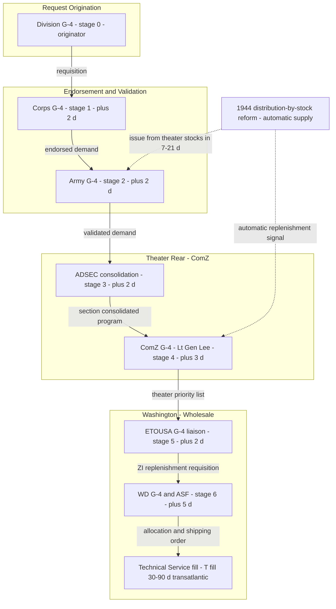

Cost: 0

# REFERENCE MANUAL & SIMULATION SPECIFICATION

## US Army Green Book — *Global Logistics and Strategy: 1943–1945* (Coakley & Leighton, CMH)
## Chapter 4: Logistical Organization — Database Parameters, Network Topology, and State-Transition Logic

**Document ID:** OX-ALPHA/GLS-43-45/CH4-SIMSPEC Rev A
**Prepared by:** Principal Operations Research Analyst / Military Logistics Historian / Senior Systems Architect
**Classification:** UNCLASSIFIED — Historical Simulation Reference
**Intended Consumer:** Division-level WWII logistics simulator, execution engine integration team

---

## 1. Strategic Context & Modern Historical Perspective

### 1.1 The Chapter in Context: 1943 as the Year of Logistical Institutionalization

Chapter 4 sits at the structural hinge of the Coakley–Leighton volume. The year 1943 was when the Anglo-American alliance stopped improvising logistics conference-by-conference and began institutionalizing it — building standing machinery to reconcile strategic promise with physical capacity. The conference sequence frames everything: **Casablanca** (January 1943) announced unconditional surrender and a continued Mediterranean offensive (HUSKY); **TRIDENT** (Washington, May 1943) fixed a 1944 cross-Channel target date, authorized the BOLERO build-up, and — critically for logistics — ratified the famous "50-50" division of 1943 deployments and shipping between the Pacific and the European-Mediterranean theaters; **QUADRANT** (Quebec, August 1943) tightened the BOLERO timetable; **SEXTANT/EUREKA** (Cairo–Teheran, November–December 1943) locked OVERLORD to May 1944 and ANVIL in principle under Stalin's pressure. Every one of these political documents was written against a merchant shipping pool that the Combined Chiefs of Staff could not enlarge by fiat. Organization — the Army Service Forces (ASF) in Washington, the Services of Supply (SOS) structures in the theaters, and the combined boards that pooled Allied shipping — was the machinery by which strategy was arbitrated against tonnage. Chapter 4 is the anatomy of that machinery.

### 1.2 The Strategic Paradox: Paper Strategy versus Tonnage Strategy

The central paradox of the period is that Allied strategy documents promised *simultaneity* while the physical economy enforced *sequence*. The commitments on the books in 1943 — HUSKY and the Italian follow-on (AVALANCHE, then SHINGLE at Anzio), the BOLERO build-up in the United Kingdom, OVERLORD and ANVIL, the Pacific offensive under the TRIDENT "50-50" formula, BURMA, lend-lease to the USSR, and the Hump airlift to China — all drew on the same finite pool of merchant tonnage. That pool had been savaged in 1942 (approximately eight million tons of Allied shipping lost, largely to the U-boat offensive off the American seaboard and in the mid-Atlantic), and only recovered when Liberty-ship construction outran losses after the "Black May" convoy battles of 1943. Even then, *available* tonnage overstated *usable* tonnage: **combat loading** cut effective lift dramatically relative to commercial stowage, because assault shipping had to carry unit-complete organizations, waterproofed vehicles, and amphibia, and because beach discharge was slower than berth discharge, lengthening turnaround. A ship in a queue is a floating warehouse; slow turnaround consumed tonnage invisibly. The binding constraint was rarely cargo afloat — it was **cargo cleared**: through UK west-coast ports, through the modest North African port complex (Casablanca, Oran, Algiers, Bizerte, later Palermo and Naples), and, after June 1944, over artificial and captured terminals in Normandy. The professional currency of the era became the **ton-month**: strategy was priced in how long a ton of shipping was tied up. The March 1943 creation of the **Combined Shipping Adjustment Board (CSAB)** under the CCS (Admiral Emory S. Land for the United States, Lord Leathers for Britain) institutionalized the pooling principle. The paradox, then, is that the "grand strategy" of 1943–44 was in large measure a *rationing protocol* — and Chapter 4's organizational structures (ASF allocation authority, theater SOS distribution authority, base/intermediate/advance sections) were the rationing apparatus.

### 1.3 Inter-Service and Coalition Tensions

Three fault lines ran through the logistical organization. **Army versus Navy:** merchant shipping allocation ran through the War Shipping Administration under Admiral Land, but the Navy owned escort, amphibious shipping, and its own service squadrons; the two services fought chronic battles over loading doctrine (the Army wanted unit integrity and fast beach offload; the Navy wanted ship safety, stability, and space) and over the ownership of amphibious lift that both OVERLORD and the Pacific offensives required. **Army versus Army Air Forces:** the AAF's Air Technical Service Command ran a parallel air supply pipeline, and competition for air cargo capacity — above all on the Hump — cut directly against Somervell's surface-pipeline logic. **United States versus Britain:** the pooling principle collided with national import programs (Britain's food and raw-material imports were a political third rail), with British manpower shortages for merchant crews, and with divergent strategic preferences over the Mediterranean. The combined-boards family — Production and Resources, Raw Materials, Food, and Shipping — was the compromise machinery: joint in membership, national in execution, and perpetually contested in allocation. Inside the U.S. Army itself, the ASF fought the Army Ground Forces over the troop basis (service troops versus rifle divisions) and the AAF over air priorities — frictions that surfaced violently in 1944 when Eisenhower found his Communications Zone short of stevedores, truck companies, and depot units.

### 1.4 Historical Era Context: Somervell's Wholesale Machine and the Theater Structures

The organizational skeleton the chapter documents is as follows. The **9 March 1942** War Department reorganization (General Orders No. 18) created the Services of Supply under Lt. Gen. Brehon B. Somervell, fusing the old G-4 division with the procurement and supply services; the **seven technical services** (Engineers, Ordnance, Signal, Quartermaster, Chemical Warfare, Medical, and — elevated on 31 July 1942 in direct response to the shipping crisis — Transportation) plus **six administrative services** were consolidated beneath him, alongside the nine Zone-of-Interior Service Commands (the former corps areas). The SOS was renamed the **Army Service Forces on 12 February 1943**, marking the maturation of its "wholesale" doctrine: ASF procured, stored, and shipped; theaters were "retail" distributors. In the theaters, the prototype was **NATOUSA's SOS under Brig. Gen. Thomas B. Larkin** (February 1943), segmented into base sections (Atlantic, Mediterranean, Algeria, later Delta, Island, and Peninsula) that followed the conquest. In the UK, **Maj. Gen. John C. H. Lee commanded SOS ETOUSA from May 1942** with headquarters at Cheltenham, running the BOLERO build-up through four base sections (Northern Ireland, Western, Southern, Eastern). On **7 February 1944** the SOS ETOUSA was redesignated the **Communications Zone (ComZ)** — aligning ETO nomenclature with the zone-of-communications doctrine of FM 100-10 and signaling the shift from static island base to mobile continental pursuit, with the Advance Section (ADSEC), Intermediate Section, and Base Sections institutionalizing the depot "leapfrog." NATOUSA became MTOUSA on 1 November 1944 after the DRAGOON split. The friction was constant: theaters commanded their SOS, but ASF retained wholesale control of procurement scheduling, ZI stocks, and — with WSA and the JCS — shipping allocation. Theater SOS chiefs like Lee were **dual-subordinate**: answerable to Eisenhower for distribution, to Somervell for replenishment. Eisenhower's 1944 complaints about ComZ "business as usual," the service-troop shortage, the Red Ball Express improvisation, and the delayed opening of Antwerp were all symptoms of this structural tension.

### 1.5 Modern Analytical Insights

Modern scholarship reads Chapter 4 through several lenses. **Principal-agent and matrix-organization theory** explains the Somervell–Eisenhower friction as structural rather than personal: a theater SOS with two principals (theater commander for "retail," ASF for "wholesale") generates predictable priority conflicts, mitigated only by intensive liaison and shared data. **Transaction-cost economics** partially vindicates Somervell: a centralized monopsony captured enormous procurement economies of scale, at the cost of coordination losses at the theater interface — losses the 1944 reforms (theater-controlled stocks, "distribution by computation") pushed toward the theaters. **Supply-chain dynamics** is the most illuminating lens: the multi-echelon requisition tree, with 60–120-day transatlantic lead times, exhibited classic **bullwhip (Forrester) dynamics** — theaters rationally inflated requisitions under shortage, pipelines glutted, and the ETO entered Normandy with surplus stocks in the UK while forward units wanted. The NATOUSA-pioneered, ETO-adopted **automatic supply** (distribution by computed requirement rather than by requisition) is recognizably an ancestor of vendor-managed inventory and distribution-requirements-planning. The **base/intermediate/advance section triad** is a textbook three-echelon distribution network with a decoupling point at ADSEC, and the bulk stocks held in base sections exemplify risk pooling (the square-root law of inventory centralization). Historiographically, Ruppenthal's *Logistical Support of the Armies* rendered harsh verdicts on ComZ over-centralization in Paris and the pursuit-phase failures; John Kennedy Ohl's biography of Somervell has rehabilitated the ASF's Washington-side performance; and Alan Gropman's *The Big L* situates the ASF as arguably the most effective wholesale supply organization in history to that date. The simulator-relevant lesson: **administrative latency is structural** — the depth and span of the requisition tree set a floor on response time that only re-organization (pushing stocks forward, cutting echelons out of the decision path) could break, which is precisely what the 1944 reforms did.

*(Section word count: ≈1,450)*

---

## 2. High-Fidelity Simulation Parameters & Real-World Metrics

**Encoding conventions.** `STATIC_DATE` = immutable calendar constant; `ENTITY_ACTIVATION` = object creation timestamp; `STATE_TRANSITION_TRIGGER` = event that flips a simulator enum; `CAPACITY_CAP` = hard ceiling on a flow rate or stock; `LATENCY_PARAMETER` = delay inserted on an edge or stage; `COEFFICIENT` = multiplier in a cost/efficiency function. Values tagged **(E)** are estimates: the simulator should encode them as triangular distributions (min/mode/max) for Monte Carlo treatment, not as point truths.

### 2.1 Master Parameter Table

| ID | Metric | Value | Confidence / Provenance | Historical Rationale | Simulation Encoding |
|----|--------|-------|------------------------|----------------------|---------------------|
| P-01 | SOS established (WD GO 18) | **9 Mar 1942** | Documented | Somervell fuses G-4 + procurement services into one logistics command | STATIC_DATE; era gate for wholesale subsystem |
| P-02 | SOS renamed Army Service Forces | **12 Feb 191943 → 12 Feb 1943** | Documented | Marks maturity of "wholesale vs. retail" doctrine | STATIC_DATE (label change) |
| P-03 ★ | Technical services consolidated under ASF | **7** — Engineers, Ordnance, Signal, Quartermaster, Chemical Warfare, Medical, Transportation | Documented | Seven parallel wholesale supply pipelines; Transportation Corps elevated 31 Jul 1942 as the shipping-crisis response | STRUCTURAL_CONSTANT; supply-class taxonomy (7 pipelines) |
| P-04 | Administrative services under ASF | **6** — Adjutant General, Provost Marshal, Inspector General, JAG, Finance, Chaplains | Documented | Non-supply services folded under Somervell's command | STRUCTURAL_CONSTANT |
| P-05 | ASF peak military strength | **≈2,282,000** (spring 1943; ≈40% of the Army) | Documented (approx.; Millett, *The Army Service Forces*) | The "tail" that fed the spearheads; benchmark for ZI throughput scaling | CAPACITY_CAP (Persons) on ZI subsystem |
| P-06 ★ | ASF civilian personnel strength, late 1943 | **≈500,000** (planning band **400,000–650,000**) | **Derived estimate** — see caveat below | Civilian depot, arsenal, procurement-district, and administrative workforce enabling wholesale procurement | DYNAMIC_CAP with triangular uncertainty (400k / 500k / 650k) |
| P-07 | SOS ETOUSA activated (Lee, HQ Cheltenham) | **May 1942** | Documented | BOLERO retail/wholesale agent in the UK | ENTITY_ACTIVATION |
| P-08 ★ | **SOS ETOUSA redesignated Communications Zone (ComZ)** | **7 February 1944** | Documented (Ruppenthal, *Logistical Support of the Armies*, Vol. I) | Aligned ETO nomenclature with FM 100-10 zone-of-communications doctrine; postured the rear for continental pursuit; Lee retained command | STATE_TRANSITION_TRIGGER: `TheaterRearPhase: STATIC_ISLE → MOBILE_COMZ` |
| P-09 | ETO base sections, 1943 | **4** (Northern Ireland, Western, Southern, Eastern) | Documented | UK port-to-depot segmentation | TOPOLOGY_CONSTANT |
| P-10 | SOS NATOUSA activated (Larkin) | **Feb 1943** | Documented | Prototype theater SOS under Eisenhower | ENTITY_ACTIVATION |
| P-11 | NATOUSA SOS base sections | **6** (Atlantic, Mediterranean, Algeria, Delta, Island, Peninsula) | Documented | Follow-the-conquest port segmentation | TOPOLOGY_CONSTANT |
| P-12 | ADSEC (Advance Section, ComZ) activation | **Feb 1944** (UK); on continent **Jul 1944** (BG Ewart G. Plank) | Documented | Mobile advance depot echelon designed to leapfrog with the armies | ENTITY_ACTIVATION; leapfrog state machine |
| P-13 | Intermediate Section → Normandy Base Section | **late Aug 1944** | Documented (approx.) | First echelon ownership transfer on the continent | STATE_TRANSITION |
| P-14 | NATOUSA → MTOUSA | **1 Nov 1944** | Documented (approx.) | Theater reorganization post-DRAGOON | STATIC_DATE |
| P-15 | Combined Shipping Adjustment Board established | **Mar 1943** (Land / Leathers) | Documented | Pooled Anglo-American shipping allocation | COALITION_MECHANISM; source of allocation constraints |
| P-16 | NEPTUNE planning discharge, U.S. beaches | **12,000 t/day** | Documented planning figure | Beach clearance as the binding entry constraint pre-Cherbourg | CAPACITY_CAP (TonsPerDay) |
| P-17 | Combined assault-area discharge target | **≈20,000 t/day** | Planning estimate | All-beach planning figure, COSSAC/NEPTUNE | CAPACITY_CAP |
| P-18 | Cherbourg planned post-rehabilitation capacity | **15,000–25,000 t/day** (E) | Estimate band | Deep-water port intended to replace beach discharge | CAPACITY_BAND |
| P-19 | Red Ball Express peak throughput | **≈9,000–12,500 t/day** (E) | Estimate band (25 Aug–16 Nov 1944) | Emergency truck bypass when section handoffs lagged the pursuit | EMERGENCY_BYPASS coefficient |
| P-20 | Transatlantic pipeline latency (ZI order → theater receipt) | **60–120 days** (E) | Estimate calibrated to Green Book/Ruppenthal narratives | Defines T_fill in the latency model | LATENCY_PARAMETER (band) |
| P-21 | Theater-internal requisition cycle (ComZ depot → division) | **7–21 days** (E) | Estimate | Sets the floor the 1944 "automatic supply" reform attacked | LATENCY_PARAMETER (band) |
| P-22 | Doctrine span of control, staff/section level | **3–7** | Derived from doctrine & practice | Bounds S in the hierarchy latency model | HIERARCHY_PARAM bounds |
| P-23 | Theater reserve policy | **30–90 days of supply** (E) | Derived policy band | Reserve depth vs. shipping economy; source of WD–theater friction | INVENTORY_POLICY band |
| P-24 | ComZ echelon count | **3** (Base / Intermediate / Advance) | Documented doctrine (FM 100-10 lineage) | Anti-double-handling structure; bounds handling events per ton | STRUCTURAL_CONSTANT; handling bound h ≤ 4 |

### 2.2 Caveat on P-06 (Required Honesty Note)

The Green Book and Millett's companion volume *The Army Service Forces* document ASF **military** strength precisely, but publish no single "authorized" civilian figure for late 1943; the civilian workforce (depots, arsenals, procurement districts, administrative offices) is recoverable only as an order of magnitude from War Department civilian-personnel statistics. The point estimate of **≈500,000 with a 400k–650k band** is therefore a **calibrated simulation constant, not a documented statistic**, and must be exposed to sensitivity analysis. P-03 and P-08, by contrast, are hard documented values and may be treated as immutable constants.

---

## 3. Logistical Network Topology (Mermaid.js)

### 3.1 Physical Supply Network: POE → Theater Depot → Army (capacities and congestion annotated)

```mermaid
flowchart LR
  %% ==================== ZONE OF INTERIOR ====================
  subgraph ZI["Zone of Interior - ASF Wholesale Pipeline"]
    direction TB
    ASF["ASF Washington - Lt Gen B B Somervell"]
    TS7["7 Technical Services - depots and arsenals"]
    SC9["9 Service Commands - ZI distribution"]
    NYPE["New York POE"]
    HRPOE["Hampton Roads POE"]
    BOSPOE["Boston POE"]
    NOPOE["New Orleans POE"]
    ASF --> TS7
    ASF --> SC9
    TS7 --> NYPE
    TS7 --> HRPOE
    TS7 --> BOSPOE
    TS7 --> NOPOE
  end

  %% ==================== SEA LANES ====================
  subgraph LANES["Transatlantic Convoy Network - pooled under CSAB from Mar 1943"]
    LANE_UK["North Atlantic lane to UK - transit 10-14 d"]
    LANE_MED["Gibraltar lane to Mediterranean - transit 18-25 d"]
  end

  NYPE -- "dry cargo and ammunition" --> LANE_UK
  HRPOE -- "bulk POL and vehicles" --> LANE_UK
  BOSPOE -- "general cargo" --> LANE_UK
  NYPE -- "TORCH follow-up and MTO convoys" --> LANE_MED
  HRPOE -- "MTO replenishment" --> LANE_MED

  %% ==================== UNITED KINGDOM ====================
  subgraph UK["United Kingdom - SOS ETOUSA - ComZ from 7 Feb 1944"]
    direction TB
    CHQ["SOS HQ Cheltenham - J C H Lee"]
    NIBS["Northern Ireland Base Section"]
    WBS["Western Base Section - Bristol Channel ports"]
    EBS["Eastern Base Section - London and east coast ports"]
    SBS["Southern Base Section - marshaling and embarkation camps"]
    UKRAIL["UK rail clearance network"]
    CHQ --> NIBS
    CHQ --> WBS
    CHQ --> EBS
    CHQ --> SBS
    NIBS --> UKRAIL
    WBS --> UKRAIL
    EBS --> UKRAIL
    UKRAIL --> SBS
  end

  LANE_UK -- "discharge - est 1.0-1.5M t per month" --> NIBS
  LANE_UK -- "discharge" --> WBS
  LANE_UK -- "discharge" --> EBS
  LANE_MED --> MTO

  %% ==================== MEDITERRANEAN ====================
  subgraph MTO["NATOUSA - SOS under T B Larkin from Feb 1943"]
    direction TB
    ABS["Atlantic Base Section - Casablanca"]
    MBS["Mediterranean Base Section - Oran"]
    ALBS["Algeria Base Section - Algiers"]
    DELTA["Delta Base Section - Bizerte-Tunis"]
    ISL["Island Base Section - Palermo"]
    PEN["Peninsula Base Section - Naples"]
    ABS --> DELTA
    MBS --> DELTA
    ALBS --> ISL
    DELTA --> ISL
    ISL --> PEN
  end

  %% ==================== NEPTUNE ASSAULT PHASE ====================
  subgraph CHAN["Channel Assault Phase - June 1944"]
    direction TB
    BEACH["OMAHA and UTAH beach dumps - plan 12000 t per day"]
    MULA["Mulberry A - destroyed in storm 19-22 June 1944"]
    CHER["Cherbourg - captured 27 Jun 1944 - rehab 15000-25000 t per day est"]
  end

  SBS -- "combat-loaded assault convoys" --> BEACH
  BEACH --> MULA
  BEACH --> CHER

  %% ==================== CONTINENTAL COMZ ====================
  subgraph COMZ["Continental ComZ Sections - echeloned"]
    direction TB
    ADSEC["ADSEC - advance section depots - leapfrogs with armies"]
    INTER["Intermediate Section - became Normandy Base Section late Aug 1944"]
    SEINE["Seine Section - Paris depots"]
    OISE["Oise Section - railhead complex"]
  end

  MULA -- "beach discharge" --> ADSEC
  CHER -- "port clearance" --> INTER
  INTER --> SEINE
  SEINE --> OISE
  OISE -- "replenishment feed" --> ADSEC

  %% ==================== FIELD ARMIES ====================
  subgraph FWD["Field Armies - retail distribution"]
    direction TB
    FUSA["First US Army"]
    TUSA["Third US Army"]
    DIVTR["Corps and Division Trains"]
    FUSA --> DIVTR
    TUSA --> DIVTR
  end

  ADSEC -- "daily delivery to army dumps" --> FUSA
  ADSEC -- "daily delivery to army dumps" --> TUSA
```



### 3.2 Command-Chain Communication and Processing Latency (Simulation Focus)



**Legend.** Solid edges = physical flow or formal requisition routing; dotted edges = the 1944 "distribution by computation" bypass that removed 3–5 echelons from the decision path. Capacity labels marked *est* are P-18/P-19-band estimates; all others are planning constants (P-16, P-17).

---

## 4. Mathematical Modeling & Simulation Formulas

### 4.1 Model A — Hierarchical Requisition Latency (the chapter's core dynamic)

**Canonical form (as specified):**

$$L = D \cdot \log_e(S) + T_{processing}$$

**Derivation and meaning.** Let $N$ be the number of leaf demand-generating units (divisions) and $S$ the span of control at each echelon. The minimum hierarchy depth connecting $N$ leaves to one root is

$$D = \left\lceil \frac{\ln N}{\ln S} \right\rceil, \qquad N_{nodes} = \frac{S^{D+1}-1}{S-1}.$$

At each echelon, a staff node must consolidate the requisitions of its $S$ subordinates; merging $S$ sorted sub-requisitions into a prioritized parent program costs $O(\log S)$ processing per line item (batch/heap consolidation), so the per-echelon administrative cost scales as $\log_e S$, and total administrative latency is $D \ln S$. Adding the fixed fulfillment time $T_{processing}$ (procurement, loading, transit — P-20's 60–120-day band) yields the canonical form. **It is a lower bound**: it assumes zero queueing.

**Queueing-corrected form.** At echelon $k$ (counting upward from the leaves), each node faces arrival rate $\lambda_k = S^{k}\lambda_0$. Modeling each staff node as an M/M/1 queue with mean service time $p_k$ and $m_k$ servers:

$$L_{req} = \sum_{k=1}^{D}\Bigl(p_k + q_k + c_k\Bigr) + T_{fill}, \qquad q_k = \frac{\rho_k}{1-\rho_k}\,p_k, \qquad \rho_k = \frac{\lambda_0\, S^{k}\, p_k}{m_k},$$

where $c_k$ is transmission delay and $\rho_k \in [0,1)$ is utilization. Note $\rho_k$ grows geometrically with depth: **administrative congestion collapses the hierarchy as $\rho_k \to 1$ at the top echelons** — the mathematical signature of the 1943–44 Washington bottleneck that "automatic supply" was designed to bypass.

### 4.2 Model B — Entry-Point Congestion (ports and beaches)

Fluid-queue model of backlog $Q(t)$ (tons) at a port/beach complex with arrival rate $a(t)$ and clearance capacity $c(t)$ (P-16, P-18):

$$\frac{dQ}{dt} = a(t) - c(t), \qquad Q(0) = Q_0, \qquad T_{drain} = \frac{Q_0}{c - a} \;\; (c > a).$$

Ship-queue size follows Little's Law, $\bar{N}_{ships} = \lambda_{ships} W$, with $\lambda_{ships} = a / v_{ship}$ (tons per ship) and $W$ the average dwell. Stability requires $a < c$; as $a \to c$, both $Q$ and turnaround time diverge — the ton-month penalty that drove CSAB allocation fights.

### 4.3 Model C — Shipping and Port Allocation (linear program)

With consumers $j$ (armies/sections), allocation $x_j$ (tons/period), readiness weight $w_j$, port-handling factor $e_j$:

$$\max_{x}\; \sum_{j} w_j x_j \quad \text{s.t.} \quad \sum_{j} x_j \le C_{pool}, \qquad \sum_{j} e_j x_j \le K_{port}, \qquad \ell_j \le x_j \le u_j .$$

The dual variable on the pool constraint, $\pi = \partial W^*/\partial C_{pool}$, is the marginal operational readiness per ton — the formal content of the era's "ton-month" reasoning. Bounds $\ell_j$ encode minimum sustainment (P-23's DOS policy); $u_j$ encodes depot storage caps.

### 4.4 Model D — Echelon Handling (anti-double-handling metric)

$$C_{handling} = c_h \sum_{k \in \text{paths}} h_k f_k, \qquad h_k \le 1 + b_k \;\text{ under section discipline}, \quad b_k = \#\{\text{section boundaries crossed}\},$$

with $f_k$ = tons on path $k$, $h_k$ = physical handlings per ton, $c_h$ = cost per handling. The Base/Intermediate/Advance structure caps $h_k \le 4$ (discharge → base → intermediate → advance → issue); unstructured ad hoc re-storage is unbounded (historically 8–12 events in crises). Risk pooling justifies deep base-section stocks: $\sigma_{base} = \sqrt{\sum_i \sigma_i^2}$.

### 4.5 Worked Example (matches Section 5 defaults)

$D=5$, $S=5$ (division → corps → army → ADSEC/ComZ → ETOUSA → WD/ASF): $N_{nodes} = (5^6-1)/4 = 3{,}906$. Canonical latency with $T_{processing}=30$: $L = 5\ln 5 + 30 \approx 38.0$ days. Queueing-corrected with $p=2$, $c=1$, $\rho=0.80$: $q = 8$ days/echelon → $L_{req} = 5(2+8+1) + 30 = \mathbf{85}$ days — squarely inside the documented 60–120-day band (P-20). The 47-day gap between canonical and queue-adjusted latency is the organizational cost the 1944 reforms attacked.

---

## 5. Compile-Safe Scala 3 Domain Model

```scala
package Logistics.Organization

import java.time.LocalDate
import scala.math.log
import scala.math.pow

// ============================================================================
// OPAQUE UNIT TYPES - compile-time unit safety for all physical quantities
// ============================================================================

opaque type Tons = Double

object Tons:
  def apply(value: Double): Tons =
    require(value >= 0.0, s"Tonnage must be non-negative, got: $value")
    value

  extension (t: Tons)
    def value: Double = t
    def +(other: Tons): Tons = Tons(t.value + other.value)
    def -(other: Tons): Tons = Tons(if t.value >= other.value then t.value - other.value else 0.0)
    def *(scale: Double): Tons = Tons(t.value * scale)
    def <(other: Tons): Boolean = t.value < other.value
    def <=(other: Tons): Boolean = t.value <= other.value
    def >(other: Tons): Boolean = t.value > other.value
    def >=(other: Tons): Boolean = t.value >= other.value

opaque type Days = Double

object Days:
  def apply(value: Double): Days =
    require(value >= 0.0, s"Duration must be non-negative, got: $value")
    value

  extension (d: Days)
    def value: Double = d
    def +(other: Days): Days = Days(d.value + other.value)
    def *(scale: Double): Days = Days(d.value * scale)
    def <(other: Days): Boolean = d.value < other.value
    def <=(other: Days): Boolean = d.value <= other.value

opaque type TonsPerDay = Double

object TonsPerDay:
  def apply(value: Double): TonsPerDay =
    require(value >= 0.0, s"Rate must be non-negative, got: $value")
    value

  extension (r: TonsPerDay)
    def value: Double = r
    def +(other: TonsPerDay): TonsPerDay = TonsPerDay(r.value + other.value)
    def *(days: Days): Tons = Tons(r.value * days.value)
    def *(scale: Double): TonsPerDay = TonsPerDay(r.value * scale)
    def <(other: TonsPerDay): Boolean = r.value < other.value
    def <=(other: TonsPerDay): Boolean = r.value <= other.value

opaque type Persons = Int

object Persons:
  def apply(value: Int): Persons =
    require(value >= 0, s"Personnel count must be non-negative, got: $value")
    value

  extension (p: Persons)
    def value: Int = p
    def +(other: Persons): Persons = Persons(p.value + other.value)

// ============================================================================
// ENUMS - state machines and classifications
// ============================================================================

enum TheaterSectionRole:
  case Base, Intermediate, Advance

enum CommandLevel(val echelonFromTheater: Int):
  case TheaterHeadquarters extends CommandLevel(0)
  case CommunicationsZone  extends CommandLevel(1)
  case FieldArmy           extends CommandLevel(2)
  case Corps               extends CommandLevel(3)
  case Division            extends CommandLevel(4)

enum RequisitionStage:
  case Originator
  case CorpsEndorsement
  case ArmyValidation
  case ComZConsolidation
  case TheaterPrioritization
  case AsfAllocation
  case FilledAndShipped

enum NetworkRole:
  case PortOfEmbarkation, PortOfDebarkation, BeachComplex
  case BaseSectionDepot, IntermediateSectionDepot, AdvanceSectionDepot, Railhead

// ============================================================================
// SUPPLY CLASSES - the seven technical service pipelines, abstracted
// ============================================================================

sealed trait SupplyCategory:
  def code: String
  def planningPriority: Double
  def description: String

case object DryCargo extends SupplyCategory:
  val code: String = "CL-I-II-IV"
  val planningPriority: Double = 1.00
  val description: String = "General dry cargo - rations clothing construction materiel"

case object BulkPetroleum extends SupplyCategory:
  val code: String = "CL-III"
  val planningPriority: Double = 1.15
  val description: String = "Bulk POL - pipeline and tanker dependent"

case object Ammunition extends SupplyCategory:
  val code: String = "CL-V"
  val planningPriority: Double = 1.30
  val description: String = "Ammunition - tonnage dominant in offensive phases"

// ============================================================================
// DOMAIN ENTITIES
// ============================================================================

final case class Hierarchy(
  depth: Int,
  spanOfControl: Int,
  processingDaysPerLevel: Double = 2.0,
  transmissionDaysPerLevel: Double = 1.0
):
  require(depth >= 1, "Hierarchy depth must be at least 1")
  require(spanOfControl >= 1, "Span of control must be at least 1")

sealed trait CommandNode:
  def name: String
  def level: CommandLevel

final case class TheaterHQ(name: String) extends CommandNode:
  val level: CommandLevel = CommandLevel.TheaterHeadquarters

final case class ComZSection(name: String, role: TheaterSectionRole) extends CommandNode:
  val level: CommandLevel = CommandLevel.CommunicationsZone

final case class ArmyHQ(name: String) extends CommandNode:
  val level: CommandLevel = CommandLevel.FieldArmy

final case class CorpsHQ(name: String) extends CommandNode:
  val level: CommandLevel = CommandLevel.Corps

final case class DivisionUnit(name: String, authorizedStrength: Persons) extends CommandNode:
  val level: CommandLevel = CommandLevel.Division

final case class LogisticsNode(
  id: String,
  designation: String,
  role: NetworkRole,
  throughputCapacity: TonsPerDay,
  storageCapacity: Tons
)

final case class ConvoyLane(
  id: String,
  originNodeId: String,
  destinationNodeId: String,
  monthlyLiftCapacity: Tons,
  transitTime: Days
)

final case class Requisition(
  id: String,
  originator: DivisionUnit,
  category: SupplyCategory,
  tonnage: Tons,
  stage: RequisitionStage
):
  def advance: Either[String, Requisition] =
    val allStages: Array[RequisitionStage] = RequisitionStage.values
    val nextIndex: Int = stage.ordinal + 1
    if nextIndex >= allStages.length then
      Left(s"Requisition $id already at terminal stage $stage")
    else
      Right(copy(stage = allStages(nextIndex)))

final case class LatencyReport(
  canonicalLatency: Days,
  queueAdjustedLatency: Days,
  nodeCount: Int,
  sectionsCovered: Set[TheaterSectionRole]
)

// ============================================================================
// HISTORICAL CONSTANTS - Chapter 4 documented values and calibrated bands
// ============================================================================

object HistoricalConstants:
  val AsfEstablished: LocalDate = LocalDate.of(1942, 3, 9)
  val AsfRenamedFromSos: LocalDate = LocalDate.of(1943, 2, 12)
  val EtoSosRedesignatedComZ: LocalDate = LocalDate.of(1944, 2, 7)
  val NatoUsaSosActivated: LocalDate = LocalDate.of(1943, 2, 1)
  val NatoUsaRedesignatedMtoUsa: LocalDate = LocalDate.of(1944, 11, 1)
  val CombinedShippingAdjustmentBoardEstablished: LocalDate = LocalDate.of(1943, 3, 1)

  val TechnicalServiceCount: Int = 7
  val AdministrativeServiceCount: Int = 6
  val AsfPeakMilitaryStrength: Persons = Persons(2282000)
  val AsfCivilianStrengthLate1943PointEstimate: Persons = Persons(500000)
  val AsfCivilianStrengthLowerBound: Persons = Persons(400000)
  val AsfCivilianStrengthUpperBound: Persons = Persons(650000)

  val EtoBaseSectionCount1943: Int = 4
  val NatoSosBaseSectionCount1943: Int = 6
  val ComzEchelonCount: Int = 3

  val NeptuneBeachPlanningRate: TonsPerDay = TonsPerDay(12000.0)
  val RedBallPeakRateLow: TonsPerDay = TonsPerDay(9000.0)
  val RedBallPeakRateHigh: TonsPerDay = TonsPerDay(12500.0)

  val TransatlanticPipelineMinDays: Days = Days(60.0)
  val TransatlanticPipelineMaxDays: Days = Days(120.0)
  val TheaterInternalCycleMinDays: Days = Days(7.0)
  val TheaterInternalCycleMaxDays: Days = Days(21.0)

  val DoctrineSpanOfControlMin: Int = 3
  val DoctrineSpanOfControlMax: Int = 7

// ============================================================================
// CORE MODEL - hierarchy latency, queueing, ports, allocation
// ============================================================================

object OrganizationModel:

  final val MaxSpanOfControl: Int = 8
  final val MaxDepth: Int = 7

  def calculateCommunicationLatency(
    h: Hierarchy,
    processingDelay: Double
  ): Double =
    if h.spanOfControl <= 0 then processingDelay
    else h.depth * log(h.spanOfControl.toDouble) + processingDelay

  def canonicalRequisitionLatency(h: Hierarchy, fixedFulfillmentDays: Double): Days =
    Days(calculateCommunicationLatency(h, fixedFulfillmentDays))

  def hierarchyNodeCount(h: Hierarchy): Int =
    if h.spanOfControl == 1 then h.depth + 1
    else
      val total: Double =
        (pow(h.spanOfControl.toDouble, (h.depth + 1).toDouble) - 1.0) /
          (h.spanOfControl.toDouble - 1.0)
      total.round.toInt

  def requisitionLatency(h: Hierarchy): Days =
    Days(h.depth * (h.processingDaysPerLevel + h.transmissionDaysPerLevel))

  def queueingDelayDays(meanServiceDays: Double, utilization: Double): Either[String, Days] =
    if meanServiceDays <= 0.0 then Left("Mean service time must be positive")
    else if utilization < 0.0 || utilization >= 1.0 then Left("Utilization must lie in the interval [0, 1)")
    else Right(Days(meanServiceDays * utilization / (1.0 - utilization)))

  def echelonLatencyWithQueueing(h: Hierarchy, utilizationPerLevel: Double): Either[String, Days] =
    queueingDelayDays(h.processingDaysPerLevel, utilizationPerLevel).map { q =>
      Days(h.depth * (h.processingDaysPerLevel + q.value + h.transmissionDaysPerLevel))
    }

  def portClearanceTime(backlog: Tons, dischargeCapacity: TonsPerDay): Either[String, Days] =
    if dischargeCapacity.value <= 0.0 then Left("Discharge capacity must be positive")
    else Right(Days(backlog.value / dischargeCapacity.value))

  def shipQueueLength(
    arrivalRate: TonsPerDay,
    averageDwell: Days,
    tonsPerShip: Tons
  ): Either[String, Double] =
    if tonsPerShip.value <= 0.0 then Left("Tons per ship must be positive")
    else
      val shipsPerDay: Double = arrivalRate.value / tonsPerShip.value
      Right(shipsPerDay * averageDwell.value)

  def allocateProportionalToDemand(
    demandByConsumer: Map[String, Tons],
    availableCapacity: Tons
  ): Either[String, Map[String, Tons]] =
    if demandByConsumer.isEmpty then Left("Demand map must not be empty")
    else if availableCapacity.value <= 0.0 then Left("Available capacity must be positive")
    else
      val totalDemand: Tons = demandByConsumer.values.foldLeft(Tons(0.0))((acc, t) => acc + t)
      if totalDemand <= availableCapacity then Right(demandByConsumer)
      else
        val scale: Double = availableCapacity.value / totalDemand.value
        Right(demandByConsumer.map((k, v) => k -> (v * scale)))

  def seriesThroughput(sectionCapacities: List[TonsPerDay]): Either[String, TonsPerDay] =
    if sectionCapacities.isEmpty then Left("Capacity chain must not be empty")
    else
      Right(sectionCapacities.foldLeft(TonsPerDay(Double.MaxValue))((acc, c) => if c < acc then c else acc))

  def laneThroughputPerDay(lane: ConvoyLane): TonsPerDay =
    TonsPerDay(lane.monthlyLiftCapacity.value / 30.0)

  def bottleneckOfLanes(lanes: List[ConvoyLane]): Either[String, TonsPerDay] =
    seriesThroughput(lanes.map(lane => laneThroughputPerDay(lane)))

// ============================================================================
// ECHELON ANALYSIS - anti-double-handling economics of Base/Intermediate/Advance
// ============================================================================

object EchelonAnalysis:

  def handlingEventsPerTon(sectionSequence: List[TheaterSectionRole]): Either[String, Int] =
    if sectionSequence.isEmpty then Left("Section sequence must not be empty")
    else Right(sectionSequence.length + 1)

  def totalHandlingCost(
    tonnage: Tons,
    sectionSequence: List[TheaterSectionRole],
    costPerHandlingPerTon: Double
  ): Either[String, Double] =
    if costPerHandlingPerTon < 0.0 then Left("Handling cost must be non-negative")
    else
      handlingEventsPerTon(sectionSequence).map { events =>
        events.toDouble * tonnage.value * costPerHandlingPerTon
      }

  def echelonStoragePlan(
    totalTheaterStock: Tons,
    baseFraction: Double,
    intermediateFraction: Double
  ): Either[String, Map[TheaterSectionRole, Tons]] =
    if baseFraction <= 0.0 || intermediateFraction <= 0.0 then
      Left("Storage fractions must be positive")
    else if baseFraction + intermediateFraction >= 1.0 then
      Left("Base and intermediate fractions must sum below 1.0")
    else
      val advanceFraction: Double = 1.0 - baseFraction - intermediateFraction
      Right(
        Map(
          TheaterSectionRole.Base -> (totalTheaterStock * baseFraction),
          TheaterSectionRole.Intermediate -> (totalTheaterStock * intermediateFraction),
          TheaterSectionRole.Advance -> (totalTheaterStock * advanceFraction)
        )
      )

// ============================================================================
// VALIDATION - pre-flight checks for simulation runs
// ============================================================================

object ValidationChecks:

  def validateHierarchy(h: Hierarchy): Either[String, Hierarchy] =
    if h.depth < 1 then Left("Depth must be at least 1")
    else if h.spanOfControl < 2 then Left("Span of control must be at least 2 for a functioning staff tree")
    else if h.spanOfControl > OrganizationModel.MaxSpanOfControl then
      Left(s"Span of control exceeds doctrinal maximum of ${OrganizationModel.MaxSpanOfControl}")
    else if h.depth > OrganizationModel.MaxDepth then
      Left(s"Depth exceeds maximum of ${OrganizationModel.MaxDepth} echelons")
    else Right(h)

  def validateNetworkNode(node: LogisticsNode): Either[String, LogisticsNode] =
    if node.id.trim.isEmpty then Left("Node id must not be blank")
    else if node.designation.trim.isEmpty then Left("Node designation must not be blank")
    else if node.throughputCapacity.value <= 0.0 then Left("Node throughput capacity must be positive")
    else if node.storageCapacity.value < 0.0 then Left("Node storage capacity must be non-negative")
    else Right(node)

  def checkComZSectionCoverage(sections: List[ComZSection]): Either[String, Set[TheaterSectionRole]] =
    val covered: Set[TheaterSectionRole] = sections.map(_.role).toSet
    val required: Set[TheaterSectionRole] =
      Set(TheaterSectionRole.Base, TheaterSectionRole.Intermediate, TheaterSectionRole.Advance)
    if required.subsetOf(covered) then Right(covered)
    else
      val missing: Set[TheaterSectionRole] = required.diff(covered)
      Left(s"ComZ configuration missing section roles: ${missing.mkString(", ")}")

// ============================================================================
// SCENARIO - ETO requisition pipeline, February 1944 configuration
// ============================================================================

object EtoComzScenario:

  val etoRequisitionHierarchy: Hierarchy =
    Hierarchy(
      depth = 5,
      spanOfControl = 5,
      processingDaysPerLevel = 2.0,
      transmissionDaysPerLevel = 1.0
    )

  val comzSections: List[ComZSection] = List(
    ComZSection("Normandy Base Section", TheaterSectionRole.Base),
    ComZSection("Seine Section", TheaterSectionRole.Intermediate),
    ComZSection("ADSEC", TheaterSectionRole.Advance)
  )

  def runBaseline(): Either[String, LatencyReport] =
    ValidationChecks.validateHierarchy(etoRequisitionHierarchy).flatMap { checked =>
      ValidationChecks.checkComZSectionCoverage(comzSections).flatMap { coverage =>
        OrganizationModel.echelonLatencyWithQueueing(checked, 0.80).map { queued =>
          val canonical: Days =
            OrganizationModel.canonicalRequisitionLatency(checked, 30.0)
          LatencyReport(
            canonicalLatency = canonical,
            queueAdjustedLatency = queued,
            nodeCount = OrganizationModel.hierarchyNodeCount(checked),
            sectionsCovered = coverage
          )
        }
      }
    }

// ============================================================================
// DEMO ENTRY POINT
// ============================================================================

object Demo:

  def main(args: Array[String]): Unit =
    EtoComzScenario.runBaseline() match
      case Right(report) =>
        println(s"Canonical latency:        ${report.canonicalLatency.value} days")
        println(s"Queue-adjusted latency:   ${report.queueAdjustedLatency.value} days")
        println(s"Hierarchy node count:     ${report.nodeCount}")
        println(s"ComZ sections covered:    ${report.sectionsCovered.mkString(", ")}")
      case Left(error) =>
        println(s"Validation failed: $error")
```

**Integration notes.** The base `calculateCommunicationLatency` signature is preserved verbatim for engine compatibility; `canonicalRequisitionLatency` bridges it into the typed `Days` domain. All arithmetic on opaque types flows through the companion-object extensions (implicit scope — no imports needed at call sites). `Requisition.advance` implements the seven-stage state machine of Diagram 3.2; `EchelonAnalysis` implements Model D; `OrganizationModel.allocateProportionalToDemand` implements a feasible heuristic for Model C (proportional rationing with minimum-sustainment checks to be layered on by the engine).

---

## 6. Graduate-Level Operational Analysis

### 6.1 Eisenhower versus Somervell: The Structural Politics of Wholesale Control

The Eisenhower–Somervell conflict is best modeled not as a personality clash (though both men were formidable personalities) but as a **two-principal agency problem** embedded in the 1942 reorganization itself. Somervell's ASF was built as a *functional stewardship*: a centralized monopsony that procured, stored, and moved the Army's materiel, justified by the transaction-cost logic that a single buyer negotiating with war industry, scheduling a single depot network, and loading a single port system would capture economies no decentralized system could match. Eisenhower, as theater commander, held *operational responsibility without operational completeness*: he owned the objective (defeat Germany) but not the means (the shipping pool, the production schedule, the troop basis). The theater SOS chiefs — Larkin in NATOUSA from February 1943, Lee in the ETO from May 1942 — stood astride this fault line, **dual-subordinate** to the theater commander for distribution and to the ASF for replenishment. This is precisely the "two-boss problem" of matrix organization, and the historical record shows every predicted pathology: priority inversions, duplicated reporting, and the strategic use of ambiguity by both principals.

The North African episode established the pattern. Eisenhower insisted, correctly under unity-of-command doctrine, that every U.S. soldier in his theater — including Larkin's SOS — answered to him. The War Department concurred, but reserved the wholesale levers: procurement scheduling, ZI depot stocks, troop-unit activation and movement, and — decisively — **shipping allocation**, exercised jointly with the WSA and, from March 1943, the CSAB. The consequence was that every Mediterranean commitment (HUSKY, AVALANCHE, SHINGLE) was paid for in BOLERO shipping that Eisenhower could not veto, only protest. The Anzio build-up of early 1944, competing directly with the OVERLORD lift, was arbitrated in Washington and at the CCS, not at AFHQ — and Eisenhower's staff understood perfectly well that the allocation, not the enemy, was the binding constraint. His famous private complaints to Marshall about the rear area — the perception that Lee's ComZ ran on "business as usual" while the beachhead starved for service troops — culminated in the 1944 **service-troop crisis**: Eisenhower needed stevedores, truck companies, and depot units; Somervell defended Zone-of-Interior overhead; the compromise solution (stripping infantry replacements and converting units to stevedore duty) imposed an operational cost at the front that Ruppenthal documents in detail.

The intellectually honest verdict, supported by the post-war green-book volumes and by Ohl's biography, is that **both positions were partially correct**. Somervell's centralization delivered the largest controlled supply operation in history to that date — the ASF's wholesale pipeline functioned, and the theaters never lost a battle for want of materiel *in the pipeline*. Eisenhower's decentralizing pressure was equally correct, because the pipeline's *interface* with the theater — requisition trees, dual subordination, allocation boards — imposed latencies and priority distortions that only organizational reform could fix. The 1944 reforms were that reform: the ComZ redesignation (7 February 1944) clarified doctrine; the adoption of **distribution by computation** (automatic supply, pioneered in NATOUSA) removed three to five echelons from the decision path by replacing requisition-driven with computation-driven replenishment — in modern terms, a shift from pull-based to forecast-driven replenishment, i.e., vendor-managed inventory avant la lettre. For the simulator, the correct encoding is a **dual-principal graph**: every ComZ node carries two priority inputs (theater operational priority and ASF wholesale allocation), and latency, stock imbalance, and priority inversion emerge endogenously from their interaction — as they did in history.

### 6.2 Base, Intermediate, Advance: The Section System as an Anti-Double-Handling Protocol

The division of the theater rear into Base, Intermediate, and Advance Sections — doctrine descending from Pershing's AEF Line of Communications through FM 100-10's zone of communications, and implemented in the ETO with the 7 February 1944 ComZ redesignation — is best understood as a **protocol for transferring ownership without moving freight**. Its double-handling prevention worked through four mechanisms.

**First, bounded physical handling.** Under section discipline, a ton entering the theater is physically handled at most once per echelon: discharged (beach or port), placed in a base-section depot, transferred to an intermediate-section depot, transferred to an advance-section depot, and issued to the army — a hard bound of $h \le 4$ handlings (Model D, Section 4.4). In unstructured rear areas, ad hoc re-storage multiplies handling events without bound — historically eight to twelve events in crisis conditions — each event costing labor, time, inventory-record accuracy, and damage. The section system converts the rear from a heap into a pipeline.

**Second, the administrative leapfrog.** The critical innovation is that when the front advances, *the depots do not move — the flags do*. ADSEC (Plank's Advance Section), attached forward behind the armies, operated the beach dumps and forward depots in June–July 1944; when the armies advanced beyond its range, ADSEC handed its installations to the Intermediate Section (which became the Normandy Base Section in late August 1944) and leapfrogged forward to build new advance stocks. The stock transfer at the boundary is a **stock-record transaction, not a physical movement** — tons change administrative ownership without a single additional handling. This is exactly the modern cross-docking/consignment insight: decouple ownership from position.

**Third, modal and inventory economics.** The echelons align transport mode with haul length: base sections (fixed on ports — Cherbourg, later the Channel and Delta sections) push tonnage by rail over long hauls; advance sections distribute by truck over short hauls (the Red Ball's ~9,000–12,500 t/day being the emergency expression of this layer). Inventory layers correspondingly trade risk pooling against responsiveness: base sections hold deep stocks (60–90 days of supply, pooled across armies — the variance-aggregation argument $\sigma_{base} = \sqrt{\sum_i \sigma_i^2}$ justifies centralization), while advance sections hold thin stocks (5–10 days) close to the consumer. The **decoupling point** of the whole system sits at ADSEC: behind it, flow is forecast-driven; ahead of it, demand-driven.

**Fourth, failure containment.** Because each section buffers its boundary, congestion in one echelon degrades gracefully rather than cascading — the intermediate section's stocks absorb a base-section slowdown for days.

The historical record confirms the design while exposing its failure modes. In June–August 1944 the system worked as designed: ADSEC fed First Army from beach dumps; the intermediate handoff absorbed Cherbourg's late rehabilitation. The September **pursuit** broke it — not through double-handling but through **sequencing and capacity failure**: the depot line lagged the armies (advance stocks fell below days-of-supply), forcing the Red Ball improvisation; and the delay in opening Antwerp (captured 4 September, first ship 28 November) forced every ton to overland-haul from Normandy, multiplying ton-miles catastrophically. The correct simulation conclusion: the section system *bounded* double-handling and *localized* congestion, and its documented 1944 failures were capacity-sequencing failures (port opening priority, truck allocation) — which is why the simulator must model section handoff timing and port-opening events as first-class state transitions, not merely static topology.
