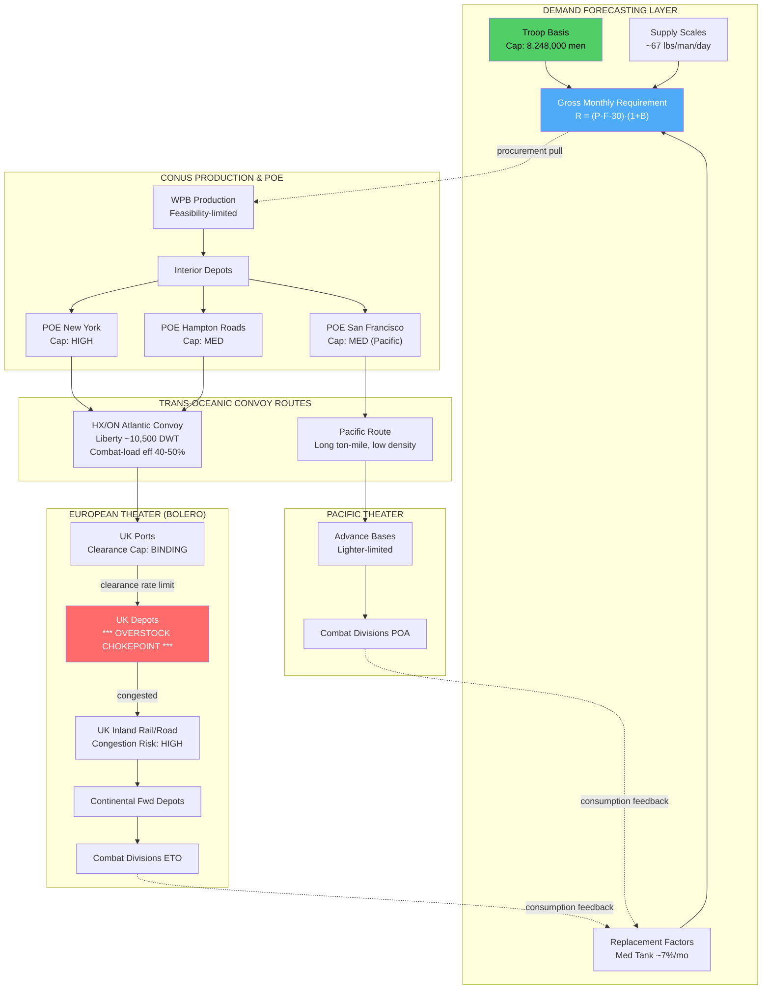

Cost: 0.28432

# Chapter 5: Army Requirements, 1943-44
## Reference Manual & Simulation-Specification Document
### US Army Green Book — *Global Logistics and Strategy: 1943–1945*

---

## 1. Strategic Context & Modern Historical Perspective

### The Predictive Systems Problem at the Heart of Global War

By 1943 the United States Army confronted a problem that had no precedent in scale or analytical complexity: how to compute, procure, ship, and position the material sustenance for a force projected to exceed 8,000,000 men fighting simultaneously across two hemispheres, in climatic and tactical conditions ranging from arctic Aleutian fog to New Guinea jungle to the temperate hedgerows of Normandy. The chapter under analysis addresses the intellectual machinery by which the Army Service Forces (ASF), under Lieutenant General Brehon B. Somervell, attempted to convert strategic intention into quantified material demand—the Troop Basis, the Supply Scales, and the requirements computations that fed the Victory Program's industrial mobilization targets.

The fundamental epistemological difficulty was that requirements had to be computed **prospectively**, often eighteen to twenty-four months before the material would actually be consumed, because the production-to-theater pipeline lag imposed that horizon. A truck ordered in early 1943 might not reach a Normandy beachhead until mid-1944. This forced planners to predict not merely how many soldiers would exist, but how they would fight, how fast their equipment would wear or be destroyed, what the loss rate of shipping to U-boats would be, and how quickly ports could clear cargo. Every one of these was a stochastic variable being treated, of necessity, as a deterministic planning constant.

### The Strategic Paradox: Plans vs. Physical Limits

The strategic conferences of 1943—Casablanca (SYMBOL, January), TRIDENT (Washington, May), QUADRANT (Quebec, August), and SEXTANT (Cairo, November)—each generated strategic commitments that were, in the aggregate, physically incompatible with the global shipping pool then available. Casablanca committed the Allies simultaneously to the strategic bombing offensive (POINTBLANK), the reduction of Sicily (HUSKY), continued Pacific pressure, the sustainment of the China-Burma-India theater, and the buildup for a cross-Channel assault (BOLERO). Each of these was individually feasible; their sum exceeded the carrying capacity of the merchant fleet and the throughput of the receiving ports.

The critical constraint was never simply the *quantity* of material—American factories eventually out-produced every combatant on earth—but the **movement and reception** of that material. The binding constraints were three, in sequence: (1) the deadweight-tonnage of the dry-cargo and tanker fleets, chronically short until the Liberty ship program hit stride and U-boat losses collapsed after May 1943; (2) **combat loading** inefficiency, wherein tactically-loaded assault shipping carried perhaps 40–50% of the cargo that could be carried under commercial loading, because equipment had to be stowed for combat accessibility rather than volumetric efficiency; and (3) **port clearance rates**, the capacity of a theater's berths, cranes, lighters, and—critically—inland rail and truck transport to *evacuate* cargo from the quayside faster than ships delivered it. This last constraint produced the defining pathology of the period: material could arrive faster than it could be moved inland, converting ports into vast open-air warehouses and immobilizing the shipping that could not be unloaded.

The strategic paradox, then, is that the requirements process was computing *demand* in a world where the *delivery* system was the actual limiting reagent. A requirement is only meaningful if it can be physically satisfied at the point of consumption at the required time; ASF's early computations systematically underweighted the transport-and-reception constraint, treating requirements as a production problem when it was fundamentally a network-flow problem.

### Inter-Service and Coalition Tensions

The requirements-determination apparatus was a site of continuous institutional friction. Within the Army, the **Army Ground Forces (AGF)** under McNair and the **Army Air Forces (AAF)** under Arnold competed with the service arms for a fixed Troop Basis ceiling; every division activated consumed manpower and shipping that the air forces wanted for groups and squadrons. Somervell's ASF stood as the arbiter and computer of requirements, a position that made it simultaneously indispensable and resented. The famous 1943 confrontation between Somervell and the War Production Board (WPB)—specifically the clash with Charles E. Wilson and the "feasibility dispute"—turned precisely on whether the Army's stated requirements were physically producible without wrecking the civilian economy. The WPB's economists, led by Simon Kuznets and Robert Nathan, demonstrated with national-income accounting that the 1942–43 "must" programs exceeded feasible output; the resulting scaling-back was a landmark of requirements realism.

The **Army-Navy** tension centered on shipping allocation and the competing demands of the Pacific (a Navy-dominated theater of vast distances and low troop density but extreme ton-miles) versus the European buildup (Army-dominated, short sea-lanes, high troop density). The **US-British** pooling arrangements, administered through the Combined Shipping Adjustment Board (CSAB) and the Combined Chiefs of Staff, meant that American requirements could not be computed in isolation; British import requirements (to sustain the UK's own war economy and population) drew on the same merchant pool, and every ton allocated to the British import program was a ton unavailable for BOLERO.

### Historical Era Context: The Victory Program, Troop Basis, and Supply Scales

The requirements methodology rested on three interlocking documents. The **Troop Basis** specified the total authorized strength and its distribution among arms and services—it was the master population variable from which all consumption flowed. The **Supply Scales** (sometimes "supply factors" or "maintenance factors") specified the daily consumption of each class of supply per soldier or per unit. The **replacement factors** specified the monthly rate at which equipment would be lost to combat, wear, and abandonment, and therefore had to be replaced. Multiplying troop strength by supply scales by time, and adding equipment replacement, produced the gross requirement fed into procurement.

### Modern Analytical Insights: The Overstocking Crisis

Post-war scholarship and declassified ASF records reveal that the replacement factors used in 1943 requirements planning were, for many categories, dramatically overestimated—derived from Great War experience, small-sample early-war engagements (Tunisia), or simple conservatism. The consequence was the **overstocking crisis of late 1943**: English depots (the BOLERO buildup) filled with equipment that combat had not consumed at the predicted rate. Tank track, spare engines, tires, and secondary items accumulated in quantities that overwhelmed the depot storage system and, critically, **choked the British inland transportation network**—rail sidings and depot road access clogged with matériel that could neither be used nor efficiently redistributed. This was a requirements-planning failure with direct network consequences: a forecasting error propagated downstream into a physical congestion crisis, immobilizing the very transport capacity that was the system's binding constraint. It is the canonical illustration of why requirements simulation must couple demand forecasting to storage and clearance capacity, not treat them as independent.

---

## 2. High-Fidelity Simulation Parameters & Real-World Metrics

| Parameter | Historical Value | Explanation & Strategic Rationale | Simulation Representation |
|---|---|---|---|
| **Standard daily maintenance requirement** | **~67 lbs/soldier/day** (theater average, all classes, 1943 ETO planning figure; ~50 lbs combat consumption for troops in contact, rising toward 66.8 lbs with overhead) | The all-classes tonnage to sustain one soldier: rations (Class I), fuel (Class III), ammunition (Class V), and general supplies. The figure varied by theater and intensity; the ~67 lb figure is the widely-cited ETO planning constant. | **Static constant** with theater/intensity **efficiency coefficient** multipliers (combat vs. rear). |
| **Maximum authorized Troop Basis (1943)** | **8,248,000** (1943 Troop Basis, revised downward from earlier 10.5M+ aspirations; the "90-division gamble" ceiling emerging) | The manpower ceiling imposed by the feasibility dispute and the competing needs of industry, agriculture, and the Navy. It capped every downstream requirement. | **Dynamic capacity cap** — a hard ceiling constraining the population variable $P$. |
| **Combat replacement factor, medium tanks** | **~7% per month** (planning figure; actual combat experience in NW Europe ran materially lower, ~2–3.5% in many periods, driving the overstocking) | Predicted monthly loss rate requiring replacement production and shipment. Overestimation directly caused overstocking. | **Efficiency/loss coefficient**, ideally **stochastic** or period-variable; expose planned vs. actual divergence. |
| **Ration weight (Class I)** | ~5–6.5 lbs/man/day | Subsistence baseline, relatively invariant and predictable. | Static constant. |
| **POL (Class III) per motorized division** | Highly variable; ~15–25% of tonnage in mobile ops | Fuel demand scaled with tempo and distance, not headcount. | Tempo-dependent coefficient. |
| **Ammunition (Class V) day-of-supply** | Variable "unit of fire"; artillery-dominated | The most volatile class; spikes in offensive phases. | Stochastic, phase-dependent. |
| **Liberty ship deadweight** | ~10,500 DWT (~7,200 measurement tons usable) | Movement capacity unit. | Vehicle-capacity constant. |
| **Combat-load efficiency** | ~40–50% of commercial stow | Penalizes assault shipping throughput. | Efficiency coefficient on convoy capacity. |
| **Planning buffer / safety level** | 30–45 days theater reserve typical | The $B$ term: reserve stock above running consumption. | Dynamic multiplier on requirement. |

---

## 3. Logistical Network Topology (Mermaid.js)



---

## 4. Mathematical Modeling & Simulation Formulas

### 4.1 Core Requirement Equation

$$R_{month} = \left( P \cdot F_{day} \cdot 30 \right) \cdot (1 + B)$$

Where:
- $R_{month}$ = gross monthly requirement (lbs, later converted to tons)
- $P$ = troop strength (men), constrained $P \le P_{max} = 8{,}248{,}000$
- $F_{day}$ = daily maintenance factor (lbs/man/day, ≈ 67)
- $B$ = safety/reserve buffer fraction (dimensionless, e.g. 0.30)

Converting to short tons: $T_{month} = R_{month} / 2000$.

### 4.2 Equipment Replacement Requirement

For an equipment class $k$ with theater inventory $N_k$ and monthly replacement factor $\rho_k$:

$$E_k = N_k \cdot \rho_k \cdot w_k$$

where $w_k$ is unit weight. The **planning error** that drove overstocking is the divergence:

$$\Delta_k = N_k \cdot (\rho_k^{plan} - \rho_k^{actual}) \cdot w_k \cdot \tau$$

over $\tau$ months. Positive $\Delta_k$ is accumulated dead stock congesting depots.

### 4.3 The Network-Flow / Congestion Constraint (the true binding problem)

Requirements are only satisfiable if throughput at every node meets demand. Let the pipeline be a directed graph $G=(V,E)$ with arc capacities $c_{ij}$. Define effective delivered tonnage as the max-flow subject to clearance:

$$\text{Delivered} = \max \sum_{j} f_{sj} \quad \text{s.t.} \quad 0 \le f_{ij} \le c_{ij}, \quad \sum_i f_{ij} = \sum_k f_{jk}\ \forall j \in V \setminus \{s,t\}$$

**Overstocking condition** at depot node $d$ occurs when inflow exceeds clearance:

$$\text{Inflow}_d - c_{d,\text{out}} > 0 \implies \text{Stock}_d(t{+}1) = \text{Stock}_d(t) + (\text{Inflow}_d - c_{d,\text{out}})$$

Congestion collapse triggers when $\text{Stock}_d > \text{Cap}_d^{storage}$, degrading $c_{d,\text{out}}$ (feedback), the mathematical signature of the late-1943 crisis.

### 4.4 Feasibility (WPB) Constraint

$$\sum_{\text{programs}} R_{month} \le \Phi_{prod}$$

where $\Phi_{prod}$ is feasible national output. The Kuznets-Nathan resolution enforced this ceiling.

---

## 5. Compile-Safe Scala 3.8.3 Domain Model

```scala
package Logistics.Requirements

import scala.math.min
import scala.math.max

opaque type Troops = Int
object Troops:
  def apply(value: Int): Troops = value
  extension (t: Troops) def toInt: Int = t

opaque type PoundsPerDay = Double
object PoundsPerDay:
  def apply(value: Double): PoundsPerDay = value
  extension (p: PoundsPerDay) def toDouble: Double = p

opaque type Tons = Double
object Tons:
  def apply(value: Double): Tons = value
  extension (t: Tons)
    def toDouble: Double = t
    def +(other: Tons): Tons = t + other.toDouble

opaque type Fraction = Double
object Fraction:
  def apply(value: Double): Fraction =
    require(value >= 0.0, "Fraction must be non-negative")
    value
  extension (f: Fraction) def toDouble: Double = f

opaque type Months = Int
object Months:
  def apply(value: Int): Months =
    require(value >= 0, "Months must be non-negative")
    value
  extension (m: Months) def toInt: Int = m

/** Master ceiling constants from the 1943 Troop Basis and ETO supply scales. */
object PlanningConstants:
  val TroopBasisCeiling1943: Troops = Troops(8248000)
  val StandardMaintenanceLbs: PoundsPerDay = PoundsPerDay(67.0)
  val PoundsPerShortTon: Double = 2000.0
  val DaysPerMonth: Double = 30.0
  val LibertyShipDwt: Tons = Tons(10500.0)
  val CombatLoadEfficiency: Fraction = Fraction(0.45)

/** State of a theater depot with respect to congestion. */
enum DepotState:
  case Normal
  case Elevated
  case Congested
  case Collapsed

/** Equipment class carrying planned vs. actual replacement divergence. */
final case class EquipmentClass(
  name: String,
  inventory: Int,
  unitWeightLbs: Double,
  plannedFactorPerMonth: Fraction,
  actualFactorPerMonth: Fraction
):
  def plannedReplacementTons: Tons =
    Tons(inventory * plannedFactorPerMonth.toDouble * unitWeightLbs
      / PlanningConstants.PoundsPerShortTon)

  def actualReplacementTons: Tons =
    Tons(inventory * actualFactorPerMonth.toDouble * unitWeightLbs
      / PlanningConstants.PoundsPerShortTon)

  /** Accumulated dead stock over a horizon: the overstocking delta. */
  def deadStockTons(horizon: Months): Tons =
    val divergence: Double =
      plannedFactorPerMonth.toDouble - actualFactorPerMonth.toDouble
    val lbs: Double =
      inventory * max(0.0, divergence) * unitWeightLbs * horizon.toInt
    Tons(lbs / PlanningConstants.PoundsPerShortTon)

/** A depot node with storage cap and outbound clearance capacity. */
final case class DepotNode(
  name: String,
  storageCapTons: Tons,
  clearanceCapPerMonthTons: Tons,
  currentStockTons: Tons
):
  def state: DepotState =
    val ratio: Double = currentStockTons.toDouble / storageCapTons.toDouble
    if ratio >= 1.0 then DepotState.Collapsed
    else if ratio >= 0.85 then DepotState.Congested
    else if ratio >= 0.60 then DepotState.Elevated
    else DepotState.Normal

  /** Effective clearance degrades once congested (feedback loop). */
  def effectiveClearanceTons: Tons =
    state match
      case DepotState.Normal    => clearanceCapPerMonthTons
      case DepotState.Elevated  => clearanceCapPerMonthTons
      case DepotState.Congested =>
        Tons(clearanceCapPerMonthTons.toDouble * 0.60)
      case DepotState.Collapsed =>
        Tons(clearanceCapPerMonthTons.toDouble * 0.25)

  /** Advance one month given an inflow of tons. */
  def step(inflowTons: Tons): DepotNode =
    val cleared: Double =
      min(
        currentStockTons.toDouble + inflowTons.toDouble,
        effectiveClearanceTons.toDouble
      )
    val newStock: Double =
      max(0.0, currentStockTons.toDouble + inflowTons.toDouble - cleared)
    copy(currentStockTons = Tons(newStock))

object RequirementForecaster:
  def forecastMonthlyTons(
    troops: Troops,
    factor: PoundsPerDay,
    buffer: Double
  ): Double =
    val lbsPerMonth: Double =
      troops.toInt * factor.toDouble * PlanningConstants.DaysPerMonth
    val tonsPerMonth: Double = lbsPerMonth / PlanningConstants.PoundsPerShortTon
    tonsPerMonth * (1.0 + buffer)

  /** Enforce the Troop Basis feasibility ceiling before forecasting. */
  def cappedForecastTons(
    troops: Troops,
    factor: PoundsPerDay,
    buffer: Fraction
  ): Tons =
    val effective: Int =
      min(troops.toInt, PlanningConstants.TroopBasisCeiling1943.toInt)
    Tons(forecastMonthlyTons(Troops(effective), factor, buffer.toDouble))

  /** Total requirement including equipment replacement. */
  def totalMonthlyRequirementTons(
    troops: Troops,
    factor: PoundsPerDay,
    buffer: Fraction,
    equipment: List[EquipmentClass]
  ): Tons =
    val maintenance: Double = cappedForecastTons(troops, factor, buffer).toDouble
    val replacement: Double =
      equipment.map(_.plannedReplacementTons.toDouble).sum
    Tons(maintenance + replacement)

  /** Number of Liberty-ship-equivalents, adjusted for combat-load penalty. */
  def convoyLiftsRequired(requirement: Tons): Int =
    val effectiveCapacity: Double =
      PlanningConstants.LibertyShipDwt.toDouble *
        PlanningConstants.CombatLoadEfficiency.toDouble
    math.ceil(requirement.toDouble / effectiveCapacity).toInt

object OverstockAnalyzer:
  def totalDeadStockTons(
    equipment: List[EquipmentClass],
    horizon: Months
  ): Tons =
    Tons(equipment.map(_.deadStockTons(horizon).toDouble).sum)

  /** Simulate a depot receiving planned inflow for N months. */
  def simulateDepot(
    initial: DepotNode,
    monthlyInflow: Tons,
    horizon: Months
  ): List[DepotNode] =
    (0 until horizon.toInt).foldLeft(List(initial)):
      (history, _) =>
        val next: DepotNode = history.head.step(monthlyInflow)
        next :: history
    .reverse

@main def runRequirementSimulation(): Unit =
  val tanks: EquipmentClass = EquipmentClass(
    name = "Medium Tank M4",
    inventory = 12000,
    unitWeightLbs = 66800.0,
    plannedFactorPerMonth = Fraction(0.07),
    actualFactorPerMonth = Fraction(0.03)
  )

  val forecast: Tons = RequirementForecaster.totalMonthlyRequirementTons(
    troops = Troops(3500000),
    factor = PlanningConstants.StandardMaintenanceLbs,
    buffer = Fraction(0.30),
    equipment = List(tanks)
  )

  val lifts: Int = RequirementForecaster.convoyLiftsRequired(forecast)
  val deadStock: Tons = OverstockAnalyzer.totalDeadStockTons(List(tanks), Months(6))

  val ukDepot: DepotNode = DepotNode(
    name = "UK BOLERO Depot",
    storageCapTons = Tons(500000.0),
    clearanceCapPerMonthTons = Tons(120000.0),
    currentStockTons = Tons(300000.0)
  )

  val trajectory: List[DepotNode] =
    OverstockAnalyzer.simulateDepot(ukDepot, Tons(160000.0), Months(6))

  println(s"Monthly requirement (tons): ${forecast.toDouble}")
  println(s"Liberty-ship lifts required: $lifts")
  println(s"6-month tank dead stock (tons): ${deadStock.toDouble}")
  trajectory.zipWithIndex.foreach: (node, month) =>
    println(s"Month $month: stock=${node.currentStockTons.toDouble} state=${node.state}")
```

---

## 6. Graduate-Level Operational Analysis

### 6.1 Reconciling WPB Production Capability with ASF Military Requirements

The mid-war reconciliation of production capability and military requirements was resolved not by any single decision but by the institutionalization of **feasibility as a binding constraint on requirements**—a conceptual revolution led by the WPB's Planning Committee economists (Robert Nathan, Simon Kuznets, Stacy May) during the 1942 "feasibility dispute," whose disciplines governed 1943–44 practice.

The core problem was that ASF, driven by Somervell's institutional imperative to guarantee the fighting forces' supply, computed requirements as a *demand* quantity essentially unbounded by supply-side reality. The Army's aggregate 1942 objectives implied a level of munitions output that, when summed with shipbuilding, aircraft, the civilian minimum, and Lend-Lease, exceeded the mathematically feasible ceiling of national output as measured by gross national product accounting. Kuznets' contribution—applying national-income methodology to the war program—demonstrated that requirements were not merely large but *arithmetically impossible*: producing them would have required a GNP that did not and could not exist within the planning horizon, given labor, machine-tool, and raw-material (especially steel, aluminum, copper) constraints.

The resolution operated through several mechanisms. First, **the objective was scaled to feasibility**: the Nathan-Kuznets analysis forced a reduction of the 1942–43 "must" programs to roughly what output could actually deliver, embodied in the Roosevelt-arbitrated compromise that trimmed the most extreme targets. Second, the **Controlled Materials Plan (CMP)**, introduced in late 1942 and dominant by 1943, replaced the chaotic priorities system with a vertical allocation of the three critical metals directly to claimant agencies, who then sub-allocated down their supply chains. This made the feasibility ceiling *operational*: an agency could not order what it had no metal allotment to build. Third, and most relevant to this chapter, the **Troop Basis itself became the reconciling variable**. Because manpower was the ultimate scarce resource—every soldier removed from the economy reduced production—the ceiling of ~8.2 million (and the later "90-division gamble" that held the ground force to 89 divisions rather than the 200+ once contemplated) was precisely the mechanism by which military requirements were bounded to what the productive economy could simultaneously man *and* equip. The Troop Basis was thus the fulcrum: it balanced the man-in-uniform against the man-at-the-lathe. The simulation must therefore model $P_{max}$ not as an arbitrary cap but as the endogenous solution to a two-sided constraint—the point where marginal military value of another division equals the marginal production lost by conscripting its manpower.

### 6.2 The Dangers of Overestimating Replacement Factors and the Overstocking Crisis

Replacement factors are the most treacherous variable in requirements planning because they are second-order predictions—forecasts not of consumption but of *destruction and wear*, phenomena that depend on tactical conditions no planner in 1942 could observe. The danger is structurally asymmetric and compounding.

The mathematical structure of the error is captured by the divergence term $\Delta_k = N_k(\rho_k^{plan}-\rho_k^{actual})w_k\tau$. When $\rho^{plan}$ for medium tanks was set near 7% per month—derived from conservative extrapolation and limited Tunisian data—but actual attrition in many periods of NW European operations ran materially lower (frequently 2–3.5%), the divergence was not merely a paper surplus. Because production and shipment were committed eighteen months ahead against the *planned* factor, the pipeline continued disgorging replacement tanks, tracks, engines, and spares at the high rate long after combat had revealed the true lower rate. The overshoot accumulated *physically* in the theater.

Here the danger transitions from an accounting inefficiency to a **network catastrophe**, and this is the essential insight the simulator must capture through the depot feedback mechanism. Overstocking did not simply waste production; it consumed the two scarcest resources in the entire system: **shipping** and **port/depot clearance capacity**. Every unnecessary ton of spare tank track shipped to England occupied Liberty-ship hold space that could have carried a needed ton of ammunition or rations—and given the ~45% combat-load efficiency and the chronic shipping shortage, this displacement was acute. Once landed, the surplus overwhelmed depot storage, and here the feedback loop modeled in the `DepotNode.effectiveClearanceTons` method engages: when stock exceeds a critical fraction of storage capacity, the depot's *own outbound clearance rate degrades*. Sidings fill with cars that cannot be unloaded; sorting slows; the inland rail and road network that was already the binding constraint on the whole ETO buildup seizes. The late-1943 English depot congestion thus represents a forecasting error propagating downstream and inverting into a *reduction of the very throughput the system depended upon*—a positive-feedback congestion collapse (`DepotState.Collapsed` in the model, where clearance drops to 25%).

The deeper lesson, validated by decades of logistical scholarship and reflected in the coupling of the demand-forecasting layer to the network-flow constraint in this specification, is that **requirements cannot be validly computed independent of the delivery and reception network**. An overestimated replacement factor is dangerous precisely because a requirements process that treats demand as an open-loop production target will faithfully manufacture and ship its own errors into the one part of the system—inland clearance—least able to absorb them. The corrective adopted in 1944, driven by hard combat data feeding back into revised replacement factors and by the imposition of theater-controlled "levels of supply," was to close the loop: to treat replacement factors as *dynamic, empirically-updated coefficients* rather than static planning constants, and to ration shipment against actual clearance capacity rather than against nominal demand. This is the historical justification for modeling $\rho_k^{plan}$ and $\rho_k^{actual}$ as separate, divergent fields and for making depot clearance a stateful, degradable capacity rather than a fixed throughput.
