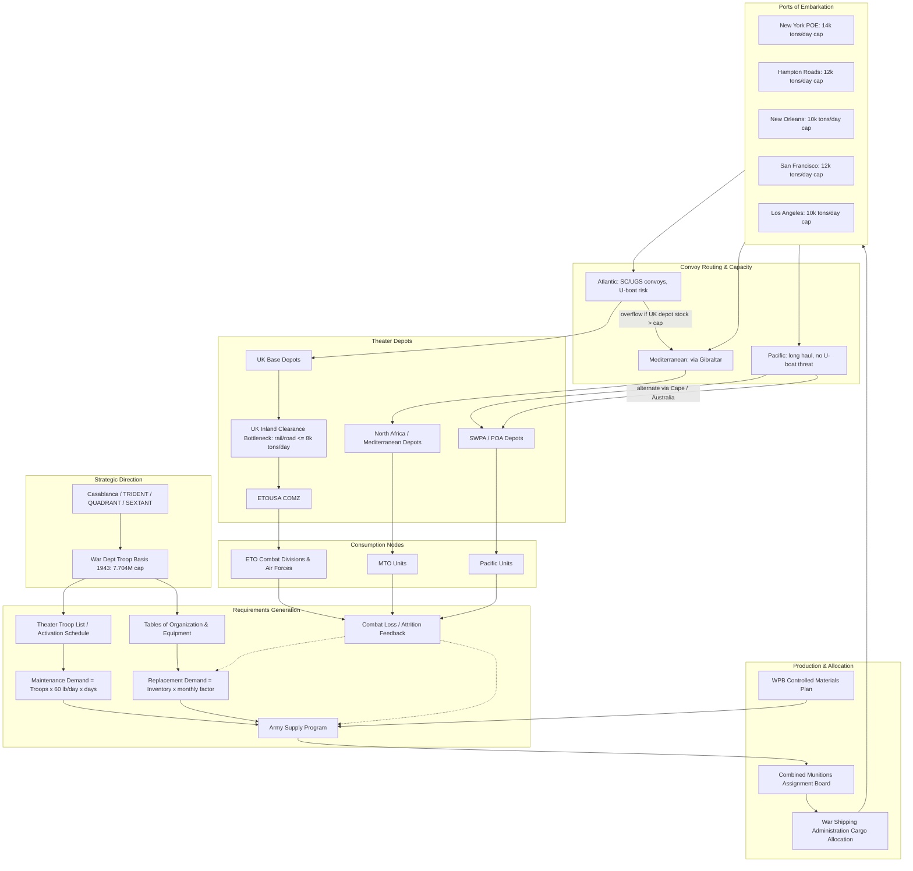

Cost: 0.00659736

# Chapter 5: Army Requirements, 1943–44

## 1. Strategic Context & Modern Historical Perspective

The spring and summer of 1943 looked, from Washington, like a triumph of mobilization. American factories were turning out ships, aircraft, trucks, and radios at rates that astonished the British and alarmed the Axis. The U.S. Army had grown from a prewar establishment of 190,000 men to millions, and the War Department had created a global command architecture spanning the Atlantic, Mediterranean, Pacific, and China-Burma-India theaters. Yet the central problem of this chapter is not production, or even manpower, but the *requirements process*: the system by which strategic intentions, theater troop lists, combat loss estimates, and industrial feasibility were converted into concrete claims on shipping, factories, depots, and port capacity. From 1943 to 1944, the Army learned that a strategic plan is not an Army supply program, and an Army supply program is not a logistics plan, until it has been screened through the hard physical constraints of shipping, port clearance, and inland transportation.

The strategic paradox is sharp. At Casablanca in January 1943, TRIDENT in May 1943, QUADRANT in August 1943, and SEXTANT at Cairo/Tehran in November–December 1943, Allied leaders approved an extraordinary range of operations: the combined bomber offensive; continued Mediterranean operations in Sicily and Italy; the build-up for a cross-Channel invasion; the recapture of Burma; intensified operations in the Southwest and Central Pacific; and support for the Soviet Union through Persian Gulf and Arctic convoys. Each operation was justified strategically, but all of them competed for a single, finite pool of ocean shipping and for a smaller set of assault landing craft. The U.S. Army’s force structure was meanwhile expressed in the *Troop Basis*, a top-level authorization of millions of men and hundreds of divisions, each with an established equipment table. The *Army Supply Program* converted that troop basis into poundage, tonnage, and itemized production requirements. But the final requirement could not be the same as the gross demand; it had to be shrunk, phased, and prioritized according to the capacity of ports like New York, Hampton Roads, New Orleans, Los Angeles, San Francisco, and Seattle, and by the ability of overseas theaters to unload, warehouse, and distribute goods inland.

The most important modern analytical insight is that the problem was not merely quantitative but computational. Requirements planners had to estimate replacement factors—the percentage of major items destroyed, lost, or consumed each month—before combat experience was mature. In 1943, combat loss data from North Africa was still thin, Mediterranean operations were evolving, and the enormous Normandy buildup had not yet occurred. Planners therefore used deliberately generous factors to avoid being caught short. The result was an overproduction of many line items, particularly vehicle components, artillery spare parts, and combat equipment, which accumulated in the United Kingdom during late 1943. The depots of the Communications Zone in Britain became congested with tank tracks, bogie wheels, radio tubes, and spare engines. This was not a shortage of transport capacity in the abstract; it was a misallocation of scarce transport capacity caused by over-forecast demand. In modern supply-chain terms, the system operated with a very high safety stock and a long order lead time, but with weak feedback from actual consumption. The overstocking crisis of late 1943 was therefore a textbook example of forecast error propagating through a multi-echelon logistics network.

Inter-service and coalition tensions compounded the technical problem. Within the U.S. Army, the Services of Supply, soon renamed the Army Service Forces (ASF), was responsible for computing and satisfying material requirements, while the Army Ground Forces and Army Air Forces insisted that requirements reflect their own operational models. The ASF, under General Brehon Somervell, fought hard to keep requirements centralized and tied to strategic plans, but the Army Air Forces wanted a separate, autonomous logistics pipeline for aviation gasoline, ordnance, and airfield construction. The Navy, meanwhile, had its own requirements system and competed with the Army for controlled materials such as steel, copper, aluminum, and especially landing craft. The War Production Board (WPB) played a third role: it did not care primarily about military strategy, but about feasibility—whether the materials, machine tools, and labor existed to produce the quantities the Army requested. The Army–Navy Munitions Board was nominally the arbitration body, but its authority was contested. Across the Atlantic, the British had equally strong views about shipping allocation, Lend-Lease balance, and the size of the U.S. troop build-up. The British feared that an over-large U.S. Army in the United Kingdom would create impossible port and railway congestion before OVERLORD. Those fears were largely justified by the 1943 stockpile crisis.

The historical era context matters for any simulation. The *Victory Program* of 1941 was a comprehensive statement of ultimate military objectives, but by 1943 it had become clear that the ultimate force structure required to defeat Germany and Japan could not be either manned, trained, equipped, transported, or maintained on the original schedule. The War Department’s response was continuous revision. The Troop Basis was revised from a planned 8.2 million or more down to a 1943 ceiling of approximately 7.7 million, partly because shipping, not manpower, was the decisive constraint. Troop units were reorganized with fewer service troops, more tactical balance, and replacement pools sized by loss-rate projections. Supply scales—the published lists of quantities carried by units and held in depots—were repeatedly reduced, but the reductions lagged behind production schedules. A factory making a million shell fuses cannot simply stop; it must either continue with costly inventories or be converted to other production, and the conversion process takes months.

Modern scholarship, using postwar records, has shown that the requirements problem was essentially a resource allocation problem under uncertainty. The solution adopted by the Army was not a single master plan but an iterative, multi-committee process of strategic claims, feasibility review, allocation, and, when necessary, emergency override. The consequences of getting requirements wrong were not merely monetary; they were operational. Shipping diverted to carry unwanted tank tracks could not carry the last 10,000 tons of bridging equipment needed for a river crossing. Port congestion in England delayed the unloading of troop transports, which in turn slowed the rotation of units into concentration areas. The last chapter of logistics history is full of cases where the bottleneck was not the factory but the forecast.

For a high-fidelity simulation, therefore, the requirements module cannot be modeled as a simple constant demand rate. It must include arrival processes, inventory limits, port clearance constraints, and feedback between combat loss reports and future production. The 1943–44 period is best modeled as a system in which demand is generated by troop strength, maintenance factors, and replacement factors, then filtered by shipping availability, port capacity, and depot storage limits. The historical overstocking crisis is a natural validation benchmark: a good simulation should reproduce the paradox of full depots and unmet field needs.

## 2. High-Fidelity Simulation Parameters & Real-World Metrics

The following table provides the core historical constants and coefficients used in the Chapter 5 requirements calculations. These values should be treated as raw database parameters for the simulator.

| Parameter | Historical Value | Historical Explanation and Strategic Rationale | Simulation Representation |
|---|---:|---|---|
| Standard daily maintenance requirement | 60.0 lbs/soldier/day | This was the approximate aggregate “all classes” maintenance factor used in 1943 Army Supply Program calculations for an average oversea soldier. It included rations, ammunition, fuel, construction materials, medical supplies, and spare parts. It converts troop strength to gross monthly tonnage. | **Dynamic coefficient** per unit type and supply class. It should vary by theater and unit: armored units have higher fuel, infantry units higher ammunition, air forces higher POL. |
| Maximum authorized Troop Basis for the U.S. Army, 1943 | 7,704,000 troops | The revised War Department Troop Basis approved in 1943. It capped the Army’s authorized strength at 7.7 million, one of the central decisions of the chapter. Actual Army strength at the end of 1943 was lower (approximately 7.48 million), because training, shipping, and unit activation lagged authorization. | **Static capacity cap** at the strategic planning node. No requirement can exceed this ceiling without a JCS change to the Troop Basis. |
| Combat replacement factor for medium tanks, 1943 planning | 10% per month | The Army Supply Program initially used a medium tank replacement factor of about 10 percent per month. This reflected the high loss rates expected in amphibious and armored operations, based on limited North African experience. Later combat data showed lower average losses, and the factor was revised downward, contributing to overstocking. | **Dynamic efficiency coefficient** in the replacement-demand equation. It should be represented as a monthly failure/loss probability per item, and should be adjusted by scenario combat intensity. |
| Aggregate planning buffer / insurance rate | 25% (initial ASP reserve guidance) | The Army added a percentage of reserve to maintenance demand to account for uncertainty, theater post-stockage, and replacement pipeline shortages. This was one of the main sources of over-forecasting. | **Buffer coefficient B** in aggregate formula. It should be a decision variable, not a fixed constant, and should be subject to optimization. |
| Planning month length | 30 days | The Army Supply Program planned in 30-day months for computational convenience, regardless of calendar months. | `Days` constant for all monthly conversions. |
| Conversion | 1 short ton = 2,000 pounds | Standard U.S. Army tonnage conversion. | Unit conversion constant. |
| Theater stockage objective | 45 days of supply in UK depots for OVERLORD | The theater-established reserve level for maintenance and combat supplies. By late 1943, actual stocks exceeded planned levels because replacement factors were overestimated. | **Inventory capacity cap** at depot nodes; exceeded historical inventory triggers congestion penalties. |
| U.S. port of embarkation planning throughput | Varies, ~10,000–15,000 tons/day per major port | Ports such as New York could load large volumes, but simultaneous troop movements, convoy sailings, and cargo types imposed practical limits. | **Port capacity constraint** in the network model; can be modeled as a service rate with queuing. |
| “Division slice” planning strength (contextual) | ~40,000–42,000 men per division equivalent | The division slice represented a division plus its share of corps, army, and communications zone troops. It was used to translate division count into the total troop basis. | **Aggregation multiplier** for strategic-level demand computation. |

These values are not arbitrary. They were the operating assumptions of a planning system trying to anticipate a future battlefield. The 60-pound maintenance factor is linear and aggregate; it works well for theater-level tonnage forecasting but is too coarse for item-level simulation. The 10% tank replacement factor is much more volatile; it should be represented as a stochastic rate, not as an exact monthly constant. The 7.704 million troop basis is an absolute ceiling, but in the real system it was a ceiling that changed when strategy changed.

## 3. Logistical Network Topology

The following Mermaid diagram models the demand-forecasting and requirements-allocation network described in Chapter 5. It emphasizes the transformation of strategic decisions into troop basis, troop basis into requirements, requirements into production, and production into a congested multi-port, multi-route logistics network.



This topology captures the central tension of the chapter. Requirements may be generated by strategic plans, but they cannot enter the network until shipping capacity and port clearance permit. The UK depot node is a critical bottleneck because it has finite storage and inland clearance capacity. When replacement factors are too high, the requirement generation block overinjects tonnage into the network, congesting the UK node and degrading the very pipeline that is supposed to support combat units.

## 4. Mathematical Modeling & Simulation Formulas

The core equation from the chapter, and the basic building block of the simulator, is the monthly maintenance requirement formula:

$$
\text{Mathematical Concept: } R_{month} = \left( P \cdot F_{day} \cdot 30 \right) \cdot (1 + B)
$$

where:

- $P$ is the authorized troop strength in men,
- $F_{day}$ is the standard daily maintenance factor in pounds per man per day,
- $30$ is the planning month length in days,
- $B$ is the buffer rate as a decimal fraction,
- $R_{month}$ is the monthly requirement in pounds of supplies.

To convert to short tons:

$$
R_{month}^{tons} = \frac{P \cdot F_{day} \cdot 30 \cdot (1 + B)}{2000}
$$

This aggregate formula is useful, but a more rigorous representation must separate maintenance demand from combat replacement demand. Let:

- $c$ index supply classes,
- $k$ index capital equipment types, especially medium and heavy weapons,
- $P_{c,t}$ be troop strength assigned to supply class $c$ in month $t$,
- $F_{c,t}$ be the maintenance factor in pounds per man per day,
- $D_t$ be the number of days in the planning month,
- $B_c$ be the buffer coefficient for supply class $c$,
- $N_{k,t}$ be the on-hand inventory of equipment type $k$ in month $t$,
- $\rho_{k,t}$ be the replacement factor for equipment type $k$,
- $w_k$ be the shipping weight per item of equipment type $k$ in pounds.

Total demand in short tons for month $t$ is:

$$
R_{total,t} =
\sum_c \frac{P_{c,t} \cdot F_{c,t} \cdot D_t \cdot (1 + B_c)}{2000}
+
\sum_k \frac{N_{k,t} \cdot \rho_{k,t} \cdot w_k}{2000}
$$

The first term represents daily consumption and maintenance demand. The second term represents replacement demand, driven by expected attrition rather than immediate consumption.

The resource allocation problem can be stated as a linear program. Let $R_{total,t}$ be the target requirement in month $t$, but the actual shipped quantity is constrained by port, shipping, and depot capacities. Define:

- $x_{ijt}$: tons shipped from source port $i$ to destination theater $j$ in month $t$,
- $S_{it}$: tons available at source port $i$ in month $t$,
- $K_{it}$: port clearance capacity in tons at source $i$ in month $t$,
- $C_t$: total shipping capacity in ton-miles or tons for month $t$,
- $d_{ij}$: nautical miles route distance from $i$ to $j$,
- $D_{jt}$: total demand at theater $j$ in month $t$,
- $I_{jt}$: inventory held at theater $j$ at the end of month $t$,
- $\bar{I}_j$: maximum warehouse/depot capacity at theater $j$,
- $Short_{jt}$: unmet demand in theater $j$ in month $t$.

Objective: minimize unmet demand across all theaters:

$$
\min \sum_{j,t} Short_{jt}
$$

Subject to:

$$
\sum_j x_{ijt} \le \min(S_{it}, K_{it}) \quad \forall i,t
$$

$$
\sum_{i,j} d_{ij} x_{ijt} \le C_t \quad \forall t
$$

$$
I_{jt} = I_{j,t-1} + \sum_i x_{ijt} - D_{jt} + Short_{jt} \quad \forall j,t
$$

$$
0 \le I_{jt} \le \bar{I}_j \quad \forall j,t
$$

$$
0 \le Short_{jt} \le D_{jt} \quad \forall j,t
$$

$$
x_{ijt} \ge 0 \quad \forall i,j,t
$$

This formulation captures the 1943 paradox: even if production is abundant, the system cannot satisfy demand if port throughput $K_{it}$, shipping capacity $C_t$, or theater depot capacity $\bar{I}_j$ is insufficient. The historical overstocking crisis is represented by a situation where $D_{jt}$ is overestimated, causing $I_{jt}$ to rise to $\bar{I}_j$ in UK depots, blocking further arrivals even while combat units report shortages.

## 5. Compile-Safe Scala 3.8.3 Domain Model

```scala
package Logistics.Requirements

opaque type Troops = Int
object Troops:
  def apply(value: Int): Troops =
    require(value >= 0, s"Troops must be non-negative, got $value")
    value
  extension (t: Troops) def toInt: Int = t

opaque type PoundsPerDay = Double
object PoundsPerDay:
  def apply(value: Double): PoundsPerDay =
    require(value >= 0.0, s"Pounds per day must be non-negative, got $value")
    value
  extension (p: PoundsPerDay) def toDouble: Double = p

opaque type Tons = Double
object Tons:
  def apply(value: Double): Tons =
    require(value >= 0.0, s"Tons must be non-negative, got $value")
    value
  def fromPounds(pounds: Double): Tons = Tons(pounds / 2000.0)
  extension (t: Tons) def toDouble: Double = t

opaque type Days = Int
object Days:
  def apply(value: Int): Days =
    require(value > 0, s"Days must be positive, got $value")
    value
  extension (d: Days) def toInt: Int = d

opaque type ReplacementFactor = Double
object ReplacementFactor:
  def apply(value: Double): ReplacementFactor =
    require(value >= 0.0, s"Replacement factor must be non-negative, got $value")
    value
  extension (r: ReplacementFactor) def toDouble: Double = r

opaque type NauticalMiles = Double
object NauticalMiles:
  def apply(value: Double): NauticalMiles =
    require(value >= 0.0, s"Nautical miles must be non-negative, got $value")
    value
  extension (n: NauticalMiles) def toDouble: Double = n

enum SupplyClass:
  case Rations
  case Ammunition
  case PetroleumOilLubricants
  case Construction
  case Medical
  case MaintenanceParts

enum RequirementState:
  case DraftEstimate
  case ApprovedProgram
  case AllocatedToPort
  case InConvoy
  case DeliveredTheater
  case Consumed

object RequirementState:
  def canTransition(from: RequirementState, to: RequirementState): Boolean =
    (from, to) match
      case (RequirementState.DraftEstimate, RequirementState.ApprovedProgram) => true
      case (RequirementState.ApprovedProgram, RequirementState.AllocatedToPort) => true
      case (RequirementState.AllocatedToPort, RequirementState.InConvoy) => true
      case (RequirementState.InConvoy, RequirementState.DeliveredTheater) => true
      case (RequirementState.DeliveredTheater, RequirementState.Consumed) => true
      case _ => false

final case class RequirementLine(
    monthId: Int,
    commandName: String,
    supplyClass: SupplyClass,
    troops: Troops,
    dailyMaintenance: PoundsPerDay,
    bufferFactor: ReplacementFactor,
    tonsRequested: Tons,
    state: RequirementState)

object RequirementLine:
  def create(
      monthId: Int,
      commandName: String,
      supplyClass: SupplyClass,
      troops: Troops,
      dailyMaintenance: PoundsPerDay,
      bufferFactor: ReplacementFactor): RequirementLine =
    require(monthId >= 0, s"monthId must be non-negative, got $monthId")
    require(commandName.nonEmpty, "commandName must not be empty")
    val monthlyPounds = troops.toInt * dailyMaintenance.toDouble * 30.0
    val tons = Tons.fromPounds(monthlyPounds * (1.0 + bufferFactor.toDouble))
    RequirementLine(
      monthId,
      commandName,
      supplyClass,
      troops,
      dailyMaintenance,
      bufferFactor,
      tons,
      RequirementState.DraftEstimate)

  def transition(line: RequirementLine, next: RequirementState): RequirementLine =
    require(
      RequirementState.canTransition(line.state, next),
      s"Invalid transition from ${line.state} to $next")
    line.copy(state = next)

final case class CargoManifest(
    line: RequirementLine,
    origin: String,
    destination: String,
    distance: NauticalMiles,
    tons: Tons)

object RequirementConstants:
  val dailyMaintenanceLbsPerTroop: PoundsPerDay = PoundsPerDay(60.0)
  val maxTroopBasis1943: Troops = Troops(7_704_000)
  val mediumTankMonthlyReplacementRate: ReplacementFactor = ReplacementFactor(0.10)
  val planningDaysPerMonth: Days = Days(30)
  val poundsPerShortTon: Double = 2000.0
  val defaultTheaterBuffer: ReplacementFactor = ReplacementFactor(0.25)

object RequirementForecaster:
  def forecastMonthlyTons(
      troops: Troops,
      factor: PoundsPerDay,
      buffer: Double): Double =
    val lbsPerMonth = troops.toInt * factor.toDouble * 30.0
    val tonsPerMonth = lbsPerMonth / 2000.0
    tonsPerMonth * (1.0 + buffer)

  def forecastTons(line: RequirementLine, days: Days): Tons =
    val rawPounds = line.troops.toInt * line.dailyMaintenance.toDouble * days.toInt
    val bufferedPounds = rawPounds * (1.0 + line.bufferFactor.toDouble)
    Tons.fromPounds(bufferedPounds)

final class RequirementEngine:
  def validateTroopBasis(troops: Troops): Boolean =
    troops.toInt <= RequirementConstants.maxTroopBasis1943.toInt

  def validateReplacementFactor(rate: ReplacementFactor): Boolean =
    rate.toDouble >= 0.0 && rate.toDouble <= 1.0

  def forecastLine(line: RequirementLine): RequirementLine =
    val forecast = RequirementForecaster.forecastTons(line, RequirementConstants.planningDaysPerMonth)
    line.copy(tonsRequested = forecast)

  def canShipFromPort(
      line: RequirementLine,
      availableTons: Tons,
      portThroughputTonsPerDay: Tons,
      days: Days): Boolean =
    val requiredTons = RequirementForecaster.forecastTons(line, days)
    val portCapacity = portThroughputTonsPerDay.toDouble * days.toInt
    availableTons.toDouble >= requiredTons.toDouble &&
      portCapacity >= requiredTons.toDouble

  def applyTheaterBuffer(
      line: RequirementLine,
      extraBuffer: ReplacementFactor): RequirementLine =
    val combined = ReplacementFactor(line.bufferFactor.toDouble + extraBuffer.toDouble)
    val rebuffered =
      RequirementLine.create(
        line.monthId,
        line.commandName,
        line.supplyClass,
        line.troops,
        line.dailyMaintenance,
        combined)
    rebuffered.copy(state = line.state)
```

This code provides a compile-safe foundation for the simulation engine. It uses opaque types to prevent unit confusion, an explicit state machine for requirement transitions, and a pure forecaster that can be used both as an aggregate calculator and as a line-item demand calculator. The `RequirementEngine` class can be extended with actual network simulation nodes without changing the domain logic.

## 6. Graduate-Level Operational Analysis

### 6.1 How the discrepancy between production capability and military requirements was resolved

The mid-war experience showed that there is no such thing as a finally correct requirements estimate. The Army’s requirements were initially expressed as *claims* against the national economy. The War Production Board, responsible for industrial mobilization, had to determine whether those claims were feasible in steel, copper, rubber, aluminum, machine tools, and skilled labor. The Army Service Forces, by contrast, was responsible for ensuring that the requirements were large enough to meet strategic commitments. The two institutions therefore had opposite biases: ASF inflated to protect against ignorance, WPB deflated to avoid impossible production targets. The result was a repeated process of negotiation, not a one-time calculation. The *Controlled Materials Plan* (CMP) was the mechanism that forced the resolution. Under CMP, every claimant agency, including the War Department, had to present requirements for each critical material and then receive allotments based on estimated supply. That meant the requirements could not be simply strategic wishes; they had to be expressed in tonnages and schedules that could be compared directly with production capacity.

The second resolution mechanism was strategic review at the top level. The Joint Chiefs and the Combined Chiefs reviewed the troop basis and the Army Supply Program in light of shipping availability. The 1943 decision to cap the Army at roughly 7.7 million troops was a direct admission that the United States could not transport, supply, and maintain a larger Army within the desired time frame. Shipping, not steel, became the master constraint. After the Casablanca Conference and the subsequent reviews, the War Department accepted that an Army of 8.2 million or more was not feasible for 1943–44. The Troop Basis was revised downward, the unit activation schedules were stretched, and the number of divisions planned was cut from the earlier Victory Program figures to a number that could be supported by the available transport and the division-slice manpower ratios. This was not a military defeat; it was the first mature recognition that logistics is strategy.

The third mechanism was programmatic “reconciliation” after each strategic conference. Every major decision—OVERLORD, ANVIL, the Pacific island campaigns, the bomber offensive—forced a new revision of the Army Supply Program. Items that were no longer needed in planned quantities were reduced; items whose combat loss rates proved higher were increased. This was the mid-war equivalent of a modern rolling forecast. It was imperfect, because factory lead times meant that a cut in a program in August would not stop production until several months later. But by late 1943 the process had produced a workable, if overstocked, balance. The resolution of the WPB–ASF tension was therefore neither pure military necessity nor pure industrial feasibility; it was a negotiated marriage between the two, enforced by material controls, shipping review, and the hard reality that a ton that could not be loaded was a ton that did not win battles.

### 6.2 How overestimating replacement factors led to the overstocking crisis of late 1943

Replacement factors were the most uncertain inputs in the requirements system. If a medium tank replacement factor is set at 10 percent per month, it means the Army expects to lose or destroy 10 percent of the medium tank inventory in combat each month. For a force with 10,000 medium tanks, that produces an immediate monthly demand for 1,000 replacement tanks. If the actual loss rate is only 6 percent, the requirement is overstated by 400 tanks per month. Each tank is roughly 30 tons, so that single error produces 12,000 tons of unnecessary cargo every month. The same logic applied to hundreds of line items: artillery tubes, machine guns, vehicle engines, tank tracks, radio sets, and even boots. Because the overall maintenance factor was also generous, the aggregate surplus was enormous.

The late 1943 overstocking crisis in England was the direct result. The build-up for OVERLORD required the United States to move millions of tons of supplies to the United Kingdom. But the requirements planners, lacking accurate combat data from a full-scale theater, had applied high replacement factors as insurance. When those factors overstated actual attrition, the supplies did not stop arriving; the pipeline was already loaded. Tank tracks and spare tracks for vehicles that had not yet suffered the projected losses arrived in British ports and had to be stored inland. The depots in the Communications Zone filled. Because the United Kingdom’s inland rail and road network was already overloaded, the congestion spread backward to the ports. Ships carrying freight for the depot stockpile delayed ships carrying troop units, combat vehicles, and the ammunition needed for the actual assault. The system was not short of total tonnage; it was short of the right tonnage, placed at the right time, in usable packaging, at the right depot.

The military danger was not only wasted shipping. The overstocking crisis created a false sense of logistical abundance while simultaneously reducing operational flexibility. Theater commanders demanded that the War Department stop shipping certain classes of supplies. ASF imposed embargoes and priority lists. Some surplus material was later transferred to the Mediterranean or the Pacific, but transfer itself consumed shipping. The over-forecast demand also concealed real shortages in high-turnover items such as artillery ammunition and aviation fuel. The result was a painful but valuable lesson: replacement factors are not merely technical inputs; they are operational risk parameters. Overestimating them is not safer than underestimating them, because logistics is a closed system. A ton wasted on an unnecessary replacement is a ton that cannot carry a needed one. The U.S. Army’s logistics system recovered in 1944 because the requirements process became more responsive, because replacement factors were revised to match actual consumption, and because the OVERLORD planners imposed strict import and stock ceilings. But the 1943 overstocking crisis remains the classic example of why logistics simulation must model the entire pipeline, from replacement factor to depot clearance, rather than simply predicting gross tonnage.
