Cost: 0.40130875

### 1. Strategic Context & Modern Historical Perspective

Chapter 5 of *Global Logistics and Strategy: 1943–1945* concerns a problem more fundamental than transportation itself: determining what the Army should produce, procure, ship, and hold before the size, location, and intensity of future operations were known. Requirements planning converted strategic intentions into troop bases, equipment tables, replacement factors, reserve levels, and ultimately procurement programs. Every error in this conversion propagated through the entire logistical system. An inflated replacement factor did not remain an accounting abstraction; it became steel allocations, factory schedules, railroad movements, port workloads, ship-space demands, depot occupancy, and excess stocks in theaters that often lacked the labor and transportation necessary to sort them.

#### The strategic paradox

The Allied conferences of 1943 generated increasingly definite operational commitments. Casablanca in January sustained the buildup against Germany while authorizing continued Mediterranean operations. TRIDENT in May established a stronger commitment to a cross-Channel operation and accelerated the movement of American forces and matériel to Britain. QUADRANT in August refined the OVERLORD concept while continuing the Mediterranean campaign and expanding pressure against Japan. SEXTANT, held at Cairo late in the year, addressed the allocation of resources among Europe, the Mediterranean, China-Burma-India, and the Pacific. These decisions were strategically interconnected but logistically competitive.

Conference decisions were frequently expressed in divisions, aircraft groups, landing craft, target dates, and operational objectives. Physical execution depended on different variables: available ship deadweight and cubic capacity; convoy turnaround time; escort availability; port discharge rates; railcar supply; depot capacity; landing-craft production; and the proportion of cargo that had to be combat-loaded rather than economically loaded.

This created a persistent strategic paradox. The United States possessed extraordinary aggregate productive capacity, but production did not automatically create deployable military power. Cargo had to be available in the correct assortment, at the correct port, in time for a convoy, and then had to arrive in a theater capable of receiving and clearing it. A theater could simultaneously report shortages at the front and congestion in its base depots. The apparent contradiction resulted from imbalance: excessive stocks of low-priority items could occupy the same port, rail, truck, and warehouse capacity needed by ammunition, fuel, vehicles, engineer equipment, or repair parts with immediate operational value.

Shipping was not fungible in the simplistic sense assumed by gross-tonnage calculations. A troopship berth could not necessarily carry tanks; a tanker could not substitute for dry-cargo space; refrigerated cargo competed for specialized capacity; and landing ships required for amphibious operations could not be treated as ordinary ocean freighters. Cubic displacement, deck strength, hatch dimensions, heavy-lift gear, destination port characteristics, and the tactical order in which cargo would be needed all affected usable capacity. Combat loading further reduced nominal lift because cargo had to be arranged for rapid tactical discharge rather than maximum stowage efficiency.

Port capacity also consisted of several coupled constraints. Berth capacity was only the first. Effective throughput was approximately the minimum of anchorage and berth availability, discharge labor, lighterage, transit-shed capacity, documentation and sorting capacity, rail or truck clearance, and receiving-depot capacity. Increasing ship arrivals above inland-clearance capacity enlarged the queue rather than increasing useful delivery. This phenomenon was visible in Britain during BOLERO and later became acute at continental ports after the Normandy landings.

#### Requirements as a predictive system

The Victory Program and its successors attempted to translate strategic objectives into a coherent military program. The basic chain was:

1. Estimate the forces required to defeat the Axis.
2. convert those forces into an authorized Troop Basis;
3. distribute personnel among combat, combat-support, and service units;
4. apply tables of organization and equipment;
5. calculate initial equipment requirements;
6. estimate maintenance consumption and battle losses;
7. add pipeline, theater-reserve, and strategic-reserve allowances;
8. compare gross military demand with existing stocks, expected returns, production capacity, raw materials, labor, and shipping.

Each link involved uncertain forecasts. The future mix of infantry, armored, airborne, antiaircraft, engineer, transportation, medical, and service units could not be known exactly. Nor could planners confidently predict the duration of campaigns, the operational tempo of armored forces, the proportion of vehicles lost to enemy action rather than mechanical failure, or the quantity of ammunition consumed under different tactical conditions.

The Troop Basis was therefore much more than an authorized personnel ceiling. It was a demand generator. Adding an armored division created requirements not only for its personnel and organic tanks, but also for tank destroyers, recovery vehicles, maintenance units, transport, communications equipment, ammunition, petroleum, spare engines, tracks, tires, depot stocks, and replacement crews. Conversely, reducing the number of divisions did not necessarily permit an equal reduction in total Army strength because global deployment created a growing demand for port, railway, truck, engineer, hospital, depot, and communications units.

#### Inter-service and coalition tensions

Within the Army, the Army Ground Forces, Army Air Forces, and Army Service Forces approached requirements from different institutional perspectives. Combat commands understandably sought insurance against battlefield uncertainty. They preferred generous equipment authorizations, replacement factors, and theater reserves because the military cost of shortage could be catastrophic. Army Service Forces had to aggregate these requests, reconcile duplication, identify the procurement lead time, and fit the resulting program within production and shipping constraints.

ASF was not merely an advocate of economy. It also generated requirements and could institutionalize inflated assumptions. Its technical services had incentives to protect procurement programs and industrial facilities against abrupt contraction. Once contracts, tooling, labor forces, and supplier networks existed, reducing a program entailed financial, political, and mobilization costs. Requirements were thus shaped by organizational momentum as well as battlefield evidence.

The War Production Board viewed military programs from the perspective of national feasibility. Army and Navy requirements competed with merchant shipping, synthetic rubber, aviation gasoline, railroads, allied aid, and civilian minimums. The WPB increasingly insisted that military demands be expressed as prioritized, time-phased programs rather than unconstrained statements of ultimate need. The resulting “feasibility dispute” was not a simple contest between civilian restraint and military expertise. The military possessed better knowledge of operational risks; the WPB possessed broader visibility over steel, aluminum, machine tools, labor, component suppliers, and cross-program interference.

Army-Navy competition introduced another layer. The services maintained separate procurement and distribution systems in many commodity areas and competed for shipping, electronics, aircraft, petroleum facilities, landing craft, and specialized industrial capacity. Amphibious warfare made the allocation of landing ships and craft particularly contentious. A strategic plan might be sustainable in divisions and dry cargo yet infeasible because the necessary LSTs, assault transports, or naval escorts were unavailable.

Coalition arrangements also involved friction. British and American planners pooled shipping selectively, but they did not always use identical accounting conventions or strategic assumptions. British planners possessed extensive experience with wartime import dependence and global shipping management. American planners brought rapidly expanding production but often initially treated production as the dominant limiting factor. Differences over BOLERO, Mediterranean operations, aid allocations, and the timing of OVERLORD reflected both strategy and competing judgments about shipping feasibility. Even when shipping was pooled, national supply systems remained distinct enough to complicate interchangeable use of stocks.

#### Overstocking and the late-1943 correction

By late 1943, the United States was moving away from the expansionary logic of the Victory Program toward a more selective, empirically adjusted program. The Army was approaching its politically and economically sustainable manpower ceiling. Actual combat reports provided better evidence about equipment losses and consumption. Production of some items had outrun revised military needs, while shortages persisted in other categories.

Overstocking in Britain illustrates the systems character of the problem. The buildup for OVERLORD required substantial advance stocks, and not all large holdings were improper. A cross-Channel invasion needed reserves because future continental ports were uncertain and temporary interruptions were expected. Nevertheless, excessive or unbalanced shipments—including repair parts and vehicle components not matched to the equipment population or immediate maintenance demand—consumed depot floor space, rail capacity, trucks, and labor. Tank tracks and other bulky spare parts were particularly troublesome because they had low value density and demanding handling characteristics.

It is analytically too simple to attribute the British depot crisis solely to one erroneous tank-loss coefficient. Congestion arose from interacting causes: generous replacement and maintenance factors, automatic shipment policies, long order-to-arrival lags, changing force structures, poor stock visibility, duplicate requisitions, insufficiently selective cancellation, and the pressure to use available shipping before final requirements were stable. Once cargo entered the pipeline, cancellation did not necessarily stop it. Goods already at ports or aboard ships continued to arrive months after the forecast had changed.

Modern operations research interprets this as a delayed-feedback inventory system. Let forecast error increase procurement. Production responds after an industrial lead time; overseas inventory responds after an additional transportation lead time; theater consumption data return after another reporting delay. By the time planners observe surplus, several more months of supply may already be committed. Such a system is prone to oscillation and the wartime equivalent of the bullwhip effect.

The principal historical lesson is therefore not that planners should simply have forecast lower. Underestimation could have caused operational failure. The lesson is that uncertain demand should be managed through time-phased authorizations, confidence ranges, differentiated reserve policies, rapid consumption reporting, cancellation points, and explicit capacity charges for inventory in transit. Requirements had to be treated as claims on an end-to-end network—not merely as desirable quantities at the factory gate.

---

### 2. High-Fidelity Simulation Parameters & Real-World Metrics

The figures below should be tied to dated planning-policy records. They were planning constants, not universal descriptions of actual consumption in every theater.

| Parameter | Historical value | Definition and historical rationale | Recommended simulation representation |
|---|---:|---|---|
| Standard overseas daily maintenance requirement, 1943 | **50 lb per soldier per day** | The War Department’s standard gross planning factor for ordinary overseas maintenance was approximately fifty pounds per man per day. It aggregated multiple recurring classes of supply for high-level shipping calculations. It was not a subsistence ration weight and should not be interpreted as fifty pounds physically consumed by each soldier. Actual theater experience varied with climate, combat intensity, force composition, construction activity, and the inclusion or exclusion of petroleum and ammunition. | Store as a versioned `PoundsPerDay` baseline indexed by effective date and theater policy. Multiply by troop strength and days, then apply theater, combat-intensity, and commodity-mix modifiers. Do not use it to replace commodity-specific demand calculations when detailed data exist. |
| Maximum authorized 1943 Army Troop Basis | **8,208,000 personnel** | The revised 1943 Troop Basis stabilized the Army near 8.2 million. The figure represented an authorized Army-wide structure, including Army Air Forces and service personnel, rather than deployed ground-combat strength. It reflected national manpower limits, industrial labor requirements, and the growing realization that the earlier projected force could not be raised and supported without harming production and agriculture. | Represent as a dated hard personnel-capacity constraint. Actual strength may remain below the cap because of induction, training, medical, shipping, and unit-activation delays. Subdivide the total among ground, air, and service components to avoid treating all personnel as interchangeable combat manpower. |
| Medium-tank monthly replacement factor used in the 1943 planning regime | **7% of the authorized equipment population per month** | A seven-percent monthly factor was used for medium-tank replacement planning in the revised requirements system. It represented planned replacements against losses and write-offs, not a claim that every theater would lose exactly seven percent each month. Campaign experience could exceed the factor during intense operations and fall well below it during training or inactivity. Different program revisions and theater requests could employ other assumptions. | Model as a versioned stochastic-loss prior: `0.07 × authorized tank population × months exposed`. Separate battle loss, nonbattle write-off, repairable evacuation, and temporary unserviceability. The procurement requirement should count only permanent losses and desired reserve restoration, not every disabled vehicle. |
| Days in standard planning month | **30 days** | Requirements programs commonly used a standardized thirty-day month to simplify global calculations. | Static calendar convention for planning runs. Operational simulations may use actual calendar days while preserving thirty-day factors for historical program replication. |
| Pounds per U.S. short ton | **2,000 lb** | Army domestic procurement and many requirements computations used short tons. Ocean shipping records might instead use long tons, deadweight tons, or measurement tons. | Static unit-conversion constant. Maintain distinct unit types for short tons, long tons, measurement tons, and deadweight capacity. |
| 1943 troop-cap maintenance demand at 50 lb/day | **6,156,000 short tons per 30-day month** | Computed as `8,208,000 × 50 × 30 ÷ 2,000`. This is a gross counterfactual planning total if the entire authorized Army were simultaneously charged at the overseas rate. Historically, the whole Army was not overseas, and commodity exclusions could apply. | Derived diagnostic value, not a historical shipment target. Use it as a model validation test. |
| Medium-tank survival under an uncompensated 7% monthly permanent-loss factor | **0.93 per month** | The surviving fraction after one month is 93 percent. After \(m\) months, uncompensated survival is \(0.93^m\). | Dynamic attrition coefficient. Replacement arrivals restore inventory only after production, allocation, and transit lead times. |
| Planning reserve or buffer | **Scenario-dependent; no single universal value** | Pipeline and theater reserves varied by commodity, theater, and operation. A universal percentage would be historically misleading. | Dynamic policy variable bounded by commodity-specific minimum and maximum levels. Express reserve preferably in days of supply rather than a single global percentage. |
| Port throughput | **Port- and date-specific** | Nominal berth capacity did not equal effective clearance. Labor, lighterage, weather, railcars, trucks, and depot space jointly constrained throughput. | Dynamic capacity equal to the minimum of discharge and inland-clearance capacities, reduced by congestion and disruption coefficients. |
| Cargo already in the pipeline | **State variable** | Procurement cuts did not immediately stop cargo already produced, at a port, loaded, or afloat. | Maintain separate inventories for factory, domestic depot, port queue, afloat, theater port, theater depot, and forward echelon. Cancellation eligibility should decline as cargo advances through these states. |

**Source-control note.** The 50-pound factor, 8,208,000 Troop Basis, and 7-percent medium-tank factor should be stored with effective dates and provenance. The Green Book describes changing programs; a simulator must not silently apply one revision to all of 1943–44.

---

### 3. Logistical Network Topology (Detailed Mermaid.js Flowchart)

```mermaid
flowchart LR
    subgraph STRAT["Strategic Requirements and Program Control"]
        CS["Combined and U.S. strategic decisions<br/>CASABLANCA / TRIDENT / QUADRANT / SEXTANT"]
        TB["1943 Troop Basis<br/>authorized ceiling: 8,208,000"]
        TOE["Tables of Organization and Equipment<br/>unit type and equipment population"]
        FACT["Planning factors<br/>50 lb/man/day maintenance<br/>7%/month medium-tank replacement"]
        BUF["Pipeline and theater reserve policy<br/>days of supply / contingency buffer"]
        ASF["Army Service Forces<br/>Army Supply Program and distribution control"]
        WPB["War Production Board<br/>materials, labor, and feasibility review"]
        AGF["Army Ground Forces<br/>combat requirements and loss estimates"]
        AAF["Army Air Forces<br/>air-unit and technical requirements"]
        NAVY["Navy and Maritime agencies<br/>ship, escort, tanker, and landing-craft allocation"]

        CS --> TB
        TB --> TOE
        TOE --> FACT
        FACT --> BUF
        AGF --> ASF
        AAF --> ASF
        ASF <--> WPB
        ASF <--> NAVY
        BUF --> ASF
    end

    subgraph PROD["Continental United States Production and Assembly"]
        RAW["Steel, rubber, petroleum,<br/>aluminum, explosives"]
        PLANT["Prime and subcontractor plants<br/>vehicles, weapons, ammunition, spares"]
        ACCEPT["Inspection and acceptance"]
        ZI["Zone of Interior depots<br/>stock record and allocation"]
        RAW -->|"material-capacity constraint"| PLANT
        PLANT -->|"production lead time"| ACCEPT
        ACCEPT --> ZI
    end

    subgraph DOM["Domestic Distribution and Ports of Embarkation"]
        RAIL["Rail and highway movement<br/>car availability and scheduling"]
        NYPOE["New York POE<br/>BOLERO and Atlantic cargo"]
        HAMPOE["Hampton Roads POE<br/>Atlantic and Mediterranean cargo"]
        GULF["Gulf POEs<br/>Atlantic, Mediterranean, Persian routes"]
        WEST["San Francisco / Los Angeles / Seattle POEs<br/>Pacific routes"]
        HOLD["Port holding and staging areas<br/>documentation, marking, convoy matching"]
        QUEUE["Congestion queue<br/>cargo awaiting berth, ship, or priority"]
        ZI --> RAIL
        RAIL --> NYPOE
        RAIL --> HAMPOE
        RAIL --> GULF
        RAIL --> WEST
        NYPOE --> HOLD
        HAMPOE --> HOLD
        GULF --> HOLD
        WEST --> HOLD
        HOLD -->|"if lift unavailable"| QUEUE
        QUEUE -->|"priority release"| HOLD
    end

    subgraph OCEAN["Ocean Lift Pools"]
        ATL["Atlantic dry-cargo convoy<br/>deadweight and cube constrained"]
        TANKER["Tanker pool<br/>bulk petroleum only"]
        MED["Mediterranean convoy route<br/>escort and port constrained"]
        PAC["Pacific convoy routes<br/>long turnaround time"]
        ASSAULT["Combat-loaded assault shipping<br/>reduced stowage efficiency"]
    end

    HOLD -->|"UK dry cargo"| ATL
    HOLD -->|"bulk POL"| TANKER
    HOLD -->|"Mediterranean cargo"| MED
    HOLD -->|"Pacific cargo"| PAC
    HOLD -->|"amphibious priority"| ASSAULT

    subgraph UK["United Kingdom Base System"]
        UKPORT["UK ports<br/>Liverpool / Bristol Channel / Clyde"]
        UKCLR["Port clearance<br/>railcars, trucks, labor"]
        UKDEP["General and branch depots<br/>BOLERO stocks"]
        UKOVR["Excess and unbalanced stocks<br/>spares, tracks, low-priority cargo"]
        UKSTAGE["Marshalling and staging areas<br/>operation-loaded assemblies"]
        ATL --> UKPORT
        TANKER --> UKPORT
        UKPORT -->|"discharge limit"| UKCLR
        UKCLR -->|"inland clearance limit"| UKDEP
        UKDEP -->|"matched requirement"| UKSTAGE
        UKDEP -->|"forecast error or obsolete demand"| UKOVR
        UKOVR -.->|"redistribute, retain, or return"| UKDEP
        UKOVR -.->|"warehouse occupancy reduces throughput"| UKCLR
    end

    subgraph MEDTHEATER["Mediterranean Theater"]
        NAPLES["North African / Italian ports<br/>Oran, Algiers, Naples"]
        MEDCLR["Theater port clearance<br/>rail, truck, and lighterage"]
        MEDDEP["Base and advance depots"]
        MEDCOMBAT["Fifth Army and supporting air forces"]
        MED --> NAPLES
        NAPLES --> MEDCLR
        MEDCLR --> MEDDEP
        MEDDEP --> MEDCOMBAT
    end

    subgraph PACIFIC["Pacific Theater Network"]
        PACPORT["Hawaii / South Pacific / Southwest Pacific ports"]
        ISLAND["Intermediate island depots<br/>transshipment and reserve"]
        BEACH["Forward harbor or beach discharge<br/>limited lighterage"]
        PACCOMBAT["Army and joint combat nodes"]
        PAC --> PACPORT
        TANKER --> PACPORT
        PACPORT --> ISLAND
        ISLAND --> BEACH
        BEACH --> PACCOMBAT
    end

    subgraph CONT["Cross-Channel and Continental Network"]
        XCHAN["Cross-Channel lift<br/>LST, coaster, Liberty ship"]
        BEACHES["Assault beaches and artificial harbors"]
        CHER["Cherbourg and later continental ports"]
        CONTCLR["Continental clearance<br/>rail repair and truck haul"]
        ADVDEP["Advance depots and army dumps"]
        DIV["Division-level combat nodes<br/>personnel, ammunition, fuel, tanks, spares"]
        UKSTAGE --> ASSAULT
        ASSAULT --> XCHAN
        XCHAN --> BEACHES
        XCHAN --> CHER
        BEACHES --> CONTCLR
        CHER --> CONTCLR
        CONTCLR --> ADVDEP
        ADVDEP --> DIV
    end

    ASF -->|"authorized procurement"| PLANT
    ASF -->|"allocation and shipment priority"| ZI
    NAVY -->|"available ship-days and convoy dates"| OCEAN

    DIV -.->|"consumption, losses, serviceability"| AGF
    MEDCOMBAT -.->|"actual theater experience"| ASF
    PACCOMBAT -.->|"actual theater experience"| ASF
    UKDEP -.->|"stock status and congestion"| ASF
    ZI -.->|"inventory and production status"| ASF

    UKPORT -.->|"reroute if UK clearance saturated"| NAPLES
    HOLD -.->|"defer shipment when theater capacity is exceeded"| ZI
    MEDDEP -.->|"intertheater transfer when approved"| UKDEP
```



The simulator should calculate effective throughput on every arc as:

\[
\text{effective capacity}
=
\min(\text{nominal transport capacity},\text{origin handling},\text{destination handling})
\times \text{availability}
\times \text{congestion efficiency}.
\]

Alternative routing must carry a cost in additional transit time, ship-days, handling, and cargo damage. Rerouting is therefore not a capacity-free solution.

---

### 4. Mathematical Modeling & Simulation Formulas

#### 4.1 Baseline monthly maintenance requirement

The prompt’s basic relationship is:

$$
R_{\text{month}}
=
\left(P \cdot F_{\text{day}} \cdot 30\right)(1+B)
$$

where:

- \(P\) = supported personnel;
- \(F_{\text{day}}\) = pounds required per person per day;
- \(B\) = fractional planning buffer;
- \(R_{\text{month}}\) = pounds required for a standardized thirty-day month.

Converted to U.S. short tons:

$$
R_{\text{month,tons}}
=
\frac{P F_{\text{day}} D}{2{,}000}(1+B),
\qquad D=30.
$$

For the 1943 Troop Basis and the standard 50-pound factor, before a buffer:

$$
R_{\text{month,tons}}
=
\frac{8{,}208{,}000 \times 50 \times 30}{2{,}000}
=
6{,}156{,}000 \text{ short tons}.
$$

This is a scale-validation result, not an assertion that 6.156 million tons had to be shipped overseas each month. The entire authorized Army was not overseas, and detailed programs excluded or separately calculated some commodities.

#### 4.2 Commodity-specific requirements

Let:

- \(c \in C\) index commodities;
- \(t \in T\) index months;
- \(P_{k,t}\) be personnel of force type \(k\);
- \(f_{c,k,t}\) be daily commodity demand per person;
- \(q_{e,k,t}\) be authorized equipment \(e\) per force type;
- \(\lambda_{e,t}\) be permanent monthly loss rate;
- \(\rho_{e,t}\) be repair-return rate;
- \(b_{c,t}\) be the desired reserve fraction.

Maintenance demand is:

$$
M_{c,t}
=
\frac{D_t}{2{,}000}
\sum_k P_{k,t}f_{c,k,t}.
$$

For equipment, gross monthly replacement demand is:

$$
G_{e,t}
=
A_{e,t}\lambda_{e,t},
$$

where \(A_{e,t}\) is the authorized equipment population exposed to loss.

If some disabled equipment returns from repair, net replacement demand is:

$$
N_{e,t}
=
\max\left(
0,\,
A_{e,t}\lambda_{e,t}
-
\rho_{e,t}E_{e,t}
\right),
$$

with \(E_{e,t}\) denoting the repairable evacuation pool.

For medium tanks under the seven-percent factor:

$$
G_{\text{tank},t}=0.07A_{\text{tank},t}.
$$

A continuous expectation may be used for strategic planning, but individual tank losses in a division-level simulation should be discrete stochastic events.

#### 4.3 Inventory and pipeline dynamics

For node \(n\), commodity \(c\), and time \(t\):

$$
I_{n,c,t+1}
=
I_{n,c,t}
+
\sum_{a\in\delta^-(n)}
x_{a,c,t-\tau_a}
-
\sum_{a\in\delta^+(n)}
x_{a,c,t}
-
u_{n,c,t}
-
w_{n,c,t},
$$

where:

- \(I_{n,c,t}\) = usable inventory;
- \(x_{a,c,t}\) = quantity dispatched on arc \(a\);
- \(\tau_a\) = transit lead time;
- \(u_{n,c,t}\) = consumption or issue;
- \(w_{n,c,t}\) = damage, deterioration, or administrative loss.

Cargo dispatched at \(t-\tau_a\) arrives at \(t\). This delay is essential for reproducing overstocking: reducing the current forecast does not remove quantities already in transit.

The inventory-position concept is:

$$
IP_{n,c,t}
=
I_{n,c,t}
+
O_{n,c,t}
-
BO_{n,c,t},
$$

where \(O\) is cargo on order or in transit and \(BO\) is backordered demand. Requisitions should be generated from inventory position rather than depot stock alone; otherwise cargo in the pipeline is ordered repeatedly.

#### 4.4 Transport and port-capacity constraints

For every route \(a\):

$$
\sum_c v_c x_{a,c,t}
\leq
K^{\text{cube}}_{a,t},
$$

$$
\sum_c w_c x_{a,c,t}
\leq
K^{\text{weight}}_{a,t},
$$

where \(v_c\) and \(w_c\) convert commodity quantities into cubic and weight capacity. Both constraints are needed because low-density cargo may cube out a ship while ammunition or vehicles may weight it out.

Port flow is constrained by:

$$
\sum_c x^{\text{discharge}}_{p,c,t}
\leq
\min
\left(
K^{\text{berth}}_{p,t},
K^{\text{labor}}_{p,t},
K^{\text{handling}}_{p,t},
K^{\text{clearance}}_{p,t},
K^{\text{depot}}_{p,t}
\right).
$$

A simple congestion-efficiency function is:

$$
\eta_{p,t}
=
\frac{1}{1+\alpha_p
\left(
\frac{Q_{p,t}}{K^{\text{storage}}_p}
\right)^{\gamma_p}},
\qquad
\alpha_p>0,\ \gamma_p\geq 1,
$$

so that effective throughput becomes:

$$
K^{\text{effective}}_{p,t}
=
\eta_{p,t}K^{\text{nominal}}_{p,t}.
$$

As the cargo queue \(Q\) approaches or exceeds storage capacity, handling efficiency falls. This creates a nonlinear penalty for overstocking.

#### 4.5 Reserve constraint

For desired days of supply \(d_{c,t}\):

$$
I^{\text{target}}_{n,c,t}
=
\bar{u}_{n,c,t}\,d_{c,t},
$$

where \(\bar{u}_{n,c,t}\) is expected daily consumption. The reserve shortfall is:

$$
S_{n,c,t}
=
\max(0,I^{\text{target}}_{n,c,t}-I_{n,c,t}).
$$

Days of supply are generally superior to a uniform percentage buffer because they preserve the operational meaning of the reserve.

#### 4.6 Optimization objective

A useful multi-period planning objective is:

$$
\min
\sum_t
\left[
\sum_{n,c}
\pi_{n,c}U_{n,c,t}
+
\sum_{n,c}
h_{n,c}I_{n,c,t}
+
\sum_p
g_pQ_{p,t}^2
+
\sum_{a,c}
z_{a,c}x_{a,c,t}
+
\sum_e
o_eX^{\text{excess}}_{e,t}
\right],
$$

subject to production, material, manpower, shipping, port, inventory, and troop-ceiling constraints.

Here:

- \(U_{n,c,t}\) = unmet demand;
- \(\pi_{n,c}\) = military penalty for shortage;
- \(h_{n,c}\) = inventory holding and handling cost;
- \(Q_{p,t}^2\) = nonlinear congestion penalty;
- \(z_{a,c}\) = transport cost in ship-days or equivalent capacity;
- \(X^{\text{excess}}_{e,t}\) = equipment produced above revised need;
- \(o_e\) = cancellation, storage, or obsolescence cost.

The shortage penalty should be commodity- and echelon-specific. A ton of unavailable ammunition at a fighting division should carry a much higher penalty than a ton of delayed administrative supplies.

Uncertainty can be represented by scenarios \(\omega\):

$$
\min_x
\left[
C(x)
+
\mathbb{E}_{\omega}\bigl[Q(x,\omega)\bigr]
+
\beta\,\operatorname{CVaR}_{\alpha}
\bigl(Q(x,\omega)\bigr)
\right].
$$

This formulation balances average cost against the risk of catastrophic shortage. It captures why wartime planners rationally accepted some apparent surplus while also showing why unlimited buffers were inefficient.

---

### 5. Compile-Safe Scala 3.8.3 Domain Model

```scala
package Logistics.Requirements

opaque type Troops = Int

object Troops:
  def apply(value: Int): Troops =
    require(value >= 0, "Troops cannot be negative")
    value

  extension (troops: Troops)
    def toInt: Int = troops

opaque type PoundsPerDay = Double

object PoundsPerDay:
  def apply(value: Double): PoundsPerDay =
    require(value.isFinite && value >= 0.0, "Pounds per day must be finite and non-negative")
    value

  extension (pounds: PoundsPerDay)
    def toDouble: Double = pounds

opaque type Tons = Double

object Tons:
  def apply(value: Double): Tons =
    require(value.isFinite && value >= 0.0, "Tons must be finite and non-negative")
    value

  val Zero: Tons = Tons(0.0)

  extension (tons: Tons)
    def toDouble: Double = tons

    def +(other: Tons): Tons =
      Tons(tons + other)

    def -(other: Tons): Tons =
      Tons(math.max(0.0, tons - other))

    def *(factor: Double): Tons =
      require(factor.isFinite && factor >= 0.0, "Tonnage multiplier must be finite and non-negative")
      Tons(tons * factor)

    def min(other: Tons): Tons =
      Tons(math.min(tons, other))

    def <=(other: Tons): Boolean =
      tons <= other

opaque type Days = Double

object Days:
  def apply(value: Double): Days =
    require(value.isFinite && value >= 0.0, "Days must be finite and non-negative")
    value

  extension (days: Days)
    def toDouble: Double = days

opaque type Fraction = Double

object Fraction:
  def apply(value: Double): Fraction =
    require(value.isFinite && value >= 0.0 && value <= 1.0, "Fraction must be between zero and one")
    value

  val Zero: Fraction = Fraction(0.0)
  val One: Fraction = Fraction(1.0)

  extension (fraction: Fraction)
    def toDouble: Double = fraction

opaque type EquipmentUnits = Int

object EquipmentUnits:
  def apply(value: Int): EquipmentUnits =
    require(value >= 0, "Equipment units cannot be negative")
    value

  extension (units: EquipmentUnits)
    def toInt: Int = units

opaque type NodeId = String

object NodeId:
  def apply(value: String): NodeId =
    require(value.trim.nonEmpty, "Node identifier cannot be empty")
    value.trim

  extension (nodeId: NodeId)
    def value: String = nodeId

opaque type RouteId = String

object RouteId:
  def apply(value: String): RouteId =
    require(value.trim.nonEmpty, "Route identifier cannot be empty")
    value.trim

  extension (routeId: RouteId)
    def value: String = routeId

enum Commodity:
  case DryCargo
  case Ammunition
  case BulkPetroleum
  case Vehicles
  case MediumTanks
  case SpareParts
  case Subsistence
  case MedicalSupplies

enum NodeKind:
  case Factory
  case DomesticDepot
  case PortOfEmbarkation
  case OceanTransit
  case TheaterPort
  case TheaterDepot
  case AdvanceDepot
  case CombatFormation

enum PlanningPhase:
  case Draft
  case Forecasted
  case FeasibilityReviewed
  case Authorized
  case Allocated
  case InTransit
  case Completed
  case Suspended

enum RouteStatus:
  case Open
  case Congested
  case WeatherRestricted
  case EnemyInterdicted
  case Closed

final case class LogisticsNode(
  id: NodeId,
  kind: NodeKind,
  handlingCapacityPerMonth: Tons,
  storageCapacity: Tons,
  clearanceCapacityPerMonth: Tons
):
  def effectiveMonthlyCapacity: Tons =
    handlingCapacityPerMonth.min(clearanceCapacityPerMonth)

final case class LogisticsRoute(
  id: RouteId,
  origin: NodeId,
  destination: NodeId,
  weightCapacityPerMonth: Tons,
  transitTime: Days,
  availability: Fraction,
  congestionEfficiency: Fraction,
  status: RouteStatus
):
  def effectiveMonthlyCapacity: Tons =
    status match
      case RouteStatus.Closed =>
        Tons.Zero
      case _ =>
        weightCapacityPerMonth *
          availability.toDouble *
          congestionEfficiency.toDouble

final case class LogisticsNetwork(
  nodes: List[LogisticsNode],
  routes: List[LogisticsRoute]
):
  def validate: Either[String, LogisticsNetwork] =
    val duplicateNodes: Boolean =
      nodes.map(_.id).distinct.size != nodes.size

    val duplicateRoutes: Boolean =
      routes.map(_.id).distinct.size != routes.size

    val unknownEndpoint: Boolean =
      routes.exists: route =>
        !nodes.exists(_.id == route.origin) ||
        !nodes.exists(_.id == route.destination)

    if duplicateNodes then Left("Network contains duplicate node identifiers")
    else if duplicateRoutes then Left("Network contains duplicate route identifiers")
    else if unknownEndpoint then Left("Network contains a route with an unknown endpoint")
    else Right(this)

  def totalOpenRouteCapacity: Tons =
    routes
      .map(_.effectiveMonthlyCapacity)
      .foldLeft(Tons.Zero): (total, capacity) =>
        total + capacity

final case class MaintenancePolicy(
  dailyFactor: PoundsPerDay,
  planningMonth: Days,
  buffer: Fraction
)

final case class ReplacementPolicy(
  monthlyPermanentLoss: Fraction,
  repairReturnFraction: Fraction,
  reserveBuffer: Fraction
)

final case class ForecastInput(
  troops: Troops,
  maintenancePolicy: MaintenancePolicy,
  mediumTankPopulation: EquipmentUnits,
  replacementPolicy: ReplacementPolicy,
  tonsPerMediumTank: Tons
)

final case class RequirementPlan(
  maintenanceTons: Tons,
  expectedPermanentTankLosses: Double,
  netReplacementTanks: Double,
  tankReplacementTons: Tons,
  totalRequiredTons: Tons
)

object HistoricalConstants:
  val PoundsPerShortTon: Double = 2000.0
  val StandardPlanningMonth: Days = Days(30.0)
  val Standard1943MaintenanceFactor: PoundsPerDay = PoundsPerDay(50.0)
  val Maximum1943TroopBasis: Troops = Troops(8208000)
  val MediumTankMonthlyReplacementFactor1943: Fraction = Fraction(0.07)

object RequirementForecaster:
  def forecastMonthlyTons(
    troops: Troops,
    factor: PoundsPerDay,
    buffer: Double
  ): Double =
    require(buffer.isFinite && buffer >= 0.0, "Buffer must be finite and non-negative")
    val poundsPerMonth: Double =
      troops.toInt.toDouble * factor.toDouble * 30.0
    val tonsPerMonth: Double =
      poundsPerMonth / HistoricalConstants.PoundsPerShortTon
    tonsPerMonth * (1.0 + buffer)

  def forecastMaintenance(
    troops: Troops,
    policy: MaintenancePolicy
  ): Tons =
    val pounds: Double =
      troops.toInt.toDouble *
        policy.dailyFactor.toDouble *
        policy.planningMonth.toDouble

    val baseTons: Double =
      pounds / HistoricalConstants.PoundsPerShortTon

    Tons(baseTons * (1.0 + policy.buffer.toDouble))

  def forecastMediumTankReplacements(
    population: EquipmentUnits,
    policy: ReplacementPolicy
  ): Double =
    val grossLosses: Double =
      population.toInt.toDouble * policy.monthlyPermanentLoss.toDouble

    val repairReturns: Double =
      grossLosses * policy.repairReturnFraction.toDouble

    val netLosses: Double =
      math.max(0.0, grossLosses - repairReturns)

    netLosses * (1.0 + policy.reserveBuffer.toDouble)

  def forecast(input: ForecastInput): RequirementPlan =
    val maintenance: Tons =
      forecastMaintenance(input.troops, input.maintenancePolicy)

    val grossTankLosses: Double =
      input.mediumTankPopulation.toInt.toDouble *
        input.replacementPolicy.monthlyPermanentLoss.toDouble

    val netReplacementTanks: Double =
      forecastMediumTankReplacements(
        input.mediumTankPopulation,
        input.replacementPolicy
      )

    val tankTonnage: Tons =
      input.tonsPerMediumTank * netReplacementTanks

    RequirementPlan(
      maintenanceTons = maintenance,
      expectedPermanentTankLosses = grossTankLosses,
      netReplacementTanks = netReplacementTanks,
      tankReplacementTons = tankTonnage,
      totalRequiredTons = maintenance + tankTonnage
    )

sealed trait PlanningEvent

object PlanningEvent:
  final case class SubmitForecast(input: ForecastInput) extends PlanningEvent
  final case class ReviewFeasibility(availableProduction: Tons) extends PlanningEvent
  final case class Authorize(authorizedTonnage: Tons) extends PlanningEvent
  final case class Allocate(network: LogisticsNetwork) extends PlanningEvent
  final case class Dispatch(tonnage: Tons) extends PlanningEvent
  final case class Receive(tonnage: Tons) extends PlanningEvent
  final case class Suspend(reason: String) extends PlanningEvent

final case class PlanningState(
  phase: PlanningPhase,
  plan: Option[RequirementPlan],
  productionCapacity: Tons,
  authorizedTonnage: Tons,
  allocatedTransport: Tons,
  inTransit: Tons,
  delivered: Tons,
  suspensionReason: Option[String]
)

object PlanningState:
  val Initial: PlanningState =
    PlanningState(
      phase = PlanningPhase.Draft,
      plan = None,
      productionCapacity = Tons.Zero,
      authorizedTonnage = Tons.Zero,
      allocatedTransport = Tons.Zero,
      inTransit = Tons.Zero,
      delivered = Tons.Zero,
      suspensionReason = None
    )

object PlanningEngine:
  def transition(
    state: PlanningState,
    event: PlanningEvent
  ): Either[String, PlanningState] =
    event match
      case PlanningEvent.SubmitForecast(input) =>
        if state.phase != PlanningPhase.Draft then
          Left("A forecast can be submitted only from the draft phase")
        else if input.troops.toInt > HistoricalConstants.Maximum1943TroopBasis.toInt then
          Left("Forecast exceeds the authorized 1943 Troop Basis")
        else
          val plan: RequirementPlan =
            RequirementForecaster.forecast(input)

          Right(
            state.copy(
              phase = PlanningPhase.Forecasted,
              plan = Some(plan)
            )
          )

      case PlanningEvent.ReviewFeasibility(availableProduction) =>
        if state.phase != PlanningPhase.Forecasted then
          Left("Feasibility review requires a completed forecast")
        else
          Right(
            state.copy(
              phase = PlanningPhase.FeasibilityReviewed,
              productionCapacity = availableProduction
            )
          )

      case PlanningEvent.Authorize(requestedTonnage) =>
        if state.phase != PlanningPhase.FeasibilityReviewed then
          Left("Authorization requires a feasibility review")
        else
          val feasibleAuthorization: Tons =
            requestedTonnage.min(state.productionCapacity)

          Right(
            state.copy(
              phase = PlanningPhase.Authorized,
              authorizedTonnage = feasibleAuthorization
            )
          )

      case PlanningEvent.Allocate(network) =>
        if state.phase != PlanningPhase.Authorized then
          Left("Transport allocation requires an authorized program")
        else
          network.validate.map: validNetwork =>
            val allocation: Tons =
              state.authorizedTonnage.min(validNetwork.totalOpenRouteCapacity)

            state.copy(
              phase = PlanningPhase.Allocated,
              allocatedTransport = allocation
            )

      case PlanningEvent.Dispatch(tonnage) =>
        if state.phase != PlanningPhase.Allocated then
          Left("Dispatch requires allocated transport capacity")
        else if !(tonnage <= state.allocatedTransport) then
          Left("Dispatch exceeds allocated transport capacity")
        else
          Right(
            state.copy(
              phase = PlanningPhase.InTransit,
              inTransit = state.inTransit + tonnage,
              allocatedTransport = state.allocatedTransport - tonnage
            )
          )

      case PlanningEvent.Receive(tonnage) =>
        if state.phase != PlanningPhase.InTransit then
          Left("Receipt requires cargo to be in transit")
        else if !(tonnage <= state.inTransit) then
          Left("Receipt exceeds cargo currently in transit")
        else
          val remainingInTransit: Tons =
            state.inTransit - tonnage

          val nextPhase: PlanningPhase =
            if remainingInTransit.toDouble == 0.0 then PlanningPhase.Completed
            else PlanningPhase.InTransit

          Right(
            state.copy(
              phase = nextPhase,
              inTransit = remainingInTransit,
              delivered = state.delivered + tonnage
            )
          )

      case PlanningEvent.Suspend(reason) =>
        if reason.trim.isEmpty then
          Left("Suspension requires a stated reason")
        else
          Right(
            state.copy(
              phase = PlanningPhase.Suspended,
              suspensionReason = Some(reason.trim)
            )
          )

final case class InventoryPosition(
  onHand: Tons,
  onOrder: Tons,
  backOrdered: Tons
):
  def netPosition: Double =
    onHand.toDouble + onOrder.toDouble - backOrdered.toDouble

  def replenishmentRequired(target: Tons): Tons =
    Tons(math.max(0.0, target.toDouble - netPosition))

object HistoricalScenario1943:
  val BaselineMaintenancePolicy: MaintenancePolicy =
    MaintenancePolicy(
      dailyFactor = HistoricalConstants.Standard1943MaintenanceFactor,
      planningMonth = HistoricalConstants.StandardPlanningMonth,
      buffer = Fraction.Zero
    )

  val BaselineTankReplacementPolicy: ReplacementPolicy =
    ReplacementPolicy(
      monthlyPermanentLoss =
        HistoricalConstants.MediumTankMonthlyReplacementFactor1943,
      repairReturnFraction = Fraction.Zero,
      reserveBuffer = Fraction.Zero
    )

  def troopBasisMaintenanceDemand: Tons =
    RequirementForecaster.forecastMaintenance(
      HistoricalConstants.Maximum1943TroopBasis,
      BaselineMaintenancePolicy
    )
```

The model deliberately distinguishes requirement, production authorization, transport allocation, cargo in transit, and delivery. That separation is essential for representing the late-1943 problem: a revised forecast cannot retroactively cancel production already accepted or cargo already afloat.

---

### 6. Graduate-Level Operational Analysis

#### Resolving the discrepancy between WPB production capability and ASF military requirements

The discrepancy was resolved through an iterative process of strategic prioritization, feasibility testing, program revision, and empirical correction rather than by either institution simply prevailing.

ASF requirements were initially derived from military force structures and planning factors. In conceptual form:

$$
\text{Gross requirement}
=
\text{initial equipment}
+
\text{maintenance}
+
\text{replacement}
+
\text{pipeline stock}
+
\text{reserves}
-
\text{usable stock on hand}.
$$

This approach was militarily intelligible but could produce aggregate programs exceeding national capacity. Several service programs might each appear reasonable in isolation while collectively demanding more steel, aluminum, rubber, machine tools, labor, and shipping than the economy could provide. Moreover, requirements often represented ultimate totals rather than time-phased delivery schedules. An item needed by late 1944 did not necessarily have to consume scarce materials in early 1943.

The WPB therefore subjected military programs to feasibility analysis. In systems terms, it imposed coupled resource constraints:

$$
\sum_i a_{i,r}X_i
\leq
K_r
\qquad
\forall r,
$$

where \(X_i\) was output of military item \(i\), \(a_{i,r}\) its demand for resource \(r\), and \(K_r\) national capacity for that resource. Resources included not merely raw materials but critical components, skilled labor, plant space, machine tools, electrical power, transportation, and supplier capacity.

Resolution took several forms.

First, the Joint Chiefs and the War Department revised strategic priorities. Programs directly associated with approved operations received precedence over forces or equipment intended for less definite future contingencies. The stabilization of the Army near 8.2 million materially reduced the implied equipment program.

Second, requirements were phased by delivery date. This converted an unconstrained total into a scheduling problem. A factory program could be reduced or stretched without necessarily denying the Army the quantity needed by the operational date.

Third, planners increasingly used stock status and theater experience. Existing inventories, expected repair returns, and declining activation requirements were deducted from gross demand. Replacement factors based largely on conjecture were revised as combat data became available.

Fourth, standardization and substitution reduced competition for scarce resources. In some cases, lower-priority variants were canceled, common components were adopted, or production was shifted toward bottleneck items. Industrial capacity released by cuts in one program could be redirected to trucks, ammunition, landing craft, communications equipment, or other items whose operational marginal value was higher.

Fifth, production ceilings became program-control devices. ASF retained responsibility for translating military plans into supply programs, but those programs had to fit civilian feasibility determinations and high-level strategic priorities. The resulting arrangement was not pure civilian control or military autonomy. It was a negotiated constrained optimization process.

The crucial mid-war change was conceptual: procurement ceased to be governed mainly by expansion toward a distant maximum force and became increasingly governed by the schedule of an approved, finite troop basis. The objective shifted from maximizing mobilization output to producing the correct assortment in time for specific operations.

#### Dangers of overestimating replacement factors

A replacement factor is especially dangerous because it is recursively applied to a large installed population. If \(A\) is authorized equipment and planners use monthly factor \(\hat{\lambda}\) instead of the true permanent-loss rate \(\lambda\), monthly overstatement is:

$$
E
=
A(\hat{\lambda}-\lambda).
$$

Over \(m\) months, ignoring changes in population and timing:

$$
E_m
=
mA(\hat{\lambda}-\lambda).
$$

For 10,000 vehicles, a five-percentage-point monthly error creates an apparent requirement for 500 additional vehicles every month. The effect then expands beyond the vehicles themselves. Each additional tank implies engines, transmissions, weapons, radios, tracks, tools, spare parts, packaging, inland transport, port handling, ship space, theater storage, crews, and maintenance support.

Replacement factors are also vulnerable to category error. A tank knocked out in action is not necessarily a permanent loss. Possible states include:

1. operational;
2. temporarily unserviceable in the unit;
3. repairable by mobile maintenance;
4. evacuated to a higher-echelon shop;
5. cannibalized;
6. captured or abandoned;
7. destroyed beyond economical repair.

If planners count every temporary casualty as a permanent replacement requirement, they simultaneously fund replacement production and repair capacity for the same equipment. The proper net equation is:

$$
N_t
=
L^{\text{permanent}}_t
+
\Delta R^{\text{desired}}_t
-
Q^{\text{repair return}}_t
-
S^{\text{redistributable}}_t.
$$

Overestimation creates at least six systemic dangers.

**Industrial opportunity cost.** Steel, machine tools, rubber, labor, and components committed to unnecessary equipment cannot be used for genuine bottlenecks.

**Shipping displacement.** Excess cargo consumes weight, cube, and ship-days that could carry ammunition, petroleum, construction materials, or urgently needed vehicles.

**Port congestion.** Cargo arriving faster than it can be cleared forms queues and reduces discharge efficiency. The relationship is nonlinear because congestion obstructs sorting and movement of priority cargo.

**Depot saturation.** Bulky spares and vehicle components occupy storage and open-yard space. Overstock can increase retrieval time, stock-record error, deterioration, and accidental duplicate requisitioning.

**Forecast persistence.** Procurement and shipping lead times mean that correction is delayed. Once an inflated forecast is recognized, additional cargo remains in production, at domestic depots, at ports, and afloat.

**False readiness indicators.** Aggregate tonnage can appear abundant while operationally decisive items remain scarce. Readiness depends on matched sets and serviceable systems, not gross inventory value.

The British overstocking crisis of late 1943 reflected these mechanisms. The impending invasion justified substantial preshipment, but the buildup became unbalanced. Generous planning allowances, changing troop and equipment programs, imperfect theater stock visibility, and automatic continuation of shipments caused some categories—among them bulky automotive and tank-related spares—to accumulate faster than they could be identified, stored, and issued. British rail and inland-depot systems then had to process cargo whose immediate operational utility was low, reducing the effective capacity available for more urgent movements.

The correct modern interpretation is not that reserve stocks were intrinsically wasteful. Uncertainty before OVERLORD made reserves rational. The error was failing to price the reserve against constrained network capacity and failing to distinguish uncertainty that warranted physical stock from uncertainty that could be managed through flexible production, domestic reserves, repair capacity, or later shipment.

An improved policy would minimize expected shortage and excess simultaneously:

$$
\min_B
\left[
C_{\text{shortage}}
\mathbb{E}(D-S(B))^{+}
+
C_{\text{holding}}
\mathbb{E}(S(B)-D)^{+}
+
C_{\text{congestion}}Q(B)^2
\right].
$$

Because the military cost of shortage can be extremely high, the optimal buffer is not zero. But once the congestion term becomes large, additional theater stock can reduce rather than increase operational readiness. The enduring lesson of 1943 is that requirements must be evaluated at the point of effective delivery and use. Production capability, gross tonnage, and depot inventory are intermediate measures; the true objective is timely combat power.
