Cost: 0

# Chapter 5 — Army Requirements, 1943–44
## Reference Manual Entry & Simulation Specification Document
### *Source Volume: Coakley & Leighton, "Global Logistics and Strategy: 1943–1945" (United States Army in World War II, Office of the Chief of Military History)*

---

## 1. Strategic Context & Modern Historical Perspective

### 1.1 The Requirements System as the Army's Strategic Nervous System

Chapter 5 of Coakley and Leighton's volume addresses the least glamorous but most consequential machinery of the Anglo-American war effort: the apparatus that translated strategic intention into industrial orders. By 1943 the United States Army had passed through the frantic mobilization phase of 1942 and entered the qualitatively different problem of **sustained global operations** — feeding, equipping, and re-equipping millions of men scattered across five continents simultaneously. The requirements system was the translation layer between the political decisions of the combined chiefs and the physical world of steel mills, assembly lines, port cranes, and Liberty ships. Its core artifacts were the **Troop Basis** (the authorized strength of the Army, broken down by branch and theater), the **supply scales** (per-man-per-day consumption factors by commodity class), the **replacement factors** (monthly attrition coefficients for end items such as tanks, trucks, and weapons), and the **units of fire** (standardized per-weapon ammunition lots used for planning and loading). Every ton that moved in 1943–44 existed because some desk in the Pentagon, the ASF, or a theater headquarters had multiplied a headcount by a factor and added a buffer. The chapter's subject is therefore fundamentally *epistemic*: how does one compute demand for a war whose geographic shape, duration, and casualty profile remain undetermined?

### 1.2 The Strategic Paradox: Conference Decisions versus Physical Capacity

The grand alliance conferences of 1943 produced commitments with breathtaking speed and, viewed from the logistics shops, alarming insouciance. **Casablanca** (January 1943) fixed HUSKY for July without a rigorous audit of whether the Mediterranean shipping pool could sustain both the amphibious lift and the ongoing TORCH/TONSTONE build-up. **TRIDENT** (May 1943) promised the BOLERO concentration of 29 divisions in the United Kingdom by 1 April 1944 *while simultaneously* authorizing the Pacific CARTWHEEL offensive, the continuation of the air offensive against Germany, and the China supply effort over the Hump. **QUADRANT** (Quebec, August 1943) set OVERLORD for 1 May 1944; **SEXTANT and EUREKA** (Cairo–Tehran, November–December 1943) reaffirmed it while leaving ANVIL in agonized suspension. Each commitment did not merely add demand — it multiplied *concurrent, competing pipelines*: Mediterranean sustainment through Salerno and the winter line, the UK stock-build, Pacific amphibious surges, Lend-Lease to the USSR via the Persian Corridor and Arctic convoys, and roughly 26 million tons per year of British civilian imports.

The physical arithmetic was unforgiving. American yards delivered a stupendous ~19.2 million deadweight tons of merchant shipping in 1943 — the peak production year — and the defeat of the U-boat in "Black May" (41 boats lost) finally turned the net tonnage balance decisively positive. Yet turnaround time governed everything: a Liberty ship on the North Atlantic run consumed 35–45 days per cycle, meaning that even a growing fleet yielded only a slowly growing *effective* monthly lift. By Little's Law ($L = \lambda W$), afloat inventory was locked to flow rate times transit time; nothing the planners could do in a spreadsheet would compress the ocean. Meanwhile the binding constraint visibly migrated: in 1942 it was production; by late 1943 it was **shipping, port clearance, and — catastrophically — storage**. Strategic plans were written in divisions; they were executed in short tons, and the conversion factor between the two was the entire logistical problem.

### 1.3 Inter-Service and Coalition Friction

The requirements process generated structural friction at every seam. Within the War Department, the **Army Service Forces** under Lt. Gen. Brehon Somervell occupied the ambiguous position of being simultaneously the Army's *claimant* (aggregating requirements) and its *allocator* (apportioning among theaters and reserves). The Army Ground Forces under McNair and the Army Air Forces under Arnold persistently suspected the SOS/ASF of inflating its own service tail — hence the hard-fought ceilings of roughly 2.2 million for AGF, 2.4 million for AAF, and ~700,000 for ASF within the troop basis. Between Army and Navy, shipping allocation was arbitrated through the War Shipping Administration and the Joint Chiefs' control machinery, with chronic tension over troop transports versus cargo hulls. Between nations, the **Combined Shipping Adjustment Board** administered an effectively pooled Anglo-American merchant fleet (with new Liberty-type construction split roughly 50–50), while the British fought to protect their import program against American operational demands, and Soviet and Chinese Lend-Lease claims pressed on the same hulls. Finally, there was the perennial theater-versus-Washington struggle: Eisenhower demanded guaranteed, theater-held pipelines; the War Department insisted on holding central reserves for OVERLORD contingencies it refused to fully disclose. Overlaying all of this was the troop-basis political economy: Marshall deliberately held the Army near 7.7 million through most of 1943 to protect war-industry labor and the Navy's expansion, a position reversed only in early 1944 when Italian casualties and OVERLORD replacement projections forced the basis up toward ~8.0 million.

### 1.4 The Mechanics of Prediction

Determining requirements for an army of millions demanded forecasting future combat conditions eighteen months ahead of the data. Supply scales were extrapolated from peacetime mobilization studies and early-war experience; replacement factors were calibrated guesses — 7 percent per month for medium tanks, 14 percent for lights, on the order of 10 percent for trucks — pending real attrition statistics that would not arrive in volume until the Tunisian, Sicilian, and Italian campaigns. Ammunition was planned in units of fire; construction in acres of depot and hutted camp; everything was revised quarterly against a troop basis that itself shifted. The industrial pipeline imposed an 18-month lag between an order and a delivered item, while decisions operated on 90-day cycles. This structural mismatch between decision tempo and production tempo is the root cause of nearly every pathology the chapter records.

### 1.5 Modern Analytical Insights: The Overstocking Crisis of Late 1943

With postwar archives and decades of scholarship (Coakley–Leighton; Ruppenthal's ETO volumes; Fairchild and Grossman on the ASF; Koistinen on industrial mobilization; Harrison and Milward on the war economies), the late-1943 crisis reads as a textbook **multi-echelon bullwhip collapse**. Each echelon padded its predecessor's figure: theaters added safety margins atop their 60–90 day-of-supply objectives, the War Department layered central reserves above theater stocks, and the ASF carried production buffers above both. Replacement factors ran hot relative to emerging Mediterranean actuals, and orders already frozen in the industrial pipeline could not be stopped quickly. The result, by the fourth quarter of 1943, was a United Kingdom drowning in materiel it could neither house nor move: covered storage saturated, thousands of tons of tank track assemblies, spare parts, tires, and signal equipment stacked in open parks exposed to English weather, and — critically — the *inland transport network* consuming its capacity reshuffling pallets between depots rather than building the OVERLORD mount. The paradox was not pure surplus but **misallocation**: the theater simultaneously choked on some commodities while short of others, because shipping had been committed against stale, inflated requisitions. The corrective machinery — attrition-data feedback from Ordnance battle-damage reporting, tightened requirements reviews through the winter of 1943–44, days-of-supply ceilings, and cancellation authority over unfilled orders — restored enough discipline by spring 1944 to permit a disciplined OVERLORD stock-build. Modern operations research recognizes every element: strategic misrepresentation by claimant agents, newsvendor asymmetry (scarcity fear politically outweighing holding costs), and queueing degradation of congested networks. The episode remains the canonical historical demonstration that in global logistics, *forecast governance matters as much as forecast accuracy*.

---

## 2. High-Fidelity Simulation Parameters & Real-World Metrics

> **Provenance note:** Values below are drawn from the Green Book narrative, companion volumes (*Planning Munitions for War*, Ruppenthal's *Logistical Support of the Armies*), and subsequent scholarship. Where the historical record gives a range or an approximate figure, the simulator should ingest the value as a **calibration constant with an uncertainty band**, never as an invariant truth. Confidence: **H** = well-attested; **M** = approximate/planning-figure; **L** = reconstructed estimate.

### 2.1 Master Parameter Table

| ID | Parameter | Value | Unit | Conf. | Simulator Representation |
|---|---|---|---|---|---|
| `TPB_1943` | Authorized WD troop basis, mid-1943 | ≈ 7,700,000 | men | M | Dynamic capacity cap; quarterly revision events |
| `TPB_1944` | Authorized troop basis, early 1944 | ≈ 7,990,000 | men | M | Dynamic capacity cap |
| `PEAK_1945` | Actual peak Army strength (context bound) | ≈ 8,300,000 | men | H | Hard absolute ceiling |
| `AGF_CAP` | Army Ground Forces share | ≈ 2,200,000 | men | H | Sub-cap (branch constraint) |
| `AAF_CAP` | Army Air Forces share | ≈ 2,400,000 | men | H | Sub-cap |
| `ASF_CAP` | Army Service Forces share | ≈ 700,000 | men | H | Sub-cap |
| `SUPPLY_NORM_OS` | All-class overseas maintenance scale | 60 | lb/man/day | M–H | Base rate constant × theater/intensity modifiers |
| `SUPPLY_NORM_DIV` | Derived combat-division intensity (≈650 st/day ÷ 15,000 men) | ≈ 43 | lb/man/day | M | Intensity modifier on base rate |
| `RATION_I` | Class I field ration weight | ≈ 6.75 | lb/man/day | M | Static class factor |
| `WATER` | Potable water, temperate / desert | 5 / 10 | gal/man/day | M | Environmental modifier |
| `REPL_MED_TANK_V1` | Medium tank replacement factor, initial 1943 codification | 7 | %/month | M | Adaptive coefficient (regime 0) |
| `REPL_MED_TANK_V2` | Post-Mediterranean revision band | 10–15 (central 12) | %/month | M | Regime-switched coefficient |
| `REPL_LT_TANK` | Light tank replacement factor | 14 | %/month | M | Coefficient |
| `REPL_TRUCK` | Cargo/utility truck replacement | ≈ 10 | %/month | M | Coefficient |
| `REPL_ARTY` | Towed artillery pieces | ≈ 3 | %/month | M | Coefficient |
| `REPL_SMALL_ARMS` | Rifles, carbines, MGs | ≈ 2 | %/month | M | Coefficient |
| `REPL_RADIO` | Radio sets (SCR series) | ≈ 5 | %/month | L–M | Coefficient |
| `UNIT_OF_FIRE` | Ammunition planning lot (per-weapon) | class-specific | rds/weapon | — | Demand quantizer for Class V |
| `DOS_OBJECTIVE` | Theater days-of-supply objective band | 60–90 | days | M | Inventory target band (control variable) |
| `LIBERTY_LIFT` | Average dry-cargo lift per Liberty (design ≈10,800 DWT) | ≈ 7,800 | short tons | M | Vessel capacity draw |
| `US_BUILD_1943` | US merchant deliveries, calendar 1943 | ≈ 19.2 | million DWT | H | Pool inflow rate |
| `ALLIED_LOSS_1943` | Allied merchant losses, all causes | ≈ 2.5–3.0 | million GRT | M | Pool attrition term |
| `TURNAROUND_ATL` | Round-trip cycle, US–UK | 35–45 | days | M | Pipeline lead time ($W$ in $L=\lambda W$) |
| `TRANSIT_EAST` | One-way eastbound steaming | 10–14 | days | H | Transit delay distribution |
| `BOLERO_GATE` | UK buildup milestone, 1 Apr 1944 | 29 divisions / ≈1.6M men | — | H | Scenario milestone gate |
| `UK_ACTUAL_DD` | US personnel in UK, end May 1944 | ≈ 1,530,000 | men | H | Milestone validation check |
| `COMBAT_LOAD_PENALTY` | Assault/combat loading lift inefficiency | 30–40 | % lift lost | L–M | Efficiency coefficient on amphibious legs |
| `REDBALL_REF` | Red Ball Express throughput (validation anchor) | ≈ 412,000 st / 81 days | tons | H | Inland route capacity benchmark |
| `ITALY_AMMO_SHOCK` | Winter 1943–44 ammo expenditure vs. plan | ≈ 2–3× | multiplier | L–M | Demand shock trigger (Class V) |
| `CMP_LAYER` | Steel/copper/aluminum under Controlled Materials Plan | quota-based | — | H | Upstream allocation constraint layer |

### 2.2 Representation Doctrine for the Three Headline Metrics

**`SUPPLY_NORM_OS` — 60 lb/man/day (static base rate + multiplicative modifiers).** The 60-pound figure was the working overseas planning norm for all-class consumption, reconciled against derived division-level intensities (~43 lb/man/day for a 15,000-man division burning ~650 tons/day). In the simulator this must be a **base-rate constant**, never a hard-coded total: model it as `BaseRate × TheaterModifier × IntensityModifier × SeasonModifier`, with the class decomposition (rations ≈ 6.75; POL; organizational equipment; construction; ammunition) tracked separately so that Class V shocks (Italy winter 1943–44) can be injected without disturbing subsistence flows.

**`TPB_1943` / `TPB_1944` — Troop Basis (dynamic capacity cap with scheduled discontinuities).** The troop basis is not a constant; it is a **piecewise-constant ceiling with revision events** (mid-1943 ≈ 7.7M → early 1944 ≈ 7.99M). Implement as a time-indexed cap with branch sub-caps (AGF/AAF/ASF) enforced independently, since historical fights occurred *within* the total. All downstream demand generators should read the cap at simulation time `t`, so that a basis revision propagates instantly into forecasted tonnage but only gradually into physical stocks (the 18-month pipeline lag).

**`REPL_MED_TANK` — Replacement factor (adaptive, regime-switched coefficient).** The 7%/month figure was the codified pre-combat planning coefficient; observed Mediterranean attrition forced upward revision into the 10–15% band by late 1943/early 1944, with episodic spikes (Ardennes, December 1944, exceeded 20%). Implement as a **regime-switched stochastic coefficient**: `ρ(t) ~ Regime(base, variance)`, with regime transitions triggered by scenario events (campaign onset), and an optional *learning mode* in which the estimator converges toward observed attrition — reproducing the historical calibration lag that caused the overstocking crisis.

---

## 3. Logistical Network Topology (Mermaid.js)

**Simulation focus:** Demand forecasting and requirements planning — modeling required tonnage from troop strength, daily supply factors, and combat-replacement buffers, then confronting those forecasts with capacity-constrained physical flow.

```mermaid
flowchart LR
  subgraph ZOI["ZONE OF INTERIOR - PRODUCTION AND STAGING"]
    ORD["Ordnance Works<br/>M4 medium tanks<br/>peak output 1943"]:::plant
    AMMO["Ammunition Plants<br/>Class V lots"]:::plant
    QMD["Quartermaster Depots<br/>rations 6.75 lb per man-day"]:::plant
    SIGEN["Signal and Engineer<br/>works"]:::plant
    ASFRES["ASF ZI Reserve Depots<br/>central buffer 30-60 DOS"]:::depot
    ORD -->|"finished end items"| ASFRES
    AMMO -->|"lot shipments"| ASFRES
    QMD --> ASFRES
    SIGEN --> ASFRES
  end

  POOL{"Combined Shipping Pool<br/>JCS and WSA allocation<br/>1943 hull scarcity"}:::constraint

  subgraph POES["PORTS OF EMBARKATION - UNITED STATES"]
    NYPE["NY POE and Hampton Roads<br/>eastbound primary"]:::port
    GULF["Gulf and South Atlantic<br/>ports"]:::port
    WC["San Francisco and Seattle<br/>Pacific gates"]:::port
  end

  subgraph SEA["OCEAN LEGS - LEAD TIME DOMINATED"]
    NATL["North Atlantic lane<br/>cycle 35-45 days<br/>transit 10-14 days"]:::sea
    MEDLANE["Gibraltar-Mediterranean lane<br/>via Oran-Algiers"]:::sea
    PACLANE["Pacific lanes<br/>long turnaround"]:::sea
  end

  subgraph UKB["UNITED KINGDOM BASE - ETOUSA"]
    WKW["West-coast ports<br/>Liverpool, Clyde,<br/>Bristol Channel"]:::port
    EKE["East-coast ports<br/>congestion prone"]:::port
    UKDEP["Theater depots<br/>Ashchurch-Taunton belt<br/>Q4 1943 storage SATURATED"]:::depot
    UKRAIL["UK rail and inland haulage<br/>choked by reshuffle traffic"]:::hazard
  end

  subgraph MTOB["NATOUSA - MEDITERRANEAN"]
    ORAN["Oran-Algiers-Bizerte<br/>complex"]:::port
    NAPLES["Naples from Oct 1943<br/>damaged, low clearance"]:::hazard
    ITALYFRONT["Fifth and Eighth Armies<br/>winter line"]:::combat
  end

  subgraph COMBAT["FORWARD DISTRIBUTION AND CONSUMPTION"]
    CORPS["Corps forward depots"]:::depot
    DIV["Divisions approx 15000 men<br/>approx 650 st per day all classes"]:::combat
    BURN(("Attrition and<br/>consumption")):::combat
  end

  ASFRES -->|"staged cargoes"| NYPE
  ASFRES -->|"staged cargoes"| GULF
  ASFRES -->|"staged cargoes"| WC
  NYPE -->|"lift requests"| POOL
  GULF -->|"lift requests"| POOL
  WC -->|"lift requests"| POOL
  POOL -.->|"allocated sailings"| NATL
  POOL -.->|"allocated sailings"| MEDLANE
  POOL -.->|"allocated sailings"| PACLANE
  NATL -->|"primary arrival"| WKW
  NATL -.->|"overflow routing"| EKE
  EKE -.->|"delay 5-15 days<br/>berth and dispersal queue"| UKDEP
  WKW -->|"rail dispersal"| UKDEP
  UKDEP <-->|"depot-to-depot<br/>reshuffle burden"| UKRAIL
  GULF --> MEDLANE
  MEDLANE --> ORAN
  ORAN -->|"coastal and rail"| NAPLES
  NAPLES --> ITALYFRONT
  PACLANE -->|"to Southwest and Central Pacific"| BURN
  UKDEP -->|"cross-channel build<br/>BOLERO mount"| CORPS
  CORPS --> DIV
  DIV --> BURN
  BURN -.->|"battle-damage and<br/>consumption reports:<br/>revise replacement factors"| ZOI
  BURN -.->|"requisitions lagged<br/>by pipeline lead time"| POOL

  classDef plant fill:#e8f0fe,stroke:#1a56db,color:#111
  classDef depot fill:#fef3c7,stroke:#b45309,color:#111
  classDef port fill:#dcfce7,stroke:#166534,color:#111
  classDef sea fill:#dbeafe,stroke:#1e40af,color:#111
  classDef combat fill:#fee2e2,stroke:#991b1b,color:#111
  classDef hazard fill:#ffedd5,stroke:#c2410c,color:#111
  classDef constraint fill:#f3e8ff,stroke:#6b21a8,color:#111,stroke-width:3px
```



**Topology reading notes for the simulator:**
- The **shipping pool node** is a shared-resource scheduler, not a passive edge: all inter-theater flows compete for it, reproducing the TRIDENT/QUADRANT allocation fights.
- **Dashed edges** encode congestion delay distributions and information feedback (attrition reporting, requisition lag) — the two loops whose mis-tuning produced the 1943 overstocking crisis.
- The **UK depot node** carries a state flag (`SATURATED` from Q4 1943) that degrades its inbound acceptance rate and imposes reshuffle load on `UKRAIL`, an explicit negative externality edge.
- Alternative routing (west-coast vs. east-coast UK arrival; Mediterranean vs. Northern European entry) must be modeled as parallel edges with distinct delay/cost vectors to allow the solver to reproduce historical rerouting decisions.

---

## 4. Mathematical Modeling & Simulation Formulas

### 4.1 Canonical Monthly Requirement Function

The chapter's core computational object is the monthly requirement, decomposed into maintenance flow and combat-replacement stock replenishment:

$$
R_{\text{month}} \;=\; \underbrace{\frac{P \cdot F_{\text{day}} \cdot 30}{2000}\,\bigl(1 + B\bigr)}_{\text{maintenance tonnage}}
\;+\;
\underbrace{\sum_{i \in E} \bigl\lceil \rho_i \, N_i \bigr\rceil \, w_i}_{\text{combat replacement tonnage}}
$$

**Symbol table:**

| Symbol | Meaning | Type in Simulator |
|---|---|---|
| $P$ | Troop strength in the period (men) | State variable, capped by Troop Basis $\bar{P}$ |
| $F_{\text{day}}$ | Aggregate supply factor (lb/man/day), $\sum_c F_c$ | Static base constant + modifiers |
| $B$ | Buffer ratio (safety/padding factor) | Calibration coefficient, $B \in [0,1]$ |
| $E$ | Set of end-item equipment classes | Enumerated domain |
| $N_i$ | Authorized/on-hand population of item $i$ | State variable |
| $\rho_i$ | Monthly replacement factor for item $i$ | Regime-switched random coefficient |
| $w_i$ | Shipping weight per unit incl. packaging (short tons) | Static lookup |
| $2000$ | Pounds per short ton | Unit constant |

### 4.2 Class-Decomposed Maintenance Demand

$$
M_t \;=\; \frac{P_t \, 30}{2000}\,(1+B)\sum_{c \in \mathcal{C}} F_c ,
\qquad
\sum_c F_c \approx 60 \ \text{lb/man/day}
$$

with class shares $F_{\text{rat}} \approx 6.75$, remainder distributed across POL, organizational equipment, construction, and ammunition. Class V additionally obeys a **shock multiplier** $\sigma_t$ (Italy winter 1943–44: $\sigma \approx 2\text{–}3$).

### 4.3 Shipping Allocation as a Linear Program

Each month, the shipping pool $K_t$ (itself a state variable driven by construction inflows, losses, and turnaround) must be allocated across commodity classes:

$$
\max_{\{y_{c,t}\}} \; \sum_{c} u_c \, y_{c,t}
\quad \text{s.t.} \quad
\sum_{c} y_{c,t} \le K_t; \qquad
y_{c,t} \ge \ell_{c,t}; \qquad
I_{c,t+1} = I_{c,t} + y_{c,t} - d_{c,t}; \qquad
0 \le I_{c,t} \le \bar{I}_c
$$

where $u_c$ are urgency weights (shortfall penalties), $\ell_{c,t}$ floor liftings (ration chains cannot pause), $d_{c,t}$ realized consumption, and $\bar{I}_c$ storage capacity — the constraint violated in the UK in Q4 1943.

### 4.4 Pipeline Physics: Little's Law and the Bullwhip Term

Afloat and in-pipeline inventory is structurally determined:

$$
L_{\text{pipeline}} = \lambda \cdot W,
\qquad
\frac{\mathrm{Var}(q^{\text{orders}})}{\mathrm{Var}(d)} \;\ge\; 1 + \frac{2\,\tau}{n} \quad \text{(lead-time amplification)}
$$

where $\lambda$ is monthly flow, $W$ turnaround in months, $\tau$ pipeline lead time, and $n$ the batching interval. The inequality formalizes why 18-month production leads plus multi-echelon padding ($B_{\text{theater}} + B_{\text{WD}} + B_{\text{ASF}}$ compounding multiplicatively) systematically overshot true demand — the analytical signature of the overstocking crisis. The simulator should expose $B$ at each echelon separately so that cumulative padding $(1+B_1)(1+B_2)(1+B_3)$ can be audited against historical outcomes.

---

## 5. Compile-Safe Scala 3 Domain Model

Targets the Scala 3 syntax family (indentation-based, opaque types, enums); compiles cleanly under current Scala 3 compilers. No placeholders; fully implemented.

```scala
package Logistics.Requirements

import scala.collection.immutable.ListMap

// ============================================================
// Unit-safe primitives (opaque types)
// ============================================================

/** Personnel strength, in individuals. */
opaque type Troops = Int
object Troops:
  def apply(value: Int): Troops = value
  extension (t: Troops) def toInt: Int = t

/** Per-capita daily supply consumption, in pounds. */
opaque type PoundsPerDay = Double
object PoundsPerDay:
  def apply(value: Double): PoundsPerDay = value
  extension (p: PoundsPerDay) def toDouble: Double = p

/** Mass quantities in short tons (2,000 lb). */
opaque type ShortTons = Double
object ShortTons:
  def apply(value: Double): ShortTons = value
  extension (t: ShortTons)
    def toDouble: Double = t
    def plus(other: ShortTons): ShortTons = ShortTons(t.toDouble + other.toDouble)
    def minus(other: ShortTons): ShortTons = ShortTons(t.toDouble - other.toDouble)

/** Dimensionless ratio constrained to the closed interval [0, 1]. */
opaque type Ratio = Double
object Ratio:
  val Zero: Ratio = 0.0
  def make(value: Double): Either[String, Ratio] =
    if value >= 0.0 && value <= 1.0 then Right(value)
    else Left(s"Ratio must lie in [0,1], got: $value")
  /** Escape hatch for constants already known to be within bounds. */
  def unsafe(value: Double): Ratio = value
  extension (r: Ratio) def value: Double = r

// ============================================================
// Codified planning constants (Chapter 5 calibration set)
// ============================================================

object PlanningConstants:
  val PoundsPerShortTon: Double = 2000.0
  val DaysPerStandardMonth: Double = 30.0

  /** Overseas theater planning norm: all-class pounds per man per day. */
  val OverseasPlanningFactor: PoundsPerDay = PoundsPerDay(60.0)

  /** Approved mid-1943 War Department troop basis (approximate). */
  val TroopBasisMid1943: Troops = Troops(7700000)

  /** Approved early-1944 troop basis (approximate). */
  val TroopBasisEarly1944: Troops = Troops(7990000)

  // Replacement factors: initial 1943 codification.
  val MediumTankReplacementInitial: Ratio = Ratio.unsafe(0.07)
  val LightTankReplacement: Ratio = Ratio.unsafe(0.14)
  val CargoTruckReplacement: Ratio = Ratio.unsafe(0.10)
  val UtilityVehicleReplacement: Ratio = Ratio.unsafe(0.10)
  val FieldArtilleryReplacement: Ratio = Ratio.unsafe(0.03)
  val SmallArmReplacement: Ratio = Ratio.unsafe(0.02)
  val RadioSetReplacement: Ratio = Ratio.unsafe(0.05)

  // Post-Mediterranean-campaign revision (late 1943 / early 1944).
  val MediumTankReplacementRevised: Ratio = Ratio.unsafe(0.12)

// ============================================================
// Domain enumerations
// ============================================================

enum Theater:
  case European
  case Mediterranean
  case PacificOceanAreas
  case ChinaBurmaIndia
  case WesternHemisphere

enum SupplyClass(val description: String):
  case Rations extends SupplyClass("Class I: subsistence")
  case OrganizationalEquipment extends SupplyClass("Class II: individual and organizational equipment")
  case PetroleumOilsLubricants extends SupplyClass("Class III: fuels, oils, lubricants")
  case ConstructionMaterials extends SupplyClass("Class IV: construction and engineer materials")
  case Ammunition extends SupplyClass("Class V: ammunition")

enum EquipmentClass(val description: String):
  case MediumTank extends EquipmentClass("M4-series medium tank")
  case LightTank extends EquipmentClass("M3/M5-series light tank")
  case CargoTruck extends EquipmentClass("Two-and-a-half-ton 6x6 cargo truck")
  case UtilityVehicle extends EquipmentClass("Quarter-ton utility truck (jeep)")
  case FieldArtilleryPiece extends EquipmentClass("Towed 105mm and 155mm howitzers and guns")
  case SmallArm extends EquipmentClass("Rifles, carbines, machine guns")
  case RadioSet extends EquipmentClass("SCR-series radio sets")

enum AttritionRegime(val label: String):
  case PeacetimeCalibrated extends AttritionRegime("Pre-combat planning coefficients, through mid-1943")
  case MediterraneanObserved extends AttritionRegime("Coefficients revised on Tunisia, Sicily, Italy attrition data")

// ============================================================
// Default factor tables
// ============================================================

object DefaultSupplyFactors:
  /** Per-man-per-day planning weights by supply class, in pounds. */
  val byClass: ListMap[SupplyClass, PoundsPerDay] = ListMap(
    SupplyClass.Rations -> PoundsPerDay(6.75),
    SupplyClass.PetroleumOilsLubricants -> PoundsPerDay(7.50),
    SupplyClass.OrganizationalEquipment -> PoundsPerDay(38.00),
    SupplyClass.ConstructionMaterials -> PoundsPerDay(4.25),
    SupplyClass.Ammunition -> PoundsPerDay(3.50)
  )

  /** Aggregate reconciles to the 60 lb/man/day overseas planning norm. */
  val aggregate: PoundsPerDay =
    PoundsPerDay(byClass.values.foldLeft(0.0)((acc, f) => acc + f.toDouble))

object DefaultReplacementFactors:
  val initial1943: Map[EquipmentClass, Ratio] = Map(
    EquipmentClass.MediumTank -> PlanningConstants.MediumTankReplacementInitial,
    EquipmentClass.LightTank -> PlanningConstants.LightTankReplacement,
    EquipmentClass.CargoTruck -> PlanningConstants.CargoTruckReplacement,
    EquipmentClass.UtilityVehicle -> PlanningConstants.UtilityVehicleReplacement,
    EquipmentClass.FieldArtilleryPiece -> PlanningConstants.FieldArtilleryReplacement,
    EquipmentClass.SmallArm -> PlanningConstants.SmallArmReplacement,
    EquipmentClass.RadioSet -> PlanningConstants.RadioSetReplacement
  )

  val revisedLate1943: Map[EquipmentClass, Ratio] =
    initial1943.updated(EquipmentClass.MediumTank, PlanningConstants.MediumTankReplacementRevised)

  def forRegime(regime: AttritionRegime): Map[EquipmentClass, Ratio] =
    regime match
      case AttritionRegime.PeacetimeCalibrated => initial1943
      case AttritionRegime.MediterraneanObserved => revisedLate1943

// ============================================================
// Requirement components (algebraic data types)
// ============================================================

sealed trait RequirementComponent:
  def shortTonsPerMonth: ShortTons

final case class MaintenanceDemand(
  troops: Troops,
  factor: PoundsPerDay,
  buffer: Ratio
) extends RequirementComponent:
  def shortTonsPerMonth: ShortTons =
    RequirementForecaster.maintenanceShortTons(troops, factor, buffer)

final case class ReplacementDemand(
  lineItems: Map[EquipmentClass, ShortTons]
) extends RequirementComponent:
  def shortTonsPerMonth: ShortTons =
    ShortTons(lineItems.values.foldLeft(0.0)((acc, t) => acc + t.toDouble))

final case class AmmunitionDemand(
  roundsEquivalent: Double,
  poundsPerRound: Double
) extends RequirementComponent:
  def shortTonsPerMonth: ShortTons =
    ShortTons((roundsEquivalent * poundsPerRound) / PlanningConstants.PoundsPerShortTon)

final case class ConstructionDemand(
  acresDeveloped: Double,
  shortTonsPerAcre: Double
) extends RequirementComponent:
  def shortTonsPerMonth: ShortTons =
    ShortTons(acresDeveloped * shortTonsPerAcre)

/** Master strength authorization: piecewise-constant ceiling with branch caps. */
final case class TroopBasis(
  theaterStrengths: Map[Theater, Troops],
  authorizedCeiling: Troops
):
  def total: Troops =
    Troops(theaterStrengths.values.foldLeft(0)((acc, t) => acc + t.toInt))
  def isValid: Boolean = total.toInt <= authorizedCeiling.toInt

/** Aggregated monthly requirement for one planning period. */
final case class MonthlyRequirement(
  periodLabel: String,
  components: List[RequirementComponent]
):
  def totalShortTons: ShortTons =
    ShortTons(components.foldLeft(0.0)((acc, c) => acc + c.shortTonsPerMonth.toDouble))

  def maintenanceShare: Double =
    val maintenanceTons =
      components.collect { case md: MaintenanceDemand => md.shortTonsPerMonth.toDouble }.sum
    val totalTons = totalShortTons.toDouble
    if totalTons <= 0.0 then 0.0 else maintenanceTons / totalTons

// ============================================================
// Core forecasting engine
// ============================================================

object RequirementForecaster:

  /** Maintenance tonnage: P * F_day * 30 / 2000 * (1 + B). */
  def maintenanceShortTons(
    troops: Troops,
    factor: PoundsPerDay,
    buffer: Ratio
  ): ShortTons =
    val poundsPerMonth =
      troops.toInt.toDouble * factor.toDouble * PlanningConstants.DaysPerStandardMonth
    val grossShortTons = poundsPerMonth / PlanningConstants.PoundsPerShortTon
    ShortTons(grossShortTons * (1.0 + buffer.value))

  /** Scalar entry point preserved from the base specification. */
  def forecastMonthlyTons(
    troops: Troops,
    factor: PoundsPerDay,
    buffer: Double
  ): Double =
    Ratio.make(buffer) match
      case Right(ratio) => maintenanceShortTons(troops, factor, ratio).toDouble
      case Left(message) => throw IllegalArgumentException(message)

  /** Builds a complete monthly requirement from basis, factors, and attrition. */
  def assembleMonthlyRequirement(
    periodLabel: String,
    troops: Troops,
    supplyFactors: Map[SupplyClass, PoundsPerDay],
    buffer: Ratio,
    equipmentOnHand: Map[EquipmentClass, Int],
    replacementFactors: Map[EquipmentClass, Ratio],
    shippingWeightPerItem: Map[EquipmentClass, Double]
  ): MonthlyRequirement =
    val aggregateFactor = PoundsPerDay(
      SupplyClass.values.foldLeft(0.0)((acc, c) =>
        acc + supplyFactors.get(c).map(_.toDouble).getOrElse(0.0)
      )
    )
    val maintenance = MaintenanceDemand(troops, aggregateFactor, buffer)

    val replacementLineItems: Map[EquipmentClass, ShortTons] =
      EquipmentClass.values.foldLeft(Map.empty[EquipmentClass, ShortTons]) { (acc, cls) =>
        val onHand = equipmentOnHand.getOrElse(cls, 0)
        val rho = replacementFactors.getOrElse(cls, Ratio.Zero)
        val weight = shippingWeightPerItem.getOrElse(cls, 0.0)
        val unitsLost = math.ceil(onHand.toDouble * rho.value).toInt
        acc.updated(cls, ShortTons(unitsLost.toDouble * weight))
      }
    val replacement = ReplacementDemand(replacementLineItems)

    MonthlyRequirement(periodLabel, List(maintenance, replacement))

// ============================================================
// Pipeline state-transition logic
// ============================================================

enum PipelineStage:
  case Requisitioned
  case Programmed
  case Produced
  case DepotZoneOfInterior
  case LoadedAtEmbarkationPort
  case Afloat
  case DischargedTheaterPort
  case TheaterDepot
  case IssuedToUnit
  case ConsumedInOperations

object PipelineStage:
  /** Single-step transition along the physical pipeline. */
  def advance(current: PipelineStage): Either[String, PipelineStage] =
    current match
      case PipelineStage.Requisitioned           => Right(PipelineStage.Programmed)
      case PipelineStage.Programmed              => Right(PipelineStage.Produced)
      case PipelineStage.Produced                => Right(PipelineStage.DepotZoneOfInterior)
      case PipelineStage.DepotZoneOfInterior     => Right(PipelineStage.LoadedAtEmbarkationPort)
      case PipelineStage.LoadedAtEmbarkationPort => Right(PipelineStage.Afloat)
      case PipelineStage.Afloat                  => Right(PipelineStage.DischargedTheaterPort)
      case PipelineStage.DischargedTheaterPort   => Right(PipelineStage.TheaterDepot)
      case PipelineStage.TheaterDepot            => Right(PipelineStage.IssuedToUnit)
      case PipelineStage.IssuedToUnit            => Right(PipelineStage.ConsumedInOperations)
      case PipelineStage.ConsumedInOperations    =>
        Left("Terminal stage: consumption closes the ledger entry.")

  def canAdvance(from: PipelineStage, to: PipelineStage): Boolean =
    advance(from) == Right(to)

/** Stock ledger keyed by pipeline stage, with guarded debits and transitions. */
final case class InventoryLedger(entries: Map[PipelineStage, ShortTons]):

  def quantityAt(stage: PipelineStage): ShortTons =
    entries.getOrElse(stage, ShortTons(0.0))

  def total: ShortTons =
    ShortTons(entries.values.foldLeft(0.0)((acc, q) => acc + q.toDouble))

  def credit(stage: PipelineStage, amount: ShortTons): InventoryLedger =
    val updated = quantityAt(stage).plus(amount)
    copy(entries = entries.updated(stage, updated))

  def debit(stage: PipelineStage, amount: ShortTons): Either[String, InventoryLedger] =
    val available = quantityAt(stage).toDouble
    if amount.toDouble > available then
      Left(s"Insufficient stock at $stage: have $available, want ${amount.toDouble}")
    else
      Right(copy(entries = entries.updated(stage, ShortTons(available - amount.toDouble))))

  /** Moves quantity one stage downstream, enforcing the legal transition. */
  def advanceQuantity(from: PipelineStage, amount: ShortTons): Either[String, InventoryLedger] =
    PipelineStage.advance(from).flatMap { next =>
      debit(from, amount).map(_.credit(next, amount))
    }

object InventoryLedger:
  val empty: InventoryLedger = InventoryLedger(Map.empty)

// ============================================================
// Validation checks
// ============================================================

object ValidationChecks:

  def checkBuffer(buffer: Double): Either[String, Unit] =
    if buffer < 0.0 || buffer > 1.0 then
      Left(s"Buffer ratio outside plausible band [0,1]: $buffer")
    else Right(())

  def checkTroopBasis(basis: TroopBasis): Either[String, Unit] =
    if !basis.isValid then
      Left(
        s"Theater strengths total ${basis.total.toInt}, " +
        s"exceeding authorized ceiling ${basis.authorizedCeiling.toInt}"
      )
    else Right(())

  def checkStorageCapacity(held: ShortTons, capacity: ShortTons): Either[String, Unit] =
    if held.toDouble > capacity.toDouble then
      Left(s"Storage saturation: held ${held.toDouble} st exceeds capacity ${capacity.toDouble} st")
    else Right(())

  def checkShippingAllocation(requested: ShortTons, pool: ShortTons): Either[String, Unit] =
    if requested.toDouble > pool.toDouble then
      Left(s"Shipping pool oversubscribed: requested ${requested.toDouble} st of ${pool.toDouble} st")
    else Right(())

// ============================================================
// Simulation configuration and monthly run
// ============================================================

final case class SimulationConfig(
  theater: Theater,
  basis: TroopBasis,
  supplyFactors: Map[SupplyClass, PoundsPerDay],
  buffer: Ratio,
  attritionRegime: AttritionRegime,
  equipmentOnHand: Map[EquipmentClass, Int],
  shippingWeightPerItem: Map[EquipmentClass, Double],
  theaterStorageCapacity: ShortTons,
  monthlyShippingPool: ShortTons
)

object SimulationRun:

  def monthlyRequirement(
    config: SimulationConfig,
    periodLabel: String
  ): Either[String, MonthlyRequirement] =
    for
      _ <- ValidationChecks.checkTroopBasis(config.basis)
      _ <- ValidationChecks.checkBuffer(config.buffer.value)
      strength <- basisStrengthFor(config)
      factors = DefaultReplacementFactors.forRegime(config.attritionRegime)
      requirement = RequirementForecaster.assembleMonthlyRequirement(
        periodLabel,
        strength,
        config.supplyFactors,
        config.buffer,
        config.equipmentOnHand,
        factors,
        config.shippingWeightPerItem
      )
      _ <- ValidationChecks.checkShippingAllocation(
        requirement.totalShortTons,
        config.monthlyShippingPool
      )
    yield requirement

  private def basisStrengthFor(config: SimulationConfig): Either[String, Troops] =
    config.basis.theaterStrengths.get(config.theater) match
      case Some(strength) => Right(strength)
      case None => Left(s"No troop strength registered for theater: ${config.theater}")

// ============================================================
// Demonstration entry point
// ============================================================

@main def requirementsChapter5Demo(): Unit =
  val basis = TroopBasis(
    theaterStrengths = Map(
      Theater.European -> Troops(1533000),
      Theater.Mediterranean -> Troops(650000),
      Theater.PacificOceanAreas -> Troops(750000),
      Theater.ChinaBurmaIndia -> Troops(85000),
      Theater.WesternHemisphere -> Troops(1200000)
    ),
    authorizedCeiling = PlanningConstants.TroopBasisEarly1944
  )

  val config = SimulationConfig(
    theater = Theater.European,
    basis = basis,
    supplyFactors = DefaultSupplyFactors.byClass,
    buffer = Ratio.unsafe(0.10),
    attritionRegime = AttritionRegime.MediterraneanObserved,
    equipmentOnHand = Map(EquipmentClass.MediumTank -> 5200),
    shippingWeightPerItem = Map(EquipmentClass.MediumTank -> 33.5),
    theaterStorageCapacity = ShortTons(9000000.0),
    monthlyShippingPool = ShortTons(1800000.0)
  )

  SimulationRun.monthlyRequirement(config, "1944-04") match
    case Right(req) =>
      println(s"[${req.periodLabel}] total = ${req.totalShortTons.toDouble} short tons")
      println(f"maintenance share = ${req.maintenanceShare * 100.0}%.1f%%")
    case Left(error) =>
      println(s"Rejected: $error")
```

**Integration notes:** The `AttritionRegime` enum implements the historical regime switch (codified 1943 coefficients → Mediterranean-revised coefficients); extend it with an `ArdennesSurge` regime for 1944–45 scenarios. `InventoryLedger.advanceQuantity` enforces the physical pipeline ordering, so an illegal jump (e.g., `Produced → Afloat`) is rejected at the type-checked runtime boundary. `ValidationChecks.checkStorageCapacity` is the direct encoding of the Q4 1943 UK saturation condition — wire it to the `UKDEP` node state flag in the topology model.

---

## 6. Graduate-Level Operational Analysis

### 6.1 Resolving the WPB–ASF Discrepancy: From Priority Chaos to Controlled Materials

The mid-war reconciliation of "what industry could give" (War Production Board) with "what the Army demanded" (ASF) was not achieved by better forecasting alone but by **redesigning the allocation mechanism itself**. Through 1942 the system ran on the priority-rating scheme (the AA-m ladder), under which every claimant stamped urgent ratings on orders and the highest rating won regardless of systemic feasibility. The result was the great feasibility crisis of autumn 1942: when the WPB staff stress-tested the proposed 1943 munitions program against input-output realities — steel, copper, aluminum, machine tools, labor — it concluded the program was physically unexecutable, triggering the celebrated Roosevelt-mediated compromise that trimmed the program. The lesson learned was institutional: open-ended, rank-ordered urgency claims generate a common-pool race to the bottom.

The mid-war settlement had three pillars. First, the **Controlled Materials Plan** (operative from mid-1943) abolished the priority scramble for the three truly binding inputs — carbon and alloy steel, copper, and aluminum — and replaced it with direct quarterly quotas issued to claiming agencies (ASF, Navy, Maritime Commission, Lend-Lease, and a residual civilian allotment). This converted the Army's requirements from infinite aspirational lists into *bounded, budgeted claims*, forcing the ASF itself to perform internal triage — precisely the disciplining device principal-agent theory prescribes when the allocator cannot observe the claimant's true needs. Second, the **quarterly program revision cycle** synchronized industrial orders with troop-basis changes, shrinking (though never eliminating) the 18-month decision-to-delivery lag. Third, the **combined boards** (Production and Resources, Raw Materials, Shipping Adjustment) extended the same quota logic to the coalition level, adjudicating US–UK–USSR claims against pooled inputs and hulls.

The economic interpretation is that the Allies converged on administrative quantity allocation with physical bill-of-materials accounting because the price mechanism was politically disabled and the priority mechanism had failed informationally. Crucially, the final arbiter was not paper reconciliation but the emergent physical bottleneck: once shipping became the binding constraint in late 1943, all upstream disputes were subordinated to the tonnage budget — Somervell's own dictum that shipping, not production, was "the ball game." The equilibrium thus achieved was one of *adequacy rather than optimality*: the system overproduced in aggregate (revealed by the 1943 overstocks) yet avoided catastrophic shortages in critical classes, with the notable exception of episodic Class V famines in the Mediterranean. For the simulator, this history dictates modeling CMP quotas as a hard upstream constraint layer that truncates the requirements vector before it reaches production, rather than allowing unconstrained demand propagation.

### 6.2 The Perils of Overestimated Replacement Factors and the Late-1943 Overstocking Crisis

Overestimating replacement factors $\hat{\rho}_i > \rho_i^{\text{true}}$ injects a persistent positive bias into end-item demand: cumulative excess stock grows as $\int_0^T (\hat{\rho}_i - \rho_i)\, N_i \, dt$, and — because orders are frozen inside an 18-month industrial pipeline — the bias cannot be corrected faster than the pipeline drains. Three amplifiers made this bias explosive in 1943. First, **multi-echelon padding**: theater days-of-supply objectives, War Department central reserves, and ASF production buffers compounded multiplicatively, so a 10% pad at each of three echelons yields a 33% aggregate overshoot. Second, **calibration lag**: the codified factors (medium tanks 7%/month, lights 14%) were extrapolations from peacetime and early-war data; genuine Mediterranean attrition statistics arrived only in late 1943, after the orders were already placed. Third, **strategic misrepresentation**: every claimant, remembering 1942's scarcity, rationally inflated its requisitions — a classic common-pool incentive that the allocation mechanism initially rewarded rather than punished.

The consequences in the United Kingdom by the fourth quarter of 1943 were systemic, not merely wasteful. Covered storage saturated; materiel went onto open parks and suffered weather degradation. Worse, the **inland transport network** — the very arteries being groomed for the OVERLORD mount — was devoured by depot-to-depot reshuffle traffic moving excess stock to find any covered roof. Applying Little's Law to the ports makes the mechanism precise: with arrival rate $\lambda$ fixed by sailing schedules and service capacity fixed by berth and dispersal infrastructure, rising inventory $L$ manifested as rising dwell time $W$, degrading berth productivity exactly when BOLERO demanded acceleration. The deepest cost was **opportunity displacement**: every ton of unnecessary track assemblies or duplicate spare parts shipped across the Atlantic had displaced a ton of something actually needed, so the crisis appeared simultaneously as glut and shortage — the signature of misallocation rather than simple oversupply. Parliamentary and congressional scrutiny (the Truman Committee's waste investigations) added political friction costs.

The corrective loop, assembled through the winter of 1943–44, is a textbook modern remedy: close the information gap with systematic Ordnance battle-damage and attrition reporting (demand sensing); impose days-of-supply ceilings as hard inventory governors; grant requirements-review boards cancellation authority over unfilled orders (draining the pipeline); and separate the claimant function from the allocator function to neutralize padding incentives. By spring 1944 the system could build the OVERLORD stock to targeted DOS levels without repeating the excess. The graduate-level lesson is symmetrical, however: the same knife-edge cut the other way when underestimation met demand shocks — Fifth Army's winter 1943–44 ammunition rationing, and the December 1944 tank-attrition spike that exceeded even the revised factors. The robust design implication for the simulator is therefore not a single "correct" $\rho_i$ but **regime-contingent, feedback-corrected estimators with asymmetric loss functions**, in which the cost of shortage and the cost of congestion-induced surplus are both priced explicitly — because in 1943, as in every logistics system since, the deadliest error was not being wrong, but being wrong slowly, everywhere, at once.
