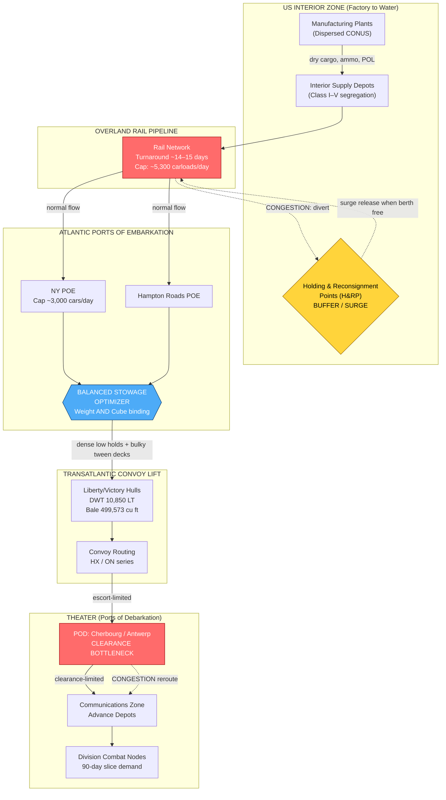

Cost: 0.30118

# Chapter 6: The Mechanics of Wholesale Distribution
## Reference Manual & Simulation-Specification Document
### US Army Green Book — *Global Logistics and Strategy: 1943–1945*

---

## 1. Strategic Context & Modern Historical Perspective

### 1.1 The Strategic Paradox: Plans Versus Physics

The central intellectual tension of wholesale distribution in 1943–1945 is that Allied grand strategy was conceived in the abstract currency of *divisions*, *combat troops*, and *target dates*, while the physical world imposed its accounting in an entirely incommensurate currency: **deadweight tons, measurement tons, cubic bale capacity, berth-days, and freight-car turnaround cycles.** The strategic planners at the Combined Chiefs of Staff level treated shipping as a fungible input, a resource that could be scaled by fiat. The logisticians of the Army Service Forces (ASF) under Lieutenant General Brehon B. Somervell understood, often to their professional despair, that shipping was neither fungible nor infinitely elastic. It was a rigidly bounded pool governed by the immutable geometry of a ship's hull.

The Casablanca Conference (SYMBOL, January 1943) crystallized this paradox. The decision to pursue HUSKY (Sicily) while simultaneously sustaining the buildup for BOLERO (the concentration of US forces in the United Kingdom for a cross-Channel assault) and feeding the Pacific presumed a shipping pool that did not yet exist. TRIDENT (Washington, May 1943) formally set the ROUNDUP/OVERLORD target for May 1944 and demanded that 1.2 million US troops be positioned in the UK. This was a *tonnage* commitment disguised as a *troop* commitment: each division, at roughly 15,000 men, carried a "slice" that when fully supported for ninety days of combat and continuous maintenance required on the order of 60,000–70,000 measurement tons of initial equipment and a sustaining flow thereafter. SEXTANT (Cairo, November 1943) and the concurrent EUREKA (Tehran) locked OVERLORD's date and thereby locked the shipping demand curve — but the ships themselves were being produced on the Kaiser and other emergency yards' schedules, and the *port clearance* infrastructure at the receiving end in the UK and later in France was the binding constraint, not the sea lift itself.

The modern historiographical consensus — informed by the post-war Office of the Chief of Transportation studies, Leighton and Coakley's foundational two-volume treatment, and later declassified War Shipping Administration (WSA) allocation records — is that the true bottleneck migrated across the pipeline over time. In 1942 it was hull availability. Through most of 1943 it was **cargo-handling and port clearance capacity at both the Atlantic Ports of Embarkation (POEs) and the overseas ports of debarkation**. By late 1944, in the European Theater, it was inland clearance (the notorious Cherbourg and Antwerp congestion, the Red Ball Express as a symptom of failed rail restoration). A high-fidelity simulator must therefore model the *bottleneck as a migrating state variable*, not a fixed parameter.

### 1.2 Inter-Service and Coalition Tensions

Command friction in wholesale distribution was structural, not personal. The **Services of Supply / Army Service Forces** controlled the flow from factory to POE and owned the loading decision at the water's edge. But the **theater commanders** and their communications-zone (COMZ) organizations owned the receiving end and generated the requisitions. The chronic pathology was the mismatch between what a theater *requisitioned* (expressed in supply classes and often padded for insurance) and what the POE could physically *load in balanced fashion*. A theater demanding vast tonnages of ammunition (extremely dense, ~high long-ton content, low cube) and vehicles (extremely bulky, low weight-per-cube) in the wrong ratio would force the POE either to sail weight-limited ships (holds full of shells, upper decks empty) or volume-limited ships (decks jammed with trucks, riding high and light). Either failure wasted the scarcest strategic resource: ship-days.

The **Army–Navy** tension was acute in the Pacific, where the Navy controlled the amphibious lift and the forward "combat loading" doctrine (loading for tactical unloading priority rather than maximum stowage efficiency) directly sacrificed cargo density for operational flexibility. Combat-loaded vessels routinely achieved only 50–60% of their theoretical measurement-ton capacity. This was a deliberate and correct trade — you cannot unload a beachhead in requisition order — but it multiplied the number of hulls required per assault and thus rippled backward into the global allocation.

The **US–British pooling arrangements**, formalized through the Combined Shipping Adjustment Board (CSAB), were a constant negotiation over who bore the "administrative" and "hump" losses. British import requirements (the UK's civilian survival ration of food, fuel, and raw materials) competed directly with US military buildup for the same North Atlantic hulls. Modern analysis confirms that the 1943 shipping crisis was resolved less by a single decisive event than by the *compound* effect of new construction outpacing U-boat sinkings after May 1943 (Black May), the introduction of convoy escort carriers, and — critically — the ruthless improvement in **turnaround efficiency** at both ends. Turnaround improvement was, in effect, the manufacture of "synthetic tonnage": every day shaved off a round-trip cycle added the equivalent of new hulls to the pool without a single new keel.

### 1.3 Historical Era Context: The Physical Mechanics

This chapter's proper subject is the *plumbing* of the pipeline: the movement of matériel from dispersed US factories, through interior depots, to the POEs, and thence across the water. Its intellectual core is the **balanced loading problem**. A Liberty ship (EC2-S-C1) had a deadweight tonnage of roughly 10,850 long tons and a bale cubic capacity of approximately 499,000 cubic feet. The relationship between these two numbers, mediated by the **stowage factor** of the cargo (cubic feet per long ton), determines whether a ship "weighs out" or "cubes out." Balanced loading — stowing dense cargo (ammunition, steel, canned goods) low in the holds and bulky cargo (vehicles, aircraft, engineer equipment) in the upper 'tween decks — was the art of driving both constraints to simultaneous exhaustion.

### 1.4 Modern Analytical Insights

The modern reframing is unambiguous: **this is a two-constraint linear program, a continuous knapsack variant.** A ship reaching only its weight limit while half-empty in cube has "sunk to its draft lines" on dense cargo, wasting cubic capacity. A ship full of cube but riding high has wasted lift. The optimal loading achieves **simultaneous binding** of both constraints, and the mathematical condition for this is that the blended stowage factor of the total cargo mix equals the ship's characteristic ratio (bale cube ÷ deadweight). Post-war operations research — much of it seeded by the very transportation officers who lived this problem — recognized wholesale distribution as one of the first industrial-scale applications of what would become linear programming (Dantzig's simplex method emerged from precisely this milieu of Air Force and Army programming problems). Our simulator treats the loading decision as a solvable optimization at each POE-day, with the objective of maximizing measurement-ton throughput subject to the joint constraints.

---

## 2. High-Fidelity Simulation Parameters & Real-World Metrics

| Parameter | Historical Value | Explanation & Strategic Rationale | Simulation Representation |
|---|---|---|---|
| **Peak overland rail carloads/day at Atlantic POEs (late 1943)** | ~**5,000–5,300 carloads/day** (aggregate NYPOE + Hampton Roads + others; NY alone peaking near 3,000+) | Represents the maximum interior-clearance flow the POE complex could absorb without backing up onto the rail net. Exceeding this triggered embargoes and diversion to H&RPs. | **Dynamic capacity cap** on inbound edge to POE node; overflow generates congestion penalty and reroute to holding points. |
| **Standard density / stowage ratio for ship planning** | **40 cubic feet = 1 measurement ton**; general planning density often taken as ~**2.5 measurement tons per long ton** for mixed military cargo (i.e., ~100 cu ft per long ton effective for typical mixed loads) | Defines the conversion between the two accounting currencies. The 40 cu ft/MT is the *definition* of a measurement ton; the ~100 cu ft/long ton reflects average military cargo bulkiness. | **Static constant** (40 cu ft/MT is an axiom); the mix stowage factor is a **cargo-class efficiency coefficient**. |
| **Average freight-car turnaround time (US pipeline, 1943)** | ~**14–15 days** per car round-trip cycle (loaded interior → POE → release → return); heavily degraded by port congestion which could push effective detention to 20+ days | Governs the *effective* count of available freight cars. Slower turnaround = fewer cars available = reduced factory-to-POE flow. This was the interior analog of ship turnaround. | **Efficiency coefficient** modulating rolling-stock availability; degrades under POE congestion state. |
| **Liberty ship deadweight** | **10,850 long tons** | Baseline weight lift capacity. | Static per-vessel constant. |
| **Liberty ship bale cubic capacity** | **~499,573 cu ft** | Baseline volume capacity. | Static per-vessel constant. |
| **Liberty characteristic ratio (cube/DWT)** | **~46 cu ft/long ton** | The ship's intrinsic "balance point"; cargo blended stowage factor must equal this for simultaneous binding. Since typical military cargo is far bulkier (~100+ cu ft/LT), Liberties almost always **cubed out before weighing out** unless deliberately ballasted with dense cargo. | Derived static constant per vessel class. |
| **Combat-loading efficiency (Pacific amphib)** | **~50–60%** of measurement-ton capacity realized | Tactical loading sacrifices stowage for unload priority. | Efficiency coefficient applied to theater-specific load doctrine. |
| **Long ton** | **2,240 lb** | The Army/Navy standard mass unit for shipping. | Static constant. |
| **Measurement ton** | **40 cu ft** | The volume-based freight unit. | Static constant. |

---

## 3. Logistical Network Topology



---

## 4. Mathematical Modeling & Simulation Formulas

### 4.1 Decision Variables and Constants

Let:
- $M_{heavy}$ = long tons of dense (heavy) cargo loaded (decision variable)
- $M_{light}$ = long tons of bulky (light) cargo loaded (decision variable)
- $S_f$ = stowage factor of heavy cargo (cu ft per long ton), typically small (e.g., ammunition ≈ 30–45)
- $S_l$ = stowage factor of light cargo (cu ft per long ton), large (e.g., vehicles ≈ 130–180)
- $W_{max}$ = vessel deadweight capacity (long tons)
- $V_{max}$ = vessel bale cubic capacity (cu ft)

### 4.2 The Balanced Loading Program

We maximize total measurement-ton throughput. Since 1 measurement ton = 40 cu ft, and total lift value is proportional to weight moved, the canonical objective maximizes total delivered long tons subject to the joint constraints:

$$\max_{M_{heavy}, M_{light}} \; Z = M_{heavy} + M_{light}$$

subject to the **volume (cube) constraint**:

$$S_f \cdot M_{heavy} + S_l \cdot M_{light} \le V_{max}$$

the **weight (deadweight) constraint**:

$$M_{heavy} + M_{light} \le W_{max}$$

and non-negativity:

$$M_{heavy} \ge 0, \quad M_{light} \ge 0$$

### 4.3 The Simultaneous-Binding (Balanced) Solution

The optimal balanced load drives **both** constraints to equality. Solving the two equalities simultaneously:

$$S_f \cdot M_{heavy} + S_l \cdot M_{light} = V_{max}$$
$$M_{heavy} + M_{light} = W_{max}$$

Substituting $M_{light} = W_{max} - M_{heavy}$:

$$S_f \cdot M_{heavy} + S_l (W_{max} - M_{heavy}) = V_{max}$$

$$M_{heavy} (S_f - S_l) = V_{max} - S_l \cdot W_{max}$$

$$\boxed{M_{heavy} = \frac{V_{max} - S_l \cdot W_{max}}{S_f - S_l}, \qquad M_{light} = W_{max} - M_{heavy}}$$

### 4.4 Feasibility and Interpretation

A **balanced solution** with both $M_{heavy}, M_{light} \ge 0$ exists only when the ship's characteristic ratio lies between the two stowage factors:

$$S_f \le \frac{V_{max}}{W_{max}} \le S_l$$

- If $\frac{V_{max}}{W_{max}} < S_f$: even the densest cargo cannot fill the cube → ship **cubes out light** (weight-limited impossible; volume binds first). The vessel weighs out only with all-heavy cargo.
- If $\frac{V_{max}}{W_{max}} > S_l$: even the bulkiest cargo cannot exhaust the weight → ship **weighs out** never; volume binds. All-light cargo still leaves weight capacity idle.

For a Liberty ($V_{max}/W_{max} \approx 46$ cu ft/LT), and typical military stowage factors $S_f \approx 40$, $S_l \approx 160$, the balance condition $40 \le 46 \le 160$ **holds**, confirming that a balanced mix exists — but it is heavily weighted toward dense cargo, which historically explains the constant Army search for "heavy lift" (ammunition, rations) to ballast the bulky vehicle streams.

---

## 5. Compile-Safe Scala 3.8.3 Domain Model

```scala
package Logistics.Distribution

import scala.math.max
import scala.math.min

opaque type LongTons = Double
object LongTons:
  def apply(v: Double): LongTons = v
  extension (t: LongTons)
    def value: Double = t
    def +(o: LongTons): LongTons = t + o
    def clampNonNeg: LongTons = max(0.0, t)

opaque type CubicFeet = Double
object CubicFeet:
  def apply(v: Double): CubicFeet = v
  extension (c: CubicFeet)
    def value: Double = c

opaque type StowageFactor = Double
object StowageFactor:
  def apply(v: Double): StowageFactor = v
  extension (s: StowageFactor)
    def value: Double = s

opaque type MeasurementTons = Double
object MeasurementTons:
  def apply(v: Double): MeasurementTons = v
  extension (m: MeasurementTons)
    def value: Double = m

enum LoadState:
  case WeightBound
  case VolumeBound
  case Balanced
  case Infeasible

final case class VesselConstraints(weightCapacityTons: Double, volumeCapacityCuFt: Double):
  def characteristicRatio: Double =
    if weightCapacityTons <= 0.0 then Double.PositiveInfinity
    else volumeCapacityCuFt / weightCapacityTons

final case class CargoProperties(heavyStowageFactor: Double, lightStowageFactor: Double):
  require(heavyStowageFactor > 0.0, "heavy stowage factor must be positive")
  require(lightStowageFactor > 0.0, "light stowage factor must be positive")
  require(lightStowageFactor > heavyStowageFactor, "light cargo must be bulkier than heavy")

final case class LoadPlan(
  heavyTons: Double,
  lightTons: Double,
  state: LoadState,
  usedVolumeCuFt: Double,
  measurementTons: Double
):
  def totalTons: Double = heavyTons + lightTons

object DistributionOptimizer:

  private val CuFtPerMeasurementTon: Double = 40.0

  def calculateMaxCargo(
    v: VesselConstraints,
    c: CargoProperties
  ): (Double, Double) =
    val heavy: Double =
      (v.volumeCapacityCuFt - v.weightCapacityTons * c.lightStowageFactor) /
        (c.heavyStowageFactor - c.lightStowageFactor)
    val light: Double = v.weightCapacityTons - heavy
    (heavy, light)

  def classify(v: VesselConstraints, c: CargoProperties): LoadState =
    val ratio: Double = v.characteristicRatio
    if v.weightCapacityTons <= 0.0 || v.volumeCapacityCuFt <= 0.0 then LoadState.Infeasible
    else if ratio < c.heavyStowageFactor then LoadState.VolumeBound
    else if ratio > c.lightStowageFactor then LoadState.WeightBound
    else LoadState.Balanced

  def optimize(v: VesselConstraints, c: CargoProperties): LoadPlan =
    classify(v, c) match
      case LoadState.Infeasible =>
        LoadPlan(0.0, 0.0, LoadState.Infeasible, 0.0, 0.0)

      case LoadState.Balanced =>
        val (h0, l0): (Double, Double) = calculateMaxCargo(v, c)
        val heavy: Double = max(0.0, h0)
        val light: Double = max(0.0, l0)
        val usedVol: Double =
          heavy * c.heavyStowageFactor + light * c.lightStowageFactor
        LoadPlan(heavy, light, LoadState.Balanced, usedVol, usedVol / CuFtPerMeasurementTon)

      case LoadState.WeightBound =>
        val heavy: Double = 0.0
        val light: Double = v.weightCapacityTons
        val usedVol: Double = light * c.lightStowageFactor
        val cappedVol: Double = min(usedVol, v.volumeCapacityCuFt)
        LoadPlan(heavy, light, LoadState.WeightBound, cappedVol, cappedVol / CuFtPerMeasurementTon)

      case LoadState.VolumeBound =>
        val heavy: Double = v.volumeCapacityCuFt / c.heavyStowageFactor
        val cappedHeavy: Double = min(heavy, v.weightCapacityTons)
        val usedVol: Double = cappedHeavy * c.heavyStowageFactor
        LoadPlan(cappedHeavy, 0.0, LoadState.VolumeBound, usedVol, usedVol / CuFtPerMeasurementTon)

  def volumeUtilization(plan: LoadPlan, v: VesselConstraints): Double =
    if v.volumeCapacityCuFt <= 0.0 then 0.0
    else min(1.0, plan.usedVolumeCuFt / v.volumeCapacityCuFt)

  def weightUtilization(plan: LoadPlan, v: VesselConstraints): Double =
    if v.weightCapacityTons <= 0.0 then 0.0
    else min(1.0, plan.totalTons / v.weightCapacityTons)

final case class RailPipelineState(
  carloadsPerDayCap: Int,
  turnaroundDays: Double,
  congestionFactor: Double
):
  require(congestionFactor >= 1.0, "congestion factor cannot improve turnaround below nominal")

  def effectiveTurnaround: Double = turnaroundDays * congestionFactor

  def effectiveCarloadsPerDay: Double =
    carloadsPerDayCap.toDouble / congestionFactor

object PipelineSimulator:

  private val LibertyDeadweightTons: Double = 10850.0
  private val LibertyBaleCubicFeet: Double  = 499573.0
  private val PeakAtlanticCarloadsPerDay: Int = 5300
  private val NominalTurnaroundDays: Double = 14.5

  def libertyVessel: VesselConstraints =
    VesselConstraints(LibertyDeadweightTons, LibertyBaleCubicFeet)

  def nominalRail: RailPipelineState =
    RailPipelineState(PeakAtlanticCarloadsPerDay, NominalTurnaroundDays, 1.0)

  def congestedRail(severity: Double): RailPipelineState =
    val clamped: Double = max(1.0, severity)
    RailPipelineState(PeakAtlanticCarloadsPerDay, NominalTurnaroundDays, clamped)

  def runScenario(
    vessel: VesselConstraints,
    cargo: CargoProperties,
    rail: RailPipelineState
  ): (LoadPlan, Double, Double) =
    val plan: LoadPlan = DistributionOptimizer.optimize(vessel, cargo)
    val throughputCars: Double = rail.effectiveCarloadsPerDay
    val turnaround: Double = rail.effectiveTurnaround
    (plan, throughputCars, turnaround)

@main def demonstrateDistribution(): Unit =
  val vessel: VesselConstraints = PipelineSimulator.libertyVessel
  val ammoAndVehicles: CargoProperties = CargoProperties(40.0, 160.0)
  val plan: LoadPlan = DistributionOptimizer.optimize(vessel, ammoAndVehicles)
  val volUtil: Double = DistributionOptimizer.volumeUtilization(plan, vessel)
  val wtUtil: Double = DistributionOptimizer.weightUtilization(plan, vessel)
  val rail: RailPipelineState = PipelineSimulator.congestedRail(1.4)

  println(s"Load state: ${plan.state}")
  println(f"Heavy cargo (long tons): ${plan.heavyTons}%.1f")
  println(f"Light cargo (long tons): ${plan.lightTons}%.1f")
  println(f"Total lift (long tons):  ${plan.totalTons}%.1f")
  println(f"Measurement tons:        ${plan.measurementTons}%.1f")
  println(f"Volume utilization:      ${volUtil * 100.0}%.1f%%")
  println(f"Weight utilization:      ${wtUtil * 100.0}%.1f%%")
  println(f"Eff. carloads/day:       ${rail.effectiveCarloadsPerDay}%.0f")
  println(f"Eff. turnaround (days):  ${rail.effectiveTurnaround}%.1f")
```

---

## 6. Graduate-Level Operational Analysis

### 6.1 The Purpose of Holding & Reconsignment Points (H&RPs)

**Holding and Reconsignment Points** were the *elastic buffer* of the American interior distribution system — the shock absorbers interposed between a rigid, continuously producing factory base and a discontinuously consuming set of ports whose absorptive capacity fluctuated with berth availability, ship arrival schedules, and stowage requirements. To understand their function, one must grasp the fundamental impedance mismatch of the pipeline: **factories produce at a steady rate; ports discharge cargo into ships in discrete, lumpy, schedule-dependent batches.** Without a buffer, this mismatch propagates catastrophically backward.

The pathology H&RPs prevented was **port congestion by loaded freight cars**. In 1942 and early 1943, before the H&RP doctrine matured, matériel was consigned directly from depots to specific POEs against anticipated sailings. When a ship was delayed — by convoy assembly, by weather, by U-boat rerouting, by a shift in theater priorities — the cargo destined for it arrived at the port anyway, in loaded freight cars, and simply *sat*. Because a loaded car sitting on port trackage is a car removed from the national rolling-stock pool, the effect was doubly damaging: it choked the port's own switching capacity (physically blocking the tracks needed to spot cars at the actual ship's side) **and** it extended freight-car turnaround time across the entire network. Recall from §2 that turnaround directly governs the effective size of the car fleet. Congestion that pushed the nominal ~14.5-day cycle out to 20+ days was, in fleet-availability terms, equivalent to *scrapping* a large fraction of the boxcar inventory. The Association of American Railroads and the Office of Defense Transportation repeatedly warned that port embargoes — refusals to accept further consignments — were the inevitable and system-crippling endpoint.

The H&RP solved this by **decoupling the consignment decision from the loading decision in both time and space.** Cargo was shipped forward to an H&RP (large inland yards with warehousing and open storage, positioned behind but with good rail connectivity to the POEs) *on a general priority basis rather than against a specific ship.* There it was unloaded from cars — **releasing the rolling stock immediately back into the pool** — and held in reserve. When a specific vessel's requirements crystallized at the POE (its exact stowage plan being computable only once the ship, its cube, its deadweight, and its balanced-loading needs were known), the POE would **reconsign** precisely the mix of dense and bulky cargo required from the H&RP, timed to arrive just as the berth came free. This is, in modern terms, a **decoupling inventory buffer that converts a push system into a pull system at the water's edge** — a just-in-time discipline decades before Toyota formalized it.

In simulation terms (see §3), the H&RP is a buffer node that absorbs the overflow whenever inbound rail flow exceeds the POE's instantaneous carload-clearance cap. It converts a would-be congestion penalty (extended turnaround, blocked berths) into a bounded storage cost, and it re-emits cargo on a *pull* signal from the stowage optimizer. Its strategic genius was recognizing that the scarce resource to protect was not warehouse space but **rolling-stock cycle time and berth-side track fluidity.**

### 6.2 Measurement Tons Versus Long Tons — The Dual Currency of Ship Planning

The distinction between the **Measurement Ton (40 cubic feet)** and the **Long Ton (2,240 pounds)** is not pedantic bookkeeping; it is the mathematical heart of the entire balanced-loading problem articulated in §4, and misunderstanding it produced some of the war's most expensive shipping inefficiencies.

A **Long Ton is a unit of mass** — 2,240 pounds, the British/American maritime standard (as distinct from the 2,000-pound "short ton" of American commerce and the 1,000-kilogram metric tonne). It measures how heavily a ship is loaded, and it maps directly onto the ship's **deadweight tonnage (DWT)** and thus onto its *draft* — how deep the hull sits in the water. A ship can only accept so many long tons before it settles to its load-line marks (the Plimsoll line); loading beyond that is illegal and unseaworthy.

A **Measurement Ton is a unit of volume** — precisely 40 cubic feet. It measures how much *space* cargo occupies in the hold. It maps onto the ship's **bale cubic capacity** — the usable enclosed volume for stowage.

The vital insight is that these two constraints are **independent and non-substitutable**, and every item of cargo is characterized by its **stowage factor** — the ratio of its volume to its weight, expressed in cubic feet per long ton. This single number determines which constraint the cargo will exhaust first:

- **Dense cargo** (ammunition ~30–45 cu ft/LT, steel, canned rations) has a *low* stowage factor. A ship loaded exclusively with it hits its **long-ton limit** — it "weighs out," sinking to its draft lines — while vast **measurement-ton (cubic) capacity** sits empty above the cargo. The scarce resource wasted is *space*.

- **Bulky cargo** (trucks ~130–180 cu ft/LT, aircraft, engineer equipment, packaged POL) has a *high* stowage factor. A ship loaded exclusively with it hits its **measurement-ton limit** — it "cubes out," full to the hatches — while riding high and light, its **long-ton (deadweight) capacity** grossly underused. The scarce resource wasted is *lift*.

Ship planning was vital *because you cannot convert one currency into the other.* You cannot pour more shells into a full ship, nor can you make a full-but-light ship heavier without dense cargo to add. As shown in §4.4, the Liberty ship's characteristic ratio of ~46 cu ft/LT sits far below the stowage factor of typical bulky military cargo (~100+), which means the American military stream was chronically **cube-limited** — ships filling their holds with trucks and equipment long before reaching their weight limit. This is precisely why transportation officers waged a relentless campaign to secure **dense "ballast" cargo** (ammunition, rations, structural steel) to stow low in the holds: not because the theater necessarily demanded it in that ratio, but because without it the ship sailed at perhaps 60% of its potential deadweight, wasting the war's single scarcest strategic commodity — the ship-voyage.

The planner's true objective, therefore, was to compose a cargo *mix* whose **blended stowage factor equaled the ship's characteristic ratio**, driving both the long-ton and measurement-ton constraints to simultaneous exhaustion — the "Balanced" state in the §5 model. Achieving it required knowing, item by item, both the weight and the cube of everything in the requisition, and solving in real time the small linear program of §4.3. The dual-currency accounting was thus not an artifact of arcane maritime custom but the *irreducible representation of a two-dimensional packing constraint*, and the entire apparatus of manifests, stowage plans, and the H&RP pull system existed to solve it optimally, one hull at a time.
