Cost: 0.39121375

## 1. Strategic Context & Modern Historical Perspective

Chapter 6 of *Global Logistics and Strategy: 1943–1945* addresses the least dramatic but perhaps most determinative level of coalition warfare: wholesale distribution. Its subject is not simply transportation. It is the conversion of industrial output into a continuous, controlled flow of militarily useful cargo through factories, storage depots, railroads, ports of embarkation, ocean shipping, theater ports, and overseas depots. At every stage, nominal quantities had to be translated into physically compatible units—railcar loads, long tons, measurement tons, ship deadweight, bale cubic, hatch capacity, berth-days, truck tons, and depot days of supply.

The central historical lesson is that military supply was a coupled network rather than a collection of independent transportation systems. A factory could exceed its production target while the associated theater remained undersupplied. A port could load every available ship yet fail strategically because the cargo mix was wrong. A convoy could arrive safely but immobilize an overseas port if its manifests, hatch distribution, or discharge sequence did not correspond to theater priorities. Wholesale distribution therefore involved optimization across the entire pipeline, not local maximization at any single node.

### The strategic paradox

The major Allied conferences—Casablanca in January 1943, TRIDENT in May, QUADRANT in August, and SEXTANT in November–December—produced increasingly ambitious programs for simultaneous operations in Europe, the Mediterranean, the Pacific, China-Burma-India, and the strategic air war. Each decision generated transportation requirements well before it generated battlefield effects. A strategic decision to enlarge the bomber offensive required aircraft, engines, bombs, aviation gasoline, airfield construction machinery, replacement crews, and recurring maintenance stocks. A decision to mount an amphibious operation required not merely troops and supplies but specialized assault shipping, landing craft, combat loaders, naval escorts, staging installations, and ports capable of handling the follow-up echelon.

The paradox was that strategic plans could be expanded on paper more rapidly than the physical carrying system could be expanded in reality. Shipbuilding was producing enormous tonnage by 1943, but the relevant resource was never simply the number of merchant hulls. Effective lift was a function of:

- ship deadweight and bale-cubic capacity;
- suitability for the cargo to be carried;
- loading and discharge time;
- convoy assembly and routing;
- escort availability;
- voyage distance;
- port turnaround;
- repair and maintenance time;
- losses, diversions, and weather;
- the proportion of ships tied up in theater retention or cross-theater service.

A Liberty ship in the North Atlantic shuttle might complete several voyages in the time needed for one round trip to India, the Persian Gulf, Australia, or the Southwest Pacific. Thus, allocating one ship to a distant theater imposed a substantially greater annual opportunity cost than allocating the same hull to the United Kingdom. Shipping allocation had to be evaluated in ton-miles and ship-days, not merely in tons embarked.

Nor was all shipping interchangeable. A ship configured for commercial bulk loading was not automatically suitable for an amphibious assault. Combat loading deliberately sacrificed some maximum cargo efficiency so that troops, vehicles, ammunition, and equipment could be discharged in the tactical order required ashore. A commercially loaded ship sought dense stowage and minimum broken space; a combat-loaded vessel sought accessibility, redundancy, tactical sequence, and rapid selective discharge. Strategic planners frequently reasoned in aggregate tons, while naval and port operators faced differentiated requirements for hull type, hatch access, heavy-lift gear, refrigeration, tanker space, and landing craft.

Port clearance added another hard boundary. A port was not merely a collection of berths. Its effective capacity was the minimum throughput of its anchorage, channels, berths, cranes, transit sheds, labor gangs, documentation system, rail sidings, truck fleet, storage area, and inland clearance routes. Adding ships to a saturated port reduced rather than increased system performance. Vessels waited at anchor, railcars accumulated in yards, cargo occupied transit sheds, and labor productivity deteriorated as consignments became intermixed or inaccessible.

Consequently, the strategic plans made at Casablanca, TRIDENT, QUADRANT, and SEXTANT were constrained by a worldwide resource-allocation problem. The Combined Chiefs of Staff could assign strategic priorities, but those priorities had to survive several lower-level transformations: into troop bases, equipment tables, monthly supply requirements, procurement schedules, depot releases, rail movements, shipping space, convoy programs, and theater discharge plans. Every transformation introduced delay and uncertainty.

### Inter-service and coalition tensions

The Services of Supply, renamed the Army Service Forces in March 1943, viewed distribution as a system requiring stability, advance forecasts, standardized procedures, and control over requisitions. Combat commands viewed supply priorities as subordinate to operational opportunity. Their demands could change abruptly after intelligence assessments, tactical reverses, command decisions, or shifts in operational timing. What the Army Service Forces regarded as destabilizing last-minute changes, combat commanders could regard as indispensable responsiveness.

This divergence appeared in the conflict between automatic supply and requisition-based supply. Automatic supply—shipping predetermined quantities according to troop strength or replacement factors—reduced administrative delay but risked sending commodities already abundant in theater. Requisitioning was more responsive to actual stocks but depended on accurate theater records and incurred long communication and procurement lead times. In practice, the Army employed mixed systems, including automatic issues for predictable consumables and requisitions for variable or specialized items.

Army–Navy friction arose because the Army controlled much of the inland pipeline and most Army cargo, whereas the Navy controlled convoying, naval auxiliary shipping, many combat-loading decisions, and much of amphibious scheduling. A vessel’s nominal sailing date was meaningless unless Army cargo arrival, port loading, convoy assembly, escort availability, and naval routing were synchronized. The Navy might prioritize tactical readiness and convoy security; the Army might prioritize maximum cargo lift and regularized sailings. Amphibious operations sharpened the dispute because tactical loading reduced the amount of cargo carried per ship and held valuable vessels in staging or operational pools.

Coalition arrangements added another level of complexity. The British had entered the war with a worldwide maritime system, imperial bases, and established shipping controls, while the United States supplied rapidly growing industrial output and ship construction. Combined shipping arrangements had to reconcile British import requirements, American troop deployments, Lend-Lease, civilian essentials, and operational priorities. “Pooling” never meant that all ships became perfectly fungible or that national interests disappeared. Governments retained concerns about flag, crew, routing, postwar shipping positions, colonial supply, and domestic import requirements.

Modern scholarship has emphasized that coalition shipping was governed through negotiated scarcity rather than purely technocratic optimization. The Combined Shipping Adjustment Board and associated Anglo-American agencies could calculate availability, but allocation remained political. A shipping program expressed coalition strategy in material form: assigning hulls to one route necessarily delayed or reduced another movement.

### The material mechanics of balanced loading

The chapter’s most important technical point is that cargo has at least two independent physical dimensions: weight and volume. A vessel has a maximum permissible deadweight and a finite internal stowage volume, usually expressed as bale cubic for packaged cargo. These constraints rarely become binding at exactly the same time unless the cargo mix is deliberately balanced.

Dense cargo—steel, ammunition, rails, machinery, canned goods, and some engineer stores—uses relatively little volume per ton. A ship loaded only with such cargo reaches its load line and deadweight limit while substantial cubic space remains unused. The unused volume cannot safely be filled because additional weight would exceed draft, structural, stability, or displacement limits.

Bulky cargo—trucks, crated aircraft, empty containers, tentage, certain signal equipment, and assembled vehicles—fills holds and upper spaces before the ship approaches its deadweight limit. The vessel then “cubes out”: it is volumetrically full but underloaded by weight.

Balanced loading combined dense and bulky commodities so that weight and cubic constraints approached saturation together. Dense cargo normally went low in the holds, contributing to stability and reserving upper spaces for lighter cargo. Bulky or comparatively fragile items were placed in upper holds, tween decks, deck spaces, or specially configured locations. Stowage planning also had to observe cargo compatibility, hazardous-material segregation, port rotation, hatch accessibility, heavy-lift limitations, and the sequence of discharge.

The governing concept is an average stowage factor:

$$
\bar{s}=\frac{\text{total cubic feet occupied}}{\text{total long tons loaded}}.
$$

If a ship could carry 10,000 long tons and had 500,000 cubic feet of usable bale capacity, its geometric balancing point was approximately 50 cubic feet per long ton. Cargo averaging substantially less than 50 cubic feet per ton would tend to exhaust deadweight first. Cargo averaging substantially more would tend to exhaust cubic capacity first.

The measurement ton complicated planning because it was a volume unit, not a weight unit. One measurement ton equaled 40 cubic feet. Thus, a shipment of 400,000 cubic feet represented 10,000 measurement tons regardless of its weight. Port and shipping reports that mixed measurement tons with long tons could create false impressions of lift or throughput unless the unit basis was explicit.

### Modern systems interpretation

From a modern operations-research perspective, wholesale distribution was a multicommodity, capacitated, time-expanded network with stochastic delays and both weight and volume constraints. The system’s throughput was governed by bottlenecks that migrated over time. Rail capacity might be limiting during a concentrated deployment; later the constraint might shift to port storage, ship availability, convoy escort, theater discharge, or inland clearance.

Local efficiency could undermine global performance. Dispatching every available railcar toward a port maximized railroad movement but could gridlock the port. Filling a ship with the first available cargo maximized short-term berth productivity but might waste deadweight or deliver the wrong operational assortment. Holding cargo at depots could appear inefficient in inventory terms while protecting scarce port space and preserving routing flexibility.

Holding and Reconsignment Points embodied this systems logic. They converted the uncontrolled arrival of railcars into a regulated release process. Cargo remained mobile in a legal and documentary sense but was physically held outside the congested port area until a berth, ship, or storage location was ready. These points were therefore not passive parking yards; they were control buffers that decoupled variable inland arrivals from variable vessel-loading demand.

Postwar analysis also makes clear that the United States succeeded not because scarcity disappeared, but because institutions became better at managing it. Traffic-control agencies, port commanders, depot systems, standardized documentation, improved car utilization, increasingly accurate theater stock reports, and combined shipping machinery reduced uncertainty and prevented individual bottlenecks from propagating unchecked through the global network.

---

## 2. High-Fidelity Simulation Parameters & Real-World Metrics

The historical figures below should be stored with provenance and precision metadata. Several wartime reports used rounded operating figures rather than modern statistically normalized series.

| Parameter | Historical value | Unit and basis | Historical interpretation | Recommended simulation representation |
|---|---:|---|---|---|
| Peak rail arrivals at Atlantic ports in late 1943 | **Approximately 9,000 carloads per day** | Loaded export-freight cars arriving across the Atlantic port system on peak operating days | The chapter describes the late-1943 flow at roughly nine thousand daily carloads. It is a systemwide peak, not a sustainable capacity for one port and not an annual daily average. The number demonstrates why unrestricted direct routing to waterfront terminals was impossible. | Store `9,000 cars/day` as a **nominal peak arrival scenario**, with port-specific capacities beneath it. Apply stochastic day-to-day variation and distinguish arrival demand from accepted terminal throughput. |
| Measurement-ton standard | **40 cubic feet per measurement ton** | Volumetric shipping unit | A measurement ton records occupied cargo volume. It is not a mass unit and must not be added directly to long tons. One cargo lot occupying 4,000 cubic feet equals 100 measurement tons regardless of whether it weighs 30 or 150 long tons. | Static exact conversion constant: `1 MTon = 40 ft³`. Preserve both physical weight and physical volume in every cargo record; derive measurement tons only for reports and tariffs. |
| Average freight-car turnaround in 1943 | **Approximately 14 days** | Elapsed time from one loading cycle to availability for the next comparable load; wartime statistics were commonly rounded | Reduced turnaround increased effective rail capacity without manufacturing an equivalent number of new cars. The figure includes more than line-haul travel: classification, loading, unloading, terminal dwell, documentation, and empty repositioning were major components. | Use `14 days` as a **baseline cycle-time coefficient**, not a hard travel time. Decompose it into route transit, classification dwell, H&RP dwell, terminal dwell, unloading, and empty return. Congestion should increase the realized cycle above baseline. |
| Long ton | **2,240 pounds** | Weight or mass accounting unit | Standard British and maritime weight ton used in much wartime ocean-shipping documentation. | Exact conversion constant. If SI units are used internally, `1 long ton ≈ 1,016.0469088 kg`. |
| Short ton | **2,000 pounds** | US customary weight unit | Frequently used in domestic industrial and rail contexts. Confusing short and long tons introduces a 12 percent error relative to the short-ton value. | Exact conversion constant, always accompanied by a unit discriminator. |
| Nominal average-density benchmark | **40 ft³ per long ton = 1 measurement ton per long ton** | Comparison ratio, not a universal ship design constant | Cargo at this density has equal numerical long-ton and measurement-ton values. A particular ship’s true balancing stowage factor is its usable bale cubic divided by cargo deadweight and was often nearer 45–55 ft³ per long ton. | Store `40 ft³/long ton` as a reporting benchmark. Compute vessel-specific balance density dynamically as $V_{\max}/W_{\max}$. |
| Rail release-control rule | **Release only against port call-forward authority** | Operational policy | H&RPs withheld cars until the port confirmed that a consignee, terminal, depot, or named vessel could receive them. | Model as a gate condition. A car transitions from `Held` to `Released` only if downstream reservation capacity exists. |
| Practical vessel weight utilization target | **0.95–0.99 of permitted cargo deadweight** | Planning coefficient | Weather, bunkers, stability margins, uncertain weights, and broken stowage often made a theoretical 100 percent target unsafe. | Dynamic policy coefficient by vessel, cargo confidence, route, and season. |
| Practical cubic utilization target | **0.85–0.95 of usable bale cubic** | Planning coefficient | Dunnage, irregular packages, structural obstructions, access lanes, segregation, and hatch geometry created broken stowage. | Apply a cargo- and vessel-specific broken-stowage factor to nominal bale cubic. |
| H&RP congestion threshold | **80–90 percent of physical track capacity** | Control-policy range | Above this range, classification and retrieval become slower because cars block one another and switching moves multiply. | Use a nonlinear queue-delay function beginning near 0.80 utilization and becoming severe above 0.90. |

### Provenance and implementation caution

The 9,000-car figure and fourteen-day turnaround are rounded wartime planning magnitudes reported in the Green Book’s treatment of domestic distribution and rail control. They should not be given false precision. A database record should therefore contain fields such as:

- `value`;
- `unit`;
- `timePeriod`;
- `geographicScope`;
- `isPeak`;
- `precisionClass`;
- `sourceSeries`;
- `definition`.

A simulator should not infer that 9,000 cars arriving means 9,000 cars can be unloaded, classified, or returned on the same day. Arrival, acceptance, handling, and clearance are separate capacities.

---

## 3. Logistical Network Topology

```mermaid
flowchart LR
    subgraph CONUS["Continental United States: Production and Wholesale Distribution"]
        F1["Ordnance factories<br/>Ammunition, weapons, steel<br/>Dense cargo"]
        F2["Quartermaster sources<br/>Food, clothing, tentage<br/>Mixed density"]
        F3["Motor and aircraft plants<br/>Vehicles and crated aircraft<br/>Bulky cargo"]
        F4["Petroleum refineries<br/>Packaged POL and bulk fuel"]

        D1["Zone of Interior depots<br/>Stock control and consolidation<br/>Capacity: storage tons and cubic feet"]
        D2["Technical-service depots<br/>Inspection, packing, marking"]
        R1["Rail origin yards<br/>Car assignment and train formation"]
        HRP["Holding and Reconsignment Points<br/>External congestion buffer<br/>Gate: port call-forward authority"]
        ALT["Alternate port routing authority<br/>New York, Hampton Roads,<br/>Boston, Baltimore, Philadelphia"]

        F1 --> D1
        F2 --> D1
        F3 --> D2
        F4 --> D2
        D1 --> R1
        D2 --> R1
        R1 -->|"Loaded cars; nominal late-1943 Atlantic peak ≈ 9,000/day"| HRP
        HRP -->|"If destination terminal available"| POE
        HRP -->|"If primary port saturated"| ALT
        ALT --> POE2
    end

    subgraph PORTS["Ports of Embarkation and Loading Complex"]
        POE["Primary Atlantic POE<br/>Inbound-yard and siding caps"]
        POE2["Alternative Atlantic POE<br/>Spare berth and rail-clearance dependent"]
        CY["Port classification yard<br/>Delay rises nonlinearly with utilization"]
        TS["Transit sheds and staging areas<br/>Finite floor and stacking capacity"]
        PLAN["Cargo planning and manifest control<br/>Priority, destination, compatibility"]
        OPT["Balanced-loading optimizer<br/>Joint deadweight and bale-cubic constraints"]
        HEAVY["Dense lower-hold allocation<br/>Ammunition, steel, machinery"]
        LIGHT["Bulky upper-hold allocation<br/>Vehicles, aircraft, tentage"]
        POL["Bulk-POL segregation<br/>Tanker or specialized storage"]
        BERTH["Berths and loading gangs<br/>Capacity: berth-hours and tons/gang-hour"]
        WAIT["Port delay queue<br/>Cars, cargo, or ships held pending capacity"]

        POE --> CY
        POE2 --> CY
        CY -->|"Accepted cargo"| TS
        CY -->|"Storage or berth unavailable"| WAIT
        WAIT -->|"Capacity restored"| CY
        TS --> PLAN
        PLAN --> OPT
        OPT --> HEAVY
        OPT --> LIGHT
        PLAN --> POL
        HEAVY --> BERTH
        LIGHT --> BERTH
        POL --> TANKER
    end

    subgraph OCEAN["Ocean Transport and Convoy System"]
        SHIP["Dry-cargo vessel<br/>Constraint: W ≤ deadweight<br/>Constraint: V ≤ usable bale cubic"]
        TANKER["Tanker<br/>Liquid-volume, deadweight,<br/>and compartment constraints"]
        ASSAULT["Combat-loaded assault vessel<br/>Reduced utilization for tactical access"]
        CONVOY["Convoy assembly<br/>Escort and sailing-window constraints"]
        ROUTE1["North Atlantic route<br/>Shorter cycle, weather and U-boat risk"]
        ROUTE2["Mediterranean route<br/>Strait, port, and operational constraints"]
        ROUTE3["Long-distance route<br/>Persian Gulf, India, or Pacific<br/>High ship-day cost"]
        DIVERT["Diversion or emergency rerouting<br/>Political and theater-priority decision"]

        BERTH --> SHIP
        BERTH --> ASSAULT
        SHIP --> CONVOY
        ASSAULT --> CONVOY
        TANKER --> CONVOY
        CONVOY --> ROUTE1
        CONVOY --> ROUTE2
        CONVOY --> ROUTE3
        ROUTE1 --> DIVERT
        ROUTE2 --> DIVERT
        ROUTE3 --> DIVERT
    end

    subgraph THEATER["Theater Reception and Final Distribution"]
        ANCH["Anchorage queue<br/>Delay if berth occupancy is saturated"]
        TPORT["Theater port<br/>Berth, crane, lighter, and labor caps"]
        BEACH["Beach or lighter discharge<br/>Weather and landing-craft constraints"]
        CLEAR["Port-clearance system<br/>Rail, truck, barge, and pipeline"]
        BASE["Base depot<br/>Theater reserve and stock balancing"]
        ADV["Advance depot or regulating station"]
        FUEL["Bulk fuel terminal and pipeline"]
        CORPS["Army or corps distribution point"]
        DIV["Division service area<br/>Daily issue and replenishment"]
        COMBAT["Combat formations<br/>Consumption, loss, capture, destruction"]

        DIVERT --> ANCH
        ANCH -->|"Berth available"| TPORT
        ANCH -->|"No berth or draft restriction"| BEACH
        TPORT --> CLEAR
        BEACH --> CLEAR
        CLEAR -->|"Dry cargo"| BASE
        CLEAR -->|"Bulk POL"| FUEL
        BASE --> ADV
        FUEL --> ADV
        ADV --> CORPS
        CORPS --> DIV
        DIV --> COMBAT
    end

    TPORT -. "Clearance failure increases ship turnaround" .-> ANCH
    BASE -. "Excess stock triggers shipment deferral" .-> PLAN
    COMBAT -. "Requisitions and consumption forecasts" .-> PLAN
    WAIT -. "Congestion signal: stop rail releases" .-> HRP
```



The network must be modeled as a feedback system. Theater stock reports alter future depot releases; port congestion suspends H&RP releases; voyage delays reduce future ship availability; and unbalanced loading wastes either weight or cubic capacity.

---

## 4. Mathematical Modeling & Simulation Formulas

### 4.1 Two-class balanced-loading model

Let:

- $M_{\text{heavy}}$ = long tons of dense cargo loaded;
- $M_{\text{light}}$ = long tons of bulky cargo loaded;
- $S_h$ = heavy-cargo stowage factor in cubic feet per long ton;
- $S_l$ = light-cargo stowage factor in cubic feet per long ton;
- $W_{\max}$ = usable cargo deadweight in long tons;
- $V_{\max}$ = usable bale-cubic capacity in cubic feet.

The physical constraints are:

$$
S_h M_{\text{heavy}} + S_l M_{\text{light}} \le V_{\max}
$$

and

$$
M_{\text{heavy}} + M_{\text{light}} \le W_{\max}.
$$

This corresponds to the requested form:

$$
\text{Mathematical Concept: } S_f \cdot M_{heavy} + S_l \cdot M_{light} \le V_{max}
\quad \text{and} \quad
M_{heavy} + M_{light} \le W_{max}.
$$

Here $S_f$ is interpreted as the heavy-freight stowage factor $S_h$.

If both constraints bind, then:

$$
M_{\text{heavy}}+M_{\text{light}}=W_{\max},
$$

$$
S_h M_{\text{heavy}}+S_l M_{\text{light}}=V_{\max}.
$$

Substituting $M_{\text{light}}=W_{\max}-M_{\text{heavy}}$ gives:

$$
M_{\text{heavy}}
=
\frac{V_{\max}-S_lW_{\max}}{S_h-S_l},
$$

and:

$$
M_{\text{light}}
=
W_{\max}-M_{\text{heavy}}.
$$

A feasible interior balance requires:

$$
S_h \le \frac{V_{\max}}{W_{\max}} \le S_l
$$

when $S_h<S_l$. If the vessel’s balancing ratio lies outside this interval, the exact intersection produces a negative cargo amount and the optimum lies on a boundary.

### 4.2 General multicommodity loading model

Let $i\in I$ index cargo classes and $x_i$ be loaded long tons.

Parameters:

- $s_i$: stowage factor, ft³ per long ton;
- $a_i$: available long tons at the port;
- $p_i$: military utility or priority per long ton;
- $h_{ik}$: consumption of handling resource $k$;
- $H_k$: capacity of handling resource $k$;
- $r_i$: required minimum shipment;
- $u_i$: maximum authorized shipment;
- $\beta_i$: broken-stowage multiplier, where $\beta_i\ge1$;
- $q_i$: discrete package or vehicle lot size where indivisibility matters.

A weighted-priority model is:

$$
\max \sum_{i\in I} p_i x_i.
$$

Subject to:

$$
\sum_{i\in I}x_i \le W_{\max},
$$

$$
\sum_{i\in I}\beta_i s_i x_i \le V_{\max},
$$

$$
r_i \le x_i \le \min(a_i,u_i),
$$

$$
\sum_{i\in I}h_{ik}x_i \le H_k
\qquad \forall k,
$$

$$
x_i \ge 0.
$$

For indivisible vehicles, aircraft, or packaged lots:

$$
x_i=q_i n_i,\qquad n_i\in\mathbb{Z}_{\ge0}.
$$

This is a linear program for divisible bulk cargo and a mixed-integer linear program when lot integrity must be preserved.

### 4.3 Lexicographic military objective

Pure tonnage maximization may exclude urgently needed but bulky cargo. A better military formulation uses lexicographic objectives:

1. satisfy minimum operational requirements;
2. maximize weighted military utility;
3. minimize wasted deadweight and cubic;
4. minimize loading time and port dwell.

Define slack variables:

$$
u_W=W_{\max}-\sum_i x_i,
$$

$$
u_V=V_{\max}-\sum_i \beta_i s_i x_i.
$$

A scalarized objective is:

$$
\max
\left[
\sum_i p_i x_i
-\lambda_W u_W
-\lambda_V\frac{u_V}{\bar{s}}
-\lambda_T T_{\text{load}}
\right],
$$

where $\bar{s}$ converts cubic underutilization to a weight-equivalent scale.

### 4.4 Port and H&RP congestion

For node $n$, let:

- $\lambda_n(t)$ = arrival rate;
- $\mu_n(t)$ = effective service rate;
- $\rho_n(t)=\lambda_n(t)/\mu_n(t)$ = utilization.

A practical congestion-delay approximation is:

$$
D_n(t)
=
D_n^0
\left[
1+\alpha_n
\left(
\frac{\rho_n(t)}{1-\rho_n(t)}
\right)^{\gamma_n}
\right],
\qquad 0\le\rho_n(t)<1.
$$

As utilization approaches one, delay grows nonlinearly. This captures the historical fact that a port operating at 95 percent nominal capacity was not merely 5 percent away from gridlock.

An H&RP release rule may be stated as:

$$
R_t
=
\min
\left[
Q_t,\,
C_{\text{port},t}-A_{\text{committed},t},\,
C_{\text{rail},t},\,
C_{\text{storage},t}
\right],
$$

where $Q_t$ is the number of eligible held cars. If any downstream residual capacity is zero, release stops.

### 4.5 Ship-cycle capacity

If vessel $j$ has cargo lift $L_j$ and round-trip cycle time $T_j$, its steady-state lift rate is:

$$
\Phi_j=\frac{L_j}{T_j}.
$$

Cycle time is:

$$
T_j
=
T_{\text{load}}
+
T_{\text{outbound}}
+
T_{\text{anchor}}
+
T_{\text{discharge}}
+
T_{\text{return}}
+
T_{\text{repair}}.
$$

Thus, a two-day reduction in overseas port delay can increase annual effective lift without adding a hull. This is why port clearance and inland distribution were strategic shipping variables.

---

## 5. Compile-Safe Scala 3.8.3 Domain Model

```scala
package Logistics.Distribution

object Units:
  opaque type Tons = Double
  opaque type CubicFeet = Double
  opaque type Days = Double
  opaque type NauticalMiles = Double
  opaque type CarsPerDay = Double
  opaque type Priority = Double

  object Tons:
    def from(value: Double): Either[String, Tons] =
      validateNonNegativeFinite(value, "tons")

    def unsafe(value: Double): Tons =
      from(value).fold(message => throw new IllegalArgumentException(message), identity)

  object CubicFeet:
    def from(value: Double): Either[String, CubicFeet] =
      validateNonNegativeFinite(value, "cubic feet")

    def unsafe(value: Double): CubicFeet =
      from(value).fold(message => throw new IllegalArgumentException(message), identity)

  object Days:
    def from(value: Double): Either[String, Days] =
      validateNonNegativeFinite(value, "days")

    def unsafe(value: Double): Days =
      from(value).fold(message => throw new IllegalArgumentException(message), identity)

  object NauticalMiles:
    def from(value: Double): Either[String, NauticalMiles] =
      validateNonNegativeFinite(value, "nautical miles")

    def unsafe(value: Double): NauticalMiles =
      from(value).fold(message => throw new IllegalArgumentException(message), identity)

  object CarsPerDay:
    def from(value: Double): Either[String, CarsPerDay] =
      validateNonNegativeFinite(value, "cars per day")

    def unsafe(value: Double): CarsPerDay =
      from(value).fold(message => throw new IllegalArgumentException(message), identity)

  object Priority:
    def from(value: Double): Either[String, Priority] =
      validateNonNegativeFinite(value, "priority")

    def unsafe(value: Double): Priority =
      from(value).fold(message => throw new IllegalArgumentException(message), identity)

  extension (value: Tons)
    def toDouble: Double = value
    def +(other: Tons): Tons = value + other
    def -(other: Tons): Tons = value - other

  extension (value: CubicFeet)
    def toDouble: Double = value
    def +(other: CubicFeet): CubicFeet = value + other
    def -(other: CubicFeet): CubicFeet = value - other

  extension (value: Days)
    def toDouble: Double = value

  extension (value: NauticalMiles)
    def toDouble: Double = value

  extension (value: CarsPerDay)
    def toDouble: Double = value

  extension (value: Priority)
    def toDouble: Double = value

  private def validateNonNegativeFinite[A](value: Double, label: String): Either[String, A] =
    if value.isNaN || value.isInfinity then
      Left(s"$label must be finite")
    else if value < 0.0 then
      Left(s"$label must be non-negative")
    else
      Right(value.asInstanceOf[A])

import Logistics.Distribution.Units.CarsPerDay
import Logistics.Distribution.Units.CubicFeet
import Logistics.Distribution.Units.Days
import Logistics.Distribution.Units.NauticalMiles
import Logistics.Distribution.Units.Priority
import Logistics.Distribution.Units.Tons

case class VesselConstraints(
  weightCapacityTons: Double,
  volumeCapacityCuFt: Double
)

case class CargoProperties(
  heavyStowageFactor: Double,
  lightStowageFactor: Double
)

enum CargoCategory:
  case Ammunition
  case Weapons
  case Steel
  case Rations
  case Vehicles
  case Aircraft
  case PackagedPetroleum
  case GeneralStores

enum NetworkNodeType:
  case Factory
  case Depot
  case RailYard
  case HoldingAndReconsignmentPoint
  case PortOfEmbarkation
  case Vessel
  case TheaterPort
  case BaseDepot
  case AdvanceDepot
  case Division

enum ShipmentState:
  case AtOrigin
  case ReleasedToRail
  case HeldForReconsignment
  case CalledForward
  case AtPort
  case PlannedForLoading
  case Loaded
  case InConvoy
  case AtAnchorage
  case Discharged
  case InTheaterClearance
  case AtTheaterDepot
  case Delivered
  case Lost

enum CongestionLevel:
  case Normal
  case Constrained
  case Severe
  case Gridlocked

enum DistributionError:
  case InvalidValue(field: String, value: Double)
  case InfeasibleBalance(reason: String)
  case CapacityExceeded(resource: String, attempted: Double, capacity: Double)
  case InvalidTransition(from: ShipmentState, to: ShipmentState)
  case CargoUnavailable(cargoId: String)
  case DownstreamCapacityUnavailable(nodeId: String)

sealed trait CargoLot:
  def id: String
  def category: CargoCategory
  def weight: Tons
  def volume: CubicFeet
  def priority: Priority

final case class DivisibleCargo(
  id: String,
  category: CargoCategory,
  weight: Tons,
  volume: CubicFeet,
  priority: Priority
) extends CargoLot

final case class IndivisibleCargo(
  id: String,
  category: CargoCategory,
  weight: Tons,
  volume: CubicFeet,
  priority: Priority,
  itemCount: Int
) extends CargoLot

final case class Vessel(
  id: String,
  name: String,
  deadweightCapacity: Tons,
  baleCubicCapacity: CubicFeet,
  routeDistance: NauticalMiles,
  projectedCycleTime: Days
)

final case class LoadAllocation(
  heavyCargo: Tons,
  lightCargo: Tons,
  usedVolume: CubicFeet,
  unusedWeight: Tons,
  unusedVolume: CubicFeet
):
  def totalWeight: Tons =
    Tons.unsafe(heavyCargo.toDouble + lightCargo.toDouble)

  def weightUtilization(vessel: VesselConstraints): Double =
    if vessel.weightCapacityTons == 0.0 then 0.0
    else totalWeight.toDouble / vessel.weightCapacityTons

  def volumeUtilization(vessel: VesselConstraints): Double =
    if vessel.volumeCapacityCuFt == 0.0 then 0.0
    else usedVolume.toDouble / vessel.volumeCapacityCuFt

final case class NodeCapacity(
  weightCapacity: Tons,
  volumeCapacity: CubicFeet,
  railReleaseCapacity: CarsPerDay
)

final case class NetworkNode(
  id: String,
  nodeType: NetworkNodeType,
  capacity: NodeCapacity,
  occupiedWeight: Tons,
  occupiedVolume: CubicFeet
):
  def remainingWeight: Tons =
    Tons.unsafe(math.max(0.0, capacity.weightCapacity.toDouble - occupiedWeight.toDouble))

  def remainingVolume: CubicFeet =
    CubicFeet.unsafe(math.max(0.0, capacity.volumeCapacity.toDouble - occupiedVolume.toDouble))

  def weightUtilization: Double =
    ratio(occupiedWeight.toDouble, capacity.weightCapacity.toDouble)

  def volumeUtilization: Double =
    ratio(occupiedVolume.toDouble, capacity.volumeCapacity.toDouble)

  def congestionLevel: CongestionLevel =
    val utilization: Double = math.max(weightUtilization, volumeUtilization)
    if utilization < 0.80 then CongestionLevel.Normal
    else if utilization < 0.90 then CongestionLevel.Constrained
    else if utilization < 1.0 then CongestionLevel.Severe
    else CongestionLevel.Gridlocked

  private def ratio(numerator: Double, denominator: Double): Double =
    if denominator <= 0.0 then
      if numerator <= 0.0 then 0.0 else 1.0
    else
      numerator / denominator

final case class Shipment(
  id: String,
  cargo: CargoLot,
  originNodeId: String,
  destinationNodeId: String,
  state: ShipmentState,
  elapsedDays: Days
)

final case class HistoricalParameters(
  peakAtlanticRailCarsPerDay: CarsPerDay,
  cubicFeetPerMeasurementTon: CubicFeet,
  averageFreightCarTurnaround1943: Days
)

object HistoricalParameters:
  val ChapterSix: HistoricalParameters =
    HistoricalParameters(
      peakAtlanticRailCarsPerDay = CarsPerDay.unsafe(9000.0),
      cubicFeetPerMeasurementTon = CubicFeet.unsafe(40.0),
      averageFreightCarTurnaround1943 = Days.unsafe(14.0)
    )

object DistributionOptimizer:
  def calculateMaxCargo(
    v: VesselConstraints,
    c: CargoProperties
  ): (Double, Double) =
    validate(v, c) match
      case Left(error) =>
        throw new IllegalArgumentException(error.toString)
      case Right(_) =>
        val heavy: Double =
          (v.volumeCapacityCuFt - v.weightCapacityTons * c.lightStowageFactor) /
            (c.heavyStowageFactor - c.lightStowageFactor)
        val light: Double = v.weightCapacityTons - heavy
        (heavy, light)

  def calculateBalancedAllocation(
    vessel: VesselConstraints,
    cargo: CargoProperties
  ): Either[DistributionError, LoadAllocation] =
    validate(vessel, cargo).flatMap { _ =>
      val denominator: Double =
        cargo.heavyStowageFactor - cargo.lightStowageFactor

      val heavy: Double =
        (vessel.volumeCapacityCuFt -
          vessel.weightCapacityTons * cargo.lightStowageFactor) / denominator

      val light: Double =
        vessel.weightCapacityTons - heavy

      if heavy < 0.0 || light < 0.0 then
        Left(
          DistributionError.InfeasibleBalance(
            "The vessel balance density lies outside the cargo stowage-factor interval"
          )
        )
      else
        val usedVolumeValue: Double =
          heavy * cargo.heavyStowageFactor +
            light * cargo.lightStowageFactor

        val unusedWeightValue: Double =
          math.max(0.0, vessel.weightCapacityTons - heavy - light)

        val unusedVolumeValue: Double =
          math.max(0.0, vessel.volumeCapacityCuFt - usedVolumeValue)

        Right(
          LoadAllocation(
            heavyCargo = Tons.unsafe(heavy),
            lightCargo = Tons.unsafe(light),
            usedVolume = CubicFeet.unsafe(usedVolumeValue),
            unusedWeight = Tons.unsafe(unusedWeightValue),
            unusedVolume = CubicFeet.unsafe(unusedVolumeValue)
          )
        )
    }

  def validate(
    vessel: VesselConstraints,
    cargo: CargoProperties
  ): Either[DistributionError, Unit] =
    if !isPositiveFinite(vessel.weightCapacityTons) then
      Left(
        DistributionError.InvalidValue(
          "weightCapacityTons",
          vessel.weightCapacityTons
        )
      )
    else if !isPositiveFinite(vessel.volumeCapacityCuFt) then
      Left(
        DistributionError.InvalidValue(
          "volumeCapacityCuFt",
          vessel.volumeCapacityCuFt
        )
      )
    else if !isPositiveFinite(cargo.heavyStowageFactor) then
      Left(
        DistributionError.InvalidValue(
          "heavyStowageFactor",
          cargo.heavyStowageFactor
        )
      )
    else if !isPositiveFinite(cargo.lightStowageFactor) then
      Left(
        DistributionError.InvalidValue(
          "lightStowageFactor",
          cargo.lightStowageFactor
        )
      )
    else if cargo.heavyStowageFactor >= cargo.lightStowageFactor then
      Left(
        DistributionError.InfeasibleBalance(
          "Heavy cargo must have a lower stowage factor than light cargo"
        )
      )
    else
      Right(())

  def vesselBalanceFactor(vessel: VesselConstraints): Either[DistributionError, Double] =
    if !isPositiveFinite(vessel.weightCapacityTons) then
      Left(
        DistributionError.InvalidValue(
          "weightCapacityTons",
          vessel.weightCapacityTons
        )
      )
    else if !isPositiveFinite(vessel.volumeCapacityCuFt) then
      Left(
        DistributionError.InvalidValue(
          "volumeCapacityCuFt",
          vessel.volumeCapacityCuFt
        )
      )
    else
      Right(vessel.volumeCapacityCuFt / vessel.weightCapacityTons)

  private def isPositiveFinite(value: Double): Boolean =
    !value.isNaN && !value.isInfinity && value > 0.0

object ShipmentStateMachine:
  def transition(
    shipment: Shipment,
    next: ShipmentState
  ): Either[DistributionError, Shipment] =
    if isAllowed(shipment.state, next) then
      Right(shipment.copy(state = next))
    else
      Left(DistributionError.InvalidTransition(shipment.state, next))

  def advanceTime(shipment: Shipment, additionalDays: Days): Shipment =
    val totalDays: Double =
      shipment.elapsedDays.toDouble + additionalDays.toDouble
    shipment.copy(elapsedDays = Days.unsafe(totalDays))

  def isAllowed(from: ShipmentState, to: ShipmentState): Boolean =
    (from, to) match
      case (ShipmentState.AtOrigin, ShipmentState.ReleasedToRail) => true
      case (ShipmentState.ReleasedToRail, ShipmentState.HeldForReconsignment) => true
      case (ShipmentState.ReleasedToRail, ShipmentState.AtPort) => true
      case (ShipmentState.HeldForReconsignment, ShipmentState.CalledForward) => true
      case (ShipmentState.CalledForward, ShipmentState.AtPort) => true
      case (ShipmentState.AtPort, ShipmentState.PlannedForLoading) => true
      case (ShipmentState.PlannedForLoading, ShipmentState.Loaded) => true
      case (ShipmentState.Loaded, ShipmentState.InConvoy) => true
      case (ShipmentState.InConvoy, ShipmentState.AtAnchorage) => true
      case (ShipmentState.AtAnchorage, ShipmentState.Discharged) => true
      case (ShipmentState.Discharged, ShipmentState.InTheaterClearance) => true
      case (ShipmentState.InTheaterClearance, ShipmentState.AtTheaterDepot) => true
      case (ShipmentState.AtTheaterDepot, ShipmentState.Delivered) => true
      case (_, ShipmentState.Lost) => from != ShipmentState.Delivered
      case _ => false

object HoldingPointController:
  def mayRelease(
    shipment: Shipment,
    destination: NetworkNode
  ): Either[DistributionError, Shipment] =
    if shipment.state != ShipmentState.HeldForReconsignment then
      Left(
        DistributionError.InvalidTransition(
          shipment.state,
          ShipmentState.CalledForward
        )
      )
    else if destination.remainingWeight.toDouble < shipment.cargo.weight.toDouble then
      Left(
        DistributionError.CapacityExceeded(
          "destination weight",
          shipment.cargo.weight.toDouble,
          destination.remainingWeight.toDouble
        )
      )
    else if destination.remainingVolume.toDouble < shipment.cargo.volume.toDouble then
      Left(
        DistributionError.CapacityExceeded(
          "destination volume",
          shipment.cargo.volume.toDouble,
          destination.remainingVolume.toDouble
        )
      )
    else if destination.congestionLevel == CongestionLevel.Gridlocked then
      Left(
        DistributionError.DownstreamCapacityUnavailable(destination.id)
      )
    else
      ShipmentStateMachine.transition(shipment, ShipmentState.CalledForward)

object MeasurementTons:
  val CubicFeetPerMeasurementTon: Double = 40.0

  def fromCubicFeet(volume: CubicFeet): Double =
    volume.toDouble / CubicFeetPerMeasurementTon

  def toCubicFeet(measurementTons: Double): Either[DistributionError, CubicFeet] =
    if measurementTons.isNaN || measurementTons.isInfinity || measurementTons < 0.0 then
      Left(
        DistributionError.InvalidValue(
          "measurementTons",
          measurementTons
        )
      )
    else
      Right(
        CubicFeet.unsafe(measurementTons * CubicFeetPerMeasurementTon)
      )
```

The original two-variable intersection calculation is retained, while the module adds validated allocation, typed historical constants, cargo ADTs, network-node congestion, H&RP release control, and shipment state transitions.

---

## 6. Graduate-Level Operational Analysis

### What was the purpose of Holding and Reconsignment Points, and how did they prevent port congestion?

Holding and Reconsignment Points were inland rail-control installations situated sufficiently far from major ports to prevent waiting cars from occupying scarce port-terminal tracks, but close enough to release them within the port’s operational call-forward horizon. Their purpose was to regulate the final approach of export freight.

The underlying problem was temporal mismatch. Factories and depots dispatched cargo according to production, packing, and rail schedules. Ports consumed cargo according to ship arrivals, berth assignments, loading plans, hatch requirements, and sailing dates. Neither process was perfectly regular. A ship might be delayed by convoy scheduling or weather; a rail movement might arrive early; a loading plan might be changed after a strategic priority revision. If every car moved directly to its named port destination, these variations accumulated at waterfront terminals.

A loaded freight car at a congested port imposed several costs:

1. **Track occupation.** It consumed siding or classification-track space needed for cars that could be unloaded immediately.
2. **Switching interference.** Retrieving one required car might require moving several obstructing cars.
3. **Car detention.** The national freight-car fleet lost productive time while the car functioned as stationary storage.
4. **Documentation burden.** Port personnel had to locate, identify, classify, and re-route cargo amid changing ship assignments.
5. **Cargo sequencing failure.** Cars could arrive in an order unrelated to the ship’s hatch or loading sequence.
6. **Network spillback.** A blocked terminal forced trains to wait in upstream yards, eventually disrupting ordinary civilian and military rail traffic.

The H&RP acted as a controlled queue. Cars were initially consigned or routed in a manner that allowed them to be held outside the terminal district. Port authorities then issued call-forward instructions when a specific terminal, transit shed, depot, or vessel was ready. Reconsignment allowed the final destination to be changed without returning the cargo to its origin. A car initially intended for New York could, subject to authority and operational feasibility, be diverted to another Atlantic port or terminal.

In control-theory terms, the H&RP was a decoupling buffer between two asynchronous service systems. It prevented the variance of the upstream rail network from being transmitted directly into the highly constrained port complex. Its value was not that it increased physical cargo quantity; it improved flow stability and protected the port’s effective service rate.

The correct simulation treatment is consequently not “extra depot capacity.” An H&RP should be a specialized rail-buffer node with:

- track capacity measured in cars;
- classification and switching capacity;
- average and maximum dwell;
- cargo visibility and manifest accuracy;
- destination reconsignment authority;
- downstream call-forward rules;
- penalties for retrieving blocked cars;
- escalating delays as track utilization approaches saturation.

The point also illustrates why freight-car turnaround was strategically significant. If the average cycle was approximately fourteen days, adding two unnecessary days of port or H&RP detention reduced the productive capacity of the affected cars by roughly one-eighth. Across thousands of cars, this was equivalent to losing a substantial portion of the national freight fleet.

### Measurement tons versus long tons

A **measurement ton** is a unit of volume:

$$
1\ \text{measurement ton}=40\ \text{cubic feet}.
$$

A shipment occupying 8,000 cubic feet therefore equals:

$$
\frac{8,000}{40}=200\ \text{measurement tons}.
$$

Its weight is irrelevant to that calculation.

A **long ton** is a unit of weight:

$$
1\ \text{long ton}=2,240\ \text{pounds}
\approx1,016.0469\ \text{kilograms}.
$$

The distinction was vital because a cargo vessel was constrained simultaneously by weight and volume. Suppose a ship had:

- cargo deadweight of 10,000 long tons;
- usable bale cubic of 500,000 cubic feet.

Its balance density would be:

$$
\frac{500,000}{10,000}=50\ \text{cubic feet per long ton}.
$$

In measurement-ton terms, its cubic capacity would be:

$$
\frac{500,000}{40}=12,500\ \text{measurement tons}.
$$

This does **not** mean that the ship can carry 12,500 long tons. It remains limited to 10,000 long tons by deadweight.

Consider dense ammunition with a stowage factor of 25 cubic feet per long ton. Loading 10,000 long tons would occupy:

$$
10,000 \times 25=250,000\ \text{cubic feet}.
$$

The ship would reach its weight limit while using only half its bale cubic. The remaining 250,000 cubic feet could not be filled with more ammunition because the vessel was already at its permitted deadweight and load-line draft.

Now consider crated vehicles at 100 cubic feet per long ton. The vessel would fill its 500,000 cubic feet after loading:

$$
\frac{500,000}{100}=5,000\ \text{long tons}.
$$

It would cube out while using only half its deadweight.

A balanced mix can use both constraints. Let ammunition stow at 25 cubic feet per long ton and vehicles at 100. Solving:

$$
M_h+M_l=10,000,
$$

$$
25M_h+100M_l=500,000
$$

gives:

$$
M_l=\frac{500,000-25(10,000)}{100-25}
=\frac{250,000}{75}
\approx3,333.33,
$$

and:

$$
M_h\approx6,666.67.
$$

Thus, approximately 6,667 long tons of dense cargo and 3,333 long tons of bulky cargo exhaust weight and volume together.

The planning distinction also affected strategic reporting. A theater could request cargo in long tons, measurement tons, ship tons, or package counts. If staff officers treated all “tons” as interchangeable, they could overstate available lift, understate port labor, or allocate the wrong hull type. A database for high-fidelity simulation must therefore prohibit an unqualified `ton` field. Every quantity should identify whether it is:

- long tons;
- short tons;
- metric tonnes;
- measurement tons;
- displacement tons;
- deadweight tons.

Measurement tons are especially useful for assessing cubic demand, but they should be derived from raw cubic feet rather than used as a substitute for physical volume. The simulator must preserve weight and volume independently through every state transition. Only then can it reproduce the fundamental mechanics described in the chapter: ships becoming weight-limited, volume-limited, handling-limited, or tactically limited according to the cargo mix and mission.
