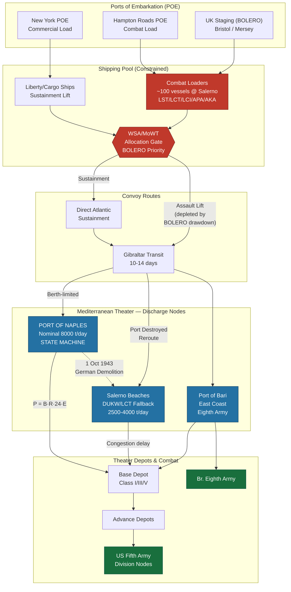

Cost: 0.29333

# Chapter 7: Outline OVERLORD and the Invasion of Italy
## Reference Manual & Simulation-Specification Document
### US Army Green Book — *Global Logistics and Strategy: 1943–1945*

---

## 1. Strategic Context & Modern Historical Perspective

### 1.1 The Strategic Paradox: Plans Against Physics

The period bracketed by this chapter—roughly the summer and autumn of 1943—represents the moment at which Allied grand strategy collided most violently with the immovable physics of maritime logistics. The high-level conference architecture that governed the war (Casablanca/SYMBOL in January 1943, TRIDENT in Washington in May 1943, QUADRANT at Quebec in August 1943, and SEXTANT at Cairo in November-December 1943) generated a cascade of strategic commitments whose aggregate demand on the finite global shipping pool exceeded supply by margins that no amount of staff optimism could reconcile.

The central paradox is this: strategic intent is expressed in divisions, objectives, and timelines, but strategic *capacity* is expressed in three brutal, physically-bounded quantities: (1) the aggregate deadweight tonnage of the Allied merchant and troop-lift fleet, (2) the number of specialized combat-loading vessels—particularly the LST (Landing Ship, Tank), LCT, LCI(L), and the attack transport (APA/AKA) classes—and (3) the *discharge* capacity of the ports and beaches at the receiving end. Modern scholarship, informed by the post-war declassification of the War Shipping Administration (WSA) allocation ledgers and the British Ministry of War Transport (MoWT) tonnage returns, has demonstrated conclusively that the binding constraint throughout 1943 was never the number of trained divisions in the continental United States—it was the pipeline that could deliver and sustain them.

At Casablanca, the Combined Chiefs of Staff had committed to a Mediterranean strategy (HUSKY, the invasion of Sicily) while simultaneously affirming the primacy of a cross-Channel attack "at the earliest possible date." TRIDENT then fixed a target date of 1 May 1944 for OVERLORD and, crucially, mandated the transfer of seven battle-tested divisions (four US, three British) from the Mediterranean to the United Kingdom beginning 1 November 1943. This single decision is the fulcrum of Chapter 7's logistical drama. It meant that the Mediterranean theater would prosecute the invasion of the Italian mainland *while being progressively stripped of its most valuable assault shipping*—the very LSTs and combat loaders that made amphibious assault possible.

The BOLERO build-up—the pre-positioning of American forces and matériel in the United Kingdom for OVERLORD—had absolute strategic priority. This priority was not a preference; it was a directive that starved the Mediterranean of landing craft at precisely the moment AVALANCHE (Salerno) demanded them. The consequence, quantifiable in retrospect, was that Lieutenant General Mark Clark's Fifth Army landed at Salerno on a shoestring assault lift, with a follow-up echelon so thin that the German counterattack of 12-14 September 1943 came within a plausible margin of throwing the beachhead back into the sea.

### 1.2 Inter-Service and Coalition Tensions

The command friction of this period operated along three principal axes.

**First, the SOS (Services of Supply) versus Combat Command axis.** Under the theater structure, the SOS (later rebranded Communications Zone, or COMZ) controlled the ports, depots, and lines of communication, while the field armies controlled the tactical formations. The tension was structural: combat commanders demanded that tonnage be loaded "combat-loaded" (i.e., tactically, with the first-needed items on top, sacrificing cubic efficiency), while the SOS and the WSA demanded "commercial loading" (maximum cube utilization) to conserve scarce bottoms. Combat loading could cut effective vessel utilization by 30-40%, meaning that every combat-loaded ship represented a multiplier on the shipping deficit.

**Second, the Army-Navy axis.** The US Navy controlled the assault shipping and the amphibious doctrine, while the Army owned the forces to be landed and sustained. Disputes over LST allocation, over the timing of naval gunfire support withdrawal at Salerno, and over the priority of Pacific versus European amphibious lift were continuous. Admiral King's insistence on a robust Pacific allocation meant that the European theaters competed not only with each other but with the entire Central and Southwest Pacific.

**Third, the Anglo-American pooling axis.** The combined shipping pool was, in principle, a shared resource, but in practice the British MoWT and the American WSA each guarded national allocations jealously. The COSSAC planning process—Lieutenant General Frederick Morgan's Anglo-American staff—operated under a mandate that was itself a coalition compromise: to plan an operation whose scale was fixed not by the enemy's strength but by the assault-lift ceiling the two nations could jointly guarantee.

### 1.3 Historical Era Context: The Double Commitment

While COSSAC labored in Norfolk House, London, to produce the OVERLORD outline plan (submitted July 1943), the Mediterranean forces executed the Italian mainland invasions: Operation BAYTOWN (Eighth Army across the Strait of Messina, 3 September 1943) and Operation AVALANCHE (Fifth Army at Salerno, 9 September 1943). This simultaneity was the defining logistical stress test of the year. The same pool of LSTs that COSSAC needed to model for a Normandy assault was being consumed at Salerno, and the TRIDENT-mandated northward transfer of shipping loomed over every Mediterranean plan.

### 1.4 Modern Analytical Insights

Post-war analysis, particularly the operational research reconstructions conducted in the 1950s and refined by later scholars, confirms two hard lessons.

**The landing craft shortage was self-inflicted by prioritization, not by absolute scarcity.** At the moment of Salerno, sufficient LSTs existed in-theater to have provided a materially stronger assault, but the rigid ring-fencing of craft for BOLERO withdrawal prevented their commitment. AVALANCHE was executed with a combat-loaded fleet of roughly 100 major assault vessels supporting the initial lift—a figure that constrained the assault to a frontage and depth that nearly proved fatal.

**Port destruction converted a captured asset into a liability.** When the Germans systematically demolished the Port of Naples during their withdrawal (1 October 1943 capture), they scuttled ships in the fairways, cratered the quays, destroyed cranes, and booby-trapped the wreckage. The Allies had counted on Naples as the sustaining port for Fifth Army's advance up the Italian boot. Its destruction forced a prolonged reliance on beach discharge (DUKW and LCT ferrying) and on the rapid construction of temporary petroleum pipelines and improvised quay structures. The US Army's port-reconstruction achievement at Naples—restoring meaningful throughput within days and full capacity within weeks—became a doctrinal template, but the interval of degraded throughput directly throttled Fifth Army's tempo during October-November 1943.

The strategic lesson embedded in Chapter 7, and the one our simulator must capture, is that **theater operational tempo is a function of the *minimum* of assault lift, sustainment lift, and port discharge capacity**—and that the destruction or contestation of any single node collapses the entire pipeline to that node's degraded rate. The Allied division was only ever as strong as the tonnage crossing the last berth or beach behind it.

---

## 2. High-Fidelity Simulation Parameters & Real-World Metrics

| Parameter | Historical Value | Simulation Representation | Historical Explanation & Strategic Rationale |
|---|---|---|---|
| **COSSAC Assault Division Count (OVERLORD outline)** | **3 divisions** (initial assault), with 2 in immediate follow-up and 2 airborne | Static constant `CossacAssaultDivisions = 3` | The July 1943 COSSAC outline fixed a three-division seaborne assault on a Normandy front (roughly Caen–Carentan). This was a *lift-constrained* figure, not a tactical optimum. Represent as an immutable planning constant that the simulator can compare against the later 5-division NEPTUNE plan. |
| **Assault Division Strength (planning slice)** | ~14,000–17,000 men + ~2,000–3,000 vehicles per division slice | Static constant with cargo/personnel derivation | Used to derive lift demand. Model as a composite record: personnel count × per-man tonnage + vehicle count × per-vehicle tonnage. |
| **AVALANCHE D-Day (Salerno)** | **9 September 1943** | Static epoch constant (`LocalDate.of(1943,9,9)`) | Anchors the theater simulation clock. All Salerno sustainment and port-reconstruction timelines are offsets from this date. |
| **BAYTOWN D-Day (Reggio)** | 3 September 1943 | Static epoch constant | Establishes the Eighth Army landing preceding AVALANCHE by six days. |
| **Combat-loaded vessels at Salerno** | **~100 major assault/combat-loaded vessels** in the initial assault convoy pool (LSTs, LCTs, LCIs, APAs, AKAs) | Dynamic capacity cap `availableCombatLoaders` | The binding assault-lift constraint. Model as a depletable resource pool subject to BOLERO withdrawal drawdown events. |
| **LST effective sustained lift** | ~1,900 deadweight tons / ~500 tons practical vehicle-and-cargo lift per turnaround | Efficiency-adjusted capacity coefficient | Represent as per-vessel lift × turnaround cycle time. |
| **Naples capture date** | 1 October 1943 | Static event trigger | Triggers the port-reconstruction state machine. |
| **Naples pre-war capacity** | ~8,000 tons/day (peacetime commercial) | Baseline `nominalCapacity` | Target restoration ceiling. |
| **Naples throughput at capture** | ~0 tons/day (total demolition) | Dynamic capacity floor after `PortState.Destroyed` transition | Models the German scorched-earth demolition. |
| **Naples restored throughput (by ~7 days)** | ~5,000 tons/day rising toward >8,000 tons/day | Time-dependent recovery function | Model as a monotonic recovery curve capped at nominal capacity × wartime efficiency. |
| **Beach discharge fallback rate (Salerno)** | ~2,500–4,000 tons/day (weather-dependent, DUKW/LCT ferry) | Weather-modulated fallback node | Active while ports are `Destroyed` or `Contested`. |
| **Port efficiency coefficient (wartime)** | 0.55–0.70 (vs. theoretical berth maximum) | Efficiency coefficient `E ∈ [0,1]` | Accounts for congestion, labor, blackout, and equipment shortfalls. |
| **Berth discharge rate (dry cargo, Liberty)** | ~40–75 tons/berth/hour depending on cargo mix & gear | Per-berth `dischargeRateTonsPerHour` | Core throughput driver. |
| **Convoy transit UK→Salerno (via Gibraltar)** | ~10–14 days | `NauticalMiles / convoySpeed` derived days | Determines pipeline latency and in-transit inventory. |

---

## 3. Logistical Network Topology (Mermaid.js)



---

## 4. Mathematical Modeling & Simulation Formulas

### 4.1 Core Port Throughput

The daily discharge capacity of a port node is:

$$P_{throughput} = B \cdot R_{discharge} \cdot 24 \cdot E_{efficiency}$$

where:
- $B$ = number of operational berths (integer, $B \ge 0$)
- $R_{discharge}$ = mean discharge rate per berth (tons · berth⁻¹ · hour⁻¹)
- $24$ = hours per operating day (theoretical maximum)
- $E_{efficiency} \in [0,1]$ = composite efficiency coefficient (congestion, labor, blackout, gear)

### 4.2 Port Recovery After Demolition

Following the Naples demolition event at $t_0$ (capture date), operational berths recover according to a saturating exponential toward the nominal berth count $B_{nom}$:

$$B(t) = \left\lfloor B_{nom}\left(1 - e^{-\lambda (t - t_0)}\right) \right\rfloor, \quad t \ge t_0$$

where $\lambda > 0$ is the reconstruction rate constant calibrated so that measured throughput reaches ~5,000 t/day near $t - t_0 = 7$ days.

### 4.3 Effective Theater Sustainment (Bottleneck Principle)

Theater sustainment tonnage delivered to depots is the minimum across the serial pipeline stages:

$$S_{eff} = \min\left(L_{lift},\; \sum_{i \in \mathcal{N}} P_{throughput}^{(i)},\; C_{clearance}\right)$$

where $L_{lift}$ is arriving lift, $\mathcal{N}$ is the set of active discharge nodes (ports + beaches), and $C_{clearance}$ is inland clearance capacity (rail/road).

### 4.4 Assault Lift Allocation Problem

Let $v$ index vessel classes with lift $\ell_v$ and available count $n_v$ (net of BOLERO withdrawal $w_v$). Assigning $x_{v}$ vessels to the assault:

$$\max \sum_{v} \ell_v x_v \quad \text{subject to} \quad x_v \le n_v - w_v, \;\; \sum_v x_v \le V_{convoy}, \;\; x_v \in \mathbb{Z}_{\ge 0}$$

This maximizes assault tonnage subject to the depleted combat-loader pool ($V_{convoy} \approx 100$ at Salerno) — the formal statement of the shortage that nearly lost AVALANCHE.

### 4.5 Berth Occupancy (Queueing)

With arrival rate $\mu$ (vessels/day) and service rate $s$ per berth (vessels/berth/day), utilization is:

$$\rho = \frac{\mu}{B \cdot s}$$

Congestion delay grows unboundedly as $\rho \to 1$; the simulator flags overload when $\rho \ge 1$.

---

## 5. Compile-Safe Scala 3.8.3 Domain Model

```scala
package Logistics.OverlordItaly

import java.time.LocalDate
import java.time.temporal.ChronoUnit
import scala.math.exp
import scala.math.floor
import scala.math.max
import scala.math.min

opaque type Tons = Double
object Tons:
  def apply(v: Double): Tons = max(0.0, v)
  extension (t: Tons)
    def value: Double = t
    def +(o: Tons): Tons = Tons(t + o)
    def clampTo(cap: Tons): Tons = Tons(min(t, cap))

opaque type Days = Long
object Days:
  def apply(v: Long): Days = max(0L, v)
  extension (d: Days)
    def value: Long = d

opaque type NauticalMiles = Double
object NauticalMiles:
  def apply(v: Double): NauticalMiles = max(0.0, v)
  extension (n: NauticalMiles)
    def value: Double = n

opaque type Efficiency = Double
object Efficiency:
  def apply(v: Double): Efficiency = max(0.0, min(1.0, v))
  extension (e: Efficiency)
    def value: Double = e

enum PortState:
  case Operational
  case Contested
  case Destroyed
  case Reconstructing

enum VesselClass(val liftTons: Double):
  case LST     extends VesselClass(500.0)
  case LCT     extends VesselClass(150.0)
  case LCI     extends VesselClass(80.0)
  case APA     extends VesselClass(1200.0)
  case Liberty extends VesselClass(7000.0)

case class PortSpecs(berths: Int, dischargeRateTonsPerHour: Double, efficiency: Double)

case class PortNode(
    name: String,
    nominalBerths: Int,
    dischargeRateTonsPerHour: Double,
    efficiency: Efficiency,
    state: PortState,
    captureDate: LocalDate,
    reconstructionLambda: Double
):
  def operationalBerths(currentDate: LocalDate): Int =
    state match
      case PortState.Operational => nominalBerths
      case PortState.Destroyed   => 0
      case PortState.Contested   => max(0, nominalBerths / 2)
      case PortState.Reconstructing =>
        val elapsed: Long = ChronoUnit.DAYS.between(captureDate, currentDate)
        if elapsed <= 0L then 0
        else
          val recovered: Double =
            nominalBerths.toDouble * (1.0 - exp(-reconstructionLambda * elapsed.toDouble))
          floor(recovered).toInt

  def dailyThroughput(currentDate: LocalDate): Tons =
    val b: Int = operationalBerths(currentDate)
    Tons(b.toDouble * dischargeRateTonsPerHour * 24.0 * efficiency.value)

case class BeachFallback(name: String, weatherFactor: Efficiency, maxRateTonsPerDay: Double):
  def dailyThroughput: Tons =
    Tons(maxRateTonsPerDay * weatherFactor.value)

case class CombatLifter(vesselClass: VesselClass, available: Int, bolWithdrawn: Int):
  def netAvailable: Int = max(0, available - bolWithdrawn)
  def netLift: Tons = Tons(netAvailable.toDouble * vesselClass.liftTons)

case class AssaultConvoy(convoyVesselCap: Int, lifters: List[CombatLifter]):
  def allocatedLift: Tons =
    val sorted: List[CombatLifter] =
      lifters.sortBy(l => -l.vesselClass.liftTons)
    val (_, total) =
      sorted.foldLeft((convoyVesselCap, Tons(0.0))):
        case ((remaining, acc), lifter) =>
          val take: Int = min(remaining, lifter.netAvailable)
          val added: Tons = Tons(take.toDouble * lifter.vesselClass.liftTons)
          (remaining - take, acc + added)
    total

case class PipelineStage(inboundLift: Tons, inlandClearance: Tons)

object PortThroughputModel:
  def dailyCapacity(specs: PortSpecs): Double =
    specs.berths * specs.dischargeRateTonsPerHour * 24.0 * specs.efficiency

  def portThroughput(port: PortNode, date: LocalDate): Tons =
    port.dailyThroughput(date)

  def effectiveSustainment(
      stage: PipelineStage,
      ports: List[PortNode],
      beaches: List[BeachFallback],
      date: LocalDate
  ): Tons =
    val portSum: Double =
      ports.map(p => p.dailyThroughput(date).value).sum
    val beachSum: Double =
      beaches.map(b => b.dailyThroughput.value).sum
    val discharge: Tons = Tons(portSum + beachSum)
    val candidates: List[Double] =
      List(stage.inboundLift.value, discharge.value, stage.inlandClearance.value)
    Tons(candidates.min)

  def berthUtilization(arrivalsPerDay: Double, port: PortNode, servicePerBerthDay: Double, date: LocalDate): Double =
    val b: Int = port.operationalBerths(date)
    if b <= 0 || servicePerBerthDay <= 0.0 then Double.PositiveInfinity
    else arrivalsPerDay / (b.toDouble * servicePerBerthDay)

  def isOverloaded(rho: Double): Boolean = rho >= 1.0

object TheaterConstants:
  val CossacAssaultDivisions: Int = 3
  val AvalancheDDay: LocalDate = LocalDate.of(1943, 9, 9)
  val BaytownDDay: LocalDate = LocalDate.of(1943, 9, 3)
  val NaplesCaptureDate: LocalDate = LocalDate.of(1943, 10, 1)
  val SalernoCombatLoaders: Int = 100
  val NaplesNominalTonsPerDay: Double = 8000.0
  val WartimePortEfficiency: Efficiency = Efficiency(0.62)
  val NaplesReconstructionLambda: Double = 0.11

object SimulationDemo:
  def buildNaples(state: PortState): PortNode =
    PortNode(
      name = "Naples",
      nominalBerths = 12,
      dischargeRateTonsPerHour = 45.0,
      efficiency = TheaterConstants.WartimePortEfficiency,
      state = state,
      captureDate = TheaterConstants.NaplesCaptureDate,
      reconstructionLambda = TheaterConstants.NaplesReconstructionLambda
    )

  def salernoBeach: BeachFallback =
    BeachFallback("Salerno Beaches", Efficiency(0.75), 4000.0)

  def run(): List[String] =
    val destroyed: PortNode = buildNaples(PortState.Destroyed)
    val recovering: PortNode = buildNaples(PortState.Reconstructing)
    val d0: LocalDate = TheaterConstants.NaplesCaptureDate
    val d7: LocalDate = d0.plusDays(7)
    val stage: PipelineStage =
      PipelineStage(inboundLift = Tons(9000.0), inlandClearance = Tons(7000.0))
    val convoy: AssaultConvoy =
      AssaultConvoy(
        convoyVesselCap = TheaterConstants.SalernoCombatLoaders,
        lifters = List(
          CombatLifter(VesselClass.LST, 60, 25),
          CombatLifter(VesselClass.LCT, 40, 10),
          CombatLifter(VesselClass.APA, 15, 5)
        )
      )
    val destroyedThru: Tons = destroyed.dailyThroughput(d0)
    val recoveredThru: Tons = recovering.dailyThroughput(d7)
    val sustain: Tons =
      PortThroughputModel.effectiveSustainment(
        stage, List(recovering), List(salernoBeach), d7
      )
    val rho: Double =
      PortThroughputModel.berthUtilization(30.0, recovering, 3.0, d7)
    List(
      s"Naples throughput at capture (Destroyed): ${destroyedThru.value} t/day",
      s"Naples throughput D+7 (Reconstructing):   ${recoveredThru.value} t/day",
      s"Assault lift allocated (Salerno pool):     ${convoy.allocatedLift.value} tons",
      s"Effective theater sustainment D+7:         ${sustain.value} t/day",
      s"Berth utilization rho D+7:                 $rho (overload=${PortThroughputModel.isOverloaded(rho)})"
    )

@main def runOverlordItalySim(): Unit =
  SimulationDemo.run().foreach(println)
```

---

## 6. Graduate-Level Operational Analysis

### 6.1 Why COSSAC Held to the Three-Division Assault, and Who Overturned It

The COSSAC staff under Lieutenant General Frederick Morgan did not select a three-division assault because three divisions were tactically sufficient—Morgan himself repeatedly flagged the assault as dangerously narrow. The three-division ceiling was a **derived constraint**, forced by the assault-lift envelope the Combined Chiefs guaranteed COSSAC in the spring of 1943. The planning arithmetic was inexorable: the assault frontage a given amphibious force can seize is bounded by the number of simultaneously deliverable loaded landing craft, and the sustainment of that force is bounded by the discharge capacity available before a major port is captured. With the confirmed LST/LCT allocation—itself hostage to the Pacific and to the BOLERO schedule—COSSAC could not honestly plan for more than three seaborne divisions plus supporting airborne and follow-up.

Mathematically, the frontage constraint is the assault-lift allocation problem of §4.4: $\max \sum_v \ell_v x_v$ subject to $\sum_v x_v \le V_{convoy}$, where $V_{convoy}$ was the pinch. Fewer combat loaders forces fewer assault battalions across fewer beaches, which reduces the initial lodgement's ability to absorb the German armored counter-concentration. COSSAC's three divisions were the *optimal feasible solution to an infeasible strategic requirement*.

The expansion was insisted upon primarily by **General Bernard Montgomery**, as commander of 21st Army Group, backed by **General Eisenhower** upon his arrival as Supreme Commander in December 1943–January 1944. Montgomery's assessment, upon reviewing the COSSAC outline in late 1943, was blunt: a three-division front on a narrow beachhead invited defeat in detail. He demanded a five-division seaborne assault across a broadened front (adding UTAH and extending to SWORD), with three airborne divisions. Eisenhower and his staff endorsed the enlargement, which in turn drove the single most consequential logistical decision of 1944: the demand for additional LSTs, the postponement of OVERLORD from May to June 1944, and the sacrifice (delay) of Operation ANVIL/DRAGOON (southern France) to free assault lift. The five-division plan was thus not a free tactical improvement—it was *purchased* with a month of calendar time and a raid on every other landing-craft claimant in the war. The COSSAC constraint was real; overturning it required overturning the resource allocation that produced it.

### 6.2 The Destruction of Naples and Fifth Army Support

Naples was the linchpin of the Allied plan for sustaining the northward drive of Fifth Army. AVALANCHE at Salerno had deliberately been positioned within striking distance of Naples precisely because the beaches at Salerno could never sustain a sustained campaign—beach discharge (§4.3, the $\sum P^{(i)}$ term) is fundamentally weather-limited and low-throughput compared to a functioning deep-water port with cranes, rail sidings, and covered storage. The whole logistical logic of the campaign assumed the rapid substitution of Naples's ~8,000 tons/day for the fragile beach ferry.

The German 10th Army's demolition of Naples between mid-September and the 1 October capture was a textbook denial operation: ships scuttled athwart the fairways and alongside the moles, cranes toppled into the basins, quay walls cratered, port machinery destroyed, and delayed-action mines seeded throughout. In the model of §4.2, this drove $B(t_0) \to 0$: nominal capacity was intact on paper but *operational berths* were zero. The effective sustainment collapsed to the minimum term in $S_{eff} = \min(L_{lift}, \sum P^{(i)}, C_{clearance})$, and that minimum was now the Salerno/beach fallback of a few thousand tons per day—well below Fifth Army's daily maintenance requirement for an army advancing against determined resistance in mountainous terrain approaching winter.

The consequences propagated directly to division-level tempo. Fifth Army's advance to the Volturno and the subsequent grind toward the Winter Line was throttled not only by terrain and German defense but by a Class III (petroleum) and Class V (ammunition) supply constraint imposed by the discharge bottleneck. Ammunition rationing during offensive operations is the operational signature of a throughput-limited theater, and October 1943 shows exactly this pattern.

The redemption was the extraordinary port-reconstruction effort—salvage of the sunken hulls (some used as improvised pier foundations, the "Liberty ship quay" expedient), rapid emplacement of pontoon and timber quays, and Army engineer clearance that restored roughly 5,000 tons/day within about a week and pushed toward and beyond the pre-war ceiling within weeks—captured in the $\lambda$ recovery constant of §4.2. This achievement rescued the campaign but did not erase the interval of degradation, during which Fifth Army's operational reach was measurably foreshortened.

The enduring simulation lesson is the **bottleneck principle**: a captured port is worth nothing until its berths are operational, and a theater's combat power at the front is capped by the weakest node in the serial pipeline. Naples demonstrated that the *rate of port reconstruction*—not the nominal capacity of the port—is the true state variable governing offensive tempo in the immediate aftermath of a denied-port capture.
