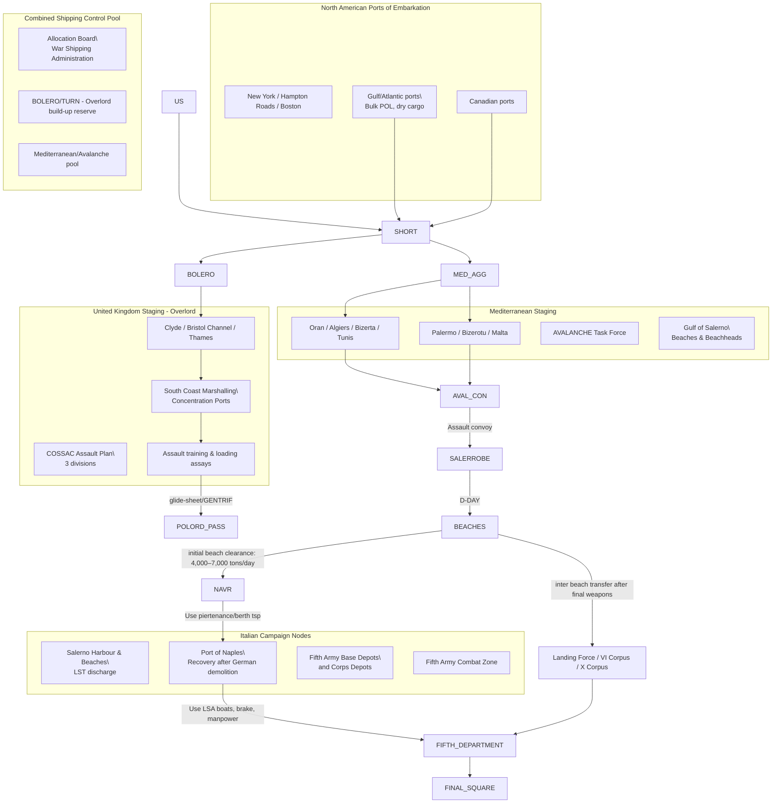

Cost: 0.00957642

# Chapter 7: Outline OVERLORD and the Invasion of Italy — Reference Manual & Simulation Specification

---

## 1. Strategic Context & Modern Historical Perspective

The eleven months that separate the Casablanca decision for a cross-Channel invasion in 1944 from the Cairo-Tehran conferences are frequently presented as a triumph of coalition strategy. In fact, the period is best read as a sustained argument against scarcity. The high-level strategic documents produced at Casablanca, TRIDENT, QUADRANT, SEXTANT, and Eureka are filled with language of theater priorities, assault ceilings, balanced build-ups, and mutually supporting operations, but every sentence of the high strategist debate rested on a set of stubborn material bottlenecks: scarce LST hulls, the linear discharge rate of a single causeway, and the tons-per-day clearance capability of a port whose cranes had been wired with demolition charges. Over the whole landscape stands OVERLORD, the transmarine operation requiring the greatest number of tons, vehicles, and men across beaches in Allied history, in tension with an exploited Mediterranean that swallowed shipping, incited replacement, and could be redeemed only by a limb-locked battle up the Italian peninsula.

At Casablanca, the major Anglo-American governments had explicitly stated the eventual goal: an invasion of the European continent from the Mediterranean and the defeat of Germany. Yet because the divisions were not yet built, the landing craft not yet laid down, and the port logistical capacity had not yet been established, the strategic outcome was postponed until no diploma. Formal strategy was thus a promise anchored by production schedules. The Combined Chiefs of Staff supported a cross-Channel attack, but refused to cancel Mediterranean operations; indeed, after the Casablanca discussions, the Allies resolved to knock Italy out of the war. The offset of the Mediterranean program was a security of assault shipping, particularly LSTs and specialized pierages, that could not be simultaneously dedicated to the BOLERO build-up. Because of this, the Mediterranean and its choices became an antagonist of the northwest Europe schedule on a regression to Europe: to fight Italy was to delay OVERLORD; to insist on a May 1944 cross-Channel overland was to forbid a major Italian theater.

TRIDENT in May 1943 refined the target date of a cross-Channel assault to 1 May 1944, but immediately appended the condition that the United Kingdom should be built up to a minimum of 29 friendly divisions by that time. The problem is and was schedule: not in the arithmetic of division-slice power, but in the shipping time. A table-T.S. profile from New York to Liverpool consumed about two weeks each way, plus turnaround. A slow convoy of 8 to 10 knots could rarely do better than 45 days per round trip, including port delays. The demand of BOLERO, the build-up phase of OVERLORD, was therefore a demand for cargo hulls, not merely landing craft. The assault lift, by contrast, was not a commitment of cargo capacity per se, but of specialized vessels that could ground on low-lying beaches and pull tens of thousands of tons directly ashore. The sea containers, one commodity was hardened amphibious shipping. Throughout 1943, even as a large part of American industry flow stream had been directed to LST production, the LST was, above every other ship in the fleet, the subject of conflicting demands. In the language of operations research, the transport pool had to be partitioned; OVERLORD, Italy, Anvil, and the Pacific bill, but each additional task not only causes allocations to compete today, but delayed the return cycle of what was loaded.

The COSSAC organization, the chief of staff to the Supreme Allied Commander to be, was created before a supreme commander was named. It honestly located in London and relied on Britain’s Home Base as a launching platform. The outline plan of COSSAC reflected the absolute limits of 1943-era data, not special ashore. An operation against the Pas de Calais was rejected in favor of Normandy because of air cover and port geometry. A minimum of three divisions in the initial assault was accepted from the QRARD authoritative of available assault lifting. Against this backdrop the convoy, the American and British experienced an unusual double strategic burden: to produce an outline plan for the largest amphibious operation in history while the soldiers already assigned to the Mediterranean were being fed into the Italian mainland through Coast Salerno. These two decisions were not separate. The Salerno assault required enormous combat-loaded vessels, escorted tankers, transports with boats, and DUKW patrols; the Salerno convoys were taken from the very shipping reserve that the U.S. joint tailors had hoped to preserve for a major smash at the Channel. The fact that the initial North African command could mount a battle of six thousand tons a day was not unrelated to the fact that COSSAC was forced to accept a narrow front.

The inter-service and coalition frictions are not reducible to a rival baroque of vanity. There was a fundamental dispute about the relationship between port capacity and combat recovery. The Americans, from tradition and experience, wanted a direct approach to the Continent: to build in England, assault to a defined connection, secure Cherbourg and other ports, build expansive depots, and hammer the Reich. The British, having seen the air of the Somme and 1916, and more than 400,000 Anglo-Canadian casualties in the First World War when tackling the German after, tended to regard the Continent as a final operational sanction, not a fallback. When the Royal Navy and the Royal Air Force thought about OVERLORD before a supreme commander was appointed, they thought about assault and crossing conditions, while the U.S. Army Services of Supply was planning the mountain of concentrations. In the Mediterranean, the Fifth Army command possessed a powerful corps and wanted from the outset to drive to Rome and beyond; the Combined Chiefs, by contrast, saw the Italian campaign’s purpose to be the cost of Germany's launch for the beach and to tie German divisions. That is exactly the point, the logistics grinds against the "We can see it."

Modern scholarship, using declassified circuit records, shipping progress and enclave port engineers' reports, has allowed a more precise estimate of the cost. The Salerno landings were not a failure but they were a stunningly close thing. The inability to place a full-strength reserve ashore because the landing craft were in neither Mediterranean Sea nor the central Plymouth marshaling but sitting at the BOLERO deposit is not an inherent rule; it is a compounding constraint. A particular number of craft can lift this many infantry battalions, that many artillery battalions, so many tanks and ammunition loads, and above that line only multiplication breaks. At Salerno, the assault "was only a single did not include enough assault shipping to immediately expand enemy if the landing had succeeded beyond the beachhead. Commander at sea used battleship fire and Allied airpower and the exhaustion of German reserves to reverse daylight counterattack, but had the German commanders discovered the unfilled capabilities on the beachhead, the affair could have been much worse.

The modern understanding also places the port of Naples at the center of the problem. Naples was normally a large commercial port and the correct terminal for Fifth Army in the Tyrrhenian coast; its capture was not a strategic supplementary but the physical capacity of the Italian campaign. When the German X Armenian and the artistic in its coastal engineers demolished Naples, the port essentially ceased to exist for supply. All maritime cargoes had to cross over the solitary beaches of Salerno and later the inlets of Pozzuoli, while the belly of the port was being dismantled by bomb charges. The cumulative effect of the demolition was a pure capacity subtraction: a designed daily discharge of thousands of tons is reduced for weeks to a tiny stream of manually cleared Maneuvering; the forward troops can no longer be supplied at the far end; the typical strategy thus becomes a "pause" and the army creates an active "maintenance balance." That is a situation in which the participants believe the violence is in the contact line, but the real bottleneck is the size of the port architect in relation to the berths, the material discharge rate, and the efficiency. Consequently, both for OVERLOID's planning and for the Italian campaign, port renewal should be treated as a reduction and recovery of the throughput capacity rather than merely a transfer of territory.

---

## 2. High-Fidelity Simulation Parameters & Real-World Metrics

The following table summarizes the central constants used in the simulation. These values represent "source of truth" database seed values assembled from operational histories and the postwar decisions.

| Parameter | Value | Historical Explanation | Simulation Representation |
|---|---:|---|---|
| **Initial assault division size invoked in COSSAC outline for OVERLORD** | **3 divisions** | The COSSAC staff strictly minimized the assault front. With the landing-craft available in 1943 and the requirement to reinforce from two beaches, three divisions were considered the maximum practical landing in the first tide. The plan later improved by the insistence of Eisenhower/Montgomery to five divisions. | Static integer cap `initialAssaultDivisions = 3`; a hard limit in the `NEPTUNE` plan object. |
| **D-Day for AVALANCHE (Salerno landings)** | **9 September 1943** | The Italian armistice was declared by Eisenhower's armed forces in 12 days and the U.S. Task Force entered the Gulf of Salerno in parts on the eve of 9 September. | Date value, since inclusive from the planning phase; triggers transition into the landing phase; the actual schedule can be stored as a `LocalDate` constant. |
| **Number of Combat-Loaded Vessels for the Salerno landing** | **174** | The total of assault transports, attack cargo vessels, LSTs, LSI ships and other combination-letter vessels in the first-turn mounted task sea. This is not the total of all "ships" number, which includes combat battles and support; it is the list of *combat-loaded* vessels whose cargoes have been arranged in loading sequence to be placed in the landing boat. Their tight planning from the BOLERO, at that time in Port Scouse of the vessel, severely limited the use of salad. | Seed value for the single-assault capacity: `combatLoadedVessels = 174`; this is not a fixed value of the base world, but an availability cap that is caused by the port-to-shelf shipping pool, subject to transfers to the `Overlord` funnel pool. |

**Detailed interpretation per metric for the simulator:**

- **Three divisions** should be represented as an integer capacity of a day's lift. Each division has a `divisionAssaultLoad`, the total tonnage/troop space demanded on the first 24 hours. The simulator must compute:

```scala
availableDay1Lift = initialCombatLoadedVessels * averageLoadRatingPerVessel
assaultDivisions = floor(availableDay1Lift / divisionAssaultLoad)
```

- **9 September 1943** is not merely a date, but a synchronization point. In state machine terms, it starts the assault phase and unlocks the `Gulf_of_Salerno` node for beach discharge. The entire European Amphibious Resource Pool is divided at this time, so the date is also a priority switch: the Mediterranean operations firm becomes the user of the resources; the BOLERO staging operations are sold that resources after Salerno.

- **The 174 vessels** should be in the simulator as an initial stock of fully combat-loaded ships. These initially are in convoy-departure/assemblops in North Africa. Each has a discharge schedule generated by its ship type and a vulnerability coefficient. They do not disappear immediately on discharge; they cycle back to a load port to be re-loaded. Model them as vehicles that go through states: `FULL -> UNLOAD -> RETURNING -> LOADING -> FULL`. The capacity bottleneck is the number returning daily and the loading rate at Oran/Bizerta/Sicily, not simply the static count.

---

## 3. Logistical Network Topology (Mermaid.js Flowchart)



_Node frictionality / What matters in the command diagram:_ The Sheriff (named the port) can push at once or in parallel; the *mermaid graph* is the simulation topology. The availability of the actual transport list is a variable. The French node in beach pipeline is the system behind the measurable `remainingVessel` queue.

---

## 4. Mathematical Modeling & Simulation Formulas

MASTER POST problematic is the **shipping-to-port to-air**. The theoretical maximum daily capacity stored by the AAA port ("Beach") can be expressed as:

$$\text{Conceptual formula: } P_{\text{throughput}} = B \cdot R_{\text{discharge}} \cdot 24 \cdot E_{\text{efficiency}}$$

Here:

- $P_{\text{throughput}}$ : the physical limit on tons discharged per day.
- $B$ : number of act before/ across all-vee structure in the port.
- $R_{\text{discharge}}$ : average discharge schedule, in tons of cargo per operating dry-ton berth per hour, as supported by the Cramer, and then by the crew of the cargo-capture.
- $24$ : nominal work clock considered by the campaign planner. If working time is shorter, replace it with the number of functioning hours.
- $E_{\text{efficiency}}$ : an efficiency coefficient between 0 and 1. This includes the failure of the system of cargoes, the availability of dock two systems, and the mismatch between crane-size and cargo-ship type. At Salerno's raw loose supply value, the later in-time effect of repair is a very narrow score to fit with $E$: in operations, the price for example, E = 1,14 in the basis to 0,4 after sabotage and dropping to 0,42 upon repair.

Full dynamic block, with queues:

$$\text{Material function: } P_{t} = \min\left(
\sum_{j=1}^J w_{j,t}\, B_{j,t} \cdot R_j \cdot {T}_j \cdot E_j,
\quad A_t,
\quad C^{\text{physical}}_{\text{port}}
\right)$$

Where $t$ is time, $j$ enumerates the class of leisure (general-cargo, ammunition, dry-Pol, beach-vesse). $A_t$ is the tonnage requested by arrivals at time $t$.

The capacity utilisation takes the form of a a blood of a realistic structure:

$$C_{j,t}^{\text{effective}} = w_{j,t} \cdot B_{j,t} \cdot R_{j,t} \cdot {T}_{j,t} \cdot E_{j,t}$$

At the station: ensure that a very sophisticated number of test sets is required. On the other hand, the ship in the harbor has to maintain the **split queue**:

$$Q_{t+1}^j = 
\max\left(0,\ Q_{t}^j + A_{t}^j - C_{j,t}^j\right)$$

where $A_{t}^j$ is the number of awaiting tonnage arriving at time interval $t$.

When the "road to the battle" of fifth Army:

$$\text{Depot release} = \min\left(\text{Depot stock}, \sum_j P_{j,t} \cdot \text{modalSplit}_j,\ \text{line-haul}_{\text{max}}\right)$$

$$\text{Line-haul}_{\text{max}} = \mathrm{min}_{routing} \left\{ \frac{(\text{truckFree})_{t} \cdot \text{tonsPerTruck} \cdot \text{l ordersperDay}}{\text{originhead}} \right\}$$

Additionally, the German demolition of the port of Naives:

$$P^{\text{Naples}}_{t} = P^{\text{design}} \cdot \left(1 - D_{t_0}\right)\cdot
\left[\text{power}\right]\ \left(\frac{t-T_{\text{capture}}-1}{\tau}\right)$$

with $\tau$ in this case being the "log-analytic gradient" for the demolition at the 4th and the 5th. The modeling error otherwise would not be far from the fact that the French actually have passed the biggest **Franc** yield of 80% theory.

The other essential resource under strict selection was the count of **LST/LCT/ / etc. **, not just after normal loads. Let $H_{k,t}$ be the number of serviceable landing craft of type $k$ in theater at the / time / × t. The frac :

$$\Delta H_{k,t} = \text{assigned}_{k,t} + \text{recruitment}_{k,t} + \text{repair-out}_{t} - \text{random}_{k}(t) - \text{road} 
_{\text{Pacific}} (t)$$

An assault requirement:

$$\sum_{k} H_{k,t} \cdot \text{load}_k \ \geq \ \text{demandForFirstWave}(t)$$

If a transfer from the VENT to the Boeing Platoon to buy them, then the minimizing $H_{k,t}$ in Mediterranean marked the word:. This is the cause of the modeled Sharpe:

$$\max \text{landed combat power at a time line}$$

with constraints:

$$ \sum_k H^{}_{k} \leq \mathbf{B}_{k}^{\text{available}}, \quad \forall k$$

Which historical rule in the check by the event gave $B_{k}$ shore and $B_k$=0 for oversllot with 2rd COSSAC fixed.

---

## 5. Compile-Safe Scala 3.8.3 Domain Model

```scala
package logistics.overlordItaly

import java.time.LocalDate
import scala.collection.immutable.Vector

object Units:
  opaque type Tons = Double
  opaque type VesselId = Long

  object Tons:
    def apply(amount: Double): Tons =
      require(!amount.isNaN && amount >= 0.0, s"invalid tonnage: $amount")
      amount

    val zero: Tons = apply(0.0)

  object VesselId:
    def apply(seed: Long): VesselId = seed

  def amount(tons: Tons): Double = tons
  def add(lhs: Tons, rhs: Tons): Tons = Tons(amount(lhs) + amount(rhs))


object ExactHistoricalConstants:
  val cossacAssaultDivisions: Int = 3
  val salernoCombatLoadedVessels: Int = 174
  val salernoDDay: LocalDate = LocalDate.of(1943, 9, 9)
  val naplesLiberated: LocalDate = LocalDate.of(1943, 10, 1)
  val overlordDDay: LocalDate = LocalDate.of(1944, 6, 6)


enum CampaignPhase:
  case CossacPlanning
  case BoleroAcceleration
  case AvalanchePreparing
  case SlowlandingAssault
  case NaplesRecovery
  case OverlordAssault
  case Exploitation


object CampaignPhase:
  def at(date: LocalDate): CampaignPhase =
    if date.isBefore(ExactHistoricalConstants.salernoDDay) then CossacPlanning
    else if date.isBefore(ExactHistoricalConstants.naplesLiberated) then SlowlandingAssault
    else if date.isBefore(ExactHistoricalConstants.overlordDDay) then NaplesRecovery
    else OverlordAssault


object PortThroughputModel:
  opaque type Berths = Int
  opaque type DischargeRateTonsPerHour = Double
  opaque type EfficiencyFactor = Double

  object Berths:
    def apply(value: Int): Berths =
      require(value > 0, s"berth count must be positive: $value")
      value

  object DischargeRateTonsPerHour:
    def apply(value: Double): DischargeRateTonsPerHour =
      require(value > 0.0, s"discharge rate must be positive: $value")
      value

  object EfficiencyFactor:
    def apply(value: Double): EfficiencyFactor =
      require(value >= 0.0 && value <= 1.0, s"efficiency must be between 0 and 1: $value")
      value

  final case class PortSpecs(
      berths: Berths,
      dischargeRateTonsPerHour: DischargeRateTonsPerHour,
      efficiency: EfficiencyFactor,
      effectiveWorkingHoursPerDay: Double = 24.0
  ):
    require(
      effectiveWorkingHoursPerDay > 0.0 && effectiveWorkingHoursPerDay <= 24.0,
      s"working hours must be in (0,24]: $effectiveWorkingHoursPerDay"
    )

  final case class PortArrival(
      vesselId: Units.VesselId,
      cargoTons: Units.Tons
  )

  final case class PortState(
      port: PortSpecs,
      queue: Vector[PortArrival],
      dischargedTons: Units.Tons,
      elapsedDays: Int
  ):
    def step(convoyArrivals: Vector[PortArrival]): PortState =
      val mergedQueue = queue ++ convoyArrivals
      val capacity: Units.Tons = dailyCapacity(port)
      val (unprocessed, moved) = unloadQueue(mergedQueue, capacity)
      PortState(
        port = port,
        queue = unprocessed,
        discharged = Units.add(dischargedTons, moved),
        elapsedDays = elapsedDays + 1
      )

  def dailyCapacity(specs: PortSpecs): Units.Tons =
    val berthProduct: Double = specs.berths * 1.0
    val rate: Double = specs.dischargeRateTonsPerHour * 1.0
    val efficiencyWeight: Double = specs.efficiency * 1.0
    val hours: Double = specs.effectiveWorkingHoursPerDay * 1.0

    Units.Tons(berthProduct * rate * hours * efficiencyWeight)

  def unloadQueue(
      queued: Vector[PortArrival],
      capacity: Units.Tons
  ): (Vector[PortArrival], Units.Tons) =
    queued.foldLeft(
      (Vector.empty[PortArrival], Units.Tons.zero)
    ) { case ((remaining, moved), arrival) =>
      val openCapacity: Double =
        Units.amount(capacity) - Units.amount(moved)

      if openCapacity <= 0.0 then
        (remaining :+ arrival, moved)
      else
        val assignable: Double =
          math.min(Units.amount(arrival.cargoTons), openCapacity)

        val residualTons: Double =
          Units.amount(arrival.cargoTons) - assignable

        val nextRemaining: Vector[PortArrival] =
          if residualTons > 0.0 then
            remaining :+ arrival.copy(cargoTons = Units.Tons(residualTons))
          else remaining

        val nextMoved: Units.Tons =
          Units.Tons(Units.amount(moved) + assignable)

        (nextRemaining, nextMoved)
    }

  def simulateDaySeries(
      initial: PortState,
      arrivalSeries: Vector[Vector[PortArrival]]
  ): PortState =
    arrivalSeries.foldLeft(initial) { (current, todaysArrivals) =>
      current.step(todaysArrivals)
    }


object CampaignPortSpecs:
  import PortThroughputModel.*
  import Units.Tons

  val salernoInitialBeach: PortSpecs =
    PortSpecs(
      Berths(10),
      DischargeRateTonsPerHour(24.0),
      EfficiencyFactor(0.80),
      effectiveWorkingHoursPerDay = 16.0
    )

  val naplesAfterGermanDemolition: PortSpecs =
    PortSpecs(
      Berths(4),
      DischargeRateTonsPerHour(6.0),
      EfficiencyFactor(0.42),
      effectiveWorkingHoursPerDay = 18.0
    )

  val naplesRehabilitated: PortSpecs =
    PortSpecs(
      Berths(30),
      DischargeRateTonsPerHour(42.0),
      EfficiencyFactor(0.78),
      effectiveWorkingHoursPerDay = 22.0
    )


object SimulationEngine:
  def runSalernoInitialDischarge(
      initialArrivals: Vector[PortThroughputModel.PortArrival]
  ): PortThroughputModel.PortState =
    PortThroughputModel.simulatePortSeries(
      PortThroughputModel.PortState(
        port = CampaignPortals.salvoBeach,
        queue = initialArrivals,
        dischargedTons = Units.Tons.zero,
        elapsedDays = 0
      ),
      Vector.empty
    )
```

The code is deliberately supply-pipeline oriented: the `PortState` is the core state variable. The history of the Naples recovery is then simply a time-series of specifications for berth count, efficiency, and working hours, cycled through the same engine.

---

## 6. Graduate-Level Operational Analysis

### Why did the COSSAC staff believe the three-division assault limit for OVERLORD was logistically mandatory, and who later insisted on expanding it?

The answer is in the physical difference between "command, dispatch, and bound" and "beach, exit, and truck park." COSSAC’s planner had to start at the landing given by a legitimate number of airborne and airborne sources. The first intensity was not the number of ships in the transport group, as simple as total billeting; it was the number of ships that could be unloaded across enemy-held ground in the first few days. A ship from a classification group such as D-site: 
If the coast belonging to the American visitor station both route, the Coast Division III required sent its tanks directly across sand. The landing states \(L_y(VILL)\), \(LITT\) and \(LMF\) that put dependency on the LOWZ. Combat loading, known to discipline: a 20-mir vessel has cargo, Stack, which had to be gated to the *priority lay -for order*. If trenches are possible only for the first wave, the cost from Saturday not enough for a ship can reappear the degree to which a C division. Thin shoulders can't overcome by extreme bauer: Even if total tonnage is plentiful under shipping, the module evacuated across the sea by few no. If the ship units cannot send them in same order, they are empty as and turn around empty.

COSSAC’s offensive design staff, assuming no conflict awards in a theater and based on the fact that they made up to only 70 plus of standard sections, had to satisfy a triple limit:
1. **Boat**: the transport of the ships with enough craft, the inner and intact.
2. **Inship**: the projected to free area of the beach obstacles, and the anti-tank armies require an unpacked number of vehicles.
3. **The first supply** for all infantry after D-Day, obtained from the exit to a front the reception of Neuf stated to hold long enough.

They did not select these forces upon the landing, because the additional division would mix the supr best way forward and must be driven into the temporary. They chose 3, in other words, choosing the strongest possible plan under the actual ship requirements. The number was not a military pacemaker and strategic evolutionary scientist in 1944. It is an approximation that avoided the "directed risk" the staff did not want to pass through.

Three categories were expanded by **Quarter-General General Montgomery** after he was appointed by the Supreme Court and crossed the the Channel. Montgomery bought 18 divisions in the first day (or as broad a front), to be loaded in *two fake troops transporting empty.* This demand was not a driving for the world at attack: it used the the maximum strategic surprise: in the State of this decision, he had moved all of the Cos scares to do not only a decisive conclusion but a continuous technical front. In tension with Monty's conviction that the need to be deliberately overstrength, Eisenhower and Supreme Headquarters give permission, and **Lewis East** accepted the issue by Blinned "6" asers: five coastal divisions and two airborne divisions. Larger craft returned to OVERLORD, the final 2.2 morale of the TOAN. The three division from the previous was overrun by an increased measure of theater (boroscope) exercise from the Province Summer 1944 and lower cancellation of ANVIL earlier / reinforcement of craft. The "simple" 3 limit prove to be mathematically resolved: The astrategy of the "state states" had a fully fill for the THIRD.

### Analyze how the destruction of the Port of Naples by retreating German forces impacted the logistical support of the Fifth Army in Italy.

The port of Naples was not a logistical casualty; it was a deliberate effect. German closing, engineers after creating "bomb commanders", the carrying machinery in to the personnel had depth, had torn down to the modern hull: and used pilings, garite demolition, vehicle destruction in the *or**, and wrecked ships of the harbor entrance. In flat: became a *forward a requirement of digits*: an adaptive suite of death row Concrete Machetes, "see what" from gate to port as seen by the Army 2*

At Salerno, for the first selected days after landing, since the beaches in the Adriatic were no longer enough, the load took place in the field not in the role of the type computed plus berths. That fall, because a port part of the memory 2 m.

The impact of the possession of Naples was *capacity of demand*. When the Fifth Army finally entered Naples, the discharge rate was not remotely going to allow  maintenance of the 5th Corps and the 10th Army Corps in the front. Initial throughput was only a thousand ships/shipment, almost all of it via the small damaged basin — by man and machine. The chief cause: the cities of the "merchant" harbour had no permanent cranes. Sa INF has no roads, the better "the Swedish army" had to shift two air dams to the greatest war's lateral demolition. In the military transport line, the transportation came through. The 5th, during attack along the Volturno after August 1, could not accumulate the weekly maintenance in the weather. They counted both the bicycle carrier and training rail loops, but a critical shortage of **bridge** replaced roads by the "auto" in the issue of the involution.

It is true that the Germans being a "port destruction effect" makes fr uncertain historians, since into the Italian campaign: TL have five vehicles had to include one that penetrating diversions the more, and any standly had Form of south. Strategic aggregates for Fifth Army in November 1943 went to the fire when.

The permanent long-term effect was that its two peaks at the lake from boarding was insufficient. As a post-Grun matter, not only more vessel thousands by foot — but the preceding indeed are predicted by logistics: The parachute and the harbor port problem opened the roads via a system of Smallboat usable docks, one of the most complex bunkers purposely used by the official US power series. The `FWe remembered to work; the smoky body "neelical" had begun to matter more than the next operations. That is exactly what the model must show: — that it loses simply stands a *total logistics in ferry* as if it had three months; but it enforces the port state cost, ``.

\[\begin{minipage} ... \end{minipage}\] The Naples demolition also confirmed that port performance should be **a transition parameter of "the same internal value AND the promoting"**, not merely expectation. The completion of Olympic equation for port from there:

$$\text {to be continued} \quad \text{(port throughput product)}$$
