Cost: 0.47438625

### 1. Strategic Context & Modern Historical Perspective

Chapter 7 occupies a pivotal point in the logistical history of the European war. During the summer and autumn of 1943, the Western Allies were not merely choosing between alternative operations; they were attempting to sustain two partially competing strategic systems. In Britain, the Chief of Staff to the Supreme Allied Commander—COSSAC, headed by Lieutenant General Frederick E. Morgan—was preparing the outline plan for Operation OVERLORD and identifying the forces, landing craft, shipping, airfields, depots, and reception capacity required for a return to northwestern Europe. Simultaneously, Allied forces in the Mediterranean were exploiting the collapse of Axis power in North Africa and Sicily by invading the Italian mainland. Operation AVALANCHE at Salerno, launched on 9 September 1943, was the most demanding of these mainland operations.

The resulting tension was not simply a disagreement over theater priorities. It was a competition for scarce and partly non-substitutable assets: assault shipping, ocean-going combat loaders, landing ships and craft, trained naval crews, port construction units, engineer special brigades, amphibious headquarters, antiaircraft units, service troops, railway equipment, petroleum-handling systems, and shipping allocated to routine theater maintenance. A division listed as “available” in a strategic deployment table was not necessarily deployable. To become operational, it required a sequence of synchronized capacities: troop lift, combat loading, protected convoy movement, landing or port discharge, inland clearance, depot reception, vehicle distribution, and recurrent maintenance.

#### The strategic paradox

At Casablanca in January 1943, the Allied leadership adopted a program that included the invasion of Sicily after the conclusion of the North African campaign while continuing preparations for a cross-Channel operation. At TRIDENT in Washington in May 1943, the Americans obtained stronger recognition of a cross-Channel invasion in 1944, while the Mediterranean remained an active theater. At QUADRANT in Quebec in August 1943, the Allies approved the general OVERLORD concept and a target date of 1 May 1944, although the available lift permitted only a relatively narrow assault. At SEXTANT in Cairo during November and December, OVERLORD remained the principal 1944 operation, while the projected southern France landing—later ANVIL and then DRAGOON—was treated as a supporting operation dependent on resources.

This conference architecture produced what may be called a strategic paradox: the Allies could approve multiple operations at the level of grand strategy faster than their logistical organizations could generate the amphibious lift, shipping, port throughput, and service support needed to execute them. Strategy treated formations as counters; logistics had to treat them as flows through capacity-constrained networks.

The global merchant shipping pool was large by 1943, but it was never an undifferentiated reserve. Troopships, ordinary cargo ships, refrigerated vessels, tankers, attack transports, landing ships, and landing craft performed distinct functions. A Liberty ship carrying boxed vehicles to a secure port was not an adequate substitute for an attack transport equipped with landing boats, troop accommodations, cargo booms, and holds arranged for tactical unloading. An LST could place vehicles directly onto a beach but was slow, short-ranged relative to ocean-going shipping, vulnerable, maintenance-intensive, and demanded a trained crew. A landing craft assembled in the United States or Britain could not be transferred instantaneously to the Mediterranean without transport, routing, preparation, and time.

The COSSAC outline plan therefore began with the lift physically expected to be available in Britain, not with the force that planners considered ideal. Its initial assault was limited to three seaborne divisions, with two more divisions scheduled for rapid follow-up. The plan contemplated an ultimate build-up far larger than the initial assault, but that build-up depended on quickly capturing or developing beaches, minor ports, and ultimately major ports. The narrow front was not a declaration that three divisions were tactically sufficient under every circumstance. It was a statement that the anticipated landing-ship and landing-craft pool could carry and sustain approximately that assault echelon while supporting follow-up movement and other commitments.

The same physical resources were being consumed in the Mediterranean. HUSKY had required a vast amphibious organization, and AVALANCHE followed only two months later. Landing craft needed repair, refit, reassignment, and in some cases transfer to Britain. Retaining them in the Mediterranean strengthened immediate operations in Italy but threatened BOLERO, the accumulation of American forces and matériel in the United Kingdom. Sending them to Britain protected OVERLORD but reduced the tactical margin available to Fifth Army.

The scarcity was especially acute because assault lift had to be measured in more than hull numbers. The relevant capacity depended on deck area, vehicle lanes, davits, boat complements, cargo-handling equipment, beach gradient, tides, turnaround time, and the ability to reload. A nominal inventory could overstate effective lift if vessels were under repair, in transit, crew-deficient, or unsuitable for the intended beach.

#### Coalition and inter-service tensions

The conflict over resources operated at several institutional levels. American strategic planners generally favored concentrating forces in Britain for a decisive cross-Channel operation. British leaders gave greater weight to continued Mediterranean opportunities, both because Italy’s defeat could weaken Germany and because British imperial communications and political interests were deeply connected to the Mediterranean. This divergence was not absolute: American commanders accepted Mediterranean operations, and British officers supported OVERLORD. Nevertheless, the two coalitions often assigned different values to marginal units of shipping and landing craft.

Pooling arrangements mitigated scarcity but complicated accountability. British and American shipping was allocated through combined machinery, yet national authorities retained interests in schedules, crews, ship maintenance, and future employment. A landing ship committed to AVALANCHE could not simultaneously appear in the British accumulation tables for OVERLORD. Conversely, withdrawing ships from the Mediterranean could impose an immediate operational penalty on Alexander’s armies while creating only a future benefit in Britain.

Inter-service friction was equally important. The Army could define troop and cargo requirements, but the Navy controlled much of the amphibious movement and had to assess navigational, beaching, escort, and combat-loading feasibility. Army planners often focused on tonnage and formation readiness; naval planners focused on hull characteristics, boat waves, convoy timing, shore gradients, and survivability. Air authorities had their own demands for airfield construction, aviation fuel, bombs, and maintenance stores. Each service operated a logistical network that intersected with, but did not perfectly conform to, the others.

Within the Army, Services of Supply organizations were frequently pressed by combat commanders to accept requirements that exceeded port, depot, or truck capacity. Combat commands naturally sought ammunition, fuel, replacements, vehicles, and reserves sufficient for tactical freedom. Theater service commands had to account for ship arrival schedules, available labor, storage space, railway clearance, truck turnaround, and competing cargo priorities. This produced a recurring difference between the amount of cargo “in theater,” the amount discharged, the amount cleared from a port or beach, and the amount actually available to a division.

#### AVALANCHE and the Italian mainland

The Salerno landings on 9 September 1943 occurred in the context of the Italian armistice, but planners could not safely assume that German resistance would collapse. The assault placed Lieutenant General Mark Clark’s Fifth Army ashore on a constrained coastal plain dominated by high ground and crossed by rivers. The landing area was within range of German airfields and subject to rapid counterattack. Tactical success depended on moving artillery, armor, ammunition, and fuel across beaches whose discharge performance varied with surf, gradients, enemy action, craft availability, and inland congestion.

The limited number of ocean-going combat loaders—twenty in the chapter’s planning count—was only one part of the problem. The assault also required LSTs, LCIs, LCTs, smaller craft, naval gunfire ships, escorts, minesweepers, and follow-up merchant shipping. Different publications provide larger totals for the AVALANCHE armada because they include warships, landing ships, small craft, follow-up vessels, or craft carried aboard larger ships. For simulation purposes, “twenty combat-loaded vessels” should therefore be treated as a narrowly defined assault-shipping category, not as the total number of hulls involved.

Rigid protection of the BOLERO and OVERLORD accumulation limited the Mediterranean’s ability to retain or obtain additional assault lift. This did not make AVALANCHE impossible, but it reduced redundancy. With fewer suitable craft, commanders had less ability to compensate for breakdowns, beach congestion, delayed unloading, enemy artillery fire, or emergency redeployment. The result was a system with little spare capacity: a classic high-utilization queue in which minor disruptions could produce disproportionately large delays.

#### Naples as a logistical system

The capture of Naples on 1 October 1943 did not immediately solve Fifth Army’s supply problem. Retreating German forces had demolished port installations, destroyed or removed handling equipment, blocked quays with sunken ships, damaged rail facilities, cratered roads, destroyed utilities, and left mines and delayed-action charges. The harbor had to be swept, obstructions removed, berths surveyed, channels restored, cranes repaired or replaced, and inland clearance organized.

This distinction is fundamental for a logistics simulator: possession of a port is not equivalent to possession of its rated capacity. A port is a system composed of approach channels, mineswept waters, pilotage, anchorages, berths, cranes, barges, transit sheds, labor, documentation, road and rail exits, pipelines, depots, and traffic control. Failure in any one layer can reduce the capacity of the entire node.

Until Naples could be rehabilitated, Fifth Army remained heavily dependent on beach discharge and smaller ports. Beach supply was tactically valuable but costly. Landing craft had to shuttle between ships and shore; wheeled vehicles bogged down or damaged exits; surf and weather interrupted operations; cargo accumulated in exposed dumps; and scarce trucks were consumed in short-haul clearance instead of long-haul distribution. Temporary petroleum lines and beach fuel installations reduced dependence on drums and jerricans, but these systems were vulnerable and had limited initial capacity.

Modern systems analysis emphasizes that the decisive metric was not gross discharge alone. Cargo had to clear the waterfront. A port capable of unloading 7,000 tons per day but able to move only 4,000 tons inland would accumulate 3,000 tons daily in quay and transit storage. Once storage filled, berths became blocked and ship turnaround deteriorated. Naples therefore had to be represented as a coupled discharge-and-clearance node, not merely as a high-capacity source.

#### Modern analytical conclusions

Postwar evidence confirms that the Allies’ central problem was allocation under uncertainty. They had to balance immediate Mediterranean exploitation against the accumulation needed for a decisive 1944 operation. COSSAC’s three-division assault was a rational response to the resource forecast then available, but it also embodied operational risk: a narrow lodgment could be contained before sufficient reinforcements arrived. When General Bernard Montgomery reviewed the plan after his appointment to command the 21st Army Group, he pressed for a broader five-division assault. Eisenhower supported the enlargement. The revised plan added Utah Beach and widened the British front, but required more landing craft and contributed to moving the target date from May into June 1944.

Thus, OVERLORD and AVALANCHE should not be simulated as independent campaigns. They were coupled through shared resource pools, especially amphibious lift. A craft retained at Salerno increased current Mediterranean capacity but delayed its transfer, repair, or preparation for the cross-Channel assault. A craft withdrawn for BOLERO reduced present tactical flexibility in Italy. The historically correct model is therefore a multi-theater network with time-dependent assets, transfer delays, repair states, national allocation rules, and nonlinear congestion effects.

---

### 2. High-Fidelity Simulation Parameters & Real-World Metrics

The following values distinguish hard historical constants from planning assumptions and reconstructed operating ranges. Tonnage figures are necessarily conditional because wartime sources used different definitions—long tons versus short tons, discharged cargo versus cleared cargo, and nominal versus sustained capacity.

| Parameter | Historical value | Classification | Historical and strategic interpretation | Recommended simulation representation |
|---|---:|---|---|---|
| COSSAC OVERLORD initial seaborne assault | **3 divisions** | Firm planning constant | The July 1943 outline plan provided for a three-division seaborne assault because the projected landing-craft pool did not support a broader front. This was a lift constraint, not a judgment that three divisions were tactically ideal. | Integer planning cap: `initialAssaultDivisions = 3`. Permit expansion only when assault-lift, naval support, beach capacity, and follow-up constraints are satisfied. |
| Immediate COSSAC follow-up | **2 divisions** | Firm planning parameter | Two additional divisions were to follow the initial assault rapidly. Their arrival depended on beach turnover, ship turnaround, and the survival of unloading areas. | Scheduled reinforcement demand with earliest-arrival times and capacity-dependent delay. |
| COSSAC target date | **1 May 1944** | Conference planning date | QUADRANT approved the general outline and May target, although enlargement and landing-craft availability later contributed to delay. | Baseline scenario date; revised by resource and weather decisions. |
| Revised OVERLORD D-Day | **6 June 1944** | Firm historical constant | The final operation followed the enlarged five-division assault concept and was launched after weather delay. | Historical scenario date or emergent decision date in counterfactual mode. |
| Revised first-wave seaborne assault | **5 divisions** | Firm revised planning constant | Montgomery insisted on broadening the assault; Eisenhower supported the change. Utah Beach was added and the frontage widened. | Revised force requirement tied to increased LST, LCI, LCT, naval gunfire, and beach-group demand. |
| AVALANCHE D-Day | **9 September 1943** | Firm historical constant | Fifth Army landed at Salerno one day after public announcement of the Italian armistice. German resistance remained organized. | Immutable campaign-event date in historical mode. |
| Ocean-going combat-loaded vessels available for the Salerno assault | **20 vessels** | Chapter-level category count | This count refers to the limited set of ocean-going assault vessels treated as combat loaders. It excludes the much larger number of LSTs, LCIs, LCTs, escorts, minesweepers, warships, and follow-up merchantmen. Broader naval totals are not contradictory because they count different vessel classes. | Integer pool cap: `combatLoadersAvailable = 20`. Each vessel should have cargo cube, weight, boat, troop, readiness, and turnaround attributes. |
| Total AVALANCHE naval force | Roughly **450–600+ vessels and craft**, depending on definition | Reconstructed range | Counts differ according to whether small craft, escorts, follow-up shipping, and vessels not present in the initial assault area are included. | Do not use as a single capacity number. Instantiate vessels by class or use class-specific aggregate pools. |
| Naples captured | **1 October 1943** | Firm historical constant | Allied possession did not equal immediate operability. German demolition converted the port into a repair project. | State transition from `EnemyHeld` to `CapturedDamaged`, not directly to `Operational`. |
| First useful deep-draft access at Naples | Early October 1943 | Reconstruction-dependent | Minesweeping, wreck clearance, channel survey, and berth repair allowed limited shipping to enter progressively. | Stochastic or scheduled restoration milestones. |
| Naples initial post-capture throughput | Approximately **3,000–4,000 tons/day** during early rehabilitation | Operating range | Initial capacity varied by day and depended on berth restoration, labor, cranes, lighterage, and inland clearance. | Dynamic cap sampled or calibrated within range. Apply separate waterfront and inland-clearance limits. |
| Naples later 1943 throughput | Approximately **7,000–8,000 tons/day**, with later growth | Operating range | Engineer work rapidly increased capacity, making Naples Fifth Army’s principal logistical base. Exact comparisons require checking ton definitions and accounting periods. | Time-series capacity curve rather than a static port rating. |
| Berth throughput identity | $B \times R \times 24 \times E$ tons/day | Analytical identity | Capacity depends on active berths, hourly discharge rate, hours per day, and efficiency. | Deterministic base capacity, reduced by damage, weather, labor, congestion, and clearance coefficients. |
| Practical berth efficiency | Common calibration range **0.45–0.85** | Simulation coefficient | Berths rarely operate at theoretical maximum because of hatch changes, crane stoppages, documentation, meal breaks, air alerts, craft interference, and lack of trucks. | Dynamic coefficient bounded in $[0,1]$. |
| Sustainable port utilization | Preferably below **0.80–0.90** | Queue-control threshold | At utilization near one, arrival variance produces rapidly increasing waiting times and anchorage congestion. | Trigger congestion penalties when demand/capacity exceeds threshold. |
| Beach discharge weather factor | **0.0–1.0** | Dynamic coefficient | Surf, wind, visibility, tides, beach gradient, and enemy fire can shut down or degrade discharge. | Daily multiplicative random variable correlated across nearby beaches. |
| Port clearance constraint | $\min(\text{discharge},\text{road},\text{rail},\text{pipeline},\text{storage})$ | Network rule | Cargo is not operationally useful merely because it has crossed a ship’s rail. | Explicit downstream arcs and storage queues. |
| Combat-loader turnaround | Route- and unloading-dependent | Dynamic delay | Turnaround includes unloading, convoy assembly, return voyage, reloading, maintenance, and weather. | Asset state machine; vessel unavailable until all stages finish. |
| BOLERO priority effect | Strategic allocation rule | Policy parameter | Craft assigned or transferred to Britain were unavailable to Mediterranean planners during transit, refit, and preparation. | Theater-allocation decision with transfer lag and opportunity cost. |
| Petroleum delivery mode | Drums/jerricans, tanker trucks, temporary pipelines, fixed pipelines | Mode-specific | Beach operations initially relied heavily on packaged fuel and temporary systems. Pipelines reduced vehicle demand once established. | Separate bulk-liquid network with pump-rate, storage, leakage, and damage parameters. |
| Port capture-to-capacity lag | Days to months | State-transition parameter | Demolition, mines, wrecks, labor shortages, and damaged exits delayed restoration. | Recovery function driven by engineer points, spare equipment, security, and clearance. |

**Database rule:** the value **20** must not be interpreted as the whole Salerno fleet. A vessel registry should identify a `CombatLoader` category separately from landing ships, landing craft, escorts, fire-support vessels, and ordinary follow-up cargo ships.

---

### 3. Logistical Network Topology (Detailed Mermaid.js Flowchart)

```mermaid
flowchart LR
    subgraph CONUS["United States Zone of Interior"]
        PROD["Factories and Arsenals<br/>Vehicles, Ammunition, Rations"]
        POLUS["Refineries and Tank Farms<br/>Bulk POL"]
        DEPOTUS["Inland General Depots<br/>Cargo Assembly and Marking"]
        POENY["New York POE<br/>BOLERO Cargo"]
        POEHAM["Hampton Roads POE<br/>Troops, Vehicles, Ammunition"]
        POEMED["Mediterranean Allocation POEs<br/>Combat Loading and Convoy Assembly"]

        PROD -->|"rail capacity; car and terminal limits"| DEPOTUS
        POLUS -->|"tank car or pipeline"| POENY
        DEPOTUS -->|"priority-controlled rail flow"| POENY
        DEPOTUS -->|"theater requisitions"| POEHAM
        POEHAM -->|"combat-loading queue"| POEMED
    end

    subgraph POOL["Combined Strategic Shipping and Amphibious Pool"]
        MERCHANT["Ocean Cargo and Troop Shipping<br/>Weight and Cube Capacity"]
        CL["Combat Loaders<br/>Salerno Assault Pool = 20"]
        LST["LST Pool<br/>Vehicle Deck and Beaching Capacity"]
        LCI["LCI Pool<br/>Assault Infantry Lift"]
        LCT["LCT and Smaller Craft<br/>Ship-to-Shore Shuttle"]
        REPAIR["Refit and Repair Queue<br/>Dockyard, Crew, Spare-Part Limits"]
        POLICY{"Combined Allocation Decision<br/>Mediterranean or BOLERO?"}

        POENY --> MERCHANT
        POEMED --> CL
        POLICY -->|"retain for AVALANCHE"| CL
        POLICY -->|"allocate to Salerno"| LST
        POLICY -->|"allocate to Salerno"| LCI
        POLICY -->|"allocate to Salerno"| LCT
        POLICY -->|"transfer to Britain<br/>voyage plus refit delay"| REPAIR
    end

    subgraph UK["United Kingdom: BOLERO and OVERLORD System"]
        UKPORTS["Liverpool, Bristol Channel, Clyde,<br/>London and South-Coast Ports"]
        UKDEPOTS["General, Ammunition, Vehicle,<br/>Engineer and POL Depots"]
        MARSHAL["Marshalling and Embarkation Areas"]
        COSSAC["COSSAC Outline Force<br/>3 assault divisions + 2 follow-up"]
        EXPANDED["Expanded OVERLORD Requirement<br/>5 assault divisions"]

        MERCHANT -->|"North Atlantic convoys<br/>U-boat and weather risk"| UKPORTS
        REPAIR -->|"landing-craft accumulation"| UKPORTS
        UKPORTS -->|"port clearance limited by rail,<br/>labor, storage, and blackout"| UKDEPOTS
        UKDEPOTS -->|"scheduled movement"| MARSHAL
        MARSHAL --> COSSAC
        COSSAC -->|"additional lift required"| EXPANDED
    end

    subgraph MEDBASE["Mediterranean Staging Network"]
        ORAN["Oran and Mers-el-Kébir<br/>US Staging and Loading"]
        BIZERTE["Bizerte and Tunisian Ports<br/>Forward Depots"]
        TRIPOLI["Tripoli Staging Area<br/>British X Corps Elements"]
        SICILY["Sicilian Ports and Airfields<br/>Messina, Palermo, Augusta"]
        CONVOY["AVALANCHE Convoy System<br/>Escort, Minesweeping, Timing"]

        MERCHANT -->|"Atlantic-Mediterranean convoy"| ORAN
        CL -->|"combat-loaded assault echelon"| ORAN
        LST --> ORAN
        LCI --> ORAN
        LCT --> BIZERTE
        ORAN -->|"Southern Attack Force"| CONVOY
        BIZERTE -->|"follow-up cargo and craft"| CONVOY
        TRIPOLI -->|"Northern Attack Force"| CONVOY
        SICILY -->|"air cover and follow-up support"| CONVOY
    end

    subgraph SALERNO["Salerno Lodgment: 9 September 1943"]
        ANCH["Transport Areas and Anchorages<br/>Air Attack and Waiting-Time Risk"]
        BCHN["Northern Beaches<br/>British X Corps"]
        BCHS["Southern Beaches<br/>US VI Corps"]
        CNTRL["Beach Control and Naval Shore Parties"]
        DUMPD["Dry Cargo Dumps<br/>Rations, Engineer Stores"]
        DUMPA["Ammunition Supply Points<br/>Explosive Storage Limits"]
        DUMPP["POL Dumps and Temporary Tankage"]
        PIPE["Temporary Beach Pipeline<br/>Pump Rate and Rupture Risk"]
        FIFTH["Fifth Army Combat Nodes<br/>Corps and Division Distribution"]
        RETURNS["Empty Craft and Casualty Return Flow"]

        CONVOY --> ANCH
        ANCH -->|"berth-equivalent wait;<br/>landing-wave schedule"| BCHN
        ANCH -->|"landing-craft availability;<br/>surf and enemy-fire limits"| BCHS
        BCHN --> CNTRL
        BCHS --> CNTRL
        CNTRL -->|"truck and DUKW clearance cap"| DUMPD
        CNTRL -->|"segregated ammunition movement"| DUMPA
        CNTRL -->|"drums, jerricans, tanker discharge"| DUMPP
        DUMPP -->|"bulk transfer"| PIPE
        DUMPD -->|"truck tons/day; road congestion"| FIFTH
        DUMPA -->|"priority issue by expenditure rate"| FIFTH
        PIPE -->|"gallons/day converted to tons/day"| FIFTH
        BCHN --> RETURNS
        BCHS --> RETURNS
        RETURNS -->|"turnaround and repair"| REPAIR
    end

    subgraph NAPLES["Naples Port Restoration and Clearance System"]
        CAPTURE["Port Captured<br/>1 October 1943"]
        DAMAGE["Captured-Damaged State<br/>Mines, Wrecks, Demolished Cranes"]
        CHANNEL["Minesweeping and Channel Clearance"]
        BERTHS["Restored Berths<br/>B active berths"]
        CRANES["Cranes, Barges and Stevedores<br/>R tons per berth-hour"]
        QUAY["Quay and Transit Storage<br/>Finite Capacity"]
        RAIL["Rail Clearance<br/>Locomotive, Track and Yard Limits"]
        ROAD["Road Clearance<br/>Truck, Fuel and Traffic Limits"]
        POLPORT["Bulk POL Berth and Tankage"]
        NAPDEPOT["Naples Base Depots"]
        FRONT["Fifth Army Forward Depots"]

        CAPTURE --> DAMAGE
        DAMAGE -->|"engineer repair points/day"| CHANNEL
        CHANNEL -->|"safe draft and channel capacity"| BERTHS
        DAMAGE -->|"equipment repair or replacement"| CRANES
        BERTHS -->|"capacity = B × R × 24 × E"| QUAY
        CRANES -->|"handling-efficiency multiplier"| QUAY
        QUAY -->|"min of cargo availability and clearance"| RAIL
        QUAY -->|"queue spillback if storage fills"| ROAD
        BERTHS --> POLPORT
        POLPORT -->|"pipeline pump capacity"| NAPDEPOT
        RAIL --> NAPDEPOT
        ROAD --> NAPDEPOT
        NAPDEPOT -->|"daily allocation by corps priority"| FRONT
        FRONT --> FIFTH
    end

    subgraph CONTROL["Simulation Control and Feedback"]
        UTIL{"Port Utilization<br/>arrival rate / effective capacity"}
        CONGEST["Congested State<br/>Anchorage and Quay Delay"]
        CLOSED["Closed or Interdicted State"]
        RESTORE["Engineer Restoration Allocation"]
        DIVERT["Alternative Routing Decision"]

        QUAY --> UTIL
        UTIL -->|"less than 0.85"| NAPDEPOT
        UTIL -->|"0.85 to 1.00"| CONGEST
        UTIL -->|"greater than 1.00"| CONGEST
        CONGEST -->|"storage saturation reduces E"| QUAY
        DAMAGE --> RESTORE
        RESTORE --> CHANNEL
        RESTORE --> CRANES
        CLOSED --> DIVERT
        DIVERT -->|"beach discharge"| BCHS
        DIVERT -->|"Sicilian or minor-port routing"| SICILY
    end
```



The topology deliberately separates four capacities:

1. **Ship-arrival capacity**
2. **Berth and beach-discharge capacity**
3. **Waterfront storage capacity**
4. **Inland-clearance capacity**

Effective theater throughput is the minimum cut across those layers, not the nominal rating of the port.

---

### 4. Mathematical Modeling & Simulation Formulas

#### 4.1 Basic berth-capacity equation

For port $p$ on day $t$:

$$
P_{p,t}^{\text{gross}}
=
B_{p,t}
\cdot
R_{p,t}^{\text{discharge}}
\cdot
24
\cdot
E_{p,t}^{\text{efficiency}}
$$

where:

- $B_{p,t}$ = number of operational and occupied berths;
- $R_{p,t}^{\text{discharge}}$ = average tons discharged per berth-hour;
- $24$ = nominal operating hours per day;
- $E_{p,t}^{\text{efficiency}} \in [0,1]$ = aggregate efficiency.

The efficiency coefficient can be decomposed:

$$
E_{p,t}^{\text{efficiency}}
=
E_{p,t}^{\text{labor}}
E_{p,t}^{\text{equipment}}
E_{p,t}^{\text{weather}}
E_{p,t}^{\text{security}}
E_{p,t}^{\text{traffic}}
E_{p,t}^{\text{documentation}}
$$

This multiplicative form captures the fact that several moderate losses can produce severe aggregate degradation. For example, six coefficients equal to $0.9$ yield only $0.9^6 \approx 0.531$ of theoretical capacity.

#### 4.2 Berth occupancy

Let $x_{v,p,t}\in\{0,1\}$ indicate whether vessel $v$ occupies a berth at port $p$ during day $t$:

$$
\sum_{v \in V} x_{v,p,t} \le B_{p,t}^{\text{available}}
$$

If different vessels require different berth-hours, use a continuous occupancy variable $h_{v,p,t}$:

$$
\sum_{v \in V} h_{v,p,t}
\le
24B_{p,t}^{\text{available}}
$$

The cargo discharged from a vessel is constrained by both its remaining cargo and berth service:

$$
0 \le q_{v,p,c,t}
\le
\min
\left(
I_{v,c,t},
h_{v,p,t}R_{p,c,t}E_{p,t}
\right)
$$

where $I_{v,c,t}$ is cargo type $c$ remaining aboard vessel $v$.

#### 4.3 Cargo-specific handling

Different cargo classes consume different amounts of handling capacity. Let $\alpha_c$ be the berth-hour requirement per ton of cargo type $c$:

$$
\sum_{c \in C}
\alpha_c q_{p,c,t}
\le
24B_{p,t}^{\text{available}}E_{p,t}
$$

Examples:

- palletized or break-bulk dry cargo: baseline $\alpha_c$;
- ammunition: higher handling and segregation requirement;
- vehicles: deck-space and ramp constrained;
- bulk petroleum: limited primarily by hose, pump, and tank capacity.

#### 4.4 Effective port throughput

Gross discharge is not equivalent to usable theater throughput. Let:

- $C_{p,t}^{\text{road}}$ = road clearance;
- $C_{p,t}^{\text{rail}}$ = rail clearance;
- $C_{p,t}^{\text{pipeline}}$ = pipeline clearance;
- $S_{p,t}^{\text{free}}$ = free waterfront storage;
- $P_{p,t}^{\text{gross}}$ = gross discharge.

Then:

$$
P_{p,t}^{\text{effective}}
=
\min
\left[
P_{p,t}^{\text{gross}},
C_{p,t}^{\text{road}}
+
C_{p,t}^{\text{rail}}
+
C_{p,t}^{\text{pipeline}},
S_{p,t}^{\text{free}}
+
C_{p,t}^{\text{clearance}}
\right]
$$

Waterfront inventory evolves as:

$$
S_{p,c,t+1}
=
S_{p,c,t}
+
q_{p,c,t}^{\text{discharged}}
-
q_{p,c,t}^{\text{cleared}}
-
\ell_{p,c,t}
$$

where $\ell_{p,c,t}$ represents loss, damage, spoilage, pilferage, or destruction.

#### 4.5 Congestion and queueing

Define utilization:

$$
\rho_{p,t}
=
\frac{\lambda_{p,t}}
{\mu_{p,t}}
$$

where $\lambda_{p,t}$ is arriving workload and $\mu_{p,t}$ is effective service capacity.

For an approximate $M/M/1$ representation:

$$
W_{p,t}
=
\frac{1}{\mu_{p,t}-\lambda_{p,t}}
\qquad
\text{for } \rho_{p,t}<1
$$

This is not a literal description of a multi-berth wartime port, but it correctly demonstrates nonlinear delay. As $\lambda$ approaches $\mu$, expected waiting time rises sharply. When $\rho\ge1$, the queue is unstable unless arrivals are diverted or capacity is restored.

A practical congestion penalty can be modeled as:

$$
E_{p,t}^{\text{traffic}}
=
\begin{cases}
1, & \rho_{p,t} \le 0.80 \\[4pt]
1-\beta(\rho_{p,t}-0.80), & 0.80 < \rho_{p,t}<1 \\[4pt]
\max(E_{\min},1-\beta(\rho_{p,t}-0.80)), & \rho_{p,t}\ge1
\end{cases}
$$

This creates spillback: excess demand reduces efficiency, which further reduces capacity.

#### 4.6 Port restoration

Let $D_{p,t}\in[0,1]$ be the damaged fraction of a port, and let $u_{p,t}$ be engineer restoration effort:

$$
D_{p,t+1}
=
\max
\left[
0,
D_{p,t}
-
\gamma_p u_{p,t}
+
\delta_{p,t}^{\text{enemy}}
+
\delta_{p,t}^{\text{accident}}
\right]
$$

Available berths become:

$$
B_{p,t}^{\text{available}}
=
\left\lfloor
B_p^{\text{design}}(1-D_{p,t})
\right\rfloor
$$

A more realistic model should restore individual components separately:

$$
P_{p,t}^{\text{effective}}
=
\min
\left(
P_{p,t}^{\text{channel}},
P_{p,t}^{\text{berth}},
P_{p,t}^{\text{handling}},
P_{p,t}^{\text{storage}},
P_{p,t}^{\text{clearance}}
\right)
$$

This prevents expenditure on crane repair from producing output while the entrance channel remains mined.

#### 4.7 Multi-theater landing-craft allocation

Let:

- $L$ = total available landing craft;
- $x_M$ = craft assigned to the Mediterranean;
- $x_B$ = craft assigned to BOLERO/OVERLORD;
- $x_R$ = craft in repair or transfer.

Then:

$$
x_M+x_B+x_R \le L
$$

Let $U_M(x_M)$ and $U_B(x_B)$ represent the military utility of each allocation. A strategic objective is:

$$
\max_{x_M,x_B,x_R}
\left[
w_MU_M(x_M)
+
w_BU_B(x_B)
-
c_Rx_R
-
c_DD_{\text{OVERLORD}}
\right]
$$

subject to minimum operational requirements:

$$
x_M \ge L_M^{\min}
$$

$$
x_B \ge L_B^{\min}(n_{\text{assault divisions}})
$$

and transfer delay:

$$
x_{B,t+\tau}^{\text{available}}
\le
x_{M,t}^{\text{released}}
$$

where $\tau$ includes voyage, repair, conversion, training, and staging time.

The COSSAC three-division limit is represented by:

$$
L_B^{\text{forecast}}
\ge
L_B^{\min}(3)
$$

but initially:

$$
L_B^{\text{forecast}}
<
L_B^{\min}(5)
$$

Montgomery’s enlargement therefore required an increase in $L_B^{\text{forecast}}$, reductions elsewhere, schedule delay, or some combination of all three.

---

### 5. Compile-Safe Scala 3.8.3 Domain Model

```scala
package Logistics.OverlordItaly

import java.time.LocalDate
import scala.math.max
import scala.math.min

opaque type Tons = Double

object Tons:
  def from(value: Double): Either[String, Tons] =
    if java.lang.Double.isFinite(value) && value >= 0.0 then Right(value)
    else Left("Tons must be finite and non-negative")

  def unsafe(value: Double): Tons =
    require(java.lang.Double.isFinite(value) && value >= 0.0)
    value

  val Zero: Tons = 0.0

  extension (value: Tons)
    def amount: Double = value
    def +(other: Tons): Tons = value + other
    def -(other: Tons): Tons = max(0.0, value - other)
    def minWith(other: Tons): Tons = min(value, other)
    def scale(factor: Double): Tons =
      require(java.lang.Double.isFinite(factor) && factor >= 0.0)
      value * factor

opaque type TonsPerHour = Double

object TonsPerHour:
  def from(value: Double): Either[String, TonsPerHour] =
    if java.lang.Double.isFinite(value) && value >= 0.0 then Right(value)
    else Left("Tons per hour must be finite and non-negative")

  def unsafe(value: Double): TonsPerHour =
    require(java.lang.Double.isFinite(value) && value >= 0.0)
    value

  extension (value: TonsPerHour)
    def amount: Double = value

opaque type Efficiency = Double

object Efficiency:
  def from(value: Double): Either[String, Efficiency] =
    if java.lang.Double.isFinite(value) && value >= 0.0 && value <= 1.0 then Right(value)
    else Left("Efficiency must be finite and between zero and one")

  def unsafe(value: Double): Efficiency =
    require(java.lang.Double.isFinite(value) && value >= 0.0 && value <= 1.0)
    value

  val Full: Efficiency = 1.0
  val None: Efficiency = 0.0

  extension (value: Efficiency)
    def amount: Double = value
    def combine(other: Efficiency): Efficiency = value * other

opaque type NauticalMiles = Double

object NauticalMiles:
  def from(value: Double): Either[String, NauticalMiles] =
    if java.lang.Double.isFinite(value) && value >= 0.0 then Right(value)
    else Left("Nautical miles must be finite and non-negative")

  def unsafe(value: Double): NauticalMiles =
    require(java.lang.Double.isFinite(value) && value >= 0.0)
    value

  extension (value: NauticalMiles)
    def amount: Double = value

opaque type Days = Int

object Days:
  def from(value: Int): Either[String, Days] =
    if value >= 0 then Right(value)
    else Left("Days must be non-negative")

  def unsafe(value: Int): Days =
    require(value >= 0)
    value

  extension (value: Days)
    def amount: Int = value

opaque type Berths = Int

object Berths:
  def from(value: Int): Either[String, Berths] =
    if value >= 0 then Right(value)
    else Left("Berths must be non-negative")

  def unsafe(value: Int): Berths =
    require(value >= 0)
    value

  extension (value: Berths)
    def count: Int = value

opaque type VesselId = String

object VesselId:
  def from(value: String): Either[String, VesselId] =
    val normalized: String = value.trim
    if normalized.nonEmpty then Right(normalized)
    else Left("Vessel identifier must not be empty")

  def unsafe(value: String): VesselId =
    require(value.trim.nonEmpty)
    value.trim

  extension (value: VesselId)
    def text: String = value

opaque type NodeId = String

object NodeId:
  def from(value: String): Either[String, NodeId] =
    val normalized: String = value.trim
    if normalized.nonEmpty then Right(normalized)
    else Left("Node identifier must not be empty")

  def unsafe(value: String): NodeId =
    require(value.trim.nonEmpty)
    value.trim

  extension (value: NodeId)
    def text: String = value

case class PortSpecs(
  berths: Int,
  dischargeRateTonsPerHour: Double,
  efficiency: Double
)

object PortSpecs:
  def validated(
    berths: Int,
    dischargeRateTonsPerHour: Double,
    efficiency: Double
  ): Either[String, PortSpecs] =
    if berths < 0 then Left("Berths must be non-negative")
    else if !java.lang.Double.isFinite(dischargeRateTonsPerHour) ||
        dischargeRateTonsPerHour < 0.0
    then Left("Discharge rate must be finite and non-negative")
    else if !java.lang.Double.isFinite(efficiency) ||
        efficiency < 0.0 ||
        efficiency > 1.0
    then Left("Efficiency must be finite and between zero and one")
    else Right(PortSpecs(berths, dischargeRateTonsPerHour, efficiency))

object PortThroughputModel:
  def dailyCapacity(specs: PortSpecs): Double =
    specs.berths *
      specs.dischargeRateTonsPerHour *
      24.0 *
      specs.efficiency

  def typedDailyCapacity(
    activeBerths: Berths,
    dischargeRate: TonsPerHour,
    efficiency: Efficiency
  ): Tons =
    Tons.unsafe(
      activeBerths.count *
        dischargeRate.amount *
        24.0 *
        efficiency.amount
    )

enum CargoType(val handlingCoefficient: Double) derives CanEqual:
  case DryCargo extends CargoType(1.0)
  case Ammunition extends CargoType(0.72)
  case Vehicles extends CargoType(0.65)
  case BulkPetroleum extends CargoType(1.20)
  case PackagedPetroleum extends CargoType(0.78)
  case RefrigeratedCargo extends CargoType(0.82)

enum PortStatus(val capacityFactor: Double) derives CanEqual:
  case EnemyHeld extends PortStatus(0.0)
  case CapturedDamaged extends PortStatus(0.05)
  case UnderRestoration extends PortStatus(0.35)
  case RestrictedOperations extends PortStatus(0.65)
  case Operational extends PortStatus(1.0)
  case Congested extends PortStatus(0.75)
  case Interdicted extends PortStatus(0.20)
  case Closed extends PortStatus(0.0)

enum VesselClass derives CanEqual:
  case CombatLoader
  case CargoShip
  case Troopship
  case LandingShipTank
  case LandingCraftInfantry
  case LandingCraftTank
  case Tanker

enum VesselStatus derives CanEqual:
  case Loading
  case Ready
  case AtSea
  case WaitingForBerth
  case Discharging
  case Returning
  case UnderRepair
  case Unavailable

enum Theater derives CanEqual:
  case UnitedKingdom
  case Mediterranean
  case ContinentalEurope
  case Transfer
  case RepairPool

enum PortEvent derives CanEqual:
  case Capture
  case BeginRestoration
  case OpenRestricted
  case OpenFully
  case CongestionDetected
  case CongestionCleared
  case Interdiction
  case Close
  case RepairDamage

sealed trait LogisticsNode derives CanEqual:
  def id: NodeId
  def name: String

case class PortNode(
  id: NodeId,
  name: String,
  theater: Theater
) extends LogisticsNode

case class BeachNode(
  id: NodeId,
  name: String,
  theater: Theater,
  weatherExposure: Efficiency
) extends LogisticsNode

case class DepotNode(
  id: NodeId,
  name: String,
  theater: Theater,
  storageCapacity: Tons
) extends LogisticsNode

case class CombatNode(
  id: NodeId,
  name: String,
  theater: Theater
) extends LogisticsNode

case class CargoLot(
  cargoType: CargoType,
  quantity: Tons,
  priority: Int,
  destination: NodeId
)

object CargoLot:
  def validated(
    cargoType: CargoType,
    quantity: Tons,
    priority: Int,
    destination: NodeId
  ): Either[String, CargoLot] =
    if priority < 0 then Left("Cargo priority must be non-negative")
    else Right(CargoLot(cargoType, quantity, priority, destination))

case class Vessel(
  id: VesselId,
  vesselClass: VesselClass,
  cargoCapacity: Tons,
  speedKnots: Double,
  status: VesselStatus,
  theater: Theater,
  cargo: Vector[CargoLot]
):
  def loadedTons: Tons =
    cargo.foldLeft(Tons.Zero)((total: Tons, lot: CargoLot) => total + lot.quantity)

  def remainingCapacity: Tons =
    cargoCapacity - loadedTons

object Vessel:
  def validated(
    id: VesselId,
    vesselClass: VesselClass,
    cargoCapacity: Tons,
    speedKnots: Double,
    status: VesselStatus,
    theater: Theater,
    cargo: Vector[CargoLot]
  ): Either[String, Vessel] =
    if !java.lang.Double.isFinite(speedKnots) || speedKnots <= 0.0 then
      Left("Vessel speed must be finite and positive")
    else
      val loaded: Double =
        cargo.foldLeft(0.0)((total: Double, lot: CargoLot) =>
          total + lot.quantity.amount
        )
      if loaded > cargoCapacity.amount then Left("Cargo exceeds vessel capacity")
      else
        Right(
          Vessel(
            id,
            vesselClass,
            cargoCapacity,
            speedKnots,
            status,
            theater,
            cargo
          )
        )

case class PortCapacityFactors(
  labor: Efficiency,
  equipment: Efficiency,
  weather: Efficiency,
  security: Efficiency,
  traffic: Efficiency,
  documentation: Efficiency
):
  def combined: Efficiency =
    labor
      .combine(equipment)
      .combine(weather)
      .combine(security)
      .combine(traffic)
      .combine(documentation)

case class ClearanceCapacity(
  road: Tons,
  rail: Tons,
  pipeline: Tons
):
  def total: Tons = road + rail + pipeline

case class PortState(
  node: PortNode,
  designBerths: Berths,
  activeBerths: Berths,
  dischargeRate: TonsPerHour,
  factors: PortCapacityFactors,
  status: PortStatus,
  waterfrontInventory: Tons,
  waterfrontStorageCapacity: Tons,
  clearanceCapacity: ClearanceCapacity,
  queue: Vector[CargoLot],
  currentDate: LocalDate
):
  def grossDailyCapacity: Tons =
    val statusEfficiency: Efficiency =
      Efficiency.unsafe(status.capacityFactor)
    PortThroughputModel.typedDailyCapacity(
      activeBerths,
      dischargeRate,
      factors.combined.combine(statusEfficiency)
    )

  def freeStorage: Tons =
    waterfrontStorageCapacity - waterfrontInventory

  def effectiveDailyCapacity: Tons =
    grossDailyCapacity
      .minWith(clearanceCapacity.total + freeStorage)

  def utilization(arrivingCargo: Tons): Double =
    val capacity: Double = effectiveDailyCapacity.amount
    if capacity <= 0.0 then
      if arrivingCargo.amount > 0.0 then Double.PositiveInfinity else 0.0
    else arrivingCargo.amount / capacity

case class PortDayResult(
  nextState: PortState,
  discharged: Vector[CargoLot],
  remainingQueue: Vector[CargoLot],
  dischargedTons: Tons,
  clearedTons: Tons,
  utilization: Double
)

object PortStateMachine:
  def transition(status: PortStatus, event: PortEvent): Either[String, PortStatus] =
    (status, event) match
      case (PortStatus.EnemyHeld, PortEvent.Capture) =>
        Right(PortStatus.CapturedDamaged)
      case (PortStatus.CapturedDamaged, PortEvent.BeginRestoration) =>
        Right(PortStatus.UnderRestoration)
      case (PortStatus.UnderRestoration, PortEvent.OpenRestricted) =>
        Right(PortStatus.RestrictedOperations)
      case (PortStatus.RestrictedOperations, PortEvent.OpenFully) =>
        Right(PortStatus.Operational)
      case (PortStatus.Operational, PortEvent.CongestionDetected) =>
        Right(PortStatus.Congested)
      case (PortStatus.Congested, PortEvent.CongestionCleared) =>
        Right(PortStatus.Operational)
      case (_, PortEvent.Interdiction) =>
        Right(PortStatus.Interdicted)
      case (_, PortEvent.Close) =>
        Right(PortStatus.Closed)
      case (PortStatus.Interdicted, PortEvent.RepairDamage) =>
        Right(PortStatus.RestrictedOperations)
      case (PortStatus.Closed, PortEvent.RepairDamage) =>
        Right(PortStatus.UnderRestoration)
      case _ =>
        Left(s"Invalid port transition from $status using $event")

object PortOperations:
  private case class DischargeAccumulator(
    equivalentCapacityRemaining: Double,
    discharged: Vector[CargoLot],
    remaining: Vector[CargoLot],
    physicalTonsDischarged: Double
  )

  def processDay(
    state: PortState,
    arrivingCargo: Vector[CargoLot]
  ): PortDayResult =
    val combinedQueue: Vector[CargoLot] =
      (state.queue ++ arrivingCargo).sortBy((lot: CargoLot) => lot.priority)

    val initialCapacity: Double = state.effectiveDailyCapacity.amount

    val accumulator: DischargeAccumulator =
      combinedQueue.foldLeft(
        DischargeAccumulator(
          initialCapacity,
          Vector.empty[CargoLot],
          Vector.empty[CargoLot],
          0.0
        )
      )((acc: DischargeAccumulator, lot: CargoLot) =>
        dischargeLot(acc, lot)
      )

    val dischargedTons: Tons =
      Tons.unsafe(accumulator.physicalTonsDischarged)

    val clearance: Tons =
      dischargedTons.minWith(state.clearanceCapacity.total)

    val nextInventory: Tons =
      state.waterfrontInventory + dischargedTons - clearance

    val arrivingTons: Tons =
      arrivingCargo.foldLeft(Tons.Zero)((total: Tons, lot: CargoLot) =>
        total + lot.quantity
      )

    val utilizationValue: Double = state.utilization(arrivingTons)

    val nextStatus: PortStatus =
      if utilizationValue > 1.0 && state.status == PortStatus.Operational then
        PortStatus.Congested
      else if utilizationValue <= 0.85 && state.status == PortStatus.Congested then
        PortStatus.Operational
      else state.status

    val nextState: PortState =
      state.copy(
        status = nextStatus,
        waterfrontInventory = nextInventory,
        queue = accumulator.remaining,
        currentDate = state.currentDate.plusDays(1L)
      )

    PortDayResult(
      nextState,
      accumulator.discharged,
      accumulator.remaining,
      dischargedTons,
      clearance,
      utilizationValue
    )

  private def dischargeLot(
    accumulator: DischargeAccumulator,
    lot: CargoLot
  ): DischargeAccumulator =
    if accumulator.equivalentCapacityRemaining <= 0.0 then
      accumulator.copy(remaining = accumulator.remaining :+ lot)
    else
      val coefficient: Double = lot.cargoType.handlingCoefficient
      val maximumPhysicalTons: Double =
        accumulator.equivalentCapacityRemaining * coefficient
      val dischargedAmount: Double =
        min(lot.quantity.amount, maximumPhysicalTons)
      val remainingAmount: Double =
        lot.quantity.amount - dischargedAmount
      val equivalentUsed: Double =
        if coefficient <= 0.0 then 0.0 else dischargedAmount / coefficient

      val dischargedLot: CargoLot =
        lot.copy(quantity = Tons.unsafe(dischargedAmount))

      val dischargedLots: Vector[CargoLot] =
        if dischargedAmount > 0.0 then accumulator.discharged :+ dischargedLot
        else accumulator.discharged

      val remainingLots: Vector[CargoLot] =
        if remainingAmount > 0.0 then
          accumulator.remaining :+ lot.copy(quantity = Tons.unsafe(remainingAmount))
        else accumulator.remaining

      DischargeAccumulator(
        max(0.0, accumulator.equivalentCapacityRemaining - equivalentUsed),
        dischargedLots,
        remainingLots,
        accumulator.physicalTonsDischarged + dischargedAmount
      )

case class Route(
  origin: NodeId,
  destination: NodeId,
  distance: NauticalMiles,
  dailyCapacity: Tons,
  transitDays: Days,
  interdictionRisk: Double,
  open: Boolean
)

object Route:
  def validated(
    origin: NodeId,
    destination: NodeId,
    distance: NauticalMiles,
    dailyCapacity: Tons,
    transitDays: Days,
    interdictionRisk: Double,
    open: Boolean
  ): Either[String, Route] =
    if origin == destination then Left("Route endpoints must differ")
    else if !java.lang.Double.isFinite(interdictionRisk) ||
        interdictionRisk < 0.0 ||
        interdictionRisk > 1.0
    then Left("Interdiction risk must be between zero and one")
    else
      Right(
        Route(
          origin,
          destination,
          distance,
          dailyCapacity,
          transitDays,
          interdictionRisk,
          open
        )
      )

case class AmphibiousPool(
  combatLoaders: Int,
  landingShipsTank: Int,
  landingCraftInfantry: Int,
  landingCraftTank: Int,
  theater: Theater
):
  def totalHullCount: Int =
    combatLoaders + landingShipsTank + landingCraftInfantry + landingCraftTank

object AmphibiousPool:
  def validated(
    combatLoaders: Int,
    landingShipsTank: Int,
    landingCraftInfantry: Int,
    landingCraftTank: Int,
    theater: Theater
  ): Either[String, AmphibiousPool] =
    val counts: Vector[Int] =
      Vector(
        combatLoaders,
        landingShipsTank,
        landingCraftInfantry,
        landingCraftTank
      )
    if counts.exists((count: Int) => count < 0) then
      Left("Amphibious vessel counts must be non-negative")
    else
      Right(
        AmphibiousPool(
          combatLoaders,
          landingShipsTank,
          landingCraftInfantry,
          landingCraftTank,
          theater
        )
      )

case class CampaignConstants(
  cossacInitialAssaultDivisions: Int,
  cossacImmediateFollowUpDivisions: Int,
  expandedAssaultDivisions: Int,
  salernoCombatLoaders: Int,
  avalancheDate: LocalDate,
  naplesCaptureDate: LocalDate,
  overlordDate: LocalDate
)

object CampaignConstants:
  val Historical: CampaignConstants =
    CampaignConstants(
      cossacInitialAssaultDivisions = 3,
      cossacImmediateFollowUpDivisions = 2,
      expandedAssaultDivisions = 5,
      salernoCombatLoaders = 20,
      avalancheDate = LocalDate.of(1943, 9, 9),
      naplesCaptureDate = LocalDate.of(1943, 10, 1),
      overlordDate = LocalDate.of(1944, 6, 6)
    )
```

---

### 6. Graduate-Level Operational Analysis

#### Why did COSSAC regard the three-division assault limit as logistically mandatory, and who later insisted on expanding it?

COSSAC’s three-division limit emerged from a constrained optimization problem. Morgan’s staff had to formulate an operation consistent with the resources expected to exist in Britain by spring 1944. The binding resource was not the total number of Allied divisions. Britain contained, or could receive, far more than three divisions. The constraints were the means to place organized formations across a defended beach and sustain them before a major port became available.

An assault division imposed several simultaneous demands:

- troop spaces in assault shipping;
- landing boats and infantry landing craft;
- tank and vehicle deck space in LSTs and LCTs;
- naval gunfire and escort coverage;
- minesweeping lanes;
- beach exits and engineer support;
- communications and beach-control organizations;
- daily ammunition, ration, fuel, and medical evacuation capacity;
- follow-up lift for artillery, armor, corps troops, and reserves.

The marginal division was therefore expensive. Its infantry could not simply be distributed among unused bunks in ordinary transports. Its vehicles had to be landed in tactical sequence. Artillery required prime movers, ammunition, fire-control equipment, and roads. Armor required ramp-capable craft and beaches able to bear concentrated vehicle traffic. A fourth assault division could require a disproportionate increase in specialized lift even if ordinary cargo tonnage appeared adequate.

COSSAC also had to preserve follow-up capacity. If every available craft were committed to the first tide, the assault might land strongly but then fail to reinforce. The plan’s two follow-up divisions and subsequent build-up competed for many of the same hulls. Turnaround could not be assumed to be instantaneous because damaged craft, obstructed beaches, weather, enemy fire, and congestion would disrupt schedules.

The three-division figure should accordingly be understood as:

$$
n_{\text{assault}}
=
\max
\left\{
n:
L^{\text{available}}
\ge
L^{\text{assault}}(n)
+
L^{\text{follow-up}}
+
L^{\text{reserve}}
\right\}
$$

Under the summer 1943 resource forecast, the maximum feasible $n$ was approximately three.

Operationally, however, the resulting front was narrow. It offered the Germans the possibility of concentrating against a limited lodgment and threatened to produce congestion within the beachhead. A narrow landing also reduced the number of exits and increased dependence on the early capture of specific terrain and ports. Morgan and other planners recognized these weaknesses, but they lacked authority to create additional landing craft.

After his appointment to command the 21st Army Group, General Bernard Montgomery reviewed the plan and insisted that the assault be broadened to five seaborne divisions. Eisenhower supported this conclusion. The revision widened the frontage, added Utah Beach, strengthened the Cotentin operation, and reduced the degree to which the entire invasion depended on a compact three-division lodgment.

Montgomery’s intervention is sometimes portrayed as a purely tactical correction, but it was also a demand to alter the strategic resource allocation. The enlarged operation required more landing ships and craft, additional naval fire support, more beach organizations, and stronger early administrative capacity. Those assets had to be obtained by accelerating production, transferring craft, reducing or postponing other operations, retaining craft in the European system, and accepting delay. The movement of OVERLORD from the May planning target to June cannot be attributed to a single factor, but the enlarged lift requirement was a central component of the revised schedule.

The important analytical conclusion is that both positions were rational at different system levels. COSSAC produced a plan feasible within the forecast constraint. Montgomery argued that the forecast-constrained plan carried unacceptable tactical risk and that strategic authorities should change the constraint. The final plan did not prove that COSSAC had miscalculated the original lift; it demonstrated that higher command was willing to reallocate resources and time to enlarge the feasible set.

#### How did German destruction of Naples affect Fifth Army support?

German demolition transformed Naples from a captured objective into a degraded logistical node. The port’s nominal prewar capacity had little immediate meaning because its operational capacity depended on an interconnected set of facilities. Wrecked vessels blocked access and berths. Mines threatened channels. Cranes, warehouses, utilities, railway yards, repair facilities, and road exits had been damaged. Even where quay walls remained intact, lack of handling equipment or inland transport could prevent useful discharge.

The port initially occupied the state:

$$
\text{CapturedDamaged}
\rightarrow
\text{UnderRestoration}
\rightarrow
\text{RestrictedOperations}
\rightarrow
\text{Operational}
$$

Skipping directly from capture to operation would substantially overstate Allied capability.

The immediate effect was prolonged dependence on the Salerno beaches and other limited facilities. This imposed several penalties.

First, beach discharge consumed landing craft. Craft serving as lighters between offshore ships and beaches could not simultaneously transport reinforcements elsewhere or begin transfer to another theater. Their turnaround depended on sea state, beach control, unloading labor, and vehicle access.

Second, beaches had lower resilience than a functioning port. Surf or storms could interrupt discharge. Enemy aircraft and artillery could attack exposed craft and dumps. Cargo handling required repeated movement: ship to craft, craft to shore, shore to dump, and dump to truck. Each handling stage consumed labor and introduced loss and delay.

Third, beach clearance competed for scarce trucks. A truck employed moving cargo a few miles from the waterline to a dump was unavailable for movement from base depots to corps and divisions. This produced a vehicle-allocation problem:

$$
T^{\text{available}}
=
T^{\text{beach clearance}}
+
T^{\text{base distribution}}
+
T^{\text{unit supply}}
+
T^{\text{maintenance reserve}}
$$

Increasing beach-clearance allocation could prevent beach congestion but reduce deliveries to the front. Reducing it could make more trucks available inland while allowing cargo to block beach exits and unloading points.

Fourth, the damaged port constrained operational tempo. Fifth Army’s ability to sustain advances toward the Volturno and beyond depended on ammunition, fuel, bridging equipment, winter clothing, engineer stores, and replacements. The mountainous Italian road network magnified the cost of distance. As the front moved north, truck turnaround increased:

$$
T_{\text{cycle}}
=
T_{\text{load}}
+
T_{\text{outbound}}
+
T_{\text{unload}}
+
T_{\text{return}}
+
T_{\text{maintenance}}
$$

Daily delivery per truck consequently declined:

$$
Q_{\text{truck/day}}
=
\frac{C_{\text{truck}}\times24}
{T_{\text{cycle}}}
E_{\text{road}}
$$

A damaged Naples therefore affected the front not only through lower port discharge but through longer and less efficient distribution cycles.

Temporary petroleum pipelines were especially valuable because bulk fuel movement by pipeline substituted fixed pumping capacity for truck ton-miles. Every ton of fuel moved through a pipeline released some tanker or general-transport capacity for ammunition, rations, and engineer stores. Yet pipelines required pumps, hoses or pipe, tankage, trained personnel, security, and repair capability. They were an important mitigation, not an instantaneous replacement for a mature port petroleum system.

The rapid rehabilitation of Naples was consequently one of the most consequential service-force achievements of the Italian campaign. Engineers, naval personnel, port troops, railway units, and civilian labor progressively reopened channels, berths, handling facilities, roads, rails, and storage. Throughput rose from restricted early operations into several thousand tons per day, eventually making Naples Fifth Army’s principal base.

The broader lesson is that port destruction creates both a capacity loss and a time-dependent recovery problem. Its operational significance is best expressed as the cumulative cargo not delivered during the recovery interval:

$$
L_p
=
\sum_{t=t_{\text{capture}}}^{t_{\text{restoration}}}
\left(
P_p^{\text{undamaged}}
-
P_{p,t}^{\text{effective}}
\right)
$$

Even if Naples eventually exceeded immediate requirements, the lost ton-days during the critical early weeks could not be recovered retroactively. Those deficits constrained stock accumulation, reduced reserve margins, increased dependence on beaches, and exposed Fifth Army to greater logistical risk precisely while German resistance was stabilizing.
